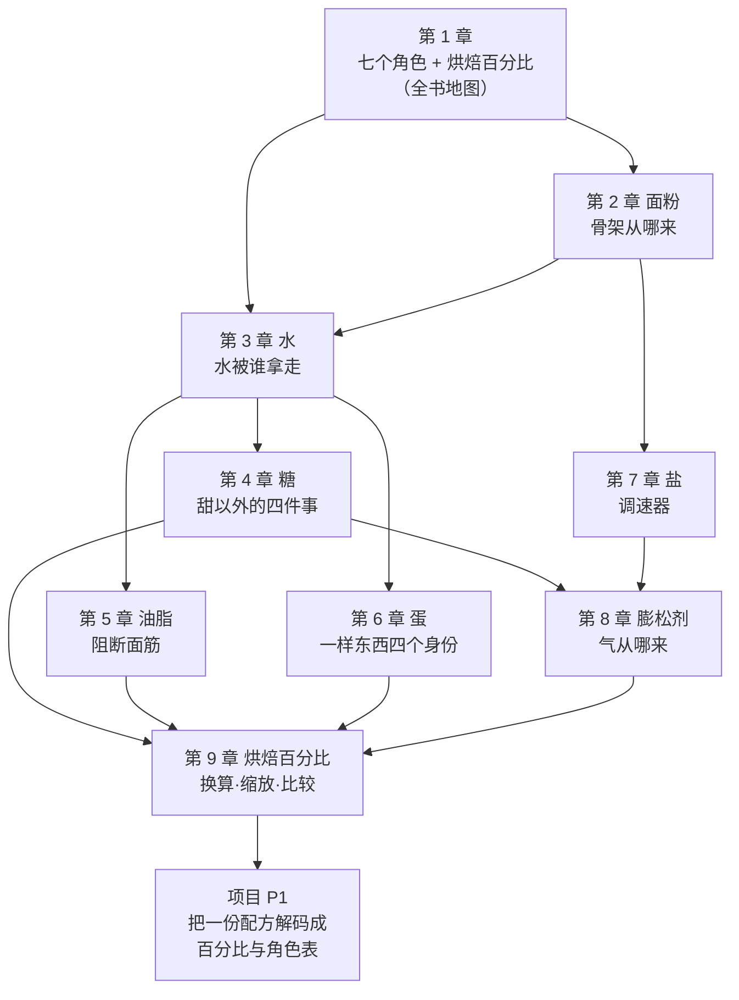

# 第一部分 · 原料各自在做什么

> **这一部分不教任何一款成品。** 它做两件事：
> 把配方里的**七个角色**一个个认清楚，并建立**烘焙百分比**这套记法
> （本书统一约定：**以面粉总量为 100%**）。
> 后面六部分、45 章、所有的工艺和成品，都用这套语言来解释。

## 为什么必须先认角色

如果你只想今天烤出一盘饼干，跳到第六部分照着做也行。
但你会遇到同一个问题：**换了粉、换了糖量、换了烤箱，那套参数就不成立了**。

因为配方给的是**一组比例**，而比例只在特定条件下有效。
条件变了要重算，而"重算"需要知道**这些比例当初是为什么定的**。

更麻烦的是，烘焙和炒菜不一样：

> **炒菜可以边尝边改，烘焙一旦进炉就改不了。**
> 你没有"尝一口再调整"的机会——所有决定必须在进炉之前做完。

所以这一部分回答的是同一个问题的九个侧面：

> **一份配方里的每样东西，到底在干什么？**

答案是：**它们在争同一批资源**——争水、争面筋、争温度窗口、争气。
第 1 章先把七个角色和这套竞争关系整体讲一遍（并用一份饼干配方走完一遍），
第 2~8 章分别把每个角色讲透，第 9 章把烘焙百分比这套记法讲完整。

## 这一部分的地图

图里有两条依赖关系值得说明：

1. **第 3 章「水」被放在很靠前的位置**，因为后面三章（糖、油脂、蛋）
   都是在讲"它们怎么跟水和面筋打交道"——**不先搞清楚水，后面三章都听不懂**。
2. **第 4 章「糖」指向第 8 章「膨松剂」**，因为糖既是酵母的食物、
   又在浓度高时对酵母造成渗透压力——**同一样东西在不同用量下扮演相反的角色**，
   这是全书反复出现的模式。

## 各章一句话

| 章 | 它回答的问题 | 状态 |
|----|------------|------|
| [第 1 章 一份配方里的每样东西在做什么](01-what-each-ingredient-does.md) | 七个角色分别在干什么？怎么把一份配方翻译成百分比？ | ✅ |
| [第 2 章 面粉](02-flour.md) | "高筋 / 低筋"到底说了什么、没说什么？ | ✅ |
| [第 3 章 水](03-water.md) | 同一份配方多加 5% 水，是谁拿走了？ | ✅ |
| [第 4 章 糖](04-sugar.md) | 除了甜，糖还在做哪四件事？ | ✅ |
| [第 5 章 油脂](05-fat.md) | "短化"到底是什么？换成液态油为什么不行？ | ✅ |
| [第 6 章 蛋](06-egg.md) | 减一个蛋，同时减掉了哪四样东西？ | ✅ |
| [第 7 章 盐](07-salt.md) | 为什么 1% 的盐能改变整份面团的节奏？ | ✅ |
| [第 8 章 膨松剂](08-leavening-agents.md) | 三种气源各自适合什么、为什么不能互换？ | ✅ |
| [第 9 章 烘焙百分比](09-bakers-percentage.md) | 怎么把两份来源不同的配方摆到同一把尺子上？ | ✅ |
| [项目 P1](project-P1-decode-a-recipe.md) | 把一份配方完整解码一遍 | ✅ |

## 学完这一部分，你应该能

1. 拿任何一份配方，**逐行**把它换算成烘焙百分比，说出每样原料扮演什么角色；
2. 回答"**动这一项，会先影响谁**"——而不是只能照着原量做；
3. 判断哪些原料**可以少放或换掉**（并说出代价），哪些**动了就是另一个成品**；
4. 把这些判断落到一张[配方解码表](../../forms/recipe-decode.md)上——进炉前先想清楚。

> **诚实说明**：这一部分会出现不少温度、比例和百分比。
> 请注意本书的纪律：**凡是查不到可靠出处的数字，本书不写**；
> 写出来的每个数字都在[出处登记](../../standards.md)里能查到来源与核对状态。
> 你会看到好几个地方写着"这一点学界没有共识"或"这个数字缺乏一手出处"——
> 那不是偷懒，那是这本书想教给你的第二件事：
> **烘焙圈里流传最广的那些说法，很多经不起查。**
