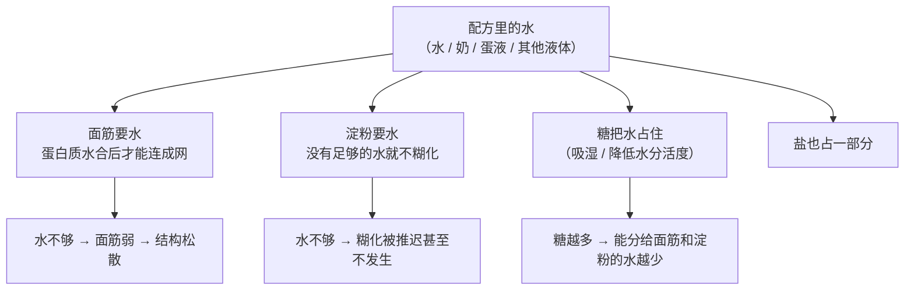
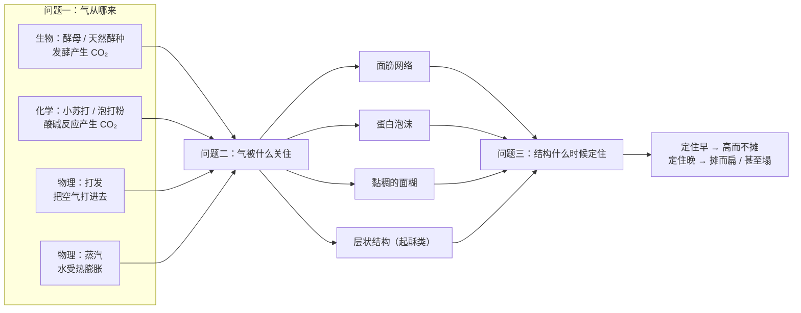
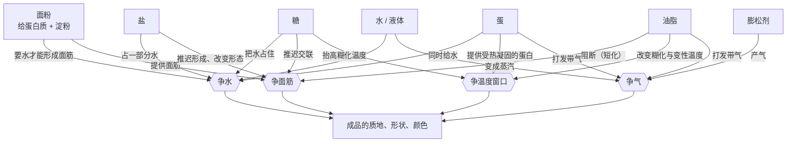

# 第 1 章 一份配方里的每样东西在做什么

> **本章目标**：给你一副"拆解配方"的眼镜。学完这一章，
> 你看任何一份配方的任何一行——200 g 面粉、100 g 糖、80 g 黄油、1 个蛋、2 g 盐、
> 3 g 泡打粉——都能立刻说出它在**扮演什么角色**、**在跟谁争**、
> 以及**动了它会连带影响什么**。
>
> 这是全书**最该反复看**的一章：它不教具体做法，但后面 44 章都用它的语言。

## 1.1 烘焙和炒菜的根本差别

先把最重要的一句话放在前面：

> **炒菜可以边尝边改，烘焙一旦进炉就改不了。**

炒菜的纠错是**在线**的：淡了加盐，酸了加糖，火大了关小，快糊了离火。
你手里始终握着一个反馈回路——尝一口，再决定下一步。

烘焙没有这个回路。面团进炉之后：

- 你**尝不到**（成品是热的、是生的、是没成型的）；
- 你**改不了**（加水加糖已经来不及，搅拌已经结束）；
- 你连**看到**的都是滞后的（等你从颜色上看出问题，事情早已发生）。

所以：

| | 炒菜 | 烘焙 |
|---|------|------|
| 决策发生在 | **过程中随时** | **全部在进炉之前** |
| 出错能不能救 | 大多能 | **基本不能**，只能等下一炉 |
| 功夫下在 | 临场判断 | **配方与操作的事先设计** |
| 反馈周期 | 秒级 | **一炉一次**（常常是几十分钟到一整天） |

这带来一个直接后果，也是这本书存在的理由：

> **烘焙的技能主体不是"手艺"，是"事先把账算清楚"。**
> 而"算账"的对象，就是配方里那几样东西——它们各自在干什么、谁在跟谁抢。

顺带说一句为什么这件事值得学：因为反馈周期长，**靠"多做几次"来学烘焙效率极低**。
一炉失败只给你一个数据点，而且你往往不知道是哪一项导致的。
**看懂原理能让你每一炉都学到东西**——这就是本书想换给你的东西。

## 1.2 配方为什么"看不懂"

拿一份最普通的饼干配方来看，它大概长这样：

> 低筋面粉 200 g，黄油 100 g，细砂糖 100 g，全蛋 1 个，盐 2 g，泡打粉 2 g。

这份配方告诉了你**放多少**，但没告诉你任何一件真正有用的事：

| 你想知道的 | 配方有没有回答 |
|-----------|--------------|
| 糖是不是只为了甜？减一半会怎样？ | ❌ |
| 黄油能不能换成色拉油？ | ❌ |
| 为什么是低筋粉？用中筋会怎样？ | ❌ |
| 蛋在这里干什么？没有蛋能不能做？ | ❌ |
| 2 g 盐这么少，有什么用？ | ❌ |
| 我想做两倍的量，直接乘 2 行不行？ | ❌ |

**配方给的是一组比例，而比例只在特定条件下成立**——特定的面粉、特定的烤箱、
特定的模具、作者特定的口味偏好。配方**不告诉你这组比例当初是为什么定的**，
所以条件一变，你没法重算。

而"重算"需要的不是更多配方，是**一个框架**：知道配方里到底有几个角色，
知道每个角色在跟谁争什么。

在建立这个框架之前，还得先解决一个更基础的问题：
**两份配方怎么比较？**

## 1.3 烘焙百分比：先把配方翻译成可比较的语言

上面那份饼干配方和下面这份，哪个糖更多？

> A：面粉 200 g，糖 100 g　　B：面粉 350 g，糖 140 g

盯着克数看，你会下意识说 B（140 > 100）。但按**比例**看，A 的糖是面粉的 50%，
B 只有 40%——**A 才是那份"甜的、会摊开的"饼干**。

这就是为什么职业烘焙不用克数说话，而用**烘焙百分比**[^1]：

> **把配方里的面粉总量记作 100%，其余每样原料都写成"占面粉重量的百分之多少"。**

| 原料 | A 配方 | A 的烘焙百分比 | B 配方 | B 的烘焙百分比 |
|------|-------|--------------|-------|--------------|
| 面粉 | 200 g | **100%** | 350 g | **100%** |
| 糖 | 100 g | 50% | 140 g | 40% |
| 黄油 | 100 g | 50% | 105 g | 30% |
| 蛋 | 50 g | 25% | 105 g | 30% |

翻译成同一把尺子之后，两份配方的**性格差别**一眼就看出来了：
A 是"高糖高油"的酥脆型，B 是"糖油都收敛、蛋更多"的偏松软型。
**这件事在克数状态下是看不出来的。**

烘焙百分比做到了三件事：

| 它让配方 | 具体是指 |
|---------|---------|
| **可比较** | 任何两份配方摆到同一把尺子上，一眼看出谁糖多、谁水多 |
| **可缩放** | 想做多少就先定面粉克数，其余按比例算——**不会因为"直接乘 2"而出错** |
| **可改** | "糖从 50% 降到 30%"是一句能被执行、也能被复现的话；"少放点糖"不是 |

> **三条必须记住的细节**：
>
> 1. **百分比加起来远大于 100%**，这是正常的——分母是面粉，不是总量。
>    上面 A 配方加起来是 225%。
> 2. **基准必须写明**。有人用面团总重当基准，那样算出来的"糖 50%"完全是另一回事。
>    本书统一用面粉总量，**用别的基准时会当页写明**。
> 3. **有几种粉就加起来当 100%**。全麦粉 30% + 高筋粉 70% = 面粉 100%。

这不是一个"学术记法"，它是**本书全部讨论的前提**。
从这里开始，本书说"糖 50%"就一定指"糖的重量是面粉的一半"。

> 拿到配方先换算，是本书要你养成的第一个习惯。
> 工具见[配方解码表](../../forms/recipe-decode.md)。

## 1.4 七个角色各自在做什么

现在逐一认角色。重点写那些**反直觉**的——
因为直觉对的部分你本来就知道，不需要一本书来讲。

### 面粉：骨架的来源，但骨架不是现成的

面粉提供两样结构材料：**蛋白质**（形成面筋）和**淀粉**（受热糊化）。

第一个反直觉的地方：

> **面粉里没有"面筋"，只有蛋白质。**
> [面筋](../../glossary.md#gluten)[^2]是**加水 + 施加机械作用 + 时间**之后才形成的网络。
> 所以"用了高筋粉"不等于"有了强结构"——你还得真的把它做出来，
> 而配方里的糖和油脂会一直妨碍你做出来（见下）。

第二个反直觉的地方：**面粉能吸多少水，不是只看蛋白质含量。**
研究显示，加入阿拉伯木聚糖会显著提高粉质仪吸水量[^3]与面团形成时间；
加入大麦 β-葡聚糖同样提高吸水量；而**损伤淀粉**[^4]
（碾磨时被机械破坏的淀粉颗粒）吸水远多于完好颗粒。
一个很说明问题的例子：一项研究里的蜡质小麦粉粉质仪吸水量高达 79.5%，
比两种普通小麦粉高出约 20 个百分点，而它的损伤淀粉含量是 10.4%，
另两种分别是 7.0% 和 6.6%。

> **所以"高筋粉吸水多"这句话只对了一半。**
> 吸水量是蛋白质、损伤淀粉、非淀粉多糖三者共同决定的**综合指标**——
> 这也是为什么换一批面粉，同样的水量会突然变得太干或太稀。

第三件事，和成品直接相关：小麦籽粒的**硬度**决定了碾磨行为与面粉颗粒的性质，
进而影响成品。一项经典实验用延时摄影观察饼干在烤箱里的变化，发现：

| 用什么粉 | 成品直径 | 定型时间 | 摊开速率 |
|---------|---------|---------|---------|
| 软质小麦粉 | 184 mm | 5.8 分钟 | 7.8 mm/min |
| 硬质小麦粉 | 161 mm | 5.1 分钟 | 更慢 |

这组数字后面还会用到（§1.6）。现在只需要记住结论的形式：
**换一种粉，改变的不是"筋道程度"这么笼统的东西，而是"什么时候定住"和"摊得多快"。**

### 水：被四方争夺的稀缺资源

水是七个角色里最被低估的一个。它在一份配方里**同时被四方争夺**[^5]：

这张图是全书用得最多的一张。它解释了一件事：

> **"加水"和"减水"的后果，取决于水被谁拿走了。**

一个有数据支持的例子来自饼干体系：研究用"面筋 + 淀粉"重组的模型发现，
饼干最终直径主要取决于"**开始摊开的时间**"，
而这个时间取决于**非面筋成分能分到多少水**。
换句话说，同样是"水少"，在面包里意味着"面筋做不起来"，
在饼干里却意味着"淀粉糊化不了、定型很晚、所以摊得更开"——
**同一个变化，在不同配方里走向相反的结果**。

### 糖：甜只是它的第四重要的功能

这是全章最反直觉的一节。糖在配方里至少做四件与甜无关的事：

| 糖在做什么 | 机制 | 你会看到什么 |
|-----------|------|------------|
| **① 吸湿保湿** | 糖分子把水"占住"（研究把糖抬高糊化温度的原因之一解释为"糖对水的固定"）[^6] | 高糖配方的成品更湿润、更不容易干 |
| **② 抬高淀粉糊化温度** | 糖稳定淀粉的结晶区并占住水 | **定型推迟**——成品有更多时间摊开、膨胀 |
| **③ 推迟面筋交联** | 蔗糖越多，面筋蛋白受热交联被推迟或抑制得越厉害 | 同上：定得更晚 |
| **④ 上色** | 还原糖参与美拉德反应[^7]，糖本身也能焦糖化[^8] | 颜色更深、香味更足 |
| **⑤ 喂酵母 / 也压制酵母** | 低浓度是食物，高浓度造成渗透胁迫[^9] | 甜面团常常发得更慢 |

第 ② 条有**四个互相独立**的实验支持，而且方向一致：
在甘薯淀粉、西米淀粉、**小麦淀粉**与马铃薯淀粉、木薯淀粉上都测到
"**糖浓度越高，糊化温度与糊化焓越高**"，且效应大小顺序基本是
蔗糖 > 葡萄糖 > 果糖 / 甘油这一类。

第 ② 和第 ③ 条合起来，在饼干里被推到了极端。一项专门研究蔗糖对面筋功能影响的工作指出：

> **在饼干这种低水分体系里，蔗糖把淀粉糊化温度抬得太高，
> 以至于烘烤过程中几乎没有淀粉糊化。**
> 同时蔗糖越多，面筋交联被推迟得越厉害，于是**饼干定型更晚、直径更大**。

这就是"糖让饼干摊开"的完整机制——**它跟甜没有关系**。

> **所以"减糖"从来不只是"变淡"**：
> 你同时减掉了保湿、推迟了的定型时间、上色的原料和酵母的食物。
> 减糖之后成品变干、变硬、颜色变浅、发得更快，都是**同一个改动的连带后果**。

### 油脂：它的主要工作是"阻断"

油脂在烘焙里的第一身份不是"香"，也不是"润"，而是**挡在面筋中间**：

> 油脂裹在面粉颗粒与蛋白质表面，**妨碍它们连成连续的面筋网络**，
> 于是口感从"韧、有嚼劲"变成"酥、一咬就断"。
> 英文里把这个作用叫 **shortening**（[短化 / 起酥作用](../../glossary.md#shortening-effect)[^10]），
> 而且直接用同一个词当"起酥油"的名字——足见这个功能有多核心。

它的第二个工作是**带入空气**。一项用 X 射线显微 CT 观察饼干内部结构的研究发现：
油脂用量增加时，孔隙率和气孔尺寸增大，但**气孔壁的厚度不受影响**——
研究者据此判断**油脂主要是在把空气带进去**，而不是改变面团本身的性质；
相比之下，糖会同时影响孔隙率、气孔尺寸和气孔壁厚度。

第三件事最容易被忽略：**它是固态还是液态，决定了它能做什么。**

| | 固态脂肪（黄油、起酥油、冷的） | 液态油（色拉油、融化的黄油） |
|---|------------------------------|---------------------------|
| 能不能打进空气 | 能（打发） | 基本不能 |
| 能不能隔出层 | 能——起酥、千层的前提就是**面团与油脂交替成层** | 不能，会被面团吸收 |
| 阻断面筋 | 能 | 能，而且往往更彻底 |

> **所以"黄油换成等量的油"不是等量替换，是换掉了一个功能**——
> 你保留了"阻断面筋"，但失去了"打发充气"和"隔层"。
> 成品会更扁、更瓷实，这不是你手法的问题。

> ⚠️ **诚实说明**：油脂在面团里的**机理**，学界至今没有统一说法。
> 一篇关于面包中脂质的综述明确写道：关于脂质功能，被广泛接受的观点**常常互相对立**。
> 另一篇较新的综述则把作用总结为：脂质控制搅拌时面筋蛋白的**水合动力学**、
> 影响面筋网络强度、阻止发酵时气室合并，并**改变烘烤时面筋变性与淀粉糊化的温度**。
> 本书因此只写**方向与可复现的现象**，不给机理定论。

### 蛋：一样东西，四个身份

蛋是配方里唯一一个**同时扮演四个角色**的原料，这也是它最难替换的原因：

| 身份 | 它在做什么 | 减掉一个蛋，你同时失去了 |
|------|----------|----------------------|
| **水分** | 蛋的主体是水，它常常是配方里唯一的液体来源 | 一部分液体——面糊会变干变硬 |
| **乳化** | 蛋黄是烘焙中最常用的乳化[^11]来源之一，让油和水均匀分散 | 组织的细腻度，可能出现油水分离 |
| **结构** | 蛋白质受热变性凝固[^12]，成为结构的一部分 | 一部分支撑力 |
| **气泡** | 蛋白（也包括全蛋）能被打发成泡沫[^13] | 膨发的一条路线 |

关于第四个身份，有一条很实用的实验结论：

> **蔗糖会让蛋清更难打起泡，但打起来之后泡沫更稳定**；
> 提高氯化钠含量与延长搅打时间，都能促进蛋白质在气—液界面上的吸附。

这正是许多配方要求"**糖分次加入**"的原因——先让泡沫起来，再靠糖把它稳住。
**这不是"仪式感"，是一个有取舍的顺序问题。**

> **蛋的难替换性是全书第一个"角色重叠"的例子**：
> 当一样原料同时承担四个功能时，任何替换方案都必须**逐个功能去补**，
> 而不是找一个"看起来像蛋"的东西顶上。

### 盐：它是调速器

盐在烘焙里的用量小得惊人——常见的实验档位是面粉基准 **0%、1%、1.5%、2%、3%**，
其中 1.5% 被一项研究描述为意大利面包的**平均含盐量**。
这么少的量，做的却是全局性的事：

**第一，它拖慢酵母。** 一项研究小麦面包丙烯酰胺的工作发现：
NaCl 低于 2%（面粉基准）时抑制酶活、降低丙烯酰胺；
**加得更多时丙烯酰胺反而升高，原因是酵母生长被抑制了**。
这是"盐会拖慢发酵"的一个独立旁证——而且它来自一个原本不研究盐的实验，
所以没有"想证明什么就测到什么"的风险。

**第二，它改变面筋形成的方式**——但**不是简单地"让面筋更强"**：

| 研究观察到 | 说明 |
|-----------|------|
| 加盐（面粉基准 1%、2%）会**推迟**面筋网络的形成 | 共聚焦显微镜在搅拌不同阶段的观察 |
| 搅拌终点形成**拉长的纤维状**蛋白结构，影响面团强度 | 同一研究 |
| 但振荡流变显示加盐后的面筋 **tan δ 更高，即弹性更低** | 另一项专门研究面筋的工作 |

> ⚠️ **这三行要放在一起读**：加盐既"推迟形成"、又"改变结构形态"、
> 在某些指标上还"降低弹性"。所以"**盐能强化面筋**"这句流传很广的话
> **过于简化**了——本书把它放进了下面的辨析栏。

**第三，风味。** 这一条反而是证据最微妙的：一项研究测到不同 NaCl 浓度下
面团中 2-苯乙醇等香气物质**有显著变化**，但感官三角测试显示，
**能被人区分出来的是酵母用量不同的样品，而不是含盐量不同的样品**。

> **所以本书对盐的定位是**：它首先是一个**调速器**[^14]，
> 其次才是调味料。不放盐的面团常常发得更快——
> **但"更快"不等于"更好"**，因为发酵同时也在产生风味前体。

### 膨松剂：气从哪来，以及被什么关住

最后一个角色。它的逻辑其实最简单，可以拆成两个独立的问题：

这张图里最该记住的是**第三个框**：产气和保气都成功了，还有一关是**定型时机**。
有两组观察很能说明这件事：

- 一项用带仪表的中试烤炉研究法棍烘烤的工作发现：**蒸汽有利于膨胀**，
  膨胀最大可达 1.7 倍，出现在**面包芯温度接近 90 °C** 时；
- 一项研究面筋蛋白受热交联[^15]的工作显示：在 80 °C、90 °C、95 °C 保温条件下，
  面筋蛋白通过巯基—二硫键交换继续聚合，速率随温度升高。

合起来就是：**面团的最终结构不是在案板上定的，是在烤箱里定的**，
而且"定住"和"还在涨"这两件事是在同一个温度区间里赛跑。

至于三条膨发路线为什么不能互相替换（尤其是小苏打和泡打粉），
本章先给结论，第二部分详细讲：

> **小苏打是一个碱，它需要配方里本来就有酸；泡打粉自带了酸。**
> 一项研究比较了四种不同的**膨松酸**，发现它们的离子与 pH 相互作用会
> 影响面团性质与静置时间，配方需要专门调整才能把成品 pH 控制在目标区间
> （该研究里是 5.9~6.1）。
> **这说明 pH 本身是被刻意控制的变量**——随便互换必然把它改掉。

## 1.5 七个角色在争同一批资源

把上面七节合起来，就得到本书的核心图：

四组竞争，各自的"赢家"决定了成品是什么：

| 竞争 | 谁在争 | 谁赢了会怎样 |
|------|-------|------------|
| **争水** | 面筋 / 淀粉 / 糖 / 盐 | 面筋赢 → 韧、有嚼劲；糖赢 → 湿润但结构弱；都不够 → 干硬 |
| **争面筋** | 面粉（给） vs 油脂、糖（挡）、盐（改） | 面粉赢 → 面包型；油糖赢 → 酥饼型 |
| **争温度窗口** | 糖抬高糊化温度 / 油脂改变定型温度 / 蛋提供凝固蛋白 | 定得早 → 高而不摊；定得晚 → 摊而扁 |
| **争气** | 产气的 vs 关不住气的 | 关得住 → 蓬松；关不住 → 实、塌 |

> **这就是全书最重要的一句话的来源**：
> **你不是在"优化"某一样原料，你是在为这四组竞争排优先级。**

## 1.6 当场演示一次：同一份饼干，改糖 / 改油 / 改粉

理论讲完了，现在**真的改一次配方**。用 §1.2 那份饼干：

> 面粉 100%（200 g，低筋）、黄油 50%、糖 50%、蛋 25%、盐 1%、泡打粉 1%

### 改糖：50% → 30%

**它抢走了谁的什么？** 糖减少 → 被糖占住的水被**释放出来** → 面筋能形成得更多；
同时糊化温度被抬得没那么高、面筋交联也不再被推迟得那么厉害 → **定型提前**。

**预测的结果**（依据是 §1.4 里那条"蔗糖越多，定型越晚、直径越大"的实验结论）：

| 方面 | 会怎么变 | 为什么 |
|------|---------|--------|
| 形状 | **摊得更小、更厚** | 定型提前，可摊开的时间变短 |
| 质地 | 更硬、更"有韧劲"而不是酥 | 释放出来的水给了面筋 |
| 湿润度 | **更干、更容易放硬** | 失去了糖的保湿 |
| 颜色 | **更浅** | 能参与褐变的糖变少 |

### 改油：50% → 70%

**它抢走了谁的什么？** 油脂增加 → 更彻底地阻断面筋 → 结构更弱；
同时按那项 X 射线显微 CT 研究的结论，**油脂主要在带入空气**，
孔隙率与气孔尺寸增大，但气孔壁厚度不变。

**预测的结果**（依据是那项"糖 17.6~31.2%、油脂 8.7~15.8% 范围内，
糖或油脂越多，饼干直径越大、厚度越小"的研究，本书**只用它的方向**）：

| 方面 | 会怎么变 | 为什么 |
|------|---------|--------|
| 形状 | **摊得更大、更薄** | 结构更弱，撑不住 |
| 质地 | 更酥、更容易碎 | 面筋被阻断得更彻底 |
| 内部 | 更多气孔 | 油脂带入更多空气 |
| 手感 | 面团更软、更难成型 | 固态脂肪多了，温度一高就塌 |

### 改粉：低筋 → 高筋

**它抢走了谁的什么？** 蛋白质更多 → 在同样的水量下，面筋抢到更多水 →
留给淀粉与糖的水更少；同时面筋本身更能撑。

**预测的结果**（依据是 §1.4 那组软质粉 184 mm / 硬质粉 161 mm 的对照，
以及"面筋加得越多，饼干摊开越小、开始摊开的时间越晚"的模型实验）：

| 方面 | 会怎么变 | 为什么 |
|------|---------|--------|
| 形状 | **摊得更小** | 结构更强，定型时间与摊开速率都被改变 |
| 质地 | 更硬、更韧，不再"一咬就断" | 面筋网络更完整 |
| 口感评价 | 很可能"**不好吃**"，但不是因为"高筋粉不好" | 而是因为**这份配方的目标是酥**，你给了它一个反目标的材料 |

> ⚠️ **必须诚实说明一件事**：面粉蛋白质在饼干品质中到底扮演什么角色，
> **学界并没有共识**——一篇相关综述明确这么写。
> 上面的预测方向有实验支持，但**不要把它当成精确的定量规律**。
> 本书在这类地方一律写"方向可靠，定量存疑"。

### 三次改动，同一个问法

把三张表并起来看，你会发现它们的结构完全一样：

**这就是"自己改配方"的全部动作。** 它不需要天赋，需要的是每次改动前
花五分钟把这五格填掉——填在[配方解码表](../../forms/recipe-decode.md)里。

## 1.7 常见说法辨析

按本书约定标注**证据强度**：✅ 有共识 / ⚠️ 有争议 / ❌ 明确错误 / 缺乏证据。
来源见[出处登记](../../standards.md)。

| 说法 | 判定 | 说明 |
|------|------|------|
| "**面团必须揉出手套膜**" | ❌ **作为通用标准明确错误**；作为某类面包的判据**缺乏一手出处** | 两个层面都有问题。第一，**大量成品恰恰要求不要发展面筋**：饼干、酥皮、司康、派皮靠的是油脂阻断面筋（短化）。模型实验显示面筋越多、饼干摊开越小；面筋为零时摊得最大但结构不可接受——说明面筋是**按需要调到某个量**，不是越多越好。第二，本书检索时**没有找到"手套膜"对应的学术表述或一手实验依据**，它是一条工艺口语。**作为某些面包的经验判据可以用，别当成所有面团的标准** |
| "**泡打粉和小苏打可以互换**" | ❌ **明确错误** | 小苏打（碳酸氢钠）是**碱**，需要配方里本来就有酸才能产气；泡打粉是"碱 + 酸"的预混物。一项研究比较了四种膨松酸（磷酸铝钠、硫酸铝钠、磷酸二氢钙、酸式焦磷酸钠），发现它们的离子与 pH 相互作用会影响面团性质与静置时间，配方要专门调整才能把成品 pH 控制在目标区间（该研究里是 5.9~6.1）。另一项研究显示换用碳酸氢铵还是碳酸氢钠会改变饼干的褐变与 HMF 生成。**pH 是被刻意控制的变量，随便互换必然改掉它**——多出来的碱会留下涩味并让颜色偏深 |
| "**戚风塌了一定是没倒扣**" | ⚠️ **"一定"是错的**；倒扣本身**缺乏一手出处** | 塌陷至少有三条互相独立的路径：①**没撑起来**（产气或保气出了问题）；②**撑起来了没定住**（定型太晚——糖太多、水太多、炉温不足都会推迟定型）；③**定住了但结构太弱**。倒扣只针对第三类里"出炉后被自重压塌"这一种情形。本书**没有核到关于倒扣的一手实验**，所以把它作为**行业惯例**处理。**正确的做法是先分诊三条路径，而不是直接归因到一个动作** |
| "**黄油必须软化到室温**" | ⚠️ **只对一部分做法成立**，对起酥类是**明确错误** | 取决于你要黄油做什么：**打发法**需要它是"能压出指印"的固态（太硬打不进空气，化了就打不起来）；**起酥类**恰恰需要它**冷而硬**——起酥的前提是面团与油脂**交替成层**，油一软就被面团吸收，层就没了；**融化黄油**的配方（很多马芬、布朗尼）则根本不需要打发。**问"这份配方要黄油干什么"，比问"要不要软化"有用得多** |
| "**高筋面粉做什么都更好**" | ❌ **明确错误** | "更高的蛋白质"只在"需要强结构"时是优点。同一份饼干配方换成高蛋白粉，实验方向是**摊得更小、更硬**——对以"酥"为目标的成品是反目标的。而且高筋粉**抢水更多**，在水本来就紧张的配方里会让淀粉与糖更缺水。此外，"能吃多少水"由蛋白质、损伤淀粉、非淀粉多糖共同决定，**不是蛋白质含量的同义词** |
| "**烤箱温度按配方写的就行**" | ⚠️ **作为起点可以，作为依据不行** | 配方作者的烤箱不是你的烤箱。注意专业研究是怎么做的：研究法棍烘烤时在面团里**埋热电偶实测芯温**；验证面包烘烤杀菌时把烤箱设在 218.3 °C 却**另行测量面包芯温**。也就是说，**连研究者都不把设定值当作实际温度**。⚠️ 本书**没有核到家用烤箱温度偏差的公开测量数据**，所以不给"通常偏低多少"这类数字——**请自己测**（第五部分项目 P3） |
| "**盐能强化面筋**" | ⚠️ **过于简化** | 有研究观察到加盐（面粉基准 1%、2%）会**推迟**面筋网络形成，并在搅拌终点形成拉长的纤维状结构、影响面团强度；但另一项专门研究面筋的工作用振荡流变测到加盐后 **tan δ 更高，即网络弹性更低**。**"更强"是个笼统词**，把"形成速度""结构形态""弹性""延展性"混成一谈。本书的写法是：**盐改变了面筋形成的方式与节奏**，具体后果取决于你测哪个指标 |
| "**盐会杀死酵母，绝对不能直接接触**" | ⚠️ **方向有依据，"绝对"是过度推广** | 盐拖慢酵母有独立旁证：一项丙烯酰胺研究发现 NaCl 超过 2%（面粉基准）后丙烯酰胺升高，**原因正是酵母生长被抑制**；机制上，高浓度盐与高浓度糖一样属于**渗透胁迫**（一项全基因组筛选显示，对高蔗糖敏感的酵母突变体绝大多数同时对高浓度氯化钠敏感）。但"短暂直接接触就会杀死酵母"这一具体说法，本书**未核到一手证据**。更重要的是：**正常配方里的盐量本来就是用来拖慢它的**——这是设计，不是事故 |
| "**糖只是甜味剂，减糖就是变淡一点**" | ❌ **明确错误** | 减糖同时改掉五件事：保湿、糊化温度、面筋交联的推迟、上色、酵母的食物与渗透环境。有四项独立研究在不同淀粉（含小麦淀粉）上测到"糖越多，糊化温度越高"；另有研究指出在饼干这类低水分体系里，蔗糖把糊化温度抬到**几乎不发生糊化**的程度，并推迟面筋交联、让饼干定型更晚、直径更大。**所以减糖的成品会更小、更硬、更干、颜色更浅**——这些都不是"变淡"能概括的 |
| "**面包第二天变硬，是因为水跑光了**" | ❌ **不全对** | 主流解释是**支链淀粉重结晶（回生）**，并伴随水分在面筋与淀粉之间、以及面包心与面包皮之间**再分配**——水被结合进淀粉微晶里，而不是消失了。一项研究把白面包在 25 °C 密封储存两周：**带皮储存**的样品含水量与水分活度显著下降、七天后明显更硬、支链淀粉重结晶更多；**不带皮**的含水量基本不变。**所以"变硬"和"变干"是两件相关但不相同的事** |

## 1.8 贯穿全书的第一原理

现在可以把这一章收敛成一条规则了。它适用于你以后遇到的**每一份**配方：

> ## 一份配方是几组竞争关系的配平。改动任何一项之前，先问：**它会抢走谁的什么？**
>
> 具体是三个问题，顺序不能换：
>
> **① 角色**：这样原料在**这份**配方里扮演什么角色？（常常不止一个）
> **② 争夺**：它在跟谁争？（争水 / 争面筋 / 争温度窗口 / 争气）
> **③ 定型**：改动之后，"定住"这件事会**提前**还是**推迟**？

三个问题的展开：

| 问题 | 怎么回答 | 例子（饼干减糖） |
|------|---------|----------------|
| ① 它扮演什么角色 | 用**动词**列出来，不要只写名词 | 糖：占住水 / 推迟定型 / 上色 / 增甜 |
| ② 它在跟谁争 | 对照 §1.5 的四组竞争，逐条看 | 主要是**争水**和**争温度窗口** |
| ③ 定型会提前还是推迟 | 这是烘焙特有的、也是最关键的一问 | 糖变少 → 糊化温度回落、面筋交联不再被推迟 → **定型提前** |

**为什么第 ③ 问单独拎出来**：因为烘焙的一切最终都收束到同一件事上——

> **"什么时候定住"决定了成品长什么样。**
>
> 定得早 → 该膨的还没膨完就被固定住 → **高、厚、不摊**；
> 定得晚 → 有充足时间膨胀和摊开，但也可能撑不住 → **大、扁、甚至塌**。
>
> 这就是为什么"改一样东西，形状也跟着变"——
> 你以为你改的是味道，实际上你改的是**定型时刻**。

> **这就是"自己改配方"的全部内容。** 你不需要记住 100 份配方，
> 你需要的是每次改动前花五分钟回答这三个问题——
> 填在[配方解码表](../../forms/recipe-decode.md)里，烤完记一句复盘到
> [烘焙记录表](../../forms/bake-log.md)。
> 十炉之后，你对自己的烤箱和面粉的了解，会超过任何一份配方的作者。

## 1.9 后面六部分怎么服务这个框架

本书剩下的部分，都是在把某个角色讲细，或把几组竞争合起来用：

| 部分 | 主要服务哪一组竞争 | 它回答的问题 |
|------|------------------|------------|
| 一（本部分，第 2~9 章） | **七个角色本身** | 面粉、水、糖、油、蛋、盐、膨松剂各自的机理；烘焙百分比怎么用 |
| 二（第 10~15 章） | **争气** | 生物 / 化学 / 物理三条膨发路线：气从哪来、被什么关住 |
| 三（第 16~21 章） | **争面筋 + 争温度窗口** | 面筋、淀粉糊化、蛋白凝固、脂肪结晶：结构怎么立住、什么时候定住 |
| 四（第 22~27 章） | **操作层面的所有竞争** | 搅拌方式、温度控制、发酵、整形——配方之外你还能动的旋钮 |
| 五（第 28~33 章） | **争温度窗口**（外部条件） | 炉内传热、炉温标定、蒸汽、模具、**用内部温度和状态判断熟成** |
| 六（第 34~40 章） | **四组竞争合起来** | 逐类拆解成品，每步标注对应原理，并给变体推演 |
| 七（第 41~45 章） | **配平本身** | 配方平衡、替换规则与代价、失败诊断手册、保存与老化 |

完整章节清单见[学习路线图](../../roadmap.md)。

## 1.10 🔎 下次烤之前的用处

这一章能让你**下一炉**就少犯的几个错：

1. **动手前先把配方换算成烘焙百分比**。五分钟的事，但它会立刻告诉你
   "这份配方到底是什么性格"——高糖高油的就别指望它不摊。
2. **想改一样东西时，先问"它抢走了谁的什么"**，再问"定型会提前还是推迟"。
   这两问能挡掉绝大多数"改完变成另一个东西"的意外。
3. **一次只改一个变量**。一次改三样，你永远不知道是哪一样起了作用——
   而烘焙的反馈周期又那么长，浪费不起。
4. **别把"高筋"当成"更好"**。先问这份配方要的是"韧"还是"酥"。
5. **黄油的状态是一个变量，不是一句废话**。
   打发要能压出指印的固态，起酥要冷硬，融化黄油的配方两者都不需要。
6. **别只看时间**。配方里的时间来自作者的烤箱，不是你的。
   下次给自己加一条记录：**出炉时你实际看到 / 测到了什么**。
7. **不要尝生面团、生面糊**。美国 FDA 明确指出，关注的病原体是沙门氏菌与致病性大肠杆菌，
   "把生谷物加工成面粉并不会杀死有害细菌"，而"**烹熟是确保用面粉和生蛋做的食物安全的唯一方法**"；
   该指引还提醒**不要自己在家做"热处理面粉"**，家用方法可能杀不干净。
   ⚠️ 各国口径可能不同，以自己所在地现行发布为准。

## 1.11 思考题

1. 用你自己的话说明：**为什么烘焙必须"事先把账算清楚"，而炒菜不必**？
   这个差别对"怎么学"提出了什么要求？
2. 一份配方写着"面粉 300 g、水 210 g、盐 6 g、酵母 3 g"。
   把它换算成烘焙百分比（写明基准）。然后回答：
   如果你想做一半的量，但手边只有 180 g 面粉，其余各是多少克？
3. 本章说"糖至少做四件与甜无关的事"。逐条说出是哪四件，
   并解释**为什么把糖从 50% 降到 30% 会让饼干摊得更小**——要说到"定型"这一步。
4. 油脂在饼干里有两个不同的工作。分别是什么？
   为什么"黄油换成等量的色拉油"会丢掉其中一个？
5. **【案例】** 一份戚风蛋糕配方：面粉 100%、糖 100%、蛋 200%、油 60%、牛奶 60%。
   你想减糖到 60%，其余不动。请按第一原理的三个问题回答：
   （a）糖在这份配方里扮演哪些角色？（b）它在跟谁争？
   （c）定型会提前还是推迟？成品**最可能**出现什么变化？
   另外回答：**蛋白打发**这一环节会不会受影响？为什么？
6. **【案例】** 有人照着配方做饼干，结果"摊成了一大片薄饼"。
   他手上的信息是：用了融化的黄油、糖没有减、面粉是低筋、烤箱温度按配方设定没测过。
   请列出**至少三条**可能原因，分别属于四组竞争中的哪一组，
   并给出一个**一次只改一个变量**的排查顺序。
7. **【辨析】** "面团必须揉出手套膜"——判断它的证据强度，
   说明它**为什么流传这么广**，并指出至少两类**不应该**这么做的成品。
8. **【辨析】** "泡打粉用完了，用等量小苏打代替"——
   说明这样做会改变什么（至少两项），以及你会怎么设计一个在家就能做的对照实验来验证。
9. 本章在好几处写了"这一点学界没有共识"或"本书没有核到一手出处"。
   挑出其中两处，说明**如果本书硬写一个数字，读者会付出什么代价**。

> 📖 **参考答案**（想清楚再看）：[Q1](../../qa/01-what-each-ingredient-does-qa.md#q1) ·
> [Q2](../../qa/01-what-each-ingredient-does-qa.md#q2) · [Q3](../../qa/01-what-each-ingredient-does-qa.md#q3) ·
> [Q4](../../qa/01-what-each-ingredient-does-qa.md#q4) · [Q5](../../qa/01-what-each-ingredient-does-qa.md#q5) ·
> [Q6](../../qa/01-what-each-ingredient-does-qa.md#q6) · [Q7](../../qa/01-what-each-ingredient-does-qa.md#q7) ·
> [Q8](../../qa/01-what-each-ingredient-does-qa.md#q8) · [Q9](../../qa/01-what-each-ingredient-does-qa.md#q9)

## 1.12 本章实操

本章的实操**主菜是 🅐 档**——因为本章讲的是"想清楚"，而想清楚不需要烤箱。

### 🅐 零成本版 · 任务一：把三份配方换算成烘焙百分比并对比

找**三份同类成品**的配方（都做饼干，或都做吐司，别混），
换算成烘焙百分比填进下表。**基准统一用面粉总量为 100%。**

| 原料 | 配方 A | 配方 B | 配方 C |
|------|-------|-------|-------|
| 面粉（写清品类） | 100% | 100% | 100% |
| 液体（水/奶/其他） | | | |
| 糖 | | | |
| 油脂（固态/液态） | | | |
| 蛋 | | | |
| 盐 | | | |
| 膨松剂 | | | |

填完回答四个问题：

| 问题 | 你的答案 |
|------|---------|
| 差得最多的是**哪一项**？差多少个百分点？ | |
| 按本章的原理，这个差别会导致成品有什么不同？（说形状 / 质地 / 颜色） | |
| 哪一份配方**定型最晚**？你的依据是什么？ | |
| 如果只能选一份来做，你选哪份？为什么？ | |

> 这个练习最常见的收获是：**你会发现三份"看起来差不多"的配方，
> 糖或油脂能差 20 个百分点以上**——而那正是成品差别的主要来源。

### 🅐 零成本版 · 任务二：读一份商品面包的配料表，反推工艺

去厨房或超市找一包**带配料表**的商品面包（吐司、软欧包都行），把配料表抄下来。
配料表通常按含量从高到低排列，这给了你一个**粗略的顺序信息**。

| 观察 | 你的记录 |
|------|---------|
| 配料表前三位是什么？ | |
| 有没有糖？排在第几位？ | |
| 油脂是什么形式？（黄油 / 起酥油 / 植物油 / 人造奶油） | |
| 有没有你不认识的成分？（乳化剂、酶制剂、改良剂一类） | |
| 你猜它是靠什么膨发的？依据是什么？ | |
| 它标称的保质期是多久？和你自己烤的面包比呢？ | |

然后回答：

| 问题 | 你的答案 |
|------|---------|
| 如果糖排得很靠前，按本章原理，这包面包应该**更湿润还是更干**？为什么？ | |
| 你不认识的那些成分，猜猜看它们可能在解决哪一组竞争的问题？ | |

> ⚠️ **诚实说明**：配料表**只给顺序不给比例**，所以这个练习是**猜**，不是**测**。
> 它的价值在于让你养成"看到一样原料就问它在干什么"的反射，
> 而不是让你真的推出人家的配方。**分清"推测"和"证据"，是本书反复要教的一课。**

### 🅐 零成本版 · 任务三：写一份"改糖 20%"的预测

挑一份你**想做但还没做**的配方，填下面这张表。**只写预测，先不做。**

| 项 | 填写 |
|----|------|
| 配方名称与糖的当前百分比 | 例：某饼干，糖 50% |
| 我要把糖改成多少？ | 例：降到 30%（减 20 个百分点） |
| **它抢走了谁的什么**？（改之后被松开的是谁） | |
| 定型会**提前**还是**推迟**？为什么？ | |
| 预测 ①：形状会怎么变？ | |
| 预测 ②：质地会怎么变？ | |
| 预测 ③：颜色会怎么变？ | |
| 有没有需要**连带**改的？（时间？温度？液体量？） | |

> **把这张表存起来。** 等你哪天真做了，回来对照——
> **对照的那一刻，才是你真正学到东西的时刻。**

### 🅑 开火版 · 任务四：同一份饼干面团，只改糖（有烤箱时做）

**这是一个单一变量对照实验**，目的是让你亲眼看到"定型时刻"这件事。

**需要**：任意一份你做过的饼干配方、厨房秤（**关键**，不能用量勺）、
两个碗、同一个烤盘（或两个相同的烤盘）、尺子或卡尺、计时器、纸笔。

**做法**：把配方做成**两份小批量**，**唯一的差别是糖的百分比**（例如 50% vs 30%），
其余原料、搅拌方式、面团厚度、每块的重量、烤盘位置、炉温、时间**全部保持一致**。

> **两个必须做到的控制点**：
> ① 每块面团**称同样的重量**（例如各 15 g），否则大小差别说明不了任何事；
> ② 两组**同时进炉**（放在同一个烤盘的左右两半，并标记好哪边是哪组）。

| 组 | 糖的百分比 | 出炉直径 | 出炉厚度 | 颜色（浅/中/深） | 质地（酥/硬/韧） | 第二天的软硬 |
|----|----------|---------|---------|----------------|----------------|------------|
| ① 原配方 | | mm | mm | | | |
| ② 减糖 | | mm | mm | | | |

做完回答：

| 问题 | 你的答案 |
|------|---------|
| 两组的**直径**差多少？方向和本章的预测一致吗？ | |
| 两组的**颜色**差多少？为什么会差？ | |
| 放到第二天，哪一组更硬？用"糖的保湿"来解释 | |
| 这次实验的**局限**是什么？ | |

> 最后一问最重要。提示：样本量小、没有重复、两组面团的**温度**可能不同、
> 你的烤箱左右两半温度可能也不一样（这正是第五部分项目 P3 要解决的问题）。
> **能说出自己实验的局限，是本书希望你带走的核心习惯。**

### 🅑 开火版 · 任务五（加分）：只改黄油的状态

**需要**：同一份配方、同样的黄油、一个能测温度的工具（有就用，没有就记手感）。

**唯一变量**：黄油下手时的状态。

| 组 | 黄油状态 | 面团手感 | 出炉直径 | 出炉厚度 | 内部气孔（多/少） |
|----|---------|---------|---------|---------|-----------------|
| ① 冷藏取出、硬（能切成小块） | | | | | |
| ② 室温、能压出指印 | | | | | |
| ③ 完全融化成液体 | | | | | |

回答：

| 问题 | 你的答案 |
|------|---------|
| 哪一组内部气孔最多？和"油脂主要在带入空气"这个结论一致吗？ | |
| 哪一组摊得最开？为什么？ | |
| 如果你只想让饼干**更厚更酥**，你会选哪一组？还会连带改什么？ | |

> ⚠️ **安全提醒**：**不要尝生面团、生面糊**（美国 FDA：生面粉不是即食食品，
> "把生谷物加工成面粉并不会杀死有害细菌"）；生面粉与生蛋要和即食食物分开放；
> 做完把手、盆、台面都洗干净。各国口径可能不同，以自己所在地现行发布为准。
> 本章用到的来源见[出处登记](../../standards.md)。

## 1.13 本章依据

本章引用的来源与核对状态详见[参考书目与出处登记](../../standards.md)，具体对应如下：

| 本章用到的内容 | 依据 |
|--------------|------|
| 烘焙百分比这套记法（面粉总量为 100%） | 职业烘焙教材的通行约定（Gisslen《Professional Baking》、Suas《Advanced Bread and Pastry》、Figoni《How Baking Works》）。✅ 书目已核（Open Library）；**它是约定，不是需要实验证据的主张** |
| 粉质仪吸水量受阿拉伯木聚糖 / β-葡聚糖影响 | *Food Chemistry* 1995 阿拉伯木聚糖研究、*Food Chemistry* 2010 β-葡聚糖研究，✅ 摘要层面 |
| 蜡质小麦粉吸水量 79.5%、比野生型高约 20 个百分点；损伤淀粉 10.4% / 7.0% / 6.6% | *Cereal Chemistry* 2003 蜡质小麦粉研究，✅ 摘要层面 |
| 损伤淀粉降低糊化起始温度 | *European Food Research and Technology* 2006 损伤淀粉研究，✅ 摘要层面 |
| 籽粒硬度影响碾磨行为与成品品质 | *Comprehensive Reviews in Food Science and Food Safety* 2013 籽粒硬度综述，✅ 摘要层面 |
| 软质粉 184 mm / 硬质粉 161 mm；定型时间 5.8 / 5.1 分钟；摊开速率 7.8 mm/min | *Cereal Chemistry* 1997 硬质小麦粉与饼干摊开研究，✅ 摘要层面 |
| 饼干最终直径取决于"开始摊开的时间"，而该时间取决于非面筋成分分到多少水；面筋越多摊得越小 | *Journal of Cereal Science* 2008 面筋—淀粉重组体系研究，✅ 摘要层面 |
| 面粉蛋白质在饼干品质中的作用**学界无共识** | *Critical Reviews in Food Science and Nutrition* 2008 综述，✅ 摘要层面 |
| 糖抬高淀粉糊化温度与糊化焓（四项独立研究，含小麦淀粉）；"糖固定住水"这一机制解释 | *JAFC* 1991 甘薯淀粉、*Biopolymers* 1999 西米淀粉、*Carbohydrate Polymers* 2007 小麦与马铃薯淀粉、*Journal of Food Engineering* 2013 木薯淀粉，✅ 均为摘要层面 |
| 饼干体系中蔗糖把糊化温度抬到几乎不糊化；蔗糖推迟面筋交联 → 定型更晚、直径更大 | *JAFC* 2009 蔗糖对饼干中面筋功能的研究，✅ 摘要层面 |
| 糖或油脂越多，饼干直径越大、厚度越小；油脂主要在带入空气（孔隙率与气孔尺寸增大、气孔壁厚度不变） | *Journal of Food Engineering* 2009 糖与油脂在糖酥饼干中的作用，✅ 摘要层面。⚠️ 原文未在摘要中写明百分比基准，**本章只用方向不用绝对数字** |
| 脂质机理"被广泛接受的观点常常互相对立" | *Journal of Cereal Science* 2011 面包脂质综述，✅ 摘要层面 |
| 脂质控制面筋水合动力学、影响网络强度、阻止气室合并、改变烘烤时的变性与糊化温度 | *Comprehensive Reviews in Food Science and Food Safety* 2026 小麦粉脂质综述，✅ 开放获取 |
| 起酥类需要面团与油脂**交替成层**，靠蒸汽撑开；⚠️ 确切机制仍不清楚 | *Critical Reviews in Food Science and Nutrition* 2016 多层面团—油脂体系综述，✅ 摘要层面 |
| 蔗糖让蛋清更难起泡但泡沫更稳定；NaCl 与搅打时间促进界面吸附 | *Food Research International* 2007 蛋清起泡研究，✅ 摘要层面 |
| 麦醇溶蛋白表面活性高、出现在气室壁；麦谷蛋白几乎无表面活性 | *Journal of Cereal Science* 2004 共聚焦显微镜研究，✅ 摘要层面 |
| 盐推迟面筋网络形成、形成纤维状结构（面粉基准 0 / 1% / 2%；两种粉蛋白质 9.0% 与 13.5%） | *Journal of Cereal Science* 2013 NaCl 与面筋网络形成研究，✅ 摘要层面 |
| 加盐后面筋 tan δ 更高（弹性更低） | *Journal of Cereal Science* 2014 NaCl 与面筋流变研究，✅ 摘要层面 |
| 实验常用盐档位 0 / 1.5% / 3.0%；1.5% 是意大利面包平均含盐量 | *Foods* 2020 氯化钠与软质小麦面团研究（开放获取），✅ |
| NaCl 超过 2% 时丙烯酰胺升高，原因是酵母生长被抑制 | *Journal of Cereal Science* 2008 面包丙烯酰胺研究，✅ 摘要层面 |
| 不同含盐量下香气物质有显著变化，但感官上能被区分的是酵母用量不同的样品 | *Foods* 2017 NaCl 与面包香气研究（开放获取），✅ |
| 高浓度糖对酵母是渗透胁迫（对高蔗糖敏感的突变体多数同时对 NaCl 敏感） | *FEMS Yeast Research* 2006 全基因组筛选，✅ 摘要层面 |
| 四种膨松酸的离子与 pH 相互作用影响面团；成品 pH 调到 5.9~6.1 | *Cereal Chemistry* 2000 膨松酸与玉米饼研究，✅ 摘要层面 |
| 换用碳酸氢铵 / 碳酸氢钠会改变饼干褐变与 HMF 生成；水分活度 0.4 是临界点 | *European Food Research and Technology* 2008 膨松剂与 HMF 研究，✅ 摘要层面 |
| 蒸汽有利于膨胀，最大膨胀约 1.7 倍，出现在面包芯温度接近 90 °C 时 | *Journal of Food Engineering* 2005 带仪表中试烤炉研究，✅ 摘要层面 |
| 面筋蛋白在 80 / 90 / 95 °C 下通过巯基—二硫键交换继续聚合，速率随温度升高 | *JAFC* 2008 麦醇溶蛋白—麦谷蛋白交联动力学研究，✅ 摘要层面 |
| 研究者把烤箱设在 218.3 °C 但**另行实测面包芯温**；法棍研究在面团里埋热电偶 | *Journal of Food Protection* 2016 烘烤杀菌验证研究、*Journal of Food Engineering* 2005 中试烤炉研究，✅ 摘要层面 |
| 面包变硬主要是支链淀粉回生 + 水分再分配；带皮储存比不带皮更硬、重结晶更多（25 °C、两周） | *CRFSFS* 2003 与 2014 老化综述、*Cereal Chemistry* 2000 水分再分配研究，✅ 摘要层面 |
| 生面粉与生面团的安全：沙门氏菌与致病性大肠杆菌；"加工成面粉不杀菌"；"烹熟是唯一确保安全的方法"；不要自己热处理面粉 | 美国 FDA「Handling Flour Safely: What You Need to Know」，✅ 已核到官方页面。⚠️ 各国口径不同 |
| 家用烤箱温度偏差的定量数据 | ⚠️ **未核到**公开测量数据，本章只写"请自己测"，不写偏差数字 |
| "手套膜"的学术对应 | ⚠️ **未找到**；按工艺口语处理 |
| "戚风必须倒扣"的一手实验 | ⚠️ **未找到**；按行业惯例处理 |

[^1]: [烘焙百分比](../../glossary.md#bakers-percentage)（baker's percentage）。
[^2]: [面筋](../../glossary.md#gluten)（gluten）与[麦谷蛋白 / 麦醇溶蛋白](../../glossary.md#glutenin-gliadin)（glutenin / gliadin）。
[^3]: [粉质仪吸水量](../../glossary.md#farinograph-water-absorption)（farinograph water absorption）。
[^4]: [损伤淀粉](../../glossary.md#damaged-starch)（damaged starch）。
[^5]: [争水](../../glossary.md#water-competition)（water competition）与[水合](../../glossary.md#hydration)（hydration）。
[^6]: [吸湿性](../../glossary.md#hygroscopicity)（hygroscopicity）、[水分活度](../../glossary.md#water-activity)（water activity）与[淀粉糊化](../../glossary.md#gelatinization)（starch gelatinization）。
[^7]: [美拉德反应](../../glossary.md#maillard)（Maillard reaction）与[还原糖](../../glossary.md#invert-sugar)（reducing sugar）。
[^8]: [焦糖化](../../glossary.md#caramelization)（caramelization）。
[^9]: [渗透胁迫](../../glossary.md#osmotic-stress)（osmotic stress）与[发酵](../../glossary.md#fermentation)（fermentation）。
[^10]: [短化 / 起酥作用](../../glossary.md#shortening-effect)（shortening effect）与[固态脂肪 / 液态油](../../glossary.md#solid-fat)（solid fat / liquid oil）。
[^11]: [乳化](../../glossary.md#emulsification)（emulsification）。
[^12]: [蛋白质变性与凝固](../../glossary.md#denaturation)（protein denaturation / coagulation）。
[^13]: [充气 / 打发](../../glossary.md#aeration)（aeration）与[泡沫稳定性](../../glossary.md#foam-stability)（foam stability）。
[^14]: [控速](../../glossary.md#rate-control)（rate control）。
[^15]: [受热交联](../../glossary.md#crosslinking)（heat-induced cross-linking）、[炉内膨胀](../../glossary.md#oven-spring)（oven spring）与[定型](../../glossary.md#setting)（setting）。

---

**下一章**：第 2 章 面粉——蛋白质、面筋、淀粉、灰分与损伤淀粉。
这一章给了你七个角色的地图，接下来要把第一个角色拆开：
"高筋 / 低筋"这两个词到底说了什么、又漏掉了什么。
