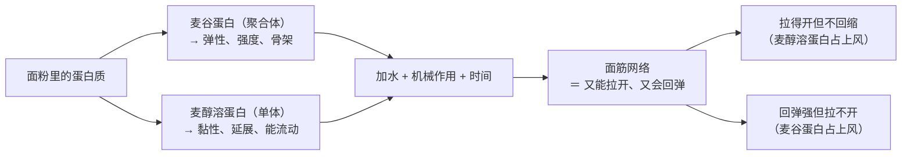
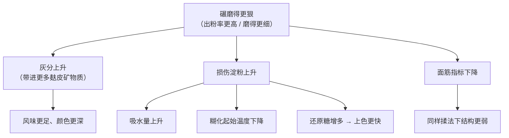
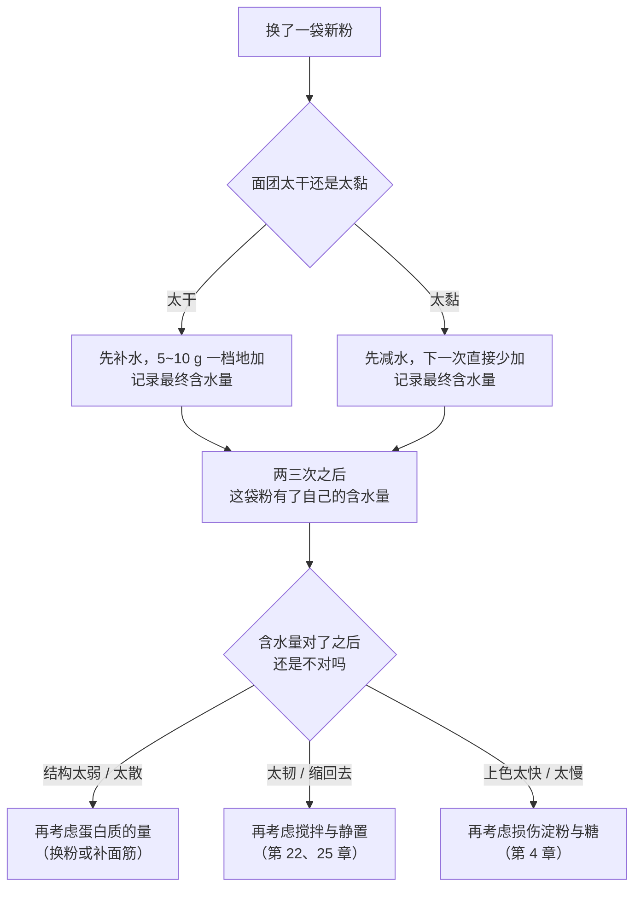

# 第 2 章 面粉：蛋白质、面筋、淀粉、灰分与损伤淀粉

> **本章目标**：让你在超市货架前不再只会看"高筋 / 中筋 / 低筋"这三个词。
> 学完这一章，你会知道一袋面粉其实同时携带了**至少四个独立变量**，
> 而"筋度"只描述了其中一个的一部分——
> 这也是为什么"换一袋粉，同一份配方就不对了"。
>
> 第 1 章给了你七个角色的地图。现在把第一个角色拆开。

## 2.1 先把一袋面粉拆开看

面粉是一堆被磨碎的小麦胚乳（以及视情况保留的麸皮与胚芽）。按**重量**排，
它大致是这样一个组成——注意顺序，很多人对第一名的印象是错的：

| 组分 | 大致地位 | 它在烘焙里负责什么 |
|------|---------|------------------|
| **淀粉** | **数量上的绝对主角** | 受热吸水糊化，成为面包心、蛋糕体的主要填充与支撑 |
| **蛋白质** | 第二，但决定"性格" | 吸水 + 机械作用后形成[面筋](../../glossary.md#gluten)网络 |
| **非淀粉多糖**（[阿拉伯木聚糖](../../glossary.md#arabinoxylan)[^1]、β-葡聚糖等） | 少，但极能吃水 | 显著改变面粉吸水量与面团形成时间 |
| **脂质** | 很少 | 与面筋蛋白作用，影响网络强度、气室稳定与烘烤时的定型温度 |
| **[灰分](../../glossary.md#ash)**（矿物质） | 极少 | 本身不干活，但它是"磨到多深"的**指标** |
| **水分** | 按美国联邦法规，白面粉与全麦粉的水分**均不超过 15%** | 你买回来的面粉本来就含水——所以它会随环境变 |

> **第一个要扭转的印象**：面粉的主角是**淀粉**，不是蛋白质。
> 蛋白质决定了这袋粉"能做成什么样的结构"，
> 但撑起成品体积的那些体积，绝大部分来自淀粉。

## 2.2 "高筋 / 低筋"说了什么，又漏掉了什么

先说一件很多人没想过的事：

> **在美国的联邦食品标准里，"面粉"这个名称并没有规定蛋白质含量。**

看一下这条标准（21 CFR 137.105「Flour」）到底规定了什么——它规定得非常细，
但**偏偏没有一条是关于蛋白质含量的**：

| 它规定了 | 具体内容 |
|---------|---------|
| **原料** | 清理过的小麦磨制并筛分，**不含硬粒小麦（durum）与红硬粒小麦** |
| **粒度** | 按规定方法测试时，**不少于 98%** 能通过 212 µm（No. 70）筛 |
| **去麸程度（用灰分限定）** | 灰分（干基）**不超过「蛋白质（干基）÷ 20 + 0.35」** |
| **水分** | **不超过 15%** |
| **可加的酶** | 为**补偿酶的天然不足**，可加麦芽小麦 / 麦芽小麦粉 / 麦芽大麦粉，其中麦芽大麦粉**不超过 0.75%**；也可加米曲霉来源的 α-淀粉酶制剂 |
| **可加的改良剂** | 抗坏血酸作为面团调理剂**不超过 200 ppm** |
| **可加的漂白 / 熟成剂** | 氮氧化物、**氯**、亚硝酰氯、二氧化氯、过氧化苯甲酰（配稀释剂）、丙酮过氧化物、偶氮甲酰胺（不超过 45 ppm）——**用了就必须在标签上写"Bleached"** |
| **蛋白质含量** | ❌ **没有规定** |

⚠️ **各国口径不同，以当地现行发布为准**——上面是美国的写法，
中国、欧盟、日本各有自己的标准与分类体系，本书**没有核到**中国现行标准的一手原文，
因此不写中国口径的具体数字。

这条规定带来两个非常实用的结论：

> **① "高筋 / 低筋"是商品分类，不是法定分类。**
> 不同厂、不同国家、不同批次的"高筋粉"蛋白质含量可以差好几个百分点。
> **所以正确的做法是看你手上这袋粉标签上的实测蛋白质，而不是记住一个"高筋 = 多少"的数字。**
> 本书因此**不给**各类面粉的蛋白质区间数字——那属于商业惯例，而且随地区漂移。
>
> **② 灰分被法规绑在蛋白质上，说明灰分单独没有意义。**
> 上面那条"灰分 ≤ 蛋白质 ÷ 20 + 0.35"是一个**比例式**：
> 蛋白质越高的粉，被允许的灰分也越高。为什么？因为高蛋白的小麦本来矿物质也多，
> 用一个固定的灰分上限会把它们误判成"磨得不够干净"。

## 2.3 面筋：两类蛋白的分工

第 1 章说过"面粉里没有面筋，只有蛋白质"。现在补上后半句：
**那些蛋白质并不是一种东西，而是两类分工完全不同的蛋白**[^2]。

有一项实验把这件事做得很干净：研究者把硬粒小麦的面筋**拆开**，
分离出麦醇溶蛋白、麦谷蛋白以及高分子量 / 低分子量麦谷蛋白亚基，
再分别**加回**到同一份基础粗粒粉里（蛋白质总量固定），然后测面团：

| 加进去的是 | 面团发生了什么 |
|-----------|--------------|
| **完整面筋** | 搅拌强度上升，而且上升幅度**按面筋来源的强弱排序** |
| **麦醇溶蛋白** | 搅拌曲线**变弱**；它**无法单独形成网络**，对蠕变柔量几乎没有影响，但明显**提高了 tan δ**（更"黏"、更能流动） |
| **麦谷蛋白** | 面团整体强度**上升**，而且不同来源的麦谷蛋白效果有差别 |
| 高分子量 / 低分子量麦谷蛋白亚基 | 都提高面团强度 |

另一项工作从另一个角度指向同一结论：比较不同强度小麦的"面筋凝胶"与"麦谷蛋白凝胶"，
两者的网络强度之比在一个特强品种是 5.6，在一个软质小麦是 51.1——
也就是说，**越弱的品种，麦醇溶蛋白对麦谷蛋白网络的"稀释"越严重**。
同一研究还发现：往面筋凝胶里加半胱氨酸会让网络结构直接消失，
说明这个网络是**可逆的、靠可断可接的交联维持的**。

> **可迁移的判断**：面团"筋道"不是一个刻度，是**两种性质的比例**。
> 你遇到的问题往往不是"筋不够"，而是**"弹性和延展性配错了"**——
> 面团缩回去是弹性过头，摊成一滩是延展过头。
> 这两种毛病要用**相反**的手段处理（第 16、22、25 章展开）。

## 2.4 淀粉：数量上的主角，却最容易被忽略

淀粉由两类分子组成：**直链淀粉**与**支链淀粉**[^3]。
一项比较不同用途小麦的研究测到面包小麦的直链淀粉含量在 28.38%~30.94% 之间，
另一类小麦在 27.44%~27.90%。

> ⚠️ **仅见于这一项研究**，而且是特定品种、特定产地。
> 本书只用它说明一件事：**小麦淀粉里大约四分之一到三分之一是直链淀粉**，
> 品种之间是有差别的。**不要把它当成"小麦淀粉的标准值"。**

为什么要关心这个比例？因为第 1 章的辨析栏已经提过一次：
**面包第二天变硬的主流解释是支链淀粉重结晶（回生）**[^4]。
也就是说，淀粉不只决定"烤的时候怎么定住"，还决定"放两天之后会变成什么样"——
这条线会在第 17 章和第 45 章重新接上。

淀粉颗粒还分**大颗粒（A 型）与小颗粒（B 型）**两群。
你不需要记住它们的尺寸，只需要记住一个后果：
**磨得越细，小颗粒占比与损伤淀粉都会上升**（下一节）。

## 2.5 灰分与出粉率：它量的不是营养，是"磨到多深"

[灰分](../../glossary.md#ash)是把面粉完全烧掉之后剩下的矿物质残留。
矿物质集中在麸皮与胚芽里，所以：

> **磨得越接近整粒（[出粉率](../../glossary.md#extraction-rate)[^5]越高），灰分越高。**
> 欧洲的面粉编号（T55、T65 一类）正是按灰分来编的。
> ⚠️ 本书**没有核到**各国 T 数与灰分对应值的一手标准原文，因此**不写具体对应表**。

有一项碾磨对照实验把这条链子测出来了：同样的小麦，用"硬式碾磨"相比"常规碾磨"，
**出粉率、灰分、碾磨效率指数都显著更高**，而常规碾磨得到的**面筋指数更高**；
同时，**硬式碾磨显著提高了两个品种的损伤淀粉含量**。

把这三件事连起来读，就得到本章最实用的一条因果链：

另有一项白面包研究把两档白粉的灰分写成 0.60%~0.72%——
**仅见于该研究**，只能当作"白粉的灰分是这个量级"的参考，不是标准值。

## 2.6 损伤淀粉与颗粒度：为什么这批粉"就是太干"

这是全章最该记住的一节，因为它直接解释了**最常见的一次挫败**：
同一份配方，换了一袋粉，面团突然太干或太黏。

### 吸水量不是蛋白质的同义词

一项用 150 份法国小麦、28 项组成与工艺指标做回归的研究，
最终筛出的**最佳预测模型只用了四个变量**：

> **蛋白质含量 + 可溶性淀粉 + 损伤淀粉 + 水溶性阿拉伯木聚糖的比浓黏度。**

这句话值得慢慢读：**蛋白质只是四分之一。**
第 1 章已经给过旁证——加入阿拉伯木聚糖或 β-葡聚糖都会显著提高
[粉质仪吸水量](../../glossary.md#farinograph-water-absorption)；
而一项蜡质小麦粉研究里，吸水量高达 79.5%（比野生型高约 20 个百分点）的那份粉，
损伤淀粉含量是 10.4%，另两份分别是 7.0% 和 6.6%。

### 磨得多细，是一个你看不见但真实存在的变量

两项独立研究都指向同一方向：

| 研究 | 观察到的 |
|------|---------|
| 石磨间隙从 0.2 mm 开到 1.6 mm 制全麦粉 | 最细的两档**损伤淀粉 25.97%**、还原糖 8.91 g/100 g；最粗的两档**损伤淀粉降到 11.15%**、还原糖 3.12 g/100 g；**粗粉的糊化起始温度与糊化焓更高** |
| 五种不同颗粒度的小麦粉 | 颗粒度越小，**损伤淀粉与 B 型淀粉越多、吸水量越高、面筋强度越低** |

> **所以"这袋粉吸水多"背后可能是四件完全不同的事**：
> 蛋白质高、损伤淀粉多、非淀粉多糖多、或者只是磨得更细。
> 它们对成品的后果**并不相同**——
> 损伤淀粉多还会顺带**降低糊化起始温度**、**增加还原糖（上色更快）**，
> 而蛋白质高只是让面筋抢走更多水。

⚠️ **诚实说明**：石磨那项研究同时测到细粉做出的饼里丙烯酰胺更高。
本书**不做任何健康或摄入建议**，只指出这是**同一个变量（磨得多细）的连带后果**——
它正好演示了本书的主线：**你以为你在调"口感"，其实你在调好几件事。**

## 2.7 酶：面粉自带的"拆解工"

面粉里有酶，其中对烘焙最要紧的是 **α-淀粉酶**[^6]——它把淀粉切成更小的糖。
这件事有一个非常硬的证据，就写在法规里：

> 21 CFR 137.105 允许在面粉里加麦芽大麦粉（不超过 0.75%）或真菌 α-淀粉酶，
> 理由原文写着：**"为补偿酶的天然不足"**。
> 全麦粉的标准（21 CFR 137.200）里有同样的条款。

**法规专门为"补酶"开一个口子，本身就说明面粉的酶活是一个被当作变量来管理的东西。**

酶活太低：产气后段乏力、上色不足。
酶活太高（典型原因是**小麦在收获前发了芽**）：淀粉被切得太多，面包心发黏、结构塌软。
一项软麦发芽研究就观察到：随着发芽时间延长，**落降数值显著下降**
（落降数值是衡量 α-淀粉酶活性的常规指标，数值越低代表酶活越高）。

> ⚠️ 本书**没有核到**"落降数值低于多少就不能做面包"这类阈值的一手标准，
> 因此**不写阈值数字**。家庭烘焙者基本买不到发芽麦磨的粉，
> 但如果你用了**发芽谷物粉**或**麦芽粉**做添加，要知道你动的是这个旋钮。

## 2.8 漂白、熟成与"氯化低筋粉"

上面那张表里有一行容易被跳过：**可加的漂白 / 熟成剂**。
这里要分清三件常被混为一谈的事：

| 概念 | 它在做什么 | 本书的态度 |
|------|-----------|-----------|
| **漂白** | 让色素褪色，面粉更白 | 这是**法规明确允许且必须标注**的工艺（美国要求标"Bleached"） |
| **熟成 / 氧化** | 改变蛋白质的氧化状态，从而改变面团性质 | 法规里把"人工熟成作用"和漂白并列写明 |
| **氯化** | 氯处理**软麦粉**，用来做"高比例蛋糕"（糖与液体相对面粉特别高的那类蛋糕） | 是一项**真实存在的工业做法**，见下 |

关于最后一项，有一篇 2024 年的开放获取论文开宗明义地写道：
**氯化是软麦粉的常规化学改性手段，用来做高比例蛋糕；
由于安全与标签方面的顾虑，业界一直在找替代方案**（该论文测试的替代方案是常压冷等离子体）。

> **这条信息对家庭烘焙者的用处是什么？**
> 它解释了一个你可能遇到过的现象：**某些"蛋糕专用粉"的表现，
> 用"蛋白质更低"解释不完**——它可能还被做过化学改性。
> ⚠️ **各国允许的处理方式不同**，本书不判断哪种更好，只提醒你：
> **"低筋粉"这三个字底下，可能藏着不止一个变量。**

顺带把全麦粉的法定定义也放进来，因为它推翻了一个很常见的误解：

> 21 CFR 137.200：全麦粉的粒度要求是**不少于 90% 通过 2.36 mm（No. 8）筛、
> 不少于 50% 通过 850 µm（No. 20）筛**，并且
> **"该小麦各天然组分的比例（水分除外）保持不变"**。

注意"比例保持不变"这句——它**没有**要求全麦粉磨得和白粉一样细。
所以**全麦粉和白面粉的差别不只是"多了麸皮"，还多了一个颗粒度的差别**。
这是"全麦粉不能 1:1 换白面粉"的法定层面的理由。

## 2.9 常见说法辨析

按本书约定标注**证据强度**：✅ 有共识 / ⚠️ 有争议 / ❌ 明确错误 / 缺乏证据。
来源见[出处登记](../../standards.md)。

| 说法 | 判定 | 说明 |
|------|------|------|
| "**高筋粉的蛋白质一定在某个固定数值以上**" | ⚠️ **是商业惯例，不是法定分类** | 美国的面粉标准（21 CFR 137.105）规定了原料、粒度（≥98% 过 212 µm）、灰分上限公式、水分上限、允许的酶与漂白剂，**唯独没有规定蛋白质含量**。所以"高筋"是厂商与市场的分类词。⚠️ 各国口径不同。**正确做法**：看你手上这袋粉标签上的实测值；更靠谱的是**记录它在你手上实际吃了多少水** |
| "**高筋粉吸水多**" | ⚠️ **只对了四分之一** | 一项用 150 份小麦、28 项指标做回归的研究，最优模型里有四个变量：蛋白质含量、可溶性淀粉、**损伤淀粉**、水溶性阿拉伯木聚糖的比浓黏度。另有实验显示加入阿拉伯木聚糖或 β-葡聚糖会显著抬高粉质仪吸水量；一份蜡质小麦粉吸水量 79.5%、损伤淀粉 10.4%，明显高于两份野生型（7.0% 与 6.6%）。**"吸水多"是综合结果，不是蛋白质的同义词** |
| "**面粉越白说明加工越多、越不好**" | ⚠️ **把两件事混在一起了** | "白"至少来自三条互相独立的路径：①**磨得更干净**（出粉率低、灰分低）；②**漂白处理**（法规允许且要求标注）；③品种本身。前者是碾磨程度，中者是添加工艺。本书**不做健康判断**，只提醒：**这三条对烘焙性能的影响完全不同**，不能用"白不白"一个词概括 |
| "**全麦粉可以 1:1 替换白面粉**" | ❌ **明确错误** | 至少改了三件事：①**颗粒度**（法定全麦粉只要求 ≥90% 过 2.36 mm 筛、≥50% 过 850 µm 筛，比白粉的 ≥98% 过 212 µm 粗得多）；②**吸水**（麸皮与非淀粉多糖很能吃水，而且吸水是随时间继续的）；③**结构**（麸皮颗粒会物理妨碍面筋连成片）。**换全麦粉时含水量必须重调**，而且别指望同样的体积 |
| "**低筋粉就是高筋粉加玉米淀粉**" | ⚠️ **只对了"稀释蛋白质"这一件事** | 稀释确实能降低蛋白质百分比，但**换不来另外三件**：颗粒度、损伤淀粉、以及某些商品低筋粉经过的**化学改性**（一篇 2024 年论文明确写道氯化是软麦粉制作高比例蛋糕的常规做法）。**应急可以用，别当成等价物** |
| "**面粉一定要过筛，成品才蓬松**" | ⚠️ **作用被夸大了** | 本书**没有核到**"过筛让成品更蓬松"的一手实验。可以确定的作用是**打散结块、让干料混匀**——在化学膨松的配方里，膨松剂分布不均是真会出问题的（第 13 章）。另外，过筛会改变"一杯面粉"的重量，**但这个问题的正解是用秤**（第 26 章），不是过筛 |
| "**面粉在家微波 / 烤箱加热一下就可以生吃了**" | ❌ **明确错误，而且有安全风险** | 美国 FDA 的面粉安全指引**明确提醒不要自己在家做"热处理面粉"**，因为家用方法可能杀不干净；该指引同时指出"把生谷物加工成面粉并不会杀死有害细菌"，而"**烹熟是确保用面粉和生蛋做的食物安全的唯一方法**"。⚠️ 各国口径不同，以自己所在地现行发布为准 |
| "**面粉可以一直放，反正是干货**" | ⚠️ **不成立，而且原因不是你想的那个** | 面粉本身按法规就含**不超过 15%** 的水分，会随环境交换水；另外面粉里有脂质（会氧化）与酶（还在慢慢干活）。本书**没有核到**家庭储存条件下的保质期实验数据，因此**不给期限数字**——**按包装标示，并且优先把"这袋粉吃了多少水"记录下来**，那才是你真正需要的信息 |

## 2.10 一条可迁移的判断规则

把本章收敛成一句：

> ## 换一袋面粉，你至少同时换了四个变量：蛋白质的**量**与**质**、损伤淀粉、非淀粉多糖、酶活。
>
> 而这四个变量里，**只有第一个**印在包装上。

由此推出一条非常具体的操作原则：

> **换粉的时候，先用含水量去适配，不要先改配方结构。**
>
> 理由是：上面四个变量里有三个（损伤淀粉、非淀粉多糖、蛋白质量）
> **首先表现为"能吃多少水"**。所以：
>
> 1. 第一次用新粉，**留出 5 个百分点的水后加**（例如配方 68% 水，先加 63%）；
> 2. 按面团**手感**补到位，并**记录你最终加了多少**——
>    这个数字就是这袋粉在你厨房里的真实吸水量；
> 3. 第二次起直接用记录值。**不要去改糖、改油、改酵母**——那是在动别的竞争。

## 2.11 🔎 下次烤之前的用处

1. **别再问"这个配方用什么粉"，改问"这个配方需要多强的结构"。**
   需要韧和嚼劲 → 要面筋；需要酥和松 → 要少面筋（靠油脂阻断，第 5 章）。
2. **第一次用一袋新粉，把水留出一部分后加**，并把最终水量记进
   [烘焙记录表](../../forms/bake-log.md)。**这一条能挡掉大多数"换粉就翻车"。**
3. **看标签上的蛋白质数字，但别迷信它**——吸水量还受损伤淀粉与非淀粉多糖影响。
4. **全麦粉不要 1:1 替换**：它更粗、更吃水、而且麸皮会妨碍面筋成片。
   先从替换 20%~30% 开始，并把水加上去。
5. **面团"缩回去"和"摊成一滩"是相反的毛病**，不要用同一招处理——
   前者是弹性过头（需要松弛时间），后者是延展过头（需要更强的粉或更多折叠）。
6. **面粉不是即食食品**：不要尝生面团、生面糊，也**不要自己在家"热处理面粉"**
   （美国 FDA 明确不建议；各国口径不同，以当地现行发布为准）。

## 2.12 思考题

1. 用你自己的话说明：为什么"面粉里没有面筋"这句话是对的？
   形成面筋需要哪三样东西？
2. 麦谷蛋白和麦醇溶蛋白各自更负责什么？
   有一项实验把它们分别加回基础粉里——分别观察到了什么？
   这对"我的面团老是缩回去"这个问题有什么启发？
3. 一条法规规定"灰分（干基）不超过蛋白质（干基）÷ 20 + 0.35"。
   （a）如果一袋粉的干基蛋白质是 12%，允许的灰分上限是多少？
   （b）为什么法规不直接规定一个固定的灰分上限？
4. **【案例】** 你有一份用惯了的吐司配方：面粉 100%、水 65%、盐 2%、糖 6%、
   黄油 5%、酵母 1%（**以面粉总量为 100%**）。这次换了一个新牌子的高筋粉，
   蛋白质标称值比原来那袋还高一点，但和面时明显**太黏、几乎无法整形**。
   请回答：（a）"蛋白质更高却更黏"，可能的原因有哪些？至少说两条，
   并指出它们分别属于本章讲的哪个变量。
   （b）按本章的规则，你下一次会先改哪一项？为什么不先改盐或酵母？
5. **【案例】** 有人把一份饼干配方里的低筋粉换成了"高筋粉 + 玉米淀粉"
   （按重量调到同样的蛋白质百分比），结果饼干"还是比原来硬、而且颜色更浅"。
   请给出至少两条解释，并说明你会怎么设计一个对照来区分它们。
6. **【辨析】** "面粉越白越不好"——判断这句话的证据强度，
   拆出它把哪几件不同的事混在了一起，并说明每一件对**烘焙性能**的影响方向。
7. **【辨析】** "面粉必须过筛，不然做不蓬松"——判断证据强度，
   说明过筛**确实**能解决什么问题，以及那个问题更好的解法是什么。
8. 本章说"换一袋面粉等于同时换了四个变量，而只有一个印在包装上"。
   如果本书直接给出"高筋粉吸水率 = 65%、低筋粉 = 55%"这样的数字，
   读者会付出什么代价？

> 📖 **参考答案**（想清楚再看）：[Q1](../../qa/02-flour-qa.md#q1) ·
> [Q2](../../qa/02-flour-qa.md#q2) · [Q3](../../qa/02-flour-qa.md#q3) ·
> [Q4](../../qa/02-flour-qa.md#q4) · [Q5](../../qa/02-flour-qa.md#q5) ·
> [Q6](../../qa/02-flour-qa.md#q6) · [Q7](../../qa/02-flour-qa.md#q7) ·
> [Q8](../../qa/02-flour-qa.md#q8)

## 2.13 本章实操

### 🅐 零成本版 · 任务一：把家里的面粉做成一张"档案卡"

不用烤箱。把你手边**每一袋**面粉都登记一遍——这张表会一直用到本书结束。

| 项目 | 面粉 A | 面粉 B | 面粉 C |
|------|-------|-------|-------|
| 品牌与品名（原样抄） | | | |
| 标签上的蛋白质（每 100 g 多少克） | | | |
| 配料表里除了小麦还有什么？（麦芽粉？酶？抗坏血酸？） | | | |
| 有没有"漂白 / 预拌 / 自发"字样？ | | | |
| 颜色（对着白纸比）：白 / 微黄 / 明显黄褐 | | | |
| 手感：捏一把松开——**散开**还是**成团**？ | | | |
| 你打算用它做什么？ | | | |

> **"捏一把"这个动作在测什么**：能捏成团、松手不散，通常意味着含水量偏高或颗粒更细。
> ⚠️ 这是**定性判据，不是测量**——它只帮你区分"这两袋粉不一样"，
> **不能**用来推算吸水量。分清"手感"和"数据"，是本书反复要练的。

### 🅐 零成本版 · 任务二：读三份配方，只看粉与水

找三份**同类**配方（都做吐司，或都做饼干），只抄两行：

| | 配方 A | 配方 B | 配方 C |
|---|-------|-------|-------|
| 面粉（品类 + 克数） | | | |
| 全部液体（水 / 奶 / 蛋 / 其他，分别写） | | | |
| **含水量（液体总量 ÷ 面粉，以面粉总量为 100%）** | | | |

然后回答：

| 问题 | 你的答案 |
|------|---------|
| 三份配方的含水量差多少个百分点？ | |
| 差得最多的那份，用的是什么粉？这两件事有关系吗？ | |
| 如果作者用的粉比你手上的**更能吃水**，你照抄他的水量会发生什么？ | |
| 你打算怎么改？（提示：本章 §2.10 的规则） | |

### 🅐 零成本版 · 任务三：吸水手感对照（只用面粉和水）

**需要**：两种不同的面粉各 50 g、水、两个小碗、厨房秤、一支笔。**不开火、不浪费**。

做法：每碗 50 g 面粉，**分次**加水，每次 2 g，用筷子拌到"刚刚好成团、不粘碗壁"为止。
记录**各自加了多少水**。

| | 面粉 A | 面粉 B |
|---|-------|-------|
| 面粉重量 | 50 g | 50 g |
| 加到"刚好成团"用了多少水 | g | g |
| 换算成百分比（水 ÷ 面粉，**面粉为 100%**） | % | % |
| 面团摸起来：软 / 硬、黏 / 不黏 | | |
| 静置 20 分钟后再摸：变软了？变硬了？ | | |

> **最后一行最有价值**。静置之后变软，通常说明水还在往里渗（水合还没完成）——
> 麸皮多、颗粒粗的粉尤其明显。这正是第 3 章要讲的：
> **"水够不够"这个问题，在不同时刻有不同的答案。**
>
> ⚠️ **局限**：这个测试没有标准稠度、没有仪器、只有一个人的手感、没有重复。
> 它能告诉你"这两袋粉不一样"，**不能**给出可与他人比较的吸水率数值。
> 做完请把面团**丢掉，不要尝**（生面粉不是即食食品）。

### 🅑 开火版 · 任务四：同一份配方，只换粉（有烤箱时做）

**这是一个单一变量对照实验。**

**需要**：一份你做过的简单配方（司康或饼干最省事）、两种不同的面粉、厨房秤、
同一个烤盘、尺子、计时器、纸笔。

**唯一变量**：面粉品类。其余原料、克数、搅拌方式、每块重量、厚度、
烤盘位置、炉温、时间**全部一致**，两组**同时进炉**（同一烤盘左右两半，做好标记）。

| 组 | 用的粉 | 和面时手感 | 出炉直径 | 出炉厚度 | 颜色 | 质地（酥 / 硬 / 韧） |
|----|-------|-----------|---------|---------|------|--------------------|
| ① | | | mm | mm | | |
| ② | | | mm | mm | | |

做完回答：

| 问题 | 你的答案 |
|------|---------|
| 哪一组**颜色更深**？本章哪个变量能解释它？ | |
| 哪一组摊得更开？和第 1 章"面筋越多摊得越小"一致吗？ | |
| 如果两组手感差别很大，你**下一次**会先改什么？ | |
| 这次实验的局限是什么？（至少写两条） | |

### 🅑 开火版 · 任务五（加分）：同一种粉，只改含水量的适配方式

**唯一变量**：加水的方式。

| 组 | 做法 | 面团状态 | 成品 |
|----|------|---------|------|
| ① | 按配方一次性加满水 | | |
| ② | 先加 90% 的水，静置 20 分钟后再按手感补 | | |

> 第 ② 组是在给水**时间**去渗进面粉。如果你用的是全麦粉或颗粒较粗的粉，
> 这两组的差别会比你预期的大。**这就是第 3 章的引子。**
>
> ⚠️ **安全提醒**：**不要尝生面团、生面糊**（美国 FDA：生面粉不是即食食品，
> "把生谷物加工成面粉并不会杀死有害细菌"），也不要自己在家做"热处理面粉"；
> 生面粉与生蛋要和即食食物分开放；做完把手、盆、台面洗干净。
> 各国口径可能不同，以自己所在地现行发布为准。

## 2.14 本章依据

本章引用的来源与核对状态详见[参考书目与出处登记](../../standards.md)，具体对应如下：

| 本章用到的内容 | 依据 |
|--------------|------|
| 美国"面粉"的法定定义：原料、粒度（≥98% 过 212 µm）、灰分上限 =（蛋白质 ÷ 20 + 0.35，干基）、水分 ≤15%、麦芽大麦粉 ≤0.75%、抗坏血酸 ≤200 ppm、允许的漂白 / 熟成剂清单与"Bleached"标注要求、**未规定蛋白质含量** | 美国 21 CFR 137.105「Flour」，✅ 已核到法规原文（eCFR 现行版）。⚠️ 各国口径不同 |
| 全麦粉的法定粒度（≥90% 过 2.36 mm、≥50% 过 850 µm）与"天然组分比例不变"、水分 ≤15%、同样允许补酶 | 美国 21 CFR 137.200「Whole wheat flour」，✅ 已核到法规原文 |
| 法规为"补偿酶的天然不足"专门开口子（麦芽粉 / 真菌 α-淀粉酶） | 同上两条，✅ |
| 麦醇溶蛋白无法单独成网、提高 tan δ；麦谷蛋白提高面团强度；HMW / LMW 亚基都增强 | *Cereal Chemistry* 2003 硬粒小麦面筋组分富集研究，✅ 摘要层面 |
| 面筋凝胶 / 麦谷蛋白凝胶网络强度之比：特强品种 5.6、软质小麦 51.1；加半胱氨酸后网络消失（可逆网络） | *JAFC* 2003 面筋与麦谷蛋白凝胶流变研究，✅ 摘要层面 |
| 面包小麦直链淀粉 28.38%~30.94%（另一类小麦 27.44%~27.90%） | *Food Chemistry: X* 2026 小麦淀粉精细结构研究，✅ 开放获取。⚠️ **仅见于这一项研究**，本章只用它说明"大约四分之一到三分之一"这个量级 |
| 硬式碾磨 → 出粉率、灰分、损伤淀粉更高，面筋指数更低 | *Cereal Chemistry* 2019 调质时间与碾磨系统研究，✅ 摘要层面 |
| 白面粉灰分 0.60%~0.72% | *Food & Function* 2016 白面包原料与烘烤条件研究，✅ 摘要层面。⚠️ **仅见于该研究** |
| 面粉吸水量的最优预测模型 = 蛋白质 + 可溶性淀粉 + 损伤淀粉 + 水溶性阿拉伯木聚糖比浓黏度（150 份法国小麦、28 项指标） | *Food Chemistry* 2025 面粉次要组分与吸水量研究，✅ 摘要层面 |
| 石磨间隙 0.2~1.6 mm：损伤淀粉 25.97% → 11.15%、还原糖 8.91 → 3.12 g/100 g；粗粉糊化起始温度与焓更高 | *Food Chemistry* 2026 石磨粒度与丙烯酰胺研究，✅ 摘要层面。本书**不引用其健康结论**，只用"磨得越细 → 损伤淀粉越多"这条工艺链 |
| 颗粒度越小 → 损伤淀粉与 B 型淀粉越多、吸水越高、面筋强度越低 | *Food Research International* 2024 面粉粒度与速冻饺子皮研究，✅ 摘要层面 |
| 阿拉伯木聚糖 / β-葡聚糖抬高粉质仪吸水量；蜡质小麦粉吸水 79.5%、损伤淀粉 10.4% vs 7.0% / 6.6%；损伤淀粉降低糊化起始温度 | *Food Chemistry* 1995、*Food Chemistry* 2010、*Cereal Chemistry* 2003、*European Food Research and Technology* 2006，✅ 均为摘要层面（第 1 章已引） |
| 软麦发芽后落降数值显著下降 | *PLOS ONE* 2025 软麦发芽与工艺品质研究，✅ 开放获取 |
| 氯化是软麦粉制作高比例蛋糕的常规做法，业界因安全与标签顾虑在找替代方案 | *Foods* 2024 常压冷等离子体替代氯化研究，✅ 开放获取 |
| 面包变硬的主流解释是支链淀粉回生 + 水分再分配 | *CRFSFS* 2003 与 2014 老化综述，✅ 摘要层面（第 1 章已引） |
| 生面粉不是即食食品；不要自己在家热处理面粉；烹熟是唯一确保安全的方法 | 美国 FDA「Handling Flour Safely: What You Need to Know」，✅ 已核到官方页面。⚠️ 各国口径不同 |
| 各国面粉分类（"高筋 / 低筋"对应多少蛋白质）的法定依据 | ⚠️ **未核到**：美国标准不规定蛋白质含量；中国现行标准原文本书未核到一手。**因此本章不写任何面粉分类的蛋白质区间数字** |
| 欧洲 T 型编号与灰分的对应值 | ⚠️ **未核到**一手标准原文；只写"按灰分编号"，不给对应表 |
| 落降数值的可用性阈值 | ⚠️ **未核到**；只讲方向，不写阈值 |
| "过筛让成品更蓬松" | ⚠️ **未找到**一手实验；按工艺口语处理，只肯定"打散结块、混匀干料"这一作用 |
| 家庭条件下面粉的储存期限数据 | ⚠️ **未核到**；不写期限数字 |

[^1]: [阿拉伯木聚糖](../../glossary.md#arabinoxylan)（arabinoxylan）与[非淀粉多糖](../../glossary.md#arabinoxylan)。
[^2]: [麦谷蛋白 / 麦醇溶蛋白](../../glossary.md#glutenin-gliadin)（glutenin / gliadin）。
[^3]: [直链淀粉与支链淀粉](../../glossary.md#amylose-amylopectin)（amylose / amylopectin）。
[^4]: [回生 / 老化](../../glossary.md#retrogradation)（starch retrogradation / staling）。
[^5]: [出粉率](../../glossary.md#extraction-rate)（extraction rate）与[灰分](../../glossary.md#ash)（ash）。
[^6]: [α-淀粉酶与落降数值](../../glossary.md#alpha-amylase)（α-amylase / falling number）。

---

**下一章**：第 3 章 水——水合、含水量与水粉比：水到底去了哪里。
这一章讲的是"面粉能吃多少水"，下一章讲"水被谁吃掉了"，
以及为什么同一份配方多加 5% 水，会同时改变体积、组织和容错空间。
