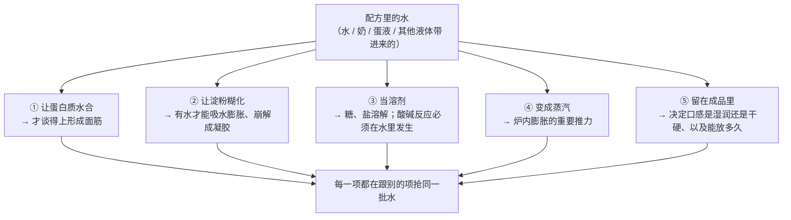
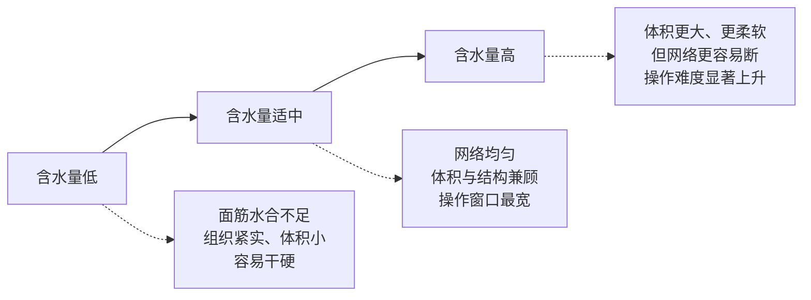
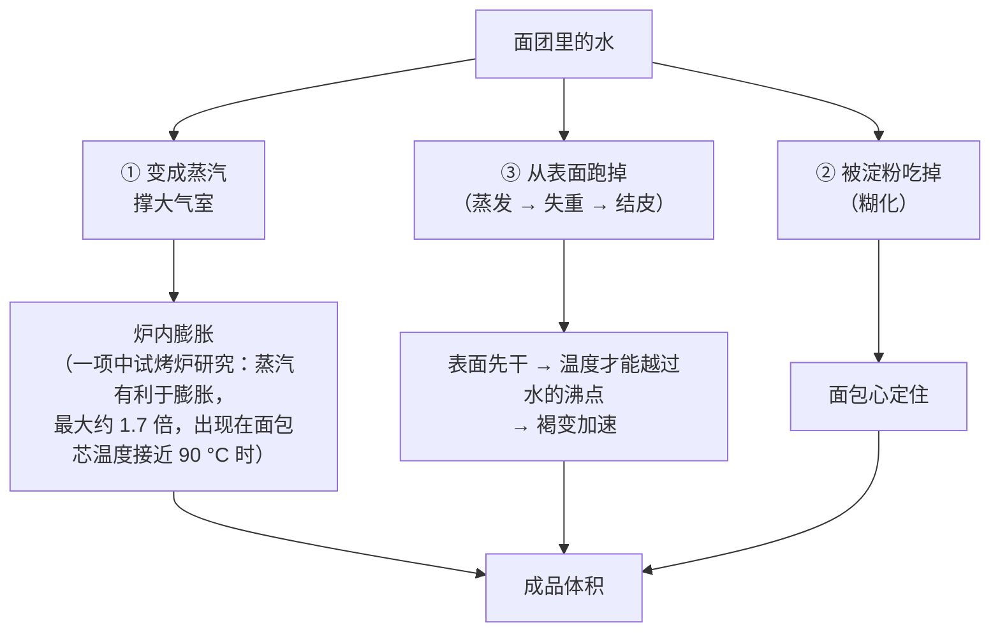

# 第 3 章 水：水合、含水量与水粉比——水到底去了哪里

> **本章目标**：让你把"加多少水"从一个抄来的数字，变成一次**你自己做的分配**。
> 学完这一章，你能回答三个问题：
> **这份配方的水被谁拿走了？多加 5% 会先喂饱谁？烤的时候它们又跑到哪里去了？**
>
> 第 2 章讲的是"这袋面粉能吃多少水"，这一章讲的是"吃进去的水在干什么"。

## 3.1 水是配方里唯一"什么都要经手"的东西

先看一张清单。配方里其他每一样原料都只管几件事，**只有水，几乎每一件事都要经过它**：

第 ③ 条最容易被忽略，但它是硬条件：**化学膨松剂不遇水基本不反应**。
这就是为什么很多马芬、司康配方要求"**液体倒进去之后就要快**"——
反应从水碰到膨松剂的那一刻就开始计时了（第 13 章展开）。

> **一句话总结这一章的立场**：
> **"含水量"不是一个数字，是一次分配。**
> 同一个"70% 水"，在不同配方里被完全不同的角色瓜分，所以后果也完全不同。

## 3.2 含水量怎么记：先把基准说清楚

本书统一用[烘焙百分比](../../glossary.md#bakers-percentage)[^1]：
**以配方中面粉总量为 100%**，水（以及所有液体）按占面粉重量的百分比记。

| 写法 | 意思 |
|------|------|
| "这个面团 **65% 水**" | 每 100 g 面粉配 65 g 水 |
| "**提高到 75%**" | 每 100 g 面粉配 75 g 水——**多了 10 个百分点，不是"多了 10%"** |

> ⚠️ **两个必须分清的说法**：
> "从 65% 提高到 75%"是**多了 10 个百分点**（水量相对增加了约 15%）。
> 烘焙圈经常把这两种说法混着用，看到"加了 10% 的水"时，
> **先问清楚是"加了 10 个百分点"还是"水量增加了 10%"**。

### 别把"液体"当成"水"

这是本章第一个实用陷阱：**配方里的液体不等于水**。

一个有法定依据的例子：按美国法律的定义，**黄油的乳脂不低于 80%（按重量）**；
按美国 21 CFR 166.110，**人造奶油的脂肪也不低于 80%**。
换句话说：

> **黄油里不到 20% 的部分是水和乳固形物；而液态油基本是 100% 脂肪。**
> 所以"黄油换成等量的油"**除了换掉功能（第 1、5 章），还悄悄抽走了一部分水**。

牛奶、蛋液同理——它们的主体是水，但**同时带进了蛋白质、脂肪、糖和盐**。

> ⚠️ **诚实说明**：本书**没有核到**可以直接引用的官方"牛奶 / 鸡蛋含水量"数值，
> 因此**不给这两个数字**。你要用的时候，**看你手上那盒奶、那盒蛋的营养标签**，
> 或者用最笨但最可靠的办法：**称一称**。
> 本书的原则一贯如此——**宁可让你去测，也不给一个来路不明的数字。**

## 3.3 加水买到什么，代价是什么

"高含水量"这几年被说成了一种美德。它确实买得到东西，但**也有明确的代价**，
而且这个代价有实验证据。

一项研究把中式馒头的加水量设成 **45%、50%、55%** 三档（面粉基准），
全程跟踪面筋网络的形态、分布与水分迁移：

| 观察到的 | 说明 |
|---------|------|
| 加水越多，**搅拌阶段**面筋网络分布越均匀、越呈纤维状 | 水合更充分，蛋白质更容易铺展、连接 |
| 但到了 **55%**，**发酵过程中面筋纤维发生断裂** | 过头了——网络撑不住自己 |
| 55% 组的**比容上升**，但**咀嚼性与黏性下降** | 更蓬松，但结构感变弱 |

把这三行读成一条曲线：

> **可迁移的判断规则**：
> **加水买到的是体积与柔软，付出的是"容错空间"。**
>
> 高含水量面团不是"更高级"，是**对操作与时机更敏感**——
> 发过头一点点，网络就断了。这也是为什么高含水量欧包总要配上
> 折叠、冷藏、整形手法这一整套（第四部分）。

⚠️ **注意这项研究做的是中式馒头**，不是法式欧包，也不是吐司。
本书只引用它的**方向**（加水的收益与代价各是什么），
**不引用 45 / 50 / 55 这三个数字作为任何成品的推荐值**。

## 3.4 水被谁拿走了：四个争夺者

第 1 章画过"争水"的图，这里给每个争夺者补上"它到底能拿走多少"的依据。

| 争夺者 | 它为什么要水 | 有多能抢 |
|-------|------------|---------|
| **面筋蛋白** | 不水合就连不成网 | 取决于蛋白质的量与质（第 2 章） |
| **损伤淀粉** | 破裂的颗粒能直接吸水 | **吸水远多于完好颗粒**；它是吸水量预测模型里的一项 |
| **非淀粉多糖**（[阿拉伯木聚糖](../../glossary.md#arabinoxylan)[^2]、β-葡聚糖、麸皮纤维） | 亲水、能形成黏性溶液 | 加入阿拉伯木聚糖或 β-葡聚糖都会**显著抬高**粉质仪吸水量 |
| **糖与盐** | 溶质把水"束缚住"、降低[水分活度](../../glossary.md#water-activity)[^3] | 高糖配方里这一项非常可观（第 4 章） |

一项用 150 份法国小麦、28 项指标做回归的研究，把前三项直接量化了：
**最佳预测模型 = 蛋白质含量 + 可溶性淀粉 + 损伤淀粉 + 水溶性阿拉伯木聚糖的比浓黏度。**

> **所以"这份配方水放多了"这句话本身是不完整的**。
> 完整的问法是：**"多出来的水本来该给谁，现在跑到哪儿去了？"**
>
> - 在**面包**里，水少 → 面筋做不起来 → 结构松散；
> - 在**饼干**里，水少 → 淀粉更不可能糊化 → **定型更晚** → 反而摊得更开。
>
> **同一个变化，在不同配方里走向相反的结果**——这是第 1 章就埋下的伏笔。

### 一个很难直觉的事实：烘焙里的淀粉常常"糊化不完全"

淀粉要糊化，**必须有足够的水**。而很多烘焙体系的水本来就不够，
再加上糖把水占住、把糊化温度抬高，结果就是：

> 在**饼干这类低水分高糖体系**里，一项专门研究指出：
> **蔗糖加上低水分把淀粉糊化温度抬得太高，以至于烘烤过程中几乎没有淀粉糊化。**

这解释了饼干为什么是"酥"而不是"软"：**它的结构根本不靠糊化的淀粉凝胶**。
反过来，面包的面包心之所以有弹性，正是因为那里水足够、糊化真的发生了。

> ⚠️ **诚实说明**：那么饼干的结构**到底**靠什么？
> 本书目前**没有核到**一份把这件事讲透的一手实验，
> 只能说"不是靠糊化"——**这是一个已知缺口**，第 35 章会再回到它。

> **可迁移的判断**：看到一份配方，先估一下**水够不够让淀粉糊化**。
> 水多（面包、蛋糕）→ 结构靠糊化 + 蛋白凝固；
> 水少（饼干、酥皮）→ 结构靠面筋残余 + 脂肪 + 糖玻璃化，
> **"烤到定型"这件事的物理含义完全不同**（第 17、20 章展开）。

## 3.5 进了烤箱，水去哪儿了

这是本章最该看图的部分。水在炉子里走三条路：

### 跑掉的水是有数量的：烘焙失重

一项研究把吐司在 **190、200、210、220、230 °C** 下各烤 40 分钟，
连续测表皮温度与失重：

| 炉温从 190 °C 升到 230 °C | 对照组的变化 |
|-------------------------|------------|
| **表皮温度** | 从 **128.5 °C** 升到 **190.2 °C** |
| **失重率** | 从 **35.11%** 升到 **47.23%** |

> ⚠️ **这些数字来自一项研究、一种产品、一个 40 分钟的固定时长**，
> 而且该研究的另一组（加了 1% 瓜尔胶）失重明显更低（20.37%~29.57%）。
> 本书**只用它的两条方向**：
> ① **炉子里跑掉的主要是水，而且量不小**；
> ② **炉温越高，跑掉得越多、表皮越热**。
> **不要把 35% 或 47% 当成"面包的失重率"。**

### 同一炉里有两个温度世界

把上面的表皮温度和第 1 章引过的芯温放在一起，会看到一件很重要的事：

| 位置 | 温度 | 依据 |
|------|------|------|
| **面包芯** | **不会越过水的沸点**——一项计算流体力学模拟显示芯温约 25 分钟后稳定在 98 °C 左右；一项烘烤杀菌验证研究实测面包芯温在最初 8 分钟升到约 100 °C 并保持 | 芯部是"湿"的，水在那里蒸发吸热，把温度锁住 |
| **表皮** | **远高于 100 °C**（上面那项研究里 128.5~190.2 °C） | 表面先失水，没有水可蒸发之后，温度才能继续爬 |

> **这一条能解释非常多的现象**：
>
> - 为什么**只有表面会褐变**——里面根本达不到褐变需要的温度；
> - 为什么**喷蒸汽能让面包涨得更大**——蒸汽让表面晚一点干、晚一点定住（第 30 章）；
> - 为什么"**烤到表面金黄**"是个不可靠的判据——它只告诉你表面的事。
>
> 有一条独立的定量旁证：一项研究观察到
> **水分活度降到 0.4 以下是一个临界点，越过之后 HMF 生成速率急剧上升**。
> 也就是说——**先干，才谈得上褐变加速**。

## 3.6 出炉之后，水还在动

最后一段旅程最容易被忽略：**成品放凉、放到第二天，水还在重新分配。**

第 1 章的辨析栏已经给过结论，这里补上它对"加水"这件事的意义：

| 观察 | 依据 |
|------|------|
| 面包变硬的主流解释是**支链淀粉重结晶（[回生](../../glossary.md#retrogradation)[^4]）**，并伴随水分在面筋与淀粉之间、面包心与面包皮之间**再分配** | 两篇老化综述 |
| 白面包在 25 °C 密封储存两周：**带皮储存**的样品含水量与水分活度显著下降、七天后明显更硬、重结晶更多；**不带皮**的含水量基本不变 | 一项水分再分配研究 |

> **所以"多加水 = 成品更湿润更耐放"这个推论是不完整的**：
> 你加进去的水有一部分会在烤的时候跑掉、
> 一部分会被淀粉在冷却与储存中**结合进微晶**里。
> **"变硬"和"变干"是两件相关但不相同的事。**

## 3.7 常见说法辨析

按本书约定标注**证据强度**：✅ 有共识 / ⚠️ 有争议 / ❌ 明确错误 / 缺乏证据。
来源见[出处登记](../../standards.md)。

| 说法 | 判定 | 说明 |
|------|------|------|
| "**含水量越高，面包越好**" | ⚠️ **买到了东西，也付出了代价** | 一项三档加水量（45 / 50 / 55%，面粉基准）的研究显示：加水越多，搅拌阶段面筋分布越均匀、越呈纤维状；但 **55% 时发酵中面筋纤维断裂**，比容上升而咀嚼性与黏性下降。**结论是"高含水量换来体积与柔软，代价是容错空间变窄"**，不是"越高越好" |
| "**面团太黏就加面粉**" | ⚠️ **能救急，但它改的比你以为的多** | 加面粉是在**改分母**：面粉一多，**其他所有原料的烘焙百分比同时下降**——糖、盐、酵母、油全被稀释了。更好的做法是：①先确认是不是**水合没完成**（静置一会再判断）；②用**折叠**而不是加粉来建立强度；③把这次的实际用水量记下来，**下一次少加**。（如果一定要加粉，**把它记进配方**，别假装没加过） |
| "**必须用矿泉水 / 硬水 / 冰水**" | **缺乏证据**（就本书检索而言） | 本书**没有核到**关于水的矿物质含量对家庭烘焙成品影响的可靠公开实验，因此**不给任何关于水质的建议**，也不说它没用——**这是一个明确的已知缺口**（见[出处登记](../../standards.md)）。**冰水**是另一回事：它的作用是控制面团温度，那属于第 23 章的变量，与"水质"无关 |
| "**烤箱里放一碗水就等于蒸汽烤箱**" | ⚠️ **方向对，程度差很远** | 蒸汽确实有用：一项中试烤炉研究观察到**蒸汽有利于膨胀，最大约 1.7 倍，出现在面包芯温度接近 90 °C 时**。但家用烤箱不密封、放一碗水产生的蒸汽量与专业炉不是一个量级。**本书没有核到家用替代方案的定量比较数据**，所以只说方向：**能让表面晚一点干，就有帮助**（第 30 章） |
| "**面包第二天变硬是因为水跑光了**" | ❌ **不全对** | 主流解释是支链淀粉回生 + 水分再分配。一项研究把白面包在 25 °C 密封储存两周：带皮储存的含水量与水分活度显著下降、七天后明显更硬、重结晶更多；**不带皮的含水量基本不变**。**水被结合进淀粉微晶，不是消失了** |
| "**配方里的液体都可以互换，反正都是水**" | ❌ **明确错误** | 按美国法律定义，黄油的乳脂**不低于 80%**，剩下不到 20% 才是水与乳固形物；而液态油基本是纯脂肪。牛奶、蛋液则在带水的同时带进蛋白质、脂肪、糖与盐。**换液体 = 同时换了水量、脂肪量、蛋白质量和风味**。⚠️ 本书未核到可引用的官方奶 / 蛋含水量数值，**请看你手上那个产品的标签** |
| "**低水分的饼干靠的是淀粉糊化定型**" | ❌ **明确错误** | 一项专门研究指出：在饼干体系里，**蔗糖加上低水分把糊化温度抬得太高，以至于烘烤过程中几乎没有淀粉糊化**。饼干的结构来自别的机制（面筋残余、脂肪、糖在冷却时变硬）。**这就是为什么"按面包的经验调饼干"总是不对** |
| "**烤到表面金黄就是烤好了**" | ⚠️ **它只报告了表面的事** | 同一炉里有两个温度世界：面包芯**不会越过水的沸点**（一项模拟显示约 98 °C 稳定，一项实测研究里芯温 8 分钟升到约 100 °C 并保持），而表皮可以到 128.5~190.2 °C。**表面颜色是"表面失水程度 + 糖与氨基酸"的函数，和内部熟没熟是两条线**（第 32 章讲怎么判断） |

## 3.8 一条可迁移的判断规则

> ## 水不是一个数字，是一次分配。改水之前先问：**多出来（或少掉）的那部分，本来该归谁？**
>
> 三步：
>
> **① 这份配方的水首先要喂饱谁？**（面包 → 面筋；蛋糕 → 淀粉与蛋白；饼干 → 其实谁都喂不饱）
> **② 我加 / 减的这部分，会先被谁拿走？**（抢水能力：损伤淀粉、纤维、糖、盐都很能抢）
> **③ 定型会提前还是推迟？**（水多 → 糊化更容易发生 → 可能定得更早；但面团也更软、更容易摊）

配合一条很具体的操作原则（第 2 章那条的延伸）：

> **改含水量，一次只改 2~3 个百分点，并且改完至少做两次再下结论。**
>
> 理由：含水量是**所有变量里连锁反应最广的一个**——
> 它同时改变面筋能不能形成、淀粉能不能糊化、面团软硬、发酵速度、
> 炉内蒸汽量与失重。一次改 10 个百分点，你不可能知道是哪一环起了作用。

## 3.9 🔎 下次烤之前的用处

1. **进炉之前，先把"总液体"算成烘焙百分比**（**以面粉总量为 100%**）。
   很多"配方看起来差不多"的差别，一算含水量就现形了。
2. **换液体时把水单独算**：黄油里不到 20% 是水和乳固形物，油里基本没有水。
   **"等量替换"往往连水都一起换掉了。**
3. **面团黏，先别加粉**。先静置十几分钟看水合完成后是不是就好了；
   真要加，就把加的量记进配方——**别假装没加过**。
4. **改含水量一次只动 2~3 个百分点**，并记进[烘焙记录表](../../forms/bake-log.md)。
5. **别用"表面金黄"当唯一判据**。表皮和内部是两个温度世界，
   表面颜色只报告表面的事（第 32 章给可移植的判据）。
6. **想让成品更湿润，加水不一定是最有效的那一刀**——
   水会蒸发、会被淀粉在储存中结合进微晶。糖和油脂在"保湿"上往往更直接
   （第 4、5 章）。
7. **别为水质焦虑**。本书**没有核到**可靠的家庭烘焙水质实验，
   这是一个明确的缺口；**把精力花在称量和记录上，回报大得多。**

## 3.10 思考题

1. 列出水在一份配方里的**五个去处**，并说明哪一个最容易被忽略、为什么。
2. 一份配方是"面粉 500 g、水 325 g"。
   （a）它的含水量是多少？（写明基准）
   （b）如果你想把含水量提高到 72%，水该加到多少克？
   （c）"从 65% 提到 72%"是"多了 7 个百分点"还是"水多了 7%"？请算清楚两者的差别。
3. 为什么说"含水量低"在面包里和在饼干里会导致**相反**的结果？
   分别说到"定型"这一步。
4. **【案例】** 有人按一份高含水量欧包配方（含水量 78%）做，
   面团在发酵后期"突然变得又塌又黏，整形时完全立不住"。
   他用的是一袋刚买的、比平时更粗的全麦混合粉，发酵时间照抄配方。
   请回答：（a）至少列出三条可能原因，分别属于第 1 章四组竞争中的哪一组；
   （b）按本书的规则，给出一个**一次只改一个变量**的排查顺序，并说明为什么是这个顺序。
5. **【案例】** 一份马芬配方要求"干料和湿料分别混匀，倒在一起后搅到看不见干粉就停"。
   请用本章第 ③ 条（水是溶剂、化学反应必须在水里发生）解释
   **为什么这一步要快**；并说明如果你先把泡打粉和牛奶混在一起放十分钟再拌面粉，
   可能会发生什么。
6. **【辨析】** "面团太黏就加面粉"——判断证据强度，
   说明加面粉到底改变了什么（提示：想想烘焙百分比的**分母**），
   并给出两个更好的替代做法。
7. **【辨析】** "烤箱里放一碗水就等于蒸汽烤箱"——判断证据强度，
   说出蒸汽**确实**能做什么（给出依据），以及本书为什么不给"放多少水、放哪里"的具体建议。
8. 本章在两个地方明确写了"本书没有核到可靠数据"（水质、家用蒸汽替代方案）。
   如果本书在这两处各编一句听起来合理的建议，读者会付出什么代价？
   请分别说明。

> 📖 **参考答案**（想清楚再看）：[Q1](../../qa/03-water-qa.md#q1) ·
> [Q2](../../qa/03-water-qa.md#q2) · [Q3](../../qa/03-water-qa.md#q3) ·
> [Q4](../../qa/03-water-qa.md#q4) · [Q5](../../qa/03-water-qa.md#q5) ·
> [Q6](../../qa/03-water-qa.md#q6) · [Q7](../../qa/03-water-qa.md#q7) ·
> [Q8](../../qa/03-water-qa.md#q8)

## 3.11 本章实操

### 🅐 零成本版 · 任务一：把三份配方的"总液体"折算出来

找三份**同类**配方，把所有带水的原料都列出来——**包括你没当成液体的那些**。

| 原料 | 配方 A | 配方 B | 配方 C |
|------|-------|-------|-------|
| 面粉总量（＝ 100%） | g | g | g |
| 水 | | | |
| 牛奶 / 酸奶 / 淡奶油 | | | |
| 蛋（整个 / 蛋白 / 蛋黄） | | | |
| 黄油（**注意：它的乳脂不低于 80%**） | | | |
| 其他（果泥、蜂蜜、糖浆…） | | | |
| **总液体的烘焙百分比** | % | % | % |

然后回答：

| 问题 | 你的答案 |
|------|---------|
| 三份的总液体差多少个百分点？ | |
| 哪一份的液体**主要不是水**？（脂肪 / 糖占比高的那份） | |
| 按本章的原理，总液体最高的那份，成品会更**软**还是更**塌**？为什么？ | |
| 如果你要把其中一份的含水量提高 3 个百分点，你会加水还是加奶？差别是什么？ | |

### 🅐 零成本版 · 任务二：读一份商品面包标签，找水的踪迹

找一包带**营养成分表**的商品面包。

| 观察 | 你的记录 |
|------|---------|
| 配料表里有几种带水的原料？ | |
| 有没有"保湿"类成分？（糖浆、蜂蜜、甘油、各种胶体） | |
| 净含量与包装上的"每份"重量 | |
| 它宣称能放多久？ | |
| 你自己烤的面包能放多久？差在哪？ | |

然后回答：

| 问题 | 你的答案 |
|------|---------|
| 按本章"变硬 ≠ 变干"的结论，商品面包"更久不硬"可能靠了哪几件事？ | |
| 哪些成分你能对上第 1 章的"争水"这一组竞争？ | |

> ⚠️ **诚实说明**：配料表**只给顺序不给比例**，所以这是**猜**不是**测**。
> 它的价值是训练"看到一样原料就问它在争什么"的反射。

### 🅐 零成本版 · 任务三：写一张"多加 5 个百分点水"的预测单

挑一份你**想做但还没做**的配方，只写预测，**先不做**。

| 项 | 填写 |
|----|------|
| 配方名与当前含水量（**以面粉总量为 100%**） | |
| 我要改成多少？ | |
| 多出来的水**会先被谁拿走**？（面筋 / 淀粉 / 纤维 / 糖） | |
| 定型会**提前**还是**推迟**？为什么？ | |
| 预测 ①：面团 / 面糊的手感会怎么变？ | |
| 预测 ②：体积会怎么变？ | |
| 预测 ③：组织（气孔）会怎么变？ | |
| 预测 ④：第二天的软硬会怎么变？ | |
| 有没有需要**连带**改的？（发酵时间？整形手法？炉温？） | |

> **把这张表存起来。** 真做了之后回来对照——**对照的那一刻才是学到东西的时刻。**

### 🅑 开火版 · 任务四：同一份面团，只改含水量（有烤箱时做）

**这是一个单一变量对照实验。**

**需要**：一份你做过的简单面团配方、厨房秤（**必须**）、两个盆、
同一个烤盘、尺子、计时器、纸笔。

**唯一变量**：含水量，两组差 **5 个百分点**（例如 62% 与 67%）。
其余原料的百分比、搅拌方式与时间、发酵温度与时间、整形手法、
每份重量、炉温、烘烤时间**全部一致**，两组**同时进炉**并做好标记。

| 组 | 含水量 | 和面手感 | 发酵后状态 | 整形难度 | 出炉体积 | 组织（气孔大小与均匀度） | 第二天软硬 |
|----|-------|---------|-----------|---------|---------|----------------------|----------|
| ① | % | | | | | | |
| ② | % | | | | | | |

做完回答：

| 问题 | 你的答案 |
|------|---------|
| 哪一组体积更大？和"高含水量买到体积"一致吗？ | |
| 哪一组**整形更难**？这就是"容错空间"的代价吗？ | |
| 两组第二天的软硬差多少？用"回生 + 水分再分配"解释 | |
| 这次实验的局限是什么？（至少两条） | |

### 🅑 开火版 · 任务五（加分）：称一称你的烘焙失重

**需要**：一个秤，一张纸。这个任务**不需要额外做任何东西**——
下次正常烤的时候顺手做。

| 记录点 | 数值 |
|--------|------|
| 进炉前面团（或面糊）净重（扣掉模具） | g |
| 出炉后立刻称（扣掉模具，小心烫） | g |
| **失重 = (进炉 − 出炉) ÷ 进炉** | % |
| 炉温设定值 | °C |
| 烘烤时间 | 分钟 |
| 表面颜色（浅 / 中 / 深） | |

做几次之后你会得到一组**属于你自己烤箱的**失重数据。它的用处很直接：

| 问题 | 你的答案 |
|------|---------|
| 同一份配方，烤久 5 分钟，失重多了多少？ | |
| 失重高的那炉，第二天是不是更硬？ | |
| 如果你想让成品更湿润，**缩短时间**和**降低炉温**哪个更有效？ | |

> ⚠️ 上面提到的那项吐司研究（190~230 °C、40 分钟）里，对照组失重从 35.11% 升到 47.23%。
> **别拿这两个数字当目标**——产品、大小、时长都不一样。
> 你要的是**你自己的那条曲线**。
>
> ⚠️ **安全提醒**：**不要尝生面团、生面糊**（美国 FDA：生面粉不是即食食品，
> "把生谷物加工成面粉并不会杀死有害细菌"）；生面粉与生蛋要和即食食物分开放；
> 称热成品时小心烫伤。各国口径可能不同，以自己所在地现行发布为准。

## 3.12 本章依据

本章引用的来源与核对状态详见[参考书目与出处登记](../../standards.md)，具体对应如下：

| 本章用到的内容 | 依据 |
|--------------|------|
| 三档加水量（45 / 50 / 55%，面粉基准）：加水越多搅拌阶段面筋分布越均匀、越呈纤维状；55% 时发酵中面筋纤维断裂；比容上升而咀嚼性与黏性下降 | *International Journal of Biological Macromolecules* 2024 中式馒头水合水平研究，✅ 摘要层面。**本章只用方向，不把这三个数字当作推荐值** |
| 面粉吸水量的最优预测模型 = 蛋白质 + 可溶性淀粉 + 损伤淀粉 + 水溶性阿拉伯木聚糖比浓黏度 | *Food Chemistry* 2025 面粉次要组分与吸水量研究，✅ 摘要层面 |
| 阿拉伯木聚糖 / β-葡聚糖显著抬高粉质仪吸水量；损伤淀粉吸水远多于完好颗粒 | *Food Chemistry* 1995、*Food Chemistry* 2010、*Cereal Chemistry* 2003、*European Food Research and Technology* 2006，✅ 摘要层面（第 1、2 章已引） |
| 饼干这类低水分高糖体系里，烘烤过程中**几乎没有淀粉糊化** | *JAFC* 2009 蔗糖对饼干中面筋功能的研究，✅ 摘要层面 |
| 蒸汽有利于膨胀，最大约 1.7 倍，出现在面包芯温度接近 90 °C 时 | *Journal of Food Engineering* 2005 带仪表中试烤炉研究，✅ 摘要层面 |
| 炉温 190→230 °C、烤 40 分钟：对照组表皮温度 128.5→190.2 °C、失重 35.11%→47.23%（加瓜尔胶组 20.37%~29.57%） | *Food Science & Nutrition* 2021 吐司失重与表皮温度建模研究（开放获取），✅。⚠️ **单一研究、单一产品、固定时长**，本章只用方向 |
| 面包芯温度不越过水的沸点（模拟约 25 分钟后稳定在 98 °C 左右；另一研究实测芯温 8 分钟升到约 100 °C 并保持） | *Food Research International* 2011 烘焙 CFD 模拟、*Journal of Food Protection* 2016 烘烤杀菌验证研究，✅ 摘要层面 |
| 水分活度降到 0.4 以下是临界点，越过后 HMF 生成速率急剧上升（"先干才谈得上褐变加速"） | *European Food Research and Technology* 2008 膨松剂与 HMF 研究，✅ 摘要层面 |
| 面包变硬主要是支链淀粉回生 + 水分再分配；带皮储存比不带皮更硬、重结晶更多（25 °C、两周） | *CRFSFS* 2003 与 2014 老化综述、*Cereal Chemistry* 2000 水分再分配研究，✅ 摘要层面 |
| 黄油的乳脂不低于 80%（按重量）；人造奶油的脂肪不低于 80% | 美国 21 U.S.C. 321a（黄油的法定定义）、美国 21 CFR 166.110「Margarine」，✅ 已核到法规原文。⚠️ 各国口径不同，以当地现行发布为准 |
| 生面粉不是即食食品；烹熟是唯一确保安全的方法 | 美国 FDA「Handling Flour Safely: What You Need to Know」，✅ 已核到官方页面。⚠️ 各国口径不同 |
| **水的矿物质含量（软水 / 硬水）对家庭烘焙成品的影响** | ⚠️ **未核到**可靠公开实验，**本章因此不给任何水质建议**（已登记为已知缺口） |
| **牛奶、鸡蛋的含水量** | ⚠️ **未核到**可直接引用的官方数值；本章不写这两个数字，改为"看你手上产品的标签或称一称" |
| **家用烤箱蒸汽替代方案（放水碗、喷水）的定量效果** | ⚠️ **未核到**比较数据；只写方向（让表面晚一点干），不给做法参数 |

[^1]: [烘焙百分比](../../glossary.md#bakers-percentage)（baker's percentage）与[水合 / 含水量](../../glossary.md#hydration)（hydration）。
[^2]: [阿拉伯木聚糖](../../glossary.md#arabinoxylan)（arabinoxylan）。
[^3]: [水分活度](../../glossary.md#water-activity)（water activity）与[自由水与结合水](../../glossary.md#free-water)（free / bound water）。
[^4]: [回生 / 老化](../../glossary.md#retrogradation)（starch retrogradation / staling）与[烘焙失重](../../glossary.md#baking-loss)（baking loss）。

---

**下一章**：第 4 章 糖——甜以外的四件事。
这一章讲的是水被谁拿走了，下一章要讲那个**最能抢水**、
而且同时挂在四组竞争上的角色：糖。
