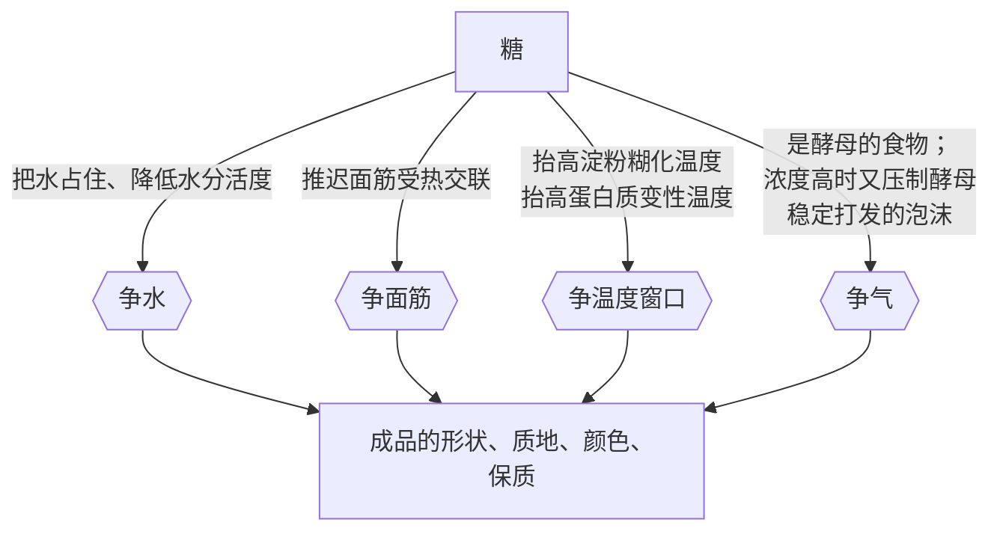
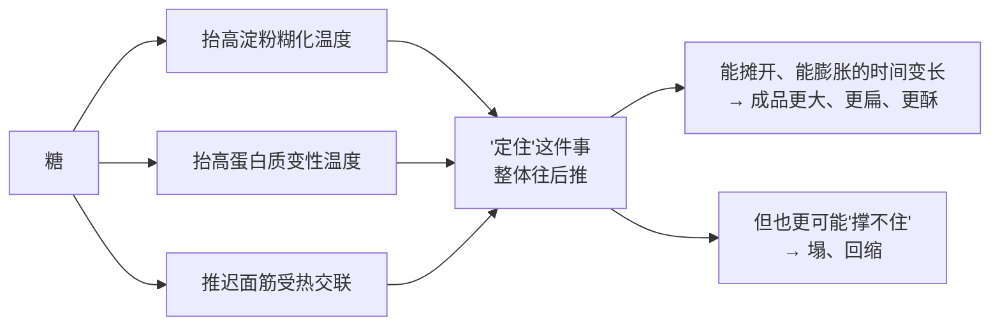
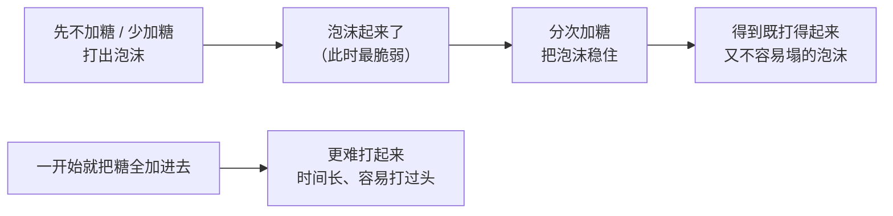
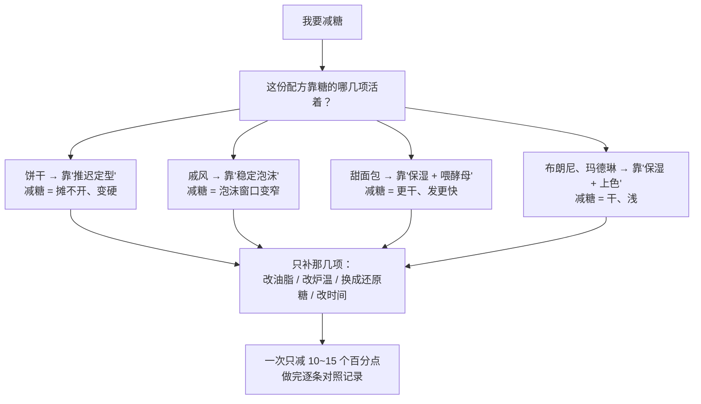

# 第 4 章 糖：甜以外的四件事

> **本章目标**：把第 1 章那张"糖在做五件事"的表**展开成可操作的判断**。
> 学完这一章，你面对"减糖"这个念头时，能立刻说出
> **你同时减掉了什么、成品会往哪个方向变、以及哪几项必须连带改**。
>
> 这是全书**最反直觉**的一章：糖在配方里最不重要的功能，恰恰是"甜"。

## 4.1 为什么糖值得单独一章

先摆一个事实：糖是七个角色里**唯一同时挂在四组竞争上的**。

**别的原料最多挂两组，糖挂四组。** 所以动糖是一份配方里**连锁反应最广**的改动之一——
这也是"减糖之后哪儿哪儿都不对"的根本原因。

## 4.2 第一件事：它把水占住

糖是**吸湿**的[^1]：它把水分子攥在身边，既不轻易交给面筋和淀粉，也不容易蒸发掉。

这件事有两个方向相反的后果，必须一起记：

| 方向 | 后果 |
|------|------|
| **对成品好的** | 更湿润、更不容易干、更耐放（[水分活度](../../glossary.md#water-activity)[^2]被压低，微生物也更难长） |
| **对面团"坏"的** | 分给面筋和淀粉的水变少 → 面筋更难形成、淀粉更难糊化 |

> **所以"糖让成品湿润"和"糖让结构变弱"是同一件事的两面。**
> 你不可能只要前者不要后者——这就是第 1 章说的"配平"。

多项研究在解释"糖为什么抬高糊化温度"时，把原因之一归结为
**糖对水的固定**（也就是把水占住，让淀粉分不到）。
也就是说，下一节那件事和这一节其实是同一个机制的延伸。

## 4.3 第二件事：它抬高"定住"的温度——而且不止淀粉

这是全章最硬的一块，也是本书反复要用的一条。

### 淀粉这边：五项独立研究，方向一致

| 研究对象 | 观察到的 |
|---------|---------|
| 甘薯淀粉 | 糖浓度越高，糊化峰值温度与糊化焓越高；顺序蔗糖 > 葡萄糖 > 果糖 |
| 西米淀粉 | 升高顺序：纯水 < 核糖 < 果糖 < 葡萄糖 < 麦芽糖 < 蔗糖 |
| **小麦淀粉**与马铃薯淀粉 | 蔗糖、葡萄糖、甘油都提高糊化温度与糊化焓；顺序蔗糖 > 葡萄糖 > 甘油 |
| 木薯淀粉 | 糖浓度升高，糊化与起始温度升高；蔗糖 > 葡萄糖 |
| **小麦淀粉 + 14 种低聚糖 + 阿洛酮糖 + 蔗糖**（0~60% w/w，DSC） | 该研究开宗明义：**蔗糖抬高小麦淀粉糊化温度的能力强于许多其他甜味剂**；而受测的**低聚糖抬得比蔗糖还高** |

> **这是本书目前证据最扎实的一条定量规律之一**：
> **糖越多，淀粉越晚糊化**；而且**不同的糖，效果不一样**。

最后那项研究还顺手回答了一个很多人关心的问题：
它明确指出，**"减糖的同时维持较高的糊化温度"一直是个难题**——
换句话说，**甜味剂替代糖时，最先丢掉的往往就是这一项**。

### 蛋白质那边：糖也在抬高变性温度

这一点常被漏掉，但对蛋糕、蛋奶类成品非常关键：

| 研究 | 观察到的 |
|------|---------|
| 用 DSC 比较蔗糖与海藻糖对两种蛋白质（溶菌酶、肌红蛋白）的稳定作用 | **含蔗糖的样品变性温度更高**，而且**在低水分条件下尤其明显** |
| 复合糖对液态蛋黄热稳定性的研究 | 加 4% 复合糖（葡萄糖、蔗糖、海藻糖、阿拉伯糖）可显著提高耐热性，把**变性温度提高到 77 °C 以上** |

两条独立证据，方向一致。再加上第 1 章引过的那条——
**蔗糖越多，面筋蛋白的受热交联被推迟或抑制得越厉害**——就凑齐了三条路径：

> ## 本章的核心结论：**糖是"定型时刻"的总开关。**
>
> 第 1 章说"什么时候定住决定了成品长什么样"，而糖是**同时**推迟三条定型路径的那一个。
> **所以改糖，改的从来不只是甜度，是整个成品的形状。**

在饼干这类**低水分高糖**的体系里，这条规律被推到极端：
一项专门研究指出，**蔗糖加上低水分把淀粉糊化温度抬得太高，
以至于烘烤过程中几乎没有淀粉糊化**；同时蔗糖推迟面筋交联，
于是**饼干定型更晚、直径更大**。

## 4.4 第三件事：上色——而且蔗糖本身还不够格

烘焙里的褐变有**两条不同的路**[^3]，常被混为一谈：

| | [美拉德反应](../../glossary.md#maillard) | [焦糖化](../../glossary.md#caramelization) |
|---|------------------------------------|--------------------------------------|
| 需要什么 | **氨基酸 + 还原糖** | **只要糖**，不需要氨基酸 |
| 蔗糖能不能直接参与 | ❌ **不能**——蔗糖不是还原糖 | 能 |
| 产物 | 褐色物质 + 大量香气分子 | 褐色物质 + 焦糖类香气 |

> **一个很多人不知道的细节**：**蔗糖本身不是还原糖**，
> 它要先分解成葡萄糖和果糖（[转化糖](../../glossary.md#invert-sugar)）才能参与美拉德反应。
> 所以"换一种糖，上色速度就变了"**有明确的化学理由**，不是玄学。
>
> （美拉德反应在另一本书里也讲过，那里讲的是锅里的情形；本书这里只讲烘焙相关的部分。）

### 有实验直接测到"换糖 = 换颜色"

一项研究在饼干配方里比较**蔗糖、转化糖与三种不同果糖含量的高果糖浆**：

| 观察到的 | 说明 |
|---------|------|
| **亮度 L\* 最高**（也就是颜色最浅）的是**蔗糖对照**与**转化糖**样品 | |
| **高果糖浆用量增加，L\* 显著下降**（颜色更深） | 果糖是还原糖，而且反应性强 |
| 各组的水分、脂肪、蛋白质、灰分**没有显著差异**；**质地却有差别**（对照 6.5 N，部分替代组更低） | 说明差别来自糖的种类，不是来自成分含量 |

### 还有一个前提常被忘记：**表面得先干**

第 3 章讲过：面包芯**不会越过水的沸点**，而表皮可以到 128.5~190.2 °C。
褐变只在表面发生，因为只有表面达得到那个温度。
一项研究给了定量旁证：**水分活度降到 0.4 以下是一个临界点，
越过之后 HMF[^4] 生成速率急剧上升**。

> **所以"上色不够"有两种完全不同的原因**：
> **糖不够**（尤其是还原糖不够），或者**表面没干**（炉温低、湿度大、模具挡住了热）。
> **这两种要用相反的手段处理**——第 32 章会给分诊方法。
>
> ⚠️ 广为流传的"美拉德反应从 140~165 °C 开始"这个数字
> **缺乏可靠一手出处**，本书不写它（见[出处登记](../../standards.md)）。

## 4.5 第四件事：对酵母，它既是食物也是压力

糖对酵母的作用**随浓度反转**——这是本书反复出现的模式（"同一样东西在不同用量下扮演相反的角色"）。

| 浓度 | 糖在做什么 | 依据 |
|------|----------|------|
| **低** | 现成的食物，发酵启动更快 | 发酵的基本机制 |
| **高** | **渗透胁迫**[^5]：把水从酵母细胞里拉出去 | 一项全基因组筛选发现，缺失后对高蔗糖敏感的 273 个基因中，**绝大多数同时对高浓度氯化钠或山梨醇敏感**——说明高糖对酵母主要就是**渗透问题**，不是"糖有毒" |

这条规律有一个很实在的行业旁证：**商品酵母是按用途分型卖的**。
一项研究测试了四株商品压榨酵母，它们各自被推荐用于
**可颂类、面包、冷冻面团、意式节庆蛋糕**，
结果发现它们在不同的复杂面团配方里**技术表现确实不同**。

> **所以"甜面团发得慢"不是你的错**，也不是"酵母不新鲜"。
> 它是**配方设计的必然结果**。应对方式有三条（第 11 章展开）：
> 用适合高糖环境的酵母、**加量**、或者**给它更多时间**——
> 但不要靠"多放糖喂它"，那正好是反方向。

## 4.6 第五件事：对打发的泡沫，它是"先难后稳"

第 1 章给过结论，这里补上它的操作含义：

> **蔗糖让蛋清更难打起泡，但打起来之后泡沫更稳定**；
> 提高氯化钠含量与延长搅打时间，都能促进蛋白质在气—液界面上的吸附。

这就是"**糖分次加入**"的完整理由：

> **这不是"仪式感"，是一个有取舍的顺序问题。**
> 反过来说：**戚风减糖的代价，是泡沫的可用时间窗变短**——
> 你从打发到进炉的每一分钟都变得更贵（第 36 章）。

## 4.7 换一种糖，你到底换掉了什么

这张表是本章最实用的一张。**注意每一列都是一个独立的功能**——
"等量替换"时它们**不会**一起跟过去。

| 换成 | 甜度 | 吸湿保湿 | 抬高糊化温度 | 上色 | 带不带水 | 要注意什么 |
|------|------|---------|------------|------|---------|-----------|
| **蔗糖（细砂糖）** | 基准 | 有 | **强**（多项研究里都排前列） | 间接：需先转化成还原糖 | 不带 | 本书的默认基准 |
| **葡萄糖** | 较低 | 有 | 有，但**弱于蔗糖** | **直接参与**（还原糖） | 不带 | 上色更快 |
| **果糖 / 高果糖浆** | 较高 | **强** | 更弱 | **很直接、很快** | **糖浆带水** | 一项饼干研究里高果糖浆用量越高，颜色越深 |
| **转化糖 / 蜂蜜 / 糖浆** | 视品种 | **强** | — | 直接（含还原糖） | **带水**，必须从含水量里扣掉 | 蜂蜜还带风味与酸度，⚠️ 具体酸度本书未核到 |
| **糖粉** | 同蔗糖 | 同蔗糖 | 同蔗糖 | 同蔗糖 | 不带 | ⚠️ **通常含防结块的淀粉**——看配料表；那部分淀粉会占掉一点水 |
| **红糖 / 黑糖** | 视品种 | 比白砂糖强 | — | 更深 | 含少量水 | 常被说"带酸、能配小苏打"，⚠️ **本书未核到其酸度的一手数据** |
| **高强度甜味剂**（各类代糖） | 极高（用量极小） | ❌ **几乎没有** | ❌ **通常没有** | ❌ **不上色** | 视剂型 | ❌ **不提供体积**。见下 |

### 关于代糖，本书只讲工艺，不讲营养

> **本书不做任何医疗 / 营养建议**，也不判断哪种甜味剂更健康。
> 从**工艺**角度能说的是很硬的一条：
>
> **甜味剂能替代的是"甜"，而甜是糖在配方里最不重要的功能。**
>
> 按 §4.1 那张图，糖还在做四件事：占住水、抬高定型温度、上色、
> 喂酵母 / 稳定泡沫。**用量只有百分之几克的高强度甜味剂，这四件一件都做不到**，
> 而且它连**体积**都补不上——原来那 50 g 糖占的空间没了。
>
> 有一项研究把这件事说得很直白：它比较了 14 种低聚糖、阿洛酮糖与蔗糖
> 对小麦淀粉糊化温度的影响，开篇就写道
> **"蔗糖抬高糊化温度的能力强于许多甜味剂，而减糖时维持较高的糊化温度一直是个难题"**。
> 该研究的发现是：**某些低聚糖抬得比蔗糖还高**——
> 也就是说，**减糖配方要补回来的不是甜，是这几项功能**，
> 而补法是选对替代物、并接受它带来的新问题。

## 4.8 减糖到底减掉了什么：一张诊断表

把前面所有内容收成一张能直接用的表。假设你把某份配方的糖**从 50% 降到 30%**
（**以面粉总量为 100%**）：

| 你会看到 | 原因 | 想补回来，要动什么 |
|---------|------|------------------|
| **摊得更小、更厚** | 三条定型路径同时前移 → 定型提前 | 降低炉温让它多流动一会儿；或提高油脂 |
| **更硬、更韧，不再"一咬就断"** | 被糖占住的水被释放，面筋能形成得更多 | 提高油脂（阻断面筋）；减少搅拌 |
| **更干、放一天就硬** | 失去了糖的保湿 | 用保湿性更强的糖（转化糖、蜂蜜）补一部分；或提高油脂 |
| **颜色更浅** | 能参与褐变的糖变少 | 用**还原糖**（葡萄糖、转化糖）替代一小部分；或提高炉温 / 延长上色段 |
| **（有酵母时）发得更快** | 渗透压力减小 | 缩短发酵时间，或减少酵母用量 |
| **（打发类）泡沫更难稳住** | 失去了蔗糖对泡沫的稳定作用 | 缩短从打发到进炉的时间；分次加糖的顺序更要讲究 |
| **更容易长霉、保质期变短** | 水分活度上升 | 这一项**没法用工艺补回来**——只能少做一点、快点吃完、或冷冻保存 |

> **所以正确的减糖方式是"小步 + 单变量 + 记录"**：
> 一次减 10~15 个百分点，只改这一项，做完把上面七行逐条对照，
> 记进[烘焙记录表](../../forms/bake-log.md)。
> **一次减一半，你会同时收到七个变化，而且分不清哪个是哪个引起的。**

## 4.9 常见说法辨析

按本书约定标注**证据强度**：✅ 有共识 / ⚠️ 有争议 / ❌ 明确错误 / 缺乏证据。
来源见[出处登记](../../standards.md)。

| 说法 | 判定 | 说明 |
|------|------|------|
| "**糖只是甜味剂，减糖就是变淡一点**" | ❌ **明确错误** | 糖同时做五件事：占住水、抬高淀粉糊化温度、抬高蛋白质变性温度并推迟面筋交联、上色、喂 / 压酵母与稳定泡沫。**五项独立研究**（含小麦淀粉）测到"糖越多糊化温度越高"；另有研究显示蔗糖提高蛋白质变性温度（低水分下尤其明显）。**减糖的成品会更小、更硬、更干、颜色更浅、更不耐放**——"变淡"概括不了其中任何一条 |
| "**代糖可以按甜度换算，1:1 顶替砂糖**" | ❌ **工艺上明确错误**（本书不评价营养） | 高强度甜味剂用量以毫克 / 克计，**补不上体积**，也补不上吸湿、糊化温度、上色这几项。一项比较 14 种低聚糖、阿洛酮糖与蔗糖对小麦淀粉糊化温度的研究开篇即指出：**蔗糖抬高糊化温度的能力强于许多甜味剂，减糖时维持较高糊化温度一直是难题**。**要替代，得分别补功能，而不是补甜度** |
| "**糖越多，酵母发得越快**" | ⚠️ **只在低浓度成立，高浓度反转** | 低浓度时糖是现成的食物；高浓度时是**渗透胁迫**——一项全基因组筛选显示，对高蔗糖敏感的酵母突变体**绝大多数同时对高浓度氯化钠或山梨醇敏感**。行业旁证：商品酵母按用途分型出售（面包 / 可颂 / 冷冻面团 / 意式节庆蛋糕），一项研究证实它们在不同复杂面团里表现确实不同 |
| "**蜂蜜可以等量替代砂糖**" | ❌ **至少三处不等价** | ①**带水**（必须从配方含水量里扣掉，否则面团整体偏稀）；②**含还原糖**，上色明显更快，容易外面深了里面还没熟；③**带风味与酸度**，可能影响用小苏打的配方的酸碱配平。⚠️ 蜂蜜的确切含水量与酸度**本书未核到**可引用的官方数值——**看你手上那瓶的标签** |
| "**红糖比白糖更湿润 / 更健康**" | "更湿润"⚠️ **有工艺理由但本书未核到定量数据**；"更健康"**本书不做判断** | 红糖含糖蜜成分，通常更吸湿、颜色更深、风味更重，这些是可观察的；但**具体的吸湿性与酸度数值本书没有核到一手数据**，因此不写数字。至于"更健康"——**超出本书范围，本书不做任何营养或医疗判断** |
| "**糖粉和细砂糖可以互换**" | ⚠️ **在多数配方里能用，但有两处差别** | ①**糖粉通常含防结块用的淀粉**（看配料表），那部分淀粉会占掉一点水；②**颗粒大小不同**，影响它在打发油糖时的行为。⚠️ 本书**没有核到**"糖的颗粒大小如何影响打发充气"的一手实验，因此**不给"必须用哪种糖打发"的结论** |
| "**上色不够就是糖放少了**" | ⚠️ **只是两个原因中的一个** | 另一个是**表面没干**。褐变只在表面发生，因为只有表面能越过水的沸点（面包芯不会越过沸点；一项吐司研究里表皮达到 128.5~190.2 °C）。一项研究观察到**水分活度降到 0.4 以下后 HMF 生成速率急剧上升**——**先干，才谈得上褐变加速**。所以要先分诊：是缺还原糖，还是表面太湿 |
| "**高糖配方要多放酵母才发得起来**" | ⚠️ **方向对，但不是唯一解，也不是随便加** | 高糖是渗透胁迫，确实会拖慢发酵。但"加量"只是三条路之一（另两条是**换适合高糖的酵母**和**给更多时间**），而且加量会同时改变风味积累。⚠️ 本书**没有核到**"糖到多少百分比就必须换酵母"的阈值数据，**因此不写阈值** |

## 4.10 一条可迁移的判断规则

> ## 糖是同时挂在四组竞争上的那个角色。所以动糖之前，要问的不是"会不会变淡"，而是：**定型会提前多少？**
>
> 三步：
>
> **① 列出糖在"这份"配方里的角色**——用动词写，不要只写"糖"。
> （占住水 / 抬高糊化温度 / 抬高变性温度 / 推迟面筋交联 / 上色 / 喂酵母 / 稳定泡沫 / 增甜）
> **② 问哪几项是这份配方**真正依赖**的。**
> （饼干依赖"推迟定型"；戚风依赖"稳定泡沫"；甜面包依赖"保湿 + 喂酵母"）
> **③ 减糖时，只补第 ② 步列出的那几项**，其余接受它变。

## 4.11 🔎 下次烤之前的用处

1. **把"减糖"翻译成"定型会提前"**。这一句能让你提前预见到形状变化，
   而不是烤完才发现"怎么变厚了"。
2. **减糖一次只减 10~15 个百分点**，并且**只改这一项**。
   一次减一半，你会同时收到七个变化。
3. **上色不够时先分诊**：缺还原糖，还是表面没干？
   这两种要用相反的办法处理。
4. **换糖 = 换功能，不是换甜度**。尤其注意**带水的糖**（蜂蜜、糖浆、转化糖）——
   要从配方的含水量里扣掉（第 3 章）。
5. **打发类成品减糖后，从打发到进炉的时间变得更贵**。
   提前把模具、烤箱、工具都准备好再开始打。
6. **甜面团发得慢是设计，不是故障**。别靠多放糖来"喂"它——那是反方向。
7. **减糖会缩短保质期**，而这一项**没法用工艺补回来**。少做一点，尽快吃完。
8. **不要尝生面糊**（美国 FDA：生面粉不是即食食品；各国口径不同，
   以自己所在地现行发布为准）。

## 4.12 思考题

1. 糖挂在第 1 章的哪四组竞争上？各举一个具体机制。
   为什么说"甜"是它最不重要的功能？
2. 本章列了**三条**被糖推迟的定型路径。分别是什么？各自的证据是什么？
3. 为什么"蔗糖本身不能直接参与美拉德反应"？
   这对"换一种糖，上色速度就变了"意味着什么？
4. **【案例】** 一份曲奇配方：面粉 100%、黄油 60%、细砂糖 55%、
   蛋 20%、盐 1%、小苏打 0.5%（**以面粉总量为 100%**）。
   你想把糖减到 35%，其余不动。
   （a）按本章的诊断表，预测形状、质地、湿润度、颜色四方面的变化；
   （b）这份配方里有小苏打——减糖对它有没有影响？为什么？
   （c）如果你**只想保住颜色**，最省事的一刀切在哪里？说明理由与代价。
5. **【案例】** 一份甜面包配方糖是 25%（面粉基准），有人为了"发得快一点"
   把糖加到 35%，结果**发得更慢了**，而且成品颜色深得发黑、里面还没熟透。
   请解释这三个现象各自的机制，并给出两条改法（一条改配方、一条改操作）。
6. **【辨析】** "代糖可以按甜度 1:1 换算顶替砂糖"——判断证据强度，
   列出至少四项它补不上的功能，并说明为什么"补甜度"这个思路本身就是错的。
7. **【辨析】** "上色不够就是糖放少了"——判断证据强度，
   说出另一个同样常见的原因，并设计一个在家就能做的对照来区分这两种情况。
8. 本章在三个地方写了"本书未核到"（蜂蜜的确切含水量与酸度、红糖的吸湿性数值、
   糖的颗粒大小对打发的影响）。挑两处说明：
   如果本书在这里写一个听起来很专业的数字，读者会付出什么代价？

> 📖 **参考答案**（想清楚再看）：[Q1](../../qa/04-sugar-qa.md#q1) ·
> [Q2](../../qa/04-sugar-qa.md#q2) · [Q3](../../qa/04-sugar-qa.md#q3) ·
> [Q4](../../qa/04-sugar-qa.md#q4) · [Q5](../../qa/04-sugar-qa.md#q5) ·
> [Q6](../../qa/04-sugar-qa.md#q6) · [Q7](../../qa/04-sugar-qa.md#q7) ·
> [Q8](../../qa/04-sugar-qa.md#q8)

## 4.13 本章实操

### 🅐 零成本版 · 任务一：给三份配方的糖"排个队"

找三份**不同品类**的配方（例如一份饼干、一份蛋糕、一份甜面包），
把糖换算成烘焙百分比（**以面粉总量为 100%**）。

| | 配方 A | 配方 B | 配方 C |
|---|-------|-------|-------|
| 品类 | | | |
| 面粉（＝100%） | | | |
| **糖的烘焙百分比** | % | % | % |
| 糖的形态（细砂 / 糖粉 / 红糖 / 蜂蜜 / 糖浆） | | | |
| 这份配方**最依赖**糖的哪一项功能？ | | | |

然后回答：

| 问题 | 你的答案 |
|------|---------|
| 糖最多的是哪份？它的成品是"更酥"还是"更软"？和本章的规律一致吗？ | |
| 有没有哪份用了**带水的糖**？如果有，它的实际含水量比表面看起来高多少？ | |
| 如果把糖最多的那份减 15 个百分点，你预测的**第一个**变化是什么？ | |

### 🅐 零成本版 · 任务二：从超市货架上找证据

不用买。找三样**带配料表**的甜口烘焙商品（饼干、蛋糕、面包各一）。

| 观察 | 商品 A | 商品 B | 商品 C |
|------|-------|-------|-------|
| 糖在配料表里排第几？ | | | |
| 用的是哪几种糖？（白砂糖 / 葡萄糖浆 / 果葡糖浆 / 麦芽糖醇…） | | | |
| 有没有**两种以上**的糖？ | | | |
| 标称保质期 | | | |
| 颜色（浅 / 中 / 深） | | | |

然后回答：

| 问题 | 你的答案 |
|------|---------|
| 为什么工业配方常常同时用**好几种糖**？（提示：§4.7 那张功能表） | |
| 保质期最长的那个，糖排得靠前吗？用"水分活度"解释你的观察 | |
| 颜色最深的那个，用了还原糖吗？ | |

> ⚠️ **诚实说明**：配料表**只给顺序不给比例**，这是**猜**不是**测**。
> 它训练的是"看到一样原料就问它在干什么"的反射。

### 🅐 零成本版 · 任务三：写一张"减糖 15 个百分点"的预测单

挑一份你**想做但还没做**的配方，**只写预测，先不做**。

| 项 | 填写 |
|----|------|
| 配方名与当前糖的百分比（**以面粉总量为 100%**） | |
| 减到多少？（建议一次 10~15 个百分点） | |
| 这份配方**最依赖**糖的哪几项功能？ | |
| 定型会提前多少？（定性即可：略微 / 明显） | |
| 预测 ①：形状 | |
| 预测 ②：质地 | |
| 预测 ③：湿润度与第二天的软硬 | |
| 预测 ④：颜色 | |
| 预测 ⑤：（有酵母 / 有打发时）发酵或泡沫会怎么变？ | |
| 我打算**连带**改哪一项来补偿？为什么？ | |

### 🅑 开火版 · 任务四：同一份面团，只改糖的**种类**（有烤箱时做）

第 1 章的实操已经做过"只改糖的**用量**"。这一次改**种类**——
这是更能看出机制的一组。

**需要**：一份你做过的饼干配方、厨房秤、同一个烤盘、尺子、纸笔。

**唯一变量**：糖的种类（**总量保持一致，按重量等量替换**）。

| 组 | 用的糖 | 出炉直径 | 出炉厚度 | **颜色（重点）** | 质地 | 第二天软硬 |
|----|-------|---------|---------|----------------|------|----------|
| ① 细砂糖（对照） | | mm | mm | | | |
| ② 葡萄糖 / 蜂蜜 / 转化糖（任选一种**还原糖**来源） | | mm | mm | | | |
| ③ 糖粉 | | mm | mm | | | |

> ⚠️ **如果第 ② 组用了蜂蜜或糖浆，必须把它带进来的水从配方里扣掉**，
> 否则你就同时改了两个变量（第 3 章）。
> 扣不准的话，**换成干的葡萄糖粉**——那样才是干净的单一变量。

做完回答：

| 问题 | 你的答案 |
|------|---------|
| 哪一组颜色最深？和"还原糖直接参与美拉德反应"一致吗？ | |
| 三组的直径差多少？这说明不同的糖抬高糊化温度的能力一样吗？ | |
| 第二天哪一组最软？用"吸湿保湿"解释 | |
| 这次实验的局限是什么？（至少两条） | |

### 🅑 开火版 · 任务五（加分）：糖一次加 vs 分次加（打发类）

**唯一变量**：打发蛋白时糖的加入方式。

| 组 | 做法 | 打发到硬性发泡用了多久 | 泡沫状态（细腻 / 粗糙） | 静置 5 分钟后是否出水 | 成品体积 |
|----|------|---------------------|----------------------|-------------------|---------|
| ① 一开始就把糖全加进去 | | | | | |
| ② 分三次加 | | | | | |

> **预期与解释**：研究显示**蔗糖让蛋清更难打起泡，但打起来之后更稳定**。
> 所以第 ① 组应该**更慢打起来**；第 ② 组应该更快起泡、且稳定性不差。
> 如果你的结果不是这样，**先怀疑变量没控好**（蛋的温度、盆有没有油、打蛋器转速）。
>
> ⚠️ **局限**：样本量 1、没有重复、靠肉眼判断发泡程度。
> 它能让你"体会到"这个现象，**不能证明或推翻任何定量结论**。
>
> ⚠️ **安全提醒**：**不要尝生面团、生面糊**（美国 FDA：生面粉不是即食食品，
> "把生谷物加工成面粉并不会杀死有害细菌"，而"烹熟是确保用面粉和生蛋做的食物安全的唯一方法"）；
> 生面粉与生蛋要和即食食物分开放。各国口径可能不同，以自己所在地现行发布为准。

## 4.14 本章依据

本章引用的来源与核对状态详见[参考书目与出处登记](../../standards.md)，具体对应如下：

| 本章用到的内容 | 依据 |
|--------------|------|
| 糖抬高淀粉糊化温度与糊化焓（甘薯、西米、**小麦**与马铃薯、木薯淀粉四项研究）；机制之一是"糖把水占住" | *JAFC* 1991、*Biopolymers* 1999、*Carbohydrate Polymers* 2007、*Journal of Food Engineering* 2013，✅ 均为摘要层面（第 1 章已引） |
| 第五项独立证据：14 种低聚糖 + 阿洛酮糖 + 蔗糖（0~60% w/w，DSC）对**小麦淀粉**糊化温度的影响；"蔗糖抬高糊化温度的能力强于许多甜味剂"；"减糖同时维持高糊化温度一直是难题"；某些低聚糖抬得比蔗糖更高 | *Food & Function* 2022 低聚糖与小麦淀粉糊化温度研究，✅ 摘要层面。**本章"代糖补不上糊化温度"的直接依据** |
| 饼干体系中蔗糖把糊化温度抬到几乎不糊化；蔗糖推迟面筋交联 → 定型更晚、直径更大 | *JAFC* 2009 蔗糖对饼干中面筋功能的研究，✅ 摘要层面 |
| 蔗糖提高蛋白质变性温度，**低水分条件下尤其明显**（溶菌酶、肌红蛋白，DSC） | *Journal of Physical Chemistry B* 2024 蔗糖与海藻糖稳定蛋白质的比较研究，✅ 开放获取 |
| 加 4% 复合糖可把液态蛋黄的变性温度提高到 77 °C 以上 | *Journal of Food Science* 2023 复合糖与盐对液态蛋黄热稳定性的研究，✅ 摘要层面 |
| 蔗糖不是还原糖，需先转化才能参与美拉德反应；焦糖化不需要氨基酸 | 糖化学的基本事实；本书在[术语表](../../glossary.md#invert-sugar)登记 |
| 饼干中比较蔗糖、转化糖与三种高果糖浆：蔗糖对照与转化糖样品亮度 L\* 最高；高果糖浆用量增加使 L\* 显著下降；各组水分 / 脂肪 / 蛋白质 / 灰分无显著差异，质地有差别（对照 6.5 N） | *Food Science & Nutrition* 2021 高果糖浆在饼干中的应用研究（开放获取），✅ |
| 水分活度降到 0.4 以下后 HMF 生成速率急剧上升（"先干才谈得上褐变加速"） | *European Food Research and Technology* 2008 膨松剂与 HMF 研究，✅ 摘要层面 |
| 面包芯不越过水的沸点；表皮可达 128.5~190.2 °C | *Food Research International* 2011 CFD 模拟、*Food Science & Nutrition* 2021 吐司失重与表皮温度研究，✅ |
| 高浓度糖对酵母主要是**渗透胁迫**（对高蔗糖敏感的突变体绝大多数同时对 NaCl 或山梨醇敏感） | *FEMS Yeast Research* 2006 全基因组筛选，✅ 摘要层面 |
| 商品酵母按用途分型（可颂类 / 面包 / 冷冻面团 / 意式节庆蛋糕），在不同复杂面团中技术表现确实不同 | *European Food Research and Technology* 2007 商品酵母菌株技术性能研究，✅ 摘要层面 |
| 蔗糖让蛋清更难起泡但泡沫更稳定；NaCl 与搅打时间促进界面吸附 | *Food Research International* 2007 蛋清起泡研究，✅ 摘要层面 |
| 生面粉与生面糊的安全 | 美国 FDA「Handling Flour Safely: What You Need to Know」，✅ 已核到官方页面。⚠️ 各国口径不同 |
| "美拉德反应从 140~165 °C 开始" | ⚠️ **缺乏可靠一手出处**，本书**不写这个数字**（第 1 章已登记） |
| **蜂蜜的含水量与酸度、红糖的吸湿性与酸度**的可引用数值 | ⚠️ **未核到**；本章只写方向，不写数字，并提示读者看产品标签 |
| **糖的颗粒大小对打发充气的影响** | ⚠️ **未核到**一手实验；本章因此不给"必须用哪种糖打发"的结论 |
| **高糖面团"糖超过多少就必须换酵母"的阈值** | ⚠️ **未核到**；只写三条应对方向，不写阈值 |

[^1]: [吸湿性](../../glossary.md#hygroscopicity)（hygroscopicity）与[蔗糖](../../glossary.md#sucrose)（sucrose）。
[^2]: [水分活度](../../glossary.md#water-activity)（water activity）与[推迟定型](../../glossary.md#sugar-set-delay)（delayed setting）。
[^3]: [美拉德反应](../../glossary.md#maillard)（Maillard reaction）、[焦糖化](../../glossary.md#caramelization)（caramelization）与[转化糖 / 还原糖](../../glossary.md#invert-sugar)（invert sugar / reducing sugar）。
[^4]: [5-羟甲基糠醛](../../glossary.md#hmf)（HMF）——褐变过程的一个可测指标。
[^5]: [渗透胁迫](../../glossary.md#osmotic-stress)（osmotic stress）与[耐高糖酵母](../../glossary.md#osmotolerant-yeast)（osmotolerant yeast）。

---

**下一章**：第 5 章 油脂——阻断面筋、充气与口感（"短化"到底是什么）。
糖是"推迟定型"的那个角色，油脂则是"反结构"的那个角色。
它们经常被一起加进配方里，因为它们**从两个完全不同的方向**把成品变酥。
