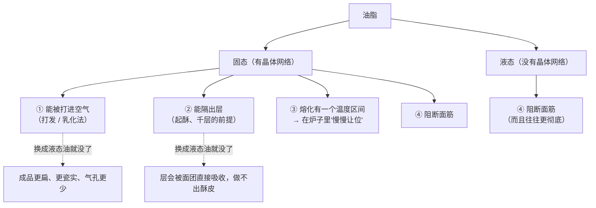
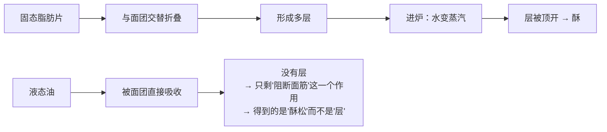
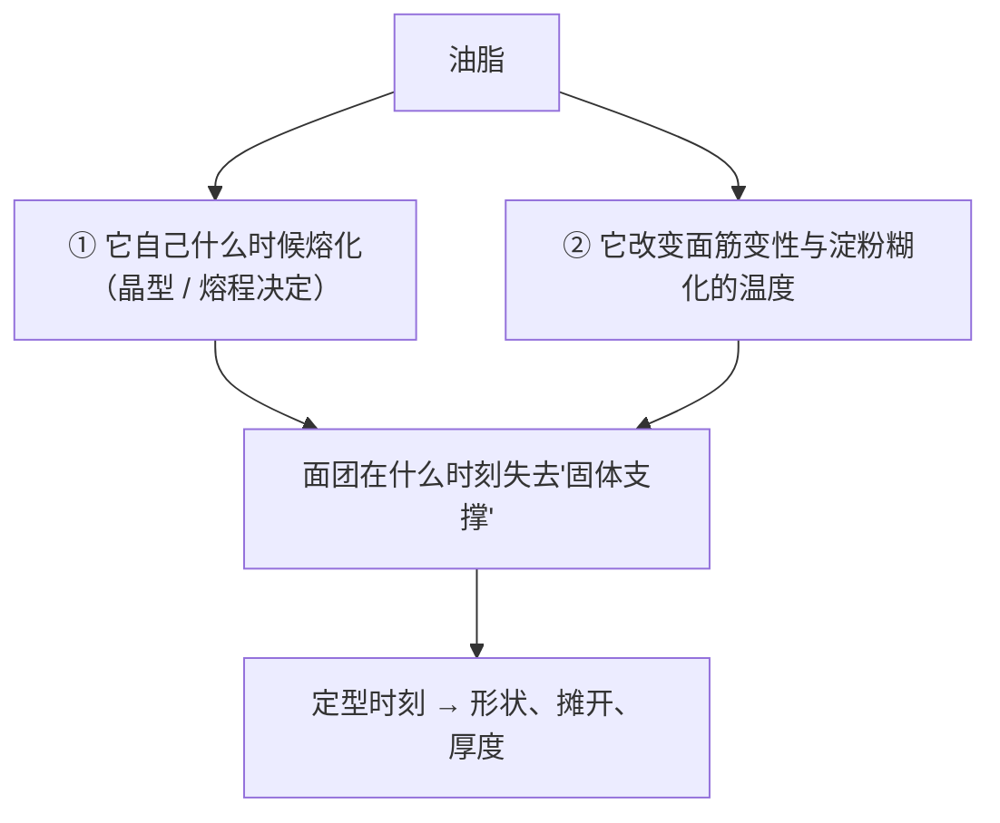
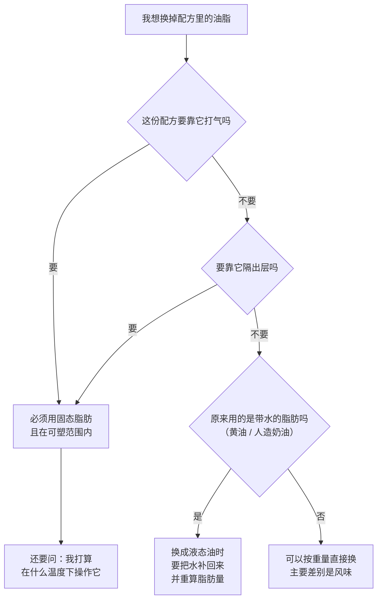

# 第 5 章 油脂：阻断面筋、充气与口感（"短化"到底是什么）

> **本章目标**：让你在看到配方里的黄油时，问出正确的问题——
> 不是"要不要软化"，而是**"这份配方要油脂干什么"**。
>
> 学完这一章，你会知道：油脂是七个角色里**唯一一个"是固态还是液态"
> 比"是什么油"更重要**的角色；而"等量替换"往往换掉的不是味道，是一整个功能。

## 5.1 油脂的第一身份：它是"反结构"的那个角色

第 1 章给过结论，这里把它放在整本书的坐标里：

| 角色 | 它对结构做什么 |
|------|--------------|
| 面粉 | **提供**结构材料（面筋 + 淀粉） |
| 水 | 让结构材料**能用**（水合、糊化） |
| 蛋 | **补充**结构（受热凝固的蛋白） |
| 糖 | **推迟**结构定住的时刻 |
| **油脂** | **阻断**结构的形成 |

英文把这个作用叫 **shortening**（[短化 / 起酥作用](../../glossary.md#shortening-effect)[^1]），
而且直接拿同一个词当"起酥油"的名字——**足见这个功能有多核心**。

> **机制上，它在做的事很朴素**：油脂裹在面粉颗粒与蛋白质表面，
> **妨碍它们互相连接成连续的面筋网络**，于是口感从"韧、有嚼劲"变成"酥、一咬就断"。

> ⚠️ **诚实说明（这一条在本书里要重复三次，因为它太容易被忽略）**：
> 脂质在面团里的**机理**，学界至今没有统一说法。
> 一篇关于面包中脂质的综述明确写道：关于脂质功能，
> **被广泛接受的观点常常互相对立**。
> 所以本章只写**方向与可复现的现象**，不给机理定论。

那么，学界**有**共识的部分是什么？一篇较新的综述把它总结为四条：
脂质**控制搅拌时面筋蛋白的水合动力学**、**影响面筋网络强度**、
**阻止发酵时气室合并**，并**改变烘烤时面筋变性与淀粉糊化的温度**。

注意最后一条：

> **油脂也在"争温度窗口"。** 它和糖一样，会改变"什么时候定住"。
> 这就是为什么第 1 章的核心图里，油脂同时连到三组竞争上。

## 5.2 固态还是液态：本章唯一最重要的分界

### 先看一个有法定依据的事实

| 产品 | 法定要求 | 由此可知 |
|------|---------|---------|
| **黄油**（美国法律的定义） | **乳脂不低于 80%**（按重量） | 剩下不到 20% 是**水与乳固形物** |
| **人造奶油**（美国 21 CFR 166.110） | **脂肪不低于 80%** | 同上，也带水 |
| **液态植物油** | — | 基本是 **100% 脂肪**，不带水 |

⚠️ **各国口径不同，以当地现行发布为准。**

这条法定事实立刻推翻一个流行做法：

> **"黄油 100 g 换成色拉油 100 g"，你至少同时改了三件事**：
>
> 1. **脂肪量变多了**（100 g 黄油里只有不到 80 g 是脂肪，100 g 油全是）；
> 2. **水变少了**（黄油带进来的那部分水没了——第 3 章讲过这有多要紧）；
> 3. **形态变了**（固态 → 液态，下面两节的全部内容）。

顺带说一个能印证"几个百分点就影响手感"的观察：
一项乳品研究提到，**脂肪含量更高的黄油（可达约 84%）
因为可塑性与加工 / 使用中的操作性能而被看重**，
而这些性能**主要由脂肪结晶网络与微观结构决定**。

> **所以"黄油"不是一种东西**：脂肪含量差几个百分点、
> 结晶状态不同，手感和表现就不一样。

### 固态脂肪能做、液态油做不到的三件事

第 ① 条有实验支持（第 1 章引过）：
一项用 X 射线显微 CT 观察饼干内部结构的研究发现，
**油脂用量增加时孔隙率和气孔尺寸增大，但气孔壁厚度不受影响**——
研究者据此判断**油脂主要是在把空气带进去**；
相比之下，糖会同时影响孔隙率、气孔尺寸和气孔壁厚度。

第 ② 条见 §5.4。

第 ③ 条最容易被忽略，也是下一节的主题。

## 5.3 固态脂肪为什么能干活：晶体网络、可塑范围与晶型

"固态"这两个字在油脂上不是一个开关，而是**一条随温度变化的曲线**。

### 固体脂肪含量与"可塑范围"

一块黄油在任何温度下都是**固体晶体 + 液态油的混合物**。
固体所占的比例叫 **固体脂肪含量（SFC）**[^2]，它**随温度升高而下降**。

> **一块脂肪好不好用，取决于它在你操作的那个温度下，固体和液体的比例合不合适。**
>
> - 固体太多（太冷）→ 硬、脆、**一压就碎**，擀不开、裹不住；
> - 固体太少（太暖）→ 软、塌、**留不住气泡**，也隔不出层；
> - 中间那段"又能变形又不流动"的温度区间，就是这块脂肪的
>   **[可塑范围](../../glossary.md#plastic-range)**。

这解释了第 1 章辨析栏那句"黄油必须软化到室温"为什么**只对一部分做法成立**：
不同做法要的是这条曲线上**不同的点**。

| 做法 | 需要的状态 | 为什么 |
|------|-----------|--------|
| **打发（乳化法）** | 能压出指印的固态 | 太硬打不进空气；化了就留不住气 |
| **起酥 / 裹入** | **冷而硬，但还能擀开** | 要它在面团之间**保持成层**；太软会被吸收，太硬会断裂成碎块 |
| **搓酥（派皮、司康）** | 冷、硬、成块 | 要它以**颗粒**形式存在，烤时熔化留下空隙 |
| **融化黄油**（很多马芬、布朗尼） | 液态 | 根本不需要打发，只要"阻断面筋 + 带来风味" |

### 晶型：同样的脂肪，能排成不同的样子

脂肪结晶有多种**晶型**（多晶型现象）[^3]，常见的记法是 α、β′、β。
它们的熔点、晶体大小与网络性质都不同。

一项关于可颂用专用油脂的研究直接把行业偏好写了出来：
**β′ 晶型是烘焙应用中热力学上受偏好的那一种**，
该研究的目标之一正是**促进 β′ 晶体形成并减小晶体尺寸**。

另一项研究提醒了另一件很实际的事：给裹入用油脂做**机械加工（塑化）**
会**对质地产生不利影响**——也就是说，**你怎么把黄油打软，本身也是一个变量**。

> **可迁移的判断**：
> **"黄油的温度和你怎么处理它，是两个独立的变量，而且都会影响成品。**
> 这也是为什么很多配方会写"用擀面杖敲打成片"而不是"用手捏软"——
> 它们得到的固体 / 液体比例和晶体结构并不一样。

⚠️ **诚实说明**：本书**没有核到**"家用黄油在各温度下的固体脂肪含量曲线"
这类可直接引用的数据，因此**不给任何具体温度数字**
（"黄油要在多少 °C 操作"这类说法在网上到处都是，但本书查不到一手出处）。
**能给你的是判据**：用手指按下去——
**能留下清晰指印但不粘手、不出油**，就在可塑范围里。

## 5.4 分层：起酥类为什么必须用固态脂肪

起酥类（酥皮、千层、可颂）的原理只有一句话：

> **建立"面团—油脂—面团—油脂"交替的多层结构，
> 然后在烤箱里靠蒸汽把层顶开。**

一项关于多层面团—油脂体系的综述明确指出：
关键是建立这个多层结构，并在加工中**维持它**，
以便烘烤时靠蒸汽把层撑开。
同一篇综述同时诚实地写道：
**蒸汽被困住并把层顶起来的确切机制、以及油脂相在烘烤时释放出的水贡献多少，目前仍不清楚。**

关于用量，有一个**写明了基准**的参考值：

> 可颂这类起酥类点心，**裹入油可达面团重量的 35%**
> （注意基准：**以面团重量为 100%**，不是以面粉为 100%）。

同一篇文献还写了一句本章反复要说的话：
**不饱和油在室温下是液态的，无法提供富含饱和脂肪的固态脂肪所具有的工艺功能。**

> **所以"起酥"和"酥松"是两件事**：
> **层**（千层、可颂）必须靠固态脂肪隔开；
> **酥松**（曲奇、派皮的口感）只需要阻断面筋，液态油也能做到一部分。
> 看到一份配方要求"黄油冷藏、动作要快"，那它要的是**前者**。

## 5.5 油脂也在改变"什么时候定住"

第 4 章说糖是"定型时刻的总开关"，油脂则是另一只手。

有一条来自烘焙实物的直接证据：一项研究用 36 种不同蜡与植物油做成的油凝胶[^4]
替代饼干里的起酥油，发现：

| 用哪种油凝胶 | 结果 |
|------------|------|
| **巴西棕榈蜡**油凝胶（熔点最高） | 饼干**质地更强** |
| **蜂蜡**油凝胶 | 饼干**摊得更开、硬度更低** |

> **同样的"脂肪含量"，只因为它熔化的温度不同，饼干的摊开与硬度就不同。**
> 这就是"油脂在争温度窗口"的实物证据——
> 脂肪什么时候熔化、什么时候不再支撑结构，直接改变了成品的形状。

再加上第 1 章引过的那条：脂质会**改变烘烤时面筋变性与淀粉糊化的温度**。
于是油脂对定型的影响至少有两条路径：

## 5.6 换油的代价表

这张表按**功能**列，不按"哪种更好"列——因为哪种更好取决于你要它干什么。

| 换成 | 能打发充气 | 能隔出层 | 阻断面筋 | 带不带水 | 风味 | 最适合 |
|------|----------|---------|---------|---------|------|--------|
| **黄油** | ✅ | ✅ | ✅ | **带**（乳脂不低于 80%，其余是水与乳固形物） | 强 | 需要风味 + 层 + 打发的一切 |
| **起酥油**（塑性油脂） | ✅ | ✅ | ✅ | 通常不带 | 弱 | 需要稳定可塑性、不要奶味的场合 |
| **人造奶油** | 视产品 | 视产品 | ✅ | **带**（脂肪不低于 80%） | 视产品 | 看它的固体脂肪含量而定 |
| **液态植物油** | ❌ | ❌ | ✅（往往更彻底） | 不带 | 弱~中 | 马芬、部分蛋糕、需要"湿润 + 柔软"的成品 |
| **融化的黄油** | ❌ | ❌ | ✅ | 带 | 强 | 布朗尼、部分马芬——**它和"软化黄油"不是一回事** |
| **油凝胶等结构化油脂** | 视配方 | 视配方 | ✅ | 视配方 | 弱 | 目前主要是研究与工业方向；一项研究显示不同蜡做的油凝胶会**明显改变饼干的摊开与硬度** |

### 一个"官方规定"层面的背景

起酥油曾经大量依赖**部分氢化油**。美国 FDA 在 **2015 年 6 月 16 日**发布最终认定，
结论是**部分氢化油不属于"一般认为安全"（GRAS）**；
多数用途的合规截止日是 **2018 年 6 月 18 日**。

> **本书列出这条只是为了说明一件事**：你今天买到的"起酥油"，
> 配方可能和十几年前的书里写的**不是同一种东西**——
> 它的固体脂肪含量曲线、可塑范围、晶型行为都可能变了。
> **这也是"老配方在今天做不出来"的一个可能原因。**
>
> ⚠️ **各国口径不同、且会修订**，以自己所在地现行发布为准。
> 本书**不做任何健康或营养建议**。

## 5.7 常见说法辨析

按本书约定标注**证据强度**：✅ 有共识 / ⚠️ 有争议 / ❌ 明确错误 / 缺乏证据。
来源见[出处登记](../../standards.md)。

| 说法 | 判定 | 说明 |
|------|------|------|
| "**黄油必须软化到室温**" | ⚠️ **只对打发法成立**，对起酥类**明确错误** | 三类做法要的是固体脂肪含量曲线上**完全不同的点**：打发要"能压出指印的固态"；**起酥要冷而硬但还能擀开**（太软被面团吸收、层就没了）；融化黄油的配方两者都不需要。⚠️ 本书**没有核到**家用黄油的固体脂肪含量—温度曲线数据，**因此不给温度数字**，只给判据：**能留下清晰指印、不粘手、不出油** |
| "**黄油可以等量换成植物油**" | ❌ **明确错误，而且至少错三处** | ①**脂肪量变了**：按美国法律定义黄油乳脂不低于 80%，等重替换会让脂肪多出约两成；②**水变了**：黄油带进来的那部分水没了（第 3 章：改水是连锁反应最广的改动之一）；③**功能变了**：液态油**打不进空气、隔不出层**。一项文献直接写道：不饱和油在室温下是液态的，**无法提供固态脂肪的工艺功能** |
| "**起酥油不如黄油**" | ⚠️ **取决于你要它干什么** | 从**功能**看，塑性起酥油通常有更稳定的可塑范围、更少的水，在需要稳定操作性的场合是优点；黄油的优势是**风味**。本书不做"哪种更好"的判断，只提醒：**起酥油的配方在过去十几年里变过**——美国 FDA 于 2015 年认定部分氢化油不属于 GRAS，多数用途 2018 年起不得再添加。**老配方与今天的产品未必对得上**。⚠️ 各国口径不同 |
| "**融化的黄油和软化的黄油差不多**" | ❌ **明确错误** | 它们在固体脂肪含量曲线上是两个完全不同的点。**融化之后晶体网络已经不存在了**：打不进空气、隔不出层，而且面团在入炉前就更软、更早摊开。第 1 章那个"饼干摊成一大片薄饼"的案例里，融化黄油正是嫌疑最大的那一条 |
| "**油放得越多越酥**" | ⚠️ **在一定范围内成立，但它同时改了别的** | 一项研究在特定范围内观察到"糖或油脂越多，饼干直径越大、厚度越小"；X 射线显微 CT 显示油脂主要影响**孔隙率与气孔大小**（气孔壁厚度不受影响）。但油脂多了也意味着**面团更软、更难成型、更早摊开**，而且**结构更弱**。⚠️ 该研究摘要未写明百分比基准，**本书只用方向不用绝对数字** |
| "**裹入油越冷越好**" | ⚠️ **过头就坏事** | 起酥要的是"保持成层"，所以太软不行；但**太硬会碎裂成块，层就断了**。一项关于裹入用油脂的研究还提醒：**机械加工（塑化）本身会对质地产生不利影响**——也就是说"怎么把它弄软"也是一个变量。**判据不是温度计，是"能弯不能断"** |
| "**橄榄油 / 各种风味油可以随便替换配方里的油**" | ⚠️ **风味可以换，功能不能乱换** | 只要原配方用的本来就是**液态油**，换一种液态油在功能上影响较小（主要是风味与烟点）；但**把固态脂肪换成液态油**是换掉功能（见上）。本书**不做健康比较** |
| "**只要脂肪含量一样，用什么脂肪都一样**" | ❌ **明确错误** | 一项用 36 种蜡—植物油油凝胶替代饼干起酥油的研究发现：**熔点最高的巴西棕榈蜡油凝胶让饼干质地更强，而蜂蜡油凝胶让饼干摊得更开、硬度更低**。**脂肪什么时候熔化，直接改变成品形状**——这是"油脂在争温度窗口"的实物证据 |
| "**油脂在面团里的作用已经研究清楚了**" | ❌ **不是** | 一篇面包脂质综述明确写道：关于脂质功能，**被广泛接受的观点常常互相对立**；一篇起酥类综述也写道：**蒸汽把层顶起来的确切机制目前仍不清楚**。本书因此只写方向与可复现现象，**不给机理定论**——而你在网上看到的那些言之凿凿的机理解释，多半没有这层保留 |

## 5.8 一条可迁移的判断规则

> ## 换油之前，先问三句：**它在这份配方里要打气吗？要隔层吗？它带了多少水？**
>
> 这三句把"能不能换"拆成了可回答的问题：
>
> | 问题 | 如果答案是"要" | 如果答案是"不要" |
> |------|--------------|----------------|
> | **要打气吗**（打发法、乳化法） | **必须固态**，而且要在可塑范围里 | 液态油可以 |
> | **要隔层吗**（起酥、千层、派皮） | **必须固态且冷**，而且要能擀开不断 | 液态油可以 |
> | **它带多少水**（黄油、人造奶油带，油不带） | 换的时候要**把水补回配方** | 直接换 |

## 5.9 🔎 下次烤之前的用处

1. **别再问"要不要软化黄油"，先问"这份配方要黄油干什么"。**
   打发要指印状固态，起酥要冷硬能擀，融化黄油的配方两者都不需要。
2. **判据用手不用温度计**：能留下清晰指印、不粘手、不出油 —— 就在可塑范围里。
   （本书没有核到可靠的温度数据，所以给的是判据。）
3. **黄油换油时，脂肪量和水量都要重算**：
   黄油的乳脂不低于 80%，等重替换会让脂肪多出约两成，同时丢掉那部分水。
4. **做酥皮 / 千层时，"快"比"准"重要**——
   油一软，层就开始消失。备料、擀制、冷藏的节奏要事先排好。
5. **成品太扁、气孔太少时，先怀疑油脂的状态**（第 1 章排查顺序：
   先改操作变量，再改测量，最后才改配方）。
6. **老配方在今天做不出来，可能是原料变了**：
   美国 FDA 于 2015 年认定部分氢化油不属于 GRAS，多数用途 2018 年起不得再添加，
   所以"起酥油"在配方书写成的年代和今天可能不是同一种东西。
   ⚠️ 各国口径不同，以当地现行发布为准。
7. **对油脂的机理保持谦虚**：连综述都写着"被广泛接受的观点常常互相对立"。
   **遇到失败时，先记录现象，再找解释，而不是反过来。**

## 5.10 思考题

1. 为什么说油脂是"反结构"的角色？它阻断的是什么？
   为什么英文用 shortening 这个词同时指作用和产品？
2. 固态脂肪能做而液态油做不到的**三件事**分别是什么？
   哪一件是起酥（千层）的前提？
3. 按美国法律，黄油的乳脂不低于 80%。请据此回答：
   把配方里 100 g 黄油换成 100 g 色拉油，你**至少**改了哪三件事？
   （提示：其中一件和第 3 章有关）
4. **【案例】** 一份曲奇配方：面粉 100%、黄油 55%、糖 45%、蛋 15%、
   泡打粉 1%（**以面粉总量为 100%**）。
   甲照做，把黄油从冰箱拿出来直接切块用；乙把黄油放到完全融化再用；
   丙放到"能压出指印"再打发。三个人其余步骤完全一样。
   （a）预测三份成品在**直径、厚度、内部气孔**三方面的差别，并说明机制；
   （b）如果丙的成品"内部气孔最多"，这和哪项研究的结论一致？
   （c）甲的做法有没有可能是**对的**？在什么目标下？
5. **【案例】** 有人做可颂，裹入黄油时"黄油裂成一块块，擀开后层看不出来，
   成品像面包不像可颂"。他的记录是：黄油刚从冷冻室拿出来、厨房很凉、
   他一次擀到位没有中途冷藏。
   （a）列出至少三条可能原因，分别属于第 1 章四组竞争中的哪一组；
   （b）给出一个一次只改一个变量的排查顺序，并说明为什么"再冷一点"**不是**正解。
6. **【辨析】** "只要脂肪含量一样，用什么脂肪都一样"——判断证据强度，
   用一项研究的结论反驳它，并说明这条结论指向第 1 章的哪一组竞争。
7. **【辨析】** "油放得越多越酥"——判断证据强度，
   说明它在什么范围内成立、越过范围会出现什么问题，
   并设计一个在家能做的对照实验。
8. 本章在两处明确写了"学界没有定论"（脂质的机理、蒸汽顶开层的机制），
   在一处写了"本书没有核到数据"（黄油的固体脂肪含量—温度曲线）。
   请说明：本书在最后这一处改用"手指判据"而不是温度数字，
   对读者来说**多了**什么、**少了**什么？

> 📖 **参考答案**（想清楚再看）：[Q1](../../qa/05-fat-qa.md#q1) ·
> [Q2](../../qa/05-fat-qa.md#q2) · [Q3](../../qa/05-fat-qa.md#q3) ·
> [Q4](../../qa/05-fat-qa.md#q4) · [Q5](../../qa/05-fat-qa.md#q5) ·
> [Q6](../../qa/05-fat-qa.md#q6) · [Q7](../../qa/05-fat-qa.md#q7) ·
> [Q8](../../qa/05-fat-qa.md#q8)

## 5.11 本章实操

### 🅐 零成本版 · 任务一：给三份配方的油脂做"功能诊断"

找三份用到油脂的配方（最好品类不同），逐份填表。

| | 配方 A | 配方 B | 配方 C |
|---|-------|-------|-------|
| 品类 | | | |
| 面粉（＝100%） | | | |
| **油脂的烘焙百分比** | % | % | % |
| 用的是什么油脂？什么状态？（冷硬 / 软化 / 融化 / 液态油） | | | |
| 它**要打气**吗？（配方里有"打发到发白蓬松"吗） | | | |
| 它**要隔层**吗？（配方里有"折叠""擀开""冷藏"吗） | | | |
| 它**带水**吗？（黄油、人造奶油带；液态油不带） | | | |
| **结论：这份配方能不能换成液态油？** | | | |

### 🅐 零成本版 · 任务二：读三份商品的配料表，找油脂的踪迹

| 观察 | 商品 A | 商品 B | 商品 C |
|------|-------|-------|-------|
| 品类（饼干 / 酥皮点心 / 蛋糕…） | | | |
| 用的是什么油脂？（黄油 / 人造奶油 / 起酥油 / 植物油 / 棕榈油…） | | | |
| 油脂排在配料表第几位？ | | | |
| 有没有乳化剂？ | | | |
| 成品是**有层**还是**酥松**？ | | | |

然后回答：

| 问题 | 你的答案 |
|------|---------|
| "有层"的那些，用的是固态脂肪吗？和本章的结论一致吗？ | |
| 为什么工业配方常用棕榈油类而不是黄油？（从**功能**角度答，不谈健康） | |

### 🅐 零成本版 · 任务三：做一次"指印测试"，建立你自己的判据

**需要**：一块黄油、一个手指、一支笔。**不开火。**

把黄油从冷藏室取出，每隔 10 分钟按一次，记录状态：

| 时间 | 按下去的感觉 | 有没有留下清晰指印 | 粘不粘手 | 有没有出油 | 判断：可塑范围内？ |
|------|------------|------------------|---------|-----------|------------------|
| 0 分钟（刚取出） | | | | | |
| 10 分钟 | | | | | |
| 20 分钟 | | | | | |
| 30 分钟 | | | | | |
| 40 分钟 | | | | | |

> **这张表的价值**：它给你的是**你家厨房、这个季节、这个牌子的黄油**的真实时间表。
> 本书**没有核到**可引用的固体脂肪含量—温度数据，所以**不给温度数字**——
> 但你可以用这张表建立自己的判据，而且它比任何书上的数字都更准确。
>
> ⚠️ 天气一变就要重做。**夏天和冬天不是同一张表。**

### 🅑 开火版 · 任务四：同一份饼干，只改油脂的状态（有烤箱时做）

第 1 章的加分任务已经提过这个实验，这里给完整版本与判读方法。

**需要**：一份你做过的饼干配方、同一块黄油、厨房秤、
同一个烤盘、尺子、计时器、纸笔。

**唯一变量**：黄油下手时的状态。其余原料、克数、搅拌时间、每块重量、
厚度、炉温、时间**全部一致**，三组**同时进炉**（同一烤盘分三区，做好标记）。

| 组 | 黄油状态 | 面团手感 | 出炉直径 | 出炉厚度 | 内部气孔（切开看：多 / 少） | 口感（酥 / 硬 / 韧） |
|----|---------|---------|---------|---------|--------------------------|--------------------|
| ① 冷藏取出、硬（切小块搓入） | | mm | mm | | |
| ② 室温、能压出指印（打发） | | mm | mm | | |
| ③ 完全融化 | | mm | mm | | |

做完回答：

| 问题 | 你的答案 |
|------|---------|
| 哪一组内部气孔最多？和"油脂主要在带入空气"这个结论一致吗？ | |
| 哪一组摊得最开？为什么？ | |
| 哪一组最酥？"酥"和"气孔多"是同一件事吗？ | |
| 如果你想要"更厚更酥"，会选哪一组？还会**连带**改什么？ | |
| 这次实验的局限是什么？（至少两条） | |

### 🅑 开火版 · 任务五（加分）：同一份配方，黄油 vs 等脂肪量的液态油

这一组比"等重替换"更干净，因为它**先把脂肪量对齐**。

**换算方法**（用得上第 3 章）：

| 步骤 | 怎么算 |
|------|--------|
| 原配方黄油 | 例如 100 g |
| 它含的脂肪 | 按美国法定下限，**至少 80 g**（你手上那盒的实际值看标签） |
| 换成液态油 | 用 **80 g 油**（不是 100 g） |
| 差掉的那 20 g | 那是水与乳固形物——**补 20 g 水（或牛奶）回去** |

| 组 | 油脂 | 出炉直径 | 厚度 | 气孔 | 口感 | 第二天软硬 |
|----|------|---------|------|------|------|----------|
| ① 黄油 100 g | | mm | mm | | | |
| ② 液态油 80 g + 水 20 g | | mm | mm | | | |

> **这个实验最有意思的地方**：即使你把脂肪量和水量都对齐了，
> 两组**仍然会不一样**——因为**形态**这一项补不回来（打气、隔层）。
> 这正是本章想让你亲眼看到的东西。
>
> ⚠️ **局限**：黄油的实际脂肪含量以标签为准（法定下限是 80%，实际可能更高）；
> 乳固形物带来的风味与褐变也没有被补偿。这组实验能说明方向，**不能定量**。
>
> ⚠️ **安全提醒**：**不要尝生面团、生面糊**（美国 FDA：生面粉不是即食食品）；
> 融化黄油时小心烫伤与飞溅；生面粉与生蛋要和即食食物分开放。
> 各国口径可能不同，以自己所在地现行发布为准。

## 5.12 本章依据

本章引用的来源与核对状态详见[参考书目与出处登记](../../standards.md)，具体对应如下：

| 本章用到的内容 | 依据 |
|--------------|------|
| 黄油的乳脂不低于 80%（按重量） | 美国 21 U.S.C. 321a（黄油的法定定义），✅ 已核到法条文本。⚠️ 各国口径不同 |
| 人造奶油的脂肪不低于 80% | 美国 21 CFR 166.110「Margarine」，✅ 已核到法规原文 |
| 高脂黄油（可达约 84%）因可塑性与操作性能被看重，而这些性能主要由脂肪结晶网络与微观结构决定 | *Journal of Dairy Science* 2026 奶油成熟条件与高脂黄油质地研究，✅ 摘要层面 |
| **β′ 晶型是烘焙应用中热力学上受偏好的晶型**；研究目标之一是促进 β′ 形成并减小晶体尺寸 | *Food Research International* 2026 单甘酯油凝胶结晶调控（可颂用专用油脂）研究，✅ 摘要层面 |
| 裹入用油脂的**机械加工（塑化）会对质地产生不利影响**；这类脂肪的固体脂肪含量与力学性质对温度敏感 | *Current Research in Food Science* 2025 双凝胶替代可颂裹入油研究（开放获取），✅ |
| 可颂这类起酥点心的裹入油**可达面团重量的 35%**（基准：面团重量）；不饱和油室温下是液态，**无法提供固态脂肪的工艺功能** | 同上（该文引自两部烘焙工艺著作），✅ 开放获取全文已核 |
| 油脂用量增加时孔隙率与气孔尺寸增大、气孔壁厚度不受影响 → 油脂主要在**带入空气**；糖或油脂越多，饼干直径越大、厚度越小 | *Journal of Food Engineering* 2009 糖与油脂在糖酥饼干中的作用，✅ 摘要层面。⚠️ 原文摘要未写明百分比基准，**本章只用方向** |
| 不同蜡做的油凝胶替代起酥油：**巴西棕榈蜡油凝胶（熔点最高）→ 饼干质地更强；蜂蜡油凝胶 → 摊得更开、硬度更低** | *Current Research in Food Science* 2025 油凝胶替代起酥油的高光谱与机器学习研究（开放获取），✅ |
| 脂质**控制搅拌时面筋蛋白的水合动力学**、影响网络强度、阻止发酵时气室合并、**改变烘烤时面筋变性与淀粉糊化的温度** | *Comprehensive Reviews in Food Science and Food Safety* 2026 小麦粉脂质综述（开放获取），✅ |
| 关于脂质功能，**被广泛接受的观点常常互相对立** | *Journal of Cereal Science* 2011 面包脂质综述，✅ 摘要层面 |
| 起酥类的关键是建立并维持面团与油脂交替的多层结构，烘烤时靠蒸汽把层撑开；**蒸汽顶开层的确切机制仍不清楚** | *Critical Reviews in Food Science and Nutrition* 2016 多层面团—油脂体系综述，✅ 摘要层面 |
| 美国 FDA 于 2015 年 6 月 16 日发布最终认定：**部分氢化油不属于 GRAS**；多数非申报用途的合规截止日为 2018 年 6 月 18 日 | 美国 FDA「Final Determination Regarding Partially Hydrogenated Oils」，✅ 已核到官方页面。⚠️ 各国口径不同；**本书不做任何健康或营养建议** |
| 生面粉与生面糊的安全 | 美国 FDA「Handling Flour Safely: What You Need to Know」，✅ 已核到官方页面 |
| **家用黄油的固体脂肪含量—温度曲线**（"黄油要在多少 °C 操作"） | ⚠️ **未核到**可引用数据，**本章因此不给任何温度数字**，改用手指判据（能留下清晰指印、不粘手、不出油） |
| **不同裹入油在家庭条件下的最佳操作温度区间** | ⚠️ **未核到**；只给判据"能弯不能断" |

[^1]: [短化 / 起酥作用](../../glossary.md#shortening-effect)（shortening effect）与[固态脂肪 / 液态油](../../glossary.md#solid-fat)（solid fat / liquid oil）。
[^2]: [固体脂肪含量](../../glossary.md#solid-fat-content)（solid fat content, SFC）与[可塑范围](../../glossary.md#plastic-range)（plastic range）。
[^3]: [脂肪多晶型](../../glossary.md#polymorphism)（polymorphism：α / β′ / β）。
[^4]: [裹入与起酥层](../../glossary.md#lamination)（lamination）与[油凝胶](../../glossary.md#oleogel)（oleogel）。

---

**下一章**：第 6 章 蛋——一样东西同时是水分、乳化剂、结构和气泡。
糖推迟定型、油脂阻断结构，而蛋是**唯一一个同时补充结构和补充气**的角色——
也因此是最难替换的那一个。
