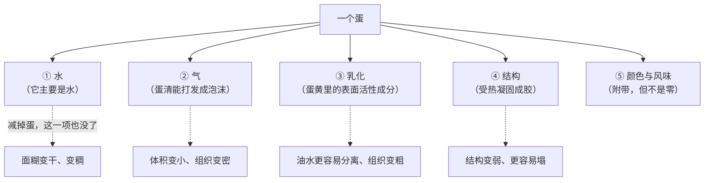
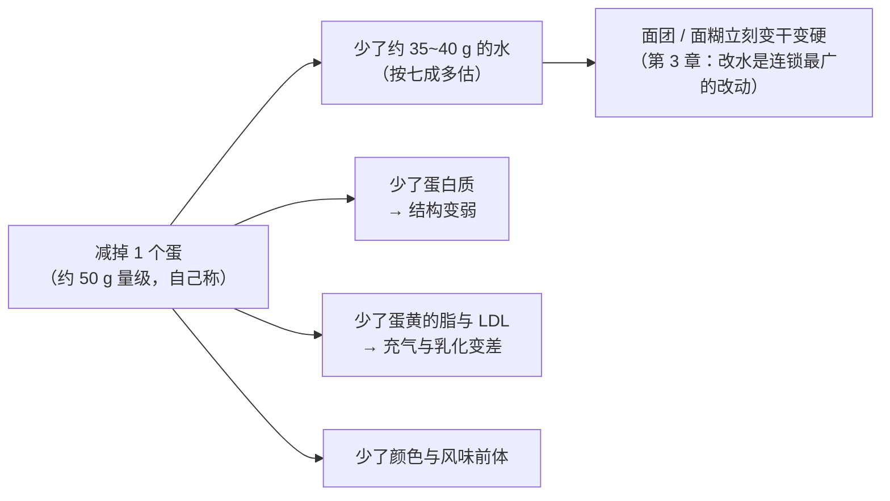
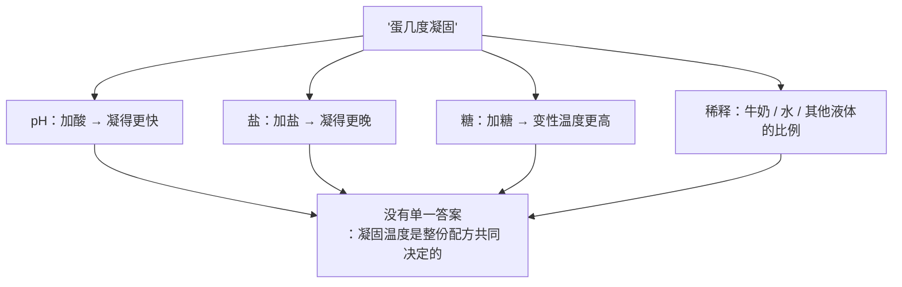
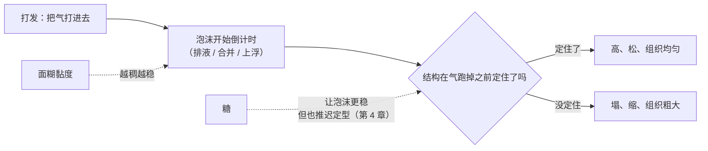
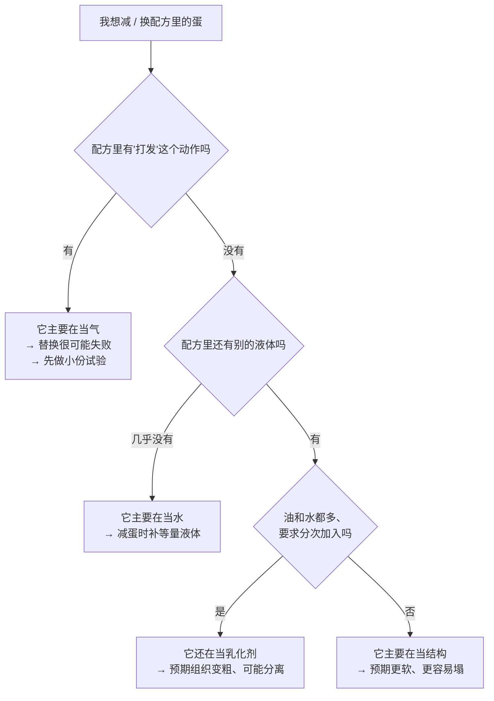

# 第 6 章 蛋：一样东西同时是水分、乳化剂、结构和气泡

> **本章目标**：让你在看到"鸡蛋 2 个"这四个字时，不再把它当成一样原料，
> 而是当成**同时进场的四个角色**。
>
> 学完这一章，你会知道：为什么"减一个蛋"从来不是只减一个蛋；
> 为什么市面上有上百种"蛋替代品"，却没有一种能把蛋的活全接下来。

## 6.1 蛋是七个角色里最难替换的那一个

前五章的原料，每个基本只干一两件事：面粉给结构材料、水让材料能用、
糖推迟定型、油脂阻断结构。**蛋不一样——它一个人干四件事**。

这不是本书的说法，而是这个领域在**试图替换它**时发现的：

| 证据 | 它说明了什么 |
|------|------------|
| 一篇 2026 年关于蛋与植物基替代物在蛋糕体系中作用的综述指出：蛋提供**起泡、乳化、凝胶**等关键功能，由此形成结构；而传统的替换做法靠"试错 + 对口感"，**因为蛋的多种工艺功能与它和其他原料的相互作用尚未被讲清楚，所以常常失败** | **连专业研究者都承认：蛋的功能没有被完整拆解过** |
| 一项 2024 年的研究统计到全球已推出约 **102 种**蛋替代产品，其中约 20 种宣称适用于烘焙；研究者挑了 10 种本地能买到的做磅蛋糕，结果**全部与用全蛋（蛋粉 / 鲜蛋 / 全蛋液）的对照组有显著差异** | **"能替代"和"结果一样"是两回事** |
| 一项 2026 年的研究系统比较了 **14 种**植物蛋白原料在磅蛋糕里替代蛋的表现，结论写得很直白：**没有任何一种植物蛋白原料能完整匹配蛋的多功能性** | 同上，而且是在同一个配方体系里做的对照 |

> **所以本章的写法和前五章不同**：
> 不问"蛋是什么"，而是问 **"这份配方里的蛋，主要在干哪一件事？"**
> 答对了这一句，替换、增减、拆分才有依据。

## 6.2 先把蛋拆成两半：蛋清与蛋黄分工完全不同

**这是本章最有用的一次拆解**。很多配方之所以专门写"蛋黄 2 个 + 蛋清 3 个"，
就是因为它要的不是"蛋"，是其中**某一半**。

| | 蛋清（蛋白） | 蛋黄 |
|---|------------|------|
| 主要成分 | 水 + 蛋白质 | 水 + **脂质** + 蛋白质 |
| 脂质 | 一项蛋糕研究写明：**蛋清所含脂质可以忽略** | 同一研究：**蛋黄干物质里约三分之二是脂质** |
| 它擅长什么 | **起泡**、受热**成胶** | **稳定气—液界面**（乳化 / 保气）、带来颜色与风味 |
| 在配方里典型出现在 | 蛋白霜、戚风、天使蛋糕 | 卡仕达、乳化法蛋糕、需要"润"的配方 |

### 蛋黄的脂到底长什么样——为什么它能乳化

那篇研究进一步给出了组成：蛋黄脂质中约 **66% 是三酰甘油、28% 是磷脂、5% 是胆固醇**；
而且**大部分蛋黄脂质并不是散着的，它们装在球状的低密度脂蛋白（LDL）里**[^1]——
这类结构表面有磷脂与蛋白，**本身就有表面活性**，能铺展到界面上去。

这项研究干了一件很干净的事：用乙醇处理把蛋黄里的 LDL **拆散**，
再拿去做海绵蛋糕，看哪一步受影响。

| 处理 | 结果 |
|------|------|
| 用完整蛋黄 | 面糊能打进足够的空气、气室在搅拌后也稳定 |
| **LDL 被拆散** | **充气与气室稳定性受影响**；要做出高质量海绵蛋糕，**最好保留完整的 LDL** |
| 无论哪一组 | **蛋糕"什么时候定型"以及定型的程度，基本不受影响** |

> **这条结论要记住，因为它反直觉**：
> **蛋黄的脂主要不是在管"定型"，而是在管"气"。**
>
> 换句话说，蛋黄在这里干的活，和第 5 章那个"油脂把空气带进去"的角色是同一类，
> 只不过它靠的是**表面活性**，不是晶体网络。

同一篇研究还顺手给了一句本书第三部分要用的话：
**面糊之所以能变成固体蛋糕，靠的是两件事——淀粉糊化与蛋白质聚合。**

### 蛋黄自己也不是均一的

一项用**松糕（muffin）**做的研究把蛋黄拆成**浆质（plasma）与颗粒（granules）**两部分，
然后逐步用高蛋白的颗粒部分去替换整只蛋黄，发现面糊的**稠度系数呈非线性上升**，
并且面糊的充气与成品硬度都随之改变。

> **可迁移的判断**：**"加一个蛋黄"这个动作，改的不只是脂肪量。**
> 你同时改了界面上的东西——而界面决定了气。

## 6.3 蛋首先是水：它在跟第 3 章抢同一批水

一个常被忽略的事实：**蛋主要是水**。

一篇 2023 年的蛋糕研究在原料一节写明，它用的**巴氏杀菌全蛋液的规格是
含水 77.5%、蛋白质 12.1%、脂肪 10.2%**（湿基）。

> ⚠️ **这是那一项研究所用产品的规格，不是"鸡蛋的含水量"**。
> 本书**没有核到**可直接引用的官方数值（这一条登记在[出处登记](../../standards.md)的「已知缺口」里）。
> **给你的做法是**：看你手上那盒蛋液 / 那盒蛋的标签，
> 或者**打一个蛋称一下重量**，把它当成你自己的配方参数。

但"大致七成以上是水"这个量级已经足够推出一件重要的事：

> **所以"我少放一个蛋"这句话，等价于"我同时改了四项"。**
> 如果你只想减蛋的**结构**作用而不想让面糊变干，
> **就得把水补回来**——这是第 3 章和第 5 章都讲过的同一个动作。

## 6.4 凝固：结构是在烤箱里补上的，而且没有单一的凝固温度

蛋提供结构的方式，和面粉完全不同：
**面筋是在案板上和（部分）在炉子里形成的，蛋的结构是纯粹在炉子里"凝"出来的。**

一项关于磅蛋糕的研究点明了机制：
**蛋清里最主要的蛋白质卵白蛋白（ovalbumin）通过提供巯基（—SH），
在烘烤中形成牢固的凝胶**，从而参与蛋糕结构。

> 这和第 5 章脚注里提过的面筋**受热交联**是同一类化学——
> 巯基与二硫键之间的交换。**"定住"这件事是化学反应，不是"变干"。**

### 关键一点：凝固温度会被整份配方推着走

烘焙圈很爱说"蛋液在多少 °C 凝固"。**这个问法本身有问题**，因为凝固温度取决于体系：

| 体系里加了什么 | 观察到的效果 | 来源类型 |
|--------------|------------|---------|
| **降低 pH（加酸）** | 蛋黄的热凝胶**加快**；该研究在 58~72 °C 区间做的观测，发现酸化主要提高了"有效碰撞的频率"，而没有改变反应的能垒 | 同行评议（X 射线光子关联谱） |
| **加盐（NaCl）** | 蛋黄的凝胶**被推迟**；该研究在 66~90 °C 区间观测 | 同行评议（同一技术，另一篇） |
| **加糖** | 一项研究给液态蛋黄加 4% 复合糖（或复合糖 + 盐），**把变性温度提高到 77 °C 以上**；另一项 DSC 研究显示蔗糖能提高蛋白质的变性温度，**低水分条件下尤其明显** | 同行评议（两项独立） |

> ⚠️ **诚实说明**：本书**没有核到**"家用条件下全蛋 / 蛋清 / 蛋黄的凝固温度区间"
> 这种可以直接照抄的数据——上面四条只说明**方向**。
> 因此本书**不写"蛋在 x °C 凝固"这样的单点数字**，这一缺口登记在[出处登记](../../standards.md)里。
>
> **能给你的是两件可执行的东西**：**状态判据**（第 32 章会展开）和**官方的安全温度**（下面）。

### 食品安全：这里的数字必须来自官方

蛋是本书里少数几个**安全问题不能含糊**的原料之一。以下为**美国 FDA** 的公开指引：

| 主题 | 美国 FDA 怎么说 |
|------|---------------|
| 基本做法 | 蛋要**冷藏保存**、**煮到蛋黄凝固**、**含蛋的食物要彻底做熟** |
| 含蛋的焙盘菜与菜品 | 应加热到 **160 °F**（约 71 °C），并**用食品温度计确认**；已做熟的蛋类菜品再加热到 **165 °F**（约 74 °C） |
| 要生吃或半生吃蛋的配方 | 使用**经巴氏杀菌等认可方法处理过的带壳蛋，或巴氏杀菌蛋制品** |
| 冷藏 | 冰箱保持在 **40 °F**（约 4 °C）以下；细菌在 40~140 °F 之间增殖很快 |
| 保存时间 | 带壳蛋连原包装**三周内**用完（就品质而言）；煮熟的蛋**一周内**；煮好的蛋类菜品剩下的 **3~4 天**内 |
| 室温放置 | 做好的蛋类食物室温放置**不超过 2 小时**；气温高于 90 °F（约 32 °C）时**不超过 1 小时** |
| 风险本身 | 即使外观干净、没有裂纹的新鲜蛋也可能带沙门氏菌 |

> ⚠️ **各国口径不同、且会修订，以你所在地现行发布为准。**
> 本书**不做医疗建议**，只转述官方指引的工艺含义：
> **凡是"蛋不完全熟"的做法（慕斯、提拉米苏、部分奶油霜），
> 都应该按官方建议改用巴氏杀菌蛋制品，或改用要加热的做法。**

## 6.5 泡沫有寿命：打发的蛋清是一个在倒计时的结构

蛋清能把大量空气"关"进去，这是**物理膨发**的主力之一（第 14 章展开）。
本章只装两条会影响你读配方的结论。

### 第一条：糖让泡沫更难打起来，但打起来之后更稳

一项关于蔗糖与氯化钠对蛋清起泡性影响的研究观察到：
**蔗糖让泡沫更难形成，但形成之后更稳定**；
提高 NaCl 含量与延长搅打时间都能促进蛋白质吸附到气—液界面上。

> **这就是为什么很多配方要求"糖分次加入"**：
> 先让蛋白质有机会抢占界面（易起泡），再靠糖把已经形成的泡沫稳住（更耐放）。
> **这是一个时间顺序问题，不是"加多少"的问题。**

### 第二条：气室能不能活到定型，取决于面糊本身

那篇海绵蛋糕研究里给出了一条很实用的机制：
**面糊黏度越高，排液、气室合并与气泡上浮就越少，气室也就越稳定。**

> **注意这里有个张力**：糖**同时**让泡沫更稳（好事）和让定型更晚（坏事）。
> 第 4 章讲的"糖是定型时刻的总开关"，在这里第二次出现。
> **一份配方的糖量，是在这两件事之间做的一次取舍。**

## 6.6 常见说法辨析

按本书约定标注**证据强度**：✅ 有共识 / ⚠️ 有争议 / ❌ 明确错误 / 缺乏证据。
来源见[出处登记](../../standards.md)。

| 说法 | 判定 | 说明 |
|------|------|------|
| "**减一个蛋只是少了点蛋白质**" | ❌ **明确错误** | 你同时减掉了**水、气、乳化、结构**四项。蛋主要是水（一项研究所用全蛋液的规格是含水 77.5%），所以减蛋首先让面糊变干变稠；其次少了蛋清的起泡与成胶，也少了蛋黄 LDL 带来的界面稳定能力 |
| "**蛋黄只是为了颜色和风味**" | ❌ **明确错误** | 一项海绵蛋糕研究把蛋黄的低密度脂蛋白拆散后发现：受影响的是**充气与气室稳定性**，而不是定型。蛋黄干物质里约三分之二是脂质，且大部分装在有表面活性的 LDL 里——**它是这份配方里管"气"的角色之一** |
| "**蛋能用香蕉 / 亚麻籽 / 商品蛋替代品等量替换**" | ⚠️ **取决于你要它干哪一件事** | 一项研究统计到全球约 102 种蛋替代产品，挑出的 10 种在磅蛋糕里**全部与全蛋对照有显著差异**；另一项比较 14 种植物蛋白原料的研究直接写道**没有一种能完整匹配蛋的多功能性**。**所以能不能换，取决于这份配方要的是水、是气、是乳化还是结构**——只要它主要在提供水与一点结构（很多马芬），替换的代价就小得多 |
| "**蛋液在 x °C 凝固**" | ⚠️ **这个问法本身不成立** | 凝固温度随 pH、盐、糖、稀释度漂移：加酸让蛋黄凝得更快，加盐让它凝得更晚，加糖把变性温度推高（一项研究把液态蛋黄的变性温度提到 77 °C 以上）。⚠️ 本书**没有核到**家用条件下的凝固温度区间数据，**因此不给单点数字**，改用状态判据与官方安全温度 |
| "**一滴蛋黄掉进蛋清就打不发了**" | ⚠️ **缺乏可引用的一手实验（本书未核到）** | 机制上"脂类会与蛋白质争夺气—液界面"是合理推测，而且和蛋黄 LDL 有表面活性这条事实相容；但本书**没有核到**定量实验来支持"一滴就不行"这个强度。**处理方式**：把它当**低成本的谨慎**（分蛋时小心，代价很低），而不是当定律——真打不发时不要只盯着这一条，还要看糖的加入时机、容器与搅拌方式 |
| "**鸡蛋必须回到室温再用**" | ⚠️ **缺乏一手出处（本书未核到）** | 本书没有核到关于"蛋温对成品影响"的可引用实验。**注意官方安全指引的方向恰好相反**：美国 FDA 要求蛋冷藏（40 °F 以下），并限制室温放置时间。**本书的建议**：如果要做，缩短室温放置时间并记录，而不是把蛋长时间放在台面上 |
| "**蛋放得越多，蛋糕越结实越好**" | ⚠️ **"更结实"往往是真的，"更好"不一定** | 蛋既补结构又补水：加蛋会让面糊更稀、结构蛋白更多。多到一定程度后成品会偏"韧"、偏"蛋腥"，而且**烘烤时间与定型时刻都会变**。本书**不给蛋的百分比区间**（没有核到一手出处），只给方向 |
| "**全蛋、蛋清、蛋黄按克数换算就能互换**" | ❌ **明确错误** | 三者的成分结构不同：蛋清几乎不含脂、擅长起泡与成胶；蛋黄约三分之二干物质是脂、擅长稳定界面。**克数相同不代表功能相同**——这和第 5 章"脂肪含量一样不代表脂肪一样"是同一个错误 |
| "**慕斯、提拉米苏用生蛋没问题，一直都这么做**" | ⚠️ **官方指引不这么建议** | 美国 FDA 明确写道：外观干净、没有裂纹的新鲜蛋也可能带沙门氏菌；**要生吃或半生吃蛋的配方，应使用经巴氏杀菌等认可方法处理过的蛋或蛋制品**。⚠️ 各国口径不同，以当地现行发布为准。**本书不做医疗建议，只转述官方工艺建议** |

## 6.7 一条可迁移的判断规则

> ## 动蛋之前先问一句：**这份配方里的蛋，主要在当水、当气、当乳化剂，还是当结构？**
>
> 四个答案对应四条完全不同的改法：

| 它主要在当 | 怎么认出来 | 减 / 换它的时候要补什么 |
|-----------|-----------|----------------------|
| **水** | 配方里液体很少，蛋是主要的液体来源（很多饼干、部分磅蛋糕） | **补等量的液体**，成品差别最小 |
| **气** | 配方里有"打发到发白 / 打到硬性发泡"，膨松剂很少甚至没有（戚风、海绵、天使蛋糕） | **最难补**——这是替换失败率最高的一类 |
| **乳化** | 配方油水都多、要求"分次加入避免分离"（乳化法蛋糕、卡仕达） | 要找别的表面活性来源，且**质地会变** |
| **结构** | 高糖高油、面筋被压制，靠蛋撑（很多蛋糕） | 要靠别的蛋白或胶体顶上，**通常会更硬或更弹** |

## 6.8 🔎 下次烤之前的用处

1. **看到"鸡蛋 2 个"，先把它翻译成克**。蛋的大小差别很大，
   "2 个"不是一个量；**称一下**，写进[配方解码表](../../forms/recipe-decode.md)。
2. **减蛋时先补水**。蛋大部分是水（一项研究所用全蛋液规格为含水 77.5%），
   少一个蛋首先是少了水，其次才是少了结构。
3. **分蛋配方要先问"它要的是哪一半"**：要气就靠蛋清，要润与稳定就靠蛋黄。
4. **糖分次加**：糖让蛋清更难打起来但更稳定，所以顺序比总量更要紧。
5. **打发之后就开始倒计时**——备料、过筛、预热全部提前做完，
   打发好了就直接进下一步。**"泡沫在等你"这件事，是烘焙里少数几个真正的时间压力。**
6. **不要去记"蛋几度凝固"**：这个数会被配方里的糖、盐、酸和稀释度推着走。
   要记的是**官方安全温度**（美国 FDA：含蛋菜品 160 °F 约 71 °C）和**状态判据**。
7. **要做免烤 / 半熟蛋的甜点，先看官方建议**：
   美国 FDA 建议这类配方使用巴氏杀菌蛋或蛋制品。⚠️ 各国口径不同。

## 6.9 思考题

1. 为什么说蛋是七个角色里最难替换的一个？
   请用"功能"而不是"营养"来回答，并举出至少两项研究作为依据。
2. 蛋清与蛋黄在成分上的最大差别是什么？由这个差别能推出它们各自擅长什么？
3. 一项研究把蛋黄里的低密度脂蛋白拆散后去做海绵蛋糕，
   发现受影响的是充气与气室稳定性，而**不是**定型时刻。
   这条结论为什么重要？它推翻了哪一条常见说法？
4. **【案例】** 一份磅蛋糕配方：面粉 100%、糖 100%、黄油 100%、全蛋 100%、
   泡打粉 1%（**以面粉总量为 100%**）。
   甲想把全蛋减到 50%，其余都不动。
   （a）预测面糊在**搅拌时**和成品在**出炉后**分别会出现什么变化，说明机制；
   （b）如果他希望"少放蛋但成品尽量接近原样"，**至少要连带改哪两项**？
   （c）这份配方里的蛋，主要在扮演四个角色中的哪几个？怎么从配方本身看出来？
5. **【案例】** 有人做戚风，"打发时看着很成功，倒进模具也很饱满，
   烤到一半明显长高，出炉后却缩成一半"。
   他的记录是：蛋清打发后先去称糖和过筛面粉，隔了十几分钟才拌；
   配方糖量比原方多了三成；炉温按配方设的，没测过。
   （a）按"产气—保气—定型"三段分别列出可能原因；
   （b）给一个一次只改一个变量的排查顺序，并说明为什么"多打发一会儿"**不一定**是正解。
6. **【辨析】** "一滴蛋黄掉进蛋清就打不发了"——
   判断它的证据强度，说明本书为什么既不肯定也不否定它，
   并设计一个你在家就能做的验证方法。
7. **【辨析】** "蛋液在 x °C 凝固"——
   说明这个问法为什么不成立，列出至少三个会推动凝固温度的因素，
   并说明读者应该改用什么来判断"熟没熟"。
8. 本章在安全问题上完全引用官方指引，而在"蛋温""一滴蛋黄"这类问题上
   明说"本书没有核到一手实验"。请说明这两种处理方式背后是同一条纪律吗？
   如果是，这条纪律是什么？

> 📖 **参考答案**（想清楚再看）：[Q1](../../qa/06-egg-qa.md#q1) ·
> [Q2](../../qa/06-egg-qa.md#q2) · [Q3](../../qa/06-egg-qa.md#q3) ·
> [Q4](../../qa/06-egg-qa.md#q4) · [Q5](../../qa/06-egg-qa.md#q5) ·
> [Q6](../../qa/06-egg-qa.md#q6) · [Q7](../../qa/06-egg-qa.md#q7) ·
> [Q8](../../qa/06-egg-qa.md#q8)

## 6.10 本章实操

### 🅐 零成本版 · 任务一：称一次蛋，把"个"换成"克"

**需要**：厨房秤、几个蛋、两个碗。**不开火、不浪费**（称完照常做菜）。

| 记录项 | 蛋 1 | 蛋 2 | 蛋 3 | 平均 |
|--------|------|------|------|------|
| 带壳总重（g） | | | | |
| 去壳全蛋重（g） | | | | |
| **蛋清重（g）** | | | | |
| **蛋黄重（g）** | | | | |
| 蛋黄占全蛋的比例（%） | | | | |

然后回答：

| 问题 | 你的答案 |
|------|---------|
| 你这批蛋的"一个蛋"是多少克？和你常看的配方假设一致吗？ | |
| 如果一份配方写"鸡蛋 3 个"，换成你这批蛋是多少克？ | |
| 一份要"蛋黄 4 个"的配方，用你这批蛋要打几个？剩下的蛋清怎么办？ | |

> **这张表的价值**：从此你的配方里没有"个"这个单位了。
> **蛋的大小差异是家庭烘焙里最被低估的误差来源之一**（第 26 章会展开称量问题）。

### 🅐 零成本版 · 任务二：给三份配方的蛋做"角色诊断"

找三份品类不同的配方（例如一份饼干、一份戚风、一份马芬），逐份填表。

| | 配方 A | 配方 B | 配方 C |
|---|-------|-------|-------|
| 品类 | | | |
| 面粉（＝100%） | | | |
| **蛋的烘焙百分比** | % | % | % |
| 用的是全蛋 / 蛋清 / 蛋黄？ | | | |
| 配方里**还有别的液体**吗？（水、奶、油） | | | |
| 有没有"**打发**"这个动作？ | | | |
| 有没有"**分次加入以免分离**"这类提示？ | | | |
| **判断：这里的蛋主要在当水 / 气 / 乳化 / 结构？** | | | |
| **如果减半，你预测会发生什么？** | | | |

### 🅐 零成本版 · 任务三：读三份商品的配料表，找蛋的踪迹

| 观察 | 商品 A | 商品 B | 商品 C |
|------|-------|-------|-------|
| 品类 | | | |
| 配料表里出现的是"鸡蛋""蛋液""蛋粉""蛋清粉"还是没有蛋？ | | | |
| 排在第几位？ | | | |
| 如果**没有**蛋，配料表里有什么在顶它的位置？（乳化剂 / 植物蛋白 / 胶体） | | | |
| 成品是**靠打发起来**的，还是靠膨松剂？ | | | |

> **提示**：找一个"无蛋"版本和一个"有蛋"版本的同类产品对比，
> 收获最大——你会直接看到工业配方是**用几样东西**去顶一个蛋的。

### 🅑 开火版 · 任务四：同一份配方，只改蛋的用量（有烤箱时做）

**需要**：一份你做过的、含蛋的配方（马芬或磅蛋糕这类**不靠打发**的更好上手）、
厨房秤、同一种模具、计时器、尺子、纸笔。

**唯一变量**：蛋的克数。其余原料克数、搅拌时间与方式、每份重量、炉温、
时间**全部一致**，同时进炉。

| 组 | 蛋的处理 | 面糊稠度（稀 / 中 / 稠） | 出炉高度 | 组织（细 / 粗） | 湿润度 | 第二天软硬 |
|----|---------|----------------------|---------|--------------|--------|----------|
| ① 原配方蛋量 | | | mm | | | |
| ② 蛋减半，**什么都不补** | | | mm | | | |
| ③ 蛋减半，**用等重的水或牛奶补回液体** | | | mm | | | |

做完回答：

| 问题 | 你的答案 |
|------|---------|
| ② 和 ③ 的差别说明了蛋的哪一个功能是"水"提供的、哪一个不是？ | |
| ③ 和 ① 还剩下多少差别？这部分差别来自什么？ | |
| 哪一组最干？哪一组最容易散？ | |
| 如果你要做"减蛋版"，会选 ② 还是 ③，还会再改什么？ | |
| 这次实验的局限是什么？（至少两条） | |

### 🅑 开火版 · 任务五（加分）：全蛋 vs 等重的蛋清 / 蛋黄

这一组把"蛋是一个整体"这个假设直接拆掉。

| 组 | 蛋的形态（**总克数相同**） | 面糊 | 出炉高度 | 颜色 | 组织 | 口感 |
|----|------------------------|------|---------|------|------|------|
| ① 全蛋 | | | mm | | | |
| ② 全部用蛋清 | | | mm | | | |
| ③ 全部用蛋黄 | | | mm | | | |

> **预测再验证**：动手前先在纸上写下你对三组的预测（本章 §6.2 给了依据），
> 出炉后逐条对照。**猜错的地方才是你真正学到的地方。**
>
> ⚠️ **局限**：蛋清与蛋黄的含水量不同，所以这三组**并没有把水对齐**，
> 只能说明方向。要更干净的对照，需要先称重、再补水——那是第 9 章的活。
>
> ⚠️ **安全提醒**：**不要尝生面糊**（美国 FDA：生面粉不是即食食品；
> 生蛋可能带沙门氏菌）；含蛋的成品要按官方建议做熟
> （美国 FDA：含蛋菜品 160 °F，约 71 °C，用温度计确认）；
> 蛋要冷藏，并与即食食物分开存放。⚠️ 各国口径不同，以当地现行发布为准。

## 6.11 本章依据

本章引用的来源与核对状态详见[参考书目与出处登记](../../standards.md)，具体对应如下：

| 本章用到的内容 | 依据 |
|--------------|------|
| 蛋在蛋糕体系里提供**起泡、乳化、凝胶**，由此形成结构；替换困难的原因是蛋的多种工艺功能与相互作用缺乏机理认识，且多数研究是在简化模型体系里做的 | *Critical Reviews in Food Science and Nutrition* 2026 蛋与植物基替代物在蛋糕体系中的功能综述，✅ 摘要层面 |
| 全球约 **102 种**蛋替代产品（约 20 种宣称适用于烘焙）；所选 10 种商品替代物在磅蛋糕里**全部与全蛋对照有显著差异**；**卵白蛋白通过提供巯基在烘烤中形成牢固凝胶** | *Foods* 2024 商品蛋替代物在磅蛋糕体系中的分析（开放获取），✅ |
| **14 种**植物蛋白原料在磅蛋糕中替代蛋：**没有一种能完整匹配蛋的多功能性** | *Current Research in Food Science* 2026 豆类与燕麦蛋白作为磅蛋糕蛋替代物的比较研究（开放获取），✅ |
| **蛋清脂质可忽略**；**蛋黄干物质约三分之二是脂质**，其中约 66% 三酰甘油、28% 磷脂、5% 胆固醇；多数蛋黄脂质位于**有表面活性的低密度脂蛋白（LDL）**中；拆散 LDL 影响**充气与气室稳定性**，但**不影响蛋糕结构定型的时刻与程度**；面糊变成蛋糕靠**淀粉糊化与蛋白质聚合**两件事；**面糊黏度越高，排液、气室合并与气泡上浮越少** | *Foods* 2021 海绵蛋糕中蛋黄低密度脂蛋白作用的研究（开放获取），✅ |
| 用蛋黄**颗粒部分**逐步替代整只蛋黄做松糕：稠度系数**非线性上升**，充气与成品硬度随之改变 | *Food Hydrocolloids* 2016 蛋黄组分比例与焙烤产品流变、质构的研究，✅ 摘要层面 |
| **巴氏杀菌全蛋液的规格：含水 77.5%、蛋白质 12.1%、脂肪 10.2%（湿基）** | *Foods* 2023 泡打粉与膨松酸对磅蛋糕影响的研究，原料一节（开放获取），✅。⚠️ **这是该研究所用产品的规格，不是通用值**；本书据此只说"量级"，并提示读者称自己的蛋 |
| **加酸使蛋黄热凝胶加快**（58~72 °C 区间观测，活化能不变） | *The Journal of Chemical Physics* 2026 蛋黄热凝胶的酸致加速研究，✅ 摘要层面 |
| **加 NaCl 使蛋黄凝胶被推迟**（66~90 °C 区间观测） | *The Journal of Chemical Physics* 2024 盐致蛋黄热凝胶减速研究，✅ 摘要层面 |
| 加 4% 复合糖（或复合糖 + 盐）把液态蛋黄的**变性温度提高到 77 °C 以上**；蔗糖提高蛋白质变性温度，低水分下尤其明显 | *Journal of Food Science* 2023 复合糖与盐对液态蛋黄热稳定性的研究 + *Journal of Physical Chemistry B* 2024 蔗糖 / 海藻糖稳定蛋白质的 DSC 研究，✅（两个独立来源） |
| **蔗糖让蛋清泡沫更难形成但更稳定**；提高 NaCl 与延长搅打促进界面吸附 | *Food Research International* 2007 蔗糖与氯化钠对蛋清起泡性影响的研究，✅ 摘要层面 |
| 蛋的安全处理：冷藏、煮到蛋黄凝固、含蛋菜品 **160 °F**（约 71 °C）、再加热 **165 °F**（约 74 °C）、冰箱 **40 °F** 以下、生食配方用**巴氏杀菌蛋**、带壳蛋三周 / 熟蛋一周 / 熟蛋类菜品 3~4 天、室温 2 小时（高温时 1 小时）、洁净未破损的蛋也可能带沙门氏菌 | 美国 FDA「What You Need to Know About Egg Safety」+「Safe Food Handling」，✅ 已核到官方页面。⚠️ **各国口径不同，以当地现行发布为准** |
| 生面粉与生面糊的安全 | 美国 FDA「Handling Flour Safely: What You Need to Know」，✅ 已核到官方页面 |
| **鸡蛋含水量的官方数值** | ⚠️ **未核到**；本章只引用一项研究所用产品的规格并明确标注，**不写通用数字** |
| **家用条件下全蛋 / 蛋清 / 蛋黄的凝固温度区间** | ⚠️ **未核到**可引用数据；本章**不给单点数字**，只给方向（pH、盐、糖、稀释度都会推动它）与官方安全温度 |
| **"一滴蛋黄让蛋清打不发"的定量实验**、**蛋温对成品影响的实验** | ⚠️ **未核到**；按"缺乏证据"处理，写进辨析栏 |

[^1]: [低密度脂蛋白](../../glossary.md#ldl)（low-density lipoprotein, LDL）、
[卵白蛋白](../../glossary.md#ovalbumin)（ovalbumin）与
[蛋黄浆质与颗粒](../../glossary.md#yolk-plasma-granules)（yolk plasma / granules）。
本章还用到[乳化](../../glossary.md#emulsification)、
[充气 / 打发](../../glossary.md#aeration)、
[泡沫稳定性](../../glossary.md#foam-stability)、
[蛋白质变性与凝固](../../glossary.md#denaturation)。

---

**下一章**：第 7 章 盐——它在烘焙里主要是个**调速器**。
本章的蛋在"补结构"，下一章的盐**一克都不补结构**，
却能改变面筋怎么形成、酵母跑多快、以及最后有多少气被留住。
