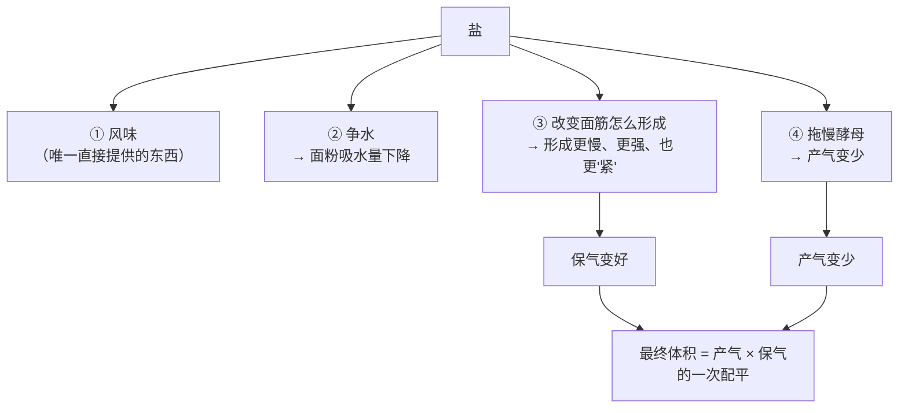
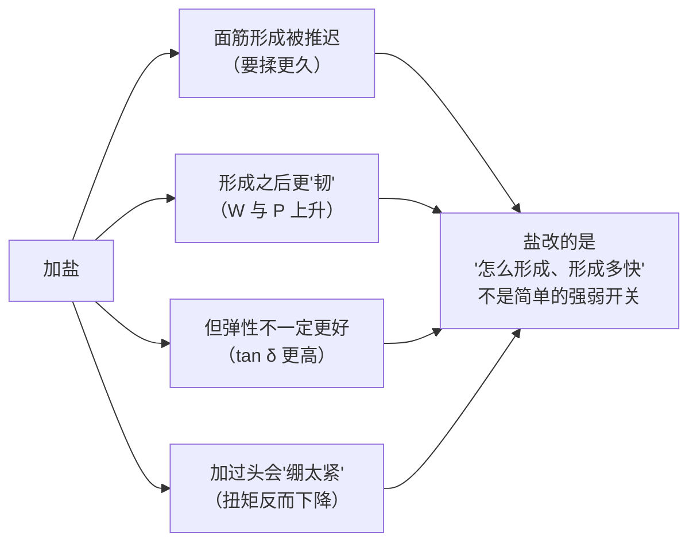
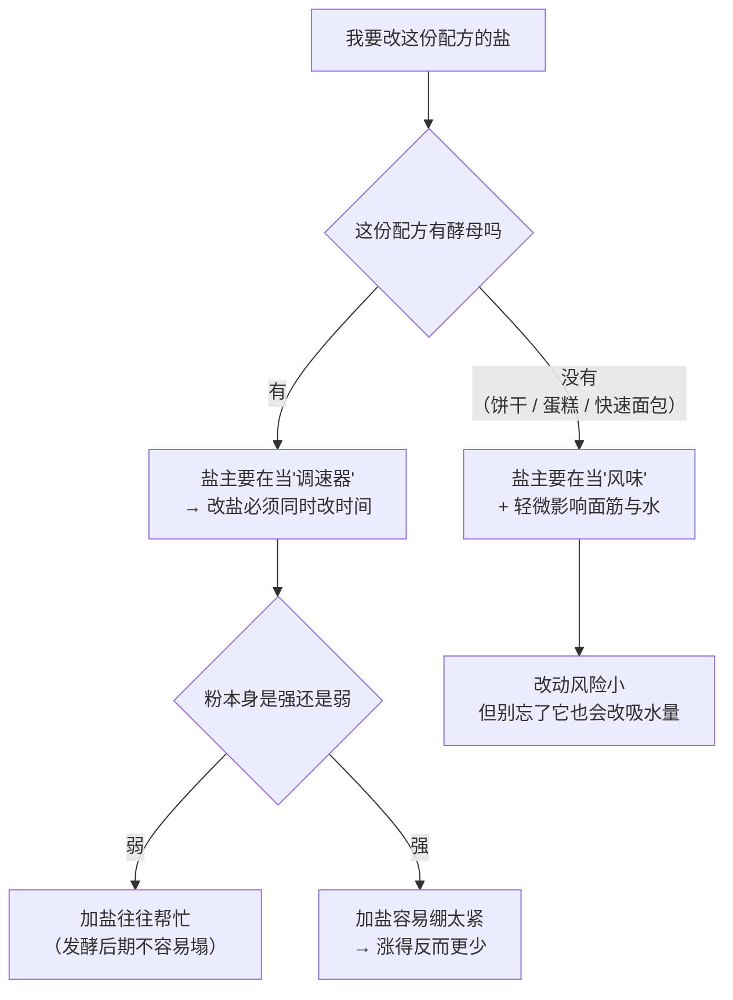

# 第 7 章 盐：风味、控速与对面筋的作用

> **本章目标**：让你不再把盐当成"调味的那一小撮"。
> 在烘焙里，**盐是一个调速器**——它不提供结构、不提供气、不提供水，
> 却同时改变了**面筋怎么形成、酵母跑多快、以及最后有多少气被留住**。
>
> 学完这一章，你会明白一件很违反直觉的事：
> **加盐会让面团产气更少，却让面团保气更好。**

## 7.1 盐在配方里的位置：用量最小，影响面最广

先把它放进第 1 章的角色表：

| 角色 | 它提供什么 | 它改变什么 |
|------|-----------|-----------|
| 面粉 | 结构材料 | — |
| 水 | 让材料能用 | 所有人 |
| 糖 | 甜 + 水的竞争者 | 定型时刻 |
| 油脂 | 风味 + 气 | 结构的连续性 |
| 蛋 | 水 + 气 + 乳化 + 结构 | 多处 |
| **盐** | **只有风味** | **面筋形成的过程、酵母的速度、水的分配** |

> **盐是唯一一个"只拿不给"的角色**：它不贡献任何结构材料，
> 却在三组竞争里都有发言权。所以**它的用量小，不代表它的影响小**。

## 7.2 盐在争水：加盐会让面粉"吸水量"下降

这是本章第一个有两组独立数据支持的结论。

| 研究 | 做法 | 结果 |
|------|------|------|
| 一项 2020 年的研究，41 个软质小麦品种、**176 份面粉样本** | 比较**不加盐**与**加 1.5% 盐**（该文以面团含盐量表述，为意大利面包的平均水平）下的粉质仪与吹泡示功仪指标 | **95% 的样本**在加盐后粉质仪吸水量**下降了几个百分点**；**78%** 的样本面团形成时间**变长**；**70%** 的样本面团稳定度**上升**；**72%** 的样本弱化度**下降** |
| 一项 2026 年的研究，三种粉（白粉 / 高纤白粉 / 全麦粉）× 四个盐水平（0 / 0.3 / 0.6 / 1.2%，该文写作 w/w） | 用粉质仪把每一组都调到**同一稠度**（500 FU）再比较 | 在所有粉类里，**盐加得越多，吸水量越低、面团形成时间越长** |

> **机制（该 2020 年研究引述的解释）**：钠离子与氯离子会**占据蛋白质表面**
> 原本被结合水占着的位置，于是**蛋白质的水合能力下降**，面粉表现出来的吸水量就低了。
>
> ⚠️ 这是该文引用的解释，**不是本书自己的推理**；
> 同一篇也提到相关机制涉及离子键、疏水作用与氢键，**仍在讨论中**。

**这件事对你意味着什么**：

> **同一份配方，加盐和不加盐所需要的水并不一样。**
> 所以"我照着配方做，面团却偏干 / 偏稀"的原因清单里，
> **盐量**是很少有人想到、但确实存在的一条。

## 7.3 盐对面筋：不是简单的"更强"

这是本章最容易被讲错的一节。烘焙圈普遍说"盐让面筋更强"——
**这句话有证据，但也有反证，两边都要看。**

### 支持"更强"的证据

那项 176 份样本的研究用吹泡示功仪测了面团强度：

| 指标 | 加盐后的变化 | 比例 |
|------|------------|------|
| **W（面团力度）** | 上升 | **176 份里有 171 份，占 97%** |
| **P（韧性）** | 上升 | **165 份，占 94%** |
| **L（延展性）** | 约三分之二上升、三分之一下降 | 无统一方向 |
| **P/L**（韧性与延展性之比） | **没有确定方向**（47% 上升、51% 下降） | — |

> 注意最后两行：**"更强"主要体现在韧性上，延展性的方向并不统一。**
> 而 P/L 这个"平衡指标"**没有一致的变化方向**——
> 说明盐改变的不是一个开关，而是**两个方向不同的分量**。

### 说明"不止是更强"的证据

| 研究 | 发现 |
|------|------|
| 一项 2013 年的研究（**以面粉重量为基准**加 0 / 1% / 2% NaCl，两种蛋白质含量的商品粉） | 共聚焦显微镜显示**加盐会推迟面筋网络的形成**，并在搅拌终点形成**拉长的纤维状**蛋白结构 |
| 一项 2014 年的研究（加 2%，面粉基准） | 面筋确实形成纤维结构、非共价作用与 β-折叠增加；**但振荡流变显示 tan δ 更高，也就是网络的弹性更低** |
| 一项 2026 年的研究（GlutoPeak 测面筋聚集） | 在白粉里，加到 **0.3~0.6%** 时聚集更快、扭矩更高（网络更强）；但加到 **1.2%** 时形成时间反而变长、扭矩下降，研究者形容为**"结构被绷得过紧"**。在高纤配方里，1.2% 那一组的扭矩显著低于 0.3% 与 0.6% 两组 |

> **可迁移的判断**：
> **"盐让面筋更强"要改写成"盐让面筋形成得更慢、更韧，而且有一个上限"。**
> 这解释了两件配方上的事：
>
> 1. 为什么**减盐的面团揉起来更快到位**（也更容易揉过头）；
> 2. 为什么**加盐加过头的面团会发僵、擀不动、回缩**。

## 7.4 盐是调速器：产气变少，保气变好

这是本章最重要、也最反直觉的一节。

那项 176 份样本的研究挑了两个品种（一个弱、一个强），
在 **0% / 1.5% / 3.0%** 三个盐水平下用发酵流变仪跑了 3 小时发酵：

| 品种 | 盐水平 | 总产气量（mL） | 跑掉的 CO₂（mL） | **保气系数** |
|------|--------|--------------|----------------|------------|
| 弱筋品种 | 0% | 1518 | 275 | 81.9% |
| 弱筋品种 | 1.5% | 1487 | 218 | 85.4% |
| 弱筋品种 | 3.0% | **1272** | **130** | **89.8%** |
| 强筋品种 | 0% | 1584 | 306 | 80.7% |
| 强筋品种 | 1.5% | 1519 | 270 | 82.2% |
| 强筋品种 | 3.0% | **1242** | **144** | **88.5%** |

> **一张表说清了两件事**：
>
> - **产气**：盐越多，酵母产的气越少（3.0% 那一档掉得很明显）；
> - **保气**：盐越多，跑掉的气越少、保气系数越高。
>
> **所以"加盐"不是"发得差"，而是"发得慢但漏得也少"。**

另一项 2026 年的研究得到方向一致的结果：在白粉体系里，
0.3% 与 0.6% 两档的发酵参数与不加盐那组没有显著差别，
而 **1.2% 那一组的面团最大高度、总产气量与保留气量都下降**。

### 为什么盐会拖慢酵母

机制上是**渗透胁迫**[^1]：高浓度的溶质把水从酵母细胞里"拉"出去。
第 4 章讲糖的时候已经出现过同一个机制——
一项酵母全基因组筛选发现，对高浓度蔗糖敏感的突变体
**绝大多数同时对高浓度氯化钠或山梨醇敏感**，
说明这类胁迫**主要是渗透问题，而不是"糖"或"盐"本身有毒**。

还有一条独立旁证来自一项关于面包中丙烯酰胺的研究：
NaCl 的作用是**双向的**——**低于 2% 时抑制酶活、降低丙烯酰胺；
加得更多时反而升高，原因正是酵母生长被抑制。**

> **一句话总结机制**：
> **盐不杀酵母，盐是在"收租"——它让酵母干活变吃力，于是变慢。**

### 发酵曲线的形状也被改变了

同一项研究记录的 3 小时面团高度曲线更有意思：

| 组合 | 曲线形状 |
|------|---------|
| 弱筋品种 + 不加盐 | 先冲到最高，然后**明显回落**（塌了） |
| 弱筋品种 + 1.5% 盐 | **不再明显回落**，最高点出现得更晚 |
| 弱筋品种 + 3.0% 盐 | 曲线变成了"强筋品种不加盐"的样子：持续上升、中间有一个台阶 |
| 强筋品种 + 3.0% 盐 | **太紧了**，反而涨得比不加盐和 1.5% 时更少 |

> **这张表值得反复看**：
> **同一个盐量，加在弱粉上是"救命"，加在强粉上是"绷死"。**
> 这是全书"没有通用最优解，只有配平"这条主线的一个干净实例。

## 7.5 风味：盐尝得出来，但"盐让面包更香"要打个折

盐**确实**是配方里唯一直接提供咸味的东西，这一点没有争议。
但"盐能显著改变面包香气"这个更强的说法，有一项研究给出了**反向的证据**：

> 一项关于氯化钠对酵母面包香气谱影响的研究发现：
> 不同 NaCl 浓度下，面团中 2-苯乙醇等香气物质**确实有显著变化**；
> 但在感官三角测试里，**能被人区分出来的是酵母用量不同的样品，
> 而不是含盐量不同的样品**。

> **怎么理解这件事**：**仪器测出来的差别不等于人能尝出来的差别。**
> 这是食品研究里非常常见的一种错位，也是本书特别强调"感官判据"的原因。

### 顺带说一个背景：面包的盐是公共卫生议题

这不是本书要讨论的健康话题，但它解释了**为什么近年来的配方和文献都在减盐**：

| 官方口径 | 内容 |
|---------|------|
| WHO 于 2021 年发布的食品钠含量全球基准 | **发酵面包：每 100 g 含钠 330 mg**（相当于每 100 g 约 0.8 g 盐） |
| 欧盟关于营养声称的法规 | "低钠 / 低盐"：每 100 g 含钠不超过 0.12 g（约 0.3 g 盐）；"极低钠"：不超过 0.04 g 钠；"无钠"：不超过 0.005 g 钠；"减钠"：比同类参照产品低至少 25% |

⚠️ **以上数字转引自一项 2026 年研究对官方文件的复述**，
**各国口径不同、且会修订，以你所在地现行发布为准**。
**本书不做任何摄入量建议，也不做健康评价**——
列出它只是为了让你在看到"减盐配方"时知道它在回应什么。

**从工艺角度，减盐要付的代价本章已经列全了**：
面筋形成变快但更容易过头、吸水量变化、发酵变快但保气变差、咸味下降。

> 顺带一条有意思的工艺解法：一项研究发现，
> **把盐做成不均匀分布（用蜡质淀粉做成盐团粒随机加入）**，
> 可以在减盐 30% 的情况下**维持咸味感知**，而面团与成品的品质参数基本不变。
> ⚠️ **仅见于该研究**，本书只把它当作"咸味感知不只取决于总盐量"的证据。

## 7.6 忘了放盐 / 放多了，分别会怎样

这是一张可以直接拿来查的表。**注意：两种错误的表现不一样，改法也相反。**

| 现象 | 更像"忘了放盐" | 更像"盐放多了" |
|------|--------------|--------------|
| 面团在揉的时候 | **很快就到位**，甚至偏软、偏黏 | **迟迟不成团**，形成时间明显变长 |
| 发酵速度 | **明显偏快** | **明显偏慢** |
| 发酵曲线 | 冲得快，之后可能**回落**（弱粉尤其明显） | 起得慢，上限也可能更低 |
| 成品体积 | 不一定小——**产气多，但保气差** | 可能更小（产气被压得太狠） |
| 组织 | 偏粗、不均匀 | 偏紧实 |
| 味道 | **寡淡、发"空"** | 咸 |
| 下一次怎么改 | 补盐（**同时预期要多揉一会儿、发酵变慢**） | 减盐（**同时预期要少揉一点、发酵变快**） |

> ⚠️ **本书不给"应该放多少盐"的百分比区间**——
> 这一缺口登记在[出处登记](../../standards.md)里。
> 上面所有研究用的盐水平（0.3%~3.0%）是**实验设计**，不是推荐值，
> 而且各研究的基准写法并不统一。
> **你该做的是：记录你自己配方的盐量与表现**，用[烘焙记录与复盘表](../../forms/bake-log.md)攒出你的区间。

## 7.7 常见说法辨析

按本书约定标注**证据强度**：✅ 有共识 / ⚠️ 有争议 / ❌ 明确错误 / 缺乏证据。
来源见[出处登记](../../standards.md)。

| 说法 | 判定 | 说明 |
|------|------|------|
| "**盐会杀死酵母**" | ❌ **说法过头** | 机制是**渗透胁迫**：盐（和糖一样）把水从细胞里拉出去，让酵母**变慢**，不是"杀死"。一项酵母全基因组筛选显示，对高蔗糖敏感的突变体绝大多数同时对高 NaCl 或山梨醇敏感——**这是一类渗透问题**。工艺上的正确表述是"盐是调速器" |
| "**盐和酵母不能直接接触**" | ⚠️ **方向有机制，强度未核到** | "局部高浓度会造成渗透胁迫"与已知机制相容；但本书**没有核到**量化实验告诉我们接触多久、浓度多高才有可测量的影响。**处理方式**：分开放的成本几乎为零，照做无妨；但**发不起来时不要只怪这一条**——温度、酵母活性、糖量、时间都在嫌疑名单上 |
| "**盐让面筋更强**" | ⚠️ **一半对** | 支持的证据很强：176 份样本里 **97% 的 W 上升、94% 的 P 上升**。但同一批数据里 **L 的方向不统一、P/L 没有确定方向**；另有研究显示加盐后面筋 **tan δ 更高（弹性更低）**，还有研究观察到 1.2% 那一档**扭矩反而下降**（"绷得过紧"）。**准确的说法是：盐让面筋形成得更慢、更韧，而且有上限** |
| "**不放盐面包发得更快**" | ✅ **有共识，但只说了一半** | 实测：不加盐时总产气量最高（两个品种分别 1518 与 1584 mL），加到 3.0% 降到 1272 与 1242 mL。**但保气系数正好相反**：从约 81% 升到约 89%。所以"发得快"是真的，"发得好"不一定——**产气与保气是两件事** |
| "**盐可以随便减，反正只是味道**" | ⚠️ **技术上要重新配平** | 减盐同时改了四项：吸水量（上升）、面筋形成速度（变快，更容易揉过头）、发酵速度（变快）、保气（变差）。一项研究发现减盐后**弱筋粉的面团在发酵后期会明显回落**——那不是味道问题。**减盐是可以做的，但要连带调整揉面与发酵时间** |
| "**海盐 / 岩盐比精盐做出来更好**" | **缺乏证据** | 本书**没有核到**任何比较不同盐种对烘焙成品影响的可靠实验。已知的机制（渗透、离子屏蔽）看的是**钠与氯离子的量**，而不同盐种的**颗粒大小与密度不同**——这意味着"一小勺"的实际克数差别可能比盐种本身的差别更大。**本书的建议：用秤，而不是用勺** |
| "**盐要最后加 / 盐不能和酵母一起下**" | ⚠️ **工艺口语，未核到一手实验** | 后加盐（以及"水解法 / autolyse"）的理由通常是"让面筋先水合"——本章引的研究确实显示**加盐会推迟面筋网络的形成**，方向上相容；但本书**没有核到**比较"何时加盐"的对照实验。按**惯例**处理，可试可不试，**试的时候记录** |
| "**咸不咸只取决于放了多少盐**" | ⚠️ **不完全** | 一项研究把盐做成**不均匀分布**的团粒加入，在**减盐 30%** 的情况下咸味感知与对照相当，而面团与成品品质基本不变。⚠️ 仅见于该研究。它说明**分布方式也参与了咸味感知**——这也是为什么表面撒盐的成品尝起来更咸 |
| "**盐能让面包更香**" | ⚠️ **仪器上有差别，人不一定尝得出** | 一项研究发现不同 NaCl 浓度下 2-苯乙醇等香气物质有显著变化，**但感官三角测试能区分出来的是酵母用量不同的样品，不是含盐量不同的样品**。**盐带来的最确定的东西是咸味本身** |

## 7.8 一条可迁移的判断规则

> ## 盐不提供任何东西，它**改变每个人的速度**。所以改盐之前先问：**我愿意让哪一件事变慢或变快？**

| 你改了盐 | 立刻变化的四件事 | 你要连带准备的动作 |
|---------|----------------|------------------|
| **加盐** | 吸水量↓、面筋形成↓（更慢）、发酵速度↓、保气↑ | 面团可能偏干 → 微调水；**揉得更久**；**发酵时间拉长** |
| **减盐** | 吸水量↑、面筋形成↑（更快）、发酵速度↑、保气↓ | 面团可能偏稀；**小心揉过头**；**盯紧发酵，别发过** |

## 7.9 🔎 下次烤之前的用处

1. **盐要用秤称，不要用勺量**。不同盐种的颗粒大小差很多，
   "一小勺"的实际克数可能差出几成——这比任何盐种差异都大。
2. **改盐 = 改时间**。加盐就准备多揉一会儿、多发一会儿；减盐就准备少揉、盯紧发酵。
3. **面团"揉不到位"时，先看看盐量**。盐会推迟面筋网络的形成，
   **揉不动 ≠ 粉不好**。
4. **忘了放盐的面团发得特别快**——这不是"状态好"，而是**保气变差**的前兆。
   下次记得把盐先和面粉混匀（顺手也避开了"盐直接压着酵母"的争议）。
5. **弱粉配方不要轻易减盐**：一项研究里，弱筋粉不加盐时面团在发酵后期**明显回落**，
   加 1.5% 盐之后就不再回落了。
6. **想减盐又不想失去咸味，可以试试"不均匀分布"**（表面撒盐、盐不完全拌匀）——
   一项研究在减盐 30% 时用这个办法保住了咸味感知。⚠️ 仅见于该研究，自己试时记录。
7. **不要指望盐带来香气**。仪器上有差别，但感官测试里能被区分的是**酵母用量**，不是盐量。

## 7.10 思考题

1. 为什么本书说盐是"唯一一个只拿不给的角色"？
   它拿走了什么、又改变了什么？
2. "加盐会让面粉吸水量下降"这条结论有哪两组独立数据支持？
   它对"照着配方做但面团偏干"这个常见问题有什么提示？
3. 本章说"盐让面筋更强"这句话只对一半。
   请列出支持它的证据和反对它的证据各至少一条，并给出更准确的表述。
4. **【案例】** 两个人用同一份吐司配方（面粉 100%、水 65%、盐 2%、
   干酵母 1%、糖 6%、油 5%，**以面粉总量为 100%**）。
   甲照做；乙忘了放盐。两人环境、时间安排完全相同。
   （a）预测乙的面团在**揉面、发酵、烘烤、成品**四个阶段分别有什么不同；
   （b）如果乙的成品体积**并不比甲小**，这与本章哪组数据一致？该怎么解释？
   （c）乙下次补上盐之后，还要连带改什么？
5. **【案例】** 有人把一份法棍配方的盐从 2% 提到 3%（以面粉总量为 100%），
   想要"更有嚼劲"。结果面团擀不开、老是回缩，成品体积明显变小、组织紧实。
   （a）用本章的数据解释这三个现象；
   （b）他用的是一款很强的高筋粉，这一点为什么让问题更严重？
   （c）如果他真想要"更有嚼劲"，本章之外还有哪些变量可以动？（说方向即可）
6. **【辨析】** "海盐比精盐做出来的面包更好"——
   判断证据强度，说出本书为什么连"它没用"都不下结论，
   并设计一个能把"盐种"和"用量"分开的对照实验。
7. **【辨析】** "不放盐面包发得更快，所以赶时间可以不放盐"——
   用本章那张发酵流变仪的数据判断这句话对在哪、错在哪。
8. 本章出现了一个贯穿全书的模式："仪器测得出的差别 ≠ 人尝得出的差别"。
   请举出本章的例子，并说明这对你设计自家的对照实验有什么要求。

> 📖 **参考答案**（想清楚再看）：[Q1](../../qa/07-salt-qa.md#q1) ·
> [Q2](../../qa/07-salt-qa.md#q2) · [Q3](../../qa/07-salt-qa.md#q3) ·
> [Q4](../../qa/07-salt-qa.md#q4) · [Q5](../../qa/07-salt-qa.md#q5) ·
> [Q6](../../qa/07-salt-qa.md#q6) · [Q7](../../qa/07-salt-qa.md#q7) ·
> [Q8](../../qa/07-salt-qa.md#q8)

## 7.11 本章实操

### 🅐 零成本版 · 任务一：称一次你的盐，看看"一小勺"到底是多少

**需要**：厨房秤（能读到 0.1 g 更好）、你家所有的盐、一把量勺。**不开火。**

| 盐种 | 一平勺是多少 g | 一小勺（按你平时的手势）是多少 g | 和另一种盐差了多少 % |
|------|--------------|------------------------------|-------------------|
| 精制细盐 | | | — |
| 粗盐 / 海盐 | | | |
| 其他 | | | |

然后回答：

| 问题 | 你的答案 |
|------|---------|
| 同样是"一小勺"，最大差了多少？ | |
| 一份 500 g 粉的配方里，这个差别相当于几个百分点的盐？ | |
| 你以后会用勺还是用秤？ | |

> **这张表是本章最便宜、也最有用的一个任务**：
> 很多"海盐更好吃"的体验，可能只是**实际放的盐更多或更少**。

### 🅐 零成本版 · 任务二：给三份配方的盐做"角色诊断"

| | 配方 A | 配方 B | 配方 C |
|---|-------|-------|-------|
| 品类（面包 / 饼干 / 蛋糕…） | | | |
| 面粉（＝100%） | | | |
| **盐的烘焙百分比** | % | % | % |
| 配方里有酵母吗？ | | | |
| **盐在这里主要是调速器还是纯风味？** | | | |
| 如果盐减半，你预测哪几项会变？（揉面 / 发酵 / 保气 / 味道） | | | |
| 如果要减盐，你会连带改什么？ | | | |

### 🅐 零成本版 · 任务三：读商品包装上的钠含量，反推盐量

**需要**：三包不同的面包 / 饼干、计算器。

> **换算关系**（欧盟食品信息法规采用的常规换算，该研究复述）：
> **盐（g）= 钠（g）× 2.5**。⚠️ 各国标签口径不同，以当地现行发布为准。

| 商品 | 每 100 g 钠（mg） | 换算成盐（g/100 g） | 和 WHO 面包基准（每 100 g 钠 330 mg）比 |
|------|-----------------|-------------------|--------------------------------|
| A | | | |
| B | | | |
| C | | | |

> ⚠️ **这个任务只是"读懂标签"的练习**，本书**不做任何摄入量建议**。

### 🅑 开火版 · 任务四：同一份面团，只改盐（有烤箱时做）

**需要**：一份你做过的、**含酵母**的面团配方、厨房秤、两个同样的容器、
计时器、尺子、纸笔。（没有烤箱也能做完前三分之二——发酵部分不需要烤箱。）

**唯一变量**：盐。其余原料克数、水温、揉面时间、发酵温度与时间、
整形方式、炉温**全部一致**。

| 组 | 盐（**以面粉总量为 100%**） | 揉到"能拉开一片"用了多久 | 面团手感 | 一发到两倍用了多久 | 发酵后期有没有回落 | 成品体积 | 组织 | 味道 |
|----|--------------------------|----------------------|---------|------------------|------------------|---------|------|------|
| ① | 原配方 | 分钟 | | 分钟 | | | | |
| ② | **0%（完全不放）** | 分钟 | | 分钟 | | | | |
| ③（可选） | 原配方 **+1 个百分点** | 分钟 | | 分钟 | | | | |

做完回答：

| 问题 | 你的答案 |
|------|---------|
| 哪一组揉到位最快？和"盐推迟面筋形成"一致吗？ | |
| 哪一组发得最快？ | |
| 发得最快的那一组，成品**最大**吗？如果不是，说明了什么？ | |
| 有没有哪一组在发酵后期"塌"了？ | |
| 如果你要减盐，根据这次结果会连带改哪两项？ | |

> **这个实验的核心看点不是"谁大谁小"，而是"发得快"和"发得好"分不分家**——
> 本章那张发酵流变仪的表就是在说这件事。

### 🅑 开火版 · 任务五（加分）：咸味的"分布"实验

在上面 ① 组的基础上再做一组：**盐减到一半，但把减掉的那部分撒在成品表面**。

| 组 | 盐的处理 | 尝起来咸吗（1~5 分） | 你能分辨出它减盐了吗 |
|----|---------|------------------|-------------------|
| ① | 全部拌进面团（原配方） | | |
| ④ | 一半拌进面团 + 一半撒表面 | | |

> ⚠️ **局限**：没有蒙眼、没有重复、评分主观。要更可信就请别人做**三角测试**
> （给三份样品，其中两份相同，让他挑出不一样的那份）——
> 本章引的香气研究用的正是这个方法。
>
> ⚠️ **安全提醒**：**不要尝生面团**（美国 FDA：生面粉不是即食食品）。
> 各国口径可能不同，以自己所在地现行发布为准。

## 7.12 本章依据

本章引用的来源与核对状态详见[参考书目与出处登记](../../standards.md)，具体对应如下：

| 本章用到的内容 | 依据 |
|--------------|------|
| 176 份面粉样本、加 1.5% 盐 vs 不加盐：**吸水量在 95% 的样本中下降几个百分点**；形成时间上升（78%）、稳定度上升（70%）、弱化度下降（72%）；**吹泡示功仪 W 在 97% 的样本上升、P 在 94% 上升、L 方向不统一、P/L 无确定方向**；RVA 黏度随盐上升、峰值略延后；发酵流变仪三档盐（0 / 1.5 / 3.0%）的**总产气量、CO₂ 损失与保气系数**（1518 / 1487 / 1272 mL 与 81.9 / 85.4 / 89.8% 等）；**弱筋粉不加盐时发酵后期明显回落，加盐后不再回落；强筋粉加到 3.0% 反而涨得更少**；以及"钠与氯离子占据蛋白质表面、降低水合"的机制引述 | *Foods* 2020 氯化钠对软质小麦面团工艺品质的综合研究（开放获取），✅ 全文已核 |
| 四档盐（0 / 0.3 / 0.6 / 1.2% w/w）× 三种粉：**盐越多吸水量越低、形成时间越长**；GlutoPeak 显示 0.3~0.6% 聚集更快更强而 **1.2% 反而"绷得过紧"**；发酵流变仪显示 **1.2% 那组的最大高度、总产气与保留气量下降**；以及 WHO 面包钠基准（每 100 g 钠 330 mg）、欧盟营养声称门槛、盐（g）= 钠（g）× 2.5 的换算 | *Foods* 2026 减盐对高纤白面包面团流变与品质影响的研究（开放获取），✅ 全文已核。⚠️ 该文的百分比写作 w/w，**本书只引用方向与相对关系** |
| **加盐推迟面筋网络的形成**，并在搅拌终点形成拉长的纤维状蛋白结构（0 / 1% / 2%，**面粉基准**） | *Journal of Cereal Science* 2013 NaCl 对面筋网络形成与面团微观结构的研究，✅ 摘要层面 |
| 加 2%（面粉基准）NaCl 后纤维结构与 β-折叠增加，**但 tan δ 更高，即网络弹性更低** | *Journal of Cereal Science* 2014 NaCl 对面筋结构与流变的研究，✅ 摘要层面 |
| NaCl 的作用双向：**低于 2% 时抑制酶活、降低丙烯酰胺；加得更多反而升高，因为酵母生长被抑制** | *Journal of Cereal Science* 2008 配方与工艺对小麦面包丙烯酰胺影响的研究，✅ 摘要层面 |
| 高糖 / 高盐对酵母主要是**渗透胁迫**：对高蔗糖敏感的缺失突变体绝大多数同时对高 NaCl 或山梨醇敏感 | *FEMS Yeast Research* 2006 高蔗糖胁迫耐受基因的全基因组筛选，✅ 摘要层面 |
| 不同 NaCl 浓度下香气物质有显著变化，**但感官三角测试能区分的是酵母用量不同的样品，不是含盐量不同的样品** | *Foods* 2017 NaCl 对酵母面包香气谱影响的研究（开放获取），✅ |
| **不均匀分布的盐团粒**可在减盐 30% 时维持咸味感知，面团与成品品质参数基本不变 | *LWT – Food Science and Technology* 2021 用蜡质淀粉团聚盐提高低盐面包咸味感知的研究，✅ 摘要层面。⚠️ **仅见于该研究** |
| 生面团与生面粉的安全 | 美国 FDA「Handling Flour Safely: What You Need to Know」，✅ 已核到官方页面 |
| **各类成品的盐用量典型区间** | ⚠️ **未核到**一手出处；本章**不给推荐区间**，只给方向与自建记录的方法 |
| **不同盐种（海盐 / 岩盐 / 精盐）对烘焙成品的影响** | ⚠️ **未核到**任何比较实验；按"缺乏证据"处理，并提示颗粒密度差异导致的体积计量误差 |
| **"盐不能直接接触酵母""盐要最后加"的定量依据** | ⚠️ **未核到**；按工艺口语 / 惯例处理，写进辨析栏 |

[^1]: [渗透胁迫](../../glossary.md#osmotic-stress)（osmotic stress）与
[控速](../../glossary.md#rate-control)（rate control）。本章还用到
[保气系数](../../glossary.md#co2-retention)（CO₂ retention coefficient）、
[吹泡示功仪与 W 值](../../glossary.md#alveograph)（alveograph, W）、
[粉质仪吸水量](../../glossary.md#farinograph-water-absorption)（farinograph water absorption）。

---

**下一章**：第 8 章 膨松剂总览——酵母、小苏打、泡打粉各是什么。
本章讲的是**谁在控制速度**，下一章讲的是**气本身从哪来**：
三种气源的机制完全不同，而"它们能不能互换"这个问题的答案，
比大多数人以为的更干脆。
