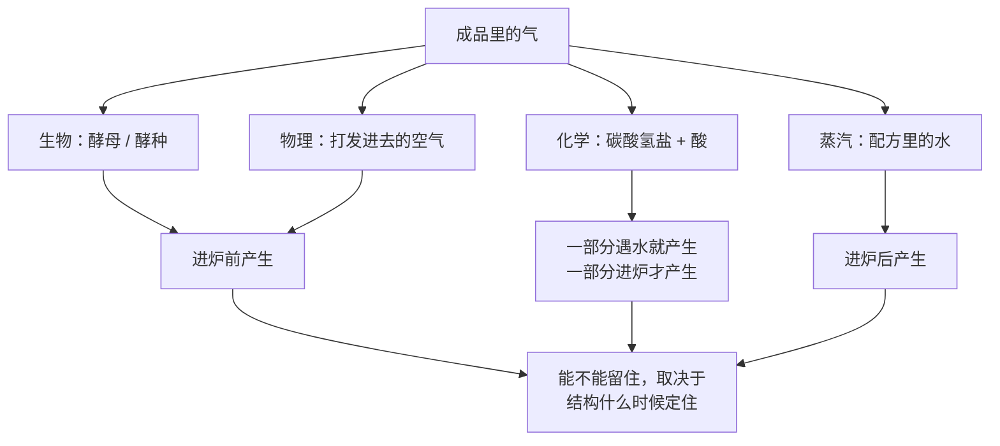
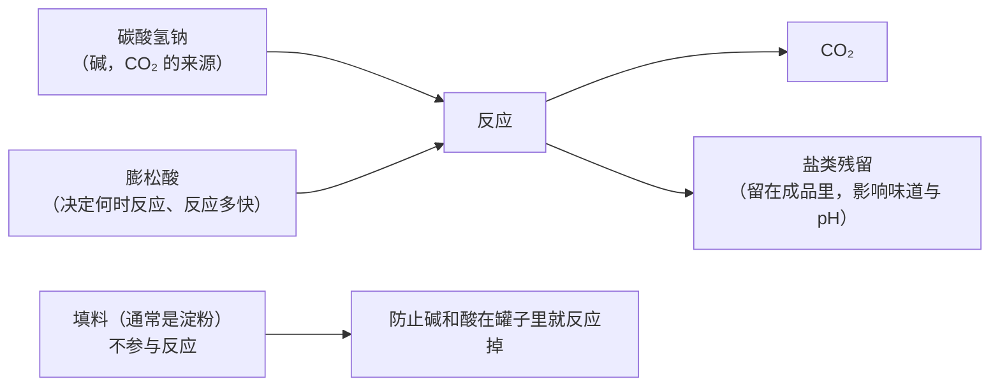
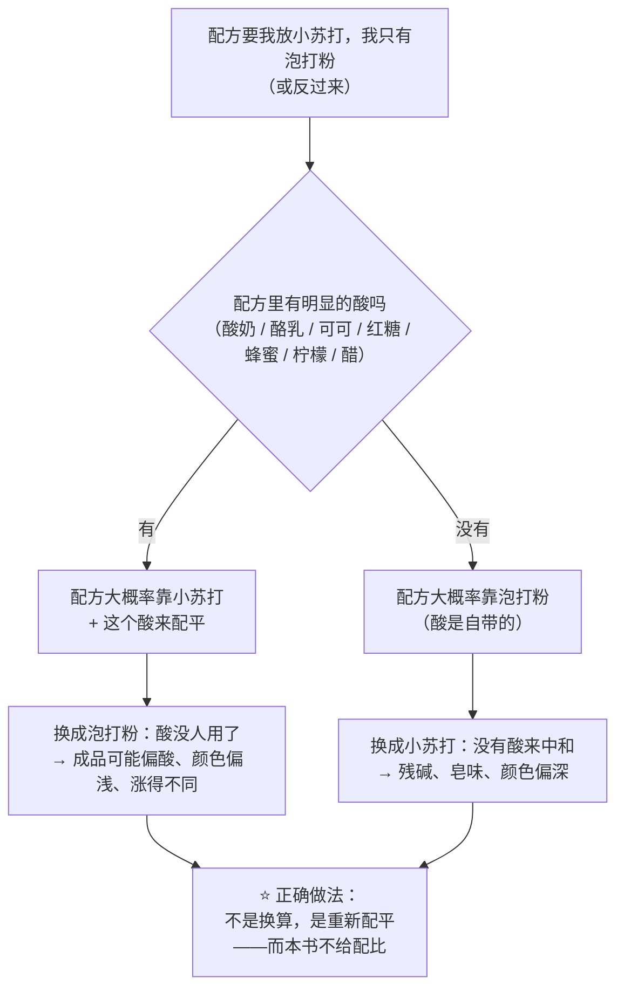
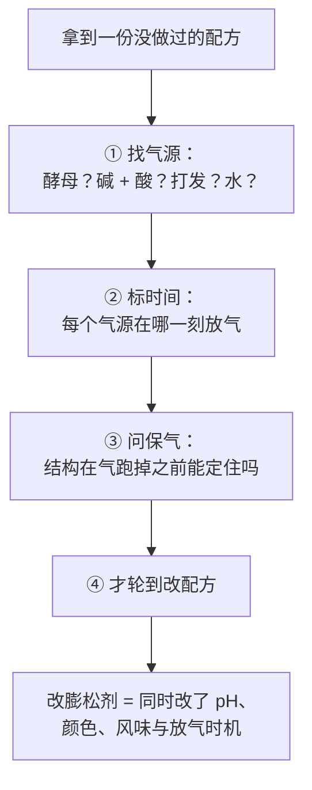

# 第 8 章 膨松剂总览：酵母、小苏打、泡打粉各是什么

> **本章目标**：把"发起来"这件事的**气源**一次认全，
> 并回答那个每个人都问过的问题：**泡打粉用完了，能不能用小苏打顶上？**
>
> 这是第一部分的最后一个角色。它和前面七个都不同：
> **它不参与结构、不提供风味（本意上），它只负责一件事——造气。**
> 但**它造完气就走，留下的东西却会改变颜色、味道和口感。**

> **本章只做总览**：三条膨发路线的细节在第二部分（第 10~15 章）展开。
> 这里要建立的是**分类与判断框架**，好让你从今天起能读懂任何一份配方的"气从哪来"。

## 8.1 四个气源，不是三个

先把话说全：烘焙里的气有**四个**来源，而配方通常同时用到不止一个。

| 气源 | 机制 | 什么时候产气 | 典型成品 |
|------|------|------------|---------|
| **① 生物**（酵母、酵种） | 活的微生物分解糖类，产生 CO₂、乙醇与风味物质 | **进炉前的几十分钟到几十小时**（进炉后还有短暂的最后冲刺） | 面包、吐司、可颂 |
| **② 化学**（小苏打、泡打粉、碳酸氢铵） | 碳酸氢盐分解或与酸反应放出 CO₂（碳酸氢铵还放氨） | **遇水时 + 受热时**，比例由配方决定 | 马芬、饼干、司康、快速面包 |
| **③ 物理**（打发） | 把空气**机械地**打进去 | **搅拌时**（进炉前就全部完成了） | 戚风、海绵、黄油蛋糕 |
| **④ 蒸汽** | 配方里的**水**在高温下变成蒸汽，体积急剧膨胀 | **进炉后** | 泡芙、千层酥；**同时也参与上面所有成品** |

> **第 ④ 条最容易被忘记，但它无处不在**：
> 一项关于饼干化学膨松的热力学建模研究在描述机制时明确写道，
> 膨松剂产生的气体**与水分蒸发一起**在面团里形成气泡。
> **所以"这份配方靠什么发"这个问题，答案几乎总是"不止一个"。**

> **第 10 章会把这张图升级成全书的膨发通用模型**：
> **产气** + **保气**。本章先把"产气"这一半认清楚。

## 8.2 生物膨发：酵母是活的，所以它有速度上限

第 11、12 章会详细讲。本章只装三条**读配方时用得上**的结论。

### ① 酵母要吃东西，而且吃不到就慢

一项研究提供了一个很干净的反例：把**不能被酵母代谢**的稀有糖加进面包配方，
结果**酵母产生的 CO₂ 减少、面团一次发酵的膨胀率低于对照**，
成品因此更硬、更黏。

> **所以"糖喂酵母"这句话要加一个条件：它得是酵母吃得了的糖。**
> （第 4 章讲过糖的四件事，喂酵母只是其中之一。）

### ② 糖和盐都会拖慢它——机制是同一个

第 4 章与第 7 章都出现过的**渗透胁迫**[^1]：
一项酵母全基因组筛选发现，对高浓度蔗糖敏感的缺失突变体
**绝大多数同时对高浓度氯化钠或山梨醇敏感**。

> **所以甜面团发得慢、咸面团发得慢，是同一件事的两种表现，而不是两个故障。**

### ③ 不同的酵母不是同一种东西

一项研究测试了四株商品压榨酵母，它们分别被推荐用于
**可颂类、面包、冷冻面团、意式节庆蛋糕**；在三种复杂面团里实测，
**它们的技术表现确实不同**。

另一项研究更进一步：把五株酵母的**发酵终点统一到产气 400 mL**（也就是把产气量对齐），
结果**炉内膨胀仍然不同**，图像分析显示涨得多的那些**气室数量更多**。
研究者的结论是：**酵母的选择会通过影响气室稳定与面筋网络，
在产气量之外继续影响成品。**

> **可迁移的判断**：**"酵母"不是一个通用零件。**
> 高糖配方要用对酵母（第 4 章提过"耐高糖酵母"），
> 而即使产气一样，不同菌株做出来的组织也可以不一样。
>
> ⚠️ 本书**没有核到**"糖超过多少百分比就必须换酵母"的阈值，因此**不给阈值**。

## 8.3 化学膨松：它其实是"碱 + 酸 + 填料"三件套

这是本章的重头戏，也是谣言最密集的地方。

### 小苏打（碳酸氢钠）单用会怎样

一项关于泡打粉与膨松酸的研究在引言里把这件事写得很清楚：

> **单用碳酸氢钠做膨松剂，会导致 CO₂ 释放不充分，
> 并且随着它在成品里溶解，碱性上升**；
> 这可能损害产品，**通常表现为皂味和发黄的颜色**。

**pH 上升这件事有实测数据**：

| 研究 | 观察 |
|------|------|
| 一项 2019 年关于饼干面团的研究 | 存放 24 天后，**用小苏打的对照面团 pH 为 9.18**，**用泡打粉的对照面团 pH 为 7.14** |
| 一项 2009 年关于可可制品的研究 | **用小苏打的蛋糕 pH 上升、颜色变深**；改用泡打粉的蛋糕可提取 pH 约 **6.2**、**颜色更浅，但蛋糕高度也更低**；市售巧克力蛋糕预拌粉成品的 pH 在 **8.3 以上** |

> **两项独立研究指向同一件事**：
> **小苏打不只是"产气的"，它还是"把 pH 推上去的"。**
> 而 pH 一变，**颜色、风味、甚至结构都会跟着变**——
> 那个"更深的颜色"不是错觉，是 pH 造成的（第 21 章会讲褐变）。

### 所以它需要一个酸：中和值是怎么回事

同一项研究给出了行业里的标准说法：

> **中和值（NV）**：**100 份重量的膨松酸能中和多少份重量的碳酸氢钠**
> （也就是让它把可用的 CO₂ 全部放出来）。

**第三样东西——填料**也有出处：一篇梳理了约 160 件专利的综述指出，
化学膨松剂里加**中性填料（玉米淀粉最常见）**与抗结剂，是为了**控制吸潮**、
防止碱与酸**提前反应**，从而延长保质期；近年还出现给膨松酸**做包衣**
以延缓冷藏面团中产气的做法。

> **所以你手里那罐泡打粉，一半以上可能是淀粉——这是设计，不是掺假。**

### "双效"到底是哪两效

这是全章最值得记住的一段。

膨松酸按**溶解与反应的快慢**分类：**快速作用**的酸在**搅拌时**就基本反应完；
**慢速作用**的酸溶得慢，**主要在烘烤温度下**才放气。

商业上最常用的慢速酸之一是**酸式焦磷酸钠（SAPP）**，
而它后面那个数字就是在说这件事：

| 牌号 | 含义（该研究的表述） |
|------|-------------------|
| **SAPP 10** | 约 **10%** 的可用 CO₂ 在**搅拌阶段**放出（冷作用），其余 **90%** 在**烘烤时**放出（热作用） |
| **SAPP 28** | 约 28% / 72% |
| **SAPP 40** | 约 40% / 60% |

> **所以"双效"不是"发两次"这么粗糙**：
> 它是**"有多少比例的气留到进炉之后才放"**——
> 而这个比例是配方设计者**选出来的**，不是固定的。

> **这一点直接改变你读配方的方式**：
> 配方里写"拌好后立刻入炉"，往往是因为它依赖的那部分气**在搅拌时就开始跑了**；
> 而一份能冷藏静置的面团，多半用了更"慢"的酸或做过包衣处理。

### 量不是越多越好

同一项研究用响应面法系统地改了泡打粉用量与两种 SAPP 的配比，结果：

> **提高泡打粉用量确实显著提高了面糊的比容与孔隙率，
> 但接近最高用量（该研究中为 4.52%）时反而下降；
> 而用量偏低时，蛋糕会出现大而不均匀的气孔。**

⚠️ 该研究的百分比基准本书**未核到明确写法**，因此**只引用方向，不引用数字当推荐值**。

> **可迁移的判断**：**膨松剂有一个"最合适"的量，不是越多越大。**
> 太少 → 气孔大而不均匀；太多 → 过了峰值反而掉下来（气室撑破、结构塌）。

### 官方给过一个"酸碱要配平"的法定例子

美国 21 CFR 137.180 定义的**自发粉**是一个很好的注脚：

| 规定 | 内容 |
|------|------|
| 组成 | 面粉 + 碳酸氢钠 + 一种或多种**膨松酸**（磷酸二氢钙、酸式焦磷酸钠、磷酸铝钠）+ 盐 |
| 产气 | 按规定方法测试时**放出不少于 0.5% 的二氧化碳** |
| **配平** | **酸的量要足以中和碳酸氢钠** |
| 上限 | **酸与碳酸氢钠合计，每 100 份面粉不超过 4.5 份** |

> ⚠️ 各国口径不同，以当地现行发布为准。
> **注意最后一行的写法**：它是**以面粉为基准**的——
> 这正是第 9 章要讲的烘焙百分比，**连法规都用这把尺子**。

### 第三种碱：碳酸氢铵

老配方（尤其是饼干）里常见"臭粉""碳酸氢铵"。它和小苏打有本质区别：

| | 碳酸氢钠（小苏打） | 碳酸氢铵 |
|---|-----------------|---------|
| 放出什么 | CO₂ | **CO₂ + 氨（NH₃）** |
| 需要酸吗 | **需要**（否则残碱） | 受热直接分解 |
| 残留 | 钠盐留在成品里 | **理论上气体全部跑掉**——前提是它们真的跑得掉 |
| 用在哪 | 几乎所有化学膨松的成品 | **只用于低水分产品（如饼干）** |

那篇热力学建模研究把限制条件写得很直接：
**碳酸氢铵的最大产气被认为出现在 59 °C 左右；
它的使用被限制在饼干这类低水分产品上，因为那里可以期待它最大程度地分解——
残留物会在烘烤后留下异味。**

同一研究的模拟还给出一个反直觉的结论：
**产生的气体大部分来自碳酸氢盐，铵的贡献要小得多**；
研究者甚至写道，**碳酸氢铵作为膨松剂的功能性"是存疑的"**。

**另一条要知道的事**（安全 / 品质，不是健康建议）：
碳酸氢铵与**丙烯酰胺**的生成有关。一项研究用三因素组合
（把每 500 g 面粉中的碳酸氢铵从 9.0 g 降到 1.5 g、相应提高碳酸氢钠、
把烘烤中段温度从 170 °C 降到 150 °C、并排蒸汽 3 分钟）
使饼干中的丙烯酰胺**降低了 87.2%**。

> ⚠️ **这是三个因素一起改的结果，不能拆开归因给任何单一变量。**
> 本书列出它只是为了说明：**换膨松剂不是只换了"气"，还换了烘烤中发生的化学。**

### 不同的膨松剂做出来的东西真的不一样

一项研究用**同一份配方**，只换膨松剂（碳酸氢铵 / 塔塔粉 / 葡萄基膨松剂 / 普通泡打粉），
发现成品在**质地、挥发性风味成分与感官特征**上都有差异：

| 用哪种 | 成品特征 |
|--------|---------|
| **碳酸氢铵** | 表面最均匀、**结构最不硬、脆裂性最高、摊得最开**，泡牛奶时吸得最多 |
| **塔塔粉类泡打粉** | 质地**更脆**，但整体感官接受度较低 |
| 普通（二磷酸盐）泡打粉 | 居中 |

> **这是"不能互换"最直接的实物证据**：
> **同一份配方，只换膨松剂，出来的是不同的饼干。**

## 8.4 为什么它们不能互换：一张对照表

| | 酵母 | 小苏打（碳酸氢钠） | 泡打粉 | 碳酸氢铵 |
|---|------|------------------|--------|---------|
| **气从哪来** | 微生物代谢 | 碳酸氢盐 + **配方里的酸** | 碳酸氢盐 + **自带的酸** | 受热分解 |
| **它需要什么** | 糖、水、时间、合适温度 | **配方里必须有酸**（酸奶、可可、蜂蜜、红糖、柠檬…） | 水（+ 热） | 热 |
| **什么时候产气** | 进炉前几十分钟~几十小时 | 遇水就开始 | 一部分遇水、一部分受热（比例由酸的型号决定） | 受热（最大产气被认为在 59 °C 附近） |
| **它留下什么** | 风味物质、酸、乙醇（烤掉） | **钠盐 + 升高的 pH** | 盐类残留，pH 接近中性 | **理论上什么都不留**（气体跑掉） |
| **产气之外的副作用** | 风味、面筋被酶与酸修饰 | pH↑ → **颜色更深、可能有皂味** | 影响较小 | 低水分才用，否则**氨味残留** |
| **等量替换可行吗** | ❌ 完全不同的时间尺度 | ❌ 与泡打粉**不是同一类东西** | ❌ | ❌ |

> ⚠️ **本书为什么不给"小苏打 : 泡打粉"的换算比例**：
> 因为它取决于**你手上那罐泡打粉用的是哪种酸、中和值是多少、
> 快作用与慢作用的比例是多少**——这些信息通常不在包装上。
> **一个听起来很方便的比例，正是本书第 1 章说的"听起来合理的假数字"。**

## 8.5 常见说法辨析

按本书约定标注**证据强度**：✅ 有共识 / ⚠️ 有争议 / ❌ 明确错误 / 缺乏证据。
来源见[出处登记](../../standards.md)。

| 说法 | 判定 | 说明 |
|------|------|------|
| "**泡打粉和小苏打可以互换**" | ❌ **明确错误** | 泡打粉 = 碱 + **自带的酸** + 填料；小苏打只有碱，**必须靠配方里的酸**。单用小苏打会导致 CO₂ 释放不充分并让 pH 上升——实测：用小苏打的面团 pH **9.18**，用泡打粉的 **7.14**；另一项研究里改用泡打粉后蛋糕颜色更浅、可提取 pH 约 6.2，但**高度也更低**。**换 = 重新配平，不是换算** |
| "**自制泡打粉：小苏打 + 塔塔粉，按固定比例配就行**" | ⚠️ **方向对，比例不能照抄** | 方向是对的（碱 + 酸 + 填料）。但配比取决于那种酸的**中和值**（100 份酸能中和多少份碳酸氢钠），而且不同的酸**放气的快慢完全不同**（快作用的在搅拌时就放完，慢作用的留到烘烤）。⚠️ 本书**不给配比**——你手上那罐的酸是什么、中和值多少，包装上通常不写 |
| "**双效泡打粉就是发两次**" | ⚠️ **说法太粗** | 更准确的说法是：**有多大比例的气留到进炉之后才放**。行业里用牌号直接标出来——例如 SAPP 10 / 28 / 40 分别表示约 **10% / 28% / 40%** 的可用 CO₂ 在搅拌阶段放出，其余在烘烤时放出。**这个比例是配方设计者选的**，所以"拌好要不要马上进炉"取决于用的是哪一档 |
| "**膨松剂放多一点发得更大**" | ⚠️ **有峰值** | 一项用响应面法系统改泡打粉用量的研究发现：**提高用量确实提高面糊比容与孔隙率，但接近最高用量时反而下降**；用量偏低时成品出现**大而不均匀的气孔**。⚠️ 该研究百分比基准本书未核到明确写法，**只引用方向**。机制上也讲得通：气太多会撑破气室壁（第 10 章） |
| "**小苏打能让饼干更脆、颜色更深，所以是'升级版'**" | ⚠️ **它改的是 pH，不是"品质"** | 颜色变深是 **pH 上升**的结果（两项独立研究观察到用小苏打的成品 pH 更高、颜色更深）。**这同时会带来皂味风险**，而且在含可可、含花青素等对 pH 敏感的配方里还会改变风味物质与色泽。**它是一个变量，不是一个等级** |
| "**泡打粉过期了只是发得少一点**" | ⚠️ **可能不止** | 化学膨松剂的保质期问题主要是**吸潮导致碱与酸提前反应**——这也是它要加中性填料与抗结剂的原因（一篇梳理约 160 件专利的综述）。提前反应掉的那部分气**在罐子里就跑了**，剩下的是**比例被改变**的体系。⚠️ 本书**没有核到**家庭储存条件下的失效速率数据，**不给期限数字**；给的是判据：**取一点放进温水，看起泡是否明显**（这是常识性做法，本书未核到标准方法） |
| "**碳酸氢铵是老东西，可以直接用泡打粉等量替换**" | ❌ **两件不同的东西** | 碳酸氢铵受热直接分解，**放出 CO₂ 和氨**，理论上不留残渣——但**只适用于低水分产品**，否则氨味留在成品里。一项对照研究显示：同一份配方用碳酸氢铵做出来的饼干**摊得最开、最不硬、脆裂性最高**，和用泡打粉的明显不同。**要换就要接受成品变了** |
| "**酵母和泡打粉可以互相替代，反正都是发**" | ❌ **时间尺度完全不同** | 酵母要**几十分钟到几十小时**、需要糖与合适温度，还会产生风味与酸；化学膨松**遇水（或受热）就放气**，几乎没有风味贡献。一篇 2026 年的综述把三条路线并列比较后明确指出：生物膨发带来质地与**风味复杂度**但需要较长时间；化学膨发**放气快、过程可控**，但成品**风味复杂度不足**，还可能有**残留的咸味** |
| "**酵母的活力就是全部：产气一样，结果就一样**" | ❌ **不是** | 一项研究把五株酵母的发酵终点**统一到产气 400 mL**（把产气对齐），结果**炉内膨胀仍然不同**，涨得多的那些气室数量更多。研究者的结论是：菌株选择会通过影响**气室稳定与面筋网络**，在产气量之外继续影响成品 |

## 8.6 一条可迁移的判断规则

> ## 看配方先问两句：**气从哪来？什么时候来？**
>
> 这两句能把任何一份配方的膨发结构拆开：

| 线索 | 它在告诉你 |
|------|-----------|
| 配方里有**酵母**，且有"一发 / 二发"的时间 | 气在**进炉前**产生；**时间和温度是主要变量** |
| 配方里有**小苏打** + 明显的酸性原料 | 气**遇水就开始**产生；**"拌好马上进炉"多半是硬要求** |
| 配方里有**泡打粉** | 一部分遇水、一部分受热；**能不能静置取决于它用的是哪种酸** |
| 配方要求"**打发到发白蓬松 / 硬性发泡**" | 气是**打进去的**；**泡沫寿命是主要变量**（第 6 章） |
| 配方含水高、要求**高温入炉**（泡芙、千层） | 气主要是**蒸汽**；**炉温与"有没有层"是主要变量** |

## 8.7 🔎 下次烤之前的用处

1. **膨松剂用完了不要硬换**。小苏打与泡打粉**不是同一类东西**——
   换 = 重新配平酸碱，而本书不给配比（因为你那罐用的什么酸，包装上多半没写）。
2. **用小苏打的配方，先去配方里找酸**（酸奶、酪乳、可可、红糖、蜂蜜、柠檬、醋）。
   找不到酸却写着小苏打，就要怀疑**配方本身**或**成品本来就想要高 pH 的颜色**。
3. **"拌好马上进炉"是有道理的**：化学膨松剂遇水就开始放气，
   而留到炉子里的那部分比例由它用的酸决定，**不由你决定**。
4. **膨松剂多放不等于发得大**：一项研究显示用量接近上限时比容反而下降，
   而用量偏低时会出现**大而不均匀的气孔**。
5. **成品发黄、有皂味、颜色异常深**——先怀疑**碱过量**（pH 被推高了），
   而不是"烤过头"。
6. **甜面团、咸面团发得慢是设计的必然，不是故障**：糖和盐都在给酵母施加渗透胁迫。
7. **换膨松剂就是换化学**：不同膨松剂做出来的饼干在**质地、挥发性风味与感官**上都不同——
   这是同一份配方、只换膨松剂的对照研究结果。

## 8.8 思考题

1. 烘焙里的气有哪**四个**来源？为什么说"这份配方靠什么发"这个问题，
   答案几乎总是"不止一个"？
2. 单用小苏打会出现什么问题？请给出至少两项独立研究的数据支持，
   并说明为什么"颜色更深"和"可能有皂味"是同一件事的两面。
3. "双效泡打粉"的"双效"准确地说是什么意思？
   SAPP 10 和 SAPP 40 的差别在哪？这对"拌好要不要马上进炉"有什么影响？
4. **【案例】** 一份美式松饼（马芬）配方：面粉 100%、糖 40%、油 30%、
   全蛋 40%、**酪乳 80%**、**小苏打 1.2%**（**以面粉总量为 100%**）。
   某人家里没有酪乳，用等量牛奶替代，其余不变。
   （a）预测成品在**膨胀、颜色、味道**三方面会怎样，并说明机制；
   （b）他还发现成品"有一点说不上来的怪味"，最可能是什么？
   （c）如果只能用牛奶，他至少有哪两种改法？各自的代价是什么？
5. **【案例】** 有人做饼干，配方要求"碳酸氢铵（臭粉）"，他换成了等量泡打粉。
   结果饼干**没有以前摊得开、更硬、更厚**，但"没有那股味道了"。
   （a）用本章引的对照研究解释这三个变化；
   （b）"没有那股味道"说明了什么？为什么碳酸氢铵只能用在低水分产品上？
   （c）他要做的到底是"换回臭粉"还是"改配方"？说明你的判断依据。
6. **【辨析】** "膨松剂放多一点发得更大"——判断证据强度，
   说明它在什么范围成立、越过之后会发生什么，并设计一个在家能做的对照。
7. **【辨析】** "酵母产气量一样，做出来的面包就一样"——
   用一项把产气量对齐的研究反驳它，并说明这条结论指向第 1 章的哪一组竞争。
8. 本章在"自制泡打粉的配比""膨松剂的保质期""换算比例"这三处都明确拒绝给数字。
   请分别说明拒绝的理由，并指出这三条拒绝背后共同的判断标准是什么。

> 📖 **参考答案**（想清楚再看）：[Q1](../../qa/08-leavening-agents-qa.md#q1) ·
> [Q2](../../qa/08-leavening-agents-qa.md#q2) · [Q3](../../qa/08-leavening-agents-qa.md#q3) ·
> [Q4](../../qa/08-leavening-agents-qa.md#q4) · [Q5](../../qa/08-leavening-agents-qa.md#q5) ·
> [Q6](../../qa/08-leavening-agents-qa.md#q6) · [Q7](../../qa/08-leavening-agents-qa.md#q7) ·
> [Q8](../../qa/08-leavening-agents-qa.md#q8)

## 8.9 本章实操

### 🅐 零成本版 · 任务一：读你家那罐膨松剂的配料表

**需要**：家里所有的膨松剂（小苏打、泡打粉、酵母、臭粉…）、放大镜（字通常很小）。

| 观察 | 产品 A | 产品 B | 产品 C |
|------|-------|-------|-------|
| 名称 | | | |
| 配料表里有**碳酸氢钠**吗？ | | | |
| 配料表里有**酸**吗？是哪一种？（焦磷酸盐 / 磷酸盐 / 酒石酸氢钾 / 葡萄糖酸内酯…） | | | |
| 配料表里有**淀粉**吗？排第几位？ | | | |
| 包装上有没有写"双效"？有没有写快 / 慢作用的比例？ | | | |
| **判断：它是"只有碱"还是"碱 + 酸 + 填料"？** | | | |

然后回答：

| 问题 | 你的答案 |
|------|---------|
| 你手上的泡打粉，**用的是哪种酸**？包装上写了吗？ | |
| 如果没写，你还能不能算出"小苏打换泡打粉"的比例？为什么？ | |
| 淀粉在里面是干什么的？ | |

> **这个任务的目的只有一个**：让你亲眼确认"网上那个换算比例"**没有可用的输入条件**。

### 🅐 零成本版 · 任务二：给三份配方做"气源诊断"

| | 配方 A | 配方 B | 配方 C |
|---|-------|-------|-------|
| 品类 | | | |
| 面粉（＝100%） | | | |
| **膨松剂的烘焙百分比** | % | % | % |
| 气源①：有酵母吗？ | | | |
| 气源②：有碱吗？有酸吗？（列出酸性原料） | | | |
| 气源③：有"打发"动作吗？ | | | |
| 气源④：含水量高不高？要不要高温入炉？ | | | |
| **主气源是哪一个？什么时候放气？** | | | |
| 配方有没有写"立刻入炉"？和你的判断一致吗？ | | | |

### 🅐 零成本版 · 任务三：冒泡测试（不用烤箱）

**需要**：小苏打、泡打粉、一点醋或柠檬汁、两杯温水、两个透明杯。

| 组 | 做法 | 现象（立刻） | 现象（1 分钟后） |
|----|------|------------|---------------|
| ① 小苏打 + 清水 | 取一小勺放进温水 | | |
| ② 小苏打 + 醋 | 取一小勺放进醋 | | |
| ③ 泡打粉 + 清水 | 取一小勺放进温水 | | |
| ④ 泡打粉 + 醋 | 取一小勺放进醋 | | |

回答：

| 问题 | 你的答案 |
|------|---------|
| ① 和 ② 的差别说明了什么？ | |
| ③ 为什么在**只有水**的时候也冒泡？ | |
| ③ 冒完之后还剩多少气没放出来？你能从杯子里看出来吗？为什么看不出来？ | |
| 由 ③ 推想：为什么很多配方写"拌好马上进炉"？ | |

> ⚠️ **这个测试只能看"有没有反应"，不能看"放了多少气"**——
> 因为**留到烘烤阶段才放的那部分，在杯子里看不到**。
> 这正是"双效"的意思。

### 🅑 开火版 · 任务四：同一份配方，只换膨松剂（有烤箱时做）

**需要**：一份**靠化学膨松**的简单配方（松饼 / 司康 / 简单饼干）、
厨房秤、同一个烤盘、尺子、纸笔。

**唯一变量**：膨松剂。其余原料克数、搅拌方式与时间、每份重量、
炉温、时间**全部一致**，同时进炉。

| 组 | 膨松剂 | 面糊 / 面团表现 | 出炉高度 | 直径 | 颜色（浅 / 中 / 深） | 味道（有没有异味） | 内部气孔 |
|----|-------|---------------|---------|------|------------------|-----------------|---------|
| ① 原配方 | | | mm | mm | | | |
| ② 只用小苏打（**等重**） | | | mm | mm | | | |
| ③ 只用泡打粉（**等重**） | | | mm | mm | | | |

做完回答：

| 问题 | 你的答案 |
|------|---------|
| 哪一组**颜色最深**？和"小苏打让 pH 上升"一致吗？ | |
| 有没有哪一组尝到皂味 / 苦味 / 金属味？ | |
| 哪一组涨得最高？涨得最高的那一组**好吃**吗？ | |
| "等重替换"这个做法本身有什么问题？（提示：中和值） | |
| 这次实验能证明"不能互换"吗？还是只能证明"换了不一样"？ | |

> **注意最后一行**：这是一个关于**实验能说明什么**的问题。
> 本书希望你养成的习惯是：**做完实验先问它到底证明了什么，再下结论。**

### 🅑 开火版 · 任务五（加分）：放气时机实验

用同一份化学膨松的面糊，分成三份：

| 组 | 处理 | 出炉高度 | 组织 |
|----|------|---------|------|
| ① 拌好**立刻**入炉 | | mm | |
| ② 拌好静置 **20 分钟**再入炉 | | mm | |
| ③ 拌好静置 **60 分钟**再入炉 | | mm | |

> **这个实验直接测出你手上那罐膨松剂"留了多少气给烤箱"**：
> 如果 ③ 和 ① 差别很小，说明它的酸偏"慢"；差别很大，说明它偏"快"。
> **这是你唯一能在家做的、逼近"快 / 慢作用比例"的观察。**
>
> ⚠️ **局限**：静置期间面糊还发生了别的变化（面粉继续吸水、面筋松弛、温度变化），
> 所以差别**不能全部归因**给膨松剂。它给的是方向，不是定量。
>
> ⚠️ **安全提醒**：**不要尝生面糊**（美国 FDA：生面粉不是即食食品；
> 含蛋的生面糊还有生蛋风险）。膨松剂请按食品级产品的包装说明使用。
> 各国口径可能不同，以自己所在地现行发布为准。

## 8.10 本章依据

本章引用的来源与核对状态详见[参考书目与出处登记](../../standards.md)，具体对应如下：

| 本章用到的内容 | 依据 |
|--------------|------|
| **单用碳酸氢钠 → CO₂ 释放不充分 + 碱性上升 → 皂味与发黄**；**中和值（NV）的定义**；膨松酸分**快作用 / 慢作用**；**SAPP 10 / 28 / 40 表示约 10% / 28% / 40% 的可用 CO₂ 在搅拌阶段放出（冷作用），其余在烘烤时放出（热作用）**；提高泡打粉用量提高面糊比容与孔隙率，但**接近最高用量时反而下降**，用量偏低则出现**大而不均匀的气孔**；以及巴氏杀菌全蛋液的原料规格 | *Foods* 2023 泡打粉与膨松酸对磅蛋糕面糊与成品影响的研究（开放获取），✅ 全文已核。⚠️ 该研究的百分比基准本书未核到明确写法，**只引用方向** |
| 存放 24 天后**小苏打面团 pH 9.18、泡打粉面团 pH 7.14** | *Journal of the Science of Food and Agriculture* 2019 酸味剂对葵花籽酱饼干面团的影响研究，✅ 摘要层面 |
| **用小苏打的蛋糕 pH 上升、颜色变深**；改用泡打粉的蛋糕可提取 pH 约 **6.2**、颜色更浅但**高度更低**；市售巧克力蛋糕预拌粉成品 pH 在 **8.3 以上** | *Journal of Food Science* 2009 可可制品在烹饪加工中抗氧化成分保留的研究，✅ 摘要层面。**本书只引用其 pH 与颜色 / 高度的观察，不引用其营养结论** |
| 化学膨松剂中加入**中性填料（常见为玉米淀粉）与抗结剂**以控制吸潮、防止碱酸提前反应；近年出现给膨松酸做**包衣**以延缓冷藏面团中的产气 | *International Journal of Food Science & Technology* 2023 化学膨松剂保存性能与非反应性成分的专利综述，✅ 摘要层面 |
| 膨松剂产生的气体**与水分蒸发一起**形成气泡；**碳酸氢铵的最大产气被认为在 59 °C 附近**；**其使用限于低水分产品（如饼干），否则残留物在烘烤后留下异味**；模拟显示**大部分气来自碳酸氢盐，铵的贡献小得多**；盐会降低 CO₂ 在面团中的溶解度 | *Current Research in Food Science* 2021 饼干化学膨松的热力学描述（开放获取），✅ 全文已核 |
| 同一配方只换膨松剂：**碳酸氢铵组表面最均匀、结构最不硬、脆裂性最高、摊开最大**；塔塔粉类泡打粉组**更脆但感官接受度较低**；膨松剂显著影响**挥发性风味成分** | *Journal of Food Science and Technology* 2020 不同膨松剂对饼干理化、感官与挥发性成分影响的研究，✅ 摘要层面 |
| 把碳酸氢铵从每 500 g 面粉 9.0 g 降到 1.5 g、相应提高碳酸氢钠、烘烤中段温度从 170 °C 降到 150 °C、排蒸汽 3 分钟，**三者合计使丙烯酰胺降低 87.2%** | *Foods* 2022 饼干丙烯酰胺物理与化学联合减控研究（开放获取），✅。⚠️ **三因素同时改变，不能拆开归因** |
| 自发粉的法定组成：面粉 + 碳酸氢钠 + 膨松酸（磷酸二氢钙 / 酸式焦磷酸钠 / 磷酸铝钠）+ 盐；**放出不少于 0.5% 的 CO₂**；**酸量要足以中和碳酸氢钠**；**酸与碳酸氢钠合计每 100 份面粉不超过 4.5 份** | 美国 21 CFR 137.180「Self-rising flour」，✅ 已核到法规原文。⚠️ 各国口径不同 |
| 四种膨松酸（SALP、SAS、MCP、SAPP-28）与碳酸氢钠配合：膨松盐的离子与 pH 相互作用会影响面团性质与静置时间 | *Cereal Chemistry* 2000 膨松酸对小麦粉玉米饼影响的研究，✅ 摘要层面 |
| 三条膨发路线的并列比较：生物膨发带来质地与**风味复杂度**但耗时；**化学膨发放气快、过程可控，但风味复杂度不足，并可能有残留咸味**；物理（超临界流体）路线受设备成本限制 | *Food Chemistry* 2026 膨发方式对面团性质与面包品质影响的综述，✅ 摘要层面 |
| 把五株酵母的发酵终点**统一到产气 400 mL** 后，**炉内膨胀仍然不同**，涨得多的气室数量更多；菌株选择通过**气室稳定与面筋网络**在产气量之外影响成品 | *Food Chemistry: X* 2026 不同炉内膨胀表现的酵母菌株研究，✅ 摘要层面 |
| 四株商品压榨酵母分别被推荐用于可颂类、面包、冷冻面团、意式节庆蛋糕，实测**技术表现确实不同** | *European Food Research and Technology* 2007 商品酵母菌株在复杂面团中的技术表现研究，✅ 摘要层面 |
| 加入**不能被酵母代谢的稀有糖**后，CO₂ 产生减少、一次发酵膨胀率低于对照，成品更硬 | *International Journal of Food Science & Technology* 2022 稀有糖 D-阿洛酮糖对面包酵母发酵能力与面包物性影响的研究，✅ 摘要层面 |
| 高糖 / 高盐对酵母主要是**渗透胁迫** | *FEMS Yeast Research* 2006 高蔗糖胁迫耐受基因的全基因组筛选，✅ 摘要层面 |
| 碳酸氢铵与碳酸氢钠、蔗糖与葡萄糖在 180~220 °C 下对饼干中 HMF 的影响；**水分活度降到 0.4 以下后 HMF 生成速率急剧上升** | *European Food Research and Technology* 2008 膨松剂与糖对饼干 HMF 生成影响的研究，✅ 摘要层面 |
| 生面粉与生面糊的安全 | 美国 FDA「Handling Flour Safely: What You Need to Know」，✅ 已核到官方页面 |
| **"小苏打换泡打粉"的换算比例** | ⚠️ **不给**：它取决于所用膨松酸的中和值与快 / 慢作用比例，而这些信息通常不在家用包装上 |
| **家庭储存条件下膨松剂的失效速率** | ⚠️ **未核到**；本章不给期限数字，只说明失效机制（吸潮导致提前反应） |
| **"糖超过多少百分比就必须换耐高糖酵母"的阈值** | ⚠️ **未核到**；只写方向 |

[^1]: [渗透胁迫](../../glossary.md#osmotic-stress)（osmotic stress）。本章新出现的术语见
[化学膨松](../../glossary.md#chemical-leavening)（chemical leavening）、
[膨松酸](../../glossary.md#leavening-acid)（leavening acid）、
[中和值](../../glossary.md#neutralization-value)（neutralization value）、
[双效泡打粉](../../glossary.md#double-acting)（double-acting baking powder）、
[碳酸氢铵](../../glossary.md#ammonium-bicarbonate)（ammonium bicarbonate）、
[自发粉](../../glossary.md#self-rising-flour)（self-rising flour）。

---

**下一章**：第 9 章 烘焙百分比——把任意两份配方摆到同一把尺子上。
第一部分的七个角色到这里全部认完了；最后一章要做的，
是把它们**放进同一个坐标系**，让你能比较、能缩放、能改。
