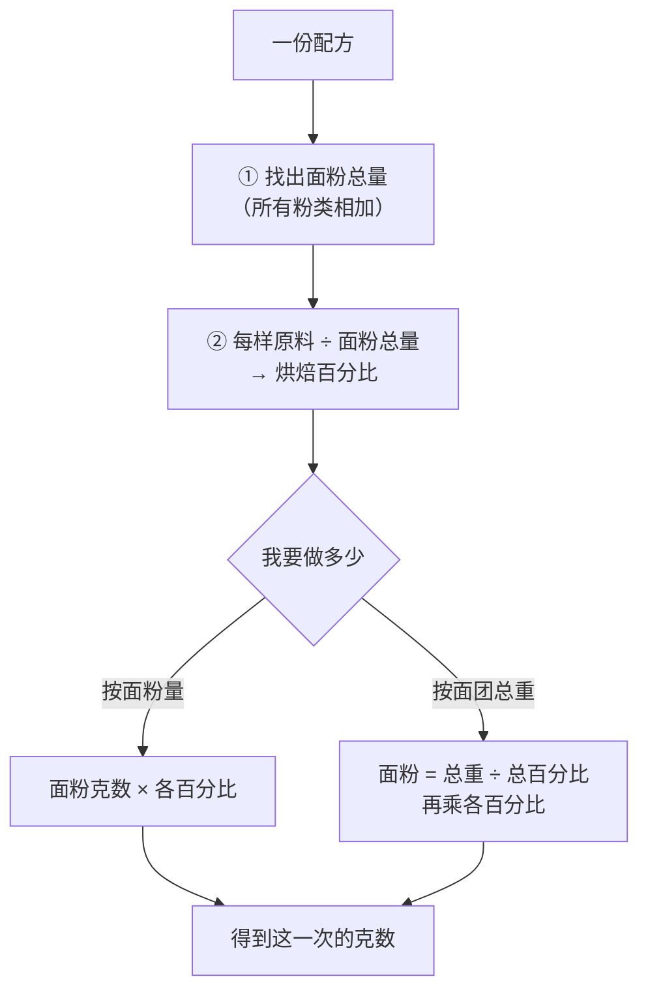
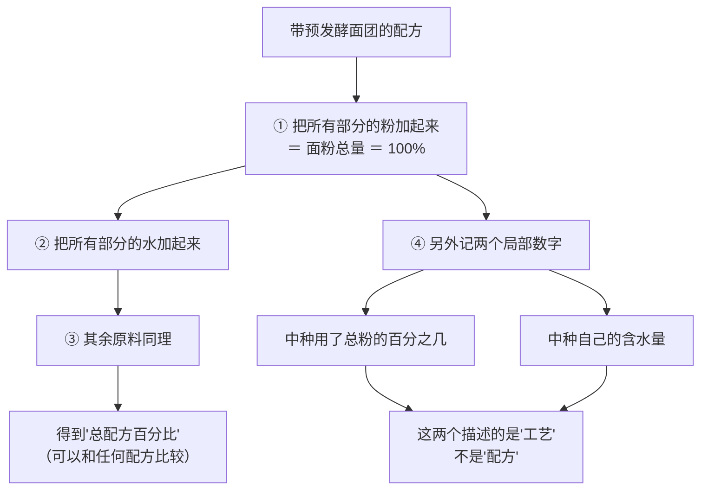
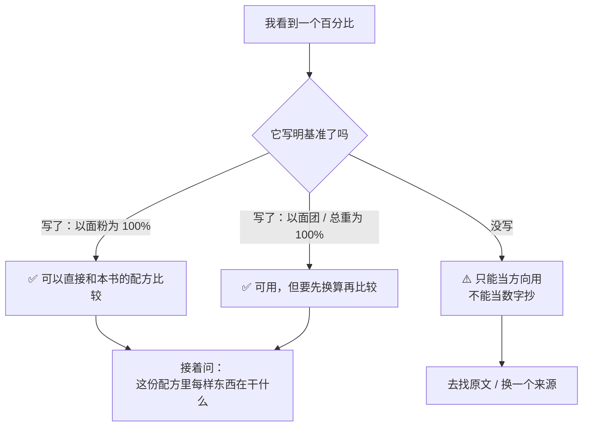

# 第 9 章 烘焙百分比：换算、缩放与配方之间的比较

> **本章目标**：把前八章认识的角色**放进同一个坐标系**。
>
> 学完这一章，你能做三件以前做不了的事：
> **把任意两份配方摆到同一把尺子上比较**、**把任何配方缩放到你要的份量**、
> **看出一份配方"哪里不寻常"**——而这正是"改配方"的起点。

> 这是第一部分的最后一章。它不讲任何新的原料，
> 只教一套**记法**——但正是这套记法，让前八章的知识变得**可计算**。

## 9.1 为什么必须有一把公用的尺子

看这两份配方，说出哪一份更"湿"：

| 配方 A | 配方 B |
|--------|--------|
| 高筋粉 500 g、水 325 g、盐 10 g、干酵母 5 g | 高筋粉 3 杯、水 1 杯半、盐 2 小勺、干酵母 1 小勺 |

**第一个问题**：B 根本没法比——"杯"和"勺"不是重量（第 26 章会展开为什么这是家庭烘焙最大的误差来源之一）。

**第二个问题**：就算 B 也换成克，两份配方的**总量不同**，
你仍然要先做除法才能比较。

**烘焙百分比**[^1]就是把这个除法**一次做完、永久有效**：

> ## **以配方中的面粉总量为 100%，其余每样原料都记成"占面粉重量的百分比"。**

配方 A 于是变成：

| 原料 | 克数 | **烘焙百分比** | 它在这份配方里扮演什么 |
|------|------|--------------|---------------------|
| 高筋粉 | 500 g | **100%** | 结构材料（面筋 + 淀粉） |
| 水 | 325 g | **65%** | 水合、糊化、变蒸汽 |
| 盐 | 10 g | **2%** | 调速器（第 7 章） |
| 干酵母 | 5 g | **1%** | 气源（第 8 章） |
| **合计** | 840 g | **168%** | — |

**从此这份配方可以和任何一份用同一把尺子写的配方直接比较**，
而且**不管你要做 1 个还是 100 个**，这四个数字都不用变。

> **这就是为什么职业烘焙用这套记法**：配方是"比例"，份量是"另一件事"。
>
> ⚠️ 顺带说明：**这是一套记法约定，不是实验结论**——
> 约定不需要证据。但凡是"某类成品的百分比典型落在哪个区间"这种**数值主张**，
> 本书都必须另找出处（见 §9.7）。

## 9.2 三条必须记住的约定

### ① 基准永远要写出来

> **离开基准，百分比没有意义。**

本书统一约定**以面粉总量为 100%**，但**这不是唯一可能的基准**。
第 5 章就出现过一个不同的基准：
一项研究提到**可颂这类起酥点心的裹入油可达面团重量的 35%**——
注意那里是**以面团重量为 100%**，不是以面粉。

**两个基准差多少？** 举个例子就知道了：

| 同一块 100 g 的黄油 | 以 500 g 面粉为基准 | 以 890 g 面团为基准 |
|-------------------|-------------------|-------------------|
| 记成 | **20%** | **约 11%** |

> **同一样东西，两个数字，差了将近一倍。**
> 所以本书每次出现配方与比例，都会写明以何物为 100%——
> 这也是[校验脚本](https://github.com/H-Jett/LifeLearning/blob/main/books/baking/scripts/check_book.py)会检查的一项。

### ② 总百分比会超过 100%，这是正常的

上面那份配方合计 **168%**。这不是算错了——
**面粉是 100%，别人都加在它上面**。

> 有的职业教材还会用另一套记法："**真实百分比**"（以配方总重为 100%）。
> **两套记法不能混用**，看到百分比先确认是哪一套。
> ⚠️ 这一条属于**行业惯例**，本书**未核到纸本教材原文**，只作为"存在两种记法"提示你。

### ③ "面粉总量"包括所有的粉

如果配方里有高筋粉 400 g + 全麦粉 100 g，
那么 **100% = 500 g**，高筋粉是 80%、全麦粉是 20%。

**中种、汤种、酵种里的粉也算在内**——这是最容易算错的地方，§9.5 专门讲。

## 9.3 换算：克数 ↔ 百分比

### 方向一：把一份克数配方翻译成百分比

> **每样原料的百分比 = 该原料克数 ÷ 面粉总克数 × 100%**

拿配方 A 再加两样：

| 原料 | 克数 | 计算 | 百分比 |
|------|------|------|--------|
| 高筋粉 | 500 g | 500 ÷ 500 | **100%** |
| 水 | 325 g | 325 ÷ 500 | **65%** |
| 盐 | 10 g | 10 ÷ 500 | **2%** |
| 干酵母 | 5 g | 5 ÷ 500 | **1%** |
| 糖 | 25 g | 25 ÷ 500 | **5%** |
| 黄油 | 25 g | 25 ÷ 500 | **5%** |
| **合计** | **890 g** | | **178%** |

### 方向二：从百分比回到克数（定面粉量）

> **每样原料克数 = 面粉克数 × 该原料百分比**

想用 300 g 面粉做这份配方：

| 原料 | 百分比 | 计算 | 克数 |
|------|--------|------|------|
| 面粉 | 100% | — | 300 g |
| 水 | 65% | 300 × 0.65 | 195 g |
| 盐 | 2% | 300 × 0.02 | 6 g |
| 干酵母 | 1% | 300 × 0.01 | 3 g |
| 糖 | 5% | 300 × 0.05 | 15 g |
| 黄油 | 5% | 300 × 0.05 | 15 g |
| **合计** | 178% | 300 × 1.78 | **534 g** |

### 方向三：从"我要多少面团"倒推（最实用的一个）

这是模具、烤盘、吐司盒给你的**硬约束**——你需要的是**总重**，不是面粉量。

> **面粉克数 = 想要的面团总重 ÷（总百分比 ÷ 100）**

例如你要 600 g 面团：

| 步骤 | 计算 | 结果 |
|------|------|------|
| 总百分比 | 100 + 65 + 2 + 1 + 5 + 5 | **178%** |
| 面粉 | 600 ÷ 1.78 | **约 337 g** |
| 水 | 337 × 0.65 | 约 219 g |
| 盐 | 337 × 0.02 | 约 6.7 g |
| 干酵母 | 337 × 0.01 | 约 3.4 g |
| 糖 | 337 × 0.05 | 约 16.9 g |
| 黄油 | 337 × 0.05 | 约 16.9 g |
| 合计 | | **约 600 g** ✅ |

> ⚠️ **一个常被忽略的现实**：**上面算的是面团重，不是成品重。**
> 烘烤过程中会失重（主要是水跑掉）——一项吐司烘烤研究观察到，
> 在 190~230 °C 下各烤 40 分钟，**对照组的失重从 35.11% 升到 47.23%**。
> ⚠️ **单一研究、单一产品、固定时长**，本书只用它说明两条方向：
> **跑掉的主要是水；炉温越高跑掉越多**。**不要把这些数字当成"面包的失重率"。**
>
> **所以"我要一个 500 g 的面包"要倒推的是面团重，而这一步需要你自己的记录**
> （[烘焙记录与复盘表](../../forms/bake-log.md)里就有这一栏）。

## 9.4 缩放：把配方放大或缩小

**缩放的本质是：百分比一个都不动，只改面粉量。**

| 你要做的事 | 怎么做 | 要小心什么 |
|-----------|--------|-----------|
| 做一半 | 面粉减半，其余按百分比重算 | **小量原料的称量误差被放大**：酵母 1% 时，300 g 粉是 3 g，150 g 粉就是 1.5 g——家用秤在 1 g 附近本来就不准 |
| 做三倍 | 同上 | **搅拌与传热不是线性的**：面团大一倍，揉的时间、发酵速度、烘烤时间都不是简单乘 3 |
| 换一个模具 | 用"方向三"从总重倒推 | 模具的**深浅与材质**会改变烘烤（第 31 章） |

> **可迁移的判断**：
> ## **百分比可以缩放，时间与温度不能缩放。**
>
> 这是本书反复强调的同一件事：**配方是可移植的，参数不是**。
> 你把配方缩小一半，**烘烤时间不会变成一半**——
> 该用的是状态判据与中心温度（第 32 章）。

## 9.5 有预发酵面团时怎么算（中种、汤种、酵种）

**这是烘焙百分比最容易出错的地方**，而出错的方式只有一种：
**忘了把预发酵面团里的粉和水算进总数。**

看一份带中种的配方：

| 部分 | 原料 | 克数 |
|------|------|------|
| **中种** | 高筋粉 | 300 g |
| | 水 | 180 g |
| | 干酵母 | 1 g |
| **主面团** | 高筋粉 | 200 g |
| | 水 | 145 g |
| | 盐 | 10 g |
| | 干酵母 | 4 g |

**正确的算法是先合并，再算百分比**：

| 原料 | 合计 | 计算 | **总配方百分比** |
|------|------|------|----------------|
| **面粉总量** | 300 + 200 = **500 g** | — | **100%** |
| 水 | 180 + 145 = **325 g** | 325 ÷ 500 | **65%** |
| 盐 | 10 g | 10 ÷ 500 | **2%** |
| 干酵母 | 1 + 4 = 5 g | 5 ÷ 500 | **1%** |

**同时还有两个"局部"的数字，它们说的是另一件事**：

| 局部指标 | 计算 | 含义 |
|---------|------|------|
| **中种用了多少粉** | 300 ÷ 500 | **60% 的总面粉走了中种这条路** |
| **中种自己的含水量** | 180 ÷ 300 | **中种以它自己的面粉为 100% 时，含水 60%** |

> ⚠️ **最常见的错误**：看到"中种含水 60%"，就以为整份配方的含水量是 60%。
> **不是**——整份配方是 **65%**。
> 这两个数字的**基准不同**：一个以中种的面粉为基准，一个以总面粉为基准。

> **汤种更容易出错**：汤种通常是"少量粉 + 大量水"煮成糊
> （例如粉 25 g + 水 125 g）。**那 25 g 粉必须计入面粉总量**，
> 那 125 g 水也必须计入总水量——**忘了它，你算出来的含水量会明显偏低**。

## 9.6 用这把尺子能立刻看出什么

一旦两份配方都换算成了百分比，**前八章的知识马上就能用上**：

| 你看到 | 前面哪一章告诉你什么 |
|--------|-------------------|
| 含水量（水 + 蛋 + 奶带来的水） | 第 3 章：水被谁拿走了；高含水量买到什么、代价是什么 |
| 糖的百分比 | 第 4 章：糖推迟定型、吸湿保湿、上色、喂酵母 |
| 油脂的百分比与**形态** | 第 5 章：能不能打气、能不能隔层、带不带水 |
| 蛋的百分比与**是全蛋 / 蛋清 / 蛋黄** | 第 6 章：它在当水、气、乳化还是结构 |
| 盐的百分比 | 第 7 章：调速器，改它就要改时间 |
| 膨松剂的种类与百分比 | 第 8 章：气从哪来、什么时候来 |

**换算之后最有用的一个动作是"排序"**：

> **把两份同类配方的百分比并排放，差别最大的那几项，
> 就是这两份配方"性格不同"的地方。**
> 那几项，正是你以后要动的旋钮。

## 9.7 为什么本书不给"典型区间"

你可能期待这里有一张表：面包含水量多少、饼干糖油比多少、蛋糕怎么平衡。
**本书不给**，而且这是一个**刻意的决定**：

> ⚠️ **本书没有核到**各类成品烘焙百分比典型区间的一手出处。
> 这类区间在职业教材里确实存在（Gisslen、Suas、Figoni 一类），
> 但本书写作时**没有纸本在手**，**不能凭二手转述写死数字**。
> 这一缺口登记在[出处登记](../../standards.md)的「已知缺口」一节。

**能给你的，是三件比区间更有用的东西**：

### ① 一批**写明了基准**的真实数字（可以直接引用）

| 数字 | 基准 | 来源 |
|------|------|------|
| 起酥类点心的裹入油**可达 35%** | **以面团重量为 100%** | 一项可颂用双凝胶替代裹入油的研究 |
| 自发粉里**酸与碳酸氢钠合计不超过 4.5 份** | **每 100 份面粉** | 美国 21 CFR 137.180（⚠️ 各国口径不同） |
| 一项低脂饼干研究的优化配方：糖 24 g、脂 10.5 g、聚葡萄糖 24.2 g、瓜尔胶 0.3 g、碳酸氢铵 2 g、水 24 g | 该文写明是 **以 100 g 面粉为基准** | 一项用碳水基脂肪替代物做低脂饼干的研究 |

> **注意第三行为什么可引用**：因为**它自己写明了基准**。
> 这三条不是"推荐值"，而是**"别人在某个具体体系里用过的值"**——
> 它们的价值在于给你一个**量级感**。

### ② 一批**没写明基准、因而不能用**的数字（反面教材）

| 数字 | 问题 |
|------|------|
| 一项糖酥饼干研究里的"糖 17.6~31.2%、油脂 8.7~15.8%" | **摘要没写明是以面粉还是以总面团为基准** → 本书只引用"糖或油脂越多，饼干直径越大、厚度越小"这个**方向** |
| 一项减盐面包研究里的"1.2% / 0.6% / 0.3%（w/w）" | 写作 w/w，**本书未核到它明确的基准写法** → 只引用方向与相对关系 |
| 一项泡打粉研究里的用量上限"4.52%" | 同上 → 只引用"用量有峰值"这个方向 |

> **这三条是本章最重要的教学材料**：
> ## **看到一个百分比，第一反应应该是"以什么为 100%？"**
> **问不出答案的，就只能当方向用，不能当数字用。**

### ③ 自己建一张属于你的区间表

**这才是本书希望你做的事**：

| 做法 | 为什么比通用区间好 |
|------|------------------|
| 把你做过的、**成功的**配方全部换算成百分比，记进一张表 | 它是**在你的烤箱、你的面粉、你的口味下**成立的 |
| 每次做新配方前，先换算，**和你的表比一比** | 差别大的那几项，就是你要重点盯的地方 |
| 失败的也记，标注失败现象 | 几次之后，你的表就有了"上下界" |

> **第一部分的项目（P1）做的就是这件事**，
> [配方解码表](../../forms/recipe-decode.md)是它的模板。

## 9.8 常见说法辨析

按本书约定标注**证据强度**：✅ 有共识 / ⚠️ 有争议 / ❌ 明确错误 / 缺乏证据。
来源见[出处登记](../../standards.md)。

| 说法 | 判定 | 说明 |
|------|------|------|
| "**烘焙百分比加起来应该是 100%**" | ❌ **明确错误** | 面粉**自己就是 100%**，其余原料加在它上面，所以合计**必然超过 100%**（本章的例子是 178%）。另有一套"真实百分比"记法是以配方总重为 100%——**两套不能混用，看到百分比先确认是哪一套**。⚠️ "两套记法"属行业惯例，本书未核到纸本教材原文 |
| "**含水量 65% 就是说面团里 65% 是水**" | ❌ **明确错误** | 65% 的意思是"**水的重量是面粉重量的 65%**"。在那份配方里，水占**面团总重**约 325 ÷ 890 ≈ **37%**。**这是基准混淆最常见的一种** |
| "**中种含水 60%，所以这份配方是 60% 含水**" | ❌ **明确错误** | 中种的含水量是**以中种自己的面粉**为基准算的。要得到整份配方的含水量，必须**把所有部分的粉和水分别加起来再除**（本章例子里是 65%）。**汤种同理，而且更容易被忘掉** |
| "**换算成百分比就能直接比较两份配方了**" | ⚠️ **能比较"配方"，不能比较"成品"** | 百分比对齐的只是**配方**。同样 65% 含水，用吸水量不同的面粉做出来完全不同（第 2 章：吸水量不是蛋白质的同义词）；同样 50% 油脂，固态和液态是两个成品（第 5 章）。**百分比是起点，不是结论** |
| "**配方缩小一半，烘烤时间也减半**" | ❌ **明确错误** | 百分比可以线性缩放，**传热不行**。小一半的面包烤的时间**不会是一半**，而且表面积与体积的比例也变了。正确做法是用**状态判据与中心温度**（第 32 章），并把这次的实际时间记下来 |
| "**用量杯量面粉也能算百分比**" | ❌ **明确错误** | 烘焙百分比是**重量比**。"一杯面粉"到底是多少克取决于你怎么舀（第 26 章会展开）。⚠️ 本书**未核到**"过筛让成品更蓬松"的一手实验，但"用秤代替量杯"这条与它无关——**是百分比的定义决定了必须称重** |
| "**专业配方的百分比是有'黄金比例'的**" | **缺乏证据（本书未核到一手出处）** | 本书**没有核到**各类成品百分比典型区间的一手出处，因此**不给区间**。凡是本书引用的具体数字，都**写明了基准与来源**（§9.7 列了三条可引用的、三条不可引用的）。**看到"黄金比例"这四个字，先问它的基准和出处** |
| "**百分比只对面包有用，蛋糕饼干用不上**" | ⚠️ **不对，但基准要想清楚** | 高糖高油的成品（很多蛋糕、饼干）同样能以面粉为基准记录——本章引的低脂饼干研究就是**以 100 g 面粉为基准**报告配方的。**唯一要小心的是**：有些成品的面粉占比很低（例如某些以蛋为主的蛋糕），这时候以面粉为基准算出的数字会非常大，**看起来吓人但没有算错** |

## 9.9 一条可迁移的判断规则

> ## 看到任何一个百分比，先问一句：**以什么为 100%？**
> 答不上来，它就只是一个方向，不是一个数字。

## 9.10 🔎 下次烤之前的用处

1. **拿到配方先换算，再动手**。五分钟的算术，能让你在开火前就看出"这份配方想干什么"。
2. **所有粉都算进 100%**——包括中种、汤种、酵种里的粉。**忘了它，后面全错。**
3. **模具决定总重，总重倒推面粉量**：面粉 = 总重 ÷（总百分比 ÷ 100）。
4. **缩放配方时盯住小量原料**：酵母、盐、膨松剂在小份量下的称量误差最大。
5. **缩放百分比，但不要缩放时间**——用状态判据和中心温度（第 32 章）。
6. **建立你自己的百分比表**：做过的配方全记下来，成功的和失败的都记。
   **它比任何"黄金比例"都可靠，因为它是在你家的条件下得到的。**
7. **看到没写基准的百分比就警惕**：本书自己引用的一批研究里，
   就有好几项因为没写明基准而只能用方向、不能用数字。

## 9.11 思考题

1. 为什么烘焙百分比必须写明"以什么为 100%"？
   请用本书第 5 章那个"裹入油可达面团重量的 35%"的例子说明基准混淆会造成多大的偏差。
2. 一份配方的百分比合计是 178%，这算不算错？为什么？
3. **【案例】** 一份配方：高筋粉 400 g、全麦粉 100 g、水 340 g、
   牛奶 60 g、盐 10 g、糖 30 g、黄油 40 g、干酵母 6 g。
   （a）把它换算成烘焙百分比（写明基准）；
   （b）你的吐司盒需要 750 g 面团，请倒推出每样原料的克数；
   （c）这份配方的"含水量"应该怎么报？牛奶算不算水？说明你的处理方式和它的局限。
4. **【案例】** 一份中种吐司：中种（高筋粉 350 g、水 210 g、干酵母 2 g），
   主面团（高筋粉 150 g、水 115 g、盐 9 g、糖 40 g、黄油 40 g、干酵母 3 g）。
   （a）算出这份配方的**总配方百分比**；
   （b）算出"中种用了总面粉的百分之几"和"中种自己的含水量"；
   （c）有人看到这份配方说"它的含水量是 60%"，他错在哪？他看的是哪个数字？
5. **【案例】** 有人把一份 500 g 粉的饼干配方缩小到 100 g 粉来试做，
   结果"和上次完全不一样：更咸、发得少、还有点苦"。
   （a）列出至少三条可能原因，指出哪些是**换算问题**、哪些是**缩放的物理问题**；
   （b）给一个下次怎么做的操作建议。
6. **【辨析】** "含水量 65% 就是面团里有 65% 是水"——
   判断对错，算出那份配方里水占面团总重的真实比例，并说明这类错误为什么危险。
7. **【辨析】** "专业配方有黄金比例"——判断证据强度，
   说明本书为什么不给典型区间，以及读者该用什么来代替它。
8. 本章列了三条"可引用"的百分比和三条"不可引用"的百分比。
   请说出区分它们的唯一标准，并解释为什么这个标准比"来源权威不权威"更重要。

> 📖 **参考答案**（想清楚再看）：[Q1](../../qa/09-bakers-percentage-qa.md#q1) ·
> [Q2](../../qa/09-bakers-percentage-qa.md#q2) · [Q3](../../qa/09-bakers-percentage-qa.md#q3) ·
> [Q4](../../qa/09-bakers-percentage-qa.md#q4) · [Q5](../../qa/09-bakers-percentage-qa.md#q5) ·
> [Q6](../../qa/09-bakers-percentage-qa.md#q6) · [Q7](../../qa/09-bakers-percentage-qa.md#q7) ·
> [Q8](../../qa/09-bakers-percentage-qa.md#q8)

## 9.12 本章实操

### 🅐 零成本版 · 任务一：把三份配方摆到同一把尺子上

找三份**同一类**的配方（都是吐司，或都是曲奇），逐份换算。
**基准：以面粉总量为 100%。**

| 原料 | 配方 A（%） | 配方 B（%） | 配方 C（%） | **差别最大的一项** |
|------|-----------|-----------|-----------|-----------------|
| 面粉（所有粉相加） | 100 | 100 | 100 | — |
| 水 | | | | |
| 奶 / 其他液体 | | | | |
| 蛋 | | | | |
| 糖 | | | | |
| 油脂 | | | | |
| 盐 | | | | |
| 膨松剂（写明种类） | | | | |
| **合计** | | | | |

然后回答：

| 问题 | 你的答案 |
|------|---------|
| 哪两项差别最大？ | |
| 用第 2~8 章的知识预测：这个差别会让成品有什么不同？ | |
| 如果你只能做其中一份，你会选哪一份？为什么？ | |
| 三份配方里，有没有哪一份的某一项**明显异常**？ | |

### 🅐 零成本版 · 任务二：倒推练习（照着你的模具算）

**需要**：你家的模具 / 吐司盒 / 烤盘、一份配方、计算器。

| 步骤 | 你的数字 |
|------|---------|
| 你打算做多少面团 / 面糊（g） | |
| 配方的总百分比（%） | |
| **面粉 = 总重 ÷（总百分比 ÷ 100）** | g |
| 水 = 面粉 × 水的百分比 | g |
| 糖 = | g |
| 油脂 = | g |
| 蛋 = | g |
| 盐 = | g |
| 膨松剂 = | g |
| **验算：全部相加 = 你要的总重吗？** | |

> **最后一行一定要做**：验算不过说明某一项漏了——通常是**某一种粉**或**预发酵面团里的水**。

### 🅐 零成本版 · 任务三：找出"没写基准"的百分比

**需要**：任意三份来自网络、书本或包装的配方 / 说明。

| 来源 | 出现了哪个百分比 | 写明基准了吗 | 你判断它以什么为基准 | 能不能直接用 |
|------|---------------|------------|-------------------|------------|
| A | | | | |
| B | | | | |
| C | | | | |

> **这个任务的目的**：让你亲眼看到**"没写基准"有多普遍**。
> 本书自己引用的研究里都有好几项如此（§9.7 列了三条），
> **所以这不是网络配方才有的毛病。**

### 🅑 开火版 · 任务四：同一份配方，两种份量（有烤箱时做）

**需要**：一份你做过的配方、厨房秤、同样的模具或烤盘、温度计（有就用）、纸笔。

**变量**：份量。**百分比完全不变**，只改面粉量。

| 组 | 面粉量 | 面团 / 面糊总重 | 你预测的烘烤时间 | **实际**烘烤时间 | 判断熟了的依据 | 成品差别 |
|----|--------|--------------|---------------|--------------|------------|---------|
| ① | 原配方 | g | 分钟 | 分钟 | | |
| ② | **减半** | g | 分钟 | 分钟 | | |

做完回答：

| 问题 | 你的答案 |
|------|---------|
| ② 的实际时间是 ① 的一半吗？差多少？ | |
| 你用什么判断 ② 熟了？（颜色 / 中心温度 / 手感 / 计时器） | |
| 两组的**表皮比例**（皮 vs 芯）一样吗？ | |
| 小量原料（酵母 / 盐 / 膨松剂）在 ② 里称得准吗？误差有多大？ | |
| 下次缩放配方，你会先准备什么？ | |

> **这个实验要证明的就一句话**：**百分比能缩放，时间不能。**

### 🅑 开火版 · 任务五（加分）：把失重记下来

在任务四的基础上加两栏：

| 组 | 入炉前重量 | 出炉后重量 | **失重率** |
|----|----------|----------|----------|
| ① | g | g | % |
| ② | g | g | % |

> **为什么值得记**：一项吐司烘烤研究在 190~230 °C 下各烤 40 分钟，
> **对照组失重从 35.11% 升到 47.23%**——⚠️ 单一研究、单一产品、固定时长，
> 本书只用它说明方向：**跑掉的主要是水，炉温越高跑掉越多**。
> **你自己的失重率，是你把"我要一个多重的成品"倒推成"我要多少面团"的唯一可靠依据。**
>
> ⚠️ **安全提醒**：**不要尝生面团、生面糊**（美国 FDA：生面粉不是即食食品）；
> 称量热的成品时小心烫伤。各国口径可能不同，以自己所在地现行发布为准。

## 9.13 本章依据

本章引用的来源与核对状态详见[参考书目与出处登记](../../standards.md)，具体对应如下：

| 本章用到的内容 | 依据 |
|--------------|------|
| **烘焙百分比这套记法本身**（以配方中面粉总量为 100%） | 职业烘焙教材的通行**记法约定**（Gisslen、Suas、Figoni 一类）。✅ 书目信息已核；⚠️ **内容待核到纸本**。**记法属于约定，不需要实验证据**；但凡"典型区间"这类数值主张，本书一律另找出处 |
| 起酥类点心的裹入油**可达面团重量的 35%**（基准：以面团重量计） | *Current Research in Food Science* 2025 双凝胶替代可颂裹入油的研究（开放获取），✅ |
| 自发粉中**酸与碳酸氢钠合计每 100 份面粉不超过 4.5 份**；酸量要足以中和碳酸氢钠 | 美国 21 CFR 137.180「Self-rising flour」，✅ 已核到法规原文。⚠️ 各国口径不同 |
| 一项低脂饼干研究的优化配方（**该文写明以 100 g 面粉为基准**）：糖 24 g、复合脂 10.5 g、聚葡萄糖 24.2 g、瓜尔胶 0.3 g、碳酸氢铵 2 g、水 24 g | *International Journal of Food Properties* 2015 用碳水基脂肪替代物优化低脂饼干的研究，✅ 摘要层面。**本章只把它当作"写明了基准因而可引用"的范例** |
| 糖酥饼干研究里"糖 17.6~31.2%、油脂 8.7~15.8%"**未写明基准** | *Journal of Food Engineering* 2009 糖与油脂在糖酥饼干中作用的研究，✅ 摘要层面。⚠️ **本书只引用方向** |
| 减盐面包研究里的 1.2 / 0.6 / 0.3%（w/w）**基准写法本书未核到** | *Foods* 2026 减盐对高纤白面包影响的研究（开放获取），✅。⚠️ **只引用方向** |
| 泡打粉用量研究里的上限 4.52% **基准本书未核到明确写法** | *Foods* 2023 泡打粉与膨松酸对磅蛋糕影响的研究（开放获取），✅。⚠️ **只引用"用量有峰值"这个方向** |
| 吐司烘烤失重：190~230 °C 各烤 40 分钟，**对照组失重 35.11%→47.23%** | *Food Science & Nutrition* 2021 吐司烘烤失重与表皮温度建模研究（开放获取），✅。⚠️ **单一研究、单一产品、固定时长，只用方向** |
| 生面团与生面粉的安全 | 美国 FDA「Handling Flour Safely: What You Need to Know」，✅ 已核到官方页面 |
| **各类成品的烘焙百分比典型区间**（面包含水量、饼干糖油比、蛋糕配方平衡规则） | ⚠️ **未核到一手出处**；本章**不给任何区间**，改为给"写明基准的真实数字"与"自己建表的方法" |
| **"真实百分比"（以配方总重为 100%）这套并行记法** | ⚠️ **行业惯例，未核到纸本教材原文**；只作为"存在两套记法"的提示 |

[^1]: [烘焙百分比](../../glossary.md#bakers-percentage)（baker's percentage）、
[配方](../../glossary.md#formula)（formula）与
[配方平衡](../../glossary.md#formula-balance)（formula balance）。本章新出现的术语见
[总配方百分比](../../glossary.md#total-formula)（total formula percentage）、
[预发酵面团](../../glossary.md#preferment)（preferment）、
[烘焙损耗](../../glossary.md#baking-loss)（baking loss）。

---

**第一部分到此结束。** 七个角色认全了，也有了描述它们的语言。

**下一步**：[🛠 项目 P1](project-P1-decode-a-recipe.md)——
把一份真实配方完整解码一次：百分比、角色、以及"改动它会连带影响什么"。
做完这个项目，你就有了本书最核心的那件工具的第一份成品。
