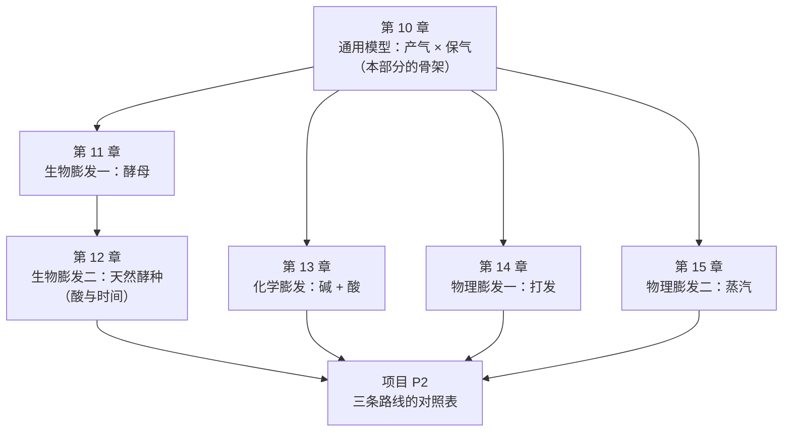

# 第二部分 · 膨发的三条路线

> **这一部分只回答一个问题**：**东西是怎么发起来的，以及为什么有时候发不起来。**
>
> 第一部分认完了七个角色，你已经能把一份配方翻译成
> [烘焙百分比](../../glossary.md#bakers-percentage)（本书统一约定：**以面粉总量为 100%**）
> 并说出每样原料在干什么。现在要把其中一个角色——**气**——单独拎出来讲透。

## 为什么"发起来"要单独学一遍

因为它是烘焙里**最容易归错因**的一件事。

一炉没发起来，大多数人的第一反应是"酵母不行 / 泡打粉过期 / 少放了膨松剂"——
也就是**默认问题出在产气上**。但文献里反复出现的却是另一幅图景：

> 一项用化学膨松系统（碳酸氢钠 + 葡萄糖酸-δ-内酯）替代酵母、
> 以便把"产气"和"面团性质"分开来看的研究得出的结论是：
> **面团能涨多大，既不受 CO₂ 的量限制，也不受它释放快慢的限制**；
> 受限的是**烘烤阶段还能不能继续充气**。
> 该研究还观察到：**初始 CO₂ 体积过高反而损害了炉内膨胀。**

所以这一部分的框架只有一句话：

> ## 膨发 = **产气** × **保气**，而**定型时刻**决定这场比赛什么时候结束。

三条路线（生物、化学、物理）的差别**全在"产气"这一半**：
气是微生物做的、是化学反应放的，还是你用打蛋器打进去的。
而"保气"这一半，三条路线面对的是**同一个问题**：

- 气泡壁能不能一直被撑着而不破；
- 气能不能不从面团表面跑掉、不溶回液相里去；
- 结构能不能在气跑光之前**定住**。

**这就是为什么本书把三条路线放在一起讲，而不是分成三章配方。**

## 这一部分的地图

图里有一条依赖值得说明：**第 12 章挂在第 11 章下面**，而不是和它并列。
因为酵种里主要**产气**的仍然是酵母——酵种额外买到的是**酸、菌群和时间**。
**先懂酵母，才谈得上懂酵种。**

## 各章一句话

| 章 | 它回答的问题 | 状态 |
|----|------------|------|
| [第 10 章 气从哪来、被什么关住](10-leavening-model.md) | 发不起来，该先怀疑产气还是保气？ | ✅ |
| [第 11 章 酵母怎么工作](11-yeast.md) | 温度、糖、盐、时间分别在动酵母的哪个旋钮？ | ✅ |
| [第 12 章 天然酵种](12-sourdough.md) | 养一罐酵种，到底买到了什么？ | ✅ |
| [第 13 章 化学膨发](13-chemical-leavening.md) | 碱和酸怎么配平？配错了留下什么？ | ✅ |
| 第 14 章 打发 | 空气是怎么被"打"进去的？泡沫能活多久？ | ⬜ |
| 第 15 章 蒸汽 | 水变成蒸汽要顶开什么才算数？ | ⬜ |
| 项目 P2 | 三条路线的对照表 | ⬜ |

## 学完这一部分，你应该能

1. 看到一份配方，说出它的气**分别在哪几个时刻**产生（往往不止一个来源）；
2. 面对"没发起来 / 塌了 / 组织粗大"，**先判断是产气不足还是保气失败**，再动手改；
3. 明白"发到两倍大"这类说法为什么不可移植，并用**你自己的记录**代替它；
4. 知道三条路线**为什么不能互换**——它们的时间尺度、风味贡献与残留物完全不同。

> **诚实说明**：这一部分会出现不少温度与比例。
> 请继续注意本书的纪律：**查不到可靠出处的数字不写**。
> 你会看到好几处写着"这一点在文献里仍不清楚"——
> 尤其是**气室壁到底怎么破的**、**蒸汽把层顶开的确切机制**，
> 综述作者自己都明说尚未定论。**本书照实写，不替学界下结论。**
