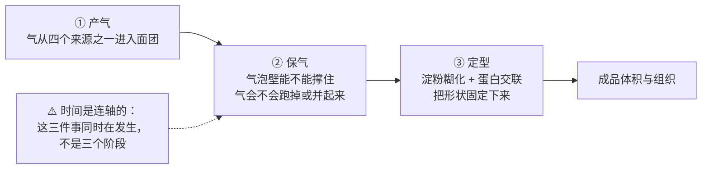
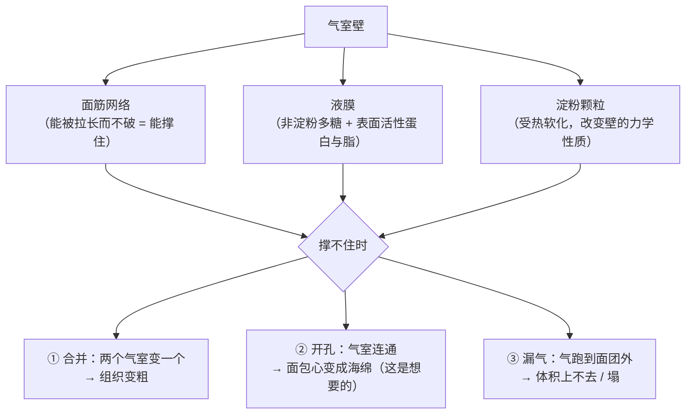
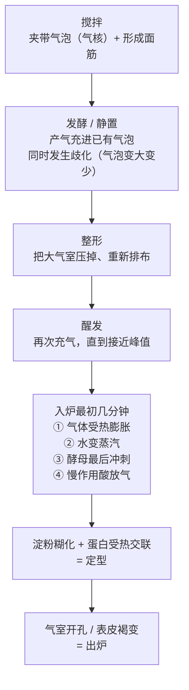
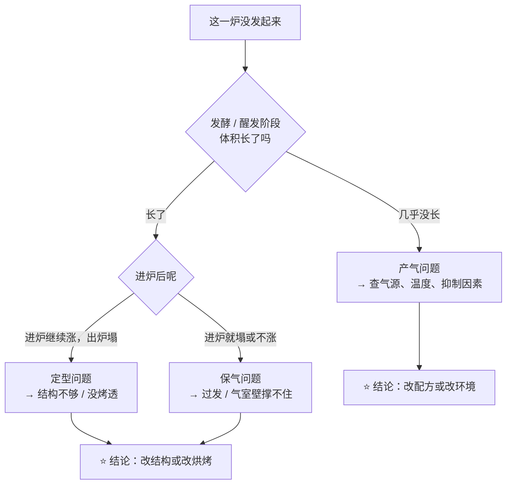

# 第 10 章 气从哪来、被什么关住：膨发的通用模型

> **本章目标**：给"发起来"这件事一个**能套到任何成品上的模型**，
> 并且让你以后遇到"没发起来"时，第一句话不再是"是不是酵母不行"，
> 而是：**"这一炉是产气不够，还是没保住？"**
>
> 第 8 章已经把**四个气源**认全了（生物、化学、打发、蒸汽）。
> 本章要做的是把它升级成一个**有先后、有窗口、有失败模式**的模型。

## 10.1 一句话模型：产气 × 保气，窗口由定型关闭

先把整章压成一张图：

**三条要点，后面各用一节展开：**

1. **气不是凭空出现的**：绝大多数气泡不是"长出来"的，而是**搅拌时被夹带进去**、
   之后被产气"吹大"的（10.2）；
2. **产气多不等于涨得大**：有研究把产气和面团性质分开来测，
   结论是**产气量与释放速度都不是瓶颈**（10.4）；
3. **定型是终点线**：结构一旦定住，再多的气也只能把它顶裂，不能把它顶大（10.5）。

> **为什么这个模型值得记住**：它**不分成品**。
> 吐司、戚风、泡芙、饼干、司康，产气那一半各不相同，
> **保气与定型这一半几乎是同一套问题**。

## 10.2 气泡是"夹带"进去的，不是"生"出来的

这是本章最反直觉、也最有用的一点。

一篇 2023 年的综述专门梳理了面团里气泡的**夹带与演化**：
面粉类型、水和盐的含量、以及**搅拌条件**如何决定气泡被卷进面团、如何演化、如何被稳定。
综述把气泡的行为拆成几个动作：**夹带（entrainment）、脱离、破碎、歧化、长大、合并**——
注意，**这里面没有"凭空产生"这一项**。

**有一个很干净的旁证**：一项用低强度超声研究面团的工作，
把面团分别在**常压**和**真空**下搅拌，真空的目的正是"**尽量减少气泡成核**"。
常压搅拌的面团随搅拌时间延长**卷进越来越多气泡**，超声速度因此显著下降
（不加起酥油的面团从 165 m/s 降到 105 m/s）。

> **可迁移的判断**：
> **搅拌不只是"把面筋搅出来"，它同时在决定你这份面团里有多少个气泡、多大。**
> 后面无论是酵母还是泡打粉产气，很大程度上是在给**这批已经存在的气泡**充气。

### 气泡自己也会变：歧化

即使**不加酵母**，面团里的气泡也不会原地不动。
一项用同步辐射 X 射线显微断层扫描观察**不加酵母**面团的研究发现：

| 观察时刻 | 气泡半径中位数 |
|---------|--------------|
| 搅拌结束后 36 分钟 | 22.1 ± 0.7 µm |
| 搅拌结束后 162 分钟 | 27.3 ± 0.7 µm |

气泡整体变大、数量变少，作者把它归因于**歧化**[^1]：
小气泡内压更高，气体**穿过面团基质扩散**到大气泡里去，于是**小的越来越小、大的越来越大**。

> **这解释了一个日常现象**：面团放着不动，组织也会**变粗**。
> **"静置"不是什么都没发生。**

### ⚠️ 但不要把它说成绝对

一项同时测量面团体积、压力与黏度的研究发现：
在**烘烤膨胀的最初阶段**，气室"合并速率"算出来是**负值**——
也就是**确实有新的气室成核**，使气室数量**增加了多达 8%**。

> **所以本书的写法是**：**绝大多数气泡来自搅拌的夹带**，
> 但"**气泡全部来自搅拌、烘烤中不会有新气泡**"是一句**过头的话**（见 10.7 辨析栏）。

## 10.3 保气：气是从哪里漏掉的

同一项研究还给出了"保气"这一半最直观的数字：

| 阶段 | 观察 |
|------|------|
| 膨胀最剧烈的时候 | 气室数量**每秒减少 2%~3%** |
| 面包心形成结束时 | 气室数量比初始**减少了 55%~67%** |

> **读一下这个数字**：**一半以上的气室在成品形成过程中消失了**——
> 它们不是"漏气了"，是**并到别的气室里去了**。
> 这就是"组织粗大"的直接来源：**不是气多了，是气室少了、大了。**

### 气室壁是谁在撑

一篇 2021 年关于气室稳定的综述把机制讲得很清楚：

> 小麦面团里的气室**先由搅拌形成的面筋网络稳定**；
> 而**从这个网络局部破裂的那一刻起**，气室转由**液膜**稳定——
> 液膜里含有**非淀粉多糖**以及有表面活性的**蛋白质与脂质**。

另一篇 2021 年的综述专门讨论"**气室什么时候开孔**"（也就是面包心从一堆闭孔变成连通的海绵），
并列出四种最可能的情形——**其中三种都涉及"面筋能不能被拉开而不破"**，
第四种涉及淀粉颗粒在烘烤早期软化但不熔并。综述同时诚实地指出：
**淀粉在气室稳定 / 失稳中的作用，此前很少被考虑。**

> ⚠️ **诚实说明**：这三种结局的界线在文献里**并不清楚**。
> 上面那篇综述的写法是"**四种最可能的情形**"，而不是"机制如下"。
> 本书因此只给**方向与判据**，不给"多少温度时会开孔"这类数字。

### 面团"能不能撑"是可以测的

一项关于面团流变与烘焙表现关系的研究给出两条很有用的对应：

| 流变指标 | 和成品的关系 |
|---------|------------|
| **双轴拉伸黏度** | 与面包**比容呈反向关系**（越黏稠、越难吹大） |
| **应变硬化指数**[^2] | 与**面包心的细腻程度**相关 |

> **可迁移的判断**：**"面团强不强"和"能不能保气"不是一回事。**
> 太黏稠 → 吹不大；**被拉长时会自己变硬**（应变硬化）→ 气室壁不容易在某一点被拉穿，
> 于是组织更细。这正是第 16 章要讲的面筋网络。

## 10.4 产气多 ≠ 涨得大：三组独立证据

这是本章最值得贴在烤箱门上的一节。

### 证据一：把产气和面团分开测，产气不是瓶颈

一项研究用**化学膨松系统**（碳酸氢钠 + 葡萄糖酸-δ-内酯）代替酵母，
目的是绕开酵母代谢、单独考察某一种酵母代谢物（谷胱甘肽）的作用。它的结论是：

> **面团的膨胀既不受 CO₂ 的量限制，也不受其释放动力学限制；
> 受限的是烘烤过程中还能不能继续充气。
> 而且，初始 CO₂ 体积过高会损害炉内膨胀。**

### 证据二：发过头，成品反而更差

一项关于醒发程度的研究把面团醒到四个不同程度（用比容表示，1.1 / 1.3 / 1.5 / 1.7 mL/g）：

| 醒发程度 | 成品表现 |
|---------|---------|
| 1.1 → 1.3 mL/g | 成品比容**上升**，1.3 处最大 |
| 1.5 / 1.7 mL/g | 比容**急剧下降**，质地更硬，并出现**皮与芯分离** |

⚠️ 这是一项针对**冷冻面团馒头**的研究，**那几个数字不是"所有面团的醒发终点"**。
本书只引用它的方向：**醒发有一个峰值，越过之后是断崖，不是平台。**

### 证据三：加盐让产气变少，却让保气变好

第 7 章引过的那项 176 份样本的研究，用发酵流变仪同时记录了两个量：

| 盐（该研究的三档设计） | 总产气量 | 跑掉的 CO₂ | 保气系数[^3] |
|---------------------|---------|-----------|------------|
| 0 | 1518 mL | 275 mL | 81.9% |
| 1.5% | 1487 mL | 218 mL | 85.4% |
| 3.0% | 1272 mL | 130 mL | 89.8% |

> **这张表是本章模型最硬的实物证据**：
> **产气与保气可以朝相反方向走。**
> 只看"发得快不快"，你会得出"不放盐更好"的结论；
> 看保气系数，结论正好相反。

### 证据四：把产气量对齐，结果仍然不同

第 8 章引过的那项酵母菌株研究做得更狠：把五株酵母的发酵终点
**统一到产气 400 mL**，也就是**把产气这一半彻底对齐**——
结果**炉内膨胀仍然因菌株而异**，涨得多的那些**气室数量更多**。

> **四组证据指向同一句话**：
> ## **产气是入场券，保气才是比赛。**

## 10.5 时间轴：进炉前和进炉后，气在做完全不同的事

**进炉之后的这几分钟，是全书最"贵"的几分钟**，因为有几件事同时在发生。
已核到的观测有这些：

| 观测 | 数据 |
|------|------|
| 炉内膨胀的幅度 | 一项带仪表的中试烤炉研究测到法棍**最大膨胀约 1.7 倍**，出现在**面包芯温度接近 90 °C** 时，对应内部压力约 90 kPa |
| 面包芯温度的上限 | 引入蒸发—冷凝机制的模拟显示**芯温不会越过 100 °C**，约 25 分钟后稳定在 98 °C 左右 |
| 面筋蛋白什么时候交联 | 一项动力学研究在 80 °C、90 °C、95 °C 保温下观察到醇溶蛋白溶解度按一级动力学下降，**速率随温度升高**（活化能 110 与 147 kJ/mol） |
| 酵母在炉子里还在干活 | 一项研究比较 15 株高抗逆酵母与普通面包酵母：烘烤中**面团高度增加 18.6%~31.5%**，且增幅与**细胞存活率强正相关**；最好的菌株在**面团温度 77 °C** 时仍有 **42.2%** 的细胞存活，普通面包酵母只有 **11.8%** |

> **最后一行值得多看两眼**：**酵母不是"一进炉就死"**，
> 它在面团升温的过程中**还在产气**，而**它能撑多久，直接关系到炉内膨胀有多大**。
> ⚠️ 这是**一项研究**的结果，用的是工业菌株与电阻加热烤炉，
> **本书不把 77 °C 当成"酵母的死亡温度"**——它是那项实验里的一个取样点。

## 10.6 一条可迁移的判断规则

> ## 发不起来时，先分清 **"没产够"** 和 **"没保住"**——它们的现场证据不同。

| 你看到的现象 | 更像哪一半出了问题 | 下一步验证什么 |
|------------|-----------------|--------------|
| 发酵阶段面团几乎不长 | **产气** | 酵母是否有活性（温水起泡）、温度、糖是否被别的东西占住、盐是否过量 |
| 发酵阶段长得很好，**一进炉就塌** | **保气 / 定型** | 是不是醒过头了（越过峰值）、面筋是否被拉过、整形是否留下大气室 |
| 组织**粗大、孔洞不均** | **保气**（合并占了上风） | 整形是否排气不足、静置是否过久（歧化）、膨松剂用量是否偏低 |
| 涨得高但**出炉回缩** | **定型** | 是否烤够（芯温 / 状态判据）、结构原料是否太少（第三部分） |
| 表面裂开、内部有大洞 | **气跑得比结构定得快** | 炉温是否过高、表皮是否过早定住（第 30 章） |
| 明明放了双倍膨松剂，还是不大 | **保气**，而且可能是**过量造成的** | 减回去做对照；膨松剂用量存在峰值（第 8、13 章） |

## 10.7 常见说法辨析

按本书约定标注**证据强度**：✅ 有共识 / ⚠️ 有争议 / ❌ 明确错误 / 缺乏证据。
来源见[出处登记](../../standards.md)。

| 说法 | 判定 | 说明 |
|------|------|------|
| "**膨松剂 / 酵母会在面团里产生气泡**" | ⚠️ **说法不准确** | 更准确的说法是：它们**产生气体**，而气体**主要是进入搅拌时已经夹带进去的气泡**。一篇 2023 年综述把面团气泡的行为拆成夹带、脱离、破碎、歧化、长大、合并——**没有"凭空产生"这一项**；超声研究也显示真空搅拌正是用来"**尽量减少气泡成核**"的。所以"搅拌决定了你有多少气泡" |
| "**气泡全部来自搅拌，烤的时候不会有新的**" | ⚠️ **过头了** | 一项同时测体积、压力与黏度的研究发现，**烘烤膨胀初期气室数量还增加了多达 8%**，说明**确实有新气室成核**。方向可以记，绝对化不行 |
| "**发得越久越大**" | ❌ **有峰值** | 一项醒发程度研究显示：比容在中间某一点最大，**越过之后急剧下降**，还出现质地变硬与皮芯分离。另一项用化学膨松系统的研究更直接：**初始 CO₂ 体积过高会损害炉内膨胀** |
| "**发不起来就是酵母 / 泡打粉不行**" | ⚠️ **只覆盖一半** | 用化学膨松系统做的研究结论是：**面团膨胀既不受 CO₂ 的量限制，也不受释放动力学限制**。先按 10.6 的表分清"没产够"还是"没保住" |
| "**面团静置不动，什么都不会变**" | ❌ **会变** | 同步辐射观察到**不加酵母**的面团里，气泡半径中位数在两个多小时里从 22.1 µm 长到 27.3 µm——**歧化**让气泡变大变少。静置本身就在改变组织 |
| "**组织粗大是因为气太多**" | ⚠️ **更可能是气室太少**| 一项研究实测到：面包心形成结束时**气室数量比初始减少 55%~67%**，最剧烈膨胀期每秒减少 2%~3%。粗大来自**合并**，不是来自"产气多" |
| "**保气靠的是面筋，所以无麸质就没法保气**" | ⚠️ **不完整** | 综述指出：气室**先由面筋网络稳定**，网络局部破裂后由**液膜**（非淀粉多糖 + 表面活性蛋白与脂）继续稳定；对非小麦体系，液膜的作用**可能更重要**。所以无麸质要解决的是"**谁来当气室壁**"（第 43 章） |
| "**面团越强越能保气**" | ⚠️ **不是线性的** | 一项流变研究发现**双轴拉伸黏度与比容呈反向关系**（太黏稠反而吹不大），而与**面包心细腻度**相关的是**应变硬化指数**。"强"要分清是"硬"还是"能被拉长而不破" |
| "**酵母一进烤箱就死了，所以炉内膨胀全靠气体受热膨胀**" | ⚠️ **至少不全对** | 一项研究把 15 株高抗逆酵母和普通面包酵母比较：**烘烤中面团高度增加 18.6%~31.5%**，且**与细胞存活率强正相关**；最好的菌株在面团 77 °C 时仍有 42.2% 存活。⚠️ 这是单项研究、工业菌株，**不能当成家用酵母的通用参数** |

## 10.8 🔎 下次烤之前的用处

1. **搅拌完就先看一眼面团**：它此刻含有的气泡数量与大小，基本决定了成品组织的上限。
   同一份配方，**搅拌方式变了，组织一定会变**（第 22 章）。
2. **"发到两倍大"不是一条可移植的指令**。峰值随配方、温度、面粉而变——
   用[烘焙记录表](../../forms/bake-log.md)记下**你这次发了多久、长到多高、结果如何**，
   三次之后你会有自己的峰值。
3. **进炉前最后一次判断，要问的是"它还能不能再涨"**，而不是"它有没有长到两倍"。
   越过峰值的面团，**炉子里已经没有余量了**。
4. **组织粗大先怀疑整形与静置，不要先加膨松剂**：粗大是气室**合并**的结果，
   加更多气只会让合并更快。
5. **出炉才塌，多半是没定住，不是没发起来**——去查是不是烤够了（第 32 章），
   而不是去加膨松剂。
6. **记录"什么时候塌的"比记录"塌了"有用十倍**：进炉前塌、进炉中塌、出炉后塌，
   分别指向 10.6 表里完全不同的三行。

## 10.9 思考题

1. 用你自己的话写出本章的模型（三个环节），并说明为什么"定型"要算作模型的一部分，
   而不是烘烤的一个附带结果。
2. 为什么说"膨松剂产生气泡"这句话不准确？请引用两项不同类型的证据支持你的说法，
   并说明这条结论如何改变你对"搅拌"这一步的看法。
3. 一项研究实测到面包心形成结束时气室数量比初始**减少 55%~67%**。
   这个数字为什么说明"组织粗大"通常不是"气太多"？
4. **【案例】** 某人做吐司：配方为面粉 100%、水 65%、糖 8%、盐 1.8%、
   速发干酵母 1%、黄油 6%（**以面粉总量为 100%**）。
   他嫌第一次发得慢，第二次把发酵时间从 60 分钟延长到 150 分钟，
   面团长到了原来的三倍多，结果**进炉后几乎没有再涨，出炉侧面塌陷、组织粗大、有酒味**。
   （a）按 10.6 的表判断，问题在产气还是保气？依据是什么？
   （b）本章哪一项研究可以直接解释"进炉后几乎没再涨"？
   （c）他应该改哪一个变量？为什么"减少酵母用量"和"缩短发酵时间"不是同一种改法？
5. **【案例】** 两个人用同一份配方、同一台烤箱做欧包。A 的成品孔洞大而不均匀、
   底部有一条空腔；B 的成品孔洞细密均匀。两人的差别只有一处：
   A 整形时"尽量不排气，怕把气赶跑了"。请解释 A 的操作为什么反而带来粗大孔洞，
   并说明"排气"在本章模型里到底改了什么。
6. **【辨析】** "面团越强越能保气"——判断证据强度，
   说明"强"这个字掩盖了哪两个不同的性质，并各给一个可观察的判据。
7. **【辨析】** "气泡全部来自搅拌"——本章既用它来解释现象，又说它"过头了"。
   请说明这两者如何并存，并指出本书为什么坚持这样写。
8. 盐的那张表里，产气量与保气系数朝相反方向走。
   请用这张表说明"发得快"和"发得好"为什么不是一回事，
   并举出另一个本章之外、你自己想到的"两个指标反向"的例子。

> 📖 **参考答案**（想清楚再看）：[Q1](../../qa/10-leavening-model-qa.md#q1) ·
> [Q2](../../qa/10-leavening-model-qa.md#q2) · [Q3](../../qa/10-leavening-model-qa.md#q3) ·
> [Q4](../../qa/10-leavening-model-qa.md#q4) · [Q5](../../qa/10-leavening-model-qa.md#q5) ·
> [Q6](../../qa/10-leavening-model-qa.md#q6) · [Q7](../../qa/10-leavening-model-qa.md#q7) ·
> [Q8](../../qa/10-leavening-model-qa.md#q8)

## 10.10 本章实操

### 🅐 零成本版 · 任务一：给三份配方画"气的时间轴"

不用烤箱。找三份**膨发方式不同**的配方（例如：一份吐司 / 一份马芬 / 一份泡芙），
把它们的气按"什么时候产生"排到同一条时间轴上。

| | 配方 A | 配方 B | 配方 C |
|---|-------|-------|-------|
| 品类 | | | |
| **以面粉总量为 100%**，膨松剂百分比 | % | % | % |
| 搅拌方式（会夹带多少气？）| | | |
| 进炉**前**产气的来源 | | | |
| 进炉**后**产气的来源 | | | |
| 配方里谁负责"保气"（面筋？蛋白霜？黏稠的面糊？） | | | |
| 配方里有没有"**别过度搅拌**"或"**立刻入炉**"这类话？它在保护哪一半？ | | | |
| 如果这份配方失败，你会先查产气还是保气？ | | | |

> **做完回答一个问题**：三份配方里，哪一份**最依赖蒸汽**？你从配方的哪一行看出来的？

### 🅐 零成本版 · 任务二：静置观察（只用一小团面）

**需要**：面粉、水、一个透明杯或密封袋、手机（拍照）。**不放酵母、不放膨松剂。**

把面粉和水按你习惯的比例揉成一小团（**以面粉总量为 100%**，记下你的加水百分比），
放进透明容器，**每 30 分钟拍一张贴着容器壁的照片**，连续 3 小时。

| 时间 | 贴壁能看到的气泡（多 / 少、大 / 小） | 面团摸起来（紧 / 松） |
|------|--------------------------------|------------------|
| 0 分钟 | | |
| 30 分钟 | | |
| 60 分钟 | | |
| 120 分钟 | | |
| 180 分钟 | | |

回答：

| 问题 | 你的答案 |
|------|---------|
| 完全没有产气来源，气泡的**大小**有没有变化？ | |
| 这和本章讲的**歧化**一致吗？ | |
| 这个观察有什么局限？（提示：你只能看到贴壁的那些） | |

> ⚠️ **这个任务只能定性**：同步辐射研究测的是 22.1 µm 到 27.3 µm 这个量级，
> **肉眼看不到**。你能看到的是更大的那些气泡的变化。**别把看不到当成没发生。**

### 🅑 开火版 · 任务三：醒发峰值对照（有烤箱时做）

**唯一变量**：醒发时间。其余（配方、揉面、整形、每份重量、炉温）**全部一致**。

**需要**：一份你做过的酵母面团配方、厨房秤、尺子或量高的纸条、计时器。

| 组 | 醒发时间 | 入炉前高度 | 出炉高度 | 炉内涨了多少 | 组织（细 / 粗） | 侧面有没有塌 |
|----|---------|----------|---------|------------|--------------|------------|
| ① 短（比你平时少约三分之一） | | mm | mm | mm | | |
| ② 你平时的时间 | | mm | mm | mm | | |
| ③ 长（比你平时多约一半） | | mm | mm | mm | | |

做完回答：

| 问题 | 你的答案 |
|------|---------|
| **入炉前最高**的是哪一组？**出炉最高**的是哪一组？两者是同一组吗？ | |
| 哪一组的"**炉内涨幅**"最大？这一列说明了什么？ | |
| 有没有出现"发得最久的反而最矮"？如果有，它对应本章哪一项研究？ | |
| 下次你会把醒发终点定在哪里？用什么**现象**判断（不要用时间）？ | |

> **这个实验的价值全在"炉内涨了多少"这一列**——
> 它把"产气"（入炉前高度）和"还剩多少余量"（炉内涨幅）分开了。
> 把结果记进[烘焙记录与复盘表](../../forms/bake-log.md)。

### 🅑 开火版 · 任务四（加分）：整形排气对照

同一份面团分两份，**只改整形**：

| 组 | 整形方式 | 孔洞大小 | 孔洞是否均匀 | 有没有大空腔 |
|----|---------|---------|------------|------------|
| ① 轻手，尽量不排气 | | | | |
| ② 正常排气后重新整形 | | | | |

> **预测再验证**：动手之前先写下你的预测，再对照结果。
> 如果结果和你预测的相反，**先别改结论，先想想还有什么变量没控制住**。
>
> ⚠️ **安全提醒**：不要尝生面团（美国 FDA：生面粉不是即食食品）。
> 各国口径可能不同，以自己所在地现行发布为准。

## 10.11 本章依据

本章引用的来源与核对状态详见[参考书目与出处登记](../../standards.md)，具体对应如下：

| 本章用到的内容 | 依据 |
|--------------|------|
| 面团气泡的**夹带与演化**（夹带、脱离、破碎、歧化、长大、合并）；面粉、水、盐与**搅拌条件**决定气泡的卷入与稳定 | *Cereal Chemistry* 2023 面团气泡夹带与演化综述，✅ 摘要层面 |
| 常压搅拌随时间**卷进越来越多气泡**（超声速度从 165 m/s 降到 105 m/s）；**真空搅拌用于尽量减少气泡成核** | *Journal of Food Science* 2009 超声研究起酥油与搅拌时间对面团力学性质影响，✅ 摘要层面 |
| **不加酵母**的面团中气泡半径中位数从 22.1 ± 0.7 µm（36 分钟）增至 27.3 ± 0.7 µm（162 分钟），归因于**歧化** | *Food Research International* 2016 同步辐射 X 射线显微断层扫描研究，✅ 摘要层面 |
| 烘烤膨胀**初期有新气室成核**（气室数量增加多达 8%）；最剧烈膨胀期气室数量**每秒减少 2%~3%**；面包心形成结束时气室数量比初始**减少 55%~67%** | *Food Research International* 2018 面团烘烤膨胀中气室合并动力学研究，✅ 摘要层面 |
| 气室**先由面筋网络稳定**，网络局部破裂后由含**非淀粉多糖与表面活性蛋白、脂质的液膜**稳定；非小麦体系中液膜可能更重要 | *Comprehensive Reviews in Food Science and Food Safety* 2021 水相成分稳定气室综述，✅ 摘要层面 |
| **气室开孔**的四种可能情形；淀粉在气室稳定 / 失稳中的作用此前很少被考虑；机制尚不清楚 | *Trends in Food Science & Technology* 2021 烘烤中面团气室开孔综述，✅ 摘要层面 |
| **双轴拉伸黏度与比容呈反向关系**；**应变硬化指数**与面包心细腻度相关 | *Journal of Cereal Science* 2005 面团剪切与拉伸性质研究，✅ 摘要层面 |
| **面团膨胀既不受 CO₂ 量限制，也不受其释放动力学限制**；受限的是烘烤中能否继续充气；**初始 CO₂ 体积过高损害炉内膨胀** | *Innovative Food Science and Emerging Technologies* 2016 小麦面团失稳：CO₂ 与谷胱甘肽的相互关系，✅ 摘要层面。**本章模型的核心依据** |
| 醒发程度 1.1 / 1.3 / 1.5 / 1.7 mL/g：比容在 1.3 处最大，1.5 与 1.7 **急剧下降**并伴随变硬与皮芯分离 | *Foods* 2024 羧甲基纤维素钠对冷冻面团馒头醒发耐受性的影响（开放获取），✅。⚠️ **特定产品的实验设计，不是通用醒发终点** |
| 加盐三档下**总产气量下降而保气系数上升**（81.9% → 85.4% → 89.8%） | *Foods* 2020 氯化钠对软质小麦面团工艺品质的综合研究（开放获取），✅ 全文已核 |
| 把五株酵母**产气终点统一到 400 mL** 后炉内膨胀仍不同，涨得多者气室更多 | *Food Chemistry: X* 2026 不同炉内膨胀表现的酵母菌株研究，✅ 摘要层面 |
| 法棍**最大膨胀约 1.7 倍**，出现在**芯温接近 90 °C** 时，内部压力约 90 kPa | *Journal of Food Engineering* 2005 带仪表中试烤炉的法棍烘烤研究，✅ 摘要层面 |
| 模拟显示面包**芯温不越过 100 °C**，约 25 分钟后稳定在 98 °C 左右 | *Food Research International* 2011 面包烘烤 CFD 模拟研究，✅ 摘要层面 |
| 面筋蛋白在 80~95 °C 通过**巯基—二硫键交换**聚合，速率随温度升高 | *Journal of Agricultural and Food Chemistry* 2008 醇溶蛋白—麦谷蛋白受热交联动力学研究，✅ 摘要层面 |
| 烘烤中**面团高度增加 18.6%~31.5%**，与**细胞存活率强正相关**；最佳菌株在面团 **77 °C** 时存活 **42.2%**，参照的面包酵母为 **11.8%** | *Food Chemistry* 2025 工业酵母菌株在面团基质中的耐热性决定其对炉内膨胀的影响，✅ 摘要层面。⚠️ **单项研究、工业菌株与电阻加热烤炉，不可外推为"酵母的死亡温度"** |
| 生面团与生面粉的安全 | 美国 FDA「Handling Flour Safely: What You Need to Know」，✅ 已核到官方页面。⚠️ 各国口径不同 |
| **"发到两倍大"这类终点的通用数值** | ⚠️ **不给**：文献里的醒发终点都是**特定产品在特定条件下的实验设计**。本章改为给"峰值存在 + 越过是断崖"的方向与自测方法 |
| **气室"什么时候开孔"的温度或时刻** | ⚠️ **未核到**：综述明说机制尚不清楚，本章只给方向与判据 |

[^1]: [歧化](../../glossary.md#disproportionation)（disproportionation）。本章新出现的术语还有
[产气与保气](../../glossary.md#gas-production-retention)（gas production / gas retention）、
[气室与气室壁](../../glossary.md#gas-cell)（gas cell / gas cell wall）、
[气泡夹带](../../glossary.md#entrainment)（entrainment）、
[气室合并](../../glossary.md#coalescence)（coalescence）、
[面团液](../../glossary.md#dough-liquor)（dough liquor）、
[比容](../../glossary.md#specific-volume)（specific volume）、
[醒发与过度醒发](../../glossary.md#proofing)（proofing / over-proofing）。

[^2]: [应变硬化](../../glossary.md#strain-hardening)（strain hardening）。

[^3]: [保气系数](../../glossary.md#co2-retention)（CO₂ retention coefficient），第 7 章已出现。

---

**下一章**：第 11 章 生物膨发一——酵母怎么工作。
本章的模型说"产气是入场券"，下一章就去看**这张入场券是怎么被印出来的**：
酵母吃什么、什么时候吃完、谁在拖它的后腿。
