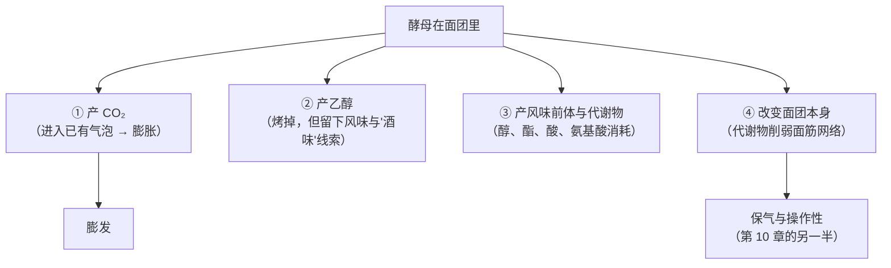
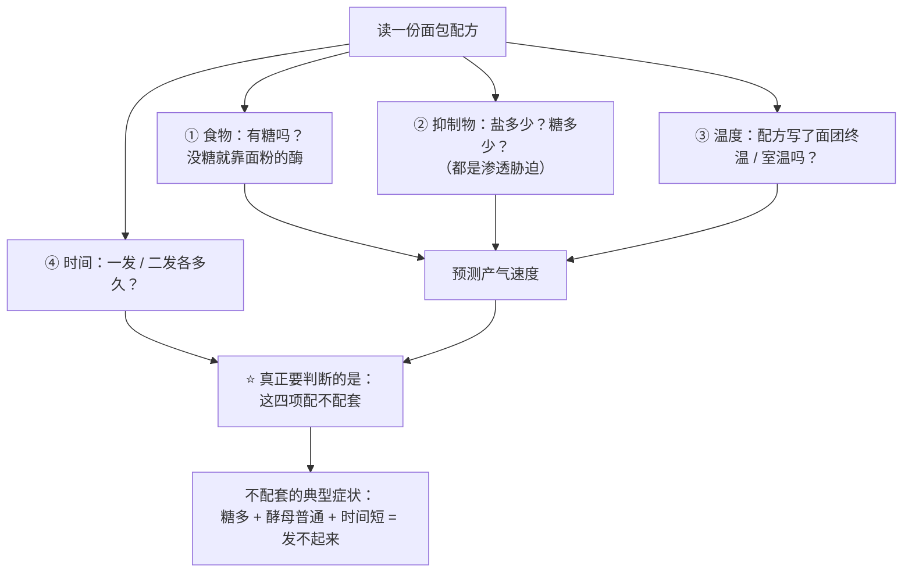

# 第 11 章 生物膨发一：酵母怎么工作（糖、温度、时间、盐）

> **本章目标**：把"酵母"从一包粉末变成一组**你能动的旋钮**。
> 学完之后，你看一份面包配方，应该能说出：
> **它给酵母准备了什么食物、设了什么障碍、留了多少时间、以及这三者是否配套。**
>
> 上一章的模型说"产气是入场券"。本章讲的就是**这张入场券是怎么印出来的**——
> 以及为什么它**印得快不等于印得好**。

## 11.1 酵母在面团里到底做了几件事

它做的**不止产气**。一项关于酵母发酵对起酥类点心影响的研究，
把一份含 **8% 酵母、14% 蔗糖**（**该研究写明：以小麦粉干物质为基准**）的面团
和不加酵母的对照放在一起测，结论里有三条对本书特别有用：

| 观察 | 意味着什么 |
|------|----------|
| **蔗糖在搅拌之后几乎已被转化酶[^1]全部分解**；果聚糖也被分解，但慢得多 | 酵母不是"慢慢开始工作"的，**它在你还在揉面的时候就已经开工了** |
| 释放出的葡萄糖**至少有 23.6 ± 2.6% 在发酵期间被消耗掉** | 糖不只是甜味——**它有一部分被吃掉了**（第 4 章讲的"喂酵母"） |
| **发酵产生的 CO₂ 对成品高度的贡献，大于烘烤时水与乙醇蒸发的贡献**；酵母代谢物**削弱了面筋网络**，面团强度与延展性下降 | 酵母**同时在产气和拆结构**——它站在"争面筋"这组竞争关系的对立面 |

> **可迁移的判断**：**"发酵时间"从来不是一个中性的等待。**
> 等的时间越长，产气越多——同时**面团也被改得越多**。
> 这是第 10 章那句"发得久不等于发得好"的分子机制层面的解释之一。

## 11.2 它吃什么：糖不是唯一的食物，也不是随便什么糖都行

**三条已核到的事实**：

### ① 配方里的蔗糖会被迅速拆开

上面那项研究写得很直接：**蔗糖在搅拌后几乎已被转化酶完全水解**。
所以"加糖喂酵母"实际上是"加糖 → 被拆成葡萄糖和果糖 → 被吃掉一部分"。

### ② 不加糖的面团照样能发——因为面粉自己会产糖

一份法棍配方里没有糖，酵母吃什么？吃的是**面粉自带的酶把淀粉切出来的糖**。
这一点有一个很硬的旁证：**法规本身**。
美国 21 CFR 137.105 允许在面粉里添加麦芽小麦粉、麦芽大麦粉或真菌来源的 α-淀粉酶，
理由原文写的是"**为补偿酶的天然不足**"。

> **也就是说：面粉里的酶活是一个被行业当作变量来管理的东西**（第 2 章讲过落降数值）。
> 酶活低 → 后段糖供应不足 → **产气乏力、上色不足**；酶活过高 → 淀粉被切太多 → 面包心发黏。
> ⚠️ 各国口径不同，以当地现行发布为准。

### ③ "糖"必须是酵母吃得了的糖

第 8 章引过的反例在这里仍然成立：
一项研究把**不能被面包酵母代谢**的稀有糖加进配方，结果 **CO₂ 产生减少、
一次发酵膨胀率低于对照与加蔗糖组**，成品更硬、更黏。

> **可迁移的判断**：读配方时，"甜味剂"这一行要拆成两个问题：
> **它甜不甜？它能不能被吃？** 减糖配方、代糖配方在膨发上常常出问题，原因就在第二问。

## 11.3 谁在拖它的后腿：糖、盐、温度，三个旋钮

### ① 糖既是食物又是压力

第 4 章讲过：一项酵母全基因组筛选发现，对高浓度蔗糖敏感的突变体
**绝大多数同时对高浓度氯化钠或山梨醇敏感**——说明高糖对酵母主要是**渗透胁迫**[^2]。

有一个很漂亮的工程学佐证：一项研究反过来**降低**酵母自身转化酶的活性，
让蔗糖**别被一下子全拆成葡萄糖**（葡萄糖浓度高才是渗透压力的直接来源），
结果高蔗糖条件下的**面团发酵能力提高了 52%**。

> **这条证据很值得体会**：**同样的糖，拆得快还是慢，结果完全不同。**
> 这也是"耐高糖酵母"存在的原因（第 4、8 章）。
> ⚠️ 本书**没有核到**"糖超过多少百分比就必须换酵母"的阈值，因此**不给阈值**。

### ② 盐：产气变少，保气变好

第 7、10 章那张表在这里再用一次（该研究的三档盐是实验设计，不是推荐值）：
**盐从 0 加到 3.0%，总产气量从 1518 mL 降到 1272 mL，
但保气系数从 81.9% 升到 89.8%。**

一项关于面包中丙烯酰胺的研究提供了**独立旁证**：NaCl 低于 2% 时抑制酶活、降低丙烯酰胺，
**加得更多反而升高，原因是酵母生长被抑制**。

> **所以"盐会拖慢酵母"是有共识的**——但"**因此少放盐**"不是它的推论，
> 因为你同时会失去保气能力与风味（第 7 章）。

### ③ 温度：它同时改产气速度和气体的去向

一项用动态面团密度法测量醒发的研究，把面团在 **30 / 35 / 40 / 45 / 50 °C** 五个温度下醒发，
得到一条很有信息量的结论：

> **温度越高，面团"开始失气"的时刻越早**——
> 研究者给的解释是两条并行的原因：**酵母活性上升**，
> 以及**二氧化碳在面团中的溶解度下降**。

同一项研究还有两条附带发现：

| 发现 | 对家庭烘焙的意义 |
|------|---------------|
| 面团**最终的充气能力受搅拌压力与温度影响** | 又一次印证第 10 章：**搅拌决定了气泡的底子** |
| 油脂含量不影响"失气时刻"与最终膨胀能力，但**改变失气的方式**：有油脂时气体**平缓地漏**，没有油脂时**突然失气** | 油脂在这里不是"发得更大"，而是**让失败来得不那么突然**（第 5 章的"反结构"角色有了新的一面） |

> ⚠️ **注意**：这项研究的温度范围（30~50 °C）是**实验设计**。
> 本书**不把其中任何一个温度写成"最佳发酵温度"**——
> 那需要针对特定配方与成品的证据，本书没有核到。

## 11.4 时间与温度可以互换吗：发到"等高"，不等于同一个面包

这是本章最值得记住的实验。

一项研究把两个变量交叉：**酵母用量 20 / 40 / 60 g per kg 面粉**
（也就是**以面粉总量为 100% 时的 2% / 4% / 6%**）
× **发酵温度 5 / 15 / 35 °C**。关键的实验设计是：

> **所有面团都发酵到同样的高度**才烘烤——也就是**把"发起来"这件事对齐**。

结果：

| 变量 | 对成品香气的影响 |
|------|---------------|
| **酵母用量提高** | 与酵母代谢直接相关的化合物**普遍增加**（2,3-丁二酮与苯乙醛的气味活性最高） |
| **较高的发酵温度（15 与 35 °C）** | 促进了**脂质氧化**类化合物（己醛、庚醛的气味活性值最高） |
| **低温发酵（5 °C）** | 促进了三种**酯类**（乙酸乙酯、己酸乙酯、辛酸乙酯）的生成 |

> ## **发到一样高，闻起来是不一样的。**
>
> 这条结论把"发酵"从"等它变大"彻底改写成"**一段可以被设计的化学过程**"。
> 第 24 章（发酵与冷藏）会专门讲怎么用它。

一篇关于面包心香气的综述给了背景：面包心里已鉴定出**超过 150 种挥发性化合物**，
其中约 **45 种**可以被认为是有意义的**香气化合物**；
它们主要来自**酵母的发酵活动**与**面粉脂质的氧化**，来自美拉德反应的较少。
综述同时明确写道：**酵母用量与菌株、发酵温度与时间，都显著影响面包心的香气。**

## 11.5 你买的那包酵母：三种形态，不是同一种东西

| 形态 | 它是什么 | 已核到的要点 |
|------|---------|------------|
| **鲜酵母 / 压榨酵母** | 含水的活细胞块 | 一项代谢组学研究发现鲜酵母积累了**保护性氨基酸**（γ-氨基丁酸、半胱氨酸、苏氨酸），活性干酵母则明显更低，反映**干燥胁迫下的适应性调节** |
| **活性干酵母** | 干燥保存的细胞，使用前通常需要复水 | 一篇梳理了 **280 件专利与 212 篇应用论文**（1796~2018 年）的综述指出：**自 1990 年代以来，发明人与科学家主要针对的都是"复水过程中保护酵母细胞"这一最关键的环节** |
| **即发干酵母** | 颗粒更细、可直接拌入干料的干酵母 | 同上；本书**未核到**家用条件下"必须用多少 °C 的水复水"的一手数据 |

**还有两条更要紧的事实**：

1. 同一项代谢组学研究用 ITS 测序确认：**即使是同一家厂商的不同产品，
   也是遗传上不同的菌株**；其中一个产品特有的 **α-葡萄糖苷酶活性**对应着**更强的麦芽糖利用能力**。
2. 一项关于**耐热性**的研究（第 10 章引过）显示：不同菌株在烘烤中能撑多久差别很大——
   最好的菌株在**面团温度 77 °C** 时仍有 **42.2%** 细胞存活，参照的面包酵母只有 **11.8%**，
   而这一差异与**炉内高度增幅（18.6%~31.5%）强正相关**。

> **可迁移的判断**：**"酵母"是一个类别，不是一个零件。**
> 换一个牌子、换一种形态，你换掉的可能是**麦芽糖利用能力、耐糖能力、耐热能力和香气谱**。
> 所以**换了酵母就要重新记录一次**，别指望参数照搬。
>
> ⚠️ 本书**不给**"哪个牌子更好"的结论——没有可比较的公开实验。

## 11.6 一条可迁移的判断规则

> ## 酵母的产气速度不是你选的，是**温度 × 食物 × 抑制物**共同决定的；
> ## 你能选的只有**什么时候停**。

| 你想改什么 | 动哪个旋钮 | 代价 |
|----------|----------|------|
| 想**快一点** | 提高面团温度、增加酵母量、保证有可用的糖 | 风味变化（脂质氧化类增加）；温度高时**失气来得更早** |
| 想**慢一点、香一点** | 降低温度、减少酵母量、延长时间 | 占用时间；低温会促进酯类生成，风味走向不同 |
| 想让**甜面团发起来** | 用耐高糖酵母、增加用量、给更多时间 | 三条都要付出代价；⚠️ 本书不给糖量阈值 |
| 想**少放盐发得快** | ——**不建议当作目标** | 产气是快了，**保气会变差**，风味与操作性一起变（第 7 章） |

## 11.7 常见说法辨析

按本书约定标注**证据强度**：✅ 有共识 / ⚠️ 有争议 / ❌ 明确错误 / 缺乏证据。
来源见[出处登记](../../standards.md)。

| 说法 | 判定 | 说明 |
|------|------|------|
| "**酵母要先用温水加糖'激活'，不然不管用**" | ⚠️ **部分成立，但被说死了** | 有依据的部分：一篇梳理 280 件专利的综述指出，**复水是干酵母存活最关键的环节**，近三十年的发明重点正是保护复水中的细胞。没有依据的部分：**"必须加糖""必须多少 °C"本书没有核到一手数据**，因此不给数字。即发干酵母的产品设计本就是直接拌入干料——**按你手上那包的说明做，并把它记下来** |
| "**糖越多发得越快，因为糖是酵母的食物**" | ❌ **两个方向同时存在** | 糖确实是食物（一项研究实测发酵期间**至少 23.6% 的葡萄糖被消耗**），但高浓度糖对酵母是**渗透胁迫**（全基因组筛选：对高蔗糖敏感的突变体绝大多数同时对高盐、高山梨醇敏感）。有一项工程研究反过来**降低转化酶活性**、让蔗糖别一下子拆完，**高蔗糖下的发酵能力提高了 52%**——**说明"糖多"的伤害来自浓度，不是来自糖本身** |
| "**盐会杀死酵母，所以盐绝对不能碰到酵母**" | ⚠️ **缺乏定量依据** | 盐拖慢酵母是有共识的（丙烯酰胺研究把"盐加多了反而升高"归因于**酵母生长被抑制**；发酵流变实测总产气量随盐上升而下降）。但"**直接接触会杀死**"这件事，本书**没有核到任何定量实验**。机制方向（局部高渗透压）与已知研究相容，按**惯例 / 工艺口语**处理 |
| "**发到两倍大就是发好了**" | ⚠️ **不可移植** | "两倍"依赖配方、温度、容器与面粉。可靠的是**峰值的存在**：一项醒发程度研究显示比容在某点最大、越过后**急剧下降**并出现皮芯分离；另一项研究显示**初始 CO₂ 体积过高会损害炉内膨胀**。**用你自己的记录建立峰值**（第 10 章 🅑 任务三） |
| "**发酵就是等它变大，时间长短不影响味道**" | ❌ **明确错误** | 一项研究把酵母用量（2% / 4% / 6%，**以面粉总量为 100%**）与发酵温度（5 / 15 / 35 °C）交叉，并把所有面团**发到同样高度**再烤：**香气谱仍然显著不同**——酵母量影响代谢直接产物，高温促进脂质氧化类化合物，低温促进酯类 |
| "**低温冷藏发酵只是为了方便，不影响成品**" | ⚠️ **影响是有实测的** | 同一项研究里，**5 °C 发酵促进了乙酸乙酯、己酸乙酯、辛酸乙酯三种酯**的生成；一篇面包香气综述也确认**发酵温度与时间显著影响面包心香气**。⚠️ 但"冷藏几小时最好"这类参数本书没有核到，**不给** |
| "**干酵母和鲜酵母只是含水量不同，换算一下就行**" | ⚠️ **不止含水量** | 一项代谢组学研究发现：鲜酵母与活性干酵母的**非挥发性代谢物谱明显不同**（鲜酵母积累保护性氨基酸），而且 ITS 测序确认**即使同一厂商的不同产品也是遗传上不同的菌株**，其中一个产品特有的 α-葡萄糖苷酶活性对应**更强的麦芽糖利用能力**。换算能对上重量，**对不上性能** |
| "**酵母一进烤箱就死了**" | ⚠️ **不是瞬间的** | 一项研究比较 15 株高抗逆菌株与普通面包酵母：烘烤中**面团高度增加 18.6%~31.5%**，增幅与**细胞存活率强正相关**；最佳菌株在面团 **77 °C** 时仍有 **42.2%** 存活（参照菌株 11.8%）。⚠️ 单项研究、工业菌株与电阻加热烤炉，**不能当作家用酵母的通用参数** |
| "**没发起来 = 酵母死了**" | ⚠️ **先按第 10 章的表分诊** | 发不起来至少有两大类原因（产气 / 保气）。酵母活性只是产气那一半里的一项；糖被占住、盐过量、温度过低、时间不够、面粉酶活低都在同一栏里 |

## 11.8 🔎 下次烤之前的用处

1. **先记面团终温，再记发酵时间**。温度决定速度，时间只是你选择的终点——
   只记时间的记录，**换个季节就作废**。
2. **甜面团慢是正常的**，它是渗透胁迫的必然结果。要么换耐高糖酵母、要么加量、
   要么给更多时间——**三条路都有代价，但"它坏了"不在选项里**。
3. **配方没写糖也不用担心**：面粉自带的酶会供糖。
   但如果你换了一批粉之后"后段明显没力气、上色也淡"，
   **可以怀疑这批粉的酶活**（第 2 章），而不是只怀疑酵母。
4. **想提前做、第二天烤**，别把它当成纯粹的时间调度——
   **低温发酵会改变香气构成**（酯类增加）。这是一个风味决定，不只是日程决定。
5. **换了酵母牌子 / 形态，就当成换了一个变量重新记录**：
   麦芽糖利用能力、耐糖性、耐热性都可能不同。
6. **闻到明显酒味**时，说明发酵走得比你以为的远——
   下次提前收手，并去看第 10 章"过了峰值"那一行。
7. **不要用"加倍酵母"来抢时间**：产气快了，但**香气会变**（代谢产物增加），
   而且面团被改得更多（酵母代谢物削弱面筋网络）。

## 11.9 思考题

1. 酵母在面团里同时做了哪几件事？为什么说"发酵时间不是一段中性的等待"？
2. 一份法棍配方里没有糖，酵母吃什么？请用**两条**独立线索支持你的答案，
   并说明"面粉的酶活"为什么是一个变量而不是常数。
3. 为什么说"糖既是酵母的食物又是它的压力"？
   那项**降低转化酶活性反而提高发酵能力 52%** 的研究，说明压力的来源是什么？
4. **【案例】** 一份甜面包配方：面粉 100%、糖 25%、蛋 15%、牛奶 55%、
   黄油 12%、盐 1%、普通速发干酵母 1%（**以面粉总量为 100%**）。
   某人按配方发了 60 分钟，面团几乎没动。
   （a）请按第 10 章的模型判断这是产气问题还是保气问题，并说明依据；
   （b）列出至少三条可能的机制，并分别给出一个**可在家验证**的检查方法；
   （c）他打算把酵母加倍到 2%。这条改法会带来什么代价？还有别的改法吗？
5. **【案例】** 两个人用同一份吐司配方、同样的酵母量，A 在 28 °C 的厨房发了 1 小时，
   B 放进冰箱发了一整夜，两人都"发到了两倍大"才烤。
   成品高度接近，但**闻起来明显不同**。
   （a）用本章引的那项交叉实验解释这个差异；
   （b）为什么"都发到两倍大"并不能让两个成品变成同一个？
   （c）如果 B 想要 A 那种香气，他该改哪个变量？
6. **【辨析】** "盐绝对不能直接接触酵母"——判断证据强度，
   说明哪一部分有依据、哪一部分没有，并设计一个能在家做的对照（说明它的局限）。
7. **【辨析】** "干酵母和鲜酵母只是含水量不同"——判断证据强度，
   并说明"换算能对上重量、对不上性能"具体指哪些性能。
8. 本章在"复水温度""最佳发酵温度""高糖换酵母的阈值"三处都拒绝给数字。
   请分别说明理由，并指出这三条拒绝共同遵循的判断标准。

> 📖 **参考答案**（想清楚再看）：[Q1](../../qa/11-yeast-qa.md#q1) ·
> [Q2](../../qa/11-yeast-qa.md#q2) · [Q3](../../qa/11-yeast-qa.md#q3) ·
> [Q4](../../qa/11-yeast-qa.md#q4) · [Q5](../../qa/11-yeast-qa.md#q5) ·
> [Q6](../../qa/11-yeast-qa.md#q6) · [Q7](../../qa/11-yeast-qa.md#q7) ·
> [Q8](../../qa/11-yeast-qa.md#q8)

## 11.10 本章实操

### 🅐 零成本版 · 任务一：给三份面包配方做"酵母环境诊断"

不用烤箱。找三份用酵母的配方（最好包含一份**甜面团**与一份**无糖法棍类**）。

| | 配方 A | 配方 B | 配方 C |
|---|-------|-------|-------|
| 品类 | | | |
| **以面粉总量为 100%**：糖 | % | % | % |
| 盐 | % | % | % |
| 酵母（注明形态） | % | % | % |
| 液体总量 | % | % | % |
| 配方写了面团温度 / 室温吗？ | | | |
| 一发 + 二发总时长 | | | |
| **酵母的食物从哪来**（加的糖 / 面粉的酶） | | | |
| **抑制因素有多强**（糖 + 盐） | | | |
| **四项配不配套**？你的判断 | | | |

回答：

| 问题 | 你的答案 |
|------|---------|
| 哪一份配方的酵母百分比最高？它的糖也最高吗？ | |
| 如果把 A 的酵母量用到 C 上，你预测会发生什么？ | |
| 三份配方里，哪一份对"室温"最敏感？为什么？ | |

### 🅐 零成本版 · 任务二：酵母活性冒泡观察（不用烤箱）

**需要**：酵母、温水、少量糖、三个透明杯、计时器、温度计（有就用，没有就记"手感"）。

⚠️ 这个测试**只看"有没有活性"**，看不出"在面团里能发多快"——面团是另一个环境。

| 组 | 处理 | 5 分钟 | 15 分钟 | 30 分钟 |
|----|------|-------|--------|--------|
| ① 温水 + 酵母 | | | | |
| ② 温水 + 酵母 + 一小勺糖 | | | | |
| ③ 温水 + 酵母 + **较多**糖（多到水明显变稠） | | | | |

回答：

| 问题 | 你的答案 |
|------|---------|
| ② 和 ① 的差别有多大？ | |
| ③ 比 ② 更快还是更慢？这和"渗透胁迫"一致吗？ | |
| 这个测试**不能**告诉你什么？（至少写两条） | |

> **③ 这一组是本任务的重点**：它让你亲眼看到"糖多了反而慢"。
> ⚠️ 局限：杯子里的糖浓度和面团里的完全不同，**只能定性**。

### 🅑 开火版 · 任务三：温度对照（有烤箱时做）

**唯一变量**：发酵温度。**发到同样的高度**再烤——这是关键设计，
目的是把"发起来"对齐，只比较**别的东西**。

| 组 | 发酵环境 | 发到同样高度用了多久 | 成品高度 | 香气（写三个词） | 组织 |
|----|---------|------------------|---------|--------------|------|
| ① 室温 | | | mm | | |
| ② 更暖（如烤箱发酵档 / 温水浴） | | | mm | | |
| ③ 冷藏过夜 | | | mm | | |

做完回答：

| 问题 | 你的答案 |
|------|---------|
| 三组用的时间差多少倍？ | |
| 成品**高度**接近吗？**香气**接近吗？ | |
| 哪一组更符合你想要的味道？下次你会选哪一个？ | |
| 这个实验里你**没能控制住**的变量有哪些？ | |

> **这就是那项交叉实验的家庭版**：发到等高，闻起来仍然不同。
> 把结果记进[烘焙记录与复盘表](../../forms/bake-log.md)。

### 🅑 开火版 · 任务四（加分）：酵母用量对照

同一份配方、同一环境，只改酵母量（例如 0.5% / 1% / 2%，**以面粉总量为 100%**），
同样**发到等高**再烤：

| 组 | 酵母 | 用时 | 香气 | 组织 | 你更喜欢哪个 |
|----|------|------|------|------|------------|
| ① | 0.5% | | | | |
| ② | 1% | | | | |
| ③ | 2% | | | | |

> **预测再验证**：先写下"我猜哪一组最香"，再做。
>
> ⚠️ **安全提醒**：不要尝生面团（美国 FDA：生面粉不是即食食品；含蛋配方还有生蛋风险）。
> 酵母按食品级产品的包装说明使用。各国口径可能不同，以自己所在地现行发布为准。

## 11.11 本章依据

本章引用的来源与核对状态详见[参考书目与出处登记](../../standards.md)，具体对应如下：

| 本章用到的内容 | 依据 |
|--------------|------|
| **蔗糖在搅拌后几乎被转化酶完全水解**，果聚糖分解更慢；释放的葡萄糖**至少 23.6 ± 2.6% 在发酵期间被消耗**；**发酵 CO₂ 对成品高度的贡献大于烘烤时水与乙醇蒸发**；酵母代谢物**削弱面筋网络**。该研究写明配方为 8% 酵母、14% 蔗糖，**以小麦粉干物质为基准** | *Foods* 2022 糖含量决定酵母起酥点心发酵动力学的研究（开放获取），✅ |
| 降低酵母**转化酶**活性使高蔗糖条件下的**面团发酵能力提高 52%** | *Folia Microbiologica* 2023 转化酶蛋白质工程研究，✅ 摘要层面 |
| **不能被面包酵母代谢的糖**导致 CO₂ 减少、一次发酵膨胀率下降、成品更硬 | *International Journal of Food Science & Technology* 2022 D-阿洛酮糖研究，✅ 摘要层面 |
| 高糖 / 高盐对酵母主要是**渗透胁迫** | *FEMS Yeast Research* 2006 高蔗糖胁迫耐受基因全基因组筛选，✅ 摘要层面 |
| 加盐使**总产气量下降、保气系数上升**（81.9% → 89.8%） | *Foods* 2020 氯化钠对软质小麦面团品质的综合研究（开放获取），✅ 全文已核 |
| NaCl 加得过多使丙烯酰胺升高，原因是**酵母生长被抑制** | *Journal of Cereal Science* 2008 配方与工艺对面包丙烯酰胺影响的研究，✅ 摘要层面 |
| 醒发温度 **30~50 °C**：温度越高**失气时刻越早**，解释为酵母活性上升与 **CO₂ 溶解度下降**；面团最终充气能力受**搅拌压力与温度**影响；油脂不改变失气时刻与最终膨胀能力，但使失气**由突然变为平缓** | *Journal of Cereal Science* 2007 油脂含量、搅拌压力与温度对醒发中面团膨胀能力影响的研究，✅ 摘要层面。⚠️ 温度范围是**实验设计**，本书不据此给"最佳发酵温度" |
| 酵母用量 **20 / 40 / 60 g per kg 面粉**（即 2% / 4% / 6%，面粉基准）× 发酵温度 **5 / 15 / 35 °C**，**所有面团发酵到等高**再烤：酵母量提高使酵母代谢相关化合物增加；**15 与 35 °C 促进脂质氧化类化合物**；**5 °C 促进乙酸乙酯、己酸乙酯、辛酸乙酯** | *LWT – Food Science and Technology* 2013 酵母浓度与发酵温度对面包心香气谱影响的研究，✅ 摘要层面。**本章"发到等高不等于同一个面包"的直接依据** |
| 面包心中鉴定出**超过 150 种挥发物**，约 **45 种**为香气化合物；主要来自**酵母发酵与面粉脂质氧化**，美拉德贡献较少；**酵母用量与菌株、发酵温度与时间显著影响香气** | *Cereal Chemistry* 2014 面包心香气综述，✅ 摘要层面 |
| 鲜酵母与活性干酵母的**代谢物谱不同**（鲜酵母积累 γ-氨基丁酸、半胱氨酸、苏氨酸等保护性氨基酸）；ITS 测序确认**同一厂商的不同产品也是遗传上不同的菌株**；某产品特有的 **α-葡萄糖苷酶活性**对应更强的**麦芽糖利用能力** | *International Journal of Food Microbiology* 2026 工业面包酵母代谢组学研究，✅ 摘要层面 |
| **复水是干酵母存活最关键的环节**（基于 280 件专利与 212 篇论文，1796~2018 年） | *Comprehensive Reviews in Food Science and Food Safety* 2019「Active Dry Yeast: Lessons from Patents and Science」，✅ 摘要层面 |
| 烘烤中**面团高度增加 18.6%~31.5%**，与细胞存活率强正相关；最佳菌株在面团 **77 °C** 时存活 **42.2%**（参照 11.8%） | *Food Chemistry* 2025 工业酵母耐热性与炉内膨胀研究，✅ 摘要层面。⚠️ **不可外推为家用酵母参数** |
| 四株商品压榨酵母分别被推荐用于可颂类、面包、冷冻面团、意式节庆蛋糕，实测表现不同 | *European Food Research and Technology* 2007 商品酵母菌株技术表现研究，✅ 摘要层面 |
| 面粉允许添加麦芽小麦 / 麦芽大麦粉（不超过 0.75%）或真菌 α-淀粉酶，理由是"**补偿酶的天然不足**" | 美国 21 CFR 137.105「Flour」，✅ 已核到法规原文。⚠️ 各国口径不同 |
| 醒发存在**峰值**，越过后比容急剧下降并出现皮芯分离；**初始 CO₂ 体积过高损害炉内膨胀** | *Foods* 2024 醒发程度研究（开放获取）与 *IFSET* 2016 CO₂—谷胱甘肽研究，✅ |
| 生面团与生面粉的安全 | 美国 FDA「Handling Flour Safely」，✅ 已核到官方页面 |
| **干酵母复水的温度与是否加糖** | ⚠️ **未核到**一手数据；只写"复水是关键环节"，具体按产品说明并记录 |
| **"最佳发酵温度"** | ⚠️ **不给**：文献里的温度都是实验设计，本书改为给"温度同时改产气速度与失气时刻"的方向 |
| **"糖超过多少百分比必须换耐高糖酵母"的阈值** | ⚠️ **未核到**；只写三条应对方向 |
| **"盐直接接触酵母"的定量依据** | ⚠️ **未核到**；按惯例 / 工艺口语处理 |

[^1]: [转化酶](../../glossary.md#invertase)（invertase）。本章新出现的术语还有
[面包酵母](../../glossary.md#bakers-yeast)（baker's yeast）、
[酵母的三种商品形态](../../glossary.md#yeast-forms)（fresh / active dry / instant yeast）、
[发酵终点与峰值](../../glossary.md#fermentation-endpoint)（fermentation endpoint）。

[^2]: [渗透胁迫](../../glossary.md#osmotic-stress)（osmotic stress），第 4、7、8 章已出现。

---

**下一章**：第 12 章 生物膨发二——天然酵种。
本章讲的是**一种**微生物；下一章讲的是**一群**微生物，
以及它们真正卖给你的东西：**酸、时间，和一点不可控。**
