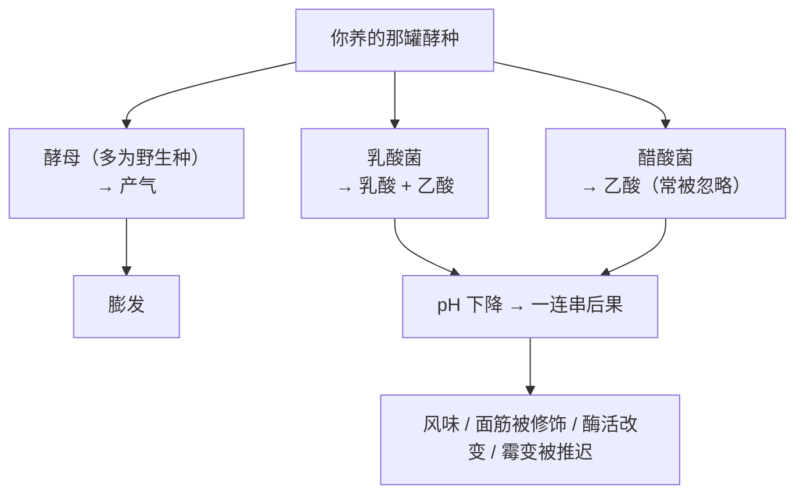
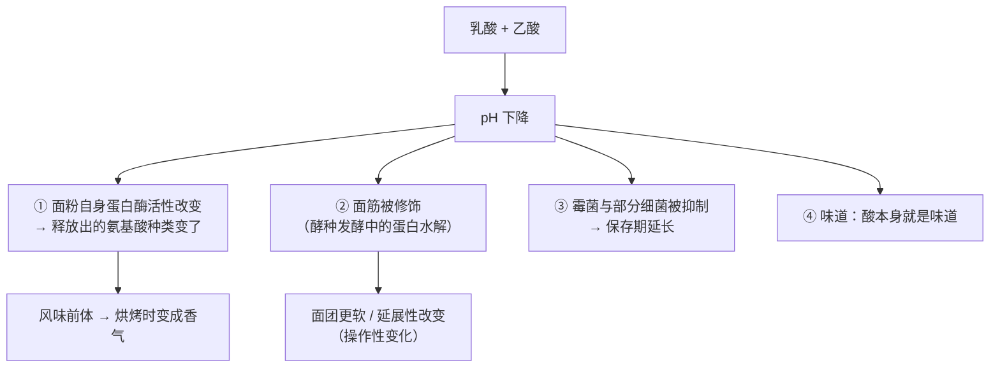
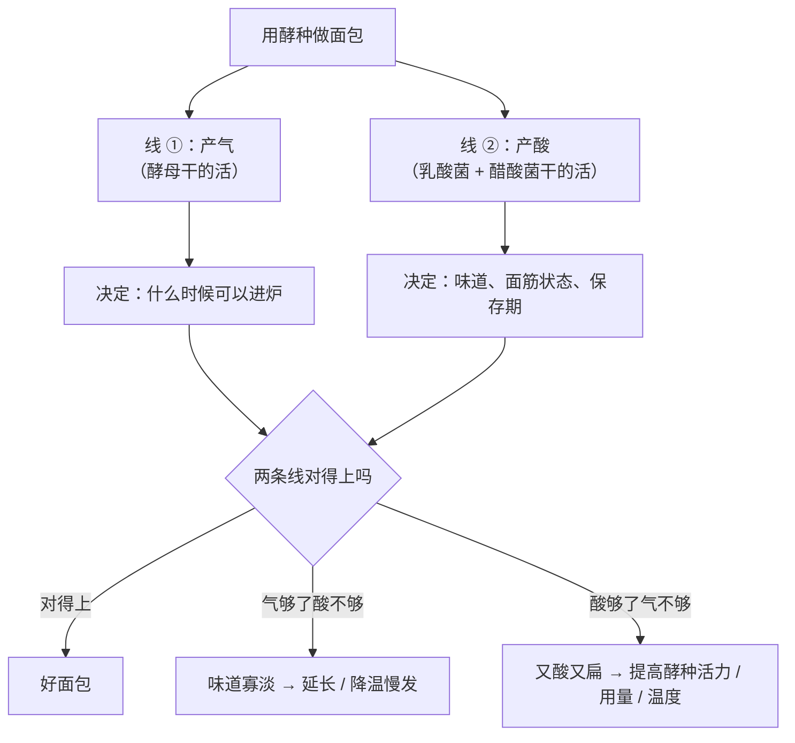

# 第 12 章 生物膨发二：天然酵种（酸、菌群、时间与风味）

> **本章目标**：回答一个很多人养了半年酵种也没想清楚的问题——
> **一罐酵种到底卖给你什么？**
>
> 先把结论放前面：**它卖的主要不是"更能发"，而是酸、菌群代谢产物和时间。**
> 产气的活儿，主要还是酵母在干（第 11 章）——只不过换成了**野生的、你没选过的**那些。

## 12.1 酵种是一个**群落**，不是一种微生物

酵种里至少有三类角色，而第三类长期被忽略：

| 角色 | 主要产物 | 它买给你什么 |
|------|---------|------------|
| **酵母**（不一定是面包酵母） | CO₂、乙醇、风味物质 | **产气**——和第 11 章是同一套机制 |
| **乳酸菌（LAB）** | 乳酸、乙酸、胞外多糖、肽与氨基酸 | **酸**、风味、保存期、面团性质的改变 |
| **醋酸菌（AAB）** | 乙酸等 | 一度被漏掉的一类；下面 12.3 会看到它的影响大得惊人 |

**一项 500 份样本的研究**（社区科学家从四大洲寄来的酵种）给出了几条颠覆常识的结果：

> - **地理位置几乎不能预测酵种的菌群组成**——
>   研究者明确写道，他们的大规模采样表明"**地理位置不决定酵种的微生物组成**"；
> - 500 份里有 **147 份**含有相对丰度超过 1% 的**醋酸菌**，
>   而这类菌在此前多篇关键综述里**几乎完全缺席**；
> - 共存关系（哪两种菌容易一起出现）在体外的合成群落实验里**被重现了 8 例中的 7 例**——
>   说明**菌与菌之间的相互作用**在塑造群落，而不是"你家的空气"。

另一项 2026 年的研究把变量换成**面粉种类与喂养频率**，追踪一个月：

> **酵母那一侧**：某一类野生酵母（*Kazachstania* 属）**迅速上升成为优势酵母**，
> 且**与面粉种类和喂养频率都无关**；
> **细菌那一侧**：**面粉类型确实影响了细菌群落**。

> **可迁移的判断**：**"我的酵种"不是你培养出来的，更像是你维持出来的。**
> 你能稳定影响的是**喂养基质与节奏**（面粉、水量、温度、频率），
> 而**谁最终住进来**，很大程度上由菌之间的竞争决定。

## 12.2 酵种买到的不是"更能发"

这一节的证据很硬，因为它来自一次**共同园实验**：
研究者从 500 份里挑出跨越多样性谱系的 **40 份**酵种，
用**同一批灭菌面粉和水**接种，再用视频追踪 36 小时的涨发。

| 观察 | 数据 |
|------|------|
| 各酵种的涨发速率 | **0.1~1.5 mm/hr**——最快的大约是最慢的**十几倍** |
| 接种源能解释多少变异 | 涨发速率 **42%**（p<0.001）、最大高度 **22%**（p<0.05） |
| 谁最能预测涨发速率 | **醋酸菌的相对丰度**——而且是**负相关**（ρ = −0.51，p<0.001） |
| 谁最能预测香气 | 同样是**醋酸菌的比例**（与挥发物组成的相关性 Mantel ρ = 0.73，p<0.001） |

> **把这几行连起来读**：
> ## 醋酸菌越多的酵种，**涨得越慢，但气味越"醋"**。
>
> 也就是说，**"酸"和"发力"在这批样本里是朝相反方向走的**。
> 这正是本章标题那句话的实验依据：**酵种买的是酸与时间，不是更强的膨发力。**

⚠️ **要注意这项研究测的是什么**：它测的是**在标准化基质里的涨发速率**，
不是"某种面包的成品体积"。**不要把它当成"酵种做不出大体积面包"**——
那是另一个问题（保气与工艺，第 10 章与第 40 章）。

## 12.3 酸从哪来、酸改变了什么

### 两种酸，比例还会变

酵种里的酸主要是**乳酸**与**乙酸**。行业用一个比值描述它们的关系：
**发酵商（fermentation quotient, FQ）= 乳酸 / 乙酸**[^1]。

一项追踪 10 天续种[^2]过程的研究给出了它怎么变：

| 天数 | 观察 |
|------|------|
| 第 0 天 → 第 5 天 | 乳酸菌从 **3.9 log CFU/g** 升到 **8.0 log CFU/g** |
| 第 4 天 → 第 10 天 | 酵母从 **2.0 log CFU/g** 逐渐升到 **5.0 log CFU/g** |
| 第 3 天 | 微生物**多样性最高**；之后随着酵种成熟**多样性下降** |
| 第 5 天前后 | 优势菌属发生**更替**（从一类乳酸菌换成另一类） |
| 全程 | 乳酸与乙酸都在增加，**FQ 从 13.54 降到 4.0 左右** |

⚠️ 这是**一项研究、一种谷物（Tritordeum）、一套续种流程**的结果，
**不是"酵种的标准曲线"**。本书引用它只为三条方向：

> 1. **成熟需要天数，不是小时**；
> 2. **成熟过程中优势菌会换人**——"第三天很香"和"第十天很香"不是同一个香；
> 3. 在这项研究里，**乳酸菌的数量远高于酵母**（差好几个数量级）。
>    ⚠️ 烘焙圈常说的"乳酸菌比酵母多 100 倍"这类具体比值，
>    本书**没有核到可引用的一手通用值**，因此只写方向。

### 酸做了什么：一条连锁反应

**第①条有实验支撑**：一项关于酵种中氨基酸来源的研究发现，
**小麦粉自身的蛋白酶几乎线性地释放氨基酸，在酸化与还原条件下活性最高**；
并且**发酵时的 pH 决定了释放出哪些氨基酸**
（脯氨酸在 pH 高于 5.5 时更多；苯丙氨酸、亮氨酸、半胱氨酸在更低 pH 下释放）。

> **这条很值得细读**：**酸不是"多一个味道"，它在改变面团里正在发生的化学。**
> 而这些氨基酸正是烘烤时香气与颜色的**前体**（第 21 章会讲褐变）。

## 12.4 酸的第二个产物：保存期

这是酵种最被低估的功能。

一项研究把工业酵种做的面包与**化学酸化**的面包放在一起比：

| 组 | 结果 |
|----|------|
| 含 *Lactobacillus sanfranciscensis* 与 *S. cerevisiae* 的全烤酵种面包（酵种占面团 30 g/100 g） | 在 21 °C 的货架试验中**完全没有长出可见霉菌** |
| 对照面包 | **4.4~9.2 天**出现可见霉变 |

研究者进一步指出：起作用的是**未解离形态的酸**的浓度——
那批面包里测到**未解离乳酸 36 mmol/L、未解离乙酸 220 mmol/L**。

> **为什么强调"未解离"**：同样的酸总量，**pH 越低，未解离的比例越高**，抑菌作用越强。
> 这解释了为什么"加点醋"和"用酵种发酵"**不是一回事**——
> 后者同时改变了**酸的种类、总量和 pH**。
>
> ⚠️ 这是**工业条件下的特定配方**，**不能外推成"家里的酵种面包能放多久"**。
> 保存期还受水分活度、包装、环境与卫生影响。**本书不给家庭保存期限数字。**

## 12.5 酵种还改变了面粉里的东西（只讲工艺，不做营养建议）

一项用特定乳酸菌做酵种面包的研究测到：
**所有用该菌株做的酵种面包，植酸[^3]的降低幅度为 83.3%~90.7%**，
而对照样品为 **71.4%**。

> ⚠️ **本书的纪律**：这里只陈述**被测到的成分变化**，
> **不做任何营养、健康或治疗方面的推断与建议**——那超出了这本书的范围，
> 也超出了这些研究本身的结论范围。
>
> 对烘焙**工艺**有意义的部分是：**酵种发酵确实在改变面粉的组成**，
> 所以"酵种面包只是酸一点的面包"这句话是不成立的。

## 12.6 代价：时间、不确定性，以及"它不是你的"

| 代价 | 说明 |
|------|------|
| **时间** | 建立一罐成熟酵种要**按天算**（那项追踪研究里第 5 天才算成熟）；每次做面包还要提前喂 |
| **速度** | 共同园实验里涨发速率 0.1~1.5 mm/hr，**十几倍的差距**；你手上那罐落在哪儿，得自己测 |
| **不可控** | 优势菌种由竞争决定；面粉类型影响细菌群落，但对某些酵母**几乎没有影响** |
| **不可移植** | 别人的"喂养比例 + 几小时到峰值"**不适用于你的酵种**，因为那是两个不同的群落 |

> **可迁移的判断**：**用酵种做面包，必须自己建立记录。**
> 这不是勤奋不勤奋的问题——**你手上那罐的参数，文献里没有。**

## 12.7 安全：本书能说什么、不能说什么

⚠️ **本书没有核到任何针对"家庭天然酵种"的官方专门指引。**
已核到的官方内容只有一般性的**生面粉**指引：

> 美国 FDA 的说法：**生面粉被当作未经处理的农产品**，不是即食食品；
> 关注的病原体是沙门氏菌与致病性大肠杆菌；
> "把生谷物加工成面粉并不会杀死有害细菌"；
> **烹熟是确保用面粉和生蛋做的食物安全的唯一方法**。
> ⚠️ 各国口径不同，以当地现行发布为准。

因此本书的写法是：

| 能说 | 不能说 |
|------|-------|
| 酵种是**生的面粉糊**，在它被烤熟之前，适用生面粉的一般性提醒（例如不要生尝、不要给孩子当玩具） | ❌ 不能说"酸度低到某个值就一定安全" |
| 面包**烤熟**是关键步骤（第 10 章：面包芯温度会趋近水的沸点） | ❌ 不能给"酵种出现某种外观就一定要扔 / 一定没事"的判据 |
| 记录你的喂养与气味变化，异常时**不冒险** | ❌ 不做任何医疗或健康建议 |

## 12.8 常见说法辨析

按本书约定标注**证据强度**：✅ 有共识 / ⚠️ 有争议 / ❌ 明确错误 / 缺乏证据。
来源见[出处登记](../../standards.md)。

| 说法 | 判定 | 说明 |
|------|------|------|
| "**旧金山的酵种只能在旧金山养出来 / 酵种有地域性**" | ❌ **与现有最大规模的数据不符** | 一项覆盖四大洲、500 份酵种的研究明确写道：**综合采样表明地理位置不决定酵种的微生物组成**；研究者推测原因是**酵种与面粉都在大范围流动**。⚠️ 作者也诚实指出：**更精细的空间尺度或菌株层面**可能仍有结构，他们用的扩增子测序**不足以分辨菌株** |
| "**酵种比商业酵母更能发**" | ❌ **方向常常相反** | 共同园实验里 40 份酵种的涨发速率相差**十几倍**（0.1~1.5 mm/hr），而且**醋酸菌比例越高涨得越慢**（ρ = −0.51）。酵种买到的是**酸、风味与保存期**，"更能发"不在清单上 |
| "**酵种面包不含酵母**" | ❌ **明确错误** | 酵种里主要**产气**的正是酵母（多为野生种，例如 *Kazachstania* 属）。一项一个月的追踪研究显示这类酵母**迅速成为优势酵母，且与面粉类型、喂养频率无关** |
| "**酵种越老越好**" | ⚠️ **变的是组成，不是等级** | 那项 500 份研究发现：**较年轻的酵种常以某些乳酸菌为主**（*L. plantarum*、*L. brevis*），**较老的酵种更常含 *L. sanfranciscensis*** 等。另一项追踪研究显示多样性在第 3 天最高、随后下降，第 5 天前后优势菌属更替。**"老"意味着群落走到了另一个状态，不等于更好** |
| "**必须用矿泉水 / 不能用自来水**" | 缺乏证据 | 本书**没有核到**任何关于水质对家庭酵种影响的可靠公开实验（第 3 章同样的缺口）。**本书既不推荐也不否定**，只提醒：**改水源就是改了一个变量，要单独记录** |
| "**必须用黑麦粉才能养起来**" | ⚠️ **面粉确实有影响，但不是"必须"** | 一项一个月的研究用三种普通烘焙面粉（通用粉、面包粉、全麦）：**面粉类型影响了细菌群落**，但优势酵母**不受面粉类型与喂养频率影响**。所以面粉是一个**变量**，不是开关 |
| "**酵种面包更健康 / 更好消化**" | ⚠️ **本书不评价** | 已核到的**成分层面**事实：一项研究里酵种面包的**植酸降低 83.3%~90.7%**（对照 71.4%）。**本书按纪律不做营养与健康推断**，只说明"酵种确实改变了面粉的组成"这一工艺事实 |
| "**酵种面包不容易坏**" | ✅ **有实验支持，但别外推** | 一项研究里含 *L. sanfranciscensis* 与 *S. cerevisiae* 的全烤酵种面包**完全抑制了霉菌生长**，对照面包在 **4.4~9.2 天**发霉；起作用的是**未解离酸浓度**（未解离乳酸 36 mmol/L、乙酸 220 mmol/L）。⚠️ 工业条件下的特定配方，**不能推出"你家的酵种面包能放多久"** |
| "**酵种漂在水上就说明可以用了**" | 缺乏证据 | 本书**没有核到**这一判据的任何实验依据。它检验的其实是"此刻含气量够不够"，**与酸度、菌群状态无关**，而且和容器、搅拌方式都有关。**可以当参考，不要当标准** |
| "**酵种就是慢一点的酵母，工艺可以照搬**" | ❌ **工艺要改** | 酸会改变**面粉蛋白酶活性与释放的氨基酸**，也会通过蛋白水解**修饰面筋**——面团更软、时间窗不同。照搬商业酵母的时间表，多半会得到一个发过头或整形困难的面团 |

## 12.9 一条可迁移的判断规则

> ## 用酵种时，你要同时管**两条时间线**：
> ## **气什么时候够**，和**酸走到哪儿了**。

这两条线**不同步**，而且都可以单独出问题：

| 现象 | 更可能是哪条线 | 下一步 |
|------|-------------|--------|
| 面团涨得慢，但味道正常 | **气**不够 | 查酵种活性（喂养后到峰值的时间）、温度、用量 |
| 面团涨得不错，但**酸得发苦、面团发黏发软** | **酸**走过头了 | 缩短时间 / 降低温度 / 减少酵种用量 |
| 面团黏手、整形时不成形 | 酸 + 蛋白水解把面筋改了 | 缩短总时长；提高面粉筋度；⚠️ 先改一项 |
| 成品又酸又不大 | **两条都偏了** | 从酵种本身查起（喂养节奏与温度） |

## 12.10 🔎 下次烤之前的用处

1. **先测你自己那罐的"峰值时间"**：喂养后每小时看一次，记下它涨到最高的时间点。
   **这个数字文献里没有，只能自己测**——共同园实验里酵种之间差了十几倍。
2. **别用"发到两倍"判断酵种成熟**：漂浮法、两倍法都**缺乏证据**，
   而且它们只反映此刻的含气量。
3. **想更酸 vs 想更能发，是两个方向**：数据显示醋酸菌多的酵种**涨得更慢**。
   想要酸香就接受慢；想要膨发就别指望酵种替你解决。
4. **换面粉就是换了细菌群落的食物**：研究显示面粉类型会影响细菌那一侧。
   **换粉之后重新测一次峰值时间。**
5. **成品黏、整形困难，先怀疑"酸太久"**，而不是先怀疑面粉——
   酸与蛋白水解会修饰面筋。
6. **保存期的好处是真的，但不是无限的**：实验里对照面包 4.4~9.2 天发霉，
   而酵种面包被完全抑制；**但那是工业配方**，你家的要自己观察并注意卫生。
7. **烤透仍然是安全的关键**（第 10 章、第 32 章）：
   酵种在被烤熟之前，就是一罐**生的面粉糊**。

## 12.11 思考题

1. 酵种里的三类微生物分别产什么、分别买给你什么？为什么说"产气那一半和第 11 章是同一套机制"？
2. 共同园实验里，**醋酸菌比例**与涨发速率是什么关系？
   这条结果为什么支持"酵种买的是酸与时间，不是更能发"？
3. 那项 500 份酵种的研究如何反驳"酵种有地域性"？
   研究者自己承认了哪两条局限？请说明为什么本书要把局限一起写出来。
4. **【案例】** 某人用酵种做欧包，配方（**以面粉总量为 100%**，酵种里的粉水已折算进总量）：
   面粉 100%、水 75%、盐 2%、成熟酵种 20%。
   他把一发从 4 小时延长到 9 小时，想"更酸更香"。结果面团**摊开、黏手、整形不成形**，
   成品**扁、孔洞乱、酸得发苦**。
   （a）用本章的"两条时间线"分析这一炉；
   （b）哪些机制解释"黏手、摊开"？请至少给两条；
   （c）如果他确实想要更酸，有哪两种代价更小的改法？各自的取舍是什么？
5. **【案例】** 两个人交换酵种：A 把自己的酵种分给 B，两人用同一份配方各做一次。
   三周后 B 说"你的酵种到我这儿就不一样了"。
   请用本章的研究讨论这句话可能包含的**两种不同情形**，
   并各设计一个能在家做的检查。
6. **【辨析】** "酵种面包更健康"——说明本书为什么不评价这条说法，
   以及本书**能**说的那部分事实是什么。
7. **【辨析】** "酵种浮起来就能用"——判断证据强度，
   说明它实际测的是什么、漏掉了什么，并给一个更好的自测方法。
8. 本章在"乳酸菌与酵母的数量比""家庭酵种的保存期""水质的影响"三处都拒绝给数字。
   请分别说明理由，并指出这与第 11 章那三处拒绝遵循的是不是同一个标准。

> 📖 **参考答案**（想清楚再看）：[Q1](../../qa/12-sourdough-qa.md#q1) ·
> [Q2](../../qa/12-sourdough-qa.md#q2) · [Q3](../../qa/12-sourdough-qa.md#q3) ·
> [Q4](../../qa/12-sourdough-qa.md#q4) · [Q5](../../qa/12-sourdough-qa.md#q5) ·
> [Q6](../../qa/12-sourdough-qa.md#q6) · [Q7](../../qa/12-sourdough-qa.md#q7) ·
> [Q8](../../qa/12-sourdough-qa.md#q8)

## 12.12 本章实操

### 🅐 零成本版 · 任务一：读三款商品"酸面包"的配料表

不用烤箱，也不用养酵种。去超市或面包店拍三款标着"酸种 / sourdough / 天然酵母"的配料表。

| | 产品 A | 产品 B | 产品 C |
|---|-------|-------|-------|
| 配料表里有**酵母**吗？ | | | |
| 有**酸味剂**吗（醋、乳酸、乳酸钠、酸面团粉…） | | | |
| 有**防腐剂**吗（丙酸钙、山梨酸…） | | | |
| 有没有写"酵种 / 酸面团"？排在第几位？ | | | |
| **你的判断**：它更像"长时间酵种发酵"还是"加酸 + 酵母的快速版"？ | | | |

回答：

| 问题 | 你的答案 |
|------|---------|
| 如果一款产品同时有"酸味剂"和"酵母"，它省掉的是本章讲的哪一部分？ | |
| 本章哪项研究说明"加酸"和"酵种发酵"不是一回事？ | |
| 有防腐剂的那款，和本章讲的"酸推迟霉变"是什么关系？ | |

### 🅐 零成本版 · 任务二：给你（或朋友）的酵种建一张身份卡

如果你有酵种就用自己的；没有的话，用这张表去问一个有酵种的人——
**你会发现他多半答不上来几行，这本身就是本章的重点。**

| 项目 | 填写 |
|------|------|
| 用什么面粉喂 | |
| 喂养比例（酵种 : 面粉 : 水，写清楚） | |
| 喂养频率与环境温度 | |
| **喂完到"最高点"要多久**（自己计时） | |
| 最高点时的气味（写三个词） | |
| 最高点之后 4 小时的气味（再写三个词） | |
| 它是"酸"多还是"醋"多？ | |
| 换过面粉吗？换之后峰值时间变了吗？ | |

> **这张表就是本章最重要的产出**：共同园实验里 40 份酵种的涨发速率差了十几倍——
> **别人的参数对你没用，你需要的是这一张。**

### 🅑 开火版 · 任务三：酵种 vs 商业酵母（有烤箱时做）

**唯一变量**：气源。用同一份基础配方，把**总粉量、总水量、盐量对齐**
（⚠️ 酵种里的粉和水**必须折算进总量**，这正是第 9 章讲的总配方百分比）。

| | 组 ①：商业酵母 | 组 ②：酵种 |
|---|--------------|-----------|
| 总面粉（＝100%） | 100% | 100% |
| 总水 | % | % |
| 盐 | % | % |
| 气源用量 | % | %（成熟酵种） |
| 发到入炉状态用了多久 | | |
| 面团手感（黏 / 挺 / 好不好整形） | | |
| 成品高度 | mm | mm |
| 组织（孔洞大小、均匀度） | | |
| 香气（各写三个词） | | |
| **第 3 天 / 第 5 天的状态**（同样包装、同样位置） | | |

做完回答：

| 问题 | 你的答案 |
|------|---------|
| 哪一组**更高**？哪一组**更香**？两者是同一组吗？ | |
| 哪一组**先发霉**？这和本章那项货架试验方向一致吗？ | |
| 酵种那一组的面团是不是更软更黏？你觉得是哪一条机制？ | |
| 这个实验里你**没控制住**的变量有哪些？ | |

> ⚠️ **发霉观察的注意事项**：只**看**，不要闻霉变样品、不要尝，观察完直接丢弃。
> 这只是一次家庭观察，**不能得出"能放几天"的结论**。

### 🅑 开火版 · 任务四（加分）：同一罐酵种，两种"酸度"

同一份面团分两份，**只改一发的时间**（例如你平时的时长 vs 延长约一半）：

| 组 | 一发时长 | 面团 pH（有试纸就测） | 手感 | 成品酸度 | 成品高度 |
|----|---------|-------------------|------|---------|---------|
| ① 平时 | | | | | mm |
| ② 延长 | | | | | mm |

> **预测再验证**：先写下你对"更酸、更高、更好整形"三项的预测，再对照。
>
> ⚠️ **安全提醒**：酵种在烤熟之前是**生的面粉糊**——不要生尝
> （美国 FDA：生面粉不是即食食品）。**各国口径不同，以当地现行发布为准。**

## 12.13 本章依据

本章引用的来源与核对状态详见[参考书目与出处登记](../../standards.md)，具体对应如下：

| 本章用到的内容 | 依据 |
|--------------|------|
| **500 份酵种、四大洲**；**地理位置不决定酵种菌群组成**；500 份中 **147 份**含相对丰度 >1% 的**醋酸菌**，而该类菌在多篇关键综述中几乎缺席；共存关系在合成群落中**重现 8 例中的 7 例**；40 份酵种的共同园实验中**涨发速率 0.1~1.5 mm/hr**，接种源解释涨发速率变异 **42%**、最大高度 **22%**；**醋酸菌比例与平均涨发速率负相关（ρ = −0.51）**、与挥发物组成强相关（Mantel ρ = 0.73）；较年轻的酵种常以 *L. plantarum* / *L. brevis* 为主，较老的更常含 *L. sanfranciscensis*；作者自陈局限：扩增子测序**不足以分辨菌株**，更精细空间尺度可能仍有结构 | *eLife* 2021 酵种起始物微生物组的多样性与功能研究（开放获取），✅ 全文已核 |
| 一个月追踪：某类野生酵母（*Kazachstania* 属）**迅速成为优势酵母且与面粉类型、喂养频率无关**；**面粉类型影响细菌群落** | *Microbiology Spectrum* 2026 面粉类型与喂养节奏对酵种微生物组的影响（开放获取），✅ |
| 醋酸菌在酵种中的作用：基于 500 余份酵种收集的 29 个基因组；在合成群落中**所有醋酸菌菌株平均使酸化提高 18.5%**，并改变挥发物谱 | *mSystems* 2024 酵种起始物中醋酸菌的基因组与合成群落研究（开放获取），✅ 摘要层面 |
| 10 天续种追踪：乳酸菌 **3.9 → 8.0 log CFU/g**（第 5 天），酵母 **2.0 → 5.0 log CFU/g**（第 4~10 天）；**第 3 天多样性最高**、成熟后下降；第 5 天前后优势菌属更替；**发酵商（乳酸/乙酸）从 13.54 降到约 4.0** | *International Journal of Food Microbiology* 2022 Tritordeum 酵种的微生物生态与生化特征研究，✅ 摘要层面。⚠️ **单一谷物、单一流程，不是"酵种的标准曲线"** |
| 小麦粉自身蛋白酶**几乎线性释放氨基酸**，在**酸化与还原**条件下活性最高；**发酵 pH 决定释放哪些氨基酸** | *Cereal Chemistry* 2002 酵种乳酸菌、酵母与谷物酶对氨基酸生成贡献的研究，✅ 摘要层面 |
| 酵种发酵中的**蛋白水解**机制及其对面包品质的影响 | *Trends in Food Science & Technology* 2008 酵种蛋白水解综述，✅ 题录层面（该条目无摘要） |
| 天然酵种的菌群组成与生态学规律 | *International Journal of Food Microbiology* 2016 酵种微生物组成与功能综述，✅ 摘要层面 |
| 含 *L. sanfranciscensis* 与 *S. cerevisiae* 的全烤酵种面包（酵种 30 g/100 g 面团）**完全抑制霉菌生长**，对照面包货架期 **4.4~9.2 天**；未解离乳酸 **36 mmol/L**、未解离乙酸 **220 mmol/L**；起作用的是**未解离酸浓度** | *International Journal of Food Microbiology* 2020 酵种面包与化学酸化面包中未解离乳酸与乙酸抗真菌作用的比较研究，✅ 摘要层面。⚠️ **工业条件下的特定配方，不可外推为家庭保存期** |
| 用特定乳酸菌做的酵种面包**植酸降低 83.3%~90.7%**，对照 **71.4%** | *Foods* 2022 *Lacticaseibacillus paracasei* SP5 酵种面包品质研究（开放获取），✅ 摘要层面。**本书只陈述成分变化，不做营养或健康推断** |
| 生面粉与生面团的安全：生面粉是**未经处理的农产品**，不是即食食品；**烹熟是唯一的保证方法** | 美国 FDA「Handling Flour Safely: What You Need to Know」，✅ 已核到官方页面。⚠️ 各国口径不同 |
| **针对家庭天然酵种的官方专门指引** | ⚠️ **未核到**。本章只引用一般性生面粉指引，并明确说明它不是针对酵种的专门指引 |
| **乳酸菌与酵母数量比的通用值**（如"100 : 1"） | ⚠️ **未核到**可引用的一手通用值；只写方向（在已核到的那项研究中乳酸菌数量远高于酵母） |
| **家庭条件下酵种面包的保存期** | ⚠️ **不给**：已核到的是工业条件下的特定配方结果 |
| **水质对家庭酵种的影响** | ⚠️ **未核到**任何可靠公开实验；本书既不推荐也不否定（与第 3 章同一缺口） |
| **"酵种浮起来 / 涨到两倍就能用"的判据** | ⚠️ **未核到**实验依据；按工艺口语处理，并说明它只反映此刻含气量 |

[^1]: [发酵商](../../glossary.md#fermentation-quotient)（fermentation quotient, FQ）。本章新出现的术语还有
[天然酵种](../../glossary.md#sourdough-starter)（sourdough starter）、
[乳酸菌](../../glossary.md#lab)（lactic acid bacteria, LAB）、
[醋酸菌](../../glossary.md#aab)（acetic acid bacteria, AAB）、
[未解离酸](../../glossary.md#undissociated-acid)（undissociated acid）。

[^2]: [续种 / 回喂](../../glossary.md#backslopping)（backslopping）。

[^3]: [植酸与植酸酶](../../glossary.md#phytate)（phytate / phytase）。

---

**下一章**：第 13 章 化学膨发——碱、酸与配平。
生物膨发用**时间**换风味；化学膨发用**确定性**换风味。
下一章要讲的是：这笔交易的条款写在哪里，以及配错了会在成品里留下什么。
