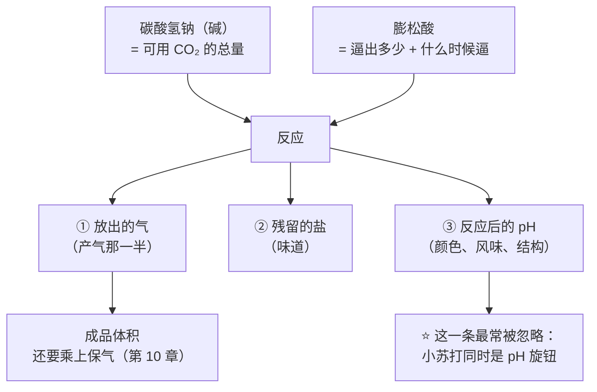
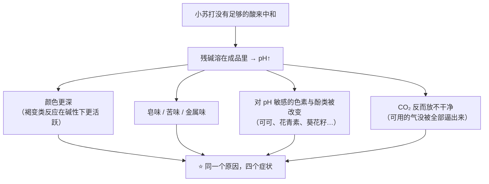
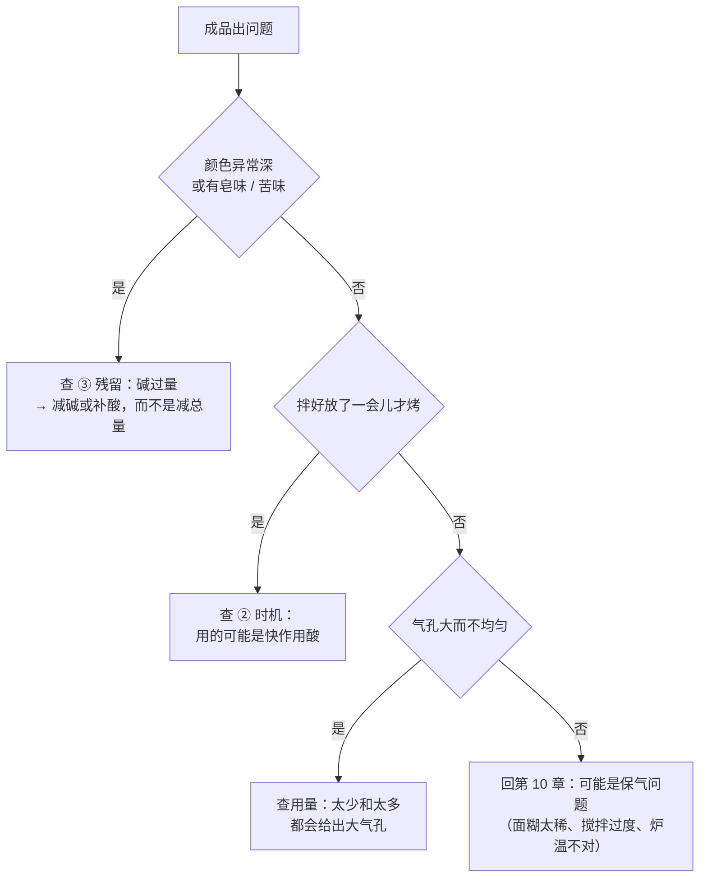

# 第 13 章 化学膨发：小苏打、泡打粉与酸碱配平

> **本章目标**：把化学膨松从"放多少勺"变成**三个可以分开回答的问题**：
>
> 1. **放多少气**——碱有多少、酸够不够把它逼出来；
> 2. **什么时候放**——多大比例留给了烤箱；
> 3. **剩下什么**——残留的盐与被改变的 pH，会在成品里留下颜色和味道。
>
> 第 8 章已经把三种气源的**分类**讲清楚了（并解释了为什么不能互换）。
> 本章只做一件事：**把第 10 章的"产气 × 保气"模型，装进化学膨松这套体系里。**

## 13.1 化学膨松的三个问题，其实是一个配平

**为什么必须一起看**：因为这三件事**由同一组配比决定**，
你不可能只调其中一个。"多放半勺小苏打"这个动作同时在动三个旋钮。

## 13.2 配平是按"中和"配的，不是按"克数"配的

第 8 章给过**中和值（NV）** 的定义：**100 份重量的膨松酸能中和多少份重量的碳酸氢钠**。
本章要补的是**它为什么重要**——有一项研究把这件事做成了可测量的对照。

那项研究用**数字图像分析**测量化学膨松面团的动态比容[^1]，
设计是**把不同的酸配到"等中和量"**：

| 设计 | 内容 |
|------|------|
| 碱 | 碳酸氢钠 **1.4~4.2 g / 100 g 面粉**（该研究**写明以面粉为基准**，即烘焙百分比 1.4%~4.2%） |
| 酸 | 葡萄糖酸-δ-内酯、酒石酸氢钾（塔塔粉）、己二酸、酸式焦磷酸钠——**各自按"等中和量"配** |
| 结果 | 面团的**空隙率在 5%~67% 之间**；而且"**发酵结束时的面团比容**"与"**实际放出的气量**"之间**基本呈线性关系** |

研究者点出的那条线性关系，正是本书第 10 章模型的一个**实测版本**：

> **那条直线的斜率，就是这份面团"抓得住多少气"的指标。**
> 换句话说：**同样的产气量，斜率高的面团涨得多。**

> **可迁移的判断**：
> ## **膨松剂决定"放出多少气"，面团决定"留住多少"——加膨松剂改不了第二项。**
>
> 这就是第 8 章那条"膨松剂有峰值、不是越多越大"的机制解释：
> 产气一路加上去，抓气能力却不会跟着涨，多出来的气只会把气室撑破。

⚠️ **注意本书的读法**：上面那个 1.4%~4.2% 是**那项研究的实验设计范围**，
**不是推荐用量**。本书**不给任何成品的膨松剂推荐百分比**（见[出处登记](../../standards.md)的已知缺口）。

## 13.3 什么时候放：行业把它做成了一个可测的指标

家庭烘焙里"拌好要不要马上进炉"这个问题，在工业上是一个**有名字、有测法的量**：

> **面团反应速率（dough rate of reaction, DRR）**[^2]——
> 一项 2008 年的研究专门提出用压力计法来做 DRR 测试，
> 目的正是给出**化学膨松剂在面团里的产气速率**，
> 并且要让这个结果**同时对技术人员（DRR）和研究者（每千克面团每秒产生多少摩尔 CO₂）都有意义**。
> 研究者写明：**缺少标准化仪器**，正是化学膨松剂更广泛应用的障碍之一。

也就是说：

| 家庭说法 | 工业上对应的是什么 |
|---------|-----------------|
| "拌好要马上进炉" | 这份配方的 **DRR 偏快**——气在搅拌与静置阶段就走掉了一部分 |
| "面糊可以冷藏过夜" | 用了**慢作用酸**，或者膨松酸**做了包衣** |
| "双效" | **留给烘烤阶段的那部分比例**（第 8 章：SAPP 10 / 28 / 40 分别约 10% / 28% / 40% 在搅拌阶段放出） |

**而这个"比例"是配方设计者选的，不是你选的**——
除非你知道自己那罐泡打粉用的是哪种酸（家用包装通常不写）。

> **可迁移的判断**：**"能不能静置"是一个关于酸的问题，不是关于面糊的问题。**
> 你看不到那罐的牌号，就只能**用实验去逼近它**（第 8 章 🅑 任务五：静置 0 / 20 / 60 分钟对照）。

## 13.4 剩下什么：小苏打是配方里的 pH 旋钮

这一节是本章最该被记住的部分，因为它解释了**很多"说不上来的怪味"**。

### 反应完了，钠还在

第 8 章引过：**单用碳酸氢钠会导致 CO₂ 释放不充分，并随着它在成品中溶解使碱性上升**，
通常表现为**皂味和发黄的颜色**。

**pH 的实测数据（两项独立研究）**：

| 研究 | 观察 |
|------|------|
| 一项 2019 年关于冷藏饼干面团的研究 | 存放 24 天后：**用小苏打的对照面团 pH 9.18**、**用泡打粉的对照面团 pH 7.14**；加了酸味剂（葡萄糖酸-δ-内酯、柠檬酸）的面团 pH 落在 **4.83~6.98** |
| 一项 2009 年关于可可制品的研究 | **用小苏打的蛋糕 pH 上升、颜色变深**；改用泡打粉的蛋糕可提取 pH 约 **6.2**、颜色更浅，**但高度也更低**；市售巧克力蛋糕预拌粉成品 pH 在 **8.3 以上** |

### pH 一变，跟着变的不止一样

同一项 2019 年的研究还给出一个很直观的连锁反应：
**那批面团在碱性下会"变绿"**——用小苏打的对照面团变绿程度明显高于用泡打粉的，
研究者把它归因于**更高的 pH**（9.18 对 7.14）。

另一条独立证据来自**可可粉本身**：一项分析了 **59 份**欧洲市场可可粉的研究发现，
**碱化处理极大地改变了 pH 与颜色**，与产地、是否烘焙等因素无关。

> **把这三条放在一起**：
> ## **碱不是"无色无味的产气剂"，它是一个会改变颜色与风味的成分。**
>
> 这也解释了为什么"用小苏打的巧克力蛋糕更黑更香"——
> 那不是玄学，是 pH；而代价可能是**皂味**，以及在含酸性色素的配方里**颜色走样**。

## 13.5 量与均匀度：太少的症状和太多的症状不一样

第 8 章引过那项磅蛋糕研究的结论，本章把它拆得更细一点：

| 用量 | 观察到的现象 |
|------|------------|
| **偏低** | 蛋糕出现**大而不均匀的气孔**、组织不均一 |
| **中间** | 面糊比容与孔隙率随用量上升 |
| **接近该研究的最高档（4.52%）** | 比容与孔隙率**反而下降** |

⚠️ 该研究的百分比基准本书**未核到明确写法**，因此**只引用方向，不引用数字当推荐值**。

**为什么"太少"会得到"大气孔"**，而不是"很多小气孔"？
用第 10 章的模型可以解释得很干净：

> 气孔的大小取决于**气室数量**，而不是气体总量。
> 产气少 → 只有少数几个气室被吹大 → 剩下的气室没被充起来，
> 最后成品里是**几个大孔 + 一片密实**。
> 产气过多 → 气室壁被撑破 → **合并**加速 → 同样是大孔，而且还塌。

**两头都是大孔，中间才是均匀**——这是化学膨松最反直觉的一点。

同一项研究还发现：**膨松酸的型号会影响面糊 pH**，
并且两种 SAPP 在"能不能把碱中和干净"上表现不同。
**所以"配平"和"用量"是两件事，要分开调。**

## 13.6 官方视角：法规管的是身份和功能，不是用量

化学膨松剂在法规里长什么样？本书核到的（美国口径，⚠️ 各国不同，以当地现行发布为准）：

| 条目 | 内容 |
|------|------|
| 21 CFR 184.1736「Sodium bicarbonate」 | 给出碳酸氢钠的**制法与规格**，并规定它**在食品中的使用没有限量，只需符合现行良好生产规范** |
| 21 CFR 184.1135「Ammonium bicarbonate」 | 同样是**按良好生产规范使用、无限量**；并把它的功能明确列为**面团调理剂、膨松剂、pH 调节剂、质构剂** |
| 21 CFR 182.1781「Sodium aluminum phosphate」 | **按良好生产规范使用**即视为一般认为安全 |
| 21 CFR 182.1217「Calcium phosphate」（含磷酸二氢钙） | 同上 |
| 21 CFR 137.180「Self-rising flour」 | 唯一给出**配平要求**的地方：酸的量**要足以中和碳酸氢钠**；**酸与碳酸氢钠合计每 100 份面粉不超过 4.5 份**；按规定方法测试**放出不少于 0.5% 的二氧化碳** |

> **注意这份清单说明了什么**：
> 1. **法规不告诉你放多少**——它管的是"这东西是什么、能干什么"；
> 2. **唯一写出配平要求的是自发粉**，而它的写法正是**以面粉为基准的烘焙百分比**；
> 3. **碳酸氢铵被官方同时登记为膨松剂和 pH 调节剂**——
>    这从另一个角度印证了 13.4：**这类原料本来就被当作"会改 pH 的东西"来管理。**

## 13.7 一条可迁移的判断规则

> ## 看到配方里的化学膨松剂，按顺序问三句：
> ## **① 碱有没有酸配？② 气留给烤箱多少？③ 反应完剩下什么？**

| 你在配方里看到 | 它在回答哪一问 | 你该预期什么 |
|--------------|-------------|------------|
| 小苏打 + 明显的酸性原料（酸奶、酪乳、可可、红糖、蜂蜜、柠檬、醋） | ① 有配平 | 气会**遇水就开始**放；多半要求尽快入炉 |
| 只有小苏打、找不到酸 | ① **可能故意不配平** | 成品要的就是**高 pH 的颜色与风味**（例如深色可可蛋糕）；但风险是皂味 |
| 只有泡打粉 | ① 酸是自带的 | 关键变成②：它用的是快酸还是慢酸 |
| 配方写"立刻入炉""拌好马上烤" | ② 留给烤箱的少 | 静置会损失体积；这条指令是**保护产气**的 |
| 配方允许冷藏面团 / 面糊 | ② 留给烤箱的多，或酸做过包衣 | 可以提前准备 |
| 配方同时有小苏打**和**泡打粉 | ①②③ 都在调 | 常见做法：用小苏打去中和配方里的酸（顺便调 pH 与颜色），用泡打粉补足产气 |

## 13.8 常见说法辨析

按本书约定标注**证据强度**：✅ 有共识 / ⚠️ 有争议 / ❌ 明确错误 / 缺乏证据。
第 8 章已辨析过"泡打粉与小苏打能不能互换""双效是不是发两次""过期只是发得少"等；
本章**不重复**，只辨析与**配平、时机、残留**有关的说法。

| 说法 | 判定 | 说明 |
|------|------|------|
| "**小苏打没有味道，多放一点没关系**" | ❌ **明确错误** | 它会留下**钠盐**并把 pH 推上去：实测的面团 pH 为 **9.18**（用小苏打）对 **7.14**（用泡打粉）。相关研究直接把"皂味与发黄"写成单用碳酸氢钠的典型表现；另一项研究里碱性面团还出现**变绿** |
| "**配方里的酸只是为了味道**" | ❌ **它是配平的一半** | 酸决定**能不能把可用的 CO₂ 全部逼出来**（中和值）和**什么时候逼**（快 / 慢作用）。美国自发粉的法定要求就是一句话：**酸的量要足以中和碳酸氢钠** |
| "**换一种酸只是换个酸味**" | ❌ **换的是整套行为** | 一项用等中和量配四种不同酸（葡萄糖酸-δ-内酯、塔塔粉、己二酸、SAPP）的研究显示，面团**空隙率可以从 5% 跨到 67%**；另一项研究还发现**膨松酸的型号会影响面糊 pH**，两种 SAPP 在"中和得干不干净"上表现不同 |
| "**膨松剂放得多，气孔就细**" | ❌ **两头都是大孔** | 一项磅蛋糕研究观察到：用量**偏低**时出现**大而不均匀的气孔**；用量接近该研究最高档时，比容与孔隙率**反而下降**。按第 10 章的模型：气孔大小取决于**气室数量**，产气太少（只有几个被吹大）和太多（撑破后合并）**都会得到大孔** |
| "**只要总量对，怎么分配碱和酸都一样**" | ❌ **分配决定时机** | 化学膨松的关键参数之一是"**留多少气给烤箱**"。行业用牌号直接标：SAPP 10 / 28 / 40 分别约 **10% / 28% / 40%** 的可用 CO₂ 在搅拌阶段放出。工业上甚至有专门的测法（**面团反应速率 DRR**），并把"缺少标准化仪器"当成推广障碍 |
| "**用柠檬汁 / 白醋替代配方里的酪乳，等量换就行**" | ⚠️ **方向可行，数量不可照搬** | 不同的酸**酸度不同、与碳酸氢钠反应的当量不同、反应速度也不同**（等中和量配平才是行业做法）。而且酪乳同时还是**液体和乳制品**——换掉它你同时改了含水量与配方结构（第 3、9 章）。⚠️ 本书**不给换算比例** |
| "**加了醋马上冒泡，说明这罐泡打粉是好的**" | ⚠️ **只测到一半** | 冒泡只证明"**还有能反应的碱**"。它**看不到**"留给烘烤阶段的那部分"——而那恰恰是双效泡打粉的主要价值。想逼近后半段，只能做**静置对照实验**（第 8 章 🅑 任务五） |
| "**无铝泡打粉更好**" | ⚠️ **本书只谈工艺，不评价健康** | 工艺层面能说的是：含铝的膨松酸（如磷酸铝钠）是一类**慢作用酸**，换成不含铝的配方等于**换了放气的时间分布**——成品可能需要更快入炉。法规层面：磷酸铝钠在美国按**良好生产规范使用**即视为一般认为安全（21 CFR 182.1781）。⚠️ 健康方面的评价**超出本书范围**，各国口径不同，以当地现行发布为准 |
| "**小苏打能让成品更脆 / 颜色更漂亮，所以是升级版**" | ⚠️ **它是变量，不是等级** | 第 8 章已辨析过颜色来自 pH。本章补一条代价：那项可可研究里，改用泡打粉后**颜色更浅但蛋糕高度也更低**——说明**碱确实在贡献体积**。**这是取舍，不是纠错** |
| "**化学膨松就是'没有风味'的膨发方式**" | ⚠️ **不准确** | 一篇 2026 年的综述说的是：化学膨发**放气快、过程可控，但风味复杂度不足，并可能有残留的咸味**——"风味复杂度不足"与"没有风味"不是一回事，**残留本身就是一种风味**（这也是 13.4 要讲 pH 的原因） |

## 13.9 🔎 下次烤之前的用处

1. **先在配方里找酸，再看膨松剂**。找不到酸却写着小苏打，
   要么这份配方**故意要高 pH 的颜色**，要么它有问题——两种情况的处理完全不同。
2. **"多放半勺"是同时动三个旋钮**（气、盐、pH）。
   要加体积，优先检查的是**保气**（面糊稠度、搅拌、炉温），不是加膨松剂。
3. **尝到皂味、苦味、金属味，或颜色异常深**——先怀疑碱过量，别怀疑烤箱。
4. **气孔大而不均匀时，别默认"放少了"**：太多也会给出大孔。
   **做一次上下各一档的对照**，比猜快得多。
5. **想提前拌好面糊**，先想清楚它靠的是快酸还是慢酸。
   不知道就做静置对照（0 / 20 / 60 分钟），**用你那罐的实际表现代替包装上没写的信息**。
6. **换酸就是换配方**：柠檬汁换酪乳、可可换碱化可可，
   改的都不只是味道，还有**配平、含水量与 pH**。
7. **把每次的膨松剂百分比记进[配方解码表](../../forms/recipe-decode.md)**
   （**以面粉总量为 100%**）——这是少数几个你能精确控制、也值得长期比较的数字。

## 13.10 思考题

1. 化学膨松的"三个问题"分别是什么？为什么说"多放半勺小苏打"不可能只改其中一个？
2. 那项用**等中和量**配四种不同酸的研究，得到了"面团末期比容与实际产气量基本呈线性"的结果。
   这条直线的**斜率**代表什么？它如何印证第 10 章的模型？
3. 为什么"用量太少"和"用量太多"都会给出**大而不均匀的气孔**？
   请用第 10 章的"气室数量"来解释。
4. **【案例】** 一份巧克力马芬配方（**以面粉总量为 100%**）：
   面粉 100%、天然可可粉 20%、糖 60%、油 40%、全蛋 40%、酪乳 90%、
   **小苏打 1.5%**、**泡打粉 1%**。
   某人把天然可可粉换成了**碱化可可粉**（其余不变），结果成品
   **膨得没以前高、颜色更深、有一点说不清的苦味**。
   （a）为什么换可可粉会影响膨发？请写出完整的推理链；
   （b）"苦味"最可能来自什么？
   （c）他至少有哪两种改法？各自的代价是什么？
5. **【案例】** 某人做司康，配方要求"拌好立刻入炉"。他因为接电话放了 40 分钟才烤，
   结果成品**明显矮、底部密实、表面有几个大洞**。
   （a）用本章"三个问题"里的哪一问来解释？
   （b）如果他手上那罐泡打粉用的是**慢作用酸**，结果会有什么不同？
   （c）设计一个实验，让他**不看包装**也能估出自己那罐的快慢。
6. **【辨析】** "加了醋马上冒泡，说明这罐泡打粉是好的"——判断证据强度，
   说明它测到了什么、漏掉了什么，并给一个更好的判据。
7. **【辨析】** "换一种酸只是换个酸味"——判断证据强度，并列出换酸会连带改变的**三件事**。
8. 本章引用了 1.4%~4.2%（碳酸氢钠，面粉基准）与 4.52%（泡打粉）两个数字，
   但都说明"不作为推荐用量"。请说明这两处的理由**是否相同**，
   以及本书对"能不能引用一个数字"的判断标准是什么。

> 📖 **参考答案**（想清楚再看）：[Q1](../../qa/13-chemical-leavening-qa.md#q1) ·
> [Q2](../../qa/13-chemical-leavening-qa.md#q2) · [Q3](../../qa/13-chemical-leavening-qa.md#q3) ·
> [Q4](../../qa/13-chemical-leavening-qa.md#q4) · [Q5](../../qa/13-chemical-leavening-qa.md#q5) ·
> [Q6](../../qa/13-chemical-leavening-qa.md#q6) · [Q7](../../qa/13-chemical-leavening-qa.md#q7) ·
> [Q8](../../qa/13-chemical-leavening-qa.md#q8)

## 13.11 本章实操

### 🅐 零成本版 · 任务一：给三份配方做"配平体检"

不用烤箱。找三份化学膨松的配方（松饼 / 马芬 / 司康 / 饼干 / 蛋糕都行）。

| | 配方 A | 配方 B | 配方 C |
|---|-------|-------|-------|
| 品类 | | | |
| **以面粉总量为 100%**：小苏打 | % | % | % |
| 泡打粉 | % | % | % |
| 配方里的**酸性原料**（逐个列出） | | | |
| ① 碱有没有酸配？（够 / 不够 / 故意不配） | | | |
| ② 有没有"立刻入炉"这类话？ | | | |
| ③ 你预期它**剩下什么**（颜色偏深？可能有咸味？） | | | |
| 如果同时有小苏打和泡打粉，你猜各自在干什么？ | | | |

回答：

| 问题 | 你的答案 |
|------|---------|
| 哪一份配方的小苏打百分比最高？它的酸性原料也最多吗？ | |
| 如果把 A 的膨松剂配比用到 C 上，你预测会出什么问题？ | |
| 三份里有没有"**故意不配平**"的（要高 pH 的颜色）？你的依据是什么？ | |

### 🅐 零成本版 · 任务二：厨房里的酸性原料清单

把你家里现有的、能在配方里充当"酸"的东西列出来，并标注它**同时还是什么**——
这一步很重要，因为换酸常常连带换掉液体或结构原料。

| 原料 | 它是酸 | 它**同时**是什么 | 换掉它会连带改变什么 |
|------|-------|---------------|-------------------|
| 酪乳 / 酸奶 | ✔ | 液体 + 乳制品 | 含水量、脂肪、蛋白质 |
| 柠檬汁 / 白醋 | ✔ | 少量液体 | 风味明显 |
| 天然可可粉 | ✔ | 干性原料 + 会吸水 | 吸水量、颜色、风味 |
| 碱化可可粉 | ✘（**偏碱**） | 干性原料 | **把配平整个翻过来** |
| 红糖 / 蜂蜜 | （偏酸，程度不定） | 糖 + 水分 | 甜度、吸湿、上色 |
| 塔塔粉 | ✔ | 纯酸 | 基本只改配平 |
| （你自己补充） | | | |

> ⚠️ **本书不给这些原料的酸度数值**——蜂蜜、红糖的酸度与含水量本书**没有核到**可引用数据
> （见[出处登记](../../standards.md)的已知缺口）。这张表只是让你**看清替换会牵动什么**。

### 🅑 开火版 · 任务三：配平对照（有烤箱时做）

**唯一变量**：酸碱配平。用一份简单的化学膨松配方（松饼或司康），
其余原料、搅拌、每份重量、炉温与时间**全部一致**，同时进炉。

| 组 | 处理 | 高度 | 颜色（浅 / 中 / 深） | 味道（有无皂味 / 苦味） | 成品 pH（有试纸就测） | 气孔 |
|----|------|------|------------------|--------------------|------------------|------|
| ① 原配方 | | mm | | | | |
| ② 把酸性原料换成中性的（例如酪乳→牛奶），**其余不变** | | mm | | | | |
| ③ 在②的基础上**把小苏打减半** | | mm | | | | |

做完回答：

| 问题 | 你的答案 |
|------|---------|
| ② 组的颜色和味道有没有变化？和"pH 被推高"一致吗？ | |
| ③ 组比 ② 组好还是差？说明了什么？ | |
| ③ 组有没有"没那么难吃但也没那么高"？这对应本章哪一句话？ | |
| 这个实验能证明"必须配平"吗？还是只能证明"不配平会变"？ | |

> **最后一行还是那个老问题**：**先问实验证明了什么，再下结论。**

### 🅑 开火版 · 任务四（加分）：快慢酸的家庭估测

用同一份面糊分三份，**只改静置时间**（第 8 章 🅑 任务五的加强版，这次记得量高度）：

| 组 | 处理 | 入炉前面糊状态 | 成品高度 | 组织 |
|----|------|-------------|---------|------|
| ① 拌好**立刻**入炉 | | | mm | |
| ② 静置 **20 分钟** | | | mm | |
| ③ 静置 **60 分钟** | | | mm | |

> **怎么读结果**：③ 与 ① 差距小 → 你那罐偏"慢"，留给烤箱的气多；
> 差距大 → 偏"快"，气在台面上就跑了。
>
> ⚠️ **局限**：静置期间面糊还在变（面粉继续吸水、面筋松弛、温度变化），
> **差异不能全部归因于膨松剂**。它给方向，不给定量。
>
> ⚠️ **安全提醒**：不要尝生面糊（美国 FDA：生面粉不是即食食品；含蛋配方还有生蛋风险）。
> 膨松剂按食品级产品的包装说明使用。各国口径可能不同，以自己所在地现行发布为准。

## 13.12 本章依据

本章引用的来源与核对状态详见[参考书目与出处登记](../../standards.md)，具体对应如下：

| 本章用到的内容 | 依据 |
|--------------|------|
| 用**等中和量**把碳酸氢钠（**1.4~4.2 g / 100 g 面粉**，该研究写明以面粉为基准）分别与葡萄糖酸-δ-内酯、酒石酸氢钾、己二酸、酸式焦磷酸钠配对：面团**空隙率跨越 5%~67%**；**发酵末期面团比容与实际产气量基本呈线性**，其**斜率可作为面团抓气能力的指标** | *Journal of Cereal Science* 2009 化学膨松面团体系的动态比容测量研究，✅ 摘要层面。**本章把第 10 章模型装进化学膨松的直接依据**；⚠️ 用量范围是**实验设计，不是推荐值** |
| **面团反应速率（DRR）** 的测法与意义；**缺少标准化仪器**是化学膨松剂更广泛应用的障碍之一 | *Journal of Agricultural and Food Chemistry* 2008 用压力计测化学膨松面团中 CO₂ 生成动力学的研究，✅ 摘要层面 |
| **中和值（NV）** 的定义；膨松酸分**快 / 慢作用**；**SAPP 10 / 28 / 40** 表示约 10% / 28% / 40% 的可用 CO₂ 在搅拌阶段放出；**单用碳酸氢钠导致 CO₂ 释放不充分、碱性上升、表现为皂味与发黄**；用量**偏低出现大而不均匀气孔**、接近最高档（该研究 4.52%）时比容与孔隙率**反而下降**；**SAPP 型号影响面糊 pH** | *Foods* 2023 泡打粉与膨松酸对磅蛋糕面糊与成品影响的研究（开放获取），✅ 全文已核。⚠️ 百分比基准本书未核到明确写法，**只引用方向** |
| 冷藏面团存放 24 天后：**小苏打对照 pH 9.18、泡打粉对照 pH 7.14**；加酸味剂的面团 pH **4.83~6.98**；**碱性下面团变绿**，变绿程度与 pH 相关 | *Journal of the Science of Food and Agriculture* 2019 酸味剂对葵花籽酱饼干面团影响的研究，✅ 摘要层面 |
| **用小苏打的蛋糕 pH 上升、颜色变深**；改用泡打粉后可提取 pH 约 **6.2**、颜色更浅**但高度也更低**；市售巧克力蛋糕预拌粉成品 pH **8.3 以上** | *Journal of Food Science* 2009 可可制品在烹饪加工中抗氧化成分保留的研究，✅ 摘要层面。**本书只引用 pH / 颜色 / 高度的观察** |
| **碱化处理极大改变可可粉的 pH 与颜色**，与产地、制法、是否烘焙无关（59 份欧洲市场样品） | *Foods* 2024 欧洲市场可可粉生物活性成分调查（开放获取），✅ 摘要层面。**本书只引用其 pH 与颜色结论，不引用其营养结论** |
| 化学膨松剂中加**中性填料与抗结剂**控制吸潮、防止碱酸提前反应；给膨松酸**做包衣**以延缓冷藏面团中的产气 | *International Journal of Food Science & Technology* 2023 化学膨松剂保存性能与非反应性成分的专利综述，✅ 摘要层面 |
| 化学膨发**放气快、过程可控，但风味复杂度不足，并可能有残留的咸味** | *Food Chemistry* 2026 膨发方式对面团性质与面包品质影响的综述，✅ 摘要层面 |
| 四种膨松酸（SALP、SAS、MCP、SAPP-28）与碳酸氢钠配合：膨松盐的离子与 pH 相互作用影响面团性质与静置时间 | *Cereal Chemistry* 2000 膨松酸对小麦粉玉米饼影响的研究，✅ 摘要层面 |
| **碳酸氢钠**：制法与规格，**使用无限量、按现行良好生产规范** | 美国 21 CFR 184.1736「Sodium bicarbonate」，✅ 已核到法规原文。⚠️ 各国口径不同 |
| **碳酸氢铵**：按良好生产规范使用、无限量；功能被列为**面团调理剂、膨松剂、pH 调节剂、质构剂** | 美国 21 CFR 184.1135「Ammonium bicarbonate」，✅ 已核到法规原文 |
| **磷酸铝钠**、**磷酸钙（含磷酸二氢钙）**：按良好生产规范使用即视为一般认为安全 | 美国 21 CFR 182.1781、182.1217，✅ 已核到法规原文 |
| 自发粉：**酸量要足以中和碳酸氢钠**；**酸与碳酸氢钠合计每 100 份面粉不超过 4.5 份**；**放出不少于 0.5% 的 CO₂** | 美国 21 CFR 137.180「Self-rising flour」，✅ 已核到法规原文 |
| 生面糊与生面粉的安全 | 美国 FDA「Handling Flour Safely」，✅ 已核到官方页面 |
| **"小苏打 ↔ 泡打粉"的换算比例**、**柠檬汁 / 醋替代酪乳的换算** | ⚠️ **不给**：需要那罐膨松酸的**中和值**与快 / 慢作用比例，以及各原料的酸度——这些信息家用包装通常不写（第 8 章已登记该缺口） |
| **各类成品的膨松剂推荐百分比** | ⚠️ **未核到**一手出处；本书只引用研究的**实验设计范围**并明确标注不是推荐值 |
| **蜂蜜、红糖的酸度与含水量** | ⚠️ **未核到**可引用数值（第 4 章已登记该缺口）；本章的原料表只写方向 |
| **含铝与不含铝膨松酸的健康评价** | ⚠️ **超出本书范围**：本书只讲工艺差别（慢作用酸 → 放气时机）与法规状态，不做健康建议 |

[^1]: [比容](../../glossary.md#specific-volume)（specific volume），第 10 章已出现。

[^2]: [面团反应速率](../../glossary.md#drr)（dough rate of reaction, DRR）。本章新出现的术语还有
[碱化可可](../../glossary.md#dutch-cocoa)（alkalized / Dutch-processed cocoa）、
[塔塔粉](../../glossary.md#cream-of-tartar)（cream of tartar / potassium acid tartrate）、
[葡萄糖酸-δ-内酯](../../glossary.md#gdl)（glucono-delta-lactone, GDL）。

---

**下一章**：第 14 章 物理膨发一——打发。
生物和化学膨发都是"**让气自己长出来**"；
接下来两章讲的是另一条路：**气是你亲手打进去的，而泡沫是有寿命的。**
