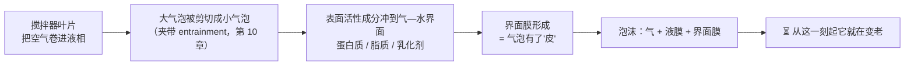
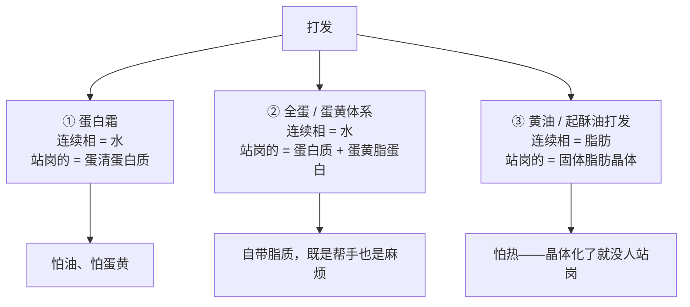
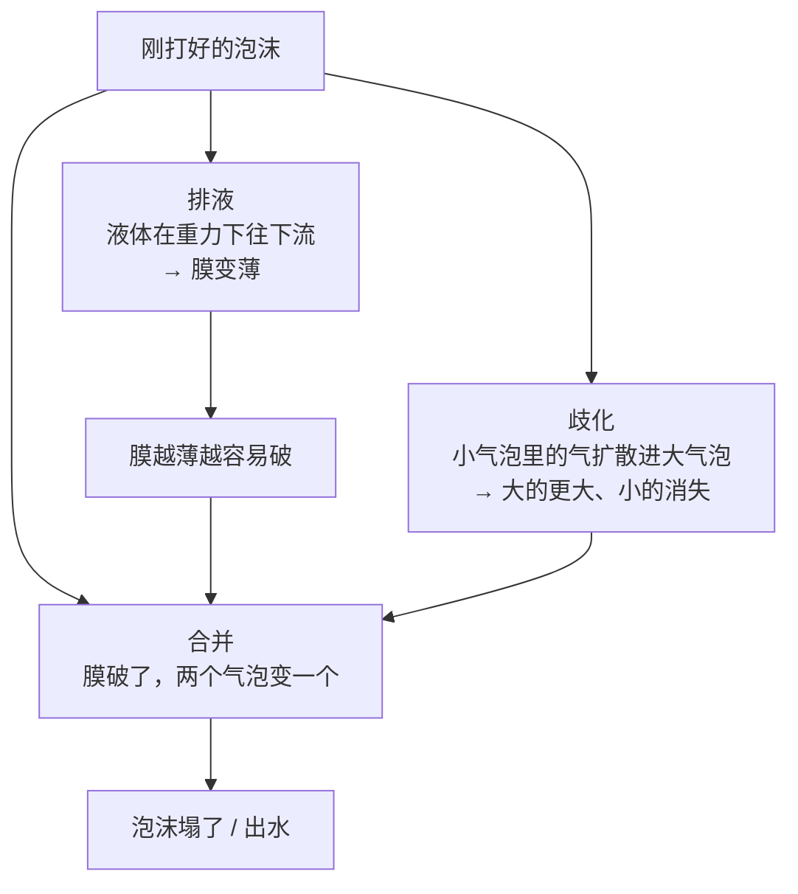
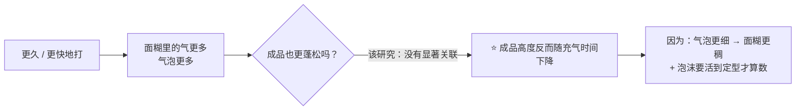
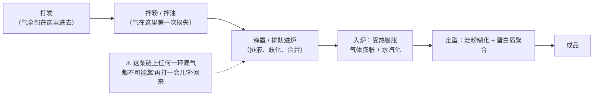
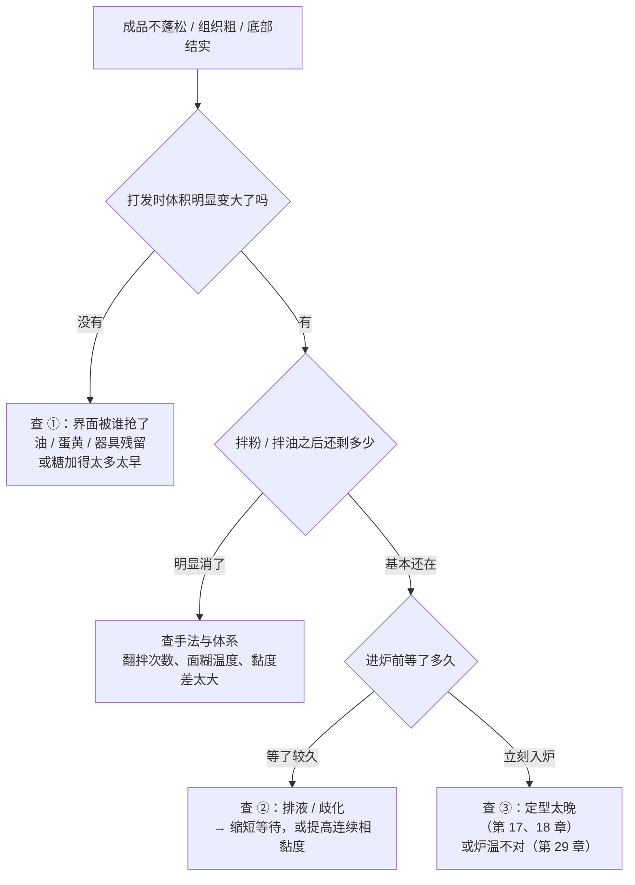

# 第 14 章 物理膨发一：打发——蛋白霜、全蛋与黄油打发

> **本章目标**：把"打发"从"打到什么状态"变成**三个可以分开回答的问题**：
>
> 1. **气是怎么进去的**——谁把空气撕碎成气泡、谁在气泡表面站岗；
> 2. **它能活多久**——泡沫从形成那一刻起就在死，死法有三种；
> 3. **它能不能活到定型**——这一条决定了成品，而不是"打得好不好看"。
>
> 第 10 章说过：膨发 = **产气 × 保气**。
> 生物与化学膨发是"让气自己长出来"，**打发这条路线里，产气那一半由你亲手完成**——
> 于是"产多少气"第一次变成一个**你可以直接控制、也可以直接搞砸**的量。

## 14.1 打发和前两条路线的根本差别

酵母和膨松剂产气，都是**在面团内部**生成新的气体分子；
打发不生成任何气体，它只做一件事：**把已经存在的空气切碎、塞进液相里，再让它别跑掉**。

这带来两条前两章没有的性质：

| 性质 | 后果 |
|------|------|
| **气室的数量在搅拌结束时就定了** | 第 10 章的结论在这里变得极端：后面所有的"变大"，都只是**已有气室被吹大**，不会凭空多出气室 |
| **泡沫是热力学上不稳定的** | 它没有"稳定态"，只有**衰减速度**。所以打发体系的操作永远在跟时间赛跑 |

> **第一条可迁移判断**：
> ## **打发决定的是"有多少个气室、它们多大"，不是"成品有多高"。**

## 14.2 三种打发体系：站岗的不是同一个角色

家用烘焙里说的"打发"其实是三件不同的事，差别在**谁在气泡表面站岗**：

### ① 蛋白霜：蛋白质在界面上"摊开"

蛋清蛋白质原本是折叠好的球，被搅到气—水界面上以后**部分展开**，
把疏水的部分朝向空气、亲水的部分留在水里，互相搭连成一层膜[^1]。

有一项研究把这件事做得很具体：把蛋清打成泡沫，分别在**打完 5 分钟**和**静置 2 小时排液后**
取样做电泳与质谱，结果是**两批不同的蛋白质**：

| 阶段 | 主要是谁 |
|------|---------|
| **形成泡沫**（起泡能力） | **卵转铁蛋白、卵白蛋白、卵类粘蛋白**三种 |
| **维持泡沫**（2 小时后仍留在泡沫里） | **卵粘蛋白、卵巨球蛋白、卵白蛋白的碎片与聚合物、溶菌酶**等的比例大幅上升 |

研究者的结论是：**溶解性、复合物的形成、蛋白质的断裂与聚合**共同决定泡沫稳定性。

> **为什么这条值得记**：它说明"**能打起来**"和"**能站得住**"在分子层面就是两件事。
> 你在厨房里遇到的"明明打发了，一放就出水"，不是错觉，是这两件事被拆开了。

### ② 全蛋与蛋黄：脂质既是帮手也是麻烦

第 6 章讲过蛋黄的**低密度脂蛋白（LDL）本身具有表面活性**，
在海绵蛋糕里参与充气与气室稳定；拆散 LDL 之后，**充气与气室稳定性受影响，
而"结构什么时候定住"基本不受影响**。也就是说：**蛋黄是来帮忙充气的。**

但同一种东西换个形式就变成破坏者。一项针对工业蛋清中残留蛋黄的研究发现：
**蛋黄残留达到 0.7%（w/w）以上时，泡沫被破坏**——机制是**脂质在界面上搭桥、
打断蛋白质形成的界面网络**。

| 同样是蛋黄脂质 | 它在做什么 |
|--------------|-----------|
| 在**完整的脂蛋白颗粒**里（全蛋 / 蛋黄打发） | 作为一个表面活性颗粒参与充气 |
| 以**游离脂质**形式混进纯蛋清体系 | 抢占界面但撑不起膜，把蛋白质的网络打断 |

> ⚠️ **本书的读法**：0.7% 这个数字来自**工业蛋液体系的单项研究**，
> **不能**直接翻译成"几滴蛋黄"。它能支持的结论只有一句：
> **游离脂质破坏蛋清泡沫是真的，而且是有阈值的**——但那个阈值是多少，你家那盆算不算，本书不知道。

### ③ 黄油打发：站岗的是固体脂肪晶体

这一体系的连续相是**脂肪**，空气被夹在**固体脂肪晶体**构成的网络里（第 5 章）。
有一项关于"糖 + 黄油打发成的糖霜"的流变学研究给了一个很有画面感的观察：
用糖粉与黄油 **2 : 1**（重量比，该研究写明）在行星搅拌机里打 **3 分钟**或 **6 分钟**，
得到的**含气体积分数不超过 0.17**；而**糖晶与气泡的尺寸分布很接近，众数都在 10 µm 上下**。

> 这条观察正好解释了"**糖是打发黄油的工具，不只是甜味剂**"这个说法为什么流传：
> 在这类体系里，**糖晶的尺寸与气泡的尺寸是同一个量级**。
> ⚠️ 但"糖晶棱角把空气刮进去"这个具体机制，本书**没有核到直接的实验证据**，
> 只能说两者的尺寸分布吻合。**不要把相关当成机制。**

## 14.3 泡沫的三种死法（和第 10 章是同一套词）

第 10 章讲面团里的气室时用过三个词，打发体系里它们出现得更快、更明显：

一篇关于高脂乳体系界面性质的综述把这三件事并列为泡沫劣化的三条路径
（对应到乳液那边则是絮凝、合并与上浮），并指出它们的共同要害是**界面膜的力学强度**与
**连续相的黏度**。这解释了两件家常事：

| 你做的操作 | 它动的是哪一项 |
|-----------|--------------|
| 把面糊拌得更稠（或用更稠的糖浆） | 提高连续相黏度 → **减慢排液** |
| 打到气泡更细更均匀 | 缩小气泡间的压力差 → **减慢歧化** |
| 尽快进炉 | 直接**缩短泡沫需要存活的时间** |

**泡沫的寿命是可以测量的量**：有研究在单层泡沫池里直接记录"液体面积分数"随时间的变化，
并用**半衰期**描述稳定性——加了多糖之后，同一种蛋白质泡沫的半衰期从约 **47 分钟**升到约 **461 分钟**。

> ⚠️ 那是植物蛋白的模型体系，不是蛋白霜。本书引用它只为说明一件事：
> **"稳不稳定"不是形容词，是一条可以画出来的曲线**——你在厨房里也能画（见本章实操）。

## 14.4 糖：更难打起来，但更稳

第 4 章讲过糖的四件事，其中一件正是"影响打发"。这里把证据摆全：

| 来源 | 观察 |
|------|------|
| 一项关于蔗糖与氯化钠对蛋清起泡性影响的研究 | **蔗糖让泡沫更难打起来，但打起来之后更稳定**；提高 NaCl 含量与延长搅打时间都促进蛋白质在界面上的吸附 |
| 一项用咸鸭蛋清做蛋白霜、比较四种糖与四档糖量的研究 | 随糖量升高：**打发指数、泡沫耐久指数与比重上升**，而**打发率（overrun）与气相体积基本不变**；成品的体积与硬度上升、水分与水分活度下降 |

两项研究都指向同一件事，但要注意它们**说的不是同一个量**：

> **糖买到的是"泡沫活得更久"，不是"泡沫里的气更多"。**
> 第二项研究里"打发率基本不变"这一条尤其值得记——
> **加糖不会让你多打进气，它让你打进去的气更不容易跑掉。**

⚠️ 本书**不给**"糖分几次加、什么时候加"的规则：
这类说法在烘焙圈到处流传，但本书**没有核到**比较不同加糖时机的对照实验（见[出处登记](../../standards.md)的已知缺口）。

## 14.5 酸：证据只有一半

"打蛋白要加几滴柠檬汁 / 一小撮塔塔粉"是流传最广的打发技巧之一。本书核到的证据是这样的：

- 一项研究给蛋清蛋白加**柠檬酸**后，**起泡性从 50% 提高到 178.2%**，
  疏水基团暴露增加、游离巯基从 5 µmol/g 升到 34.8 µmol/g，并观察到**泡沫变薄的过程被延缓**；
- 另有研究发现 **pH 显著改变卵白蛋白在气—水界面的吸附行为**。

> **证据强度**：⚠️ 方向有支持，**数值只见于单项研究**，而且用的是分离蛋白体系、
> 目的还是 3D 打印。本书因此**只写方向**："降低 pH 会改变蛋白质在界面上的行为，
> 通常表现为更容易打起来"，**不给用量**。

另有一条和"蛋新鲜不新鲜"有关的证据：带壳蛋存放过程中，
**天然卵白蛋白会转变成更耐热的形式（S-卵白蛋白）**。一项研究比较两者发现：
转变后**起泡能力在 pH 3.0 下提高约 29%，但泡沫稳定性在 pH 3.0~9.0 之间下降 28.5%~100%**。

> 这大概是"陈蛋更好打、新鲜蛋更稳"这类说法的分子版本。
> ⚠️ **仅见于该研究，且是纯化蛋白体系**，本书不据此给"蛋放几天最好打"的建议。

## 14.6 打过头：一个很反直觉的实验

"打发不足"人人都懂，"打过头"却常被当成玄学。有一项关于**充气饼干面糊**的研究
把充气条件（转速与时长）当成变量来做，结果很值得抄进脑子：

| 观察到的 | 内容 |
|---------|------|
| 面糊侧 | **打发率与气泡数量随时长上升**；主要变化发生在**前 20 分钟**；**转速最高（1000 rpm）时打发率反而更低** |
| 成品侧 | 充气时间越长，**成品中心高度下降、组织密度上升**、力学阻力变大 |
| 最关键的一条 | **面糊的充气程度与成品的充气程度之间，没有找到显著关联** |

这和第 10 章那条"**初始 CO₂ 体积过高反而损害炉内膨胀**"是同一类现象：
**产气那一半加到头，瓶颈就转移到别处去了。**

> **第二条可迁移判断**：
> ## **"打得更久"改的是气泡的数量与尺寸分布，不一定改成品的体积。**
>
> 所以当成品不够蓬松时，**先别急着延长打发时间**——
> 先问：泡沫是在哪一步死掉的？是拌粉时被消掉的，还是等进炉时排液塌掉的？

## 14.7 泡沫必须活到定型

第 10 章的模型里，膨发的窗口由**定型时刻**关闭。对打发体系来说，这一条特别致命，
因为它的产气全部发生在**进炉之前**：

第 6 章引过的那项海绵蛋糕研究写明：**面糊变成蛋糕靠淀粉糊化与蛋白质聚合两种成胶现象**；
而且**面糊黏度越高，排液、气室合并与气泡上浮越少，气室越稳定**。
另有一项用**热台显微镜**直接看面糊气泡的研究发现：
用聚葡萄糖替换蔗糖会**增大气泡平均尺寸、加宽尺寸分布**，
而这种**初始气泡分布的差异，直接反映在加热时气泡群的膨胀速率上**。

> **这就是"打发"与"配方"的接口**：
> 你打进去的气泡分布，会被**配方决定的黏度与定型时刻**放大或吃掉。
> 换句话说：**打发不是一项独立技能，它和配方是同一件事的两半。**

还有一条来自油脂侧的旁证：一项蛋糕减脂研究发现，脂肪替换超过 65% 之后，
**面糊黏度显著下降，随之而来的是充气量下降、气泡尺寸分布变宽**。
**黏度**在这里同时是"能打进多少气"和"能留住多少气"的共同旋钮。

## 14.8 一条判断规则与一张排查树

> ## 打发体系出问题，按顺序问三句：
> ## **① 气进去了吗？② 它活到进炉了吗？③ 它活到定型了吗？**

## 14.9 常见说法辨析

按本书约定标注**证据强度**：✅ 有共识 / ⚠️ 有争议 / ❌ 明确错误 / 缺乏证据。

| 说法 | 判定 | 说明 |
|------|------|------|
| "**盆里有一点油或一滴蛋黄，蛋白就打不发**" | ⚠️ **方向对，数字别乱套** | 游离脂质破坏蛋清泡沫有直接证据：一项研究观察到**蛋黄残留 ≥0.7%（w/w）时，脂质在界面上搭桥、打断蛋白质界面网络**。但那是工业蛋液体系的**单项**研究，**"一滴"到底是多少、你那盆够不够到阈值，本书不知道**。可操作的结论是：**这件事值得防，但别把失败一律归给它** |
| "**打发的气越多，成品越蓬松**" | ❌ **不成立** | 一项充气饼干面糊的研究里，**面糊的充气程度与成品的充气程度之间没有显著关联**；而且充气时间越长，成品中心高度反而**下降**、组织密度**上升**。这与第 10 章"产气 ≠ 结果"是同一回事 |
| "**加糖会让蛋白打不发**" | ⚠️ **说反了一半** | 两项研究一致：糖让泡沫**更难形成**，但**更稳定**；而咸鸭蛋清那项还发现**打发率与气相体积基本不变**。所以糖买到的是"活得更久"，不是"气更少" |
| "**打发必须加塔塔粉或柠檬汁**" | ⚠️ **有方向，没有用量依据** | 已核到：柠檬酸处理使某体系起泡性从 50% 升到 178.2%、泡沫变薄被延缓；pH 显著改变卵白蛋白的界面吸附行为。但都是**单项、分离蛋白体系**。本书**不给用量**，也**不说"必须"** |
| "**蛋要先回温到室温才好打**" | **缺乏证据** | 本书**没有核到**比较蛋温对起泡性与成品影响的实验（已登记为缺口）。而且这条建议与官方的冷藏建议方向相反（美国 FDA：带壳蛋冷藏保存，冰箱保持在 40 °F 即约 4 °C 以下）。⚠️ 各国口径不同，以当地现行发布为准。想知道自家如何，**自己做一次对照**比信传言快 |
| "**打到硬性发泡永远比湿性发泡好**" | ❌ **取决于后面还要做什么** | 打发的产物要**经过翻拌、进炉、膨胀**三关。打得太硬的泡沫延展性差，在受热膨胀阶段更容易被撑破；打得太软则撑不住等待时间。**本书不给"打到什么程度"的通用答案**——它由你的配方黏度与从打好到入炉的时间共同决定 |
| "**用铜盆打蛋白更稳**" | **缺乏证据** | 本书**未核到**可引用的对照实验。机制上的说法（铜与卵转铁蛋白结合）与"卵转铁蛋白是主要起泡蛋白之一"这条实测不矛盾，但**"不矛盾"不等于"被证明"**。按缺乏证据处理 |
| "**打发好的蛋白霜可以先放着，等会儿再用**" | ❌ **和泡沫的本质相反** | 泡沫在热力学上不稳定，从形成起就在**排液、歧化、合并**。实测里，蛋清泡沫静置 2 小时后**留在泡沫里的蛋白质组成已经变了**。要放，就得先提高连续相黏度（例如做成加了糖浆的意式蛋白霜），而那已经是**换了一个体系** |
| "**打过头了，再加一个蛋白进去搅一搅就能救回来**" | ⚠️ **能改善外观，救不回结构** | 加新的蛋白确实能让看起来粗糙的泡沫重新变细，但**已经被打断、聚集的界面膜不会复原**。本书**没有核到**关于这种"补救"效果的实验。**更可靠的做法是记录这一次打到第几分钟出问题，下次提前停** |
| "**黄油打发只是为了混匀，跟膨松剂没关系**" | ❌ **它就是一条气源** | 在以脂肪为连续相的体系里，空气被**固体脂肪晶体**网络夹住：糖霜研究里含气体积分数可达 0.17，且**糖晶与气泡的尺寸分布众数都在 10 µm 上下**。第 5 章说过的"油脂是充气的载体"在这里是字面意思 |
| "**黄油打发失败是因为黄油不够软**" | ⚠️ **不全对** | 太硬打不进气，**太软（脂肪晶体熔掉）同样打不进气**——站岗的是晶体，不是液态油。第 5 章给过判据：**能留下清晰指印、不粘手、不出油**。本书**不给温度数字**（已登记为缺口：家用黄油的固体脂肪含量—温度曲线未核到） |

## 14.10 🔎 下次烤之前的用处

1. **打之前先决定"从打好到入炉要多久"**。这个时间才是你该选择打发程度的依据——
   要排队 20 分钟，就得让泡沫更稠更稳；能立刻进炉，就不必打到极限。
2. **先看容器和分蛋**，再谈技巧。游离脂质破坏蛋清泡沫是有实测支持的机制，
   而这一步的成本几乎为零。
3. **不蓬松时，别先延长打发时间**。按 14.8 的三问排查：气有没有进去、有没有活到进炉、有没有活到定型。
4. **加糖是在买"稳定"，不是买"体积"**。想要更多气，要动的是打发方式与器具，不是糖量。
5. **把"打发几分钟"记进[烘焙记录表](../../forms/bake-log.md)**，
   并且同时记**从打好到入炉的分钟数**——后者几乎没人记，但它常常才是差异的来源。
6. **面糊黏度是个被低估的旋钮**：它同时决定能打进多少气、气能留多久。
   减油、减糖、多加水都会把它往下压。
7. **黄油打发看状态不看时间**：室温、季节、你家搅拌机功率都不同，别抄别人的"打 5 分钟"。

## 14.11 思考题

1. 为什么说"打发体系里，气室的数量在搅拌结束时就定了"？
   这一条如何解释"成品有几个大孔、其余密实"这种组织？
2. 蛋清泡沫里"负责打起来"的蛋白质与"负责站得住"的蛋白质并不是同一批。
   这条实测结论对你的操作意味着什么？
3. 蛋黄脂质在海绵蛋糕里帮忙充气，在蛋清里却破坏泡沫。用"它在什么形式里"解释这个矛盾。
4. 一项研究发现"面糊的充气程度与成品的充气程度没有显著关联"。
   请用第 10 章的模型解释为什么会这样，并说明这条结论**不能**推出什么。
5. **【案例】** 某人做戚风，配方（**以面粉总量为 100%**）为：
   低筋粉 100%、细砂糖 90%、蛋清 200%、蛋黄 100%、植物油 60%、牛奶 70%、少量盐。
   他的流程是：先打蛋白到硬性发泡 → 再去调蛋黄糊（花了约 15 分钟）→ 混合 → 入炉。
   成品**矮、底部有一层实心、组织粗**。
   （a）按本章的三问，最可能出问题的是哪一问？
   （b）他的流程里有一个明显的顺序错误，是哪一个？为什么它会造成"底部实心"？
   （c）给出两条改法，并说明各自的代价。
6. **【案例】** 某人做黄油蛋糕，天气变热之后同一份配方开始"打发时黄油出油、成品变矮变紧实"。
   （a）用"站岗的是固体脂肪晶体"解释这个现象；
   （b）他打算把黄油量加大 10% 来补救，你预测会发生什么？
   （c）给出一个不改配方的做法。
7. **【辨析】** "蛋要回温到室温才好打"——判断证据强度，说明它与官方冷藏建议的冲突，
   并设计一个你在自家厨房能做的对照。
8. **【辨析】** "加糖会让蛋白打不发"——判断证据强度，
   并说明两项研究分别测的是**哪个量**，以及为什么这一点很关键。

> 📖 **参考答案**（想清楚再看）：[Q1](../../qa/14-whipping-qa.md#q1) ·
> [Q2](../../qa/14-whipping-qa.md#q2) · [Q3](../../qa/14-whipping-qa.md#q3) ·
> [Q4](../../qa/14-whipping-qa.md#q4) · [Q5](../../qa/14-whipping-qa.md#q5) ·
> [Q6](../../qa/14-whipping-qa.md#q6) · [Q7](../../qa/14-whipping-qa.md#q7) ·
> [Q8](../../qa/14-whipping-qa.md#q8)

## 14.12 本章实操

### 🅐 零成本版 · 任务一：给三份"靠打发"的配方做气源体检

不用烤箱。找三份主要靠打发膨起来的配方（戚风 / 海绵 / 马卡龙 / 黄油蛋糕 / 舒芙蕾都行）。

| | 配方 A | 配方 B | 配方 C |
|---|-------|-------|-------|
| 品类 | | | |
| 打发的是什么（蛋清 / 全蛋 / 黄油 / 奶油） | | | |
| **站岗的是谁**（蛋白质 / 脂蛋白 / 固体脂肪晶体） | | | |
| 配方里还有别的气源吗（泡打粉？蒸汽？） | | | |
| 糖在打发体系里的量（**以面粉总量为 100%**） | % | % | % |
| 从打好到入炉，估计要多久 | 分钟 | 分钟 | 分钟 |
| 配方里有没有"立刻""迅速""快速翻拌"这类词 | | | |
| 你预测最容易漏气的是哪一步 | | | |

回答：

| 问题 | 你的答案 |
|------|---------|
| 哪一份配方对"时间"最敏感？依据是什么？ | |
| 三份里有没有"打发 + 另一种气源"双保险的？它为什么需要双保险？ | |
| 如果把 A 的糖量减半，你预测泡沫的**稳定性**和**打发率**分别会怎样？ | |

### 🅐 零成本版 · 任务二：画一条你自己的泡沫衰减曲线（不用烤箱，但要用到蛋）

打一份蛋白霜（或植物奶油、或搅打过的洗洁精水——**只是看泡沫，不吃**），
装进透明杯里，用尺量高度，每 5 分钟记一次，记满 30 分钟。

| 时间（分钟） | 泡沫高度（mm） | 杯底积液高度（mm） | 表面外观 |
|------------|--------------|-----------------|---------|
| 0 | | | |
| 5 | | | |
| 10 | | | |
| 15 | | | |
| 20 | | | |
| 30 | | | |

> **怎么读**：底部积液上升 = **排液**；表面气泡变粗、开始出现大泡 = **歧化与合并**。
> 把"高度掉到一半"的时间记下来，这就是你这份泡沫的**半衰期**。
> 下次做同类成品时，**你从打好到入炉的时间必须远小于它**。
>
> ⚠️ **安全提醒**：用生蛋清做的泡沫**不要试吃**（美国 FDA：含蛋食品要彻底做熟，
> 要生吃的配方应使用巴氏杀菌蛋制品）。各国口径不同，以当地现行发布为准。

### 🅑 开火版 · 任务三：等待时间对照（有烤箱时做）

**唯一变量**：从打好到入炉的等待时间。同一盆泡沫、同一份面糊、同样的模具与炉温。

| 组 | 处理 | 入炉前面糊高度 | 成品高度 | 组织（细 / 粗 / 有大孔） | 底部有无实心层 |
|----|------|--------------|---------|----------------------|--------------|
| ① 打好后**立刻**入炉 | | mm | mm | | |
| ② 等 **10 分钟**再入炉 | | mm | mm | | |
| ③ 等 **25 分钟**再入炉 | | mm | mm | | |

做完回答：

| 问题 | 你的答案 |
|------|---------|
| 三组的**入炉前**高度差多少？**成品**高度差多少？哪个差得更多？ | |
| 如果成品差得更多，说明泡沫在炉内还在继续漏气——这对应本章哪一句话？ | |
| 你这份配方的"可等待时间"大概是多少？ | |

### 🅑 开火版 · 任务四（加分）：打发程度对照

**唯一变量**：打发终点。其余全部一致，同时入炉。

| 组 | 处理 | 泡沫外观描述 | 翻拌后体积损失（目测 %） | 成品高度 | 组织 |
|----|------|------------|---------------------|---------|------|
| ① 打到刚刚能拉出弯钩 | | | | mm | |
| ② 打到能拉出直立尖角 | | | | mm | |
| ③ 明显再多打 1 分钟 | | | | mm | |

> **怎么读结果**：如果 ③ 组反而更矮、或者翻拌时掉得更快，
> 你就亲手复现了本章那项研究的结论：**打得更久 ≠ 成品更蓬松**。
>
> ⚠️ **局限**：这个实验里"翻拌"是手工动作，**很难做到三组完全一致**——
> 差异不能全部归给打发程度。它给方向，不给定量。
>
> ⚠️ **安全提醒**：不要尝生面糊（美国 FDA：生面粉不是即食食品；含蛋配方还有生蛋风险）。

## 14.13 本章依据

本章引用的来源与核对状态详见[参考书目与出处登记](../../standards.md)，具体对应如下：

| 本章用到的内容 | 依据 |
|--------------|------|
| 蛋清泡沫中**起泡的主要蛋白质**是卵转铁蛋白、卵白蛋白、卵类粘蛋白；**静置 2 小时后**泡沫里卵粘蛋白、卵巨球蛋白、卵白蛋白碎片与聚合物、溶菌酶等比例大幅上升；结论是**溶解性、复合物形成、断裂与聚合**共同决定泡沫稳定性 | *Journal of Food Science* 2025 关于蛋清主要起泡与稳泡蛋白的研究，✅ 摘要层面。**"能打起来"与"能站住"是两件事的直接依据** |
| **蛋黄残留 ≥0.7%（w/w）** 通过**脂质搭桥与界面蛋白网络破坏**使蛋清泡沫失稳 | *International Journal of Biological Macromolecules* 2025 关于酶法恢复含蛋黄残留蛋清起泡性的研究，✅ 摘要层面。⚠️ **工业蛋液体系的单项研究**，本书只引用"有阈值"这一方向，**不外推成"几滴蛋黄"** |
| 蛋黄**低密度脂蛋白具有表面活性**，参与充气与气室稳定；拆散 LDL 后**充气与气室稳定性受影响，而定型时刻与程度基本不受影响**；**面糊变蛋糕靠淀粉糊化与蛋白质聚合**；**面糊黏度越高，排液、合并与气泡上浮越少** | *Foods* 2021 海绵蛋糕中蛋黄低密度脂蛋白作用的研究（开放获取），✅ 全文已核（第 6 章已登记） |
| **蔗糖让蛋清泡沫更难形成但更稳定**；NaCl 与更长搅打时间促进界面吸附 | *Food Research International* 2007 蔗糖与氯化钠对蛋清起泡性影响的研究，✅ 摘要层面（第 4 章已登记） |
| 糖量升高使蛋白霜的**打发指数、泡沫耐久指数与比重上升**，而**打发率与气相体积基本不变**；成品体积与硬度上升 | *Foods* 2022 不同糖种与糖量对咸鸭蛋清蛋白霜影响的研究（开放获取），✅ 摘要层面。⚠️ **用的是咸鸭蛋清**，且四档糖量的基准写法本书未核到，**只引用方向与"哪个量变了"** |
| **柠檬酸**处理使蛋清蛋白起泡性由 **50% 升至 178.2%**、疏水基团暴露增加 79.8%、游离巯基由 5 µmol/g 升至 34.8 µmol/g，并**延缓泡沫变薄**；**pH 显著改变卵白蛋白在气—水界面的吸附行为** | *Foods* 2025 柠檬酸改善蛋清蛋白起泡性与蛋白霜 3D 打印的研究（开放获取），✅ 摘要层面；另有 *Food Hydrocolloids* 2025 关于 pH 诱导卵白蛋白—溶菌酶复合物界面行为的研究，✅ 摘要层面。⚠️ **数值仅见于单项研究**，本书只写方向 |
| 带壳蛋存放使**天然卵白蛋白转变为耐热的 S-卵白蛋白**：**pH 3.0 下起泡能力 +29.04%**，而**泡沫稳定性在 pH 3.0~9.0 下降 28.48%~100%** | *International Journal of Biological Macromolecules* 2025 关于卵白蛋白耐热构象转变与起泡稳定性的研究，✅ 摘要层面。⚠️ **仅见于该研究，纯化蛋白体系** |
| 充气条件对**饼干面糊与成品**的影响：打发率与气泡数随时长上升、主要变化在**前 20 分钟**；**1000 rpm 时打发率反而更低**；成品**中心高度随充气时长下降、组织密度上升**；**面糊充气程度与成品充气程度之间无显著关联** | *Journal of Food Engineering* 2007 充气条件对充气饼干面糊与成品影响的研究，✅ 摘要层面。**本章"打得更久 ≠ 更蓬松"的核心依据** |
| **初始气泡尺寸分布的差异会反映在加热时气泡群的膨胀速率上**（以聚葡萄糖替换蔗糖导致气泡变大、分布变宽） | *Journal of Food Science* 1994 用热台显微镜观察蛋糕面糊气泡的研究，✅ 摘要层面（Crossref 题录与摘要） |
| 脂肪替换超过 **65%** 后面糊**黏度显著下降**，随之**充气量下降、气泡尺寸分布变宽** | *Journal of Food Science* 2013 脂肪替代物对面糊与蛋糕性质影响的研究，✅ 摘要层面（Crossref 题录与摘要） |
| 以**糖粉 : 黄油 = 2 : 1**（重量比）在行星搅拌机打 3 或 6 分钟，**含气体积分数 ≤ 0.17**；**糖晶与气泡的尺寸分布众数都在 10 µm 上下** | *LWT – Food Science and Technology* 2021 全脂与减脂充气糖霜的流变学研究，✅ 摘要层面。⚠️ 本书只引用"尺寸量级吻合"这一观察，**不据此断言"糖晶刮入空气"的机制** |
| 泡沫劣化的三条路径（**排液、合并、歧化**）与界面膜强度、连续相黏度的关系 | *Advances in Colloid and Interface Science* 2026 关于高脂乳体系界面性质与充气行为的综述，✅ 摘要层面；术语与机制另见第 10 章已登记的气泡与气室文献 |
| 泡沫稳定性可用**半衰期**度量（某蛋白质泡沫加多糖后半衰期由约 47.3 分钟升至约 461 分钟），排液在最初 7~10 分钟明显加速 | *Food Hydrocolloids* 2026 关于银耳多糖对鹰嘴豆蛋白泡沫稳定性影响的研究，✅ 摘要层面。⚠️ **植物蛋白模型体系**，本书只引用"稳定性是一条可测曲线"这个方法学点 |
| 带壳蛋的冷藏与"含蛋食品彻底做熟""生食配方用巴氏杀菌蛋"的安全要求 | 美国 FDA「What You Need to Know About Egg Safety」，✅ 已核到官方页面。⚠️ 各国口径不同，以当地现行发布为准 |
| 生面糊与生面粉的安全 | 美国 FDA「Handling Flour Safely」，✅ 已核到官方页面 |
| **"糖分几次加、什么时候加"的规则** | ⚠️ **未核到**比较加糖时机的对照实验；本书只写"糖买的是稳定性"，不给加法 |
| **蛋温（是否回温）对起泡性与成品的影响** | ⚠️ **未核到**（第 6 章已登记该缺口）；按"缺乏证据"处理，并指出它与官方冷藏建议方向相反 |
| **铜盆打蛋白** | ⚠️ **未核到**可引用的对照实验；按"缺乏证据"处理，不断言有效也不断言无效 |
| **"打到什么程度"的通用终点** | ⚠️ **不给**：它由配方黏度与"从打好到入炉的时间"共同决定，本书改为给自测方法（本章实操任务二、三） |
| **糖的颗粒大小对打发充气的影响** | ⚠️ **未核到**一手实验（第 4 章已登记该缺口） |
| **家用黄油的固体脂肪含量—温度曲线** | ⚠️ **未核到**（第 5 章已登记该缺口）；本章只给手指判据，不给温度 |

[^1]: [打发率](../../glossary.md#overrun)（overrun）、[排液](../../glossary.md#drainage)（drainage）、
[界面吸附](../../glossary.md#interfacial-adsorption)（interfacial adsorption）、
[卵转铁蛋白与卵粘蛋白](../../glossary.md#ovotransferrin-ovomucin)（ovotransferrin / ovomucin / ovomucoid）、
[面糊比重](../../glossary.md#batter-specific-gravity)（batter specific gravity）都是本章新出现的术语。
本章还沿用第 10 章的[夹带](../../glossary.md#entrainment)、[歧化](../../glossary.md#disproportionation)、
[合并](../../glossary.md#coalescence)与[气室](../../glossary.md#gas-cell)。

---

**下一章**：第 15 章 物理膨发二——蒸汽。
打发是你**亲手把气搬进去**；蒸汽则是**配方里本来就有的水**，
在炉子里变成上千倍体积的气——前提是，**得有一样东西能被它顶开**。
