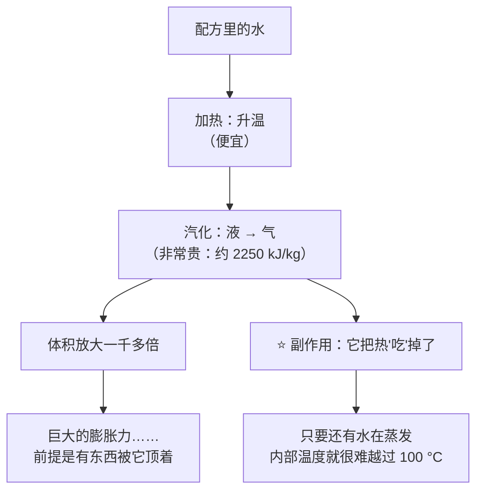
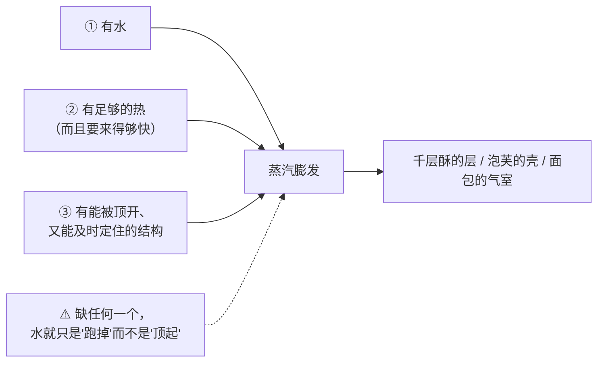
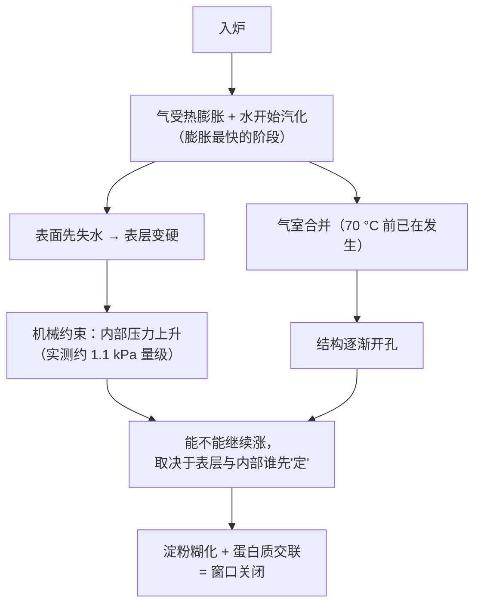

# 第 15 章 物理膨发二：蒸汽——泡芙与千层酥的原理

> **本章目标**：把"蒸汽膨发"从一句口号变成**三个必须同时成立的条件**：
>
> 1. **有水**——而且是能被加热到汽化的那部分水；
> 2. **有热**——汽化要花掉大量的能量，所以蒸汽产气总是**来得晚**；
> 3. **有能被顶开的东西**——一层结构，既挡得住蒸汽，又能被它撑开，还要在它散掉之前定住。
>
> 第 14 章的气是**你搬进去的**；本章的气是**配方里本来就有的水变的**。
> 它是三条路线里**单位质量膨胀最猛的一条**，也是**要求最苛刻的一条**。

## 15.1 一克水能变出多少气

先把物理放在前面。按美国 NIST 的水的饱和性质数据：

| 状态 | 每千克水占的体积 | 换算 |
|------|----------------|------|
| 液态水（约 91 °C） | 约 **0.00104 m³** | 1 g 水 ≈ 1 mL |
| 饱和水蒸气（约 91 °C） | 约 **2.24 m³** | 1 g 水 ≈ 2240 mL |
| 饱和水蒸气（约 102.5 °C） | 约 **1.54 m³** | 1 g 水 ≈ 1540 mL |

也就是说，**在接近 100 °C 的常压条件下，水变成蒸汽时体积放大一千多倍**[^1]
（温度越低、压力越低，这个倍数越大）。

**但这件事很贵**：同一份数据里，水的汽化焓在这个温度区间约 **2250~2280 kJ/kg**，
而把 1 kg 液态水从 20 °C 加热到 100 °C 只需要约 **335 kJ**——
**汽化要花掉"烧开它"的六七倍能量。**

这解释了第 10 章提过的一条实测：一项用计算流体力学模拟面包烘烤的研究引入蒸发—冷凝机制后，
**模拟中面包芯温度不会越过 100 °C**，约 25 分钟后稳定在 98 °C 左右。
另一项汉堡面包的验证研究实测**面包芯温度在最初 8 分钟升到约 100 °C 并保持**。

> **第一条可迁移判断**：
> ## **蒸汽既是最强的气源，也是烤箱里的"温度上限"——只要还有水在蒸发，里面就热不上去。**
>
> 所以"外面都焦了里面还是生的"这件事，很多时候不是炉温不对，
> 而是**热量全被用来汽化水了**（第 21、28 章会继续讲）。

## 15.2 蒸汽产气的三个前提

第三个条件是最容易被忽略、也是本章真正的主题：**蒸汽本身没有形状**。
它必须被关在某个地方，才能把东西撑起来；关不住，它就只是**失重**——
第 3 章引过的那项吐司烘烤研究里，**炉温越高，跑掉的水越多**（该研究中失重从 35% 升到 47%）。

| 成品 | 蒸汽被关在哪里 | 定住它的是谁 |
|------|--------------|------------|
| 面包 | 发酵形成的气室（第 10 章） | 淀粉糊化 + 面筋蛋白交联（第 17、21 章） |
| 千层酥 / 可颂 | **面团层与油脂层交替形成的夹缝** | 面筋层 + 淀粉糊化 |
| 泡芙 | 一个**整体的中空腔** | 预糊化的淀粉糊 + 蛋的蛋白质凝固 |
| 饼干 | 基本关不住（低水分、结构疏松） | ——所以饼干几乎不靠蒸汽膨发 |

## 15.3 层：起酥类成品的全部秘密都在"维持"上

一篇关于**多层面团—油脂体系**的综述把这类产品的关键写成两句话：
① **建立面团与油脂交替的多层结构**；
② **在加工过程中维持这个结构，以便烘烤时蒸汽把层撑开**。

同一篇综述还非常坦率地写道：**蒸汽被困住并把层顶起来的确切机制，
以及油脂相在烘烤时释放出的水贡献了多少，目前仍不清楚。**

> **本书照实写**：起酥"靠蒸汽"是方向性的共识，**不是一个已经被定量描述的机制**。
> 凡是把它讲得非常精确的说法（"每一层之间有多少水""几层最好"），都要先问出处。

### 层数不是越多越好：一项能看见层的实验

有研究用**核磁共振成像**在醒发过程中直接看丹麦酥里的面团层、油脂层与气：

| 观察 | 内容 |
|------|------|
| 设计 | 真实尺寸的丹麦酥，**油脂层数从 4 层变到 12 层** |
| 关键结果 | **擀折到第 3 次之前，充气过程不受影响**（面筋网络与保气能力没有整体变化）；**从第 3 次擀折开始出现脱气效应**，此时面团层厚度中位数约 **750 µm** |
| 另一条 | 油脂层里出现"眼睛形"的气泡，其数量增长比油脂层数还快，但它们**贡献了不到 10% 的整体膨胀** |
| 还有一条 | 图像里有明显的"**缺油与断层**"，占预期油脂层总长度的 **7.7%**——烘焙师认为这是缺陷 |

另一项用响应面法优化**减脂千层酥**的研究把三个变量放在一起调：
**裹入油的量 × 油脂层数（50~200 层）× 最终面团厚度（1.0~3.5 mm）**，
结论是这三者**共同**决定成品的内外结构质量。

> **第二条可迁移判断**：
> ## **层的价值来自"隔开"，而隔开会在层变得足够薄时失效。**
>
> 所以"多擀几次会更酥"有一个**转折点**：越过它之后，
> 你不是在增加层，而是在**把层互相压穿**——脱气、断层、缺油都从这里开始。
> ⚠️ 那个转折点在你家是几次、几毫米，本书**不知道**：
> 上面的数字是**特定产品、特定设备**的实验，不是通用参数。

## 15.4 谁在关窗：定型来得比你想的早

蒸汽把层顶开，需要**层还能动**。而烤箱里有两件事同时在把窗口关上：

### ① 淀粉糊化

一项关于多层发酵酥皮的研究给了一句非常直接的话：
**完整淀粉的糊化会限制面团的起发与膨胀**；
而当用淀粉酶把一部分淀粉水解之后，**面团对气室膨胀的阻力下降，起发反而变好**。
该研究还发现：损伤淀粉增加会**让面筋分到的水更少**，从而增加层压面团的强度。

> 换句话说：**淀粉糊化既是"定住"的功臣，也是"涨不动"的原因**——
> 它到得越早，膨胀窗口关得越早（第 17 章会把这件事讲透）。

### ② 表皮变硬

有研究把**微型压力传感器 + 热电偶**埋进面团里，直接测烘烤时内部的压力：

| 观察 | 内容 |
|------|------|
| 压力上升 | 烘烤中压力最高升到约 **1.1 kPa**，主要归因于**变硬的表层对面团施加的机械约束** |
| 没测到的 | "气泡壁变硬导致压力上升"**没有被检测到** |
| 突然下降 | **70 °C 以前出现的压力骤降**被归因于**气室合并** |
| 一个重要结论 | 烘烤结束**之前**，面团内部压力就已经在各处趋于平衡——说明此时**已经是开孔结构**了 |
| 冷却时 | 冷却期间整个面包芯压力同步略降（约 −0.15 kPa），说明**表皮的透气性低于面包芯** |

配套的两项经典观察也指向同一个方向：

- 用**电阻加热**烘烤（几乎不形成表皮）时，两种原本组织差别很大的面粉，做出来的**组织都变细了**——
  研究者据此推论：**表皮形成带来的压力，是造成组织差异的原因之一**；
- **面包组织的粗细在烘烤的早期阶段就分化了**：烤到第 12 分钟时两份面团的气室分布已经不同，
  气室变大、壁变厚，说明**早期就发生了合并**。

> **第三条可迁移判断**：
> ## **蒸汽有没有用，取决于"表皮什么时候定住"——这才是欧包要喷水的真正理由。**
>
> 炉内加蒸汽并不是"把蒸汽灌进面包里"，而是**让表面晚一点干、晚一点硬**，
> 从而把膨胀窗口留得长一点（第 30 章会专门讲）。
> ⚠️ **家用蒸汽替代方案（放水碗、喷水）的定量效果，本书未核到**，只写方向。

## 15.5 炉内膨胀：蒸汽只是其中一股

"进炉之后还会再涨一截"这件事（**炉内膨胀**）常被整包归给蒸汽，其实至少有四股来源：

| 来源 | 证据 |
|------|------|
| 已有气体**受热膨胀** | 物理；第 10 章 |
| **酵母在炉内继续产气** | 一项用电阻加热炉（尽量不形成表皮）追踪 17 株酵母的研究：**醒发速度与炉内膨胀相关（r = 0.75）**；酵母**在约 50~65 °C 前仍有代谢活性**，到 66 °C 时活细胞降到约 30% |
| **溶解的 CO₂ 逸出**与**乙醇、水汽化** | 第 11 章引过的起酥点心研究：**发酵产生的 CO₂ 对成品高度的贡献大于烘烤时水与乙醇的蒸发** |
| **水汽化** | 一项用带仪表中试炉研究法棍的工作：**水蒸气有利于膨胀**，最大可达 **1.7 倍**，出现在**面包芯温度接近 90 °C** 时，对应内部压力约 **90 kPa** |

> 注意第三行与第四行放在一起时的含义：
> 在那项起酥点心研究里，**蒸汽的贡献小于发酵产气**。
> 所以"炉内膨胀主要是蒸汽撑起来的"这句话，**至少在有酵母的体系里不成立**。
> 蒸汽在**无酵母、无膨松剂**的体系（千层酥、泡芙）里才是主角。

## 15.6 泡芙：一个诚实的空白

按本书的查证纪律，这一节必须这样写：

> **本书没有核到任何一篇专门研究泡芙膨胀机制的同行评议论文。**
> 检索到的多是配方替代类研究（例如用某种蛋白浓缩物替换部分面粉后成品体积的变化），
> 以及专利文献。

所以下面这段是**机制推理**，本书明确标注为推理，不是实验结论：

| 泡芙工艺的这一步 | 按前面各章的原理，它在做什么 |
|----------------|---------------------------|
| 把水（或水 + 奶）与油脂煮沸后加入面粉、**在锅里搅成糊** | 在**水多、温度高**的条件下让淀粉糊化（第 17 章）——这是少数几个"**先糊化再进炉**"的体系 |
| 糊稍凉后**分次加入大量蛋** | 蛋带来水（继续供应蒸汽的原料）、蛋白质（进炉后凝固成壳）与乳化（第 6 章） |
| 面糊很稀，**却能保持挤出的形状** | 已经糊化的淀粉提供了黏度 |
| 入炉后**中间形成一个大空腔** | 蒸汽把一整块可流动的糊顶起来；因为没有层、也没有大量气室，它只能撑出**一个**腔 |
| 烤到后期必须**继续烤干** | 壳要靠失水与蛋白质凝固**定住**；没定住就会塌——这与第 10 章"窗口由定型时刻关闭"一致 |
| "中途开炉门会塌" | 与"表层定住之前不能泄压"一致。⚠️ 本书**未核到**关于开炉门影响的实验，按**工艺口语**处理 |

> **为什么本书愿意留这个空白**：泡芙是烘焙圈"讲得最玄"的品类之一
> （"必须煮到锅底结膜""蛋要一个一个加到某个状态"）。
> 这些说法**可能都是对的**，但本书**没有能引用的实验**——
> 与其编一套听起来专业的解释，不如把它标成推理，让你知道哪部分是有依据的、哪部分不是。

## 15.7 三条路线的收尾对照

| | 生物膨发 | 化学膨发 | 物理膨发（打发） | 物理膨发（蒸汽） |
|---|---------|---------|----------------|----------------|
| 气从哪来 | 酵母代谢 | 碱 + 酸反应 | 你搬进去的空气 | 配方里的水汽化 |
| 产气高峰在什么时候 | 发酵与醒发期（入炉后短暂延续） | 遇水 + 受热两段 | **全部在入炉之前** | **几乎全在入炉之后** |
| 能不能后补 | 能（给时间） | 不能（拌好就开始） | 不能 | 不能 |
| 主要失败模式 | 发过头 / 发不动 | 配平错、时机错 | 泡沫活不到定型 | 关不住 / 定型太早 |
| 留下的味道 | 明显（酸、酯、醇） | 有残留（盐、pH） | 基本没有 | 没有 |

## 15.8 常见说法辨析

按本书约定标注**证据强度**：✅ 有共识 / ⚠️ 有争议 / ❌ 明确错误 / 缺乏证据。

| 说法 | 判定 | 说明 |
|------|------|------|
| "**水变成蒸汽体积会膨胀一千多倍**" | ✅ **有共识**（物理量） | 按 NIST 水的饱和性质数据：约 91 °C 时饱和蒸汽比容约 **2.24 m³/kg**、约 102.5 °C 时约 **1.54 m³/kg**，液态水约 **0.00104 m³/kg**。⚠️ 但**"膨胀一千倍"不等于"成品涨一千倍"**——绝大部分蒸汽从表面跑掉了 |
| "**千层酥是靠油脂融化后留下的空隙起酥的**" | ⚠️ **只说了一半** | 综述的表述是：层要被**维持住，以便烘烤时蒸汽把层撑开**；油脂的作用是**隔开层**（第 5 章）。而且同一篇综述明说：**蒸汽被困住并把层顶起的确切机制，以及油脂相释放的水贡献多少，仍不清楚** |
| "**层擀得越多越酥**" | ❌ **有转折点** | MRI 研究观察到：**从第 3 次擀折开始出现脱气效应**（此时面团层厚度中位数约 750 µm）；另一项研究把层数（50~200）、终厚（1.0~3.5 mm）与裹入油量放在一起优化，说明三者是**共同**决定质量的。⚠️ 具体转折点随配方与设备而变 |
| "**炉内膨胀主要靠蒸汽**" | ⚠️ **分体系** | 在有酵母的体系里未必：一项起酥点心研究测得**发酵产生的 CO₂ 对成品高度的贡献大于烘烤时水与乙醇的蒸发**；另有研究显示酵母**在炉内继续产气**（醒发速度与炉内膨胀相关 r = 0.75）。蒸汽在**无酵母体系**（千层酥、泡芙）里才是主角 |
| "**喷蒸汽是为了让面包吸水变软**" | ❌ **方向错了** | 蒸汽的作用是让**表面晚一点干、晚一点硬**，把膨胀窗口留长。实测支持：内部压力上升主要来自**变硬表层的机械约束**；而用几乎不形成表皮的电阻加热炉烘烤时，组织会变细 |
| "**面包芯能烤到 150 °C 以上**" | ❌ **只要还有水就很难** | 模拟研究引入蒸发—冷凝机制后**芯温不越过 100 °C**（约 98 °C 稳定）；实测的汉堡面包芯温在最初 8 分钟升到约 100 °C 并保持。汽化吸收的能量（约 2250 kJ/kg）就是那道"天花板" |
| "**泡芙必须把面糊煮到锅底结出一层膜**" | **缺乏证据** | 本书**未核到**任何专门研究泡芙的同行评议实验。按**工艺口语**处理：它大致对应"让淀粉充分糊化、让水分蒸发到合适程度"，但**"结膜"与成品的定量关系没有依据** |
| "**烤泡芙 / 舒芙蕾中途绝对不能开炉门**" | ⚠️ **机制合理，缺实验** | 与"表层定住之前不能泄压、不能降温"一致，也与压力实测（压力主要来自表层约束）方向相符，但本书**未核到**开炉门的对照实验。可自己做（本章实操任务三） |
| "**蒸汽膨发不需要膨松剂，所以更健康 / 更天然**" | ⚠️ **超出本书范围** | 工艺上能说的是：蒸汽体系**不留残留物、不带风味**（与化学膨发相反，第 13 章）。**健康与营养评价不在本书范围内** |
| "**面团含水量越高，蒸汽越多、涨得越大**" | ⚠️ **有上限，还有代价** | 水多确实意味着可汽化的水更多，但第 3 章引过的研究显示：**加水到一定程度后面筋纤维在发酵中断裂**（该研究在 55% 时观察到），保气能力下降。**这是一次配平改动**：水同时被面筋、淀粉和蒸汽争夺 |

## 15.9 🔎 下次烤之前的用处

1. **做起酥类之前，先决定"层"怎么保**：低温、快手、面团与油脂软硬相当。
   层一旦被压穿，后面所有步骤都救不回来。
2. **别用"擀折次数"当质量指标**。有转折点，而且你家的转折点要自己试出来。
3. **成品不起层时，先分清是"没顶起来"还是"顶起来又塌了"**：
   前者查层（有没有被压穿、油脂是不是被吸进面团）；后者查定型（炉温、时间、含水量）。
4. **把"外面焦了里面没熟"当成热量分配问题**，而不是单纯的炉温问题——
   汽化在吃热量，而且芯温很难越过 100 °C。
5. **泡芙塌了，先想"壳有没有烤干"**，而不是"有没有开炉门"——
   后者本书没有实验依据，前者与"定型时刻"这条原理一致。
6. **想给家用烤箱加蒸汽，先想清楚你要的是"表皮晚点定住"**。
   ⚠️ 各种家用替代方案的效果本书没有定量数据，**做的时候请注意烫伤与炉门玻璃的风险**。
7. **把"入炉前高度"和"炉内涨幅"分两列记进[烘焙记录表](../../forms/bake-log.md)**（第 11 章的做法）——
   蒸汽的贡献只体现在第二列。

## 15.10 思考题

1. 为什么说蒸汽"既是最强的气源，又是烤箱里的温度上限"？请用汽化焓解释。
2. 蒸汽膨发的三个前提是什么？为什么第三个前提（有能被顶开的结构）最容易被忽略？
3. MRI 研究观察到"**从第 3 次擀折开始出现脱气**"。
   这条结论支持什么、**不支持**什么？你会怎么用它来指导自己擀千层？
4. 一项研究测得烘烤时面团内部压力上升"主要来自变硬表层的机械约束"，
   而"气泡壁变硬导致的压力上升没有被检测到"。这两条分别推翻了哪种常见解释？
5. **【案例】** 某人做可颂，成品**层次不清、底部有一层实心、口感发面包而不发酥**。
   他回忆：室温偏高，裹入油在操作中变软、面团擀开时能看到油"渗"进面团。
   （a）用本章的"层 = 隔开"解释这三个现象各自的来源；
   （b）他打算把擀折次数从 3 次增加到 5 次来"补层次"，你预测会怎样？
   （c）给出两条更可能有效的改法，并说明代价。
6. **【案例】** 某人做千层酥，出炉时很漂亮，**放凉后明显回缩变实**。
   （a）用"膨胀窗口 → 定型"这条链解释；
   （b）他该先怀疑哪两项？分别怎么验证？
7. **【辨析】** "炉内膨胀主要靠蒸汽"——判断证据强度，并说明它在哪些体系里成立、哪些不成立。
8. **【辨析】** "泡芙必须煮到锅底结膜"——判断证据强度，
   说明本书为什么把泡芙的机制标成"推理"，以及这对你读其他泡芙教程有什么提示。

> 📖 **参考答案**（想清楚再看）：[Q1](../../qa/15-steam-qa.md#q1) ·
> [Q2](../../qa/15-steam-qa.md#q2) · [Q3](../../qa/15-steam-qa.md#q3) ·
> [Q4](../../qa/15-steam-qa.md#q4) · [Q5](../../qa/15-steam-qa.md#q5) ·
> [Q6](../../qa/15-steam-qa.md#q6) · [Q7](../../qa/15-steam-qa.md#q7) ·
> [Q8](../../qa/15-steam-qa.md#q8)

## 15.11 本章实操

### 🅐 零成本版 · 任务一：给三份配方算"可汽化的水"

不用烤箱。找三份配方：一份靠蒸汽为主（千层酥 / 泡芙）、一份靠酵母、一份靠化学膨松。
**一律以面粉总量为 100%** 换算（第 9 章）。

| | 配方 A | 配方 B | 配方 C |
|---|-------|-------|-------|
| 品类 / 主气源 | | | |
| 水（%） | | | |
| 奶、蛋等**带水的原料**（%，并估计它们带了多少水） | | | |
| 油脂（%） | | | |
| 你估计的"总含水"（%） | | | |
| 配方里**有没有能关住蒸汽的结构**？是什么？ | | | |
| 这份配方的气**主要在入炉前还是入炉后**产生？ | | | |

> ⚠️ **诚实提醒**：奶与蛋的含水量本书**不给数字**（未核到可引用的官方数值，已登记为缺口）。
> 这一栏写"估计"就好，重点是**意识到它们也带水**，而不是算得精确。

回答：

| 问题 | 你的答案 |
|------|---------|
| 三份里哪一份的气"最不能后补"？为什么？ | |
| 靠蒸汽的那一份，如果减 10% 的水，你预测会先出什么问题？ | |
| 哪一份配方的**失败会发生在入炉之后**？这对操作节奏意味着什么？ | |

### 🅐 零成本版 · 任务二：读一份商品千层酥的配料表

买一份商品可颂或千层酥（或只看包装配料表），回答：

| 问题 | 你的答案 |
|------|---------|
| 配料表里的油脂是什么？它是固态还是液态来源？ | |
| 有没有酵母？如果有，说明它是"蒸汽 + 生物"双气源，这会改变什么？ | |
| 掰开看横截面：层是**清晰分离**还是**糊在一起**？ | |
| 如果层糊在一起，按本章内容，最可能是哪一步出的问题？ | |

### 🅑 开火版 · 任务三：表皮定住的时间（有烤箱时做）

**唯一变量**：烘烤初期的表面湿度。用同一份简单面团（或同一份泡芙糊）分两组，
其余全部一致、同时入炉（分两层烤时要交换位置以抵消热点差异）。

| 组 | 处理 | 入炉前高度 | 出炉高度 | **炉内涨幅** | 表皮出现明显硬化的时间 | 组织 |
|----|------|-----------|---------|------------|---------------------|------|
| ① 常规烘烤 | | mm | mm | mm | 分钟 | |
| ② 入炉初期设法让表面更湿（按你现有条件，注意安全） | | mm | mm | mm | 分钟 | |

> **怎么读**：只看**炉内涨幅**这一列，不要看出炉高度——
> 入炉前高度不同会掩盖差异。
>
> ⚠️ **局限**：家用烤箱很难控制湿度，两组之间往往还差着温度。
> **这个实验给方向，不给定量**，而且本书**没有核到**家用蒸汽方案的定量数据。
>
> ⚠️ **安全提醒**：往热烤箱里加水会产生大量蒸汽，**有烫伤与玻璃炸裂风险**；
> 请按你的烤箱说明书来，不确定就别做这一组，只做 ① 组并记录表皮硬化时间。

### 🅑 开火版 · 任务四（加分）：擀折次数对照

**唯一变量**：擀折次数。同一块面团分两份。

| 组 | 处理 | 横截面层是否清晰 | 高度 | 底部有无实心层 | 口感（酥 / 韧 / 发面包） |
|----|------|---------------|------|--------------|---------------------|
| ① 按配方的次数 | | mm | | | |
| ② 比配方**多两次** | | mm | | | |

> **怎么读结果**：若 ② 组反而层次更糊、底部更实，你就看到了 15.3 里那个**转折点**。
> 若 ② 组更好，说明你原来的次数还没到转折点——**这正是要自己试的原因**。
>
> ⚠️ **局限**：擀折次数增加的同时，面团在室温下待的时间也变长了，
> **温度这个变量没被控制住**。要更干净，就把两组的操作时间也记下来。
>
> ⚠️ **安全提醒**：不要尝生面团（美国 FDA：生面粉不是即食食品）。

## 15.12 本章依据

本章引用的来源与核对状态详见[参考书目与出处登记](../../standards.md)，具体对应如下：

| 本章用到的内容 | 依据 |
|--------------|------|
| 水的**饱和液体与饱和蒸汽比容**（约 91 °C：0.00104 与 2.24 m³/kg；约 102.5 °C：1.54 m³/kg）与**汽化焓约 2250~2280 kJ/kg**；液态水的比热用于估算"烧开 1 kg 水约 335 kJ" | 美国 NIST *Chemistry WebBook* 水的热物性（饱和曲线）数据，✅ 已核到官方数据库输出。**本章"一千多倍"与"汽化很贵"两条的唯一依据** |
| 引入蒸发—冷凝机制后**面包芯温度不越过 100 °C**，约 25 分钟后稳定在 98 °C 左右 | *Food Research International* 2011 面包烘烤的计算流体力学模拟研究，✅ 摘要层面（第 10 章已登记） |
| 实测**面包芯温度在最初 8 分钟升到约 100 °C 并保持** | *Journal of Food Protection* 2016 汉堡面包烘烤杀灭沙门氏菌的验证研究，✅ 摘要层面（第 10 章已登记）。⚠️ 工业条件下的特定产品 |
| 起酥类产品的关键是**建立并维持多层结构以便烘烤时蒸汽把层撑开**；**蒸汽被困住并顶起层的确切机制、油脂相释放的水贡献多少仍不清楚** | *Critical Reviews in Food Science and Nutrition* 2016 多层面团—油脂体系综述，✅ 摘要层面（第 10 章已登记）。**本章"照实写空白"的依据** |
| 丹麦酥醒发过程的 MRI 观察：油脂层 **4~12 层**；**擀折到第 3 次之前充气不受影响，从第 3 次开始出现脱气**（面团层厚度中位数约 **750 µm**）；油脂层中"眼睛形"气泡贡献**不到 10%** 的整体膨胀；图像中缺油与断层占预期油脂层总长的 **7.7%** | *Journal of Food Engineering* 2017 丹麦酥层与气泡的定量 MRI 研究，✅ 摘要层面。**"层不是越多越好"的实测依据**；⚠️ 特定产品与设备 |
| 减脂千层酥的三变量优化：**裹入油量 × 油脂层数（50~200）× 最终厚度（1.0~3.5 mm）** 共同显著影响成品内外结构 | *Foods* 2017 响应面法优化减脂千层酥的研究（开放获取），✅ 摘要层面。⚠️ 数值是**实验设计范围，不是推荐参数** |
| **完整淀粉的糊化限制面团起发与膨胀**；淀粉酶水解使面团对气室膨胀的阻力下降、起发变好；**损伤淀粉增加使面筋可用水减少、层压面团强度增加** | *Journal of Food Science* 2018 多层发酵酥皮中完整与损伤淀粉及淀粉酶作用的研究，✅ 摘要层面。**"定型关窗"在起酥体系里的直接证据** |
| 烘烤时面团内部压力实测：升压最高约 **1.1 kPa**，**主要来自变硬表层的机械约束**；**未检测到**气泡壁变硬引起的升压；**70 °C 前的压力骤降归因于气室合并**；烘烤结束前压力已在面团内趋于平衡（**开孔结构**）；冷却时全芯同步降压约 **−0.15 kPa**，说明**表皮透气性低于面包芯** | *Journal of Cereal Science* 2010 烘烤过程中局部压力与温度联合测量的研究，✅ 摘要层面。**本章 15.4 的主要数据源** |
| 用**电阻加热炉**（几乎不形成表皮）烘烤时，原本组织差别很大的两种面粉做出的**组织都变细**；据此推论**表皮形成造成的压力**是组织差异的原因之一 | *Cereal Chemistry* 1998 关于压力（表皮形成）对面包组织影响的研究，✅ 摘要层面 |
| **面包组织的粗细在烘烤早期就分化**：第 12 分钟时两份面团的气室分布已不同，气室变大、壁变厚，说明**早期发生合并** | *Cereal Chemistry* 1998 关于面包组织在烘烤中发育的研究，✅ 摘要层面（Crossref 题录与摘要） |
| 酵母在炉内的贡献：**醒发速度与炉内膨胀相关（r = 0.75）**；酵母**在约 50~65 °C 前仍有代谢活性**，66 °C 时活细胞约 **30%** | *Food Chemistry* 2026 用电阻加热炉研究烘烤中酵母表现的研究，✅ 摘要层面。⚠️ **特定炉型与菌株**，不可外推为"酵母的死亡温度" |
| **发酵产生的 CO₂ 对成品高度的贡献大于烘烤时水与乙醇的蒸发** | *Foods* 2022 糖含量决定酵母起酥点心发酵动力学的研究（开放获取），✅ 已核（第 11 章已登记） |
| **水蒸气有利于膨胀**，膨胀最大可达 **1.7 倍**，出现在**面包芯温度接近 90 °C** 时，对应内部压力约 **90 kPa** | *Journal of Food Engineering* 2005 带仪表中试炉研究法棍烘烤的工作，✅ 摘要层面（第 10 章已登记） |
| **炉温越高，烘烤失重越多**（该研究中 35.11% → 47.23%） | *Food Science & Nutrition* 2021 吐司烘烤失重与表皮温度建模研究，✅ 开放获取（第 3 章已登记）。⚠️ 单一产品、固定时长 |
| 加水到一定程度后**面筋纤维在发酵中断裂**（该研究中 55%，面粉基准） | *International Journal of Biological Macromolecules* 2024 中式馒头水合水平研究，✅ 摘要层面（第 3 章已登记） |
| 生面粉与生面团的安全 | 美国 FDA「Handling Flour Safely」，✅ 已核到官方页面。⚠️ 各国口径不同 |
| **泡芙（choux）的膨胀机制** | ⚠️ **未核到**任何专门的同行评议实验。本章相关内容**明确标注为机制推理**，并把"煮到结膜""不能开炉门"按**工艺口语**处理 |
| **家用烤箱蒸汽替代方案的定量效果** | ⚠️ **未核到**（第 3 章已登记该缺口）；只写方向（让表面晚一点干），不给操作参数 |
| **牛奶、鸡蛋的含水量** | ⚠️ **未核到**可直接引用的官方数值（第 3、6、9 章已登记）；实操表里只让读者"估计"，不给数字 |
| **"擀折多少次最好""层要多厚"的通用参数** | ⚠️ **不给**：已核到的数字都是特定产品与设备的实验设计；本书改为给"转折点存在"的方向与自测方法 |

[^1]: [蒸汽膨发](../../glossary.md#steam-leavening)（steam leavening）与[炉内膨胀](../../glossary.md#oven-spring)（oven spring）
在第 8、10 章已出现。本章新出现的术语：[汽化焓](../../glossary.md#latent-heat)（enthalpy of vaporization）、
[裹入油](../../glossary.md#roll-in-fat)（roll-in fat）、[擀折与开酥](../../glossary.md#sheeting)（sheeting / laminating）、
[开孔](../../glossary.md#cell-opening)（cell opening）。

---

**第二部分到此讲完三条路线。** 接下来是项目 P2：
把生物、化学、物理三条路线放进**同一张对照表**里，
产出一份你以后看任何配方都能查的"**气从哪来 / 靠什么留住 / 失败长什么样**"清单。
