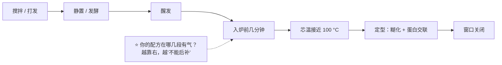

# 🛠 项目 P2：三条膨发路线的对照——同一个目标，三种做法

> **这是第二部分的收尾项目。**
>
> 第 10 章给了模型（**产气 × 保气，窗口由定型时刻关闭**），
> 第 11~15 章分别把生物、化学、物理三条路线塞进这个模型里。
> 这个项目要做的，是把它们**摆到同一张表上**——
> 因为在真实的配方里，你面对的从来不是"一条路线"，而是**"这份配方用了哪几条、各占多少"**。

**交付物**：下面的 **对照表 ①~④** + 一份属于你自己的「气源速查卡」。
**做完你会拥有**：拿到任何一份配方，五分钟内说出"它的气从哪来、会从哪漏、失败会长什么样"的能力。

## P2.0 准备

| 需要 | 说明 |
|------|------|
| **三份配方** | **刻意选不同气源**：一份靠酵母（面包 / 吐司）、一份靠化学膨松（马芬 / 司康 / 松饼）、一份靠打发或蒸汽（戚风 / 海绵 / 千层酥 / 泡芙） |
| 计算器 | 🅐 全程只用它 |
| 一把尺 | 只有 🅑 才用得上（量高度） |
| [烘焙记录表](../../forms/bake-log.md) | 🅑 用 |

> **选配方的一条建议**：**至少有一份是你做过、并且失败过的**。
> 失败的那一份在第四步（诊断）里最有价值。

## P2.1 第一步：拆气源（不是"它用了什么膨松剂"，而是"气在哪几个时刻产生"）

**基准声明**：本项目的所有比例一律**以配方中面粉总量为 100%**；
没有面粉的配方（例如某些蛋白霜）在备注里写明你用的是什么基准。

**交付表 ①：三份配方的气源清单**

| | 配方 A | 配方 B | 配方 C |
|---|-------|-------|-------|
| 品类 | | | |
| 酵母（%，写明形态） | | | |
| 小苏打 / 泡打粉（%） | | | |
| 打发的对象（蛋清 / 全蛋 / 黄油 / 奶油 / 无） | | | |
| 配方总含水（估计，%） | | | |
| **气源 1**（主） | | | |
| **气源 2**（次） | | | |
| **气源 3**（常被忘：受热膨胀、蒸汽） | | | |

> ⭐ **本表的关键**：**几乎每份配方都不止一个气源**。
> 常被漏掉的两个是：**已有气体的受热膨胀**（一定有）和**水汽化**（只要有水就有）。
> 漏掉它们，你就会把所有问题都怪到膨松剂头上。

**交付表 ②：气在什么时候产生**

在下面这条时间轴上，给每份配方**标出它的气分别在哪几段产生**（打勾即可）。

| 阶段 | 配方 A | 配方 B | 配方 C | 这一段的典型气源 |
|------|-------|-------|-------|----------------|
| 搅拌 / 打发时 | | | | 夹带的空气；快作用酸 |
| 静置 / 发酵时 | | | | 酵母；快作用酸的余量 |
| 醒发 / 整形后 | | | | 酵母 |
| 入炉最初几分钟 | | | | 受热膨胀；酵母最后的活性；慢作用酸 |
| 芯温升到接近 100 °C 时 | | | | **水汽化** |
| 定型之后 | | | | **没有了**——窗口已经关闭 |

## P2.2 第二步：拆保气（三条路线共用的那一半）

**交付表 ③：谁在关住气**

| | 配方 A | 配方 B | 配方 C |
|---|-------|-------|-------|
| 关住气的主要结构（面筋 / 面糊黏度 / 泡沫界面膜 / 层 / 脂肪晶体网络） | | | |
| 配方里**削弱**保气的原料（油脂、糖、过多的水…） | | | |
| 配方里**加强**保气的原料（蛋白质、更强的粉、胶体…） | | | |
| 定型主要靠什么（淀粉糊化 / 蛋白质凝固 / 脂肪凝固） | | | |
| 从"气最多"到"进炉"之间有多长时间 | | | |
| 你判断它**最可能从哪里漏气** | | | |

> **提示**：第 10 章那条实测——某项研究把发酵终点统一到**产气 400 mL** 之后，
> **不同菌株的炉内膨胀仍然不同，膨胀更大的气室数量更多**——
> 说的正是这一栏：**产气一样，保气不一样，结果就不一样。**

## P2.3 第三步：做出那张对照表（本项目的核心交付物）

把三条路线填进这张表。**允许你写"不知道"**——不知道的地方就是你下一步要查或要试的地方。

**交付表 ④：三条路线对照**

| 维度 | 生物膨发（酵母 / 酵种） | 化学膨发（碱 + 酸） | 物理膨发（打发 / 蒸汽） |
|------|----------------------|-------------------|----------------------|
| **气从哪来** | | | |
| **产气高峰在哪一段** | | | |
| **能不能"后补"** | | | |
| **靠什么留住** | | | |
| **时间尺度** | | | |
| **温度敏感性** | | | |
| **会不会留下味道 / 残留** | | | |
| **典型失败现象 ①** | | | |
| **典型失败现象 ②** | | | |
| **失败时先查什么** | | | |
| **这条路线在我常做的成品里出现吗** | | | |

参考答案不在这里给——**先自己填**，填完再回头对照第 11~15 章各自的
「一条可迁移的判断规则」与 15.7 的收尾对照表。

## P2.4 第四步：把一次失败塞进模型

挑你做过的那份**失败过的**配方，做一次归因。

| 项目 | 你的记录 |
|------|---------|
| 成品实际长什么样（高度、组织、颜色、口感） | |
| 第一反应认为的原因 | |
| **按模型重新问**：是产气不足，还是保气失败？ | |
| 判据是什么（你凭什么这样判断） | |
| 如果是产气：哪一段的气没产出来？ | |
| 如果是保气：从哪里漏的？什么时候漏的？ | |
| **下一次只改哪一个变量** | |
| 怎么验证这次改动有效（看哪个数字） | |

> ⭐ **这一栏最值钱**：**"下一次只改哪一个变量"**。
> 一次改三样，你永远不知道是哪一样起了作用——这是本书所有 🅑 实验的共同纪律。

## P2.5 第五步：写你自己的「气源速查卡」

把它写在一张纸上，贴在厨房，或者抄进[配方解码表](../../forms/recipe-decode.md)的备注栏。

| 我常做的成品 | 主气源 | 它最怕什么 | 我的判据（看什么现象） |
|------------|-------|-----------|---------------------|
| | | | |
| | | | |
| | | | |
| | | | |

**填法示例的思路**（不是答案，是问法）：

- "最怕什么"填的是**这条路线特有的弱点**：
  酵母怕温度与盐（第 11 章）、化学膨松怕配平与时机（第 13 章）、
  打发怕等待与油脂（第 14 章）、蒸汽怕关不住与定型太早（第 15 章）；
- "我的判据"填的是**你能亲眼看到的现象**，不是时间。
  例如"入炉前高度 vs 炉内涨幅两列"（第 11 章）、"盆底有没有积液"（第 14 章）、
  "横截面层清不清楚"（第 15 章）。

## P2.6 🅐 零成本版：到这里就已经完成了

**🅐 版的交付物**：表 ①~④ + 速查卡 + 一次失败归因。
**全程不用开火**，用的全是"读配方 + 换算 + 预测"。

> **做完可以自测一下**：随便再找一份没分析过的配方，
> **五分钟内**说出它的三个气源、最可能的漏气点、以及"如果它失败了我先查什么"。
> 说得出来，第二部分就算过了。

## P2.7 🅑 开火版：一次实验，三条路线（有烤箱时做）

**目标**：用**同一个成品目标**（例如"一块能吃的小圆饼 / 小蛋糕"），
做三组**气源不同**的版本，亲眼看差别。

> ⚠️ **这不是让你比出"哪条路线最好"**——它们本来就不是同一个成品。
> 要比的是**失败模式**和**对操作的敏感度**。

| 组 | 气源 | 入炉前高度 | 出炉高度 | **炉内涨幅** | 组织 | 味道 | 出了什么问题 |
|----|------|-----------|---------|------------|------|------|------------|
| ① 酵母版 | 生物 | mm | mm | mm | | | |
| ② 泡打粉版 | 化学 | mm | mm | mm | | | |
| ③ 打发版（全蛋或蛋清） | 物理 | mm | mm | mm | | | |

**记录纪律**（照抄第 11 章）：

1. **入炉前高度**与**炉内涨幅**分两列记——只记出炉高度会把两件事混在一起；
2. 每组**同一个模具、同一炉、同一温度**；分层烤要中途交换位置；
3. 把当天的**室温**记下来——它对 ① 和 ③ 的影响完全不同。

做完回答：

| 问题 | 你的答案 |
|------|---------|
| 哪一组的**炉内涨幅**最大？这符合你在表 ② 里的预测吗？ | |
| 哪一组对"等待时间"最敏感？ | |
| 哪一组对"室温"最敏感？ | |
| 三组的味道差别有多大？这对应第 13、15 章的哪一条？ | |
| 如果让你只用一句话向别人解释三条路线的差别，你会怎么说？ | |

> ⚠️ **安全提醒**：不要尝生面糊与生面团（美国 FDA：生面粉不是即食食品；
> 含蛋配方还有生蛋风险，含蛋食品应彻底做熟）。⚠️ 各国口径不同，以当地现行发布为准。

## P2.8 交付物检查清单

| 交付物 | 完成 |
|--------|------|
| 表 ①：三份配方的气源清单（含"常被忘的第三个气源"） | ☐ |
| 表 ②：气在时间轴上的位置 | ☐ |
| 表 ③：谁在关住气 + 最可能的漏气点 | ☐ |
| 表 ④：三条路线对照（允许有"不知道"） | ☐ |
| 一次失败归因（含"下次只改哪一个变量"） | ☐ |
| 我的气源速查卡 | ☐ |
| 🅑：三组对照实验记录（含入炉前高度与炉内涨幅两列） | ☐ |

---

**第二部分到此结束。** 你现在应该能回答"东西为什么发起来、为什么发不起来"。

接下来的**第三部分**回答下一个问题：
**它发起来之后，凭什么不塌回去？**——结构是怎么立住的。
