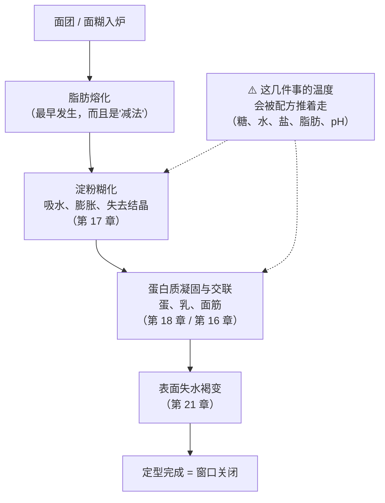
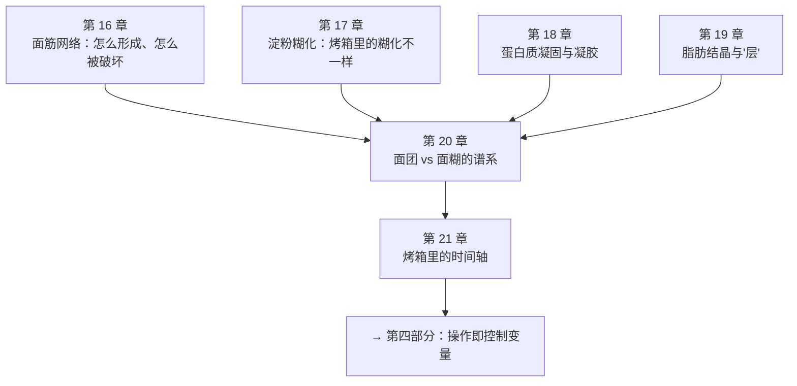

# 第三部分 · 结构是怎么立住的

> **这一部分只回答一个问题**：**东西发起来之后，凭什么不塌回去。**
>
> 第二部分把"发"讲完了：气从哪来（三条路线）、被什么关住（保气）。
> 但第 10 章的模型里还有一个词一直没有展开——**定型时刻**。
> 它既是膨发窗口的终点，也是这一部分的全部主题。

## 为什么"结构"值得单独学一遍

因为烘焙里最常见的两类失败，长得很像，原因却相反：

| 现象 | 可能是 | 属于 |
|------|-------|------|
| 出炉就矮 | 根本没撑起来 | **膨发问题**（第二部分） |
| 炉里很高、出炉就塌 / 放凉就缩 | 撑起来了，但**没定住** | **结构问题**（这一部分） |

> **诚实说明**：这两类问题在厨房里常被混为一谈，
> 因为你看到的都是"不够高"。**分清它们，才谈得上改对地方。**
> 分辨的方法第 10 章给过：把**入炉前高度**与**炉内涨幅**分两列记。

## 这一部分的框架：四套机制，在不同温度上接力

结构不是由某一样原料提供的，而是**四套机制在升温过程中先后接力**的结果：

**四套机制分别是**：

| 机制 | 谁提供 | 在哪一章 |
|------|-------|---------|
| **面筋网络** | 面粉里的两类蛋白质 + 水 + 机械功 | 第 16 章 |
| **淀粉糊化与随后的凝胶** | 面粉里的淀粉 + 水 + 热 | 第 17 章 |
| **蛋白质凝固** | 蛋、乳，以及受热的面筋本身 | 第 18 章 |
| **脂肪的结晶与熔化** | 黄油、起酥油、油 | 第 19 章 |

然后第 20 章把它们放进一条**从硬面团到稀面糊的连续谱**里，
第 21 章把它们排进**烤箱里的那条时间轴**。

## 一条会反复出现的警告：这些温度不是硬边界

本书从第 4 章起就在重复一件事，这一部分会把它讲到底：

> ## **"淀粉在多少 °C 糊化""蛋在多少 °C 凝固"这类问题，在烘焙体系里没有单一答案。**
>
> 糖把糊化温度推高、低水分把它推得更高（第 4、17 章）；
> 酸让蛋黄更快凝、盐让它更晚凝、糖把变性温度推高（第 6 章）；
> 损伤淀粉让糊化起始温度更低（第 2 章）。

所以这一部分的写法是：**先讲机制与方向，再讲"你在自家厨房能观察到什么"**，
**不给单点温度**。凡是本书没能核到可靠出处的温度，都会明说（并登记进
[出处登记](../../standards.md)的「已知缺口」）。

## 这一部分的地图

## 各章一句话

| 章 | 它回答的问题 | 状态 |
|----|------------|------|
| [第 16 章 面筋网络](16-gluten-network.md) | 揉面到底在揉什么？什么时候算够？ | ✅ |
| [第 17 章 淀粉糊化](17-gelatinization.md) | 为什么饼干里的淀粉几乎不糊化？ | ✅ |
| 第 18 章 蛋白质凝固与凝胶 | 为什么"定住"之后就回不去了？ | ⬜ |
| 第 19 章 脂肪结晶与"层" | 为什么起酥必须用固态脂肪？ | ⬜ |
| 第 20 章 面团 vs 面糊的谱系 | 含水量与搅拌方式怎么决定成品类别？ | ⬜ |
| 第 21 章 烤箱里的时间轴 | 从入炉到出炉，到底按什么顺序发生？ | ⬜ |

## 学完这一部分，你应该能

1. 拿到一次失败，先判断它是**没撑起来**还是**撑起来没定住**；
2. 说出你这份配方**主要靠谁定型**（面筋？淀粉？蛋？脂肪？），
   以及配方里的糖、水、油把这个定型时刻往哪个方向推；
3. 不再问"多少 °C 糊化"这种没有前提的问题，
   而是问"**在我这个含水量、这个糖量下，它大概会在什么时候发生**"；
4. 把第二部分的"保气"和这一部分的"定型"接起来——
   它们本来就是同一场比赛的两端。
