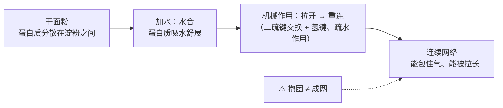
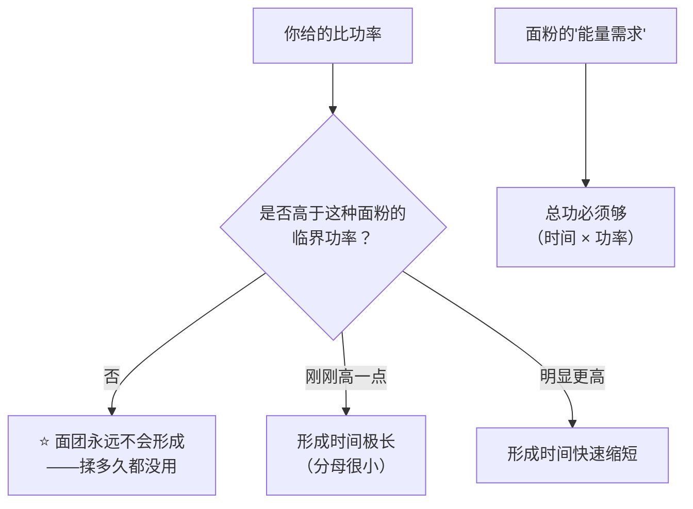
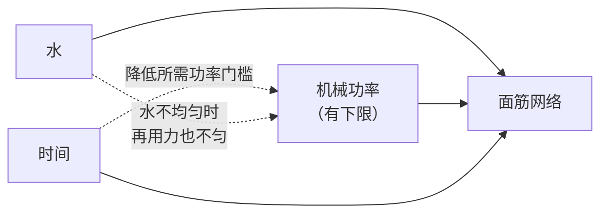
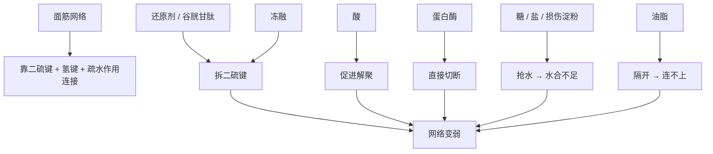

# 第 16 章 面筋网络：怎么形成、怎么被破坏

> **本章目标**：把"揉面"从"揉到手套膜"变成**三个可以分别调整的输入**：
>
> 1. **水**——没有足够的水，蛋白质连接触都做不到；
> 2. **功率**——不是"揉多久"，而是"**揉得多用力**"，而且有一条**下限**；
> 3. **时间**——它能替代一部分功，但替代不了全部。
>
> 第 2 章讲过面粉里有两类蛋白质（麦谷蛋白管强度、麦醇溶蛋白管延展）。
> 本章讲的是**它们怎么变成一张网**，以及**谁会把这张网拆掉**。

## 16.1 面筋不是面粉里的一种成分，是被"做出来"的

干面粉里没有面筋。面粉里有的是**分散在淀粉之间的两类蛋白质**，
它们要先**吸水**、再被**机械作用反复拉开与重连**，才会形成连续的网络[^1]。

有一项研究把这个过程拍得很清楚：用不同浓度的**面粉—水面糊**（30%、35%、40%、45%）做对照，
在显微镜下观察面筋蛋白的形态：

| 面糊浓度 | 面筋蛋白的形态 |
|---------|--------------|
| 30% | **分散的颗粒状** |
| 35%、40% | **成簇** |
| 45% | **形成连续网络** |

> **这条观察值得记住的原因**：它说明"有没有面筋"**不是有无问题，而是浓度问题**。
> 同一批面粉，兑得太稀，它就只能是一堆分散的颗粒——
> 这正是第 20 章"从硬面团到稀面糊"那条谱系的分子版本。

同一项研究还有一条更反直觉的结论：

> **面筋蛋白的"聚集程度"与"网络的连续性"之间并不是正相关。**
>
> 也就是说：**蛋白质抱团 ≠ 形成了一张能用的网。**
> 你在厨房里见过的"面团起筋了但一扯就断"，大概就是这种情况。

## 16.2 输入一：水——太少形不成，太多撑不住

第 3 章讲过"水到底去了哪里"：面筋、淀粉、糖都在抢同一批水。这里只补两条与面筋直接相关的：

- **水不够**：蛋白质来不及舒展，网络断断续续。这也是第 15 章那项酥皮研究的机制——
  **损伤淀粉增加会让面筋分到的水更少**，面团因此变强变硬（但那是"强"不是"好"）。
- **水太多**：第 3 章引过的中式馒头研究观察到，加水越多面筋分布越均匀、越呈纤维状，
  但**该研究在加水 55%（面粉基准）时看到发酵过程中面筋纤维发生断裂**。

> **可迁移的判断**：**水既是面筋形成的必要条件，也是稀释它的东西。**
> 所以"高含水量面团"买到的从来不是"更强的面筋"，而是**另一种结构策略**
> （更依赖时间、折叠与液膜——第 10 章讲过的"液膜稳定气室"）。

## 16.3 输入二：功率——这一节是本章最有用的一段

家里最常见的问题是"**揉多久才够**"。但有一项研究给出的答案是：
**问题问错了，该问的是"揉得多用力"。**

那项研究在行星搅拌机上做了很大范围的组合：
**含水量 68~125 mL / 100 g 面粉**、**转速 50~110 rpm**、多种面粉。
结果他们能用一个简单的式子预测**面团形成时间**：

> **面团形成时间 = （这种面粉的"能量需求"）÷（你给的比功率 − 这种面粉的"临界功率"）**

两个参数都是**面粉自身的性质**，而且研究发现：在考察的多项生化指标里，
**只有"不可提取的麦谷蛋白聚合物占总麦谷蛋白聚合物的比例"与这两个参数相关**。

这个式子有三条极其实用的推论：

| 推论 | 在厨房里意味着什么 |
|------|------------------|
| **存在一个功率下限** | 力气太小（手揉太轻、机器档位太低、面团量太少导致勾子打空）时，**揉一小时也不会有面筋** |
| **时间与功率不是等价交换** | "揉 10 分钟"这种指令**不可移植**：换一台机器、换一个档位，它就不成立 |
| **不同面粉的下限不同** | 与麦谷蛋白聚合物的状态有关——这也解释了为什么"同样揉法，换一袋粉就不一样" |

研究者还做了两件很有意思的事：加入**干扰巯基—二硫键的化学品**会**降低临界功率**；
而**在搅拌一开始加一个停顿**，同样**降低临界功率**。

> ⭐ **后面这一条，就是烘焙圈所说"自解法"（面粉与水先混匀静置一会儿再揉）的学术对应**。
> 它的意义不是"省力气"，而是：**先让水把蛋白质泡开，之后所需的机械功率门槛就降低了。**

研究者由此提出的机制假说是：面筋网络的形成依赖于**对"承力键"的机械激活**，
包括链间**二硫键**与**氢键**。

## 16.4 输入三：时间——它能替一部分功的班

有研究直接测了"**只是静置**"会发生什么：

| 观察 | 内容 |
|------|------|
| 水的分布 | 随静置时间延长**越来越均匀**，在 **60~120 分钟**之间趋于稳定；强结合水的比例上升 |
| 蛋白网络 | 共聚焦显微镜下**更致密、更均匀** |
| 分子结构 | α-螺旋增加（二级结构更有序）；离子键与氢键增强，疏水作用减弱 |
| 力学 | 松弛时间与残余应力下降（面团更"松弛"） |

另一项针对手工挂面面团的研究给了更直观的数字：在含水 60% 的那一组，
**静置从 0 分钟延长到 120 分钟，延展性从 64.33 mm 增加到 152.67 mm**；
同时含水量越低、静置越久，**麦谷蛋白大聚体含量越高、游离巯基越少**。

> ⚠️ **这两项研究做的是面条与馒头类面团**，不是面包。
> 本书引用它们只用于说明**方向**：**时间会让水分更均匀、网络更连续、面团更容易被拉长**。
> **"要静置多久"没有通用答案。**

> **第一条可迁移判断**：
> ## **面筋 = 水 × 功率 × 时间。三者可以互相替代一部分，但"功率"有下限，"水"有上限。**

## 16.5 搅拌过度：它是否有害，取决于含水量

"揉过头会把面筋揉断"是烘焙圈的常识，但本书核到的实验说的比这句话细：

在那项 30%~45% 面糊浓度的研究里，**延长搅拌的后果在不同浓度下方向相反**：

| 面糊浓度 | 延长搅拌后 |
|---------|-----------|
| **30% 与 45%** | 面筋聚集指数**下降**，麦谷蛋白大聚体减少、黏度上升、tan δ 上升 |
| **35% 与 40%** | 趋势**相反**：麦谷蛋白大聚体**增加**，β-折叠与 α-螺旋比例升高，麦谷蛋白与麦醇溶蛋白之间通过氢键与疏水作用明显聚集 |

另有一项研究用三档转速（63、120、200 rpm）把面团打到不同的**功输入**（10%~180% wh/kg），
观察到**机械发展确实改变了面筋在成品中的表面积与宏观结构**。

> **第二条可迁移判断**：
> ## **"搅拌过度"不是一个绝对状态，它是"在这个含水量下，你已经越过了那个转折点"。**
>
> 这也是为什么高含水量面团常用**折叠**代替长时间搅拌：
> 同样是给能量，方式不同、代价不同（第 22 章会展开）。

## 16.6 谁在拆这张网

面筋网络的连接里，**二硫键**是最关键的一类。凡是能干扰它的，都能削弱面筋：

| 破坏者 | 机制 | 证据 |
|--------|------|------|
| **还原剂**（L-半胱氨酸等） | 提高游离巯基、把麦谷蛋白大聚体拆散 | 一项研究里加入 L-半胱氨酸盐酸盐后延展性**先升后降**，在 0.0225% 附近出现极值——**说明它是剂量依赖的，不是"加了就更好拉"** |
| **酵母死亡释放的谷胱甘肽** | 同样是含巯基的小分子 | 一项冷冻面团研究发现：减少**酵母失活与谷胱甘肽释放**之后，面团的产气与保气都改善 |
| **冻融** | 冰晶破坏 + 二硫键断裂 | 多项研究观察到：冻融次数增加使**麦谷蛋白大聚体含量下降、游离巯基上升**，并把**二硫键断裂**认定为主因 |
| **酸** | 促进蛋白质解聚 | 一项研究在酸性条件下观察到面筋解聚，并指出适量多糖可以缓解（过量反而破坏，稳定时间下降 56.33%） |
| **蛋白酶与发芽带来的酶活** | 直接切断蛋白质 | 第 2 章讲过落降数值；第 12 章讲过酵种发酵中的蛋白水解 |
| **抢水的东西** | 面筋分不到水 | 损伤淀粉（第 2 章、第 15 章酥皮研究）、糖（第 4 章）、盐（第 7 章） |
| **阻断界面的东西** | 物理隔开 | 油脂（第 5 章："短化"） |

> **注意这张图的用法**：**"变弱"不等于"变坏"**。
> 饼干要的就是弱面筋（第 4 章：糖推迟面筋交联，于是饼干摊得更大）；
> 蛋糕更是要几乎没有面筋。**面筋强度是一个要按成品选择的变量，不是越高越好。**

## 16.7 面筋在烤箱里的终点

面筋的故事不在案板上结束。第 10 章引过的那项动力学研究给出了它的终局：

> 烘烤时面筋蛋白通过**巯基—二硫键交换**发生聚合；
> 在 80 °C、90 °C、95 °C 保温下，α- 与 γ-醇溶蛋白的溶解度按一级动力学下降，
> 速率常数随温度升高；活化能分别为 **110** 与 **147 kJ/mol**；**淀粉不影响该反应速率**。

也就是说：

| 阶段 | 二硫键在做什么 |
|------|--------------|
| 搅拌时 | 被机械作用**反复打断与重连**（可逆、可发展） |
| 静置时 | 慢慢重新配对（网络变均匀） |
| 烘烤时 | **不可逆地大量交联** → 结构定住 |

> **第三条可迁移判断**：
> ## **你在案板上做的所有事，都是在决定"烤箱里那次不可逆交联发生时，网络长什么样"。**

它也解释了第 10 章那条实测的下半句——**面团的拉伸性质与成品比容、组织细腻度相关**
（面包比容与双轴拉伸黏度呈反向关系，组织细腻度与应变硬化指数相关）：
**网络的力学性质，直接决定了它能不能在气室被撑大时跟着变形而不破。**

## 16.8 "揉到什么程度算够"——本书能给和不能给的

**能给的**（有依据的判据）：

| 判据 | 依据 |
|------|------|
| 面团从**粘手、散**变成**能整体离开盆壁、能被拉起来** | 对应网络从"簇"变成"连续"（那项面糊浓度研究的形态变化） |
| 拉开时**能变薄、能延展**，而不是一拉就断 | 延展性随静置与网络发育上升（挂面面团研究：60% 含水组从 64.33 mm 到 152.67 mm） |
| 同一份配方，你能**重复**做到同一个状态 | 这才是"够了"的真正含义——可重复 |

**不能给的**：

> ⚠️ 本书**不给**"揉多少分钟""面团温度应该是多少 °C""必须拉出多薄的膜"这类数字。
> 原因写在[出处登记](../../standards.md)的「已知缺口」里：
> **"手套膜"这一工艺判据本书没有找到对应的学术表述**；
> **面团终温与水温计算（含所谓"摩擦系数"）也没有核到一手出处。**
>
> 而 16.3 那条式子恰好解释了为什么这些数字**天然不可移植**：
> 形成时间取决于**你给的功率与这种面粉的临界功率之差**——
> 换一台机器、换一袋粉，分母就变了。

## 16.9 常见说法辨析

按本书约定标注**证据强度**：✅ 有共识 / ⚠️ 有争议 / ❌ 明确错误 / 缺乏证据。

| 说法 | 判定 | 说明 |
|------|------|------|
| "**必须揉出手套膜**" | ⚠️ **工艺口语，且不适用于所有配方** | 本书**未找到**"手套膜"的学术对应表述（已登记为缺口）。它描述的大致是"网络连续且延展性好"这一状态，与"面筋发育"方向一致；但**饼干、派皮、马芬、多数蛋糕根本不需要**，高含水量欧包也常用折叠而非揉到成膜。**把它当成一类面包的判据，不是普遍标准** |
| "**揉面就是揉时间，揉够 10 分钟就行**" | ❌ **问错了变量** | 实测模型：**面团形成时间 = 面粉的能量需求 ÷（你给的比功率 − 该面粉的临界功率）**。**低于临界功率，揉多久都不会形成网络**；而且这两个参数随面粉而变。"揉 10 分钟"在换机器、换粉、换面团量之后就不成立 |
| "**先把粉和水混一下静置（自解），只是为了省力**" | ⚠️ **它改的是门槛，不只是省力** | 同一项研究发现：**在搅拌开始时加一个停顿，会降低所需的临界功率**；另有研究显示静置使**水分布更均匀（60~120 分钟趋稳）、蛋白网络更致密均匀、延展性明显上升**。所以它是**用时间换功率**，不是单纯偷懒 |
| "**面筋越强，成品越好**" | ❌ **要按成品选** | 第 4 章：糖推迟面筋交联，于是饼干**摊得更大**；第 2 章：加面筋会让饼干**摊得更小**、结构变差。面筋强度是**变量**，不是**等级** |
| "**揉过头会把面筋揉断**" | ⚠️ **方向有依据，但取决于含水量** | 一项研究里，延长搅拌在 30% 与 45% 面糊浓度下**降低**面筋聚集指数与麦谷蛋白大聚体，而在 35% 与 40% 下**方向相反**。所以"过度"是相对于**这个含水量**说的 |
| "**面团抱团了就是起筋了**" | ❌ **抱团 ≠ 成网** | 同一项研究明确指出：**面筋蛋白的聚集程度与网络连续性并非正相关**。这解释了"看起来光滑却一扯就断" |
| "**盐会让面筋更强，所以必须加盐**" | ⚠️ **过于简化**（第 7 章已辨析） | 已核到的实测是：加盐**推迟**面筋网络形成、形成拉长的纤维状结构；但振荡流变显示**tan δ 更高，即弹性更低**。盐的主要角色是**调速器**（第 7 章） |
| "**面团一定要摔打才有筋**" | **缺乏证据** | 摔打是给能量的一种方式，与"提高比功率"方向一致；但本书**未核到**比较不同给能方式（揉 / 摔 / 折叠 / 机器）的对照实验。**按惯例处理**：它可能有效，但没有实验说它更优 |
| "**冷冻面团发不起来是因为酵母冻死了**" | ⚠️ **只说了一半** | 酵母死亡确实是一环，但研究还观察到：酵母失活会**释放谷胱甘肽**（含巯基的小分子），而冻融本身会使**麦谷蛋白大聚体解聚、游离巯基上升**，**二硫键断裂被认定为主因**。所以**面筋也被冻坏了** |
| "**面团要揉到某个温度才对**" | **缺乏证据（本书不给数字）** | 面团终温确实是个该被测量与记录的变量（第 23 章），但**面团终温与水温计算的一手出处本书未核到**（已登记为缺口）。**记录它，不要抄别人的目标值** |

## 16.10 🔎 下次烤之前的用处

1. **揉不出面筋时，先怀疑"力气不够"而不是"时间不够"**：
   换大一点的面团量（勾子别打空）、提高档位、或者改用折叠法给能量。
2. **想省力，就先让它泡一会儿**——把粉和水混匀静置，是在**降低你需要的功率门槛**，
   这条有实测支持。
3. **看状态不看分钟数**。"揉 10 分钟"不可移植，"能整体离盆、能拉开变薄"可移植。
4. **面团一扯就断时，别默认"揉不够"**：也可能是水没吃透（静置一下再看），
   或者抢水的东西太多（糖、盐、损伤淀粉）。
5. **要做酥、脆、松的成品时，主动"少做面筋"**：减水、加糖加油、少搅拌——
   这不是偷懒，是选另一种结构。
6. **冷冻面团请预期面筋本身也受损**，不要只靠加酵母来补。
7. **把"给了多少能量"记进[烘焙记录表](../../forms/bake-log.md)**：
   机器型号 + 档位 + 时间 + 面团重量。这四项加起来才近似"功率"，单记时间没有意义。

## 16.11 思考题

1. 为什么说"干面粉里没有面筋"？形成面筋需要哪三个输入？
2. 那条"面团形成时间 = 能量需求 ÷（比功率 − 临界功率）"的式子，
   有哪三条对家庭烘焙直接有用的推论？
3. 为什么"自解法（先混匀静置再揉）"不只是省力？请引用两条实测证据。
4. "面筋蛋白的聚集程度与网络连续性并不正相关"——这条结论能解释厨房里的什么现象？
5. **【案例】** 某人用同一份吐司配方（**以面粉总量为 100%**：高筋粉 100%、水 65%、
   糖 8%、盐 1.8%、黄油 8%、即发干酵母 1%），换了一台更小的厨师机之后，
   面团**揉了 25 分钟仍然粘手、拉开就断**，成品矮、组织粗。
   （a）用本章的模型解释最可能发生了什么；
   （b）他打算"再多揉 15 分钟"，你预测结果如何？
   （c）给出三条改法，并说明各自的代价。
6. **【案例】** 某人做的冷冻面团，解冻后**发得很慢、成品塌陷、组织粗**。
   他补了一倍酵母，结果**发得快了但仍然塌**。
   （a）为什么补酵母解决不了？
   （b）按本章内容，冻融至少破坏了哪两样东西？
   （c）他还能从哪两个方向改善？
7. **【辨析】** "必须揉出手套膜"——判断证据强度，说明它描述的是什么状态、
   对哪些成品不适用，以及本书为什么不给"膜要多薄"的标准。
8. **【辨析】** "揉过头会把面筋揉断"——判断证据强度，
   并说明为什么"过度"这个词必须带上含水量才有意义。

> 📖 **参考答案**（想清楚再看）：[Q1](../../qa/16-gluten-network-qa.md#q1) ·
> [Q2](../../qa/16-gluten-network-qa.md#q2) · [Q3](../../qa/16-gluten-network-qa.md#q3) ·
> [Q4](../../qa/16-gluten-network-qa.md#q4) · [Q5](../../qa/16-gluten-network-qa.md#q5) ·
> [Q6](../../qa/16-gluten-network-qa.md#q6) · [Q7](../../qa/16-gluten-network-qa.md#q7) ·
> [Q8](../../qa/16-gluten-network-qa.md#q8)

## 16.12 本章实操

### 🅐 零成本版 · 任务一：给三份配方判"需要多少面筋"

不用烤箱。找三份配方：一份面包、一份饼干或派皮、一份蛋糕。
**一律以面粉总量为 100%** 换算。

| | 面包类 | 饼干 / 派皮类 | 蛋糕类 |
|---|-------|-------------|-------|
| 水 + 其他液体（%） | | | |
| 糖（%） | | | |
| 油脂（%） | | | |
| 配方要求的搅拌方式与时长 | | | |
| 它**需要**强面筋吗（需要 / 不需要 / 要尽量少） | | | |
| 配方用哪几种手段**控制**面筋（少水？多糖多油？少搅拌？低筋粉？） | | | |
| 如果把它揉到"能拉开成膜"，你预测成品会变成什么样 | | | |

回答：

| 问题 | 你的答案 |
|------|---------|
| 三份配方里，**抢水最厉害**的是哪一份？依据是什么？ | |
| 蛋糕那份是靠什么"不让面筋形成"的？（可能不止一个手段） | |
| 如果你想让饼干**更不摊开**，按第 2、4 章你会怎么改？代价是什么？ | |

### 🅐 零成本版 · 任务二：手感对照（只用面粉和水，不开火）

取同一袋面粉，做三个小面团，**只改一个变量**：

| 组 | 处理（每组用同样重量的粉） | 揉 2 分钟后的手感 | 静置 30 分钟后再拉，能拉多长 | 形态描述 |
|----|------------------------|----------------|------------------------|---------|
| ① 水少（面团偏硬） | | | | |
| ② 水中等 | | | | |
| ③ 水多（面团偏软） | | | | |

> **怎么读**：你会看到"太硬拉不开、太软撑不住"这条谱系的两端（第 20 章会正式讲）。
> **注意对比静置前后**——静置带来的变化往往比多揉 2 分钟还大，这正是 16.4 的内容。
>
> ⚠️ **安全提醒**：不要尝生面团（美国 FDA：生面粉不是即食食品，
> 关注的病原体是沙门氏菌与致病性大肠杆菌；"烹熟是唯一的办法"）。
> 做完洗手、擦净台面；面粉是粉末，容易扬散。⚠️ 各国口径不同，以当地现行发布为准。

### 🅑 开火版 · 任务三：静置 vs 多揉（有烤箱时做）

**唯一变量**：能量给法。同一份面团配方分两份，**总时间相同**：

| 组 | 处理 | 面团状态（能否拉开） | 入炉前高度 | **炉内涨幅** | 成品组织 |
|----|------|------------------|-----------|------------|---------|
| ① 连续揉 12 分钟 | | | mm | mm | |
| ② 揉 4 分钟 → 静置 20 分钟 → 再揉 4 分钟 | | | mm | mm | |

做完回答：

| 问题 | 你的答案 |
|------|---------|
| 哪一组的面团更容易被拉开？ | |
| 两组的**炉内涨幅**差多少？ | |
| 如果 ② 组用更少的机械时间得到了同样或更好的结果，这对应本章哪一条实测？ | |

### 🅑 开火版 · 任务四（加分）：给能量的方式对照

**唯一变量**：给能量的方式（机器 / 手揉 / 折叠）。其余全部一致。

| 组 | 方式 | 总"给能量"的时间 | 面团终温（有温度计就测，单位 °C） | 成品高度 | 组织 |
|----|------|---------------|----------------------------|---------|------|
| ① 机器搅拌 | | | | mm | |
| ② 手揉 | | | | mm | |
| ③ 折叠法（每 30 分钟折一次，共 3 次） | | | | mm | |

> **怎么读结果**：三组给的**功率完全不同**，所以差别是预期之中的。
> 重点不是"哪种最好"，而是**你这台设备 / 你这双手，落在那条式子的哪个位置**。
>
> ⚠️ **局限**：这个实验里时间、温度、含水量都会跟着变，**不能只归因于方式**。
> 本书**不给**"面团终温应该是多少 °C"的目标值（未核到一手出处）——**只记录，不评判**。

## 16.13 本章依据

本章引用的来源与核对状态详见[参考书目与出处登记](../../standards.md)，具体对应如下：

| 本章用到的内容 | 依据 |
|--------------|------|
| 面粉—水面糊浓度 **30% / 35% / 40% / 45%** 对应面筋蛋白从**分散颗粒 → 成簇 → 连续网络**；延长搅拌在 30% 与 45% 下降低面筋聚集指数与麦谷蛋白大聚体，在 35% 与 40% 下方向相反；**面筋蛋白聚集程度与网络连续性并非正相关**；低分子量麦谷蛋白与 α-醇溶蛋白在聚集行为中起关键作用 | *Food Research International* 2026 关于面粉—水面糊中面筋蛋白聚集转变的研究，✅ 摘要层面。**本章 16.1 与 16.5 的主要依据** |
| **面团形成时间 = 面粉的能量需求 ÷（比功率 − 该面粉的临界功率）**；实验覆盖含水 **68~125 mL/100 g 面粉**、转速 **50~110 rpm**；多项生化指标中**只有不可提取麦谷蛋白聚合物占比（UPP）与这两个参数相关**；**干扰巯基—二硫键的化学品**与**搅拌开始时加一个停顿**都会**降低临界功率**；机制假说是对链间**二硫键与氢键**这些"承力键"的机械激活 | *Journal of Food Engineering* 2020 关于搅拌中面筋网络发展的机械化学活化研究，✅ 摘要层面。**本章 16.3 的唯一依据，也是"自解法"的学术对应** |
| 三档转速（63 / 120 / 200 rpm）把面团打到 **10%~180% wh/kg** 的不同发展程度，**机械发展改变了面筋在成品中的表面积与宏观结构**（该研究另发现这些结构变化不影响消化性与乳糜泻反应性） | *Food Chemistry* 2021 关于搅拌速度与功输入对面包中面筋大聚体影响的研究，✅ 摘要层面。**本书只引用其结构学结论，不引用医学结论** |
| 静置使**水分布更均匀（60~120 分钟趋稳）**、强结合水比例上升、蛋白网络**更致密均匀**、α-螺旋增加、松弛时间与残余应力下降 | *LWT – Food Science and Technology* 2024 关于静置时间对面团水分分布与面筋形成影响的研究（检索记录未给出 DOI），✅ 摘要层面。⚠️ **非面包体系**，只引用方向 |
| 含水 55% / 60% / 65%、静置 0~120 分钟：**60% 含水组延展性由 64.33 mm 升至 152.67 mm**；含水量越低、静置越久，**麦谷蛋白大聚体越多、游离巯基越少** | *Journal of Cereal Science* 2023 关于中式手工挂面面团含水量与静置的研究（检索记录未给出 DOI），✅ 摘要层面。⚠️ **面条体系**，只引用方向与相对变化 |
| **L-半胱氨酸盐酸盐**提高游离巯基、驱动麦谷蛋白大聚体解聚；其对延展性的作用**先升后降**（该研究在 0.0225% 附近出现极值） | *Food Research International* 2026 关于 L-半胱氨酸盐酸盐与静置时间对拉面面团大变形流变影响的研究，✅ 摘要层面。⚠️ **剂量与体系特定**，本书只引用"剂量依赖、有极值"这一方向 |
| 减少**酵母失活与谷胱甘肽释放**可改善冷冻面团的产气与保气；冻融使**麦谷蛋白大聚体解聚、游离巯基上升**，**二硫键断裂是主因** | *Food Chemistry* 2024 关于磁场对冷冻面团影响的研究、*Journal of Agricultural and Food Chemistry* 2026 与 *Journal of Cereal Science* 2026 关于冻融麦谷蛋白大聚体解聚的研究，✅ 摘要层面（三项互为旁证） |
| 酸性条件**促进蛋白质解聚**；适量可溶性大豆多糖（1.5%）可缓解，过量（3%）反而破坏网络（稳定时间下降 56.33%） | *Food Chemistry: X* 2026 关于可溶性大豆多糖在酸性条件下保护面筋结构的研究（开放获取），✅ 摘要层面 |
| **损伤淀粉增加使面筋可用水减少、层压面团强度增加** | *Journal of Food Science* 2018 关于多层发酵酥皮中淀粉与淀粉酶作用的研究，✅ 摘要层面（第 15 章已登记） |
| 加水 **55%（面粉基准）** 时发酵过程中**面筋纤维断裂** | *International Journal of Biological Macromolecules* 2024 中式馒头水合水平研究，✅ 摘要层面（第 3 章已登记） |
| 烘烤时面筋蛋白通过**巯基—二硫键交换**聚合；80 / 90 / 95 °C 下按一级动力学，活化能 **110** 与 **147 kJ/mol**；**淀粉不影响该反应速率** | *Journal of Agricultural and Food Chemistry* 2008 关于麦醇溶蛋白—麦谷蛋白受热交联动力学的研究，✅ 摘要层面（第 10 章已登记） |
| **面包比容与双轴拉伸黏度呈反向关系；组织细腻度与应变硬化指数相关** | *Journal of Cereal Science* 2005 关于面团剪切与拉伸性质及焙烤表现的研究，✅ 摘要层面（第 10 章已登记） |
| 两类面筋蛋白的分工（麦谷蛋白提高强度、麦醇溶蛋白无法单独成网但提高 tan δ）；加盐**推迟**面筋形成并形成纤维状结构、但 tan δ 更高 | 第 2 章与第 7 章已登记的面筋组分与氯化钠系列研究，✅ 摘要层面 |
| 生面粉与生面团的安全（沙门氏菌与致病性大肠杆菌；"烹熟是唯一的办法"；面粉易扬散） | 美国 FDA「Handling Flour Safely」，✅ 已核到官方页面。⚠️ 各国口径不同 |
| **"手套膜"的学术对应** | ⚠️ **未找到**（已登记为缺口）。本章按**工艺口语**处理，说明它描述的状态与不适用的场合 |
| **面团终温与水温计算（含"摩擦系数"）** | ⚠️ **未核到一手出处**（已登记为缺口）。本章只说"记录它"，**不给目标值** |
| **"揉多少分钟""膜要多薄"的通用标准** | ⚠️ **不给**：16.3 的模型本身说明这类数字随设备与面粉而变；本书改为给状态判据与可重复性要求 |
| **不同给能方式（揉 / 摔 / 折叠 / 机器）的比较实验** | ⚠️ **未核到**；按惯例处理，实操任务四只做记录不下结论 |

[^1]: 本章新出现的术语：[面团形成时间](../../glossary.md#dough-development-time)（dough development time）、
[比功率与临界功率](../../glossary.md#specific-mixing-power)（specific mixing power）、
[麦谷蛋白大聚体](../../glossary.md#gmp)（glutenin macropolymer, GMP）、
[不可提取麦谷蛋白聚合物占比](../../glossary.md#upp)（unextractable polymeric protein, UPP）、
[自解法](../../glossary.md#autolyse)（autolyse）、
[还原剂](../../glossary.md#reducing-agent)（reducing agent）、
[巯基—二硫键交换](../../glossary.md#thiol-disulfide-exchange)（thiol–disulfide exchange）、
[手套膜](../../glossary.md#windowpane)（windowpane test）。
第 2 章的[面筋](../../glossary.md#gluten)与[麦谷蛋白 / 麦醇溶蛋白](../../glossary.md#glutenin-gliadin)在本章继续使用。

---

**下一章**：第 17 章 淀粉糊化。
面筋是**你在案板上做出来的**结构；淀粉则是**烤箱替你做的**那一半——
而它到底做不做、做到什么程度，取决于你给了多少水、多少糖。
