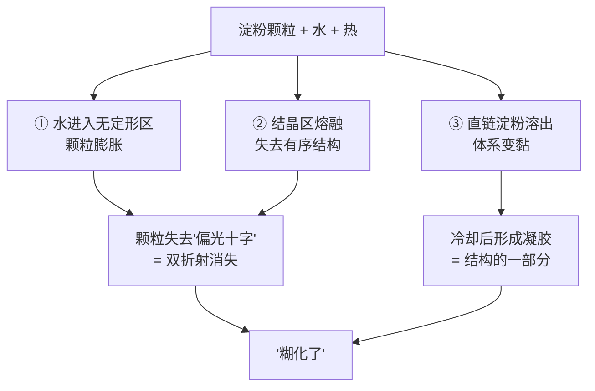
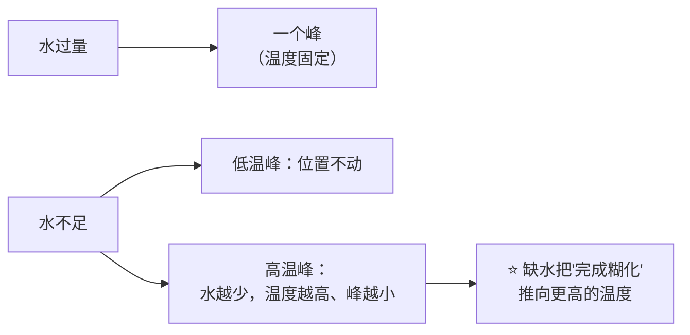
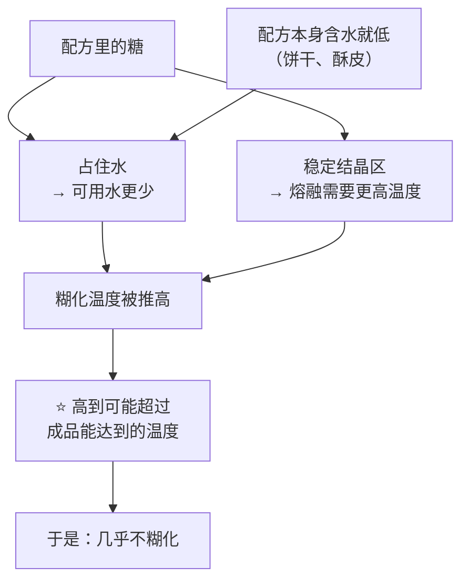
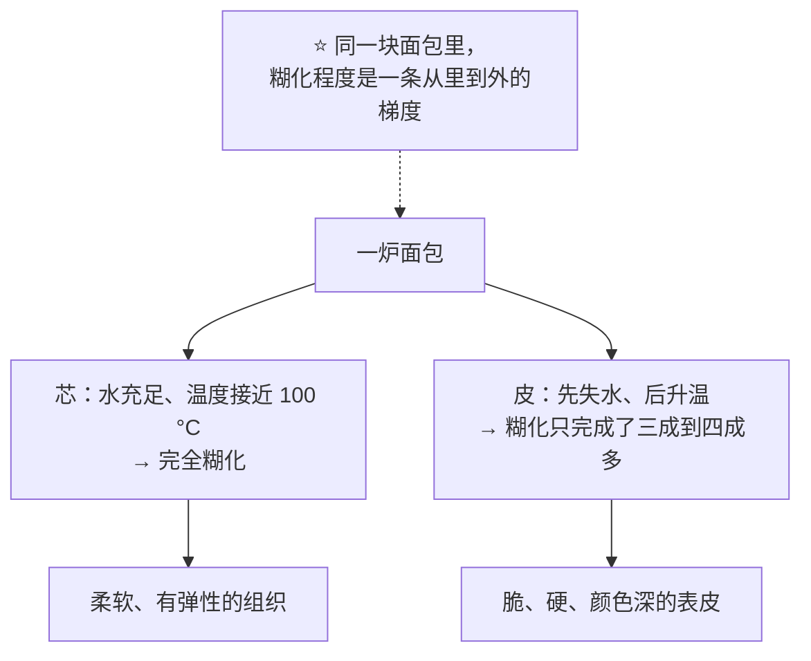
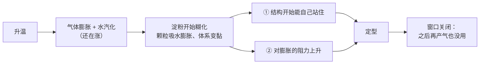

# 第 17 章 淀粉糊化：烘焙里的糊化和煮锅里的不一样

> **本章目标**：把"淀粉糊化"从一个温度数字变成**一个条件问题**：
>
> 1. **它需要什么**——水和热，而且**水是限制条件**；
> 2. **在你这份配方里它会不会发生**——很多烘焙体系里它**只发生了一部分，甚至几乎不发生**；
> 3. **它发生的时候会关掉什么**——糊化既是"定住"，也是**膨胀窗口的终点**。
>
> 第 16 章的面筋是**你在案板上做出来的**结构。
> 淀粉不一样：**它是烤箱替你做的那一半**，而你能控制的只有"给它多少水、多少糖、多少时间"。
>
> 另一本书里也讲过淀粉糊化（《做菜的原理》）。按仓库约定，本书在这里**重新讲一遍**，
> 并且只讲**烘焙体系**里的版本——因为烘焙体系恰恰是糊化最"不正常"的地方。

## 17.1 煮锅里的糊化，和烤箱里的糊化

先看两种体系的差别：

| | 煮一锅淀粉糊 | 烤一炉面包 / 蛋糕 / 饼干 |
|---|-------------|----------------------|
| 水 | **过量**（淀粉泡在水里） | **不足**，而且还要和面筋、糖抢（第 3 章） |
| 温度 | 可以一直升到沸腾 | 内部**很难越过 100 °C**（第 15 章：汽化把热吃掉了） |
| 时间 | 想煮多久煮多久 | 由烘烤时间决定，而且各处不同 |
| 结果 | 淀粉**完全糊化** | **部分糊化**，甚至几乎不糊化 |

> ## **这一行差别，就是这一章存在的全部理由。**
>
> 你在别处看到的"淀粉在 60 多 °C 糊化"，说的是**水过量**的那一栏。
> 把它直接搬到烘焙体系里，几乎一定是错的。

## 17.2 糊化到底是哪几件事

淀粉颗粒内部有**结晶区**与**无定形区**（第 2、3 章）。加热且有水时，同时发生三件事[^1]：

**为什么要提"双折射"**：在偏光显微镜下，完整的淀粉颗粒会显出十字形的亮纹；
糊化之后它消失。研究者正是用它作为**糊化是否完成**的判据之一——
下一节那项关键实验就是这么做的。

⚠️ 顺带澄清一组常被混用的词：

| 词 | 指的是 |
|----|-------|
| **糊化**（gelatinization） | 上面那三件事，通常用差示扫描量热法或双折射观察 |
| **糊化黏度 / 糊化曲线**（pasting） | 加热搅拌过程中体系**黏度**的变化，通常用快速黏度分析仪测 |

两者相关但不是一回事。而且**别的成分会显著改变黏度曲线**：
一项研究把四种蛋白质加进小麦淀粉，发现**面筋与乳清蛋白提高峰值黏度（最高分别约 +105% 与 +22%），
大豆蛋白与卵白蛋白则降低（最高约 −16%）**；冷却阶段四种蛋白质都让黏度更高。

## 17.3 水不够的时候：糊化温度不再是一个数

这是本章最核心的一节。有两项经典实验把它讲得很干净。

### 实验一：水少到一定程度，出现两个吸热峰

一项关于**淀粉—水体系相变**的研究用差示扫描量热法观察到：

| 条件 | 观察 |
|------|------|
| **水过量** | **只有一个**吸热峰 |
| **水不足**（水:淀粉低于约 1.5 : 1，w/w） | 出现**两个**吸热峰 |
| 低温那个峰 | **始终在同一个温度**（该研究的马铃薯淀粉为 66 °C） |
| 高温那个峰 | **水越少，它出现的温度越高**；而且**峰越小** |

### 实验二：小麦淀粉上的验证，而且用双折射对上了

另一项研究直接做**小麦淀粉**，把含水量从 **50% 一路降到 1.5%**：

> **完全失去双折射（即糊化完成）的温度，随含水量降低而升高**；
> 而且**双折射的消失与通过高温那个吸热峰是对应的**。

两项研究合起来给出本章第一条判断：

> **第一条可迁移判断**：
> ## **"淀粉在多少 °C 糊化"这个问题，在缺水的体系里没有答案——只有"在这个含水量下，要到多少 °C 才算完"。**

⚠️ **本书因此不给任何"糊化温度"的单点数字**用于烘焙配方。
能引用的只有**水过量**条件下的量级：一项研究里**玉米与小麦淀粉在过量水中于 65~75 °C 发生不可逆的糊化吸热**——
但请记住，**那一栏和你的面团没什么关系**。

## 17.4 糖把它推得更高（第 4 章的收口）

第 4 章已经给过五组独立证据：**糖抬高淀粉的糊化温度**，
效应大小大致是蔗糖 > 葡萄糖 > 果糖，机制是糖**把水"占住"**并稳定了淀粉的结晶区。

把它和 17.3 放在一起，就得到烘焙体系里最重要的一条推论：

这不是推理，是实测：第 1、4 章引过的那项研究直接写道——
**在饼干体系里，蔗糖加上低水分把淀粉糊化温度抬得太高，
以至于烘烤过程中几乎没有淀粉糊化。**

> **所以饼干的结构不是淀粉凝胶撑起来的。**
> ⚠️ 那它到底靠什么？本书**没有核到**讲透这件事的一手实验（已登记为缺口）。
> 能说的只有"**不是靠糊化**"——本书不替它补一个听起来合理的机制。

另一条相关证据也值得记：一项用差示扫描量热法比较 14 种低聚糖、阿洛酮糖与蔗糖的研究指出，
**蔗糖抬高小麦淀粉糊化温度的能力强于许多甜味剂**，而"**减糖的同时维持较高的糊化温度一直是个难题**"。
**换句话说：减糖不只是减甜，它还会把糊化时刻提前。**

## 17.5 你这一炉里，到底有多少淀粉真的糊化了

有一项研究把这件事量出来了。它做了三种含水量的白面包
（加水 **45%、60%、75%**，**该研究写明以面粉为基准**）：

| 部位 | 糊化程度 |
|------|---------|
| **面包芯** | 即使含水量低到 45%，**淀粉仍然完全糊化** |
| **面包皮** | **糊化度只有 29.90%~44.36%**，而且**含水量越低，糊化度越低** |

同一现象在更早的研究里也有机制层面的描述：一项用差示扫描量热法研究面团中糊化动力学的工作发现，
**糊化的进程取决于样品距表面的深度**，并遵循一级动力学——
**只要能记录局部温度，就能预测局部的糊化进程。**

> **第二条可迁移判断**：
> ## **糊化不是"发生了 / 没发生"，而是一张分布图——同一个成品的不同部位，糊化程度不同。**
>
> 这一条能解释很多事：为什么面包皮和面包芯口感完全不同；
> 为什么烤得越干表皮越硬；为什么**同一炉里靠外的那几个总是更硬**（第 28 章会讲热点）。

## 17.6 淀粉颗粒也不是同一批

第 2 章说过面粉里的淀粉颗粒有大有小、还有被磨坏的。它们的糊化行为不一样：

| 差异 | 观察 | 依据 |
|------|------|------|
| **颗粒大小** | 小颗粒的糊化**起始温度更低、峰值温度更高、温度区间更宽**；糊化焓与粒度分布无关 | 一项按粒径分级测小麦淀粉的研究 |
| **损伤淀粉** | 损伤淀粉越多，**糊化起始温度越低** | 第 2 章已登记的损伤淀粉研究 |
| **磨得粗 vs 细** | 粗粉的**糊化起始温度与糊化焓更高** | 第 2 章已登记的石磨粒度研究 |
| **直链淀粉—脂复合物** | 小麦与玉米淀粉在过量水中除糊化峰外，还有一个**接近 100 °C 的可逆转变**，对应直链淀粉与脂质形成的螺旋复合物；马铃薯与蜡质玉米淀粉没有 | 一项关于淀粉中直链淀粉—脂复合物相变的量热研究；小颗粒的这一峰最大 |

> **这些差异累加起来的意思是**：即使在同一份面团里，
> **糊化也是一群颗粒陆续发生的事，而不是一个瞬间。**
> 所以"到了某个温度就糊化了"这种说法，从一开始就是简化。

## 17.7 糊化在结构里的双重身份

糊化既**建立**结构，也**关闭**膨胀窗口——这两件事同时发生。

| 身份 | 证据 |
|------|------|
| **建立结构** | 第 6 章引过的海绵蛋糕研究写明：**面糊变成蛋糕靠淀粉糊化与蛋白质聚合两种成胶现象** |
| **关闭窗口** | 第 15 章引过的酥皮研究写明：**完整淀粉的糊化会限制面团的起发与膨胀**；用淀粉酶水解一部分淀粉后，**面团对气室膨胀的阻力下降、起发反而变好** |

> **第三条可迁移判断**：
> ## **糊化来得越早，成品越矮越紧实；来得越晚，涨得越大，但也越可能在定住之前先塌。**
>
> 这就是为什么第 4 章说糖是"**推迟定型**"的原料，
> 而第 2 章说加面筋会让饼干**摊得更小**（面筋抢水、也早早提供结构）。
> **配方在做的，正是把这个时刻往前或往后推。**

## 17.8 糊化之后：温度上限与"第二天就硬了"

两条收尾：

1. **温度上限**：第 15 章讲过，只要还有水在蒸发，成品内部就很难越过 100 °C
   （模拟研究里芯温稳定在 98 °C 左右；实测的汉堡面包芯温在最初 8 分钟升到约 100 °C 并保持）。
   **这意味着烘焙体系里的糊化，永远是在一个温度天花板下进行的。**
2. **回生（老化）**：糊化过的淀粉在冷却与储存中会重新排列。
   两篇综述一致认为：面包老化最站得住的假说是**支链淀粉回生**，
   伴随**水分在面筋与淀粉之间重新分配**。第 45 章会专门讲。

> **一句话**：**糊化不是终点，它只是淀粉这条线的中点。**

## 17.9 常见说法辨析

按本书约定标注**证据强度**：✅ 有共识 / ⚠️ 有争议 / ❌ 明确错误 / 缺乏证据。

| 说法 | 判定 | 说明 |
|------|------|------|
| "**淀粉在 60 多 °C 就糊化了**" | ❌ **少了前提** | 那是**水过量**条件下的量级（某研究测得玉米与小麦淀粉在过量水中于 65~75 °C 发生不可逆糊化）。在**缺水**体系里，完成糊化的温度**随含水量降低而升高**（小麦淀粉从 50% 水降到 1.5% 水的实验）；水少到一定程度还会出现**两个吸热峰**，其中高温峰随水减少而上移 |
| "**面包烤熟了，里面的淀粉就全糊化了**" | ⚠️ **芯是，皮不是** | 实测：加水 45%~75%（面粉基准）的白面包，**面包芯即使在 45% 时也完全糊化**，但**面包皮的糊化度只有 29.90%~44.36%**。糊化程度在同一个成品里是**一条梯度** |
| "**饼干的酥脆来自淀粉糊化后的结构**" | ❌ **饼干里几乎不发生糊化** | 一项研究直接写明：**蔗糖 + 低水分把糊化温度抬得太高，以至于烘烤中几乎没有淀粉糊化**。⚠️ 那饼干靠什么？本书**未核到**讲透这件事的一手实验，**只说"不是糊化"** |
| "**减糖只是变得不甜**" | ❌ **它会把定型时刻提前** | 糖抬高糊化温度有五组独立证据（第 4 章）；还有研究明说"**减糖的同时维持较高的糊化温度一直是个难题**"，因为多数甜味剂**抬不到蔗糖那么高**。减糖会让淀粉更早糊化 → 成品更早定住 → 更矮、更紧实 |
| "**多加水能让成品更松软，因为淀粉糊化更充分**" | ⚠️ **前半句常对，后半句常错** | 面包芯在加水 45% 时就已经完全糊化了——**再加水并不能让它"更糊化"**。多加水改变的是别的东西（组织、保气、老化速度），而且有代价：某研究在加水 55% 时观察到发酵中**面筋纤维断裂**（第 3 章） |
| "**糊化就是变黏，用黏度就能判断**" | ⚠️ **两个概念** | **糊化**（结晶熔融 + 膨胀 + 失去双折射）与**糊化黏度曲线**（pasting）不是一回事。而且体系里的其他成分会显著改变黏度：一项研究里面筋与乳清蛋白**提高**小麦淀粉峰值黏度（最高约 +105% 与 +22%），大豆蛋白与卵白蛋白**降低**（最高约 −16%） |
| "**淀粉糊化只对'定型'有好处**" | ❌ **它同时在关窗** | 酥皮研究明确观察到：**完整淀粉的糊化限制了面团的起发与膨胀**；把一部分淀粉水解后，**膨胀阻力下降、起发变好** |
| "**同一袋面粉的淀粉都一样**" | ❌ **颗粒之间差别很大** | 小颗粒的糊化**起始温度更低、峰值更高、区间更宽**；损伤淀粉的**起始温度更低**；磨得粗的粉**起始温度与糊化焓更高**。糊化是**一群颗粒陆续发生**的事 |
| "**面包芯能烤到 120 °C 以上，所以里面也会焦香**" | ❌ **有天花板** | 只要还有水在蒸发，芯温就很难越过 100 °C（模拟约 98 °C；实测汉堡面包芯温约 100 °C 并保持）。**面包芯基本不发生表皮那种程度的褐变**（第 21 章会讲） |
| "**糊化完成了，结构就定了，可以随便开炉门**" | ⚠️ **糊化只是定型的一半** | 另一半是**蛋白质交联**（第 16 章：烘烤时面筋按一级动力学交联；第 18 章会讲蛋与乳）。而且第 15 章的压力实测显示：**烘烤结束之前面团内部已经是开孔结构**，此时结构还很脆弱 |

## 17.10 🔎 下次烤之前的用处

1. **看到配方里的糖量，先想"它把定型推后了多少"**——减糖、换代糖，都会把定型时刻往前拉。
2. **"里面没熟"要分两种**：没熟透（芯温还没到）和**没糊化**（水不够）。
   前者加时间，后者要改配方。
3. **表皮太硬，别只怪温度**：表皮的糊化度本来就低（实测三成到四成多），
   它是靠失水定住的——**想让它软，方向是控制失水**（第 30、33 章）。
4. **成品又矮又实时，怀疑"定型太早"**：糖少了？水少了？炉温太高让表面过早定住？
5. **成品先高后塌时，怀疑"定型太晚"**：糖太多、水太多、炉温太低。
6. **换粉会改变糊化时刻**：损伤淀粉多的粉起始温度更低，颗粒细的粉行为也不同（第 2 章）。
   **换粉之后第一次做，请把它当成一次新实验。**
7. **把"出炉后冷却多久才切"记下来**（第 33 章）——糊化之后的凝胶还在变，
   这也是"回生"的起点。

## 17.11 思考题

1. 为什么说"煮锅里的糊化"和"烤箱里的糊化"是两件事？请列出三条差别。
2. 水不足时差示扫描量热法会看到两个吸热峰。这两个峰分别有什么行为？
   它对"淀粉多少 °C 糊化"这个问题意味着什么？
3. 实测显示面包芯完全糊化、面包皮糊化度只有约三成到四成多。
   这条结论能解释哪三个厨房现象？
4. 淀粉糊化在结构里有"双重身份"，分别是什么？为什么这解释了"糖是推迟定型的原料"？
5. **【案例】** 某人做曲奇，觉得"糖太多不健康"，把糖从 60% 减到 30%
   （**以面粉总量为 100%**），其余不变。结果饼干**摊得小了很多、口感偏硬偏干、颜色也浅**。
   （a）请写出完整推理链，解释这三个变化各自来自什么；
   （b）其中哪一个变化与本章的糊化直接有关？
   （c）如果他坚持要减糖，可以从哪两个方向补救？各自的代价是什么？
6. **【案例】** 某人做磅蛋糕，出炉时中间**明显凹陷**，切开发现中间**偏湿、组织致密**。
   他上次做同一配方是好的，这次唯一改动是"把烤箱温度调高了 20 °C 想缩短时间"。
   （a）用"糊化 + 定型时刻"解释；
   （b）为什么升高炉温反而让中间更湿？
   （c）他该怎么验证自己的判断？
7. **【辨析】** "淀粉在 60 多 °C 就糊化了"——判断证据强度，
   说明这个数字来自什么条件，以及把它搬进烘焙体系会犯什么错。
8. **【辨析】** "多加水能让淀粉糊化更充分，所以成品更松软"——判断证据强度，
   并指出它混淆了哪两件事。

> 📖 **参考答案**（想清楚再看）：[Q1](../../qa/17-gelatinization-qa.md#q1) ·
> [Q2](../../qa/17-gelatinization-qa.md#q2) · [Q3](../../qa/17-gelatinization-qa.md#q3) ·
> [Q4](../../qa/17-gelatinization-qa.md#q4) · [Q5](../../qa/17-gelatinization-qa.md#q5) ·
> [Q6](../../qa/17-gelatinization-qa.md#q6) · [Q7](../../qa/17-gelatinization-qa.md#q7) ·
> [Q8](../../qa/17-gelatinization-qa.md#q8)

## 17.12 本章实操

### 🅐 零成本版 · 任务一：给三份配方排"糊化时刻"

不用烤箱。找三份配方：一份面包、一份蛋糕、一份饼干。**一律以面粉总量为 100%**。

| | 面包 | 蛋糕 | 饼干 |
|---|-----|------|------|
| 水 + 其他液体（%） | | | |
| 糖（%） | | | |
| 油脂（%） | | | |
| 谁在抢水（列出所有） | | | |
| 你预测淀粉**能不能充分糊化** | | | |
| 你预测定型**来得早还是晚** | | | |
| 成品的结构主要靠谁（淀粉 / 面筋 / 蛋白质 / 脂肪） | | | |

回答：

| 问题 | 你的答案 |
|------|---------|
| 三份里哪一份的淀粉最不可能糊化？依据是什么？ | |
| 如果把蛋糕那份的糖减半，你预测定型时刻怎么变、成品怎么变？ | |
| 哪一份配方的"表皮与内部差别"会最大？为什么？ | |

### 🅐 零成本版 · 任务二：看一块面包的横截面

拿一片商品吐司或欧包（或你自己烤的），观察并记录：

| 观察项 | 记录 |
|--------|------|
| 表皮的厚度（大约几毫米） | |
| 表皮与内部的**颜色**差别 | |
| 掰开时表皮与内部的**手感**差别（脆 / 韧 / 软） | |
| 放置一天后，**哪一部分先变化**？怎么变的？ | |
| 用本章内容解释：为什么同一块面包会有这种差别？ | |

> **提示**：答案里应该出现"**水**"和"**糊化程度不同**"两个词。
> 实测数据是：同一份面包里，芯完全糊化，**皮的糊化度只有 29.90%~44.36%**。

### 🅑 开火版 · 任务三：含水量对照（有烤箱时做）

**唯一变量**：加水量。用一份简单的面团或面糊，做两组，其余全部一致、同时入炉。

| 组 | 加水量（**以面粉总量为 100%**） | 入炉前高度 | 成品高度 | 内部湿润度 | 表皮厚度与硬度 | 第二天的硬度变化 |
|----|------------------------------|-----------|---------|-----------|--------------|---------------|
| ① 按配方 | % | mm | mm | | | |
| ② 减 10 个百分点 | % | mm | mm | | | |

做完回答：

| 问题 | 你的答案 |
|------|---------|
| 两组的表皮差别大还是内部差别大？这符合"皮的糊化度本来就低"吗？ | |
| ② 组是不是更早定型（看炉内涨幅）？ | |
| 第二天哪一组更硬？（这是第 45 章的伏笔） | |

### 🅑 开火版 · 任务四（加分）：糖量对照

**唯一变量**：糖量。用一份饼干或蛋糕配方，其余全部一致。

| 组 | 糖量（**以面粉总量为 100%**） | 摊开直径 / 高度 | 颜色 | 口感 | 你判断定型来得早还是晚 |
|----|------------------------------|----------------|------|------|---------------------|
| ① 按配方 | % | | | | |
| ② 减少三分之一 | % | | | | |

> **怎么读结果**：如果 ② 组**摊得更小、更快定住、颜色更浅**，
> 你就同时看到了本章（糖抬高糊化温度 → 推迟定型）和第 4 章（糖参与上色）的两条结论。
>
> ⚠️ **局限**：减糖同时改变了甜度、含水、上色与质地——**这不是一个干净的单变量实验**，
> 因为糖本来就同时扮演四个角色（第 4 章）。**它给方向，不给定量。**
>
> ⚠️ **安全提醒**：不要尝生面糊与生面团（美国 FDA：生面粉不是即食食品；含蛋配方另有生蛋风险）。
> ⚠️ 各国口径不同，以当地现行发布为准。

## 17.13 本章依据

本章引用的来源与核对状态详见[参考书目与出处登记](../../standards.md)，具体对应如下：

| 本章用到的内容 | 依据 |
|--------------|------|
| **水不足（水:淀粉低于约 1.5 : 1，w/w）时出现两个吸热峰**；低温峰位置固定（该研究的马铃薯淀粉为 **66 °C**），**水过量时只有它**；高温峰**随含水量降低而升高、峰面积减小** | *Biopolymers* 1979 关于淀粉—水体系相变的研究，✅ 摘要层面（Crossref 题录与摘要）。**本章 17.3 的核心依据** |
| **小麦淀粉**在含水 **50% 降至 1.5%** 的范围内：**完全失去双折射（糊化完成）的温度随含水量降低而升高**；双折射消失与通过高温吸热峰相对应 | *Starch – Stärke* 1983 关于低含水量小麦淀粉—水混合物糊化的量热与光学显微研究，✅ 摘要层面。**与上一条构成两个独立来源，且这一条做的就是小麦淀粉** |
| 玉米与小麦淀粉在**过量水**中于 **65~75 °C** 发生不可逆糊化吸热；另有接近 **100 °C** 的**可逆**转变，对应**直链淀粉—脂复合物**（马铃薯与蜡质玉米淀粉没有） | *Starch – Stärke* 1980 关于淀粉中直链淀粉—脂复合物相变的量热研究，✅ 摘要层面。⚠️ **该温度区间只适用于"水过量"条件**，本书明确标注 |
| 小麦淀粉**小颗粒的糊化起始温度更低、峰值温度更高、温度区间更宽**；糊化焓与粒度分布无关；小颗粒的直链淀粉—脂复合物吸热最大 | *Starch – Stärke* 1983 关于不同粒级小麦淀粉糊化性质的研究，✅ 摘要层面 |
| 加水 **45% / 60% / 75%（写明以面粉为基准）** 的白面包：**面包芯即使在 45% 时也完全糊化**；**面包皮的糊化度为 29.90%~44.36%**，随含水量降低而下降 | *Food Chemistry* 2018 关于降低面团含水量对白面包糊化与淀粉消化影响的研究，✅ 摘要层面。**本章 17.5 的核心依据**；本书**只引用其糊化度与含水量结论，不引用其消化与血糖相关结论** |
| 面团中淀粉糊化的进程**取决于距样品表面的深度**，遵循**一级动力学**；能记录局部温度就能预测局部糊化进程 | *Journal of Food Science* 1991 关于化学膨松面包烘烤中淀粉糊化的量热研究，✅ 摘要层面（Crossref 题录与摘要） |
| **蔗糖 + 低水分把饼干体系的糊化温度抬得太高，以至于烘烤中几乎没有淀粉糊化** | *Journal of Agricultural and Food Chemistry* 2009 关于蔗糖如何影响饼干中面筋功能的研究，✅ 摘要层面（第 1、4 章已登记） |
| **蔗糖抬高小麦淀粉糊化温度的能力强于许多甜味剂**；"减糖的同时维持较高的糊化温度一直是个难题"；受测低聚糖抬得比蔗糖更高 | *Food & Function* 2022 用差示扫描量热法比较 14 种低聚糖、阿洛酮糖与蔗糖对小麦淀粉糊化温度影响的研究，✅ 摘要层面（第 4 章已登记） |
| 糖抬高糊化温度与糊化焓，效应顺序蔗糖 > 葡萄糖 > 果糖 / 甘油；机制为糖"占住"水并稳定结晶区 | 第 4 章已登记的四项糖—糊化研究（*JAFC* 1991、*Biopolymers* 1999、*Carbohydrate Polymers* 2007、*Journal of Food Engineering* 2013），✅ 摘要层面 |
| **面筋与乳清蛋白提高小麦淀粉峰值黏度（最高约 +105% 与 +22%）**，**大豆蛋白与卵白蛋白降低（最高约 −16%）**；冷却阶段四种蛋白质都提高黏度 | *Foods* 2025 关于食品蛋白质对小麦淀粉糊化黏度与热性质影响的研究（开放获取），✅ 摘要层面。**本书用它说明"糊化 ≠ 糊化黏度曲线"** |
| **完整淀粉的糊化限制面团起发与膨胀**；淀粉酶水解后**膨胀阻力下降、起发变好** | *Journal of Food Science* 2018 关于多层发酵酥皮中完整与损伤淀粉及淀粉酶作用的研究，✅ 摘要层面（第 15 章已登记） |
| **面糊变成蛋糕靠淀粉糊化与蛋白质聚合两种成胶现象** | *Foods* 2021 海绵蛋糕中蛋黄低密度脂蛋白作用的研究（开放获取），✅ 全文已核（第 6 章已登记） |
| **损伤淀粉越多，糊化起始温度越低**；**磨得粗的粉糊化起始温度与糊化焓更高** | *European Food Research and Technology* 2006 损伤淀粉研究与 *Food Chemistry* 2026 石磨粒度研究，✅ 摘要层面（第 2 章已登记） |
| 面包芯温度**不越过 100 °C**（模拟约 98 °C）；实测汉堡面包芯温在最初 8 分钟升到约 100 °C 并保持 | *Food Research International* 2011 CFD 模拟与 *Journal of Food Protection* 2016 验证研究，✅ 摘要层面（第 10 章已登记） |
| 面包老化最站得住的假说是**支链淀粉回生**，伴随**水分在面筋与淀粉之间重新分配** | *Comprehensive Reviews in Food Science and Food Safety* 2003 与 2014 两篇面包老化综述，✅ 摘要层面（第 3 章已登记）。第 45 章展开 |
| 生面糊与生面粉的安全 | 美国 FDA「Handling Flour Safely」，✅ 已核到官方页面。⚠️ 各国口径不同 |
| **烘焙体系里"淀粉多少 °C 糊化"的单点数字** | ⚠️ **不给**：两项独立实验都显示它**随含水量移动**；能引用的 65~75 °C 只适用于**水过量**条件。本书改为给"条件 → 方向"的判断法 |
| **饼干这类低水分体系的结构究竟靠什么**（已确知"不是靠淀粉糊化"） | ⚠️ **未核到**讲透这件事的一手实验（第 3 章已登记该缺口）；正文只写"不是糊化"，不补机制 |

[^1]: 本章新出现的术语：[双折射](../../glossary.md#birefringence)（birefringence）、
[糊化度](../../glossary.md#degree-of-gelatinization)（degree of gelatinization）、
[糊化黏度曲线](../../glossary.md#pasting)（pasting）、
[直链淀粉—脂复合物](../../glossary.md#amylose-lipid-complex)（amylose–lipid complex）。
第 3 章的[糊化](../../glossary.md#gelatinization)与[回生](../../glossary.md#retrogradation)在本章继续使用。

---

**下一章**：第 18 章 蛋白质凝固与凝胶。
淀粉是**吸水膨胀**才定住的；蛋与乳里的蛋白质则是**变性、再互相连起来**——
而这一步**不可逆**，所以"过头了"没法回头。
