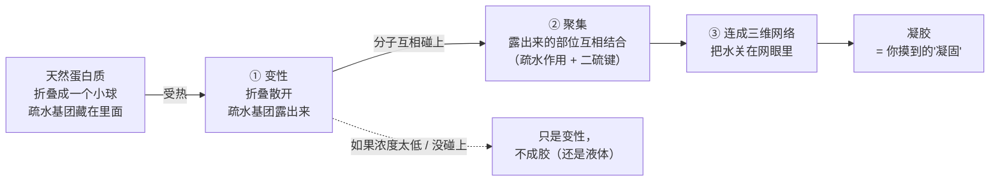
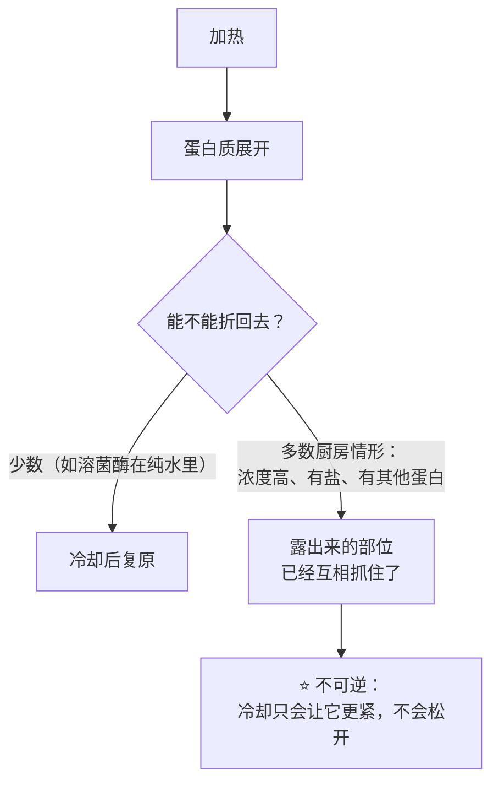
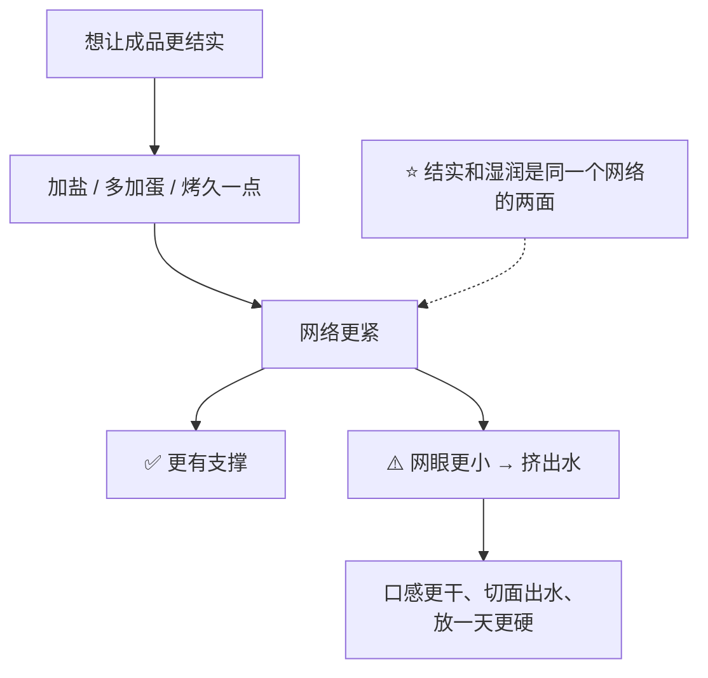
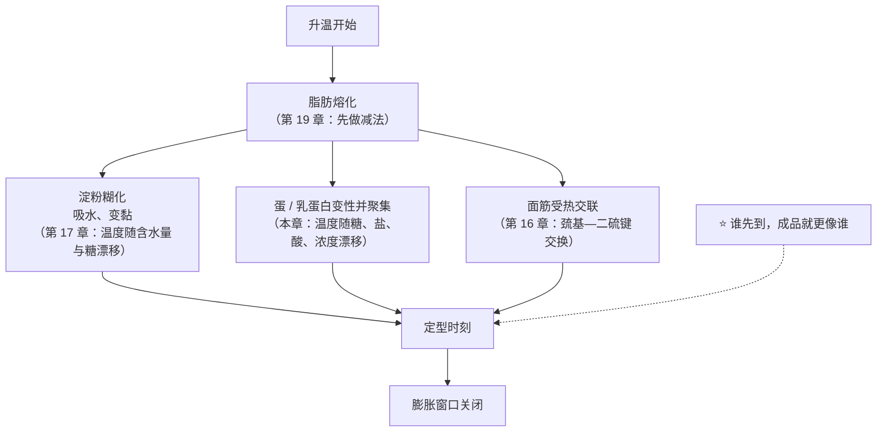

# 第 18 章 蛋白质凝固与凝胶：蛋与奶在烤箱里的相变

> **本章目标**：把"蛋会凝固"这件常识拆成三个可用的问题：
>
> 1. **凝固到底是哪两步**——展开（变性）和连起来（聚集）是**两件事**，
>    而只有第二件才给你结构；
> 2. **它什么时候发生**——和淀粉一样，**没有单一温度**，
>    因为糖、盐、酸、浓度甚至**升温速率**都在推着它走；
> 3. **过头了会怎样**——这一步**基本不可逆**，
>    所以"过了"不是"再等等就好"，而是**回不去了**。
>
> 第 17 章的淀粉是**吸水膨胀**才定住的，它靠的是"进水"；
> 蛋白质相反：它靠**把自己摊开、再互相抓住**。
> 这两条线在同一个烤箱里同时跑——**谁先到，成品就更像谁**。
>
> 另一本书里也讲过蛋白质变性（《做菜的原理》）。按仓库约定，本书在这里**重新讲一遍**，
> 并且只讲**烘焙体系**里的版本。

## 18.1 变性 ≠ 凝固：两步，不是一步

日常说的"蛋熟了"，其实是两件先后发生、但机制不同的事[^1]：

这个区分很重要，因为它解释了两个常见困惑：

| 困惑 | 解释 |
|------|------|
| 为什么很稀的蛋液加热只会变浑浊、不会成块 | 变性发生了，但分子太稀，**碰不到彼此**，聚集这一步没跑完 |
| 为什么同样是"蛋白质定型"，面筋和蛋的路径不一样 | 面筋是**先在案板上搭好网络**、进炉后继续交联（第 16 章）；蛋是**在炉子里才开始搭网络** |

一项磅蛋糕研究写得很直接：**卵白蛋白**是蛋清的主要蛋白质，它通过提供**巯基（—SH）**
在烘烤中**形成牢固的凝胶**，从而参与蛋糕的结构。

> **所以"加一个蛋"买到的结构，是在烤箱里现做的。**
> 这和"加一勺面粉"完全不同——后者是把结构的**材料**加进去，
> 前者是把**一个会在特定温度上自己搭架子的部件**加进去。

## 18.2 它基本不可逆——这就是"进炉就改不了"的物理原因

有一项用差示扫描量热法系统比较蛋清里两种主要球蛋白的研究，
把"可逆不可逆"这件事测得很干净。它做了**第二次升温**，看还剩多少热效应：

| 蛋白质 | 第二次升温的表现 | 意味着 |
|--------|----------------|--------|
| **溶菌酶**（lysozyme） | 在纯水里**几乎 100% 可逆**；加糖时仍保持约 **90%** 可逆；**加盐会降低可逆性** | 它变性之后还能折回去 |
| **卵白蛋白**（ovalbumin） | 在水、糖溶液、盐溶液里**都是完全变性**（不可逆） | ⭐ **回不去了** |

而**卵白蛋白正是蛋清里量最大、也是成胶主力的那一个**。

> **第一条可迁移判断**：
> ## **"过头了"在蛋白质这一侧不是程度问题，是方向问题——它没有回头路。**
>
> 所以第 32 章会反复讲：**用状态判据和内部温度决定什么时候停，而不是用计时器**。
> 烤过头的蛋糕不会"放一会儿就回软"，它只会变干变紧。

## 18.3 "蛋在多少 °C 凝固"依然没有单一答案

和第 17 章的糊化一模一样：这个问题**缺少前提就没有答案**。
同一项研究在**纯水、5% w/v 蛋白质、5 °C/min 升温**的条件下测到：
卵白蛋白的变性温度约 **80.22 °C**、溶菌酶约 **77.46 °C**。

⚠️ **请不要把这两个数字带进厨房**，理由就写在同一篇研究里：

| 改变什么 | 测到的变性温度怎么动 |
|---------|-------------------|
| 提高蛋白质**浓度** | **下降** |
| 提高**升温速率** | **下降** |
| 加 **CaCl₂** | **下降** |
| 加**糖**（蔗糖、葡萄糖） | **上升**（两种蛋白质都是） |
| 加 **NaCl / KCl** | 卵白蛋白**上升**，溶菌酶**下降** |
| 提高 **pH** | 卵白蛋白**上升**，溶菌酶**下降** |

⚠️ 其中"**升温速率也会改变测得的温度**"这一条尤其值得记住
（该研究中方向为下降，**仅见于该研究**，本书只引用"它是一个变量"这一点）：

> ## **这类温度不是物质的固有属性，而是"在某个测法、某个体系下的读数"。**
> 你在家里的升温速率和量热仪完全不同，所以**照抄那个数字没有意义**。

蛋黄那一侧也有同样的故事。三项研究互相印证：

| 研究 | 测到什么 |
|------|---------|
| 一项液态蛋黄巴氏杀菌研究（68 / 72 / 76 °C） | **72 °C 是热聚集速率上升的关键转折点**；随杀菌温度升高，蛋黄凝胶的平均粒径增大 **63.9%** |
| 一项用 X 射线光子关联谱在 **58~72 °C** 观测蛋黄凝胶的研究 | **降低 pH 加速凝胶形成**；活化能（450 ± 20 kJ/mol）**不随 pH 变化**——酸提高的是"有效碰撞"的频率 |
| 同类技术在 **66~90 °C** 的另一项研究 | **NaCl 浓度升高（0.3~2 M）延迟凝胶形成**与低密度脂蛋白的聚集；活化能同样与盐浓度无关 |

还有一项把豌豆蛋白与蛋清混合的研究，直接看到了 pH 的位移效应：
在 25~95 °C 的升温扫描中，**含蛋清的体系出现两个溶胶—凝胶转变**，
而且**在 pH 9.0 时第一个转变向上位移了约 2~3 °C**；
同时**弹性模量 G′ 随蛋清含量显著上升**——说明**成胶是由蛋清蛋白主导的**。

> **第二条可迁移判断**：
> ## **配方里的糖、盐、酸和"蛋有多浓"，都在移动蛋白质定型的那个温度。**
> 所以"这个蛋糕烤到 XX °C 就好"这种话，**离开配方就不成立**。

⚠️ 这里必须分清**两种温度**，它们经常被混为一谈：

| 类型 | 谁说了算 | 本书怎么处理 |
|------|---------|------------|
| **工艺温度**（"什么时候定住"） | 你的配方与烤箱 | **不给数字**，给方向 + 自测方法 |
| **安全温度**（"什么时候算安全"） | **食品安全机构** | 引官方：美国 FDA 对**含蛋菜品**给出 **160 °F**（约 71 °C），**已做熟的蛋类菜品再加热到 165 °F**（约 74 °C），并要求**用食品温度计确认**。⚠️ **各国口径不同，以当地现行发布为准** |

**安全温度不是工艺判据**：到了安全温度不代表结构做好了，
结构做好了也不等于满足了安全要求。**两条线要分开看。**

## 18.4 凝胶不只是"变硬"，它还要**抓住水**

一个凝胶好不好，在厨房里体现为两件事：**硬度** 和 **它有没有把水留住**。
后者有个专门的指标：**持水性**。

一项系统改变 pH、蔗糖、盐与几种胶体的蛋清凝胶研究给出了一张很有用的对照
（该研究的浓度写作 w/w，pH 取 4.5 / 6.5 / 8.0，糖与盐取 1 / 3 / 6%）：

| 改动 | 硬度与弹性 | 持水性 |
|------|-----------|-------|
| **pH 偏离中性**（4.5 或 8.0） | **显著下降** | **显著下降** |
| **加盐** | **提高** | **下降** |
| **加糖** | **提高** | **略微提高** |
| **加黄原胶**（0.2%） | 硬度与强度**下降** | **提高到 97.18%** |

这张表解释了一个常见的厨房矛盾：

> **第三条可迁移判断**：
> ## **"湿润"不是水多，是水**被网络抓住**。**
>
> 所以"成品干"有两条完全不同的原因：**水跑掉了**（第 21、33 章）
> 和**网络收得太紧，把水挤出来了**。**两者的改法相反**——
> 前者要减少失水，后者要**减少交联**（减蛋、降温、缩短时间、加糖）。

⚠️ **诚实说明**：上面这条"过度加热 → 网络收缩排水"是**机制推理 + 厨房现象**，
本书**未核到**专门在烘焙成品上测"加热过头→持水性下降"的对照实验。
可引用的实测只到"**温度越高，蛋黄的热聚集越剧烈、颗粒越大**"这一步。

## 18.5 谁在改这个时刻：一张给配方看的表

把 18.3、18.4 合起来，就得到改配方时真正要问的那张表
（**以下一律以面粉总量为 100%** 的写法讨论用量方向，不给具体数值）：

| 你改了什么 | 蛋白质定型时刻 | 依据 |
|-----------|--------------|------|
| **加糖** | **推后**（同时也推后糊化，第 17 章） | 糖提高蛋清两种蛋白的变性温度；另有研究测到蔗糖把溶菌酶与肌红蛋白的变性温度抬得比海藻糖更高，**低水分下尤其明显**；还有研究用复合糖把蛋黄的变性温度提高到 **77 °C 以上** |
| **加盐** | 方向**不统一**：对卵白蛋白是"更稳定"，对蛋黄是**延迟凝胶** | 量热研究 + 蛋黄 X 射线研究 |
| **加酸**（柠檬汁、酸奶、醋、塔塔粉） | **提前**（蛋黄侧有直接证据） | 蛋黄 X 射线研究：降低 pH 加速凝胶形成 |
| **多加蛋 / 用更浓的蛋液** | **提前**（浓度越高，测得的变性温度越低，而且更容易碰上） | 量热研究 |
| **多加水 / 牛奶稀释** | **推后**，而且可能**根本不成胶** | 同上（浓度效应） |
| **升温更快**（炉温更高） | ⚠️ 不是简单"更快定型"：局部温度、表皮先定住等因素同时在变（第 21 章） | — |

> ⚠️ **本书不给"减糖后蛋该加多少"这类换算**：
> 各类成品的烘焙百分比典型区间本书未核到一手出处（见[出处登记](../../standards.md)的已知缺口）。
> **改一档、记一次、比一次**，比抄一个数字可靠。

## 18.6 三条定型线在同一个烤箱里赛跑

第三部分导读里那张"四套机制接力"的图，到这里可以填上具体证据了：

**面筋这一条也是蛋白质**，而且它的热交联被直接测过：一项研究在 **80 °C、90 °C、95 °C**
的保温实验里观察到面筋蛋白通过**巯基—二硫键交换**聚合，
醇溶蛋白的溶解度按**一级动力学**下降，速率随温度升高（活化能分别为 110 与 147 kJ/mol），
而且**淀粉不影响这个反应的速率**——**两条线各跑各的**。

另一项海绵蛋糕研究把"成胶"这件事说得很完整：
**面糊变成蛋糕，靠的是淀粉糊化与蛋白质聚合两种成胶现象**。
更有意思的是它的对照实验：把蛋黄里的低密度脂蛋白用乙醇处理拆散之后，
**受影响的是充气与气室稳定性，而蛋糕定型的时刻与程度基本不受影响**。

> **第四条可迁移判断**：
> ## **"能不能充进气"和"什么时候定住"是两套机制，可以被分别改动。**
>
> 这一条能省掉很多冤枉功夫：成品**矮**可能是气的问题（第二部分），
> 也可能是定型太早（这一部分）——**先分清，再动手**。

## 18.7 奶：本书能确认的，和不能确认的

这一章标题里有"奶"，但这里必须**诚实交代证据的厚度差别**：
**蛋的部分证据充分，奶的部分本书查得很不理想。**

**能确认的**：

| 结论 | 依据 |
|------|------|
| 乳蛋白确实会参与体系、改变热行为 | 一项把四种蛋白质加进小麦淀粉的研究：**乳清蛋白提高峰值黏度（最高约 +22%）**，而**卵白蛋白降低（最高约 −16%）**；冷却阶段四种蛋白质都让黏度更高 |
| 乳蛋白在"没有面筋时"被当作结构材料用 | 一篇无麸质面包质构综述把**酪蛋白酸盐与乳清浓缩蛋白**列为用来结构化的动物来源配料之一 |

**不能确认的**（已登记为缺口）：

> ⚠️ 本书**未核到**在常规小麦配方里比较"用水 vs 用牛奶"的一手对照实验。
> 因此本书**不写**"牛奶让面包更软 / 更香 / 上色更好"这类结论。

**那牛奶在配方里该怎么算？** 用第 9 章的办法，**把它拆开记**：

| 牛奶带进来的 | 它在争什么 |
|------------|-----------|
| 水 | 和面筋、淀粉抢（第 3 章） |
| 蛋白质 | 参与结构与热行为（上表） |
| 乳糖 | 一种**酵母通常吃不了**的糖，但它参与褐变（第 4、11 章） |
| 脂肪 | 反结构那一侧（第 5 章） |

> ⚠️ **第 9 章的读数纪律在这里生效**：遇到含牛奶的配方，
> **把水与牛奶分开报，不要合并成一个"含水量"**——
> 因为本书未核到可直接引用的牛奶含水量官方数值。

## 18.8 常见说法辨析

按本书约定标注**证据强度**：✅ 有共识 / ⚠️ 有争议 / ❌ 明确错误 / 缺乏证据。

| 说法 | 判定 | 说明 |
|------|------|------|
| "**蛋在 62 °C 凝固 / 蛋黄 65 °C、蛋白 60 °C**" | ❌ **少了前提** | 量热研究显示这类温度**随蛋白质浓度、升温速率、糖、盐、pH 移动**，连**升温速率**都能改变读数。这些数字（如果有来源的话）说的是某个特定体系与测法。**本书不给厨房用的凝固温度** |
| "**蛋清比蛋黄先凝固**" | 缺乏证据（就家用条件而言） | 蛋清与蛋黄各自是**一群蛋白质**，不是单一物质；本书**未核到**在同一条件下直接比较两者凝固先后的可引用实验。已知的只有各自体系里的分项数据（蛋清两种球蛋白的变性温度、蛋黄在 58~90 °C 的凝胶动力学），**测的不是同一件事** |
| "**加糖能防止蛋液'煮老'**" | ⚠️ **方向有支持，剂量没有** | 三个独立来源都指向"糖提高蛋白质的变性温度"（蛋清两种球蛋白；蔗糖 vs 海藻糖对溶菌酶与肌红蛋白，**低水分下尤其明显**；复合糖把蛋黄变性温度提高到 77 °C 以上）。但**"该加多少"没有可引用的家用数据**，而且糖同时改了甜度、含水与上色（第 4 章） |
| "**烤过头就是水被烤跑了**" | ⚠️ **只说了一半** | 还有一条：**网络收得太紧把水挤出来**。两者的改法相反（减少失水 vs 减少交联）。⚠️ 后者在烘焙成品上的直接对照实验本书未核到，属**机制推理** |
| "**蛋加得越多，成品越结实**" | ⚠️ **有条件** | 蛋同时带进**水**（第 6 章）。加蛋是"加结构 + 加水"的组合动作；而且浓度上升会让蛋白质**更早**成网（定型提前）。方向上更接近"更结实但也更容易发干" |
| "**凝固之后就定死了，出炉就不变了**" | ❌ **冷却阶段还在变** | 蛋白质网络的收紧、淀粉凝胶的形成与随后的**回生**都发生在冷却与储存中（第 17、45 章）。很多成品是**在冷却时才真正定型**的（第 33 章） |
| "**加盐能让蛋液凝得更快更结实**" | ⚠️ **两个方向都测到过** | 蛋清凝胶研究里加盐**提高硬度与弹性**，但**降低持水性**；蛋黄研究里加盐**延迟**凝胶形成。所以"更结实"和"更快"不是一回事，**不能混着说** |
| "**牛奶让面包更软**" | 缺乏证据（本书未核到） | 未核到常规小麦配方里"水 vs 牛奶"的一手对照实验。**本书也不断言它没用**——只是把牛奶拆成水 + 蛋白质 + 乳糖 + 脂肪分别记账 |
| "**蛋液加热到刚凝固就安全了**" | ❌ **安全是另一条线** | 工艺上的"凝固"和食品安全的"熟"不是同一个判据。美国 FDA 对含蛋菜品给出 **160 °F**（约 71 °C）并要求**用温度计确认**。⚠️ 各国口径不同，以当地现行发布为准。本书**不做医疗建议** |
| "**蛋白质变性了就等于凝固了**" | ❌ **两步** | 变性是单个分子摊开；凝固要求这些分子**碰上并互相结合**。太稀的蛋液只会变浑，不会成胶 |

## 18.9 🔎 下次烤之前的用处

1. **"再烤两分钟看看"是有代价的**——蛋白质这一侧没有回头路。
   宁可**先按更短的时间试一次**，用状态判据决定要不要补时间（第 32 章）。
2. **成品干硬，先分两种情况**：切面**发白发粗、掰开掉渣**更像网络收太紧；
   **整体变轻、皮厚**更像失水太多。改法相反。
3. **改蛋量之前先记两件事**：改的是"结构"，也是"水"。
   把它写进[配方解码表](../../forms/recipe-decode.md)的两行，而不是一行。
4. **配方里出现酸性材料**（酸奶、柠檬、酪乳、可可）时，
   记得它可能把**蛋白质定型提前**（蛋黄侧有直接证据），也会改变化学膨松（第 13 章）。
5. **牛奶不要当水记**——把它拆成水 + 蛋白质 + 乳糖 + 脂肪四笔账（第 9 章）。
6. **"凝固了"不等于"做好了"**：很多成品在冷却时才真正定型，**别急着切**（第 33 章）。
7. **涉及生蛋或半熟蛋的做法，按官方指引走**：美国 FDA 建议这类配方使用
   **经巴氏杀菌处理的蛋制品**。⚠️ 各国口径不同，以当地现行发布为准。

## 18.10 思考题

1. "变性"和"凝固"分别指什么？为什么很稀的蛋液加热只会变浑浊而不成块？
2. 一项量热研究测到卵白蛋白的变性温度约 80.22 °C。
   为什么本书**不允许**把这个数字写进厨房判据？请至少给出三条理由。
3. 蛋清凝胶的"硬度"与"持水性"经常朝相反方向变。举出研究中的两个例子，
   并说明这对"成品又结实又湿润"这个目标意味着什么。
4. 海绵蛋糕研究把蛋黄的低密度脂蛋白拆散后，"充气与气室稳定性"受影响，
   但"定型时刻与程度基本不变"。这条结论为什么重要？它能帮你排除哪一类误判？
5. **【案例】** 某人做蛋挞/布丁类的蛋奶液，配方里的糖减半，其余不变、烘烤参数不变。
   结果成品**表面起了很多小孔、切面出水、口感变粗**。
   （a）写出完整推理链；（b）其中哪一步和本章的"定型时刻"直接有关；
   （c）如果他坚持要减糖，有哪两个方向可以补救？各自的代价是什么？
6. **【案例】** 某人做戚风，按配方烤完中心还是湿的，于是**每次都多烤 8 分钟**。
   成品不再湿了，但**明显干、切面掉渣、第二天硬得像海绵**。
   （a）用本章的"不可逆"和"持水性"解释；
   （b）为什么"多烤一会儿"不是一个中性的操作；
   （c）他应该改哪一个变量、怎么验证？
7. **【辨析】** "蛋清 60 °C 凝固、蛋黄 65 °C 凝固"——判断证据强度，
   说明这类数字缺了什么前提，并给出你在自家厨房能建立的替代判据。
8. **【辨析】** "牛奶让面包更软更香"——判断证据强度，
   并说明在本书的记账方法里，牛奶应该被拆成哪几笔。

> 📖 **参考答案**（想清楚再看）：[Q1](../../qa/18-protein-coagulation-qa.md#q1) ·
> [Q2](../../qa/18-protein-coagulation-qa.md#q2) · [Q3](../../qa/18-protein-coagulation-qa.md#q3) ·
> [Q4](../../qa/18-protein-coagulation-qa.md#q4) · [Q5](../../qa/18-protein-coagulation-qa.md#q5) ·
> [Q6](../../qa/18-protein-coagulation-qa.md#q6) · [Q7](../../qa/18-protein-coagulation-qa.md#q7) ·
> [Q8](../../qa/18-protein-coagulation-qa.md#q8)

## 18.11 本章实操

### 🅐 零成本版 · 任务一：给三份配方排"谁来定型"

不用烤箱。找三份配方：一份布丁 / 蛋挞液（几乎只靠蛋）、一份戚风或海绵（蛋 + 少量粉）、
一份吐司（几乎只靠面筋与淀粉）。**一律以面粉总量为 100%**；
没有面粉的配方（如布丁液）请**在表里写明你改用了什么作基准**。

| | 布丁 / 蛋挞液 | 戚风 / 海绵 | 吐司 |
|---|-------------|-----------|------|
| 基准是什么（写明） | | | |
| 蛋（%） | | | |
| 糖（%） | | | |
| 液体（水 / 奶，分开写） | | | |
| 主要靠谁定型（蛋 / 淀粉 / 面筋） | | | |
| 配方里有没有酸性材料？ | | | |
| 你预测定型来得**早**还是**晚** | | | |
| 如果糖减半，你预测定型时刻怎么动 | | | |

### 🅐 零成本版 · 任务二：读三份商品配料表，找"蛋白质来源"

拿三样包装烘焙食品（蛋糕、饼干、面包各一），在配料表里圈出所有**蛋白质来源**
（小麦粉、蛋制品、乳制品、大豆蛋白等），然后：

| 问题 | 你的记录 |
|------|---------|
| 哪一样的蛋白质来源最多？ | |
| 有没有**乳清粉 / 酪蛋白酸盐 / 蛋白粉**这类"单独加进去的蛋白质"？ | |
| 你猜它们被加进去是为了结构、持水，还是别的？ | |
| 哪一样的配料表里出现了酸（柠檬酸、乳酸、酸度调节剂）？它可能影响什么？ | |

> ⚠️ 这是**读标签练习**，不是成分分析——配料表只按含量排序，不给用量。

### 🅑 开火版 · 任务三：同一份蛋奶液，只改一个变量（有烤箱时做）

**唯一变量**：糖量（或换成"酸"）。用一份简单的蛋奶液，分成两份，
其余全部一致、**同一炉同时入炉**、同一时间取出。

| 组 | 糖量（写明基准） | 出炉时中心温度 | 表面有没有小孔 | 切面出水吗 | 口感（滑 / 粗） |
|----|----------------|--------------|--------------|-----------|--------------|
| ① 按配方 | | °C | | | |
| ② 糖减半 | | °C | | | |

做完回答：

| 问题 | 你的答案 |
|------|---------|
| 哪一组先定住？（可以用同一时刻的晃动程度判断） | |
| 哪一组出水更多？这符合"网络收得更紧"的预期吗？ | |
| 如果改成"其中一组加一小勺柠檬汁"，你预测会怎样？ | |

### 🅑 开火版 · 任务四（加分）：给自己建一条"烤过头曲线"

同一份配方，**只改烘烤时间**，做三组：按配方、+3 分钟、+6 分钟。
记录：

| 组 | 出炉时中心温度 | 失重（烤前烤后称重） | 口感 | 第二天的硬度 |
|----|--------------|-------------------|------|------------|
| ① 按配方 | °C | g → g | | |
| ② +3 分钟 | °C | g → g | | |
| ③ +6 分钟 | °C | g → g | | |

> **怎么读结果**：如果失重差不多但口感明显更干，就更像**网络收紧**；
> 如果失重明显更大，就更像**失水**。这一条能帮你决定下次改时间还是改配方。
>
> ⚠️ **局限**：这不是一个干净的单变量实验——延长时间同时改变了失水、褐变与内部温度。
> **它给方向，不给定量。**
>
> ⚠️ **安全提醒**：不要尝生面糊、生面团与未熟的蛋液
> （美国 FDA：生面粉不是即食食品；含蛋配方另有生蛋风险；含蛋菜品建议做到 160 °F，约 71 °C，
> 并用食品温度计确认）。⚠️ 各国口径不同，以当地现行发布为准。

## 18.12 本章依据

本章引用的来源与核对状态详见[参考书目与出处登记](../../standards.md)，具体对应如下：

| 本章用到的内容 | 依据 |
|--------------|------|
| 纯水、5% w/v、5 °C/min 条件下**卵白蛋白变性温度约 80.22 °C、溶菌酶约 77.46 °C**；提高**浓度、升温速率与 CaCl₂** 使其下降；**糖提高**两者的热稳定性；**NaCl / KCl 提高卵白蛋白、降低溶菌酶**；提高 pH 同理；**溶菌酶在水中二次升温几乎 100% 可逆（加糖约 90%，加盐可逆性下降），卵白蛋白在水、糖、盐溶液中都是完全变性** | *Gels* 2025 关于卵白蛋白与溶菌酶热力学与成胶性质的研究（开放获取），✅ 摘要层面。**本章 18.2、18.3 的核心依据**；⚠️ 稀溶液模型体系，**不可当作厨房温度** |
| 蛋清凝胶：**pH 偏离中性显著降低力学性能与持水性**；**加盐提高硬度与弹性但降低持水性**；**加糖提高硬度与弹性、略微提高持水性**；黄原胶 0.2% 时持水性提高到 **97.18%** | *Food Hydrocolloids* 2019 关于 pH、蔗糖、盐与胶体对蛋清凝胶影响的研究，✅ 摘要层面。**本章 18.4 的核心依据**；⚠️ 浓度写作 w/w，本书只引用方向与相对关系 |
| 液态蛋黄在 68 / 72 / 76 °C 巴氏杀菌：**72 °C 是热聚集速率上升的关键转折点**；蛋黄凝胶平均粒径随杀菌温度升高增大 **63.9%** | *Food Chemistry* 2025 关于巴氏杀菌温度与氨基酸对液态蛋黄凝胶行为影响的研究，✅ 摘要层面。⚠️ **工业液蛋体系**，本书只引用"越热聚集越剧烈"这一方向 |
| 蛋黄凝胶：**降低 pH 加速凝胶形成**（58~72 °C，活化能 450 ± 20 kJ/mol 不随 pH 变化）；**NaCl 升高延迟凝胶形成**（66~90 °C，活化能约 460 kJ/mol 与盐浓度无关） | *The Journal of Chemical Physics* 2026 与 2024 两项 X 射线光子关联谱研究，✅ 摘要层面（第 6 章已登记） |
| 含蛋清的混合体系在 25~95 °C 出现**两个溶胶—凝胶转变**；**pH 9.0 时第一个转变上移约 2~3 °C**；**G′ 随蛋清含量显著上升，成胶由蛋清蛋白主导** | *Foods* 2023 关于豌豆蛋白与蛋清混合物热行为的研究（开放获取），✅ 摘要层面 |
| **卵白蛋白通过提供巯基（—SH）在烘烤中形成牢固凝胶**，参与蛋糕结构 | *Foods* 2024 关于商品蛋替代物在磅蛋糕体系中的分析（开放获取），✅（第 6 章已登记） |
| **面糊变成蛋糕靠淀粉糊化与蛋白质聚合两种成胶现象**；拆散蛋黄低密度脂蛋白后**充气与气室稳定性受影响，而定型的时刻与程度基本不受影响** | *Foods* 2021 关于海绵蛋糕中蛋黄低密度脂蛋白作用的研究，✅ 全文已核（第 6 章已登记）。**本章 18.6 第四条判断的直接依据** |
| 烘烤时面筋蛋白通过**巯基—二硫键交换**聚合；80 / 90 / 95 °C 下按**一级动力学**进行，活化能分别为 110 与 147 kJ/mol；**淀粉不影响该反应速率** | *Journal of Agricultural and Food Chemistry* 2008 关于麦醇溶蛋白—麦谷蛋白受热交联动力学的研究，✅ 摘要层面（第 10、16 章已登记） |
| **糖提高蛋白质的变性温度**：蔗糖比海藻糖抬得更高，**低水分下尤其明显**；复合糖（+盐）把液态蛋黄的变性温度提高到 **77 °C 以上** | *Journal of Physical Chemistry B* 2024 与 *Journal of Food Science* 2023 两项研究，✅ 摘要层面（第 4 章已登记，两个独立来源） |
| **乳清蛋白提高小麦淀粉峰值黏度（最高约 +22%）**，**卵白蛋白降低（最高约 −16%）**；冷却阶段四种蛋白质都提高黏度 | *Foods* 2025 关于食品蛋白质对小麦淀粉糊化黏度与热性质影响的研究（开放获取），✅ 摘要层面（第 17 章已登记） |
| **酪蛋白酸盐与乳清浓缩蛋白**被列为无麸质面包中用于结构化的动物来源配料 | 一篇关于无麸质面包质构改良的综述，*International Journal of Food Science* 2026（开放获取），✅ 摘要层面。**本书只引用它对"乳蛋白被当作结构材料"的陈述** |
| 含蛋菜品的**安全最低中心温度 160 °F（约 71 °C）**、熟蛋类菜品**再加热 165 °F（约 74 °C）**、生食配方**使用巴氏杀菌蛋制品**、用温度计确认 | 美国 FDA「What You Need to Know About Egg Safety」与「Safe Food Handling」，✅ 已核到官方页面。⚠️ **各国口径不同，以当地现行发布为准**；本书不做医疗建议 |
| 生面粉与生面糊的安全 | 美国 FDA「Handling Flour Safely」，✅ 已核到官方页面 |
| **家用条件下全蛋 / 蛋清 / 蛋黄的"凝固温度"** | ⚠️ **不给**：可引用的量热数据来自稀溶液模型体系，且**随浓度、升温速率、糖、盐、pH 移动**。正文改为"条件 → 方向 + 官方安全温度 + 状态判据"（已登记为缺口） |
| **蛋清与蛋黄"谁先凝固"的直接比较** | ⚠️ **未核到**在同一条件下比较两者的可引用实验（本轮新登记的缺口） |
| **牛奶在常规小麦配方里除水分以外的作用**（"水 vs 牛奶"的对照实验） | ⚠️ **未核到**（本轮新登记的缺口）。正文只写"把牛奶拆成水 + 蛋白质 + 乳糖 + 脂肪分别记账" |
| **烘焙成品上"加热过头 → 持水性下降"的对照实验** | ⚠️ **未核到**（本轮新登记的缺口）。正文把该因果链显式标注为**机制推理** |

[^1]: 本章新出现的术语：[热致凝胶](../../glossary.md#heat-set-gel)（heat-set gel）、
[聚集](../../glossary.md#aggregation)（aggregation）、
[持水性](../../glossary.md#whc)（water-holding capacity, WHC）、
[溶胶—凝胶转变](../../glossary.md#sol-gel-transition)（sol–gel transition）、
[变性温度](../../glossary.md#denaturation-temperature)（denaturation temperature, T\_d）。
第 6 章的[蛋白质变性与凝固](../../glossary.md#denaturation)、[卵白蛋白](../../glossary.md#ovalbumin)、
[低密度脂蛋白](../../glossary.md#ldl)与第 16 章的[受热交联](../../glossary.md#crosslinking)在本章继续使用。

---

**下一章**：第 19 章 脂肪结晶与"层"。
蛋白质和淀粉都是靠"连起来"定住的；**脂肪恰恰相反——它靠"隔开"起作用**，
而且它是这几套机制里唯一**在升温时先消失**的那一个。
