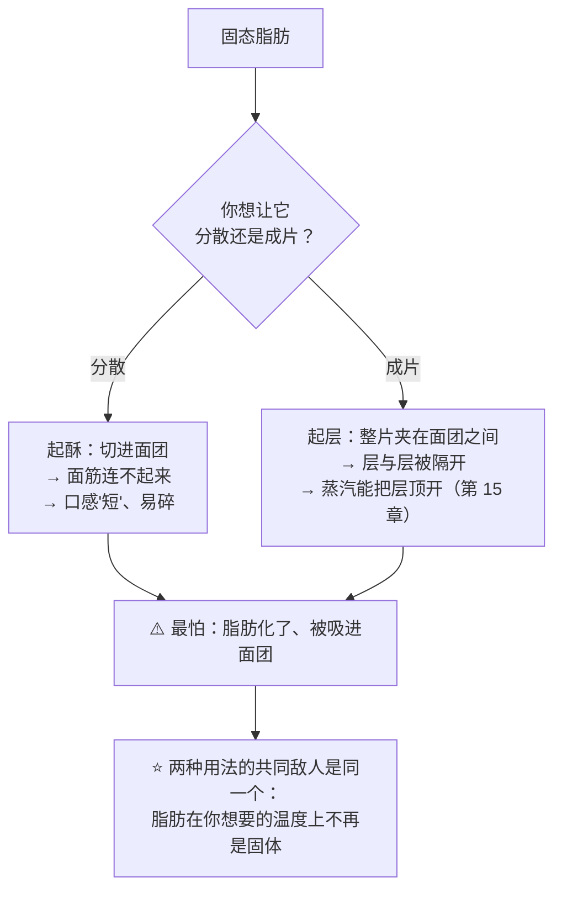
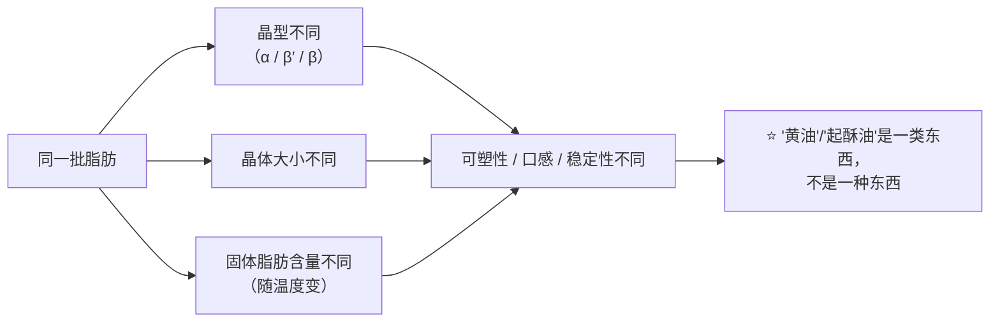
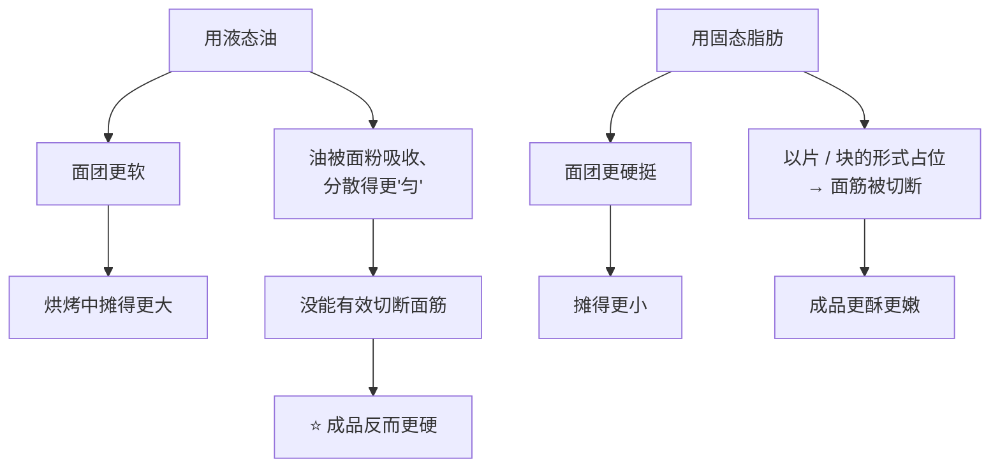

# 第 19 章 脂肪结晶与"层"：为什么起酥必须用固态脂肪

> **本章目标**：把"油和黄油不一样"这句常识，换成三条能用的判断：
>
> 1. **固态脂肪不是"固体"**——它是**一张晶体网络泡在液油里**，
>    所以"固不固"是一个**随温度连续变化的量**，不是一个状态；
> 2. **它在配方里做的是减法**——别的结构机制都在"连起来"，
>    只有脂肪在**隔开**：隔开面筋、隔开层；
> 3. **它是唯一在升温时先"消失"的结构材料**——
>    所以**它的工作全部在进炉之前完成**，进炉之后它只会退场。
>
> 第 5 章讲过脂肪扮演什么角色（阻断面筋、充气、口感）。
> 这一章只回答一个更窄的问题：**为什么形态（固态 / 液态）比种类更要紧。**

## 19.1 同一样东西，两种完全不同的用法

固态脂肪在烘焙里被用来做两件目标相反的事：

| 用法 | 英文里的说法 | 它在干什么 | 典型成品 |
|------|------------|-----------|---------|
| **起酥 / 短化** | shortening | 把脂肪**分散到面团内部**，包住面粉颗粒、切断面筋的连续性 | 饼干、塔皮、酥皮点心 |
| **起层 / 层压** | lamination | 把脂肪**保持成整片**，夹在面团层之间，不让它混进去 | 可颂、千层酥、丹麦酥 |

> **第一条可迁移判断**：
> ## **两种用法买的是同一样东西——"在操作温度下，它既不碎裂也不流动"的那一段区间。**

## 19.2 "固态脂肪"到底是什么

一块室温下的黄油并不是均匀的固体，而是[固体脂肪](../../glossary.md#sfc)晶体
搭成的网络，网络的孔隙里泡着液态的油[^1]。
所以衡量它的指标不是"固体还是液体"，而是**在某个温度下有百分之多少是固体**。

这有实测的量级。一项比较棕榈基起酥油与几种动物脂的研究测了熔点 **33~60 °C**
的一系列棕榈基起酥油：

| 观察 | 数值 |
|------|------|
| 高熔点档（55~60 °C）在 **10 °C** 时的固体脂肪含量 | **高达 98%** |
| 低熔点档（33~42 °C） | 以 **β′ 晶型**为主，质地接近该研究比较的动物脂 |

另一项研究把这件事和"好不好用"直接连上了：**高脂黄油之所以被看重，
正是因为它的可塑性与加工中的操作性能，而这些性能强烈依赖脂肪的结晶网络与微观结构**；
不同的冷—温—冷成熟制度会改变结晶行为与质地。

**晶型也是一个变量**。同一批脂肪可以结成不同的晶型，而
**β′ 晶型是烘焙应用中热力学上受偏好的那一种**（一项油凝胶研究里明确这样写，
并发现卵磷脂与蔗糖酯都能促进 β′ 形成并减小晶体尺寸）。

> ⚠️ **本书不给"黄油要在多少 °C 操作"的数字**：家用黄油的
> **固体脂肪含量—温度曲线**本书未核到可引用数据（已登记为缺口）。
> 第 5 章给的手指判据仍然是本书的标准做法：
> **能留下清晰指印、不粘手、不出油**；裹入油再加一条——**能弯不能断**。

## 19.3 为什么液态油做不出层：三组独立证据

这是本章最硬的一节。三项来源从不同角度指向同一个结论。

### 证据一：固态与液态脂肪在面团里**待的位置不一样**

一项用棕榈油做的模型面团研究，把熔点 **38 °C / 32 °C / 24 °C** 的三种棕榈油
（25 °C 时的固体脂肪含量分别为 **29.35% / 21.53% / 4.61%**）加进淀粉—面筋体系：

| 观察 | 高固体脂肪含量（38 °C 熔点） | 低固体脂肪含量（24 °C 熔点） |
|------|---------------------------|---------------------------|
| 它在面团里的位置 | 位于**蛋白质与淀粉的界面上** | 变成**分散的小液滴** |
| 面筋网络 | 热处理后**平均网络长度更短**、结晶度更高、剪切强度更高 | 新鲜面团的面筋网络**更连续** |

**读懂这张表**：固态脂肪**铺在界面上**——它是**隔离层**；
液态油**变成小滴散开**——它拦不住什么，面筋反而连得更顺。

### 证据二：不饱和油**在工艺上就补不上**

一项用双凝胶替代可颂裹入油的研究在正文里写得很直白：
**不饱和油在室温下是液态的，无法提供富含饱和脂肪的固态脂肪所具有的工艺功能**。
同一篇还给出一个量级：**这类起酥点心的裹入油可达面团重量的 35%**
（基准：**面团重量**——注意不是面粉重量）。

而且该研究的替代品即使做到了"手感接近"，结果仍然不同：
**层压后的双凝胶面团出现不规则的脂肪分层**，成品**组织更致密、更不蓬松**，
体积虽然相当，但**更扁更宽**。

### 证据三：熔化行为不对，就是做不出来

一项千层酥研究配了四种低反式脂肪的油脂共混物（棕榈硬脂 + 菜籽油，比例递变），
用固体脂肪含量、差示扫描量热、锥入度与流变逐一表征：

> **两种共混物做出的千层酥表现优秀**（其中一种在减脂 40% 的条件下
> 仍然不损害涨发高度与比容）；**另外两种被判定不适合做千层酥，
> 原因明确写为"它们的熔化行为"。**

> **第二条可迁移判断**：
> ## **起酥与起层要的不是"油"，是"在你操作的那个温度上仍然成片的脂肪"。**
> 所以"把黄油换成等量植物油"从来不是一次等价替换——
> **你换掉的是这份配方里唯一负责"隔开"的部件。**

## 19.4 饼干那一侧：同样的机制，相反的结果

把脂肪分散进面团（起酥）时，会出现一个非常反直觉的结果。
一项比较六种油脂做饼干的研究测到：

| 用的是 | 面团 | 摊开 | 成品口感 |
|--------|------|------|---------|
| **葵花籽油**（最不饱和） | **最软** | **摊得最大** | **最硬** |
| **氢化脂**（最饱和） | **最硬** | **摊得最小** | **最嫩（most tender）** |

同一领域的一篇综述也给出同方向的判断：**多数作者同意不同油脂对饼干品质影响不同，
而用油时面团更软、饼干摊开更大**——两个独立来源方向一致。

> **第三条可迁移判断**：
> ## **面团的软硬和成品的软硬没有必然关系——甚至常常相反。**
>
> 这一条能挡掉一类常见误判："面团太硬了，加点油吧"——
> 加油确实让面团变软，但成品可能因此变得**更硬**（如果加的是液态油），
> 或**更散**（如果加的是固态脂肪并且被揉进去了）。

**熔点差别也会直接改变成品**：一项用 36 种蜡—植物油油凝胶替代饼干起酥油的研究观察到，
**熔点最高的巴西棕榈蜡油凝胶做出的饼干质地更强；蜂蜡油凝胶做出的饼干摊开性更好、硬度更低**。
换句话说——**"脂肪什么时候熔化"直接写进了成品的形状**。

## 19.5 层：能数得清，但数不出通用参数

层压产品把"隔开"这件事做到极致。有两项研究给了实测，但都**不是通用参数**：

| 研究 | 测到什么 |
|------|---------|
| 一项对真实尺寸丹麦酥做的定量 MRI 研究（油脂层 4~12 层） | **擀折到第 3 次之前，充气过程不受影响**；**从第 3 次擀折起出现脱气效应**，此时面团层厚度中位数约 **750 µm**；油脂层中"眼睛形"气泡对整体膨胀的贡献**不到 10%**；图像中**缺油与断层占预期油脂层总长的 7.7%** |
| 一项用响应面法优化减脂千层酥的研究 | **裹入油量 × 油脂层数（50~200）× 最终面团厚度（1.0~3.5 mm）** 三者**共同**显著影响成品的内外结构；仅靠工艺调整就做出了减脂 ≥30% 的千层酥 |

两条要点：

1. **层不是越多越好**——丹麦酥研究直接看到了**转折点**：过了某一次擀折，
   继续擀折开始**赶走气**；
2. **三个参数是耦合的**——裹入油量、层数、最终厚度**不能单独调**。

> ⚠️ **本书不给"该擀折几次""层该多厚"的通用参数**（已登记为缺口）：
> 上面这些数字都是**特定产品与特定设备**的实验设计。
> **可迁移的是方法，不是数值**：找到**你这套做法**的转折点（本章实操给了办法）。

**层被什么顶开？** 第 15 章讲过：水变成蒸汽，体积放大一千多倍。
但请记住那一章同时交代的诚实边界——一篇关于多层面团—油脂体系的综述明确指出：
**蒸汽被困住并把层顶起来的确切机制、以及油脂相释放的水贡献多少，目前仍不清楚**。

## 19.6 温度：这一章唯一真正的旋钮

脂肪在案板上的失败几乎只有两种，而且它们的方向相反：

| 失败 | 现象 | 机制 | 改法 |
|------|------|------|------|
| **太冷** | 裹入油**碎成小块**，擀开时断断续续 | 固体脂肪含量太高、太脆，被擀压时**断裂**而不是延展 | 回温一会儿再擀（判据：能弯不能断） |
| **太热** | 油**渗出来**、面团发黏，层数看不见了 | 固体脂肪含量太低，脂肪被**挤进面团**、被面团吸收 | 回冷藏静置；缩短单次操作时间 |

丹麦酥 MRI 研究里那个 **7.7% 的"缺油与断层"** 就是第一类失败留下的痕迹——
**它是能被看见、也能被记录的**。

还有一条常被忽略的：**擀压本身也在改脂肪**。
可颂替代油脂那项研究观察到**机械加工（塑化）对其质地有不利影响**——
换句话说，**你每多擀一次，脂肪就被"揉"了一次**。这也是 19.5 那个转折点的一部分原因。

> **第四条可迁移判断**：
> ## **在层压里，你真正在控制的变量只有一个：脂肪与面团在同一时刻的软硬是否匹配。**
> 这就是为什么专业做法里到处是"放回冰箱"——
> **那不是在偷懒，那是在把两者的硬度重新对齐。**

## 19.7 出炉之后，脂肪还在动

脂肪是少数**在成品放凉与储存期间还会继续变化**的结构材料：

| 阶段 | 发生什么 | 证据 |
|------|---------|------|
| **冷却** | 熔化的脂肪重新结晶，成品从"软塌"变成"能咬断" | 机制方向（本书未核到家用成品上的定量实验） |
| **冷藏储存** | 脂肪可能**继续结晶、变硬** | 一项橄榄果渣油基层压油脂在 4 °C 储存两个月的研究：含可可脂的两种样品因**后结晶过程**在 **18 天后**变硬、性能下降；不含可可脂的两种则稳定两个月 |

还有一条与"读老配方"有关的历史事实：美国 FDA 于 **2015 年 6 月 16 日**认定
**部分氢化油不属于"一般认为安全"**，多数用途的合规截止日为 **2018 年 6 月 18 日**。

> **这意味着**：一份 2005 年的配方里写的"起酥油"，和你今天买到的同名产品
> **很可能不是同一种脂肪**——熔化行为、晶型与固体脂肪含量都可能不同。
> **老配方做不出来，未必是你的问题。**
>
> ⚠️ 本书引用这条只是为了说明"材料变了"，**不做任何健康或营养建议**；
> 各国口径不同、且会修订。

## 19.8 常见说法辨析

按本书约定标注**证据强度**：✅ 有共识 / ⚠️ 有争议 / ❌ 明确错误 / 缺乏证据。

| 说法 | 判定 | 说明 |
|------|------|------|
| "**黄油和油可以等量互换**" | ❌ **换掉的是形态** | 三组独立证据：①固态脂肪待在蛋白质—淀粉界面上、液态油变成小滴（模型面团研究）；②**不饱和油在室温下是液态的，无法提供固态脂肪的工艺功能**（可颂研究原文）；③熔化行为不对的油脂共混物**被判定不适合做千层酥**。另外，黄油按美国法定定义**含乳脂不低于 80%**，等量替换时**水也被换掉了**（第 5 章） |
| "**用油做的饼干更软**" | ❌ **实测常常相反** | 一项比较六种油脂的研究：**葵花籽油做出最软的面团、摊得最大，但成品最硬**；**氢化脂做出最硬的面团、摊得最小，但成品最嫩**。一篇综述也记录了"用油时面团更软、摊开更大"这一方向 |
| "**层越多越酥**" | ⚠️ **有转折点** | 丹麦酥 MRI 研究观察到：**擀折到第 3 次之前充气不受影响，从第 3 次起出现脱气**。⚠️ 这是**特定产品与设备**的结果，**不是通用次数**——本书不给通用参数，只给"转折点存在"与找它的方法 |
| "**起酥油比黄油更好用**" | ⚠️ **看你要哪一段温度** | 起酥油是一类而不是一种：棕榈基起酥油熔点跨 **33~60 °C**，高熔点档在 10 °C 时固体脂肪含量高达 **98%**，低熔点档以 **β′** 晶型为主。"好不好用"取决于**你操作的温度落在它的哪一段** |
| "**裹入油越多越好**" | ⚠️ **三个参数是耦合的** | 千层酥研究显示**裹入油量 × 层数 × 最终厚度共同**决定结构；仅靠工艺调整就能做出减脂 ≥30% 的产品。已核到的裹入油量级是"**可达面团重量的 35%**"（基准是面团重量），这是**行业量级，不是推荐值** |
| "**脂肪层里的气泡就是层被顶开的原因**" | ❌ **实测贡献很小** | 丹麦酥 MRI 研究测到油脂层中"眼睛形"气泡对整体膨胀的贡献**不到 10%**。主力是**蒸汽**（第 15 章）——⚠️ 但综述明说**确切机制仍不清楚** |
| "**黄油化了没关系，再冻硬就好**" | ⚠️ **形状能回，晶体结构不一定** | 可塑性依赖**结晶网络与微观结构**，而这些受冷—温—冷制度影响；另有研究观察到**机械加工（塑化）对质地不利**。本书未核到"家用反复软化—再冷却"的对照实验，**按缺乏证据处理**，但提醒它不是无代价的 |
| "**烤好之后脂肪的事就结束了**" | ❌ **它还在继续结晶** | 一项层压油脂在 4 °C 储存的研究里，含可可脂的样品在 **18 天后**因后结晶变硬、性能下降。成品在冷却与储存中的口感变化有一部分来自脂肪 |
| "**按老配方做不出来，是手法问题**" | ⚠️ **也可能是材料变了** | 美国 FDA 2015 年认定部分氢化油不属于 GRAS（合规截止 2018 年）。同名的"起酥油"今天与过去可能是不同的脂肪。⚠️ 各国口径不同；本书不做健康建议 |
| "**黄油要在 13~18 °C 操作**" | 缺乏证据（本书不给数字） | 家用黄油的**固体脂肪含量—温度曲线**本书未核到可引用数据（已登记为缺口）。改用手指判据：**能留下清晰指印、不粘手、不出油**；裹入油再加"**能弯不能断**" |

## 19.9 🔎 下次烤之前的用处

1. **动手之前先问"我要它分散还是成片"**——这一个问题决定了
   你该把脂肪切碎、擦丝、还是擀成一整片。
2. **换油脂之前，先看它在你厨房温度下是什么状态**，而不是看它叫什么名字。
   夏天的"室温"和冬天的"室温"是两种脂肪。
3. **层压时摸两样东西：面团和裹入油**。只要两者软硬明显不同，
   就**先放回冰箱**，别硬擀——断层是会留在成品里的（实测占比可到 7.7%）。
4. **饼干"想更酥"不要靠加液态油**：实测方向相反。
   要"短"就用固态脂肪，并且**别把它揉化**。
5. **给自己的擀折次数找转折点**，不要抄别人的次数（见本章实操）。
6. **出炉先别急着评价口感**——脂肪要等重新结晶完（第 33 章）。
7. **老配方做不出来时，先怀疑材料而不是手法**：
   同名的起酥油今天可能已经是另一种脂肪。

## 19.10 思考题

1. "固态脂肪"为什么不是一个状态而是一个量？请用固体脂肪含量这个概念解释，
   并说明为什么"黄油"与"起酥油"都是一类而不是一种东西。
2. 模型面团研究里，高固体脂肪含量的棕榈油与低固体脂肪含量的棕榈油
   在面团里"待的位置"不同。分别是什么？这对起层意味着什么？
3. 为什么"用油做的饼干面团更软，成品却更硬"？请画出因果链。
4. 丹麦酥研究里"从第 3 次擀折起出现脱气"这条结论，能不能直接用在你家的可颂上？
   为什么？你该怎么找到属于自己的那个转折点？
5. **【案例】** 某人做可颂，夏天在室温 30 °C 的厨房里一次擀折完成。
   成品**没有明显的层、断面像面包、底部有明显的油渗出痕迹**。
   （a）写出完整推理链；（b）这属于 19.6 里的哪一类失败；
   （c）他该改哪一个变量？给两个可执行的做法和各自的代价。
6. **【案例】** 某人做酥皮塔底，冬天在很冷的厨房操作，黄油直接从冷藏取出就擀。
   结果面片**擀不开、边缘开裂**，烤出来**层次断断续续、有的地方发硬**。
   （a）这属于哪一类失败？（b）为什么"用力多擀几下"会让事情更糟？
   （c）怎么验证你的判断？
7. **【辨析】** "黄油和植物油可以等量互换"——判断证据强度，
   列出至少三条实测依据，并说明"等量"这个词还漏掉了什么。
8. **【辨析】** "层越多越酥"——判断证据强度，
   说明已核到的数字为什么不能当成通用参数。

> 📖 **参考答案**（想清楚再看）：[Q1](../../qa/19-fat-crystals-layers-qa.md#q1) ·
> [Q2](../../qa/19-fat-crystals-layers-qa.md#q2) · [Q3](../../qa/19-fat-crystals-layers-qa.md#q3) ·
> [Q4](../../qa/19-fat-crystals-layers-qa.md#q4) · [Q5](../../qa/19-fat-crystals-layers-qa.md#q5) ·
> [Q6](../../qa/19-fat-crystals-layers-qa.md#q6) · [Q7](../../qa/19-fat-crystals-layers-qa.md#q7) ·
> [Q8](../../qa/19-fat-crystals-layers-qa.md#q8)

## 19.11 本章实操

### 🅐 零成本版 · 任务一：给你家的脂肪画一张"手感—温度"表

不用烤箱，只要一支温度计和几块脂肪（黄油、人造奶油 / 起酥油、猪油，有什么记什么）。
把同一块脂肪在不同环境下放置，每次记录**当时的温度**与**手感**：

| 脂肪种类 | 环境 | 温度 | 指印判据（能不能留下清晰指印） | 能弯不能断？ | 出油吗 | 你判断它现在适合做什么 |
|---------|------|------|---------------------------|------------|-------|-------------------|
| | 冷藏刚取出 | °C | | | | |
| | 室温放 20 分钟 | °C | | | | |
| | 室温放 60 分钟 | °C | | | | |
| | （夏天）室温放 20 分钟 | °C | | | | |

> **这张表就是你自己的"固体脂肪含量曲线"的厨房版**。
> ⚠️ 它是**手感记录**，不是仪器测量——但它可迁移：**下次凭温度就能预判手感**。

### 🅐 零成本版 · 任务二：读三份配方，判断脂肪的"用法"

找三份配方（一份饼干、一份塔皮、一份可颂或千层酥）。**一律以面粉总量为 100%**；
如果配方按面团重量给裹入油，**在表里写明基准**。

| | 饼干 | 塔皮 | 可颂 / 千层酥 |
|---|-----|------|-------------|
| 脂肪用量（%，写明基准） | | | |
| 用的是固态还是液态 | | | |
| 它被要求**分散**还是**成片**？（看操作步骤怎么说） | | | |
| 配方里有没有"放回冰箱"的步骤？出现几次？ | | | |
| 如果换成等量液态油，你预测会发生什么（三条） | | | |

### 🅑 开火版 · 任务三：油 vs 固态脂肪（有烤箱时做）

**唯一变量**：脂肪的**形态**。用同一份饼干配方，等重替换，其余全部一致、同炉同时。

| 组 | 脂肪（等重） | 面团软硬（手感） | 摊开直径 | 成品硬度（掰断的感觉） | 口感（酥 / 韧） |
|----|------------|---------------|---------|-------------------|--------------|
| ① 固态脂肪 | g | | mm | | |
| ② 液态油 | g | | mm | | |

做完回答：

| 问题 | 你的答案 |
|------|---------|
| 哪一组的**面团**更软？哪一组的**成品**更硬？ | |
| 这符合"面团软硬 ≠ 成品软硬"吗？ | |
| ⚠️ 这次替换还顺带改了什么？（提示：黄油法定含乳脂不低于 80%） | |

### 🅑 开火版 · 任务四（加分）：找到你自己的"擀折转折点"

**唯一变量**：擀折次数。同一份层压面团分成三份，分别擀折 **n−1 / n / n+1** 次
（n 取你平时用的次数），其余全部一致、**同炉同时**。

| 组 | 擀折次数 | 擀完时面团温度 | 断面能数出的层 | 成品高度 | 组织（蓬松 / 致密） |
|----|---------|--------------|--------------|---------|------------------|
| ① | | °C | | mm | |
| ② | | °C | | mm | |
| ③ | | °C | | mm | |

> **怎么读结果**：如果多擀一次反而**更矮、更致密**，你就找到了
> 丹麦酥研究里那种"**继续擀折开始赶走气**"的转折点——**在你的厨房、你的面团上**。
>
> ⚠️ **局限**：擀折次数改变的不止层数——还有面团温度、脂肪被塑化的程度、
> 总操作时间。**它给方向，不给定量。**
>
> ⚠️ **安全提醒**：不要尝生面团（美国 FDA：生面粉不是即食食品）。
> ⚠️ 各国口径不同，以当地现行发布为准。

## 19.12 本章依据

本章引用的来源与核对状态详见[参考书目与出处登记](../../standards.md)，具体对应如下：

| 本章用到的内容 | 依据 |
|--------------|------|
| 熔点 **38 / 32 / 24 °C** 的棕榈油（**25 °C 时固体脂肪含量 29.35% / 21.53% / 4.61%**）加进淀粉—面筋模型面团：高固体脂肪含量者**位于蛋白质与淀粉的界面**，低者呈**分散小液滴**；**低固体脂肪含量的新鲜面团面筋网络更连续**；热处理后高固体脂肪含量组的**面筋网络平均长度更短**、剪切强度更高、结晶度更高 | *Carbohydrate Polymers* 2025 关于棕榈油固体脂肪含量对淀粉—面筋模型面团微结构与结晶影响的研究，✅ 摘要层面。**本章 19.3 证据一** |
| 棕榈基起酥油熔点 **33~60 °C**：高熔点档（55~60 °C）在 **10 °C** 时固体脂肪含量**高达 98%**；低熔点档（33~42 °C）**以 β′ 晶型为主** | *Food Chemistry: X* 2025 关于不同熔点棕榈基起酥油与动物脂理化性质比较的研究（开放获取），✅ 摘要层面。**本章 19.2 的量级依据** |
| **不饱和油在室温下是液态的，无法提供富含饱和脂肪的固态脂肪所具有的工艺功能**；起酥点心**裹入油可达面团重量的 35%**（基准：面团重量）；双凝胶层压后**脂肪分层不规则**，成品**更致密、更不蓬松、更扁更宽**；**机械加工（塑化）对质地不利** | *Current Research in Food Science* 2025 用双凝胶替代可颂裹入油的研究，✅ 开放获取全文已核（第 5 章已登记，本章补充其层压与塑化结果） |
| 四种低反式脂肪共混物（棕榈硬脂 + 菜籽油）用于千层酥：两种表现优秀（其中一种在**减脂 40%** 下不损害涨发与比容），**另外两种因熔化行为被判定不适合** | *Journal of Food Science and Technology* 2016 关于低反式脂肪组成对千层酥品质影响的研究（PMC4926922），✅ 摘要层面。**本章 19.3 证据三** |
| 六种油脂做饼干：**葵花籽油 → 面团最软、摊开最大、成品最硬**；**氢化脂 → 面团最硬、摊开最小、成品最嫩**；各油脂微结构尺寸 1~20 µm | *Journal of Food Science and Technology* 2018 关于脂肪酸组成与微结构对饼干面团与成品影响的研究（PMC5756218），✅ 摘要层面。**本章 19.4 的核心依据** |
| **用油时面团更软、饼干摊开更大**；不同油脂对饼干品质影响程度不同 | *Journal of Food Science and Technology* 2016 关于油脂理化、流变与功能性质与饼干品质关系的综述（PMC5147699），✅ 摘要层面。**与上一条构成两个独立来源** |
| **高脂黄油的可塑性与操作性能强烈依赖脂肪结晶网络与微观结构**；成熟制度会改变结晶行为与质地 | *Journal of Dairy Science* 2026 关于奶油成熟条件与高脂黄油质地的研究，✅ 摘要层面（第 5 章已登记） |
| **β′ 晶型是烘焙应用中热力学上受偏好的晶型**；卵磷脂与蔗糖酯促进 β′ 形成并减小晶体尺寸 | *Food Research International* 2026 关于单甘酯油凝胶结晶调控的研究，✅ 摘要层面（第 5 章已登记） |
| **巴西棕榈蜡油凝胶熔点最高、饼干质地更强；蜂蜡油凝胶饼干摊开性更好、硬度更低** | *Current Research in Food Science* 2025 用 36 种蜡—植物油油凝胶替代饼干起酥油的研究（开放获取），✅ 摘要层面（第 5 章已登记） |
| 丹麦酥（油脂层 4~12 层）：**第 3 次擀折前充气不受影响，从第 3 次起出现脱气**，此时面团层厚度中位数约 **750 µm**；油脂层中"眼睛形"气泡贡献**不到 10%**；**缺油与断层占预期油脂层总长的 7.7%** | *Journal of Food Engineering* 2017 关于丹麦酥醒发过程中层与气泡的定量 MRI 研究，✅ 摘要层面（第 15 章已登记）。⚠️ **特定产品与设备** |
| **裹入油量 × 油脂层数（50~200）× 最终面团厚度（1.0~3.5 mm）** 共同显著影响千层酥的内外结构；仅靠工艺调整可做出减脂 ≥30% 的产品 | *Foods* 2017 用响应面法优化减脂千层酥的研究（开放获取），✅ 摘要层面（第 15 章已登记）。⚠️ **数值是实验设计范围，不是推荐参数** |
| **蒸汽把层顶起来的确切机制、以及油脂相释放的水贡献多少，目前仍不清楚** | *Critical Reviews in Food Science and Nutrition* 2016 关于多层面团—油脂体系的综述，✅ 摘要层面（第 15 章已登记） |
| 层压油脂在 **4 °C 储存两个月**：含**可可脂**的两种样品因**后结晶**在 **18 天后**变硬、性能下降；不含可可脂的两种稳定两个月 | *Foods* 2024 关于橄榄果渣油结构化层压油脂冷藏储存的研究（PMC10888308，开放获取），✅ 摘要层面。**本章 19.7 的依据** |
| **更好的涂抹性与可塑性有利于千层酥的涨发** | *Foods* 2023 关于橄榄果渣油基千层酥人造奶油功能性与烘焙表现的研究（PMC10252415，开放获取），✅ 摘要层面 |
| 黄油的法定定义：**含乳脂不低于 80%**；人造奶油**脂肪不低于 80%** | 美国 21 U.S.C. 321a 与 21 CFR 166.110，✅ 已核到法条原文（第 5 章已登记）。⚠️ 各国口径不同 |
| 美国 FDA **2015 年 6 月 16 日**认定**部分氢化油不属于 GRAS**，多数用途合规截止 **2018 年 6 月 18 日** | 美国 FDA「Final Determination Regarding Partially Hydrogenated Oils」，✅ 已核到官方页面。⚠️ 各国口径不同、且会修订；**本书不做健康或营养建议** |
| 生面粉与生面团的安全 | 美国 FDA「Handling Flour Safely」，✅ 已核到官方页面 |
| **家用黄油的固体脂肪含量—温度曲线**（"黄油要在多少 °C 操作"） | ⚠️ **不给**（已登记为缺口）：正文改用手指判据（能留下清晰指印、不粘手、不出油；裹入油另加"能弯不能断"） |
| **"擀折多少次""层要多厚"的通用参数** | ⚠️ **不给**（已登记为缺口）：已核到的数字都是特定产品与设备的实验设计。正文给"转折点存在"的方向与自测方法 |
| **家用条件下"脂肪反复软化—再冷却"对可塑性的影响** | ⚠️ **未核到**对照实验（本轮新登记的缺口）。正文按缺乏证据处理，只指出"塑化对质地不利"这一已核到的方向 |
| **成品冷却时脂肪重新结晶对口感影响的定量数据** | ⚠️ **未核到**（本轮新登记的缺口）。正文只写方向，并提示"出炉先别急着评价口感" |

[^1]: 本章新出现的术语：[固体脂肪含量](../../glossary.md#sfc)（solid fat content, SFC）、
[晶型 / 同质多晶](../../glossary.md#polymorphism)（polymorphism）、
[可塑性](../../glossary.md#plasticity)（plasticity）、
[短化](../../glossary.md#shortening-effect)（shortening effect）。
第 5 章的[裹入油](../../glossary.md#roll-in-fat)与第 15 章的[层压](../../glossary.md#sheeting)在本章继续使用。

---

**下一章**：第 20 章 面团 vs 面糊的谱系。
第 16~19 章各讲了一套机制；第 20 章把它们放回**同一条轴**上——
**从硬面团到稀面糊，成品的类别其实是被含水量和搅拌方式排好序的。**
