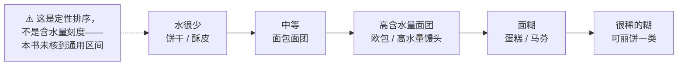
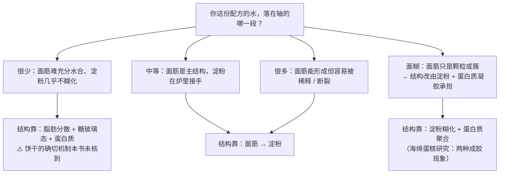
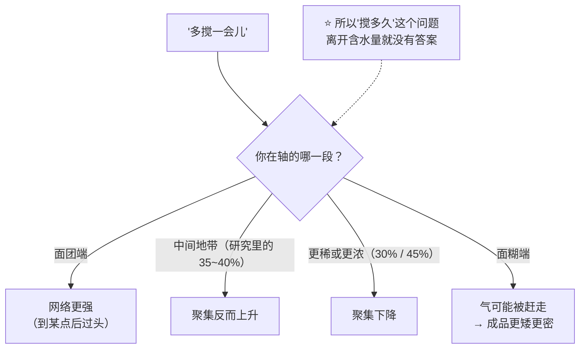

# 第 20 章 面团 vs 面糊的谱系：含水量与搅拌方式决定成品

> **本章目标**：把"这是面包、那是蛋糕"这种**按品类记忆**的方式，
> 换成**按两条轴定位**的方式：
>
> 1. **第一条轴是水**——从掰得动的硬面团到能倒出来的稀面糊，
>    这是一条**连续谱**，不是几个互不相干的类别；
> 2. **第二条轴是搅拌**——同一个含水量下，你还可以选择**优先照顾哪一件事**；
> 3. **位置决定了哪套机制能工作**——第 16~19 章那四套机制，
>    **不是每一套在每个位置都开工**。
>
> 这一章不新增机制，它是**第三部分的收纳柜**：
> 把前四章讲的东西各自归位，并说明**它们在什么条件下才轮到上场**。

## 20.1 先立规矩：这一章的数字来自哪里

烘焙书里常见的"面包含水量 60~70%、蛋糕面糊 100% 以上"这类区间，
**本书没有核到一手出处**（已登记为缺口）。所以这一章**不画那种区间图**，
而是用**能核到的实验点**来标定这条轴——每一个点都写明它自己的基准。

⚠️ **最容易出错的一件事就在这里**：下面这些百分比**基准不同，不能直接比较**。

| 研究里的数字 | 它的基准 | 说的是什么 |
|------------|---------|-----------|
| 面糊浓度 **30% / 35% / 40% / 45%** | 面糊中**面粉的质量分数** | 一份面粉—水面糊有多"浓" |
| 加水 **45% / 60% / 75%** | **面粉重量**（该研究写明） | 白面包面团的含水水平 |
| 加水 **45% / 50% / 55%** | **面粉重量** | 中式馒头面团 |
| 含水 **55% / 60% / 65%** | 该研究写作"含水量" | 手工挂面面团 |
| 裹入油**可达面团重量的 35%** | **面团重量** | 起酥点心的裹入油量 |

> **第 9 章的读数纪律在这一章达到最高强度**：
> ## **看到一个百分比，先问"以什么为 100%"——这一章里它至少有三种不同答案。**
>
> 本书自己的写法一律是：**以面粉总量为 100%**；用别的基准时当页写明。

## 20.2 第一条轴：水决定哪套机制能开工

把已核到的实验点排到一条轴上（**示意图，定性关系**）——
这条轴的两端就是**面团**与**面糊**[^1]：

真正有用的不是刻度，而是**每套机制在什么条件下才开工**：

| 机制 | 需要什么 | 已核到的证据 |
|------|---------|------------|
| **面筋网络** | 足够的浓度 + 机械功 | 一项面粉—水面糊研究：面筋蛋白在**浓度 30% 时是分散颗粒**，**35%、40% 时成簇**，**45% 时才形成连续网络** |
| **淀粉糊化** | 水 + 热，而**水是限制条件** | 白面包实测：**加水 45%（面粉基准）时面包芯仍完全糊化**，但**面包皮只有 29.90%~44.36%**；饼干体系里**几乎不糊化**（第 17 章） |
| **蛋白质凝胶** | 足够的蛋白质浓度 + 热 | 太稀就只变性不成胶（第 18 章）；混合体系里**弹性模量随蛋清含量显著上升** |
| **脂肪"隔开"** | 脂肪在操作温度下仍是固态 | 模型面团研究：高固体脂肪含量的油脂在**界面**上，低的散成**小液滴**（第 19 章） |

> **第一条可迁移判断**：
> ## **"这是什么成品"其实等价于"水给到哪一档，于是哪几套机制被启用"。**
>
> 所以**改水量是这本书里最危险的一个改动**——它可能不是让成品"湿一点"，
> 而是**换掉了承担结构的那套机制**。

## 20.3 第二条轴：搅拌在两端的意义是相反的

同一个动作（继续搅），在轴的两端结果完全不同：

| | 面团那一端 | 面糊那一端 |
|---|----------|-----------|
| 搅拌在做什么 | **给能量、建网络**（第 16 章：面团形成时间 = 面粉的能量需求 ÷（比功率 − 临界功率）） | **充气 + 分散**（第 14 章） |
| 继续搅的后果 | 网络更发达（到某一点后开始过头） | **可能反而更差**：一项充气饼干面糊研究里，**成品中心高度随充气时长下降**，组织密度与力学阻力上升 |
| 关键指标 | 面团发展程度、终温 | 面糊比重（打进去多少气）、黏度 |

而且**中间地带的行为会反转**。同一项面粉—水面糊研究观察到：

> **延长搅拌在浓度 30% 与 45% 下降低面筋聚集指数与麦谷蛋白大聚体，
> 而在 35% 与 40% 下方向相反**；
> 而且**聚集程度与网络连续性并非正相关**。

> **第二条可迁移判断**：
> ## **"要不要多搅"取决于你在轴上的位置，而不是取决于你在做哪一款。**

**面糊内部还能再分一次**。一项比较搅拌气氛的研究把蛋糕面糊明确分成两类：
**乳化型面糊**（磅蛋糕、奶油蛋糕）与**富含气泡的泡沫型面糊**（海绵蛋糕）——
前者的气主要靠**脂肪与乳化**带进来（第 5、14 章），
后者靠**蛋的泡沫**（第 14 章）。**它们对"搅拌"的敏感点不在同一个地方。**

## 20.4 面糊端的"保气"靠黏度

面团靠面筋网络关住气（第 10、16 章）；面糊没有连续的面筋网络，它靠什么？

一项海绵蛋糕研究给了直接答案：**面糊黏度越高，排液、气室合并与气泡上浮越少，气室越稳定**。

但这不意味着"越稠越好"。另一项用小麦粉筛选做蛋糕的研究观察到：
**流动距离更长、黏度更低（更流动）的面粉—水与面粉—蔗糖面糊，做出的蛋糕体积更大**；
同时**籽粒硬度与溶剂保持力与蛋糕体积负相关**。

⚠️ **这两条不是互相矛盾，但也不能简单叠加**——它们测的不是同一件事
（一个是**气室在面糊里的稳定性**，一个是**不同面粉做出的成品体积**）。
**本书未核到给出"面糊黏度最佳窗口"的实验**，所以这里只能给方向：

> **太稀**：气泡上浮、合并、沉淀分层 → 成品矮、组织粗、底部致密；
> **太稠**：涨不动、热传得慢 → 成品矮、组织紧实。
> **中间有一个窗口，但它的位置得你自己试出来。**

## 20.5 位置决定了"失败长什么样"

这是本章最实用的一张表——**同一句抱怨，在轴的两端要查完全不同的东西**：

| 抱怨 | 面团那一端先查 | 面糊那一端先查 |
|------|--------------|--------------|
| **不够高** | 产气（第 11~13 章）、保气（面筋发展、整形）、定型太早 | 充进去多少气（比重）、气有没有跑掉（黏度）、定型太早 |
| **组织太粗** | 整形不到位、气室合并（第 10 章） | 面糊太稀、气泡上浮合并；充气时的气泡分布 |
| **中间塌陷** | 发过头、面筋被弱化 | 黏度不够撑到定型；出炉太早（第 18、21 章） |
| **太硬 / 太韧** | 面筋过度发展、含水量不足 | ⚠️ 面糊端也可能出现，但**"是不是面筋造成的"本书未核到直接实验** |
| **底部致密** | 醒发不足、下火太强 | **气泡上浮 + 重组分沉降**（黏度不够的典型表现） |
| **太干** | 失水（第 21 章）、含水量不足 | 失水 + 蛋白质网络收紧（第 18 章） |

> **第三条可迁移判断**：
> ## **诊断的第一步不是"我做错了哪一步"，而是"我这份配方在轴上的哪个位置"。**

## 20.6 最难的是中间地带

轴的两端反而好办：饼干很干、蛋糕很稀，机制清楚。
**难的是高含水量面团**——面筋能形成，但随时可能被稀释或被扯断。

已核到的两个观察：

| 研究 | 观察 |
|------|------|
| 中式馒头面团（加水 45% / 50% / 55%，**面粉基准**） | 加水越多，搅拌阶段面筋网络**分布越均匀、越呈纤维状**；但 **55% 时发酵过程中面筋纤维发生断裂**，比容上升而咀嚼性与黏性下降 |
| 手工挂面面团（含水 55% / 60% / 65%） | 应力松弛模量随含水量升高**下降**（8.62 Pa → 2.30 Pa）；**60% 含水组的延展性从 64.33 mm 升到 152.67 mm**（随静置延长）；含水越低、静置越久，麦谷蛋白大聚体越多、游离巯基越少 |

⚠️ **两项都不是面包**，本书只引用方向：

> **加水买到的是延展性与更均匀的网络，代价是网络更容易被扯断。**
> 这也是第 40 章（欧包与高含水量）要还的账。

## 20.7 常见说法辨析

按本书约定标注**证据强度**：✅ 有共识 / ⚠️ 有争议 / ❌ 明确错误 / 缺乏证据。

| 说法 | 判定 | 说明 |
|------|------|------|
| "**面团和面糊是两类东西**" | ❌ **是一条连续谱** | 实测把这条谱走了一遍：面筋蛋白在面糊浓度 **30% 时是分散颗粒、35%~40% 成簇、45% 才连续成网**。**中间没有分界线，只有连续变化** |
| "**面糊不能多搅，一搅就出筋**" | ⚠️ **有条件，而且方向会反转** | 同一研究：**延长搅拌在 30% 与 45% 下降低面筋聚集指数与麦谷蛋白大聚体，在 35% 与 40% 下方向相反**；而且**聚集程度与网络连续性并非正相关**。⚠️ 这是**面粉—水模型面糊**，不是蛋糕面糊 |
| "**马芬搅出'隧道'是因为面筋起来了**" | 缺乏证据（本书未核到） | 未核到直接验证这条因果的实验。已核到的相关方向只有"充气时长越长，成品中心高度反而下降"（充气饼干面糊）。**本书不替它补机制**，只建议把"搅拌时长"当变量记录 |
| "**面糊越稠越稳**" | ⚠️ **方向对，但没有窗口** | 海绵蛋糕研究：**黏度越高，排液、气室合并与气泡上浮越少**。但另一项研究里**更流动的面粉—水/面粉—蔗糖面糊做出的蛋糕体积更大**。两者测的不是同一件事；**"最佳黏度窗口"本书未核到** |
| "**加水多一点没关系，成品会更松软**" | ❌ **可能跨过了一档** | 加水改的不只是"湿度"：馒头面团在 **55%（面粉基准）** 时观察到发酵中**面筋纤维断裂**；而面包芯在 **45%** 时就已经完全糊化，**再加水并不能让它更糊化**（第 17 章）。加水可能**换掉承担结构的机制** |
| "**蛋糕粉（低筋粉）就是为了少出筋**" | ⚠️ **不止一个变量** | 第 2 章已给过：低筋粉底下可能还有**氯化处理**（一项研究开宗明义：氯化是软麦粉做高比例蛋糕的常规化学改性手段）。而且一项面粉筛选研究显示**籽粒硬度与溶剂保持力都与蛋糕体积负相关**——"筋度"只是其中一条线 |
| "**看配方的含水量就知道是什么成品**" | ⚠️ **先看基准** | 本章 20.1 那张表里，同样写作"45%"的三个数字**基准完全不同**。⚠️ 各类成品的含水量典型区间**本书未核到一手出处**，不给区间 |
| "**面糊里的面筋完全不起作用**" | ❌ **有，但不是网络** | 面筋蛋白在 35%~40% 浓度下已经**成簇**；而且一项研究里**面筋提高小麦淀粉的峰值黏度（最高约 +105%）**。它在面糊里参与体系，只是**不以连续网络的形式**（第 17 章） |
| "**同一份配方，换个搅拌方式只是省事而已**" | ❌ **换的是优先照顾谁** | 面糊本身就分**乳化型**（磅蛋糕、奶油蛋糕）与**泡沫型**（海绵蛋糕）两类，它们的气来自不同地方（脂肪与乳化 vs 蛋的泡沫）。第 22 章会把六种搅拌法逐个对上 |

## 20.8 🔎 下次烤之前的用处

1. **拿到新配方，第一件事是把它放到轴上**：它是靠面筋、靠淀粉，还是靠蛋白质凝胶定型？
2. **改水量之前先问"我会不会跨档"**——加 5% 和加 20% 不是同一个性质的改动。
3. **"搅到什么程度"这个问题，先回答"我在轴的哪一段"**：
   面团端多搅是建网络；面糊端多搅可能在赶气。
4. **面糊端的失败先查"气"和"黏度"**，别一上来就怪面筋。
5. **看到百分比先问基准**——这一章里"45%"至少有三种含义。
6. **中间地带（高含水量面团）要给更多松弛时间、更少暴力**：
   加水买到的是延展性，代价是更容易被扯断。
7. **把"这次我在轴上移动了多少"写进[烘焙记录表](../../forms/bake-log.md)**，
   而不是只记"加了 10 g 水"。

## 20.9 思考题

1. 为什么说"面团和面糊"是一条连续谱而不是两类东西？请用已核到的实验点说明。
2. 同样写作"45%"的三个数字，基准分别是什么？如果搞混了会得出什么错误结论？
3. "多搅一会儿"在轴的两端分别意味着什么？为什么中间地带的方向还会反转？
4. 面糊靠什么保气？为什么本书不给"最佳黏度"的数字？
5. **【案例】** 某人做马芬，觉得面糊"看起来太稠"，于是**多加了 20% 的牛奶**
   （**以面粉总量为 100%**，其余不变）。结果成品**矮、底部致密发湿、顶部没有裂口**。
   （a）写出完整推理链；（b）他跨过了轴上的哪一档？
   （c）如果他就是想要更湿润的口感，有哪两个方向？各自的代价是什么？
6. **【案例】** 某人做吐司，看到"高含水量面包更松软"的说法，把加水量从 62% 提到 75%
   （**以面粉总量为 100%**），搅拌时间不变。结果面团**很黏、整形时摊开、成品组织粗大、侧面塌陷**。
   （a）用本章与第 16 章解释；（b）哪一步是"机制被换掉了"；
   （c）他该怎么分步验证——一次只改一个变量？
7. **【辨析】** "面糊不能多搅，一搅就出筋"——判断证据强度，
   说明已核到的实验为什么让这句话变复杂了。
8. **【辨析】** "看配方的含水量就知道是什么成品"——判断证据强度，
   并说明本书为什么不给各类成品的含水量区间。

> 📖 **参考答案**（想清楚再看）：[Q1](../../qa/20-dough-batter-spectrum-qa.md#q1) ·
> [Q2](../../qa/20-dough-batter-spectrum-qa.md#q2) · [Q3](../../qa/20-dough-batter-spectrum-qa.md#q3) ·
> [Q4](../../qa/20-dough-batter-spectrum-qa.md#q4) · [Q5](../../qa/20-dough-batter-spectrum-qa.md#q5) ·
> [Q6](../../qa/20-dough-batter-spectrum-qa.md#q6) · [Q7](../../qa/20-dough-batter-spectrum-qa.md#q7) ·
> [Q8](../../qa/20-dough-batter-spectrum-qa.md#q8)

## 20.10 本章实操

### 🅐 零成本版 · 任务一：把五份配方排到同一条轴上

不用烤箱。找五份配方：饼干、塔皮、吐司、马芬、海绵蛋糕各一。
**一律换算成以面粉总量为 100%**（这是[配方解码表](../../forms/recipe-decode.md)的标准动作）。
⚠️ **牛奶、蛋、酸奶等含水材料单独列一行，不要并进"水"**（第 9、18 章）。

| | 饼干 | 塔皮 | 吐司 | 马芬 | 海绵蛋糕 |
|---|-----|------|------|------|---------|
| 水（%） | | | | | |
| 牛奶（%） | | | | | |
| 蛋（%） | | | | | |
| 糖（%） | | | | | |
| 油脂（%，固态 / 液态） | | | | | |
| 你的排序（1 = 最干） | | | | | |
| 主要靠谁定型 | | | | | |
| 搅拌方式是"建网络"还是"充气" | | | | | |

回答：

| 问题 | 你的答案 |
|------|---------|
| 哪两份的排序你最没把握？为什么？ | |
| 有没有哪一份的"液体"其实来自蛋或牛奶？它还带进了什么？ | |
| 如果把吐司那份的水加 15 个百分点，你预测哪套机制先出问题？ | |

### 🅐 零成本版 · 任务二：基准辨认练习

从任意三份网上找到的配方或文章里，各摘一个百分比，判断它的基准：

| 出处（写你自己的备注即可） | 摘到的百分比 | 它写明基准了吗 | 你判断的基准 | 如果基准判断错了会怎样 |
|------------------------|------------|--------------|------------|-------------------|
| | | | | |
| | | | | |
| | | | | |

> **提示**：第 9 章给过判断方法。**没写明基准的百分比只能当方向用，不能当数字用。**

### 🅑 开火版 · 任务三：含水量阶梯（有烤箱时做）

**唯一变量**：加水量。用一份你熟悉的配方做三组，其余全部一致、同炉同时。

| 组 | 加水量（**以面粉总量为 100%**） | 面团 / 面糊手感 | 入炉前高度 | 炉内涨幅 | 成品组织 | 第二天硬度 |
|----|------------------------------|--------------|-----------|---------|---------|-----------|
| ① 按配方 | % | | mm | mm | | |
| ② +5 个百分点 | % | | mm | mm | | |
| ③ +10 个百分点 | % | | mm | mm | | |

做完回答：

| 问题 | 你的答案 |
|------|---------|
| 三组之间是**平滑变化**还是某一组**突然变了性质**？ | |
| 如果有突变，它发生在哪两组之间？——那就是你这份配方的"档"的边界 | |
| 哪一组的**炉内涨幅**最大？它和成品好坏是一回事吗？ | |

### 🅑 开火版 · 任务四（加分）：搅拌时长对照

**唯一变量**：搅拌时长。在**面糊端**做（蛋糕或马芬），三组分别搅到
"刚看不见干粉"、"再搅 30 秒"、"再搅 90 秒"。

| 组 | 搅拌时长 | 面糊比重（同一容器装满称重） | 成品高度 | 组织（均匀 / 有大孔） | 口感 |
|----|---------|--------------------------|---------|-------------------|------|
| ① | | g | mm | | |
| ② | | g | mm | | |
| ③ | | g | mm | | |

> **怎么读结果**：**面糊比重**是这一档最有用的指标——
> 同一个容器装满同一份面糊，越轻说明打进去的气越多。
> 如果 ③ 组比重更大、成品更矮，你就在自己的厨房里看到了
> "**在面糊端多搅可能是在赶气**"。
>
> ⚠️ **局限**：搅拌时长同时改变了充气、面筋聚集与面糊温度。**它给方向，不给定量。**
> 而且"多搅出隧道"这条说法本书**未核到**直接实验——**你测到的是相关，不是机制**。
>
> ⚠️ **安全提醒**：不要尝生面糊与生面团（美国 FDA：生面粉不是即食食品；
> 含蛋配方另有生蛋风险）。⚠️ 各国口径不同，以当地现行发布为准。

## 20.11 本章依据

本章引用的来源与核对状态详见[参考书目与出处登记](../../standards.md)，具体对应如下：

| 本章用到的内容 | 依据 |
|--------------|------|
| 面粉—水面糊浓度 **30% / 35% / 40% / 45%**：面筋蛋白从**分散颗粒 → 成簇 → 连续网络**；**延长搅拌在 30% 与 45% 下降低面筋聚集指数与麦谷蛋白大聚体，在 35% 与 40% 下方向相反**；**聚集程度与网络连续性并非正相关** | *Food Research International* 2026 关于面粉—水面糊中面筋蛋白聚集转变的研究，✅ 摘要层面（第 16 章已登记）。**本章 20.2、20.3 的核心依据** |
| 加水 **45% / 60% / 75%（面粉基准）** 的白面包：**面包芯即使在 45% 时也完全糊化**；面包皮糊化度 29.90%~44.36% | *Food Chemistry* 2018 关于降低面团含水量对白面包糊化影响的研究，✅ 摘要层面（第 17 章已登记） |
| 中式馒头加水 **45% / 50% / 55%（面粉基准）**：加水越多面筋网络越均匀、越呈纤维状；**55% 时发酵中面筋纤维断裂**，比容上升而咀嚼性与黏性下降 | *International Journal of Biological Macromolecules* 2024 关于水合水平对中式馒头影响的研究，✅ 摘要层面（第 3 章已登记）。⚠️ 只引用方向 |
| 手工挂面面团含水 **55% / 60% / 65%**：应力松弛模量由 8.62 Pa 降至 2.30 Pa；**60% 含水组延展性由 64.33 mm 升至 152.67 mm**；含水越低、静置越久，麦谷蛋白大聚体越多、游离巯基越少 | *Journal of Cereal Science* 2023 关于中式手工挂面面团含水量与静置的研究，✅ 摘要层面（第 16 章已登记）。⚠️ **面条体系**，只引用方向 |
| **面糊黏度越高，排液、气室合并与气泡上浮越少，气室越稳定**；**面糊变成蛋糕靠淀粉糊化与蛋白质聚合两种成胶现象** | *Foods* 2021 关于海绵蛋糕中蛋黄低密度脂蛋白作用的研究，✅ 全文已核（第 6 章已登记） |
| **流动距离更长、黏度更低的面粉—水与面粉—蔗糖面糊做出的蛋糕体积更大**；**籽粒硬度与溶剂保持力与蛋糕体积负相关** | *Cereal Chemistry* 2022 关于用籽粒、面粉与面糊性质估计小麦粉做蛋糕潜力的研究，✅ 摘要层面。**本章 20.4 的第二个来源** |
| **成品中心高度随充气时长下降**，组织密度与力学阻力上升；打发率与气泡数主要在前 20 分钟变化 | *Journal of Food Engineering* 2007 关于充气条件对充气饼干面糊与成品影响的研究，✅ 摘要层面（第 14 章已登记） |
| 蛋糕面糊分为**乳化型面糊**（磅蛋糕、奶油蛋糕）与**富含气泡的泡沫型面糊**（海绵蛋糕） | *LWT – Food Science and Technology* 2024 关于搅拌气氛对三类蛋糕影响的研究，✅ 摘要层面（第 14 章已登记）。**本书仅用于体系分类** |
| 面团形成时间 = **面粉的能量需求 ÷（比功率 − 该面粉的临界功率）** | *Journal of Food Engineering* 2020 关于搅拌中面筋网络发展的机械化学活化研究，✅ 摘要层面（第 16 章已登记） |
| **面筋提高小麦淀粉峰值黏度（最高约 +105%）**；乳清蛋白 +22%，大豆蛋白与卵白蛋白最高约 −16% | *Foods* 2025 关于食品蛋白质对小麦淀粉糊化黏度影响的研究，✅ 摘要层面（第 17 章已登记） |
| **氯化是软麦粉做高比例蛋糕的常规化学改性手段**，业界一直在寻找替代方案 | *Foods* 2024 关于以冷等离子体替代软麦粉氯化处理的研究，✅ 开放获取（第 2 章已登记） |
| 高固体脂肪含量的油脂位于蛋白质—淀粉界面、低者呈分散小液滴 | *Carbohydrate Polymers* 2025 模型面团研究，✅ 摘要层面（第 19 章已登记） |
| 生面粉与生面糊的安全 | 美国 FDA「Handling Flour Safely」，✅ 已核到官方页面。⚠️ 各国口径不同 |
| **各类成品的含水量典型区间**（"面包 60~70%、蛋糕面糊 100% 以上"这类） | ⚠️ **不给**（已登记为缺口）：未核到一手出处。本章改用**已核到的实验点 + 写明各自基准**来标定这条轴 |
| **面糊黏度的"最佳窗口"** | ⚠️ **未核到**（本轮新登记的缺口）。已核到的两条方向（黏度高则气室稳、更流动的面糊对应更大蛋糕体积）**测的不是同一件事**，正文只给方向 |
| **"马芬搅拌过度形成隧道"的直接实验** | ⚠️ **未核到**（本轮新登记的缺口）。正文按缺乏证据处理，只建议把搅拌时长当变量记录 |

[^1]: 本章新出现的术语：[面糊](../../glossary.md#batter)（batter）与[面团](../../glossary.md#dough)（dough）、
[含水量 / 水合水平](../../glossary.md#hydration-level)（hydration level）、
[乳化型面糊与泡沫型面糊](../../glossary.md#batter-types)（emulsion-type / foam-type batter）。
第 14 章的[面糊比重](../../glossary.md#batter-specific-gravity)、
第 16 章的[面团形成时间](../../glossary.md#dough-development-time)在本章继续使用。

---

**下一章**：第 21 章 烤箱里的时间轴。
这一章把四套机制排在**空间**上（含水量这条轴），
下一章把它们排在**时间**上——从入炉的第一分钟到出炉，到底按什么顺序发生。
