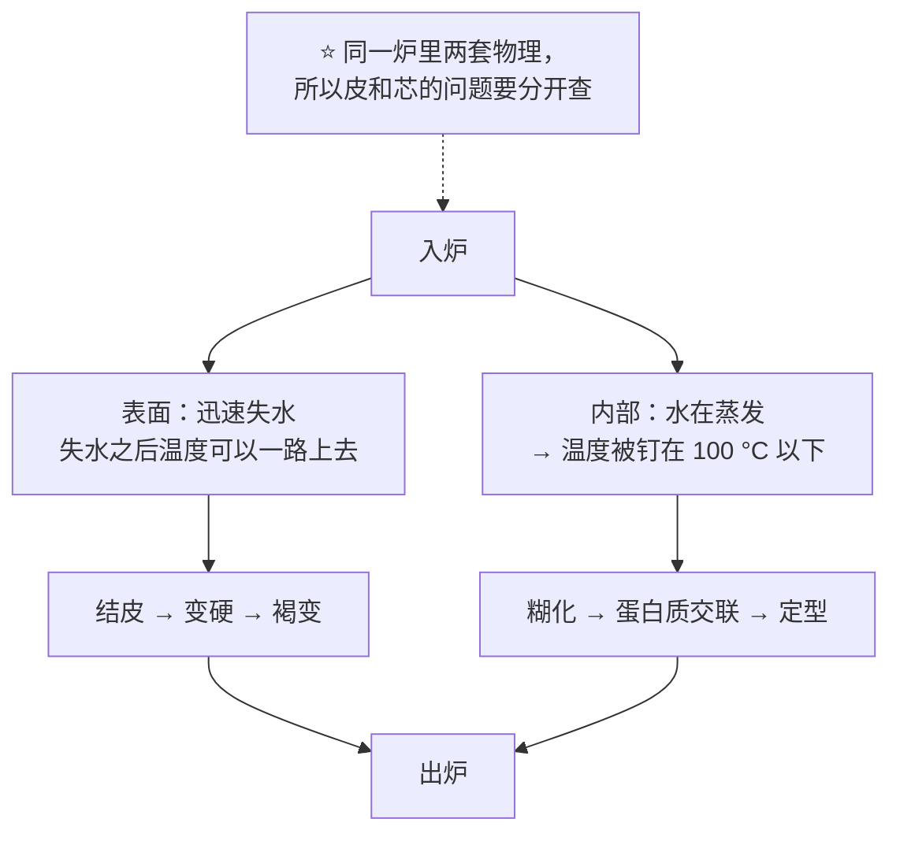
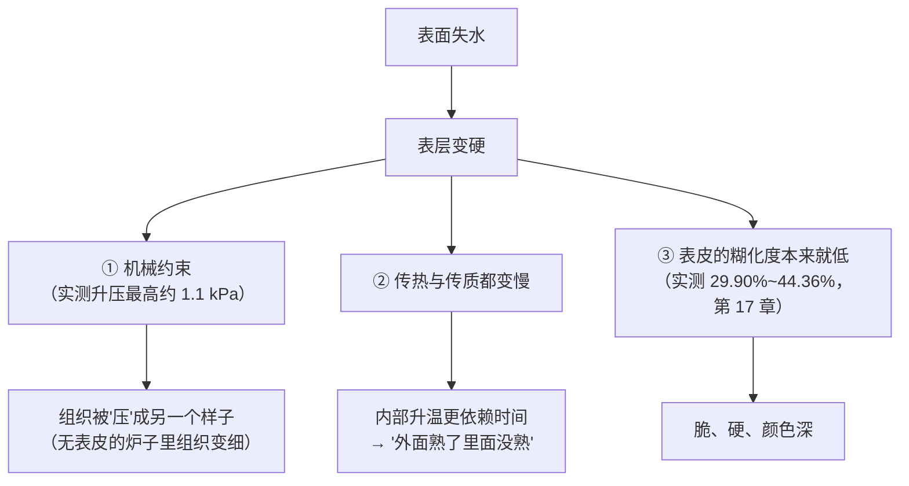
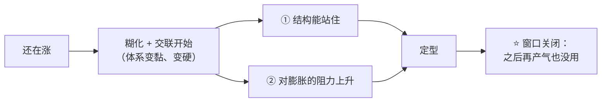
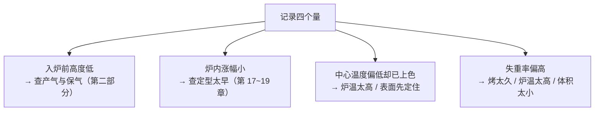

# 第 21 章 烤箱里的时间轴：从入炉到出炉都发生了什么

> **本章目标**：把前五章的机制**排到一条时间轴上**，回答三个问题：
>
> 1. **什么时候还能涨、什么时候不能了**——膨胀窗口在哪一刻关上；
> 2. **为什么皮和芯走的是两条完全不同的路**——它们的温度差了将近一百度；
> 3. **你在炉外能观察和记录的是哪几个量**——因为**进炉之后你只能看着**。
>
> 第 20 章把四套机制排在**空间**上（含水量这条轴）。
> 这一章把它们排在**时间**上。这是第三部分的最后一章，也是它的收口：
>
> > ## **"我这一炉是在哪一步塌的"——学完这一章，你应该能说出答案。**

## 21.1 一条轴，两条温度曲线

烤箱里最关键的一件事，是**成品内部与表面走的根本不是同一条温度曲线**[^1]：

**实测的量级**（两个独立来源）：

| 部位 | 实测 |
|------|------|
| **内部（芯）** | 模拟研究中芯温**不越过 100 °C**，约 25 分钟后稳定在 **98 °C** 左右；一项验证研究实测汉堡面包芯温在**最初 8 分钟升到约 100 °C 并保持** |
| **表面（皮）** | 一项吐司烘烤研究在 190 / 200 / 210 / 220 / 230 °C 下各烤 40 分钟，对照组**表皮温度从 128.5 °C 升到 190.2 °C** |

⚠️ 表皮那一组数字来自**单一研究、单一产品、固定时长**，本书只用它的**方向**：
**炉温越高，表皮温度越高、跑掉的水越多**（该研究中失重从 35.11% 升到 47.23%）。

## 21.2 第一段：还在涨

炉内膨胀不是匀速的。一项用在线图像分析追踪面包烘烤的研究观察到：
**面包体积的变化呈现三个阶段**。

**这一段的气从哪来？** 第 10、15 章讲过，主要有三笔：

| 来源 | 说明 |
|------|------|
| **已有气体受热膨胀** | 发酵/打发时就已经在里面的气室 |
| **溶解的 CO₂ 逸出** | 温度升高使 CO₂ 在面团中的溶解度下降 |
| **水与乙醇汽化** | 第 15 章：水变成蒸汽体积放大一千多倍 |

**酵母并没有立刻退场**。两项用电阻加热炉做的研究给出方向：

- 代谢物与流式细胞术显示酵母**在约 50~65 °C 前仍有代谢活性**，**66 °C 时活细胞约 30%**；
- 另一项比较 15 株高抗逆菌株：**面团高度增加 18.6%~31.5%**，增幅与**细胞存活率强正相关**；
  表现最好的菌株在**面团温度 77 °C** 时仍有 **42.2%** 细胞存活（参照面包酵母为 11.8%）。

⚠️ 这两项都是**特定炉型与特定菌株**，**不能外推成"酵母的死亡温度"**。

**膨胀的顶点是可以被测到的**。一项用带仪表的中试烤炉研究法棍烘烤的工作，
在面团中埋热电偶、连续称重、用摄像机测膨胀：

> **膨胀最大可达 1.7 倍，出现在面包芯温度接近 90 °C 时**，对应内部压力约 90 kPa；
> 而且**水蒸气有利于膨胀**。

**同时，气室的数量在剧烈变化**。一项同时测体积、压力与黏度的研究：

| 阶段 | 气室数量 |
|------|---------|
| 膨胀初期 | **合并速率为负**，即有**新气室成核**，数量**增加多达 8%** |
| 最剧烈膨胀期 | 合并占上风，数量**每秒减少 2%~3%** |
| 面包心形成结束 | 比初始**减少 55%~67%** |

> **第一条可迁移判断**：
> ## **炉内膨胀不是"继续发酵"，而是"已经在里面的气在长大，同时在互相合并"。**
>
> 所以**入炉前的气室分布，很大程度上决定了成品的组织**——
> 这正是第 25 章（整形）要还的账。

## 21.3 第二段：表面先离队

表面一旦失水，它就不再受 100 °C 的天花板限制，于是**迅速与内部拉开距离**。
这带来三个后果：

**① 表层变硬，形成机械约束。**
一项把微型压力传感器埋进面团的研究测到：烘烤中**升压最高约 1.1 kPa**，
而且**主要来自变硬表层的机械约束**；研究**没有检测到**气泡壁变硬引起的升压。

**② 表皮压力会改变内部组织。**
一项经典实验做了一个漂亮的对照：两种原本组织差别很大的面粉，
在**几乎不形成表皮的电阻加热炉**中烘烤时，**组织都变细了**——
推论是**表皮形成造成的压力**是造成组织差异的原因之一。

**③ 组织在烘烤很早就分化了。**
另一项用扫描电镜追踪全流程的研究发现：各**面团**阶段两份样品没有差别，
但**烤到第 12 分钟时，两份面团的气室分布已经不同**。

> **第二条可迁移判断**：
> ## **"外面好了里面没好"不是火候没掌握好，而是两套物理的必然结果——
> 你能做的是改变它们的相对速度（炉温、模具、蒸汽、体积）。**

## 21.4 第三段：定型接力（前五章在这里汇合）

这一段就是第三部分前面几章讲过的全部内容，只是现在给它们排了序：

| 大致先后 | 发生什么 | 哪一章 |
|---------|---------|-------|
| 最早 | **脂肪熔化**——它做的是减法，熔完就退场 | 第 19 章 |
| 然后 | **淀粉糊化**——进程**取决于距表面的深度**，并遵循**一级动力学** | 第 17 章 |
| 同时/随后 | **蛋白质变性与聚集**（蛋、乳）；**面筋受热交联**（80 / 90 / 95 °C 保温实验中按一级动力学，活化能 110 与 147 kJ/mol，**淀粉不影响其速率**） | 第 18、16 章 |
| 结果 | **定型**：结构能自己站住，同时**膨胀窗口关闭** | 第 17 章 |

⚠️ **注意"大致"两个字**：这些事件的温度**都会被配方推着走**
（糖把糊化与变性温度推高、水不够把糊化推得更高、酸让蛋黄更早凝……）。
**本书不给这条轴上的温度刻度**——那正是第 17、18 章反复强调的。

## 21.5 第四段：褐变，而且只在表面

第 4 章讲过糖参与上色。这里补上时间轴上的条件：**褐变要等表面先干**。

能引用的定量证据是一项关于饼干中 HMF 生成的研究（180 / 200 / 210 / 220 °C，10~25 分钟）：

> **水分活度降到 0.4 以下是一个临界点，越过之后 HMF 生成速率急剧上升。**

⚠️ **本书不写"美拉德反应从 140~165 °C 开始"这个数字**：
该区间在二手资料里到处出现，但**找不到给出它的一手实验出处**（见[出处登记](../../standards.md) §6）。
能写的只有方向：

> **温度越高反应越快；而在烘焙的时间尺度里，得先让表面失水、
> 表面温度升到水的沸点以上，才看得到明显褐变。**

**这也解释了为什么面包芯几乎不褐变**：它被钉在 100 °C 以下，而且一直是湿的。

## 21.6 第五段：出炉不是终点

| 出炉后发生什么 | 证据 |
|--------------|------|
| **内部压力继续下降** | 压力实测：冷却时全芯**同步降压约 −0.15 kPa**，说明**表皮的透气性低于面包芯** |
| **水继续跑，也继续重新分配** | 老化综述：面包老化最站得住的假说是**支链淀粉回生**，伴随**水分在面筋与淀粉之间重新分配**（第 45 章） |
| **结构还在变** | 淀粉凝胶在冷却中形成、脂肪重新结晶（第 17、19 章） |

还有一条与"烤的时候做了什么"直接相关的实测：一项比较**加湿烘烤**与常规烘烤的研究
（185 / 195 / 205 °C × 25 / 30 / 35 分钟）发现：

> 加湿烘烤对**表皮颜色没有显著影响**，但**显著减小表皮厚度**、
> **提高面包芯的初始含水量**；更高的初始含水量带来更高的最终含水量，
> 于是在 **96 小时**储存中**变硬得更慢**——在较低的烘烤温度与较短时间下尤其明显。

> **第三条可迁移判断**：
> ## **你在炉子里做的事，决定的不只是出炉那一刻，还有它第二天的样子。**

## 21.7 你真正能记录的四个量

进炉之后你只能看着——但**有四个量是你在炉外就能拿到的**，
它们把这条时间轴变成可观察、可比较的东西：

| 记什么 | 怎么记 | 它告诉你哪一段 |
|--------|-------|--------------|
| **入炉前高度** | 尺量，或拍照对同一参照物 | 入炉前的产气与保气（第二部分） |
| **炉内涨幅** | 成品高度 − 入炉前高度 | **21.2 那一段**：还能涨多久 |
| **出炉时中心温度** | 探针温度计，**每次都记** | **21.4 那一段**：定型走到哪了 |
| **失重率** | 烤前烤后各称一次 | **21.3、21.5 那两段**：跑了多少水、表面干到什么程度 |

> **这四个量的价值在于：它们可迁移。**
> "烤 25 分钟"换一台烤箱就没意义；
> "**出炉时中心温度 X °C、失重 Y%**"换一台烤箱仍然有意义（第 32 章）。

## 21.8 常见说法辨析

按本书约定标注**证据强度**：✅ 有共识 / ⚠️ 有争议 / ❌ 明确错误 / 缺乏证据。

| 说法 | 判定 | 说明 |
|------|------|------|
| "**面包芯也能烤到 120 °C 以上，所以里面也有焦香**" | ❌ **有天花板** | 只要还有水在蒸发，芯温就很难越过 100 °C（模拟约 98 °C；实测汉堡面包芯温约 100 °C 并保持）。**面包芯基本不发生表皮那种程度的褐变** |
| "**酵母一进炉就死了，炉内膨胀和它没关系**" | ❌ **它还活一阵** | 电阻加热炉研究：酵母**在约 50~65 °C 前仍有代谢活性**，**66 °C 时活细胞约 30%**；另一项里耐热菌株在 **77 °C** 时仍有 42.2% 存活，且**面团高度增幅与存活率强正相关**。⚠️ 特定炉型与菌株，**不能当作"酵母的死亡温度"** |
| "**炉内膨胀全靠酵母继续产气**" | ⚠️ **主力不是它** | 炉内膨胀主要来自**已有气体受热膨胀 + 溶解 CO₂ 逸出 + 水与乙醇汽化**。第 10 章那项用化学膨松代替酵母的研究更直接：**面团膨胀既不受 CO₂ 的量限制，也不受其释放动力学限制**，受限的是**烘烤阶段还能不能继续充气** |
| "**前十分钟绝对不能开炉门**" | ⚠️ **工艺口语**（机制方向相容，但无对照实验） | 已核到的机制方向：表层未定住前，压力与温度的扰动确实可能影响膨胀（升压最高约 1.1 kPa，**主要来自变硬表层的机械约束**）。但**开炉门的定量影响本书未核到**对照实验（已登记为缺口），所以本书不给"几分钟"这个数字 |
| "**上色了就是熟了**" | ❌ **两条独立的线** | 上色发生在**表面**（要先失水、越过水分活度 0.4 一类的临界点），定型发生在**内部**（糊化与蛋白交联）。两者可以严重脱节——尤其在炉温偏高时。**判据要用中心温度 + 状态，不是颜色**（第 32 章） |
| "**炉温调高能更快烤熟**" | ❌ **主要加速的是表面** | 内部被 100 °C 天花板与传热限制着；升高炉温主要抬高**表皮温度**（实测 128.5 °C → 190.2 °C）与**失重**（35.11% → 47.23%）。结果常常是"外面焦了里面还湿"（第 17 章的案例题） |
| "**喷蒸汽是为了让表皮上色**" | ⚠️ **实测：主要不是颜色** | 一项加湿烘烤研究：对**表皮颜色没有显著影响**，但**显著减小表皮厚度**、提高面包芯初始含水量，从而**减慢 96 小时内的变硬**。另有法棍研究表明**水蒸气有利于膨胀**。⚠️ **家用蒸汽替代方案（放水碗、喷水）的定量效果本书未核到** |
| "**组织好不好是烤出来的**" | ⚠️ **很早就分化了** | 扫描电镜研究：各**面团**阶段两份样品没有差别，**烤到第 12 分钟时气室分布已经不同**；而且气室数量在面包心形成结束时比初始**减少 55%~67%**。**烘烤在放大差异，差异多半来自更早的步骤** |
| "**只要时间到了就烤好了**" | ❌ **时间不可移植** | 糊化进程取决于**局部温度与距表面的深度**；面筋交联按一级动力学随温度加速。**同一个"25 分钟"在两台烤箱里是两件事**。可迁移的是**温度与现象**（第 32 章） |
| "**出炉就结束了**" | ❌ **冷却期还在变** | 压力实测：冷却时全芯同步降压约 **−0.15 kPa**（表皮透气性低于面包芯）；淀粉凝胶在冷却中形成、脂肪重新结晶、水分开始重新分配（第 17、19、45 章） |

## 21.9 🔎 下次烤之前的用处

1. **每一炉都记那四个量**：入炉前高度、炉内涨幅、出炉时中心温度、失重率。
   **这四个数字就是你的时间轴。**
2. **别用颜色判断熟没熟**——它们是两条线。
3. **"外面好了里面没好"时，先想相对速度**：降低炉温 + 延长时间、换深色/浅色模具、
   改小体积、加蒸汽（第 28~31 章会逐个展开）。
4. **炉内涨幅小，说明定型太早**——去查糖、水、炉温，而不是去加酵母。
5. **组织不好，先查更早的步骤**（整形、搅拌、发酵），因为差异在第 12 分钟就已经分出来了。
6. **出炉后给它时间**：结构还在完成，脂肪还在结晶（第 33 章）。
7. **换烤箱、换烤盘、换份量之后，第一次一定当成新实验**——
   时间轴会整体平移。

## 21.10 思考题

1. 为什么说烤箱里有"两条温度曲线"？各自的上限由什么决定？
2. 炉内膨胀的气主要来自哪三笔？为什么"酵母继续产气"不是主力？
3. 气室数量在烘烤中先增后减。请描述这三个阶段，并说明它对"组织好不好"意味着什么。
4. "上色了就是熟了"错在哪里？请用本章的两条线解释，并给出正确的判据。
5. **【案例】** 某人烤吐司，按配方 180 °C 烤 30 分钟。成品**表面颜色很深、侧面收腰、
   切开中间偏湿**。他下次打算"**再多烤 5 分钟**"。
   （a）写出完整推理链，解释这三个现象；（b）"多烤 5 分钟"会改善哪一个、恶化哪一个；
   （c）给出两个更好的改动方向，并说明各自要记录什么来验证。
6. **【案例】** 某人做欧包，入炉前高度和上次一样，但这次**炉内几乎没涨**，
   成品**组织紧实、底部有一层致密带**。
   （a）用"膨胀窗口"和"定型时刻"分析；（b）列出三个值得怀疑的变量，
   并说明怎么一次只改一个来定位；（c）哪一个记录量最能区分"没涨"和"涨了又塌"？
7. **【辨析】** "前十分钟绝对不能开炉门"——判断证据强度，
   说明已核到的机制方向是什么，以及本书为什么不给"十分钟"这个数字。
8. **【辨析】** "喷蒸汽是为了上色"——判断证据强度，
   并说出实测里蒸汽真正改变了哪两件事。

> 📖 **参考答案**（想清楚再看）：[Q1](../../qa/21-oven-timeline-qa.md#q1) ·
> [Q2](../../qa/21-oven-timeline-qa.md#q2) · [Q3](../../qa/21-oven-timeline-qa.md#q3) ·
> [Q4](../../qa/21-oven-timeline-qa.md#q4) · [Q5](../../qa/21-oven-timeline-qa.md#q5) ·
> [Q6](../../qa/21-oven-timeline-qa.md#q6) · [Q7](../../qa/21-oven-timeline-qa.md#q7) ·
> [Q8](../../qa/21-oven-timeline-qa.md#q8)

## 21.11 本章实操

### 🅐 零成本版 · 任务一：给一份配方画出它的时间轴

不用烤箱。挑一份你做过或想做的配方（**换算成以面粉总量为 100%**），
按本章的五段填表——**只写你的预测**，做的时候再回来对：

| 阶段 | 这份配方里会发生什么 | 你的预测 | 依据（哪一章） |
|------|-------------------|---------|--------------|
| ① 还在涨 | 气从哪几笔来？ | | 第 10、15、21 章 |
| ② 表面离队 | 表皮会厚还是薄？为什么？ | | 第 17、21 章 |
| ③ 定型接力 | 主要靠谁定型？糖量把它推前还是推后？ | | 第 16~19 章 |
| ④ 褐变 | 上色主要来自什么？会不会太快？ | | 第 4、21 章 |
| ⑤ 出炉之后 | 需要冷却多久才能切？为什么？ | | 第 17、19、33 章 |

### 🅐 零成本版 · 任务二：用一块现成的面包倒推它的时间轴

拿一块商品面包或蛋糕，只靠观察回答：

| 观察 | 记录 | 它反映哪一段 |
|------|------|------------|
| 表皮厚度（大约几毫米） | | 表面失水的程度（②） |
| 表皮与内部颜色差多少 | | 褐变只在表面（④） |
| 组织是细密还是粗大、孔的分布均匀吗 | | 气室合并与整形（①，第 25 章） |
| 底部有没有致密带 | | 沉降 / 定型太早（第 20 章） |
| 放一天后，先变硬的是哪一部分 | | 水分再分配（⑤，第 45 章） |

### 🅑 开火版 · 任务三：建立你这份配方的"出炉判据"（有烤箱时做）

**不改配方**，只改你的**记录方式**。同一份配方连做三次，每次都记录同样四个量：

| 次 | 入炉前高度 | 炉内涨幅 | 出炉时中心温度 | 烤前重量 → 烤后重量 | 失重率 | 成品评价 |
|----|-----------|---------|--------------|------------------|-------|---------|
| ① | mm | mm | °C | g → g | % | |
| ② | mm | mm | °C | g → g | % | |
| ③ | mm | mm | °C | g → g | % | |

做完回答：

| 问题 | 你的答案 |
|------|---------|
| 你最满意的那一次，中心温度是多少？失重率是多少？ | |
| 这两个数字能不能作为你下次的**出炉判据**？ | |
| 三次之间波动最大的是哪个量？这说明你哪一步不稳定？ | |

> **为什么这个练习比"试新配方"更有价值**：因为它产出的是**可迁移的判据**——
> 换烤箱、换份量之后仍然能用（第 32 章）。

### 🅑 开火版 · 任务四（加分）：炉温对照

**唯一变量**：炉温。同一份配方做两组，**炉温差 20 °C**，烤到**同一个中心温度**为止
（不是同一个时间！）。

| 组 | 设定炉温 | 实测炉温（独立温度计） | 到达目标中心温度用了多久 | 失重率 | 表皮厚度与颜色 | 炉内涨幅 |
|----|---------|-------------------|--------------------|-------|--------------|---------|
| ① | °C | °C | 分钟 | % | | mm |
| ② | °C | °C | 分钟 | % | | mm |

> **怎么读结果**：如果高温那组**时间更短、失重更少、但表皮更厚更深**，
> 你就亲眼看到了 21.3 那一节——**升高炉温主要加速的是表面**。
>
> ⚠️ **局限**：炉温同时改变了传热、失水与褐变速率。**它给方向，不给定量**。
> ⚠️ **你的烤箱几乎一定不准**——先用独立温度计实测，把炉温当成需要标定的变量
> （第 29 章、项目 P3）。
>
> ⚠️ **安全提醒**：不要尝生面糊与生面团（美国 FDA：生面粉不是即食食品；
> 含蛋配方另有生蛋风险，含蛋菜品建议做到 160 °F，约 71 °C，并用食品温度计确认）。
> ⚠️ 各国口径不同，以当地现行发布为准。

## 21.12 本章依据

本章引用的来源与核对状态详见[参考书目与出处登记](../../standards.md)，具体对应如下：

| 本章用到的内容 | 依据 |
|--------------|------|
| **面包体积在烘烤中的变化呈现三个阶段**（在线图像分析） | *Asia-Pacific Journal of Chemical Engineering* 2006 关于用在线图像分析研究面包炉内膨胀的工作，✅ 摘要层面（Crossref 题录与摘要）。本书只引用"三阶段"这一形态描述 |
| **膨胀最大可达 1.7 倍，出现在面包芯温度接近 90 °C**，对应内部压力约 90 kPa；**水蒸气有利于膨胀** | *Journal of Food Engineering* 2005 用带仪表的中试烤炉研究法棍烘烤的工作，✅ 摘要层面（第 10 章已登记） |
| 面包芯温**不越过 100 °C**（模拟约 98 °C）；实测汉堡面包芯温在最初 8 分钟升到约 100 °C 并保持 | *Food Research International* 2011 CFD 模拟与 *Journal of Food Protection* 2016 验证研究，✅ 摘要层面（第 10 章已登记）。⚠️ 后者是工业条件下的特定产品 |
| 吐司在 190~230 °C 下各烤 40 分钟：对照组**表皮温度 128.5 °C → 190.2 °C**，**失重 35.11% → 47.23%** | *Food Science & Nutrition* 2021 关于吐司烘烤失重与表皮温度建模的研究（开放获取），✅（第 3 章已登记）。⚠️ **单一研究、单一产品、固定时长**，本书只引用方向 |
| 烘烤中**升压最高约 1.1 kPa，主要来自变硬表层的机械约束**；**未检测到**气泡壁变硬引起的升压；**70 °C 前的压力骤降归因于气室合并**；烘烤结束前内部已是**开孔结构**；**冷却时全芯同步降压约 −0.15 kPa**，说明表皮透气性低于面包芯 | *Journal of Cereal Science* 2010 关于烘烤中局部压力与温度联合测量的研究，✅ 摘要层面（第 15 章已登记）。**本章 21.3、21.6 的主要数据源** |
| 两种原本组织差别很大的面粉，在**几乎不形成表皮的电阻加热炉**中烘烤时**组织都变细**——推论：**表皮形成造成的压力**是组织差异的原因之一 | *Cereal Chemistry* 1998 关于压力（表皮形成）对面包组织影响的研究，✅ 摘要层面（第 15 章已登记） |
| 各面团阶段没有差别，**烤到第 12 分钟时两份面团的气室分布已经不同**；气室变大、壁变厚 | *Cereal Chemistry* 1998 关于面包组织在烘烤中发育的研究，✅ 摘要层面（第 15 章已登记） |
| 烘烤膨胀初期**有新气室成核、数量增加多达 8%**；最剧烈膨胀期**每秒减少 2%~3%**；面包心形成结束时比初始**减少 55%~67%** | *Food Research International* 2018 关于烘烤膨胀中气室合并动力学的研究，✅ 摘要层面（第 10 章已登记） |
| 酵母**在约 50~65 °C 前仍有代谢活性**，**66 °C 时活细胞约 30%**；另一项中耐热菌株在**面团温度 77 °C** 时仍有 **42.2%** 存活（参照 11.8%），**面团高度增加 18.6%~31.5%** 且与存活率强正相关 | *Food Chemistry* 2026 与 *Food Chemistry* 2025 两项电阻加热炉研究，✅ 摘要层面（第 10、15 章已登记）。⚠️ **特定炉型与菌株，不可外推为"酵母的死亡温度"** |
| **面团膨胀既不受 CO₂ 的量限制，也不受其释放动力学限制**，受限的是**烘烤阶段还能不能继续充气** | *Innovative Food Science and Emerging Technologies* 2016 用化学膨松系统研究小麦面团失稳的工作，✅ 摘要层面（第 10 章已登记） |
| 淀粉糊化进程**取决于距样品表面的深度**，遵循**一级动力学**；面包皮糊化度 **29.90%~44.36%** | *Journal of Food Science* 1991 与 *Food Chemistry* 2018 两项研究，✅ 摘要层面（第 17 章已登记） |
| 面筋蛋白在 **80 / 90 / 95 °C** 下通过巯基—二硫键交换聚合，按**一级动力学**进行（活化能 110 与 147 kJ/mol），**淀粉不影响其速率** | *Journal of Agricultural and Food Chemistry* 2008，✅ 摘要层面（第 10、16、18 章已登记） |
| **水分活度降到 0.4 以下是一个临界点**，越过后 HMF 生成速率急剧上升 | *European Food Research and Technology* 2008 关于膨松剂与糖对饼干中 HMF 生成影响的研究，✅ 摘要层面（第 4 章已登记）。**"先干后褐"的定量旁证** |
| 加湿烘烤（185 / 195 / 205 °C × 25 / 30 / 35 分钟）：对**表皮颜色无显著影响**，但**显著减小表皮厚度**、**提高面包芯初始含水量**，并**减慢 96 小时储存中的变硬**（较低温度与较短时间下尤其明显） | *Food Science and Technology Research* 2013 关于加湿烘烤对面包表皮与面包心性质影响的研究，✅ 摘要层面（Crossref 题录与摘要）。⚠️ 单一研究与特定产品，本书只引用方向 |
| 面包老化最站得住的假说是**支链淀粉回生**，伴随**水分在面筋与淀粉之间重新分配** | *Comprehensive Reviews in Food Science and Food Safety* 2003 与 2014 两篇综述，✅ 摘要层面（第 3 章已登记）。第 45 章展开 |
| 生面粉与生面糊的安全；含蛋菜品的安全温度 | 美国 FDA「Handling Flour Safely」与「What You Need to Know About Egg Safety」，✅ 已核到官方页面。⚠️ 各国口径不同 |
| **"美拉德反应从 140~165 °C 开始"** | ⚠️ **不写**：该区间在二手资料里到处出现，但**找不到给出它的一手实验出处**（见 §6）。正文改写成"温度越高越快 + 表面必须先失水"的方向性规律 |
| **气室"什么时候开孔"的温度或时刻** | ⚠️ **未核到**：综述明说**机制尚不清楚**（已登记为缺口）。正文只给方向 |
| **烘烤中途开炉门的定量影响** | ⚠️ **未核到**对照实验（已登记为缺口）。正文按**工艺口语**处理，不给"几分钟"这个数字 |
| **家用烤箱蒸汽替代方案（放水碗、喷水）的定量效果** | ⚠️ **未核到**（已登记为缺口）。正文只写方向 |
| **家用烤箱实际温度偏差**的定量数据 | ⚠️ **未核到**（已登记为缺口）。正文只写"把炉温当作需要自己标定的变量"，方法留给第 29 章与项目 P3 |

[^1]: 本章新出现的术语：[炉内膨胀](../../glossary.md#oven-rise)（oven rise）、
[失重率](../../glossary.md#baking-loss)（baking loss）、
[表皮形成](../../glossary.md#crust-formation)（crust formation）、
[出炉判据](../../glossary.md#doneness-criteria)（doneness criteria）。
第 15 章的[炉内膨胀（oven spring）](../../glossary.md#oven-spring)、[汽化潜热](../../glossary.md#latent-heat)、
第 10 章的[气室](../../glossary.md#gas-cell)与[合并](../../glossary.md#coalescence)在本章继续使用。

---

**第三部分到此结束。** 你现在应该能回答那个开篇的问题——
**"我这一炉是在哪一步塌的"**：是没撑起来（第二部分），还是撑起来了没定住（这一部分），
或者是**定得太早**，根本没来得及撑。

**下一部分**：第四部分 · 操作即控制变量。
前三部分讲的是**配方里写着的东西**；第四部分讲**配方没写、但你一直在做的那些事**——
搅拌、温度、发酵、整形。它们同样服从"竞争关系"这条主线，
只是它们**不在配料表里，所以最容易被忽略**。
