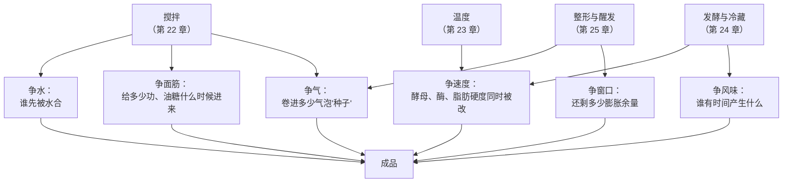
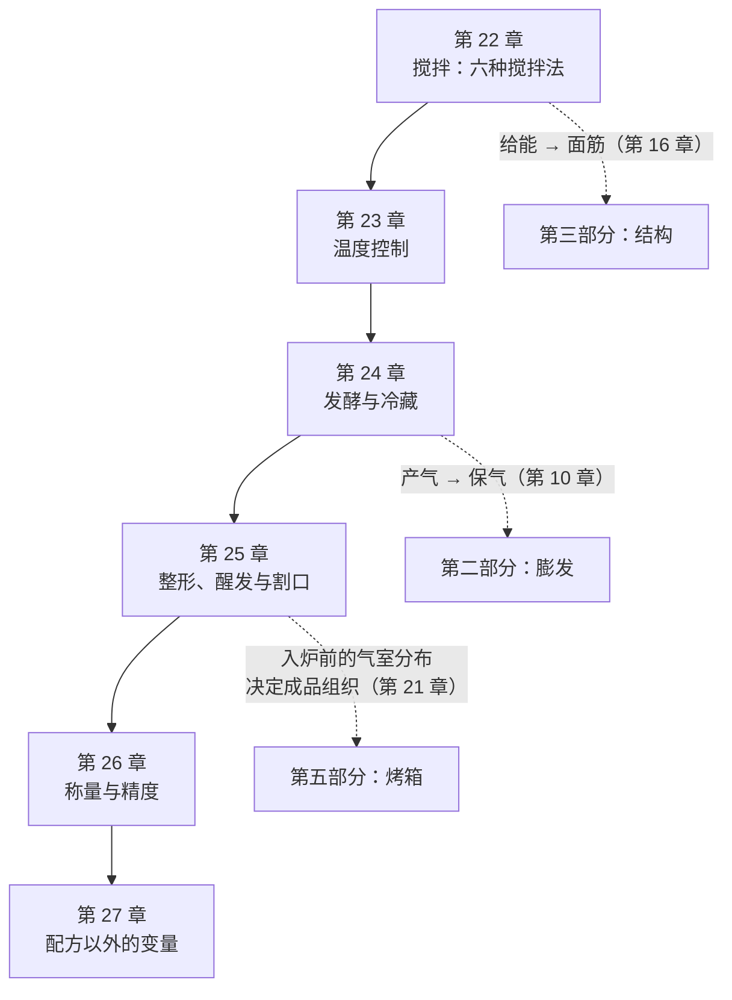

# 第四部分 · 操作即控制变量

> **这一部分只回答一个问题**：**配料表以外，你还在动哪些东西？**
>
> 前三部分讲的都是**配方里写着的**：放了什么、放多少、它们在炉子里怎么变。
> 但两个人拿同一份配方做出两个成品，差别往往**不在配料表里**——
> 差在搅了多久、面团多少 °C、发了多长时间、怎么整的形。

## 为什么"手法"要当成变量来学

烘焙书和视频里，这些东西通常被写成**动作**："揉到光滑""发到两倍大""室温软化黄油"。
动作是不可移植的：你的"揉到光滑"和别人的不是同一件事，
你家的"室温"和写配方那个人的也不是同一个温度。

> ## **这一部分做的事，就是把每一个动作翻译成一个可以被记录、被比较、被单独改动的量。**

| 常见的说法（动作） | 本书要把它变成的东西（变量） | 在哪一章 |
|------------------|--------------------------|---------|
| "揉到光滑 / 揉出膜" | **给了多少功**（转速 × 时间 × 机器），以及**先给谁水** | 第 22 章 |
| "室温软化黄油""水别太烫" | **面团终温**与各原料入锅时的温度 | 第 23 章 |
| "发到两倍大""发一晚上" | **时间 × 温度**这一对，以及它们分别改了什么 | 第 24 章 |
| "整形要紧一点""割一刀" | **气室怎么被重新分配**、**破口开在哪** | 第 25 章 |
| "一杯面粉""少许盐" | **称量误差**本身就是变量 | 第 26 章 |
| "我照做了但就是不对" | 面粉批次、湿度、海拔、水质 | 第 27 章 |

## 它们同样服从那条主线

第 1 章的第一原理在这一部分**一个字都不用改**：操作也在**抢资源**。

**所以这一部分的每一章都在回答同一句话的一个版本**：

> **"我改的这个操作，抢走了谁的什么？"**

## 一条贯穿这一部分的纪律

> ## **一个变量只有被记下来，才算变量；否则它只是运气。**

这不是口号，它有一个很具体的理由：**这一部分的大多数量，文献里给不出通用值**。

- "最佳发酵温度"——已核到的温度全是各项研究的**实验设计**，而且测的不是同一件事；
- "发到两倍大"——文献里的醒发终点都是**特定产品**的实验设计；
- "面团终温要打到多少"——本书**没有核到**可引用的通用目标值；
- "水温 = 目标终温 × 3 − 室温 − 粉温 − 摩擦系数"——**这条流传极广的公式本书没有核到一手出处**
  （第 23 章会把它连同它的假设一起摊开讲）；
- "割口深多少"——本书检索到的只有**专利**，没有对照实验。

面对这种情况，本书的一贯做法不变：**不写死数字，改给方向 + 你能在自家厨房建立的曲线**
（所有缺口都登记在[出处登记](../../standards.md)的「已知缺口」一节）。
这一部分因此比前三部分更依赖[烘焙记录与复盘表](../../forms/bake-log.md)——
**它是这一部分的主要产出物**。

## 这一部分的地图

**前四章是一条时间线**：面团从搅拌机里出来（第 22 章）→ 它有一个温度（第 23 章）→
它在这个温度下待一段时间（第 24 章）→ 你把它整形、等它醒发、划一刀送进炉（第 25 章）。
**后两章是它们共同的地基**：称量的精度（第 26 章）与你控制不了的那些变量（第 27 章）。

## 各章一句话

| 章 | 它回答的问题 | 状态 |
|----|------------|------|
| [第 22 章 搅拌](22-mixing-methods.md) | 六种搅拌法分别在优先照顾哪一件事？ | ✅ |
| [第 23 章 温度控制](23-temperature-control.md) | 面团几 °C 到底影响什么？水温该怎么定？ | ✅ |
| [第 24 章 发酵与冷藏](24-fermentation-time-temperature.md) | 快发和冷藏慢发，差的只是时间吗？ | ✅ |
| [第 25 章 整形、醒发与割口](25-shaping-proofing-scoring.md) | 整形改的是什么？割口到底在干嘛？ | ✅ |
| [第 26 章 称量与精度](26-measurement-precision.md) | "一杯面粉"是多少克？ | ✅ |
| 第 27 章 配方以外的变量 | 为什么同一份配方在别人家不成立？ | ⬜ |

## 学完这一部分，你应该能

1. 做完一炉，说得出**"这次我改的是哪一个变量"**，而不是"我感觉今天面团不太一样"；
2. 把"揉到光滑""发到两倍大"这类不可移植的说法，**翻译成你自己的可记录判据**；
3. 知道每个操作**抢走了谁的什么**——例如"多揉五分钟"同时改了面筋、气泡和面团温度三件事，
   所以它不是一个干净的单变量；
4. 建立一张属于你这间厨房的表：室温、粉温、水温、面团终温、发酵时长、入炉前高度——
   **这张表比任何配方都更值钱**（第 27 章会解释为什么）。
