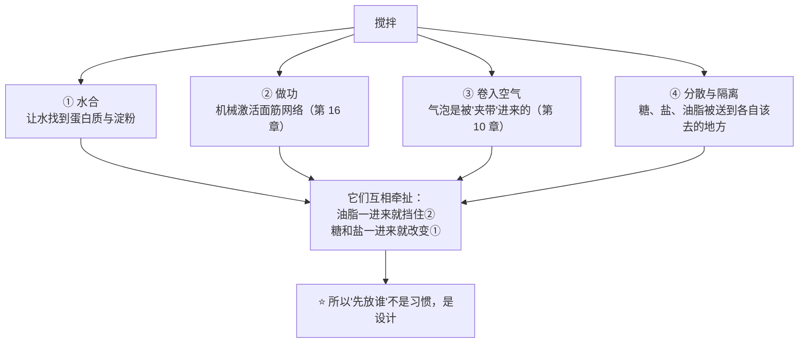
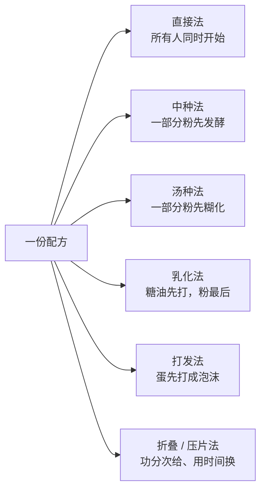

# 第 22 章 搅拌：直接法、中种、汤种、乳化法、打发法、折叠法

> **本章目标**：把"搅拌"从一个动作变成**一组可以排序的决定**。
>
> 六种搅拌法不是六种手艺流派，而是**六种优先级排列**：
> 在同一份配方里，你先让谁拿到水、先给谁做功、什么时候把空气卷进去、
> 什么时候让油脂进场把面筋挡住。
>
> > ## **配方决定了有哪些原料在抢资源；搅拌法决定了它们抢的顺序。**

前一部分的最后一章（[第 21 章](../03-structure/21-oven-timeline.md)）留下过一句话：
**组织的差异在烘烤的第 12 分钟就已经分出来了，所以想改组织要去改更早的步骤。**
这一章就是"更早的步骤"里的第一步。

## 22.1 搅拌同时在做四件事

厨房里说"搅匀就行"，但在面团/面糊里，同一个动作**同时**在做四件互相牵扯的事[^1]：

这四件事在本书前面都出现过，只是分散在不同章：

| 这一件事 | 讲过它的地方 | 一句话 |
|---------|------------|-------|
| **水合** | 第 3、16 章 | 水是有限的，面筋、淀粉、糖、纤维在抢它 |
| **做功** | 第 16 章 | 面筋网络要靠**机械激活**承力键才发展得起来 |
| **卷入空气** | 第 10、14 章 | **烘烤不会凭空造出新气泡**，气室的"种子"主要在搅拌时被夹带进来 |
| **分散与隔离** | 第 4、5、7 章 | 油脂阻断面筋、糖抢水并推迟交联、盐推迟网络形成 |

> **第一条可迁移判断**：
> ## **"搅拌不够"和"搅拌过头"可以同时发生——因为它同时在做四件事，四件事的最佳点不在同一刻。**

## 22.2 时间不可移植，功可以比

配方里写"中速搅 8 分钟"，换一台机器就没意义。第 16 章引用过的一项建模研究把这件事写成了公式：

> **面团形成时间 = 面粉的能量需求 ÷（比功率 − 该面粉的临界功率）**

三个含义，逐条拆开：

| 公式里的东西 | 含义 | 对你意味着什么 |
|-------------|------|--------------|
| **能量需求** | 这袋粉要吸收多少功才算发展好 | **换粉就换分子**，时间跟着变 |
| **比功率** | 你的机器**单位面团质量**输入功率 | 机器、转速、面团量一变，分母就变 |
| **临界功率** | 低于它，怎么搅都发展不起来 | 这解释了"手揉很久也到不了机器的状态" |

同一项研究还发现两件对家庭操作直接有用的事：**加入干扰巯基/二硫键的化学品**，
以及**在搅拌一开始加一个停顿**，都会**降低那个临界功率**——
也就是**让面团更容易被发展起来**。**后者正是"[自解法](../../glossary.md#autolyse)"的学术对应**。

**机器与方法是配对的，不是通用的。** 一项专门比较揉面机类型与总转数的研究
（螺旋式 vs 双臂式；总转数 800 / 1600 / 2400）发现：两个因素**对面团流变与成品都有显著影响**，
而且**直接法与 biga（中种的一种）各自适合不同的机器**——
直接法下双臂式给出最优特征，biga 法下螺旋式给出最高比容与最大高度。

> ⚠️ **这是一项研究、两种工业机型**，本书**不引用它的转数当作推荐值**。
> 能引用的方向是：**"搅多久"必须和"用什么搅""用哪种方法"绑在一起说。**

**还有一条不靠机器的路**：一项用**压片**（反复过辊）代替长时间搅拌来发展面团的研究显示，
短时间搅拌后压片，**随压片次数增加面团膨胀与成品体积都上升**（在该研究的范围内到 12 次为止）；
辊间距更小（发展更充分）时**成品更大，但组织反而更粗、气室更少更大**；
而在加了麸皮的面团里，**8 次比 12 次更好**——说明**过度拉伸是有害的**。

> **第二条可迁移判断**：
> ## **面筋是被"功"发展起来的，而功可以用不同方式给：机器搅、手揉、折叠、压片、或者干脆用时间换。**

## 22.3 六种搅拌法：谁先拿到水、谁先拿到功

下面六种方法，本书统一按**同一套问题**来看：**先给谁水？先给谁功？气从哪进来？代价是什么？**

### ① 直接法（straight dough）：所有人同时开始

**做法**：全部原料一次混合，一次搅到位。
**它优先照顾的是**：**省事与可控**——只有一个时间点要管。
**代价**：所有竞争同时发生。糖、盐、油脂从第一分钟起就在干扰水合与面筋发展
（第 4、5、7 章），所以同样的成品往往需要**更多的功**或**更长的搅拌**。
这也是"油要后加""盐要后加"这类惯例的由来——⚠️ 但**本书没有核到它们的定量依据**
（已登记为缺口），只能按**工艺口语**处理。

### ② 中种法（sponge-and-dough / biga / poolish）：一部分粉先发酵

**做法**：先用**一部分面粉 + 水 + 少量酵母**做成[预发酵种](../../glossary.md#preferment)，
发酵一段时间后再与其余原料混合。
**它优先照顾的是**：**时间**——把发酵产生的风味与面团弱化**提前买好**。

能引用的实验：

| 研究 | 结果 |
|------|------|
| 一项比较两类口袋型扁面包的研究（直接法 vs 中种法，中种占比两档） | **制法对"有芯的厚型"比容有显著影响，对"几乎没有芯的薄型"没有显著影响**；中种法在总体品质与**抗老化**上更好；两档中种占比里**较低的那一档感官总体更好** |
| 一项关于中种含盐量与发酵时间的早期研究 | 提高中种含盐量**大幅降低了对发酵时间的要求**，并让成品在**更宽的发酵时间范围内**都可接受；发酵中的中种高度与搅拌能耗提示其**保气能力提高** |

> ⚠️ 两项都是**特定产品与特定工艺**，本书**只引用方向**，不引用中种占比与时间数字。
>
> **但第一项里那句"对薄型没有显著影响"特别值得记住**：
> ## **中种买到的是"芯"的品质。一个几乎没有芯的成品，你买了也用不上。**

### ③ 汤种 / 烫种（tangzhong、water roux）：一部分粉先糊化

**做法**：取配方中**一小部分面粉 + 水**先加热成糊，冷却后拌进主面团。
**它优先照顾的是**：**水**——第 17 章讲过，**糊化了的淀粉能抓住更多水**，
于是这部分水在成品里更不容易在烘烤中跑掉、也更不容易在储存中被淀粉回生夺走（第 45 章）。

两项独立研究给出同一个方向：

| 研究 | 结果 |
|------|------|
| 一项在米粉主体的方包里加入水roux（汤种）的研究，**添加量以面粉为基准**（该研究中为 1.5%~6.0%） | 含汤种的样品**含水量与比容都显著更高**，**硬度、胶着性与咀嚼性更低**；消费者接受度**分成了两派** |
| 一项在褐色小麦粉（保留更多麸皮）无盐面包里加入**预糊化面粉**的研究 | 加了糊的面团**需要更多水**；在各自的最佳水量下，成品**体积显著更高、硬度与咀嚼性更低**；糊的用量与水量之间**存在显著交互作用** |

> **两条必须一起记的推论**：
> 1. **汤种不是"加料"，是"改水的去向"**——所以它几乎一定要求你**重新调整总水量**；
> 2. **它是有代价的**：那部分面粉的面筋**已经不在了**（被煮过），
>    所以它抢走的是**结构**——加多了会换来软塌。
>    ⚠️ **加多少合适，本书没有核到通用值**（上面两项的用量是各自的实验设计）。

### ④ 乳化法（creaming method）：糖油先打，粉最后进

**做法**：固态脂肪与糖先一起打（第 14 章：**糖粒与气泡的尺寸量级吻合**），
再分次加蛋，最后加粉、只拌到看不见干粉。
**它优先照顾的是**：**气**——在面粉进场之前先把空气打进脂肪里；
同时让脂肪**先占住位置**，等面粉进来时它已经在阻断面筋了（第 5、19 章）。
**代价**：这条路线对**脂肪的温度与硬度极其敏感**（第 19、23 章），
而且**最后那一步的搅拌必须停手**——粉一旦遇水，前面所有关于面筋的安排就开始被推翻。

### ⑤ 打发法（foaming method）：蛋先打成泡沫

**做法**：蛋（或蛋清）先打成泡沫，再把粉与油脂**折叠**进去。
**它优先照顾的是**：**气与泡沫的寿命**（第 14 章）——
泡沫是有寿命的，所以从打好到入炉的这段时间本身就是一个变量。
**代价**：后续每一次翻拌都在消耗泡沫；油脂是泡沫的天敌（第 14 章的蛋黄残留阈值研究）。

一项关于充气条件的研究给这条路线提供了一个反直觉的实测：
**打发率与气泡数随充气时长上升（主要变化在前 20 分钟）**，
但**成品的中心高度随充气时长下降、密度与力学阻力上升**；
更高的转速（该研究中 1000 rpm）反而给出**更低**的打发率。

> ## **"打得更久 / 更快 = 更蓬松"在实测里不成立。**

### ⑥ 折叠 / 压片法：把功分次给，用时间换强度

**做法**：短暂混合 → 静置 → 每隔一段时间折叠一次（或反复压片）。
**它优先照顾的是**：**水合与温度**——静置期间水在继续找蛋白质（第 16 章的静置研究），
而且**几乎不额外升温**（第 23 章会讲为什么这一点在夏天很关键）。

学理上它并不神秘：**折叠与压片都是在提高"功"的投入**，只是**分批**给。
22.2 那两条证据（搅拌开始时的停顿降低临界功率、压片能发展面团）正是它的支撑。

> ⚠️ **本书没有核到**比较"手揉 / 摔打 / 折叠 / 机器"哪种更优的实验（已登记为缺口）。
> 方向上它们都是同一件事的不同实现；**实操里只记录，不下结论**。

### 六法速查

| 方法 | 先给谁水 | 先给谁功 | 气从哪来 | 它买到什么 | 它抢走了谁的什么 |
|------|---------|---------|---------|-----------|----------------|
| 直接法 | 所有人同时 | 一次给完 | 搅拌夹带 | 简单、可控 | 面筋要在糖油盐的干扰下发展 |
| 中种法 | 一部分粉先 | 分两次 | 搅拌夹带 + 发酵 | 风味、延展性、抗老化 | 时间；面团更软、更难掌握终点 |
| 汤种法 | 一部分粉先（且已糊化） | 一次给完 | 搅拌夹带 | 保水、柔软、抗回生 | 那部分面粉的**结构** |
| 乳化法 | 粉最后拿到水 | 主要给"糖油"那一段 | **打入脂肪** | 细密组织、湿润口感 | 面筋（被脂肪挡住）——这正是目的 |
| 打发法 | 粉最后拿到水 | 主要给"蛋"那一段 | **打入蛋液** | 极轻的结构 | 稳定性（泡沫有寿命） |
| 折叠 / 压片 | 先水合，后给功 | **分次给** | 搅拌夹带 + 折叠时夹入 | 温度可控、设备要求低 | 时间与注意力；过度拉伸有害 |

## 22.4 面糊那一半：同一个动作，相反的目标

上面的表有一条暗线：**越往下走，"发展面筋"就越不是目标**。
这正是[第 20 章](../03-structure/20-dough-batter-spectrum.md)那条谱系在操作上的映射。

一项关于面粉—水面糊的研究把这件事直接测了出来：在浓度 30% / 35% / 40% / 45% 的四档里，
**延长搅拌的效果方向相反**——在最稀与最稠的两档降低面筋聚集，在中间两档升高。
同一项研究还提醒：**聚集程度与网络连续性并不是正相关**。

> **第三条可迁移判断**：
> ## **"多搅一会儿"在面团里通常意味着更强，在面糊里可能意味着更糟——
> ## 因为你要的根本不是同一个结构。**

另外，一项比较不同搅拌气氛的研究在方法上做了一个对本书有用的区分：
**乳化型面糊**（磅蛋糕、奶油蛋糕一类）与**富含气泡的泡沫型面糊**（海绵蛋糕一类）
是两个体系——它们对应的正是 22.3 里的 ④ 与 ⑤。

## 22.5 "搅够了没有"：为什么本书不给终点

烘焙圈最流行的终点判据是"**手套膜**"（把面团撑开成半透明薄膜）。
本书的处理是：**当作工艺口语**。

| 问题 | 本书的回答 |
|------|-----------|
| 它有学术对应吗 | ⚠️ **未核到**对应的学术表述（已登记为缺口） |
| 它测的是什么 | 大致对应"面筋网络已经足够连续、可以被拉伸而不断" |
| 它什么时候不适用 | **高油高糖面团**（脂肪与糖本来就在阻断面筋）、**高含水量面团**、**面糊**、**任何以"短"为目标的配方**（第 5、19 章）——在这些配方里追求它就是在追求错误的目标 |
| 那该看什么 | 看你**这份配方**的成品：把"搅拌档位 × 时间 × 面团终温"记下来，与"入炉前高度 / 炉内涨幅"（第 21 章）对照 |

**一个更可操作的替代**：第 16 章提过的**取样法**——同一份面团，在搅拌过程中每隔固定时间取一小块，
按同样方式拉伸并拍照。你会得到**你这台机器、这袋粉**的一条发展曲线。
**曲线可迁移，"8 分钟"不可迁移。**

## 22.6 常见说法辨析

按本书约定标注**证据强度**：✅ 有共识 / ⚠️ 有争议 / ❌ 明确错误 / 缺乏证据。

| 说法 | 判定 | 说明 |
|------|------|------|
| "**面团必须揉出手套膜**" | ⚠️ **工艺口语，且不通用** | 本书**未核到**其学术对应（已登记为缺口）。它在"以面筋为主要结构、油糖不高"的面包里大致指向"网络已足够连续"，但在高油高糖面团、面糊与所有以"短"为目标的配方里**追求它就是追错方向**（第 5、19、20 章） |
| "**搅拌时间照配方写的来就行**" | ❌ **时间不可移植** | 面团形成时间 ≈ **能量需求 ÷（比功率 − 临界功率）**：换粉改分子、换机器/转速/面团量改分母。一项实验还显示**机器类型与总转数都有显著影响**，而且**不同制法适配不同机型** |
| "**中种法一定比直接法好**" | ⚠️ **看你买不买得到那个好处** | 扁面包研究：制法对**有芯的厚型**比容有显著影响，对**几乎没有芯的薄型没有显著影响**；中种法在总体品质与抗老化上更好。**成品结构决定了这个投入有没有意义** |
| "**汤种就是加水，能让面包更软**" | ⚠️ **它改的是水的去向，而且有代价** | 两项独立研究方向一致（更高含水量与比容、更低硬度），但都伴随**需要重新调整总水量**；而且被糊化的那部分面粉**不再提供面筋**。⚠️ 通用用量本书**未核到** |
| "**打发打得越久越蓬松**" | ❌ **实测相反** | 充气条件研究：打发率随时长上升（前 20 分钟为主），但**成品中心高度随时长下降**、密度与阻力上升；更高转速反而打发率更低 |
| "**油和盐一定要最后加**" | ⚠️ **机制相容，但没有量化依据** | 机制方向（脂肪阻断面筋、盐推迟网络形成）与已核到的研究相容（第 5、7 章），但**本书未核到**比较加入时机的定量实验（已登记为缺口）。按**惯例**处理 |
| "**手揉永远赶不上机器**" | ⚠️ **方向相容，但缺比较实验** | 模型里存在一个**临界功率**，低于它面团就发展不起来——这解释了"手揉很久也到不了某个状态"。但**本书未核到**比较不同给能方式的实验（已登记为缺口）。而且**折叠与压片**都被证明能发展面团 |
| "**面糊也要多搅一会儿才均匀**" | ❌ **方向可能相反** | 面糊浓度研究：**延长搅拌在不同浓度下方向相反**；而且"聚集程度"与"网络连续性"不是正相关。面糊类配方的常规做法是**拌到看不见干粉就停**（第 34 章） |
| "**搅拌只是把东西混匀**" | ❌ **它同时做四件事** | 水合、做功、**卷入空气**、分散隔离。特别是第三件：气室的"种子"主要在搅拌时被**夹带**进来（第 10 章），**烘烤不会凭空造出新气泡** |

## 22.7 🔎 下次烤之前的用处

1. **把"搅拌"记成三个数**：档位（或转速）、时长、**出缸时的面团温度**（第 23 章）。
   只记"搅了 8 分钟"等于没记。
2. **一次只改一种搅拌法**。改法等于同时改了水、功、气、隔离四件事——
   所以它**永远不是一个干净的单变量**，要靠对照来看。
3. **换配方之前先问"这份配方的结构靠谁"**：靠面筋的，搅拌是在建结构；
   靠泡沫或"短"的，搅拌是在**保护**结构。
4. **想让面团更强又不想升温**：用折叠或压片把功分批给（第 23 章会讲为什么这在夏天很重要）。
5. **想改组织**：改搅拌、发酵与整形，别指望改烘烤（第 21 章：第 12 分钟差异就出来了）。
6. **用汤种或中种之前，先准备好重新配平水量**——它们都改了水的去向。

## 22.8 思考题

1. 搅拌同时在做哪四件事？为什么"搅拌不够"和"搅拌过头"可能同时发生？
2. 为什么配方里的"搅 8 分钟"不可移植？请用那条面团形成时间的关系式说明，
   并指出**换一袋面粉**改的是式子里的哪一项。
3. 中种法与汤种法都"先处理一部分面粉"。它们各自先给了那部分面粉什么？
   各自买到了什么、抢走了什么？
4. **【案例】** 某人做一款含糖与黄油都不低的软面包（**以面粉总量为 100%**，
   糖与黄油都占两位数百分比），用直接法，把所有材料一起下缸搅了很久，
   面团始终"不出膜"，成品组织粗、偏干。
   （a）写出完整推理链；（b）给出三个可能的改动方向，并说明各自改的是哪一件事；
   （c）他应该记录哪三个量来判断改动有没有效？
5. **【案例】** 某人做戚风（打发法），把蛋白打好后去准备别的材料，
   过了十几分钟才开始翻拌，成品明显偏矮、底部有致密带。
   （a）这属于第 14 章的哪一类问题？（b）为什么"下次打得更硬一点"不是好方案？
   （c）给一个只改一个变量的验证方案。
6. **【辨析】** "面团必须揉出手套膜"——判断证据强度，说明它在哪些配方里不适用，
   并给出一个可以自己建立的替代判据。
7. **【辨析】** "打发打得越久越蓬松"——判断证据强度，并复述那项充气条件研究里
   **面糊指标与成品指标方向不一致**的现象。
8. 为什么说"整形前的每一步都在决定组织，而烘烤只是在放大差异"？
   请把第 21 章的证据与本章第 22.1 节的第三件事连起来说。

> 📖 **参考答案**（想清楚再看）：[Q1](../../qa/22-mixing-methods-qa.md#q1) ·
> [Q2](../../qa/22-mixing-methods-qa.md#q2) · [Q3](../../qa/22-mixing-methods-qa.md#q3) ·
> [Q4](../../qa/22-mixing-methods-qa.md#q4) · [Q5](../../qa/22-mixing-methods-qa.md#q5) ·
> [Q6](../../qa/22-mixing-methods-qa.md#q6) · [Q7](../../qa/22-mixing-methods-qa.md#q7) ·
> [Q8](../../qa/22-mixing-methods-qa.md#q8)

## 22.9 本章实操

### 🅐 零成本版 · 任务一：把三份配方的搅拌法拆成"四件事"

不用烤箱。找三份**结构不同**的配方（例如一份吐司、一份磅蛋糕、一份戚风），
把它们的步骤按本章的四件事拆开填表（配方比例请统一换算成**以面粉总量为 100%** 的
[烘焙百分比](../../glossary.md#bakers-percentage)，方便对照）：

| | 配方 A | 配方 B | 配方 C |
|---|-------|-------|-------|
| 它属于六法中的哪一种 | | | |
| 谁**最先**拿到水 | | | |
| 功主要给了谁 | | | |
| 气从哪一步进来 | | | |
| 油脂在第几步进场？它在挡谁 | | | |
| 如果把搅拌时间加倍，你预测会怎样 | | | |

**做完问自己**：三份配方里，**哪一份的"多搅一会儿"是改善、哪一份是破坏？为什么？**

### 🅐 零成本版 · 任务二：给一份配方换一种搅拌法（纸上推演）

挑上面的配方 A，把它从直接法改成**中种法**或**汤种法**（二选一），在纸上写清楚：

| 问题 | 你的推演 |
|------|---------|
| 分出去的那部分面粉占总面粉多少（**以面粉总量为 100%**） | |
| 分出去的水从哪里扣 | |
| 主面团的搅拌时间会变长还是变短？为什么 | |
| 成品的哪一项会改善？哪一项可能变差 | |
| 你打算用哪两个记录量来验证 | |

### 🅑 开火版 · 任务三：同一份面团，两种给能方式（有烤箱时做）

**唯一变量**：功怎么给。同一份面团分成两半，**总时长与配方完全一致**：

| 组 | 做法 | 出缸/结束时面团温度 | 入炉前高度 | 炉内涨幅 | 组织（细 / 粗、均匀度） |
|----|------|------------------|-----------|---------|---------------------|
| ① | 一次搅到你惯用的程度 | °C | mm | mm | |
| ② | 只短暂混合，然后每隔一段时间折叠一次，折到总时长相同 | °C | mm | mm | |

> **怎么读结果**：两组的**面团终温**差别往往比你预期的大——这正是第 23 章的内容。
> 如果 ② 的温度明显更低而组织不差，你就找到了一个**夏天很有用的工具**。
>
> ⚠️ **局限**：折叠组的"功"无法被量化，两组不是严格等功，只能比方向。

### 🅑 开火版 · 任务四（加分）：汤种的水量配平

**唯一变量**：是否用汤种。同一份配方做两组，第二组取一小部分面粉先与水加热成糊：

| 组 | 汤种用了多少粉（**以面粉总量为 100%**） | 总水量 | 面团手感 | 成品比容感受 | 第二天的硬度 |
|----|--------------------------------|-------|---------|------------|------------|
| ① 对照 | 0% | | | | |
| ② 汤种 | | | | | |

> **两个必须注意的点**：
> 1. **总水量很可能要调**——研究里加了糊的面团**需要更多水**才能达到相同状态；
>    如果不调，你比较的就不是"有没有汤种"，而是"含水量不同的两份面团"。
> 2. **第二天再比一次**：两项研究都指向**储存中的硬度**差别，
>    而这一项在出炉当天往往看不出来（第 45 章）。
>
> ⚠️ **安全提醒**：不要尝生面糊与生面团（美国 FDA：生面粉不是即食食品；
> 含蛋配方另有生蛋风险，含蛋菜品建议做到 160 °F，约 71 °C，并用食品温度计确认）。
> ⚠️ 各国口径不同，以当地现行发布为准。

## 22.10 本章依据

本章引用的来源与核对状态详见[参考书目与出处登记](../../standards.md)，具体对应如下：

| 本章用到的内容 | 依据 |
|--------------|------|
| **面团形成时间 = 能量需求 ÷（比功率 − 临界功率）**；**搅拌开始时加一个停顿会降低临界功率**；机制假说为对二硫键与氢键的机械激活 | *Journal of Food Engineering* 2020 关于搅拌中面筋网络发展的机械化学活化研究，✅ 摘要层面（第 16 章已登记） |
| 揉面机类型（螺旋 vs 双臂）与总转数（800 / 1600 / 2400）**对面团流变与成品都有统计显著影响**；**直接法适配双臂、biga 法下螺旋给出最高比容与最大高度** | *LWT – Food Science and Technology* 2021 关于揉面机类型与总转数的研究，✅ 摘要层面。⚠️ 工业机型与特定配方，**本书不引用其转数作为推荐值** |
| **压片可以发展面团**：不含麸皮时随压片次数增加面团膨胀与成品体积上升（该研究到 12 次）；更小辊间距**体积更大但组织更粗、气室更少更大**；含麸皮时 **8 次优于 12 次**（过度拉伸有害） | *Foods* 2022 关于压片发展面团的研究（开放获取），✅ 摘要层面。⚠️ 数值为该研究的实验设计 |
| 直接法 vs 中种法：**对"有芯的厚型"扁面包比容有显著影响，对"几乎无芯的薄型"没有**；中种法总体品质与抗老化更好；较低的中种占比感官更好 | *Cereal Chemistry* 2005 关于用中种法生产两类口袋型扁面包的研究，✅ 摘要层面。⚠️ 特定产品 |
| 中种含盐量提高**降低对发酵时间的要求**、拓宽可接受的发酵时间范围；中种高度与能耗提示**保气能力提高** | *Journal of Food Science* 1982 关于中种法面包的研究，✅ 摘要层面。⚠️ 早期研究、含已受管制的添加剂，**本书只引用"盐改变发酵时间要求"这一方向** |
| 汤种（水roux）**以面粉为基准 1.5%~6.0%**：成品**含水量与比容显著更高**，**硬度、胶着性、咀嚼性更低**；消费者接受度分两派 | *Journal of Texture Studies* 2016 关于水roux（汤种）对方包质地与消费者接受度影响的研究，✅ 摘要层面。⚠️ **米粉主体的方包**，本书只引用方向 |
| 加**预糊化面粉**的褐色小麦粉面包：**面团需要更多水**；在各自最佳水量下**体积显著更高、硬度与咀嚼性更低**；糊量与水量**存在显著交互作用** | *LWT – Food Science and Technology* 2019 关于添加糊化面粉对面团流变与面包品质影响的研究，✅ 摘要层面。**与上一条构成两个独立来源** |
| 充气条件：**打发率与气泡数随充气时长上升（前 20 分钟为主）**，**成品中心高度随时长下降**、密度与阻力上升；1000 rpm 时打发率反而更低 | *Journal of Food Engineering* 2007 关于充气条件对面糊与成品影响的研究，✅ 摘要层面（第 14 章已登记） |
| **乳化型面糊**与**泡沫型面糊**是两个体系 | *LWT – Food Science and Technology* 2024 关于搅拌气氛对三类蛋糕影响的研究，✅ 摘要层面（第 14 章已登记）。本书**只用其体系分类** |
| 面糊浓度 30%~45% 下**延长搅拌的效果方向相反**；**聚集程度与网络连续性并非正相关** | *Food Research International* 2026 关于面粉—水面糊中面筋蛋白聚集转变的研究，✅ 摘要层面（第 16 章已登记） |
| 气泡是被**夹带**进来的；搅拌条件影响气泡的卷入、演化与稳定 | *Cereal Chemistry* 2023 关于面团中气泡夹带与演化的综述，✅ 摘要层面（第 10 章已登记） |
| 搅拌速度与功输入（63 / 120 / 200 rpm、10%~180% wh/kg）**改变面筋在成品中的表面积与宏观结构** | *Food Chemistry* 2021 关于搅拌速度与功输入对面筋大聚体影响的研究，✅ 摘要层面（第 16 章已登记）。本书只引用其**结构学**结论 |
| 静置期间水分均匀性上升、蛋白网络更致密均匀 | *LWT* 2024 关于静置时间对面团水分分布与面筋形成影响的研究，✅ 摘要层面（第 16 章已登记）。⚠️ 非面包体系，只引用方向 |
| 组织在烘烤早期就已分化（第 12 分钟） | *Cereal Chemistry* 1998 关于面包组织在烘烤中发育的研究，✅ 摘要层面（第 15、21 章已登记） |
| 生面粉与生面团的安全；含蛋菜品的安全温度 | 美国 FDA「Handling Flour Safely」与「What You Need to Know About Egg Safety」，✅ 已核到官方页面。⚠️ 各国口径不同 |
| **"手套膜"的学术对应** | ⚠️ **未核到**（已登记为缺口）。正文按**工艺口语**处理，并说明它在哪些配方里不适用 |
| **"油/盐要后加"的定量依据** | ⚠️ **未核到**（已登记为缺口）。机制方向相容，按**惯例**处理 |
| **不同给能方式（手揉 / 摔打 / 折叠 / 机器）的比较实验** | ⚠️ **未核到**（已登记为缺口）。实操里只记录，不下结论 |
| **汤种 / 中种的通用用量** | ⚠️ **未核到**。已核到的用量都是各研究的**实验设计**，正文只给方向与"必须重新配平水量"的提醒 |
| **"搅拌过度使马芬形成隧道"的直接实验** | ⚠️ **未核到**（已登记为缺口）。正文只建议把搅拌时长当变量记录 |

[^1]: 本章新出现的术语：[直接法](../../glossary.md#straight-dough)（straight dough）、
[中种法](../../glossary.md#sponge-and-dough)（sponge-and-dough）、
[汤种](../../glossary.md#tangzhong)（tangzhong / water roux）、
[乳化法](../../glossary.md#creaming-method)（creaming method）、
[打发法](../../glossary.md#foaming-method)（foaming method）、
[折叠](../../glossary.md#stretch-and-fold)（stretch and fold）。
第 16 章的[比功率](../../glossary.md#specific-mixing-power)、[面团形成时间](../../glossary.md#dough-development-time)、
[自解法](../../glossary.md#autolyse)、[手套膜](../../glossary.md#windowpane)，
第 15 章的[压片](../../glossary.md#sheeting)，第 10 章的[夹带](../../glossary.md#entrainment)在本章继续使用。

---

**下一章**：第 23 章 温度控制。
这一章反复提到"出缸时的面团温度"——它不是顺带一提：
**搅拌本身就在给面团加热**，而温度会把你在这一章做的所有安排重新排一次序。
