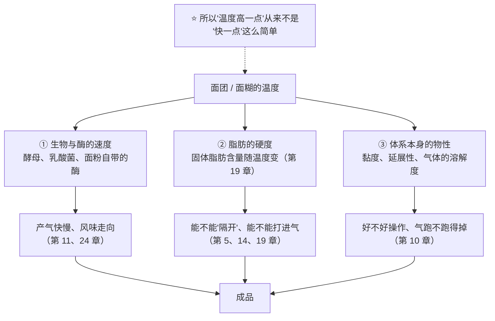
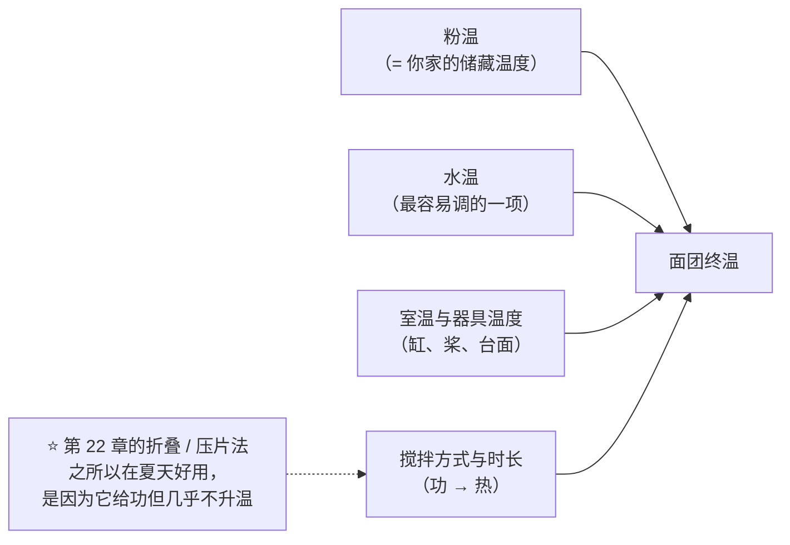

# 第 23 章 温度控制：面团终温、黄油温度与水温

> **本章目标**：让你相信一件不太直观的事——
>
> > ## **在进炉之前，温度就已经决定了大半个成品；而它恰好是最容易测、最容易记、也最少被记的那个量。**
>
> 三个具体问题：
>
> 1. **面团几 °C**，到底改变了什么；
> 2. **水温该怎么定**——那条流传极广的公式能不能用；
> 3. **"黄油室温软化"到底是什么意思**，为什么这句话本身就不成立。

## 23.1 一个温度，同时拨动三个旋钮

温度在烘焙里从来不只影响一件事[^1]：

三条都在前面章节出现过，这里只补一句：**它们的最优温度互不相同**。
酵母想要的温度、黄油想要的温度、面筋想要的温度，几乎不可能是同一个——
**所以温度控制永远是一次取舍，不是一次优化。**

## 23.2 面团终温：一个真实存在、可被设计的变量

"面团终温"（出缸时面团的中心温度）在职业烘焙里是常规记录项。本书要回答的是：
**有没有可引用的实验证据说明它真的重要？** 有，而且分布在四个完全不同的体系里：

| 研究 | 它改了什么 | 结果 |
|------|-----------|------|
| 一项关于**冷冻面团微结构**的研究 | 终混温度两档：**16 °C 与 31 °C** | 冻藏 14 周后，**31 °C 那组的产气力与整体成品品质都更差** |
| 一项关于**预发酵冷冻面团**抗冻融的研究 | 搅拌温度与醒发程度 | **5 °C 与 10 °C 的搅拌温度**降低面团黏弹性、抑制水分迁移，并**稳定了酵母产气**；优化组的成品**比容提高 22.07%、硬度下降 17.32%** |
| 一项关于**受虫害小麦**（蛋白酶活性异常高）制作面包的研究 | 面团温度三档：**15 ± 1 / 20 ± 1 / 25 ± 1 °C**，另有揉面时间与酵母量 | **15 °C 那档明显更好**：克服了塌底与高度不足；作者建议对这类面粉采用**更短的揉面与发酵时间、更低的面团与发酵温度** |
| 一项关于**化学膨松**小麦粉薄饼的研究 | 面团温度 **34 °C 与 38 °C** | **温度更高时需要更多的膨松酸与碱**，来补偿在**搅拌与静置期间就已经跑掉**的那部分 CO₂ |

⚠️ **这四项分别是冷冻面团、预发酵冷冻面团、受虫害面粉与化学膨松薄饼**——
**都是特定体系，本书不把它们的温度当作任何推荐值**。
可以引用的是它们**共同指向的方向**：

> **第一条可迁移判断**：
> ## **面团温度不是"结果"，是"设定值"。它同时在改：酵母走多快、酶咬多快、化学膨松跑掉多少、面筋好不好操作。**

特别注意第三项和第四项，它们各自补上了一个常被忽略的角色：

- **酶**：面粉自带的酶（第 2 章的落降数值、第 12 章的蛋白水解）也怕热怕冷。
  受虫害小麦那项研究里，降低面团温度**本质上是在给蛋白酶踩刹车**。
- **化学膨松**：第 13 章讲过快作用酸在搅拌阶段就放气。
  薄饼那项研究把它量化成了配方后果——**面团热一点，你就得多放膨松剂**，
  而多放的代价是残留的碱味与颜色（第 13 章）。

## 23.3 热是从哪里来的：搅拌本身就在加热

家庭烘焙最常见的一个意外是：**"我用的是冷水，面团却是温的。"**
原因在第 22 章：搅拌是在**给面团做功**，而功会变成热。

**"控制面团温度"在文献里是一个被专门研究过的工程问题**——
例如有专门讨论面团黏度的温度依赖及其**对面团温度控制的后果**的研究，
也有专门测量**搅拌过程中面团温度变化**的工作。
⚠️ 这两条本书**只核到题录（标题层面）**，因此**只用来说明"这件事被专门研究过"**，
**不引用任何数字**。

**你能动的入口只有四个**：

## 23.4 那条水温公式：本书为什么不把它当依据

烘焙圈流传最广的一条计算是：

> **期望水温 = 目标面团终温 × 3 − 室温 − 粉温 − 摩擦系数**

（有的版本乘以 4 并再减去一个预发酵种的温度。）

**本书的处理**：

> ## ⚠️ **这是行业常用的经验公式，本书没有核到它的一手出处**（已登记为缺口）。
> ## 正文因此不把它当作依据，只把它当作"一种很有用的记账方式"来讲。

**为什么必须把它的假设摊开**——因为它的每一项都有前提：

| 公式里的东西 | 它隐含的假设 | 什么时候会失效 |
|-------------|------------|--------------|
| **乘以 3** | 把"粉、水、环境"三者视为**等权**地决定终温 | 配方里粉水比偏离常规、或有**蛋、奶、黄油、汤种、中种**等其他质量较大的原料时，它们既没被计入，也不该被当成等权 |
| **减去室温** | 假设环境（空气、缸、桨、台面）与面团之间的换热可以折算成一个常数项 | 夏冬温差大、金属缸事先冰过或晒过时，这一项本身就不稳定 |
| **摩擦系数** | 假设它是**一个常数** | 它其实是「**这台机器 × 这个面团量 × 这个转速 × 这个时长**」的联合属性。换任何一项，它就变了 |
| **整条公式** | 忽略**水合放热**、容器蓄热、以及搅拌中的蒸发吸热 | 长时间搅拌、面团量很小（相对表面积大）时偏差更明显 |

**所以本书给的不是公式，而是一个测量流程**：

> ## **先跑一次基准，测出"你这套流程会把面团升高多少 °C"，以后就用这个差值反推水温。**

具体做法（这就是[烘焙记录与复盘表](../../forms/bake-log.md)里那几列的用处）：

| 步骤 | 记什么 |
|------|-------|
| ① 按你惯常的方式做一次 | **室温、粉温、水温**（各测一次）+ **出缸时面团中心温度** |
| ② 算一个属于你的差值 | **升温量 = 面团终温 −（室温、粉温、水温三者的平均）** |
| ③ 下次想要某个终温 | 用同一个差值反推：**水温 = 目标终温 × 3 −（室温 + 粉温）− 升温量** |
| ④ 每次都记，累积三五次 | 你会看到这个差值**在什么条件下稳定、在什么条件下漂** |

> **这和那条公式的算式其实是同一个，区别只有一个，但很关键**：
> ## **"摩擦系数"不是从书上抄来的，是你自己测出来的；而且你会亲眼看到它在变。**
>
> ⚠️ 上面第 ③ 步里的算式**只是把第 ② 步的定义反解一次**，不是一条有实验依据的物理定律。
> 它的价值在于**让你每次都把四个温度记下来**，而不在于精确。

**夏天与冬天的两个常规手段**（惯例，机制清楚）：

- 夏天：用**冷水甚至部分冰水**、把面粉与缸预先冷藏、缩短高速搅拌、改用**折叠法**（第 22 章）；
- 冬天：用**温水**（⚠️ 干酵母的复水温度按你那包产品的说明做——
  本书**未核到**可引用的通用温度数字，已登记为缺口）、延长发酵时间而不是升高温度。

## 23.5 "黄油室温软化"：这句话为什么不成立

第 5、19 章讲过：**脂肪在某个温度下有多硬，取决于它的[固体脂肪含量](../../glossary.md#sfc)**。
关键在于——**每种脂肪的固体脂肪含量—温度曲线都不一样**。两项实测：

| 研究 | 实测 |
|------|------|
| 一项关于棕榈油固体脂肪含量对模型面团影响的研究 | 熔点分别为 **38 / 32 / 24 °C** 的三种棕榈油，在 **25 °C** 时的固体脂肪含量分别是 **29.35% / 21.53% / 4.61%** |
| 一项比较不同熔点棕榈基起酥油的研究 | 熔点跨度 **33~60 °C**；高熔点档在 **10 °C 时固体脂肪含量高达 98%** |

> **第二条可迁移判断**：
> ## **"室温"不是一个操作指令——同一个 25 °C，一种脂肪几乎全固、另一种几乎全化。**
> ## 你要控制的从来不是"温度"，而是**手感所反映的那个固体脂肪含量**。

所以本书沿用第 5 章的判据（**不给温度数字**，已登记为缺口）：

| 用途 | 判据 |
|------|------|
| **乳化法要打的黄油** | 能留下**清晰指印**、**不粘手**、**不出油** |
| **裹入油（起酥用）** | 在上面的基础上再加一条：**能弯不能断** |
| **要"短"的配方**（酥皮、塔皮、司康） | 反过来要**冷、硬、成块**——目标是让它**别被揉进面里**（第 19 章） |

还有一条容易被忽略的：**脂肪在储存中还在继续结晶**。
一项关于层压油脂冷藏储存的研究发现，含可可脂的两种油脂**在 18 天后因后结晶变硬、烘焙表现下降**。

> **一句提醒**：**放了两周的那块黄油，不一定还是你上次用的那块。**
> ⚠️ "家用条件下脂肪反复软化—再冷却的影响"本书**未核到**对照实验（已登记为缺口），
> 所以本书**既不说它没关系，也不说它一定毁了**。

## 23.6 冷和热，各自抢走了谁的什么

把这一章的内容按本书的主线收一下：

| 你把温度调高 | 谁得利 | 谁受损 |
|-------------|-------|-------|
| 酵母产气更快（第 11 章） | 时间 | **失气时刻提前**（醒发温度研究：温度越高失气越早）；风味走向改变（第 24 章） |
| 化学膨松反应更快（第 13 章） | —— | **搅拌与静置阶段就跑掉更多气**（薄饼研究：温度高要多加膨松剂） |
| 面粉自带的酶更活跃（第 2 章） | 上色、风味 | **面团变软变塌**（受虫害小麦研究：降温是刹车） |
| 脂肪更软 | 好打、好抹 | **隔不开层了**（第 19 章）；乳化法可能打不进气 |
| 面团更软更好延展 | 整形省力 | **保气能力与操作窗口下降** |

| 你把温度调低 | 谁得利 | 谁受损 |
|-------------|-------|-------|
| 酵母慢下来 | **时间窗变宽、风味更从容**（第 24 章） | 要等 |
| 酶慢下来 | 面团更挺 | 上色与风味可能变弱 |
| 脂肪更硬 | **能隔开层、能保持"短"** | 难打、难抹；直接从冰箱拿出来打会打不动 |
| 面团更挺 | 好整形、好割口（第 25 章） | 醒发要更久；冷到一定程度还会带来**冻害**（第 16 章：冻融使面筋大聚体解聚，同时伤酵母） |

## 23.7 常见说法辨析

按本书约定标注**证据强度**：✅ 有共识 / ⚠️ 有争议 / ❌ 明确错误 / 缺乏证据。

| 说法 | 判定 | 说明 |
|------|------|------|
| "**水温 = 目标终温 × 3 − 室温 − 粉温 − 摩擦系数**" | ⚠️ **行业常用经验公式，出处未核到** | 本书**没有核到它的一手出处**（已登记为缺口）。它的"乘以 3"把粉、水、环境视为等权，忽略了蛋奶油与预发酵种；**"摩擦系数"不是常数**，而是机器 × 面团量 × 转速 × 时长的联合属性。**本书改为给一个自测流程**（23.4） |
| "**面团必须打到 26 °C**"（或任何一个具体目标值） | ⚠️ **本书不给这个数字** | 已核到的面团温度数据分别来自冷冻面团（16 / 31 °C）、预发酵冷冻面团（5 / 10 °C）、受虫害小麦（15 / 20 / 25 °C）与化学膨松薄饼（34 / 38 °C）——**四个完全不同的体系与目标**。能引用的是"终温是一个应当被设定与记录的变量"，不是某个数值 |
| "**面团温度高一点只是发得快一点**" | ❌ **它同时改了好几件事** | 它还改：**失气时刻**（温度越高越早）、**化学膨松在搅拌阶段跑掉的量**（薄饼研究）、**酶的速度**（受虫害小麦研究）、脂肪硬度、面团黏度与保气能力 |
| "**用冷水就不会热**" | ❌ **搅拌自己会产热** | 功会变成热。这正是"控制面团温度"被当成工程问题来研究的原因（本书只核到题录）。想降温而又要强度，可以用**折叠 / 压片**把功分批给（第 22 章） |
| "**黄油室温软化**" | ⚠️ **"室温"不是操作指令** | 实测：熔点 38 / 32 / 24 °C 的三种棕榈油在 **25 °C** 时固体脂肪含量分别为 **29.35% / 21.53% / 4.61%**；棕榈基起酥油高熔点档在 10 °C 时可达 **98%**。**同一个室温下不同脂肪的软硬差得很远**。用手感判据（能留下清晰指印、不粘手、不出油） |
| "**黄油化了再冻回去就一样了**" | ⚠️ **缺乏证据，但也别当没事** | 本书**未核到**"反复软化—再冷却"的对照实验（已登记为缺口）。已核到的方向是：可塑性依赖**结晶网络与微观结构**，而**机械加工（塑化）对质地不利**；另有研究显示层压油脂**在储存中继续后结晶而变硬**（18 天） |
| "**做酥皮要用冷黄油，是为了好操作**" | ⚠️ **不止是好操作** | 第 19 章：固态脂肪的作用是**隔开层**，液态油只会被吸进面里。冷不是为了省事，**冷是这一类成品的机制本身** |
| "**冬天把面团放暖气边上发快一点**" | ⚠️ **方向对，代价没算** | 温度确实加速产气，但也**提前了失气时刻**、改变了风味谱（第 24 章），而且靠近热源容易**局部过热与表面结皮**（第 25 章）。更稳的做法是**延长时间**而不是升高温度 |
| "**烤箱温度才重要，面团温度无所谓**" | ❌ **两头都重要，而且面团温度更好控** | 你的烤箱几乎一定不准（第 29 章），而**面团温度只需要一支探针温度计就能测准**。这是整本书里**性价比最高的一个记录项** |

## 23.8 🔎 下次烤之前的用处

1. **买一支探针温度计，并且每次都用它**。它同时服务两章：**出缸终温**（这一章）与
   **出炉中心温度**（第 21、32 章）。
2. **每次记四个温度**：室温、粉温、水温、出缸终温。三五次之后，
   你就有了属于你这套设备的"升温量"，从此不需要抄任何公式。
3. **夏天先降温再想别的**：冷水 / 部分冰水、预冷面粉与缸、缩短高速段、改折叠法。
4. **别用"室温软化"当指令**，用手感判据：能留下清晰指印、不粘手、不出油；
   裹入油再加"能弯不能断"。
5. **配方里有化学膨松剂时，别让面团在室温久放**——放气是从搅拌那一刻就开始的（第 13 章）。
6. **改温度的时候，同时记发酵时间**——因为你一改温度，"发多久"这个数就作废了（第 24 章）。

## 23.9 思考题

1. 温度同时拨动哪三个旋钮？为什么说"温度控制是取舍，不是优化"？
2. 为什么"用的是冷水，面团却是温的"？这件事和第 22 章的哪个概念直接相关？
3. 那条水温公式有哪四条隐含假设？本书为什么不把它当依据，又为什么仍然愿意讲它？
4. **【案例】** 某人夏天做吐司，配方、时间、炉温都照抄自己冬天成功的那次，
   结果面团在一次发酵中途就已经很松软，成品**组织粗、有酸味、侧面塌**。
   （a）写出完整推理链；（b）他有哪四个降温入口？各自的代价是什么；
   （c）他应该记录哪几个量，才能在下次证明"是温度的问题"？
5. **【案例】** 某人做司康，按配方"黄油室温软化后加入面粉中搓成粗砂状"，
   成品几乎没有层次、口感发硬发韧。
   （a）这份配方真正想要的是什么（第 19 章）？（b）"室温软化"这一步破坏了什么？
   （c）给出改法，并说明用什么判据代替"室温软化"。
6. **【辨析】** "面团必须打到 26 °C"——判断证据强度，
   说明本书已核到的面团温度数据分别来自什么体系，以及为什么不能把它们拼成一个推荐值。
7. **【辨析】** "黄油化了再冻回去就和原来一样"——判断证据强度，
   说出已核到的两条相关方向，并说明本书为什么**既不肯定也不否定**。

> 📖 **参考答案**（想清楚再看）：[Q1](../../qa/23-temperature-control-qa.md#q1) ·
> [Q2](../../qa/23-temperature-control-qa.md#q2) · [Q3](../../qa/23-temperature-control-qa.md#q3) ·
> [Q4](../../qa/23-temperature-control-qa.md#q4) · [Q5](../../qa/23-temperature-control-qa.md#q5) ·
> [Q6](../../qa/23-temperature-control-qa.md#q6) · [Q7](../../qa/23-temperature-control-qa.md#q7)

## 23.10 本章实操

### 🅐 零成本版 · 任务一：给你的厨房做一张温度地图

不用烤箱，只要一支温度计。**同一天之内**测完下面这些，填表：

| 位置 / 物件 | 实测 | 备注 |
|------------|------|------|
| 室温（操作台面附近） | °C | |
| 面粉（袋中插进去测） | °C | 与室温差多少？ |
| 直接接的自来水 | °C | 夏天与冬天差多少？ |
| 冰箱冷藏室 | °C | 与你以为的差多少？ |
| 搅拌缸（金属，静置状态） | °C | |
| 黄油刚从冷藏拿出时 | °C | 顺便按一下：能留下清晰指印吗？ |
| 黄油在台面放置一段时间后 | °C | 记下"放了多久"和"手感变成什么样" |

> **这张表的用处**：从此"室温"对你来说是一个**数**，不是一个词。
> 同一份配方在冬夏之间的差别，多半就藏在这张表里。

### 🅐 零成本版 · 任务二：反推一份配方的温度设计

找一份写了"温水""冰水""冷藏松弛""室温软化"的配方，逐条翻译：

| 配方原文 | 它想控制哪个旋钮（生物 / 脂肪 / 物性） | 如果你照做但室温差很多，会怎样 | 你打算用什么判据代替这句话 |
|---------|--------------------------------|---------------------------|------------------------|
| | | | |
| | | | |

### 🅑 开火版 · 任务三：测出你自己的"升温量"（有烤箱时做）

**不改配方**，只增加记录。同一份面包配方连做三次：

| 次 | 室温 | 粉温 | 水温 | 出缸终温 | 升温量 = 终温 − 三者平均 | 搅拌方式与时长 |
|----|------|------|------|---------|----------------------|--------------|
| ① | °C | °C | °C | °C | °C | |
| ② | °C | °C | °C | °C | °C | |
| ③ | °C | °C | °C | °C | °C | |

做完回答：

| 问题 | 你的答案 |
|------|---------|
| 三次的"升温量"稳定吗？波动多大？ | |
| 哪一次的面团最好操作？它的终温是多少？ | |
| 如果下次想让终温低 2 °C，按这个升温量，水温该调到多少？ | |

> ⚠️ **这不是一条物理定律**，只是把你的记录反解一次（见 23.4）。
> 它的价值在于**逼你每次都测**——一旦你开始测，很多"玄学"会自己消失。

### 🅑 开火版 · 任务四（加分）：只改水温的单变量对照

**唯一变量**：水温（两组差约 10 °C，其余完全相同）。
**关键设计**：两组都**发到同一个入炉前高度**，而不是发同样的时间。

| 组 | 水温 | 出缸终温 | 发到目标高度用了多久 | 炉内涨幅 | 组织与风味差别 |
|----|------|---------|-------------------|---------|--------------|
| ① | °C | °C | 分钟 | mm | |
| ② | °C | °C | 分钟 | mm | |

> **怎么读结果**：如果两组"发到等高"所用的时间明显不同，而成品仍有差别——
> 那么差别就**不是**"发得够不够"造成的，而是温度本身改变了别的东西
> （第 24 章：同样发到等高，风味不是同一个）。
>
> ⚠️ **局限**：水温同时改了面团温度、发酵速度与面团黏度，**它给方向，不给定量**。
> ⚠️ **安全提醒**：不要尝生面糊与生面团（美国 FDA：生面粉不是即食食品；
> 含蛋配方另有生蛋风险，含蛋菜品建议做到 160 °F，约 71 °C，并用食品温度计确认）。
> ⚠️ 各国口径不同，以当地现行发布为准。

## 23.11 本章依据

本章引用的来源与核对状态详见[参考书目与出处登记](../../standards.md)，具体对应如下：

| 本章用到的内容 | 依据 |
|--------------|------|
| 终混温度 **16 °C 与 31 °C**：冻藏 14 周后 **31 °C 组的产气力与成品品质更差** | *Journal of Cereal Science* 2002 关于终混温度对冷冻面团微结构影响的研究，✅ 摘要层面。⚠️ **冷冻面团体系** |
| **5 °C 与 10 °C 的搅拌温度**降低黏弹性、抑制水分迁移、稳定酵母产气；优化组**比容 +22.07%、硬度 −17.32%** | *Food Chemistry* 2026 关于预发酵冷冻面团抗冻融的研究，✅ 摘要层面。⚠️ **冷冻面团体系**，本书只引用方向 |
| 面团温度 **15 / 20 / 25 °C**：**15 °C 更好**；作者建议对该类面粉用更短揉面与发酵、更低面团与发酵温度 | *Journal of Cereal Science* 2022 关于改善高虫害小麦面包品质的研究，✅ 摘要层面。⚠️ **蛋白酶活性异常的特殊面粉**，本书用它说明"温度也在控制酶" |
| 面团温度 **38 °C** 比 **34 °C** 时，**需要更多膨松酸与碱**来补偿搅拌与静置期间损失的 CO₂ | *Cereal Chemistry* 2000 关于膨松酸与面团温度对小麦粉薄饼影响的研究，✅ 摘要层面（第 8、13 章已登记） |
| **"控制面团温度"是一个被专门研究过的工程问题** | *Journal of Food Engineering* 1985 关于温度对面团黏度的影响及其对面团温度控制的后果，以及 *Cereal Chemistry* 1992 关于搅拌中面团温度变化的研究，⚠️ **仅核到题录（标题层面）**，本书**不引用任何数字**，只用来说明这件事被研究过 |
| **期望水温 = 目标终温 × 3 − 室温 − 粉温 − 摩擦系数** | ⚠️ **行业常用经验公式，本书未核到一手出处**（已登记为缺口）。正文把它的四条假设摊开，并改为给**自测流程** |
| 熔点 **38 / 32 / 24 °C** 的三种棕榈油在 **25 °C** 时固体脂肪含量 **29.35% / 21.53% / 4.61%** | *Carbohydrate Polymers* 2025 关于棕榈油固体脂肪含量对模型面团影响的研究，✅ 摘要层面（第 19 章已登记） |
| 棕榈基起酥油熔点 **33~60 °C**；高熔点档 **10 °C 时固体脂肪含量高达 98%** | *Food Chemistry: X* 2025 关于不同熔点棕榈基起酥油的研究（开放获取），✅ 摘要层面（第 19 章已登记） |
| 层压油脂冷藏储存：含可可脂的两种**在 18 天后因后结晶变硬、烘焙表现下降** | *Foods* 2024 关于层压油脂冷藏储存稳定性的研究（开放获取），✅ 摘要层面（第 19 章已登记） |
| 醒发温度越高**失气时刻越早**（并伴随 CO₂ 溶解度下降） | *Journal of Cereal Science* 2007 关于油脂、搅拌压力与醒发温度对面团膨胀能力影响的研究，✅ 摘要层面（第 11 章已登记）。⚠️ 温度范围是实验设计 |
| 冻融使**麦谷蛋白大聚体解聚、二硫键断裂**，并**减少酵母失活与谷胱甘肽释放**是改善方向 | *Food Chemistry* 2024 与两项冻融 GMP 研究，✅ 摘要层面（第 16 章已登记） |
| 生面粉与生面团的安全；含蛋菜品的安全温度 | 美国 FDA「Handling Flour Safely」与「What You Need to Know About Egg Safety」，✅ 已核到官方页面。⚠️ 各国口径不同 |
| **家用黄油的固体脂肪含量—温度曲线**（"黄油要在多少 °C 操作"） | ⚠️ **未核到**（已登记为缺口）。正文**不给温度数字**，改用手感判据 |
| **干酵母复水的温度** | ⚠️ **未核到**（已登记为缺口）。正文改为"按你那包产品的说明做，并记录下来" |
| **家用条件下脂肪反复软化—再冷却的影响** | ⚠️ **未核到**对照实验（已登记为缺口）。正文既不肯定也不否定 |
| **面团终温的通用目标值** | ⚠️ **未核到**。已核到的四组温度分属四个不同体系与目标，**不能拼成推荐值** |

[^1]: 本章新出现的术语：[面团终温](../../glossary.md#dough-final-temperature)（final dough temperature）、
[摩擦系数](../../glossary.md#friction-factor)（friction factor）。
第 19 章的[固体脂肪含量](../../glossary.md#sfc)与[可塑性](../../glossary.md#plasticity)、
以及第 10 章的[保气](../../glossary.md#co2-retention)在本章继续使用。

---

**下一章**：第 24 章 发酵与冷藏。
这一章把温度当成一个**瞬时设定值**；下一章要问的是：
**把这个温度维持一段时间之后，除了"发起来"，还发生了什么。**
