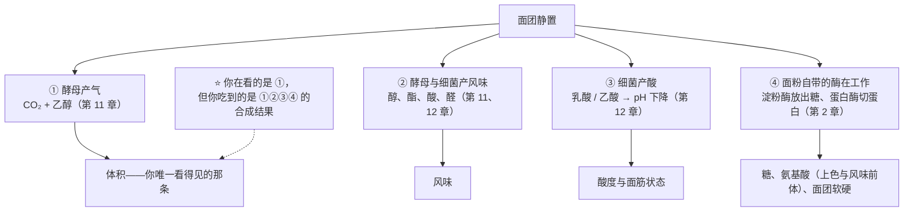
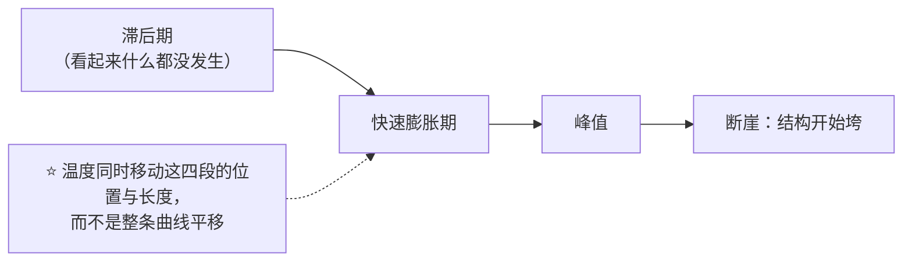

# 第 24 章 发酵与冷藏：时间、温度与风味的三角

> **本章目标**：拆掉"发好了"这三个字。
>
> 同一份面团"发好了"，可以是**两小时在温暖处**，也可以是**一夜在冰箱里**——
> 它们的体积可以完全一样，**但里面的东西不一样**。
>
> > ## **发酵不是一个计时器，是四条并行运行的时钟。**

第 11、12 章讲的是**谁在产气**，第 10 章讲的是**气能不能留住**。
这一章问的是另一个问题：**在等待的这段时间里，除了产气，还发生了什么？**

## 24.1 四条并行的时钟

一份面团静置时，至少有四件事在同时进行，而且**它们对温度的反应不一样**[^1]：

> **第一条可迁移判断**：
> ## **体积是四条时钟里唯一能被肉眼读出来的那条——所以"发到两倍大"从一开始就只看到了四分之一。**

## 24.2 同样"发到等高"，也不是同一个面团

这不是推理，有一项设计得很干净的实验：

> 一项关于酵母浓度与发酵温度对面包心香气影响的研究，把酵母用量设为
> **2% / 4% / 6%（以面粉总量为 100%）**，发酵温度设为 **5 / 15 / 35 °C**，
> **关键设计是：所有面团都发酵到相同高度之后再烘烤。**

结果：

| 变量 | 结果 |
|------|------|
| **酵母用量↑** | 酵母代谢相关化合物普遍增加（其中 2,3-丁二酮、苯乙醛的气味活性最高） |
| **较高温度（15 与 35 °C）** | 促进**脂质氧化类**化合物（己醛、庚醛） |
| **低温（5 °C）** | 促进**三种酯**（乙酸乙酯、己酸乙酯、辛酸乙酯） |

> ## **把体积发到一样，香气仍然是三个不同的东西。**

**另外两项独立研究给出同方向的补充**（都不是面包工艺研究，本书只引用方向）：

- 一项用面粉基质培养酵母以生产面包香气物质的研究发现：**发酵温度与某些挥发物相关**
  （该研究中 20 °C 有利于苯甲醛与壬醛的积累），而**延长发酵时间提高了醇与酯的积累**；
- 一项专门开发**15 °C 低温发酵**用混合菌种的研究开篇即指出：
  烘焙业对低温发酵的兴趣正是因为它**改善天然香气物质的产生**；
  该研究中加入乳酸菌进一步增加了挥发性有机物的合成。

⚠️ 这两项一个是"造香气原料"的工艺研究、一个是菌种开发研究，
**本书不引用它们的温度与时间作为建议参数**。

## 24.3 时间与温度不能简单互换

直觉上"低温久一点 = 高温短一点"。**但这三条实测说明它们并不等价**：

### ① 发酵有一个"什么都不发生"的滞后期

一项用欧姆加热辅助醒发的研究（目标温度 35 °C）测到：

| 条件 | 到达膨胀比 3 所需时间 | 其中滞后期 |
|------|-------------------|-----------|
| 常规加热（缓慢升温） | **122 分钟** | **58 分钟** |
| 欧姆加热（更快升温，1~10 °C/min） | **65~70 分钟** | 最快档 **20 分钟** |

研究还指出：**在相同升温速率下，加热方式本身对醒发没有影响**——
也就是说，缩短的那一段**主要就是滞后期**。膨胀过程可以用 Gompertz 曲线极好地拟合（R² > 0.999）。

> **含义**：**面团从冰箱里拿出来后的"前半小时"经常什么都没发生**——
> 你以为的"发得慢"，可能只是面团还在升温。

### ② 温度越高，"失气时刻"来得越早

第 11 章引用过的醒发实验（30 / 35 / 40 / 45 / 50 °C）：
**温度越高，失气时刻越早**，解释是酵母活性上升与 **CO₂ 溶解度下降**。

> **含义**：高温不只是"快进"，它还**把可用的时间窗口一起缩短了**。

### ③ 越过峰值是断崖，不是缓坡

第 10 章引用过的醒发程度研究（1.1 / 1.3 / 1.5 / 1.7 mL/g）：
比容**先升后降，峰值在 1.3**，到 1.5 与 1.7 时**急剧下降**，并伴随变硬与**皮芯分离**。

⚠️ 这是**特定产品（冷冻面团馒头）的实验设计**，
**本书不把这几个数字当作任何成品的醒发终点**（已登记为缺口）。
能引用的方向是：**峰值存在，而且越过它是断崖。**

## 24.4 冷藏不是暂停键

家庭里最常见的用法是"**放冰箱过夜**"。它到底停住了什么？

一项 1995 年的微生物学工作给出了一个很直接的答案。研究者为了做**冷藏面团**，
专门去筛选"**冷敏感发酵**"的酵母突变株，理由写在摘要第一句：

> **常规面包酵母在 5 °C 储存数天的面团里，仍会把糖相当程度地转化成 CO₂ 与乙醇。**

他们筛到的突变株在 **5 °C 下发酵活性基本为零**、10 °C 下只有亲本的五分之一，
但在 **25~40 °C 恢复正常**；用它做的面团**冷藏一周后仍能正常使用**。

> **第二条可迁移判断**：
> ## **冷藏不是暂停键，是"调速器"——而且它对四条时钟的减速幅度并不相同。**

这正是"冷藏发酵更香"这类说法背后**唯一站得住的机制方向**：
低温改变的是**各条时钟的相对速度**，于是最终的成分构成不同（24.2 的等高实验已经证明这一点）。

⚠️ **但本书不给"冷藏几小时"**：文献里的冷藏参数都绑着特定配方、酵母量与产品。
能做的是给方法（24.7）。

## 24.5 冷冻是第三件事，不是"更冷的冷藏"

| | 冷藏 | 冷冻 |
|---|------|------|
| 主要机制 | **减速**（四条时钟各自减速，幅度不同） | **相变**：冰晶形成 |
| 对面筋 | 基本是时间与酸的作用 | **冻融使麦谷蛋白大聚体解聚、二硫键断裂**（第 16 章） |
| 对酵母 | 活性下降但**没有停** | **细胞受损，并释放谷胱甘肽**（一种还原剂，会进一步弱化面筋） |
| 与面团终温的关系 | —— | 实测：终混温度 **31 °C** 的面团在冻藏 14 周后，**产气力与成品品质都比 16 °C 的差**（第 23 章） |

> ⚠️ **家庭条件下冷冻面团能放多久，本书不给数字**（已登记为缺口）。
> 已核到的方向只有一条：**减少温度波动**——冻融次数越多，损伤越大。

## 24.6 发酵同时在改另外三本账

除了气与风味，等待还改了这些——它们都会在**进炉之后**才显形：

| 账 | 发生了什么 | 后果 |
|----|-----------|------|
| **面筋这本账** | 一项起酥点心研究发现：**酵母代谢物弱化面筋网络**，面团强度与延展性下降；而且**发酵时间对面团流变的影响比"有没有酵母"更大** | 发得越久，面团越软、越难整形（第 25 章） |
| **糖这本账** | 酵母在吃糖。同一项研究测到：蔗糖**在搅拌后就几乎被转化酶完全降解**，释放出的葡萄糖**至少有 23.6 ± 2.6% 在发酵期间被消耗** | 留给褐变的还原糖变少 → **发太久的面团上色会变浅**（第 4、21 章） |
| **蛋白质这本账** | 面粉自身的蛋白酶几乎线性地释放氨基酸，**在酸化与还原条件下活性最高**；而且**发酵时的 pH 决定了释放出哪些氨基酸** | 氨基酸是褐变与风味的前体（第 21 章）；酸性环境（酵种）改变的不只是酸味 |

**还有一条与安全/化学有关的方向**（本书只陈述，不做健康建议）：
两项独立研究都观察到**延长发酵会降低成品中的丙烯酰胺**——
一项在面包工艺研究中直接观察到这一点，另一项则测到发酵能使前体**天冬酰胺降低 68%~89%**，
且降幅**显著受发酵时间与酵母种类影响**。

> **第三条可迁移判断**：
> ## **"发过头"的成品往往同时具备三个特征：组织粗、颜色浅、形状塌——
> ## 因为气、糖、面筋这三本账是一起被消耗的。**

## 24.7 你能建立的三条记录

本书不给"发多久"，但下面三件事你今天就能做，而且比任何参数都有用：

| 记录 | 怎么做 | 它回答什么 |
|------|-------|-----------|
| **高度—时间曲线** | 取一小块面团放进直筒透明容器（体积基本代表整缸），**每隔固定时间在杯壁上画一条线并记时间** | **你这份配方在你这个温度下的峰值在第几分钟**——这是你自己的"两倍大" |
| **温度—时长对照表** | 每次记下：面团终温（第 23 章）+ 环境温度 + 发到目标高度的时长 | 下次换季时，你能**预测**要提前或延后多久 |
| **气味日志** | 每次在入炉前闻一下，用你自己的词记（面香 / 酒味 / 酸 / 刺鼻） | 等高实验说明**同样的体积对应不同的成分**——气味是你能用的那个免费传感器 |

> ⚠️ **关于"戳一下看回弹"与"浮起来"这类判据**：本书按**工艺口语**处理——
> 它们反映的是**此刻的含气量与面筋松弛程度**，不等于"发酵进行到哪一步"
> （第 12 章对酵种的"浮起来"也做了同样的处理，已登记为缺口）。

## 24.8 常见说法辨析

按本书约定标注**证据强度**：✅ 有共识 / ⚠️ 有争议 / ❌ 明确错误 / 缺乏证据。

| 说法 | 判定 | 说明 |
|------|------|------|
| "**发到两倍大就是发好了**" | ⚠️ **它只看了四条时钟里的一条** | 体积只反映产气与保气；风味、酸度、面筋状态、糖的消耗都看不见。而且"两倍"这个通用终点**本书未核到**依据（已登记为缺口）——文献里的终点都是特定产品的实验设计。**改用你自己的高度—时间曲线找峰值** |
| "**冷藏就是把发酵暂停了**" | ❌ **没有暂停** | 一项为开发冷藏面团而做的研究明确写道：**常规面包酵母在 5 °C 储存数天的面团里仍会相当程度地把糖转化为 CO₂ 与乙醇**；研究者因此专门去筛选"冷敏感发酵"的突变株 |
| "**冷藏发酵一定更香**" | ⚠️ **方向有支持，但"一定"过头了** | 等高实验显示**低温（5 °C）促进三种酯、较高温度促进脂质氧化类化合物**——**是"不同"，不是简单的"更好"**。另两项研究（面粉基质产香、15 °C 低温发酵菌种）也只支持"温度改变香气构成"。而且冷藏同时改了酸度与面筋状态 |
| "**低温久发 = 高温短发**" | ❌ **不等价** | 三条实测：① 醒发存在**滞后期**（常规加热下到膨胀比 3 需 122 分钟，其中 58 分钟是滞后期）；② **温度越高失气时刻越早**（窗口更短）；③ 越过峰值是**断崖**。温度改的是曲线的形状，不只是横轴刻度 |
| "**发过头了，再揉一次重新发就行**" | ⚠️ **能救形状，救不回账面** | 重新整形确实能重建部分结构，但**糖已经被吃掉一部分**（上色会变浅）、**面筋已被代谢物弱化**（发酵时间对流变的影响比"有没有酵母"更大）。本书**未核到**"补救效果"的对照实验，只能说明代价在哪 |
| "**夏天发太快，那就放冰箱里发**" | ✅ **方向成立**，但要重记时间 | 这正是冷藏最有价值的用法：**用降速换时间窗**。但要注意 ① 面团从冰箱取出后有一段**升温期**（滞后期）；② 冷藏同时加强了产酸这条线 |
| "**发酵温度越高，面包越蓬松**" | ❌ **有上限，而且窗口更窄** | 醒发实验：**温度越高失气时刻越早**；第 10 章还有一条更硬的结论——**初始 CO₂ 体积过高反而损害炉内膨胀** |
| "**面团发久一点，颜色会更漂亮**" | ❌ **常常相反** | 酵母在消耗还原糖（实测：释放出的葡萄糖至少有 **23.6 ± 2.6%** 在发酵期间被消耗），留给褐变的糖变少（第 4、21 章）。发得过久的面团**更容易颜色发白** |
| "**冷冻面团和冷藏面团差不多**" | ❌ **机制不同** | 冷冻涉及**冰晶**：冻融使麦谷蛋白大聚体解聚、二硫键断裂，并使酵母失活、释放谷胱甘肽（第 16 章）。⚠️ 家庭可冻藏期限本书**未核到**，只给"减少温度波动"的方向 |

## 24.9 🔎 下次烤之前的用处

1. **给你这份配方画一次高度—时间曲线**。一次就够，它会替你回答所有"该发多久"的问题。
2. **每次都把"面团终温 + 环境温度 + 发酵时长"三个数记在一起**——
   缺任何一个，另外两个都没意义。
3. **从冰箱拿出来之后，先给它升温的时间**，别急着判断"它怎么不发"。
4. **发过头的三个信号一起看**：组织粗、颜色浅、形状塌。只看体积会误判。
5. **想要风味就给时间，别靠升温**——升温买到的是速度，同时卖掉了窗口。
6. **换季时先改时间，再改温度**：时间容易记录，温度容易失控。

## 24.10 思考题

1. 面团静置时有哪四条并行的时钟？为什么"发到两倍大"只看到了其中一条？
2. 那项"全部发到相同高度"的香气实验，关键设计是什么？它证明了什么？
3. 为什么说"低温久发 ≠ 高温短发"？请给出三条实测依据。
4. **【案例】** 某人把周末的吐司面团放冰箱冷藏过夜，第二天拿出来直接整形、醒发、烘烤。
   成品**体积偏小、颜色偏白、略带酸味**。
   （a）写出完整推理链，逐条解释这三个现象；（b）他的流程里最可能出问题的是哪一步；
   （c）给出两个改动方向，并说明各自要记录什么来验证。
5. **【案例】** 某人为了赶时间，把发酵箱温度调到很高，面团**很快涨到两倍**，
   但入炉后**几乎没有炉内膨胀**，成品组织粗、有明显大孔。
   （a）用"失气时刻"和"峰值断崖"解释；（b）第 10 章哪一条结论直接适用于这个案例；
   （c）他该怎么用记录把"发过头"和"烤的问题"区分开？
6. **【辨析】** "冷藏就是把发酵暂停了"——判断证据强度，
   复述那项研究为什么要专门去筛选"冷敏感发酵"的酵母。
7. **【辨析】** "面团发久一点颜色更漂亮"——判断证据强度，并解释背后的那本"糖的账"。

> 📖 **参考答案**（想清楚再看）：[Q1](../../qa/24-fermentation-time-temperature-qa.md#q1) ·
> [Q2](../../qa/24-fermentation-time-temperature-qa.md#q2) · [Q3](../../qa/24-fermentation-time-temperature-qa.md#q3) ·
> [Q4](../../qa/24-fermentation-time-temperature-qa.md#q4) · [Q5](../../qa/24-fermentation-time-temperature-qa.md#q5) ·
> [Q6](../../qa/24-fermentation-time-temperature-qa.md#q6) · [Q7](../../qa/24-fermentation-time-temperature-qa.md#q7)

## 24.11 本章实操

### 🅐 零成本版 · 任务一：读三份配方的"时间—温度"设计

不用烤箱。找三份用了不同发酵策略的配方（例如：快发直接法 / 冷藏隔夜 / 用酵种），
把它们的时间与温度安排翻译成本章的语言：

| | 配方 A | 配方 B | 配方 C |
|---|-------|-------|-------|
| 酵母（或酵种）用量（**以面粉总量为 100%**） | | | |
| 发酵温度与时长 | | | |
| 它优先照顾的是哪条时钟（气 / 风味 / 酸 / 酶） | | | |
| 它牺牲了什么 | | | |
| 如果你把温度升高 10 °C，你预测哪三件事会变 | | | |

### 🅐 零成本版 · 任务二：给一份配方写"换季改法"

挑上面的配方 A，写出它在**夏天**与**冬天**各该怎么改（只改一项）：

| 季节 | 你打算改哪一项（温度 / 时间 / 酵母量 / 冷藏） | 为什么不改另外几项 | 你预测发到同一高度的时长会变成多少 |
|------|----------------------------------|------------------|------------------------------|
| 夏天 | | | |
| 冬天 | | | |

### 🅑 开火版 · 任务三：画出你这份配方的高度—时间曲线（有烤箱时做）

**不改配方**。取一小块面团（约拳头大）放进**直筒透明容器**，压平，在杯壁上标出起始线。

| 时间点 | 高度（画线 / mm） | 环境温度 | 面团表面状态 | 气味 |
|-------|----------------|---------|------------|------|
| 0 分钟 | | °C | | |
| 每隔固定时间记一次 … | | | | |
| 你判断的峰值 | | | | |
| 峰值之后再记两次 | | | | |

做完回答：

| 问题 | 你的答案 |
|------|---------|
| 峰值出现在第几分钟？和配方写的时间差多少？ | |
| 前面有没有一段"几乎不动"的滞后期？多长？ | |
| 越过峰值之后，高度是缓慢下降还是明显塌陷？ | |

> **这条曲线就是你的"两倍大"**——而且它是**你这个厨房、这个季节**的版本。

### 🅑 开火版 · 任务四（加分）：常温 vs 冷藏，发到等高

**唯一变量**：发酵温度路径。**关键设计**：两组都发到**同一个入炉前高度**（不是同样的时间）。

| 组 | 路径 | 发到目标高度用时 | 入炉前高度 | 炉内涨幅 | 表皮颜色 | 风味（用你自己的词） |
|----|------|---------------|-----------|---------|---------|------------------|
| ① | 常温一次发酵 | | mm | mm | | |
| ② | 冷藏过夜（取出后先回温，回温时间也记下来） | | mm | mm | | |

> **怎么读结果**：如果两组**入炉前高度相同**，而**颜色与风味明显不同**——
> 你就亲手重现了 24.2 那项实验的核心结论：
> ## **体积一样，不代表面团一样。**
>
> ⚠️ **局限**：冷藏同时改了温度、时间与酸度三件事，**它给方向，不给定量**。
> ⚠️ **安全提醒**：不要尝生面糊与生面团（美国 FDA：生面粉不是即食食品；
> 含蛋配方另有生蛋风险，含蛋菜品建议做到 160 °F，约 71 °C，并用食品温度计确认）。
> 冷藏保存请遵循当地食品安全指引（美国 FDA 建议冰箱保持在 40 °F、约 4 °C 以下）。
> ⚠️ 各国口径不同，以当地现行发布为准。

## 24.12 本章依据

本章引用的来源与核对状态详见[参考书目与出处登记](../../standards.md)，具体对应如下：

| 本章用到的内容 | 依据 |
|--------------|------|
| 酵母 **2 / 4 / 6%（面粉基准）× 5 / 15 / 35 °C**，**全部发到相同高度**：酵母量↑使代谢相关化合物普遍增加；**15 与 35 °C 促进脂质氧化类化合物**；**5 °C 促进三种酯** | *LWT – Food Science and Technology* 2013 关于酵母浓度与发酵温度对面包心香气影响的研究，✅ 摘要层面（第 11 章已登记）。**本章 24.2 的核心依据** |
| 面粉基质培养中**发酵温度与挥发物相关**（该研究中 20 °C 有利苯甲醛与壬醛）；**延长发酵时间提高醇与酯的积累** | *Food Chemistry* 2022 关于以面粉基质发酵生产面包香气的研究，✅ 摘要层面。⚠️ **不是面包工艺研究**，本书只引用方向 |
| 烘焙业对**低温发酵**的兴趣在于它改善天然香气物质的产生；该研究开发了 **15 °C** 下可用的酵母—乳酸菌混合菌种，乳酸菌进一步增加挥发物合成 | *Molecules* 2024 关于低温发酵小麦面团混合菌种的研究（开放获取），✅ 摘要层面。⚠️ 菌种开发研究，本书不引用其参数作建议 |
| **常规面包酵母在 5 °C 储存数天的面团里仍相当程度地把糖转化为 CO₂ 与乙醇**；冷敏感突变株在 5 °C 活性基本为零、10 °C 为亲本的 1/5，**25~40 °C 恢复**，用它的面团冷藏一周仍正常 | *Applied and Environmental Microbiology* 1995 关于冷敏感发酵酵母突变株及其在冷藏面团中应用的研究（开放获取），✅ 摘要层面。**本章 24.4 的核心依据** |
| 常规加热醒发到膨胀比 3 需 **122 分钟（其中滞后期 58 分钟）**；提高升温速率降至 **65~70 分钟（滞后期最短 20 分钟）**；**相同升温速率下加热方式本身无影响**；膨胀可用 Gompertz 模型拟合（R² > 0.999） | *Innovative Food Science and Emerging Technologies* 2017 关于欧姆加热辅助醒发的研究，✅ 摘要层面。⚠️ 特定设备与产品，本书只引用"存在滞后期、升温速率主要缩短滞后期"这一方向 |
| 醒发温度 **30~50 °C**：**温度越高失气时刻越早**（酵母活性上升 + CO₂ 溶解度下降） | *Journal of Cereal Science* 2007，✅ 摘要层面（第 11 章已登记）。⚠️ 温度范围是实验设计 |
| 醒发程度 **1.1 / 1.3 / 1.5 / 1.7 mL/g**：比容**先升后降，峰值 1.3**，1.5 与 1.7 **急剧下降**并伴随变硬与皮芯分离 | *Foods* 2024 关于醒发程度与 CMC-Na 对冷冻面团馒头影响的研究（开放获取），✅（第 10 章已登记）。⚠️ **特定产品的实验设计，不是通用醒发终点** |
| **初始 CO₂ 体积过高会损害炉内膨胀** | *Innovative Food Science and Emerging Technologies* 2016 用化学膨松系统研究面团失稳的工作，✅ 摘要层面（第 10 章已登记） |
| **酵母代谢物弱化面筋网络**；**发酵时间对面团流变的影响大于"有无酵母"**；蔗糖搅拌后已几乎被完全降解，释放出的葡萄糖**至少 23.6 ± 2.6% 在发酵期间被消耗**（配方 **8% 酵母、14% 蔗糖，以小麦粉干物质为基准**） | *Foods* 2022 关于糖含量决定酵母起酥点心发酵动力学的研究（开放获取），✅（第 11 章已登记）。**本章 24.6 的主要数据源** |
| 面粉自身蛋白酶几乎线性释放氨基酸，**在酸化与还原条件下活性最高**；**发酵时的 pH 决定释放出哪些氨基酸** | *Cereal Chemistry* 2002 关于酵种中氨基酸生成贡献的研究，✅ 摘要层面（第 12 章已登记） |
| **延长发酵时间可降低丙烯酰胺**；另一项测到发酵使前体**天冬酰胺降低 68%~89%**，降幅显著受**发酵时间与酵母种类**影响 | *Journal of Cereal Science* 2008（第 7 章已登记）与 *Food Additives & Contaminants Part A* 2016，两项独立来源，✅ 摘要层面。**本书只陈述成分变化，不做健康建议** |
| 冻融使**麦谷蛋白大聚体解聚、二硫键断裂**；抑制冰晶可减少**酵母失活与谷胱甘肽释放** | *Food Chemistry* 2024 与两项冻融 GMP 研究，✅ 摘要层面（第 16 章已登记） |
| 终混温度 **31 °C** 的面团冻藏 14 周后**产气力与品质差于 16 °C** | *Journal of Cereal Science* 2002，✅ 摘要层面（第 23 章已登记） |
| 酵种发酵的动态与结果由**面粉与过程参数（发酵温度、pH 演变、面团产率、续种流程与时长）共同决定** | *Advances in Applied Microbiology* 2017 关于酵种微生物生态与工艺的综述，✅ 摘要层面 |
| 生面粉与生面团的安全；含蛋菜品的安全温度；冰箱温度 | 美国 FDA「Handling Flour Safely」「What You Need to Know About Egg Safety」「Safe Food Handling」，✅ 已核到官方页面。⚠️ 各国口径不同 |
| **各类成品的"发酵 / 醒发终点"通用数值**（"发到两倍大"） | ⚠️ **不给**（已登记为缺口）。文献里的终点都是特定产品的实验设计。正文改为自建高度—时间曲线 |
| **"最佳发酵温度"** | ⚠️ **不给**（已登记为缺口）。已核到的温度都是各研究的实验设计，且测的不是同一件事 |
| **家庭条件下冷冻面团的可冻藏期限**、**冷藏发酵的时长参数** | ⚠️ **未核到**（已登记为缺口）。正文只给"减少温度波动"与自建记录的方法 |
| **"发过头再揉一次"的补救效果** | ⚠️ **未核到**对照实验。正文只说明代价（糖被消耗、面筋被弱化），不给补救承诺 |

[^1]: 本章新出现的术语：[一次发酵](../../glossary.md#bulk-fermentation)（bulk fermentation）、
[冷藏延缓](../../glossary.md#retarding)（retarding）、
[滞后期](../../glossary.md#lag-phase)（lag phase）。
第 11 章的[发酵](../../glossary.md#fermentation)与[发酵终点](../../glossary.md#fermentation-endpoint)、
第 10 章的[醒发](../../glossary.md#proofing)在本章继续使用。

---

**下一章**：第 25 章 整形、醒发与割口。
这一章讲的是"等待"里发生了什么；下一章讲的是**你在等待前后动的那两次手**——
**整形决定气往哪里跑，割口决定它从哪里出来。**
