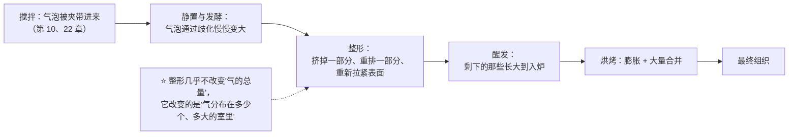
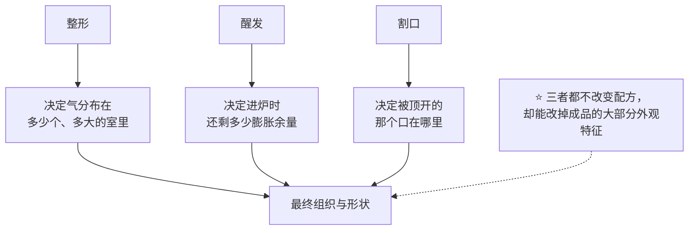

# 第 25 章 整形、醒发与割口

> **本章目标**：回答三个"看起来只是手法"的问题：
>
> 1. **整形到底改了什么**——它几乎不改体积，却能改掉整个组织；
> 2. **醒发是在等什么**——这是膨胀窗口的最后一段，越过峰值是断崖；
> 3. **割口在干什么**——这是全书**证据最薄的一节**，本书会明说到什么程度为止。
>
> > ## **整形决定气往哪里跑，醒发决定还剩多少窗口，割口决定它从哪里出来。**

## 25.1 整形改的是"气室的分布"

第 21 章那条结论在这一章要还账了：**烘烤在放大差异，不创造差异**；
而差异的最后一次重大调整，就发生在整形这一步[^1]。

**"气泡会自己变大"不是比喻**：第 10 章引用过的同步辐射断层扫描研究测到，
不加酵母的面团里，气泡**半径中位数从搅拌后 36 分钟的 22.1 ± 0.7 µm，
增至 162 分钟的 27.3 ± 0.7 µm**，原因是**歧化**（气体从小泡扩散到大泡）。

> **所以"等待"本身就在改组织**——整形只是你**主动**参与的那一次。

## 25.2 一项很干净的实测：整形之前等多久

有一项研究把"搅拌与整形之间等多久"单独拿出来做了变量：**0 / 10 / 20 分钟**。

| 测的是什么 | 随静置时间延长 |
|-----------|--------------|
| 面团的**孔隙率** | **上升** |
| 面团里**小气泡的数量** | **减少** |
| 面团里孔的**中位面积** | **增大** |
| 整形时的**扭矩**（阻力） | **显著下降** |
| **弹性回复**（回弹应变） | 0 分钟最高，10、20 分钟依次下降 |
| **脱气量** | **增加**（且与面团含气量密切相关） |
| 成品的**比容与孔隙率** | **上升** |
| 成品**面包芯中孔的中位面积** | **下降** |

最后两行值得停一下，因为它反直觉：

> ## **静置让面团里的气泡变大，却让成品里的孔变小。**

**为什么会这样**（本书的解读，机制方向与已核到的证据相容）：
静置让面团松弛、脱气更容易，于是**整形时更多的大气泡被挤掉、被重新分成小的**；
同时更松弛的面团在醒发与炉内膨胀时**阻力更小、涨得更充分**（比容更高）。
**"面团里的孔"和"成品里的孔"从来不是同一件事。**

⚠️ 这是**一项研究、一种产品（三明治面包）**，本书只引用方向，不引用"10 分钟""20 分钟"作参数。

## 25.3 整形也是在给面团做功

第 22 章讲过压片能发展面团。同一项研究里有一组结果，正好落在整形这一章：

| 该研究的做法 | 结果 |
|------------|------|
| 短暂搅拌后用压片机反复过辊（辊间距 6 / 9 / 12 mm，不同次数） | 不含麸皮时，**面团膨胀与成品体积随压片次数上升**（该研究到 12 次为止） |
| **更小的辊间距（6 mm）** | **成品更大**（对应更充分的面筋发展），**但组织更粗——气室更少、平均直径更大** |
| 含麸皮的面团 | **8 次优于 12 次**：麸皮存在时，**面筋被过度拉伸的害处更明显** |

> **第一条可迁移判断**：
> ## **整形的收益有转折点：拉紧到某个程度之前，你在建立结构；越过之后，你在撕裂它。**
>
> 而且**"体积更大"和"组织更细"经常不是同一个方向**——这项研究把这一点直接测了出来。

**这解释了两条常见的矛盾经验**：

- "整形要整得紧一点，面包才立得起来"——对，紧的表面提供**约束与方向**；
- "整得太紧，面包会裂开、组织反而粗"——也对，因为你**越过了转折点**。

**两者都对，因为它们说的是同一条曲线的两侧。**

## 25.4 醒发：膨胀窗口的最后一段

醒发（最后发酵）与一次发酵的区别在于：**它离入炉最近，所以它的误差没有补救机会。**

第 24 章的三条结论在这里同时生效：

| 结论 | 在醒发这一步意味着什么 |
|------|--------------------|
| **存在滞后期** | 刚整形完（尤其从冷藏取出）那段时间"看起来没动"是正常的 |
| **温度越高失气时刻越早** | 高温醒发既快又危险，**窗口更窄** |
| **越过峰值是断崖** | 醒发程度研究：比容先升后降，越过峰值后**急剧下降**，并伴随变硬与**皮芯分离** |

**还有一件只在醒发阶段发生的事：表面会干。**

第 21 章的实测提供了机制方向：**烘烤中的升压主要来自"变硬表层"的机械约束**；
另一项经典实验发现，**在几乎不形成表皮的电阻加热炉里烘烤，两种原本组织差别很大的面粉，
组织都变细了**——也就是说，**表层的状态会改变内部组织**。

> **推论（本书显式标注为机制推理）**：
> **醒发时表面提前干燥 = 提前给面团戴上一层约束。**
> 它会限制炉内膨胀，也会改变开裂的位置。
> 这正是"醒发要保湿""盖布/盖盖子"这些惯例的机制方向。
>
> ⚠️ **家用条件下醒发湿度的定量影响，本书未核到**对照实验。

## 25.5 割口：本书证据最薄的一节

**先把话说在前面**：

> ## ⚠️ **本书检索同行评议文献时，关于"割口"只找到设备与产品专利，没有找到对照实验。**
> ## 因此这一节**全部是机制推理与工艺口语**，并已登记为缺口。

**能站得住的机制方向**（都来自已核到的实测）：

| 已核到的事实 | 推出的方向 |
|------------|-----------|
| 烘烤中**升压最高约 1.1 kPa，主要来自变硬表层的机械约束**（第 21 章） | 表皮是一层**先定住的壳**。内部还在膨胀，壳会被顶开——**总得有个地方裂** |
| **表皮形成造成的压力会改变内部组织**（无表皮的炉子里组织变细） | 破口开在哪里，会影响**压力如何释放**，进而影响膨胀 |
| 膨胀最大出现在**面包芯温度接近 90 °C** 时（第 21 章） | 需要被释放的压力集中在**膨胀最剧烈的那一段**，也就是入炉后不久 |

**因此割口的合理描述是**：

> **它不是装饰，也不是"让面包更蓬"，而是"指定破口的位置与方向"。**
> 不割，面团也会裂——只是裂在它自己选的地方（通常是侧面或底部与烤盘接触的边缘）。

**本书不给的东西**（因为没有依据）：割口的深度、角度、数量、间距。
**本书给的替代**：一个你可以自己做的对照（见 25.9 的任务四）。

## 25.6 三句话收束

> **第二条可迁移判断**：
> ## **形状不好看，先查整形与醒发；组织不对，先查搅拌与发酵；裂在奇怪的地方，先查割口与表面状态。**

## 25.7 常见说法辨析

按本书约定标注**证据强度**：✅ 有共识 / ⚠️ 有争议 / ❌ 明确错误 / 缺乏证据。

| 说法 | 判定 | 说明 |
|------|------|------|
| "**整形前要把气排干净，组织才细**" | ⚠️ **有转折点，不是越彻底越好** | 静置时间研究显示：更长静置 → **脱气更多**、成品**比容更高且芯中孔的中位面积更小**（组织更细）；但压片研究显示**过度拉伸有害**（含麸皮时 8 次优于 12 次）。**"排气"与"撕裂"之间有一条线** |
| "**整形只是为了好看**" | ❌ **它在重排气室** | 气泡在静置中通过**歧化**长大（实测半径中位数 22.1 → 27.3 µm）；整形把它们挤掉、重排、重新分布。**烘烤只放大差异，不创造差异**（第 21 章） |
| "**整得越紧越好**" | ⚠️ **越过转折点就变差** | 压片研究：更小辊间距给出**更大的成品，但组织更粗、气室更少更大**；含麸皮时次数过多反而更糟。紧与松各自买到不同的东西 |
| "**面团松弛（中间醒发）只是为了好操作**" | ⚠️ **它同时改了成品** | 静置时间研究测到：扭矩与回弹下降（确实更好操作），**同时**成品的比容与孔隙率上升、芯中孔的中位面积下降。⚠️ 单项研究、特定产品，只引用方向 |
| "**醒发到两倍大 / 戳一下慢慢回弹就是好了**" | ⚠️ **工艺口语** | 本书**未核到**通用终点的依据（已登记为缺口）；戳洞法反映的是**此刻的含气量与松弛程度**，不等于"发酵进行到哪一步"。**改用你自己的高度—时间曲线找峰值**（第 24 章） |
| "**醒发要盖着，不然会干**" | ⚠️ **机制方向相容，定量未核到** | 已核到的相关实测是：烘烤中的**升压主要来自变硬表层的机械约束**；**表皮形成会改变内部组织**。据此推出"表面提前干燥 = 提前上约束"是**机制推理**。⚠️ 家用醒发湿度的定量影响本书**未核到** |
| "**割口是为了让面包涨得更大**" | ⚠️ **更准确的说法是"指定破口位置"** | 本书**未核到**任何割口的对照实验（只检索到专利，已登记为缺口）。能说的是：表皮是先定住的机械约束，**内部膨胀总要找地方释放**；不割它也会裂，只是裂在别处 |
| "**割口要多深 / 什么角度最好**" | 缺乏证据 | **本书不给**深度、角度、数量、间距——没有可引用的实验。**改为给自测方法**（同一批面团，一半割一半不割，或深浅两档，记录炉内涨幅与开裂位置） |
| "**发酵篮的纹路是必须的**" | ⚠️ **工艺口语** | 它的作用主要是**支撑形状与减少粘连**；纹路是副产品。本书**未核到**发酵篮对成品品质影响的对照实验 |
| "**只要发得够，整形随便弄也没事**" | ❌ **两件事买的不是同一样东西** | 发酵决定**有多少气**，整形决定**气怎么分布**。第 10 章还有一条更硬的结论：**初始 CO₂ 体积过高反而损害炉内膨胀**——气多不等于结果好 |

## 25.8 🔎 下次烤之前的用处

1. **把"整形前等了多久"记下来**——它不是等待，它是一个变量（实测会同时改面团与成品）。
2. **整形时注意手感的变化**：阻力（扭矩）与回弹会随静置下降。
   **手感变了，说明面团状态变了**，而不是你手法变了。
3. **醒发别只盯体积**，同时看**表面**：表面已经发干发硬时，你已经提前上了约束。
4. **越过峰值不可逆**——宁可早入炉一点，也别赌"再等五分钟会更好"（断崖）。
5. **割口就做一次对照**（割 vs 不割 / 深 vs 浅），看你这台烤箱、这份配方的裂口在哪里；
   **一次对照胜过十条口诀**。
6. **形状与组织分开诊断**：形状问题往下查整形与醒发；组织问题往上查搅拌与发酵（第 22、24 章）。

## 25.9 思考题

1. 为什么说整形"几乎不改变气的总量，却改变了组织"？请用歧化与合并两个概念解释。
2. 那项静置时间研究里，**面团里的孔**与**成品里的孔**变化方向相反。
   请复述这两组结果，并给出一个能解释它的机制。
3. 压片研究里"更小辊间距 → 成品更大但组织更粗"说明了什么？
   为什么"整得越紧越好"和"整太紧会裂"可以同时成立？
4. **【案例】** 某人做欧包，一次发酵很顺利，整形时面团**弹得厉害、很难收紧**，
   勉强整好后醒发很久也不见长，成品**形状扁塌、底部有致密带、割口没有爆开**。
   （a）写出完整推理链；（b）指出他最可能省略或做反了的那一步；
   （c）给出两个改动方向与对应的记录量。
5. **【案例】** 某人做吐司，为了"组织细腻"在整形时用擀面杖反复擀压排气，
   结果成品**体积偏小、口感发韧、侧面有大孔**。
   （a）他同时做了哪两件事（提示：排气与做功）？（b）哪一件可能过头了？
   （c）怎么设计一个只改一个变量的对照来定位？
6. **【辨析】** "割口能让面包涨得更大"——判断证据强度，
   说明本书为什么把这一节整节标为机制推理，以及能站得住的方向是什么。
7. **【辨析】** "醒发要盖着保湿"——判断证据强度，
   复述支持它的两条实测，并说明本书为什么仍然不给湿度参数。

> 📖 **参考答案**（想清楚再看）：[Q1](../../qa/25-shaping-proofing-scoring-qa.md#q1) ·
> [Q2](../../qa/25-shaping-proofing-scoring-qa.md#q2) · [Q3](../../qa/25-shaping-proofing-scoring-qa.md#q3) ·
> [Q4](../../qa/25-shaping-proofing-scoring-qa.md#q4) · [Q5](../../qa/25-shaping-proofing-scoring-qa.md#q5) ·
> [Q6](../../qa/25-shaping-proofing-scoring-qa.md#q6) · [Q7](../../qa/25-shaping-proofing-scoring-qa.md#q7)

## 25.10 本章实操

### 🅐 零成本版 · 任务一：从成品反推它的整形与醒发

不用烤箱。找两个**同类但外观差别明显**的商品面包（例如两款吐司或两款欧包），只靠观察填表：

| 观察 | 面包 A | 面包 B | 它反映哪一步 |
|------|-------|-------|------------|
| 孔的大小是否均匀？有没有特别大的孔 | | | 整形（排气是否均匀）与发酵 |
| 有没有明显的"旋纹"或层状结构 | | | 整形方式（卷 / 折 / 擀） |
| 顶部或侧面有没有开裂？裂在哪 | | | 割口与表面状态 |
| 底部是否有致密带 | | | 醒发不足 / 面团过软 / 装载方式 |
| 侧面是否内凹（收腰） | | | 结构不足（第 18、21 章） |

### 🅐 零成本版 · 任务二：把一份配方的"手法句"翻译成变量

找一份写了"排气""滚圆""松弛 15 分钟""二发至两倍""表面划一刀"的配方，逐句翻译：

| 配方原句 | 它在改哪个量（气室分布 / 窗口 / 破口） | 你打算怎么记录它 | 如果省掉这一步，你预测会怎样 |
|---------|--------------------------------|----------------|------------------------|
| | | | |
| | | | |

### 🅑 开火版 · 任务三：整形前的静置时间对照（有烤箱时做）

**唯一变量**：搅拌后到整形之间的等待时间。同一份面团分两份，其余完全相同：

| 组 | 静置时间 | 整形时的手感（阻力 / 回弹） | 入炉前高度 | 炉内涨幅 | 组织（孔的大小与均匀度） |
|----|---------|------------------------|-----------|---------|---------------------|
| ① | 不等，直接整形 | | mm | mm | |
| ② | 等一段固定时间再整形 | | mm | mm | |

> **怎么读结果**：如果 ② 的**手感明显更好操作**，而且成品**体积更大、孔反而更细**——
> 你就重现了 25.2 那项研究的核心结论。
>
> ⚠️ **局限**：静置同时改了水合、松弛与气泡分布，**它给方向，不给定量**。

### 🅑 开火版 · 任务四（加分）：割口对照

**唯一变量**：割口。同一批面团分成两个（或四个）相同大小的坯：

| 坯 | 处理 | 炉内涨幅 | 裂口出现在哪里 | 形状是否对称 | 组织有无差别 |
|----|------|---------|--------------|------------|------------|
| ① | 不割 | mm | | | |
| ② | 割一刀（你惯用的深度） | mm | | | |
| ③（可选） | 割得更浅 | mm | | | |
| ④（可选） | 割得更深 | mm | | | |

做完回答：

| 问题 | 你的答案 |
|------|---------|
| 不割的那个，裂在哪里？ | |
| 割口有没有改变**炉内涨幅**？还是只改变了**裂的位置**？ | |
| 你会把哪一档定为你的默认做法？ | |

> ⚠️ **本书对这个任务的期望很低但很诚实**：
> **本书未核到任何割口的对照实验**，所以这个任务的目的不是验证某条结论，
> 而是让你拥有**属于你自己的那组观察**。请把结果记进[烘焙记录与复盘表](../../forms/bake-log.md)。
>
> ⚠️ **安全提醒**：割口用的刀片非常锋利，操作时手要远离刀刃方向。
> 不要尝生面糊与生面团（美国 FDA：生面粉不是即食食品；
> 含蛋配方另有生蛋风险，含蛋菜品建议做到 160 °F，约 71 °C，并用食品温度计确认）。
> ⚠️ 各国口径不同，以当地现行发布为准。

## 25.11 本章依据

本章引用的来源与核对状态详见[参考书目与出处登记](../../standards.md)，具体对应如下：

| 本章用到的内容 | 依据 |
|--------------|------|
| 搅拌与整形之间静置 **0 / 10 / 20 分钟**：面团**孔隙率上升、小气泡减少、孔的中位面积增大**；**扭矩显著下降**、回弹依次下降、**脱气增加**；成品**比容与孔隙率上升，而芯中孔的中位面积下降** | *Journal of Food Engineering* 2017 关于搅拌与整形之间静置时间对面团孔隙率与成品气室分布影响的研究，✅ 摘要层面。**本章 25.2 的核心依据**；⚠️ 单项研究、三明治面包，只引用方向 |
| 压片可发展面团：随压片次数上升体积增大（到 12 次）；**更小辊间距成品更大但组织更粗、气室更少更大**；含麸皮时 **8 次优于 12 次**（过度拉伸有害） | *Foods* 2022 关于压片发展面团的研究（开放获取），✅ 摘要层面（第 22 章已登记）。**本章 25.3 的核心依据** |
| 不加酵母的面团中气泡因**歧化**长大：半径中位数从搅拌后 36 分钟的 **22.1 ± 0.7 µm** 增至 162 分钟的 **27.3 ± 0.7 µm** | *Food Research International* 2016 用同步辐射 X 射线显微断层扫描的研究，✅ 摘要层面（第 10 章已登记） |
| 烘烤中气室**先成核后大量合并**，面包心形成结束时数量比初始**减少 55%~67%** | *Food Research International* 2018 关于气室合并动力学的研究，✅ 摘要层面（第 10 章已登记） |
| 烘烤中**升压最高约 1.1 kPa，主要来自变硬表层的机械约束** | *Journal of Cereal Science* 2010 关于烘烤中局部压力与温度联合测量的研究，✅ 摘要层面（第 15、21 章已登记） |
| 在**几乎不形成表皮的电阻加热炉**中烘烤，两种原本组织差别很大的面粉**组织都变细**——**表皮形成造成的压力**是组织差异的原因之一 | *Cereal Chemistry* 1998 关于压力（表皮形成）对面包组织影响的研究，✅ 摘要层面（第 15、21 章已登记） |
| 膨胀最大可达 1.7 倍，出现在**面包芯温度接近 90 °C** 时 | *Journal of Food Engineering* 2005 用带仪表的中试烤炉研究法棍烘烤的工作，✅ 摘要层面（第 10、21 章已登记） |
| 醒发程度 **1.1~1.7 mL/g**：比容**先升后降、峰值 1.3**，越过后**急剧下降**并伴随变硬与**皮芯分离** | *Foods* 2024（开放获取），✅（第 10、24 章已登记）。⚠️ 特定产品的实验设计 |
| 醒发存在**滞后期**（常规加热到膨胀比 3 需 122 分钟，其中 58 分钟为滞后期） | *Innovative Food Science and Emerging Technologies* 2017 关于欧姆加热辅助醒发的研究，✅ 摘要层面（第 24 章已登记） |
| 醒发温度越高**失气时刻越早** | *Journal of Cereal Science* 2007，✅ 摘要层面（第 11、24 章已登记） |
| **初始 CO₂ 体积过高会损害炉内膨胀** | *Innovative Food Science and Emerging Technologies* 2016，✅ 摘要层面（第 10、24 章已登记） |
| 组织在**烘烤早期就已分化**（第 12 分钟） | *Cereal Chemistry* 1998 关于面包组织在烘烤中发育的研究，✅ 摘要层面（第 15、21 章已登记） |
| 生面粉与生面团的安全；含蛋菜品的安全温度 | 美国 FDA「Handling Flour Safely」与「What You Need to Know About Egg Safety」，✅ 已核到官方页面。⚠️ 各国口径不同 |
| **割口（深度 / 角度 / 数量 / 间距）的对照实验** | ⚠️ **未核到**：检索同行评议文献只找到设备与产品**专利**（已登记为缺口）。25.5 整节**显式标注为机制推理**，正文只给"指定破口位置"的方向与自测方法 |
| **醒发湿度（保湿 / 结皮）的定量影响** | ⚠️ **未核到**（已登记为缺口）。正文只给机制方向（表面提前干燥 = 提前上机械约束） |
| **发酵篮（藤篮）对成品品质的影响** | ⚠️ **未核到**对照实验（已登记为缺口）。按工艺口语处理 |
| **"排气要排到什么程度"的通用参数** | ⚠️ **未核到**。已核到的只有"存在转折点"的方向（压片次数与辊间距、静置时间两项研究） |
| **各类成品的"醒发终点"通用数值** | ⚠️ **不给**（已登记为缺口）。改为自建高度—时间曲线（第 24 章） |

[^1]: 本章新出现的术语：[整形](../../glossary.md#shaping)（shaping）、
[中间醒发](../../glossary.md#bench-rest)（bench rest）、
[割口](../../glossary.md#scoring)（scoring）、
[结皮](../../glossary.md#skinning)（skinning）、
[醒发耐受度](../../glossary.md#proofing-tolerance)（proofing tolerance）。
第 10 章的[气室](../../glossary.md#gas-cell)、[歧化](../../glossary.md#disproportionation)、
[合并](../../glossary.md#coalescence)、[醒发](../../glossary.md#proofing)，
第 15 章的[压片](../../glossary.md#sheeting)在本章继续使用。

---

**这四章到此告一段落。** 你现在手上有了四个旋钮：
**给多少功（第 22 章）、在什么温度（第 23 章）、给多少时间（第 24 章）、气怎么分布（第 25 章）。**

**下一章**：第 26 章 称量与精度。
前面四章的所有记录都建立在一个前提上——**你称得准**。
而"一杯面粉是多少克"这个问题，比它看起来严重得多。
