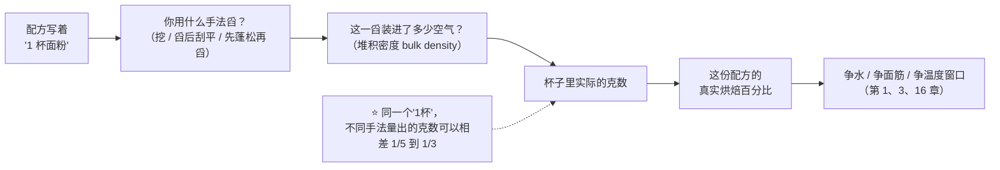
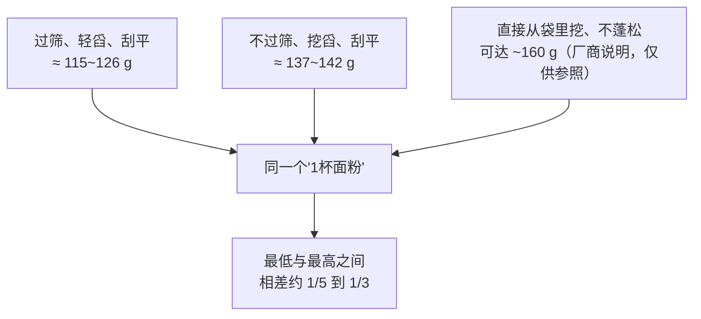
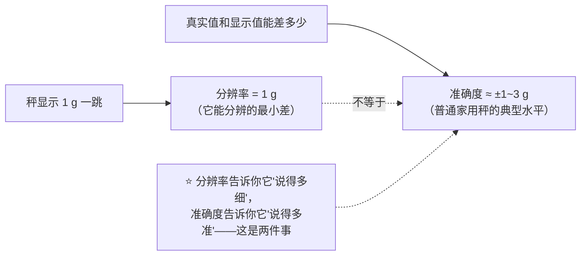

# 第 26 章 称量与精度：为什么烘焙必须用秤

> **本章目标**：回答第 9 章留下的那句话——
> "'杯'和'勺'不是重量，这是家庭烘焙最大的误差来源之一"——到底有多大。
>
> 这一章不讲任何新的原料或机理，它讲一件更底层的事：
> **你以为自己量对了配方，但"量"这个动作本身就带着误差，
> 而且这个误差常常比你愿意相信的大得多。**
>
> > ## **"一杯面粉"不是一个固定的重量，它是"这包面粉的堆积密度 × 你舀它的手法"算出来的一个数，
> > ## 而这两项你几乎从不控制。**

## 26.1 "一杯面粉"到底是什么意思

量具（杯、勺）量的是**体积**；配方要的是**重量**（更准确地说，是能参与反应的**物质的量**）。
从体积换算到重量要乘一个数——**密度**。问题是：

> **面粉不是液体。它是一堆颗粒，颗粒之间夹着空气，而空气占的比例完全取决于你怎么把它装进杯子里。**

**同一只量杯，同一包面粉**，换一种舀法，装进去的克数就不一样——
这不是你手笨，是**体积量具对粉状原料天生有歧义**：
量杯定义的是一个固定的**空间**（约 236.6 mL[^1]），
而它愿意相信"不管你怎么把粉倒进去，装进来的质量都一样"——这个假设对水成立，对面粉不成立。

> **这正是第 9 章烘焙百分比要解决的问题的另一半**：
> 百分比解决的是"配方之间怎么比较"，而**这一章解决的是"你读到的那个克数本身有多可信"**——
> 两个问题叠在一起：**如果你的"克数"输入就错了，后面所有的百分比计算都是在精确地算错一个数字。**

## 26.2 实测：同一杯面粉，舀法不同，克数差多少

把"怎么舀"拆成几种常见手法，看它们各自量出多少克。本书交叉验证了两类独立来源：
一项**1963 年的大规模实验**（美国农业部研究者主持，29 所高校协同测量，
合计称了 **4,143 杯通用粉、2,065 杯蛋糕粉**），
与**美国 Cook's Illustrated / America's Test Kitchen 的官方测量方法说明**。

| 手法 | 大致做法 | 通用粉（all-purpose）克数/杯 | 来源 |
|------|---------|---------------------------|------|
| **过筛后舀入、刮平** | 先过筛再轻轻舀进杯子，用直边刮平 | **115 g**（实验室均值，标准差 1.9） | 1963 年高校联合测量实验 |
| **不过筛、轻舀入、刮平**（类似"蓬松后用勺舀入"） | 不过筛，用勺把面粉舀进杯子（不压实），刮平 | **126 g**（实验室均值，标准差 2.8） | 同上 |
| **不过筛、直接用杯挖、刮平**（dip-and-sweep / 挖舀法） | 杯子直接插进面粉容器里挖起来，刮平 | **137 g**（实验室均值，标准差 4.6） | 同上 |

**另两个独立来源分别落在这两档的区间内外**：

- **America's Test Kitchen 的官方标准是 5 盎司 ≈ 142 g**：
  他们让数十名志愿者各自用"挖舀刮平法"量 1 杯通用粉，称重后取平均值，
  以此定为自己配方里"1 杯面粉"的标准重量；该机构同时指出，
  **因为舀法与手的轻重不同，同一杯面粉的重量浮动可达 20%**。
- 面粉厂商 King Arthur 的官方说明书中给出：**用"先蓬松、再舀入、刮平"的方法量出约 120 g**，
  但**直接从袋子里挖、不特意蓬松**，**一杯可以重到 160 g**。
  ⚠️ **这是厂商自己的测量说明，本书按查证纪律只把它当作"存在这种做法与差异"的佐证，
  不单独作为数字依据**——它在这里的价值是：**独立于学术实验，厂商自己的测量也落在同一个方向和量级上。**

> ## **第一条可迁移判断规则**：
> ## **"1 杯面粉"这四个字本身没有告诉你重量，它只有和"怎么舀"放在一起才有意义。
> ## 一份配方如果只写"杯"不写"克"，你和写配方的人很可能根本没有量过同一个东西。**

⚠️ **诚实的局限**：1963 年那项研究年代久远，本书**未能找到该论文的可获取全文**，
以上数字转引自对该论文发表数据表的转述；原刊信息为
*Journal of Home Economics* 1963 年第 55 卷第 2 期，第 123–124 页（见[出处登记](../../standards.md)）。
**但它与两个独立的当代来源（ATK 的实测均值、厂商的说明）方向一致、量级吻合**，
这正是本书"关键数字要交叉验证"的纪律要求的具体样子。

## 26.3 为什么会这样：颗粒、空气与堆积密度

机制并不神秘：面粉颗粒之间**夹着空气**，这些空气占的体积比例就是
[堆积密度](../../glossary.md#bulk-density)（bulk density）要描述的东西。
蓬松的面粉堆积密度低（同样体积里面粉少、空气多）；
被挤压、震实过的面粉堆积密度高（同样体积里塞进更多面粉）。

**挖舀为什么比舀入刮平装得更多**：杯子插进面粉堆时，
周围的粉会被挤压、塌陷进杯壁周围的空隙，天然带着比"轻舀"更紧实的状态——
这和食品工程里测量"压实密度"（tapped density，把容器震动或敲击后测得的更高密度）
是同一类现象的厨房版本。一项比较硬红冬小麦粉与软白冬小麦粉堆积与压实性质的研究发现：
**两种颗粒大小接近的小麦粉（平均粒径分别为 48.77 µm 与 48.20 µm），
堆积密度与压实密度却有显著差异，吸气比也不同（16.69 对 12.67）**——
**"看起来差不多的两包粉"，堆积密度可以是两回事，这还没算上你怎么舀它。**

> **一句话**：你不是在量"面粉"这个物质，你是在量
> **"面粉 + 它恰好被你装进了多少空气"**——而空气的那一部分**完全不参与烘焙**，
> 却实实在在地占了杯子里的体积。

**这也解释了另一个厨房常见现象**：同一包面粉，**刚开封时蓬松，放了一阵子之后变"实"**——
运输和存放中的震动会让颗粒逐渐沉降、互相挤得更紧，这正是堆积密度会随**时间与扰动**变化的直接后果。
**"同一包面粉，这周和上周舀出来不一样重"是真实的物理现象，不是错觉。**

## 26.4 不只是面粉：盐与酵母的同一个问题

**同一个机制会出现在任何颗粒状原料上**，只是表现形式不同。

### 盐：晶体形状直接决定"一茶匙"是多少克

America's Test Kitchen 对三种常见食盐做过实测比较：

| 盐的种类 | 晶体形态 | 1 茶匙（约 4.9 mL）大致重量 |
|---------|---------|---------------------------|
| 精制餐桌盐（table salt） | 细小立方体，颗粒间空隙很小 | 约 **6 g** |
| Morton 犹太盐 | 经碾压成型、较密实的薄片 | 约 **4.8~5 g** |
| Diamond Crystal 犹太盐 | 蒸发锅熬制、空心的金字塔状薄片 | 约 **2.8~3 g** |

**同样一茶匙，最轻和最重能差出一倍以上**——
这和面粉是同一件事：**晶体/颗粒的形状决定了颗粒之间能留住多少空气，
进而决定同一个体积里装了多少质量**。

⚠️ 以上三个数字均来自同一家机构（America's Test Kitchen）的测量，**本书未找到第二家独立机构的交叉验证**，
按查证纪律标注"仅见于该机构的实测"，但**这组数字背后的机制**（颗粒形态 → 堆积密度 → 体积量具失真）
与面粉的情形**在方向上完全一致**，可以互相作为机制层面的佐证。

> **推论**：如果你照着一份美式配方按"1 茶匙盐"去买了别的牌子的盐，
> 你很可能换掉的不只是风味来源（第 7 章），还**在不知不觉间把盐的实际用量改变了一倍左右**。
> **配方如果没写清楚是哪种盐，"按体积换算"本身就不成立。**

### 酵母：这里本书选择不给数字

关于"1 茶匙酵母是多少克"，公开资料里能查到的数字从约 2.8 g 到 4.2 g 不等，
**彼此不一致，也没有统一的测量方法说明**。酵母是**密度很低、极易吸附空气的细粉**，
原理上肯定也受同一套机制支配，但**本书没有核到一项交代了测量方法、可独立验证的权威数据**，
所以**不给出具体换算克数**（已登记为缺口，见[出处登记](../../standards.md)）。
第 11 章已经指出：**鲜酵母、活性干酵母、即发干酵母之间"连重量换算都对不上"**——
这里再加一条：**同一种干酵母，"1 茶匙"本身就不是一个可靠的量**。

> **本书给的替代做法**：酵母、泡打粉、小苏打这类**小剂量、高活性**的原料，
> **一律按包装上标注的重量用秤称**，不要用体积量具去对付它们——
> 原因会在 26.6 讲清楚：**小剂量上的体积误差，换算成百分比误差是最大的。**

## 26.5 秤本身也有误差：分辨率不是准确度

把"用秤"当成万能解药之前，先弄清楚一件容易被忽略的事：
**秤显示到小数点后一位，不代表它真的准到那个位数。**

这里有两个经常被混为一谈的概念：

| 概念 | 英文 | 意思 |
|------|------|------|
| **分辨率 / 可读性**（resolution / readability） | 秤每一级能显示的最小差值（比如 1 g 一跳，还是 0.1 g 一跳） | 这是"它能告诉你多细"的刻度 |
| **准确度**（accuracy / tolerance） | 它显示的数字和真实重量之间**实际能差多少** | 这是"它说的话有多可信" |

**美国官方计量标准 NIST Handbook 44**（美国国家标准与技术研究院发布，**用于规范商用/贸易用途的衡器**）
把这两者明确区分为两个不同的参数：
**分度值 d**（秤实际显示的最小刻度）与**检定分度值 e**
（用来界定准确度等级、并据此规定公差的那个值）——
对大多数常见等级（如家用秤常落入的 III 类）而言，**d 要求等于 e**，
但**该标准管的是商用计量器具的法定认证**，**家用厨房秤完全不在强制认证范围内**——
也就是说，**你厨房里那台秤，没有任何机构强制要求它必须准到多少。**

**实测会告诉你差距有多大**：America's Test Kitchen 用 30 g、200 g、500 g 的标定砝码
实测了市面上一批家用电子秤：

- 绝大多数家用电子秤的**分辨率是 1 g**（能显示到个位数）；
- 但它们的**实际准确度**普遍在**±1~3 g** 的量级——该机构的说法是
  **"±3 g 的误差对大多数烹饪来说常见且可以接受"**；
- 只有**经过 NIST 可溯源认证**的高端型号（例如测评中的升级推荐款）
  能做到**±0.7 g** 的认证准确度，分辨率也能到 0.1 g。

> ## **第二条可迁移判断规则**：
> ## **看到秤显示到 0.1 g，先别急着信——那只是分辨率。
> ## 除非注明经过认证，家用秤的真实误差量级通常是 ±1~3 g，而不是它显示的那一位数字。**

## 26.6 为什么小剂量最该上秤、而且该上精度更高的秤

把 26.5 的"±1~3 g 的秤误差"和烘焙百分比（第 9 章）放在一起看，
会得到一个反直觉但很重要的结论：

> **同样是 ±2 g 的误差，落在不同原料身上，造成的"百分比误差"天差地别。**

| 原料 | 配方里的典型量 | ±2 g 误差造成的相对误差 |
|------|--------------|----------------------|
| 面粉（基准，500 g） | 500 g | 约 **0.4%** —— 几乎可以忽略 |
| 盐（2% 的面粉基准，10 g） | 10 g | 约 **20%** —— 相当于把盐从 2% 变成了 1.6%~2.4% |
| 泡打粉 / 小苏打（1%，5 g） | 5 g | 约 **40%** —— 足以让第 13 章讲的酸碱配平整个偏移 |
| 干酵母（1%，5 g） | 5 g | 约 **40%** —— 足以明显改变第 11 章讲的产气速度 |

**这张表背后的道理很简单**：**误差的绝对值（±2 g）不会因为原料不同而变化，
但它相对这份原料"本身该有多少"的比例，会随原料用量变小而急剧放大。**

> ## **第三条可迁移判断规则（本章的核心结论）**：
> ## **面粉称错 2 g 几乎没有影响；盐、膨松剂、酵母称错 2 g 可能是另一份配方。
> ## 所以精度最该花在小剂量原料上——一台 1 g 分辨率的厨房秤配一台 0.1 g 的迷你秤，
> ## 比买一台"看起来更高级"的大秤更有用。**

这也回应了第 13 章的一个遗留问题：**小苏打与泡打粉的"中和值"配平要求精确配比**，
而家用厨房秤的±1~3 g 误差，对 5 g 量级的膨松剂而言，**本身就是一个不小的扰动源**——
"为什么我和配方作者用了同样的克数，效果却不一样"，答案可能根本不在配方，而在秤。

## 26.7 常见说法辨析

按本书约定标注**证据强度**：✅ 有共识 / ⚠️ 有争议 / ❌ 明确错误 / 缺乏证据。

| 说法 | 判定 | 说明 |
|------|------|------|
| "**用量杯量面粉，只要'刮平'就是准的**" | ❌ **明确错误** | 本章 26.2 的实测显示，**同样都刮平**，"舀入刮平"与"挖舀刮平"能差出 115~142 g——"刮平"只消除了"冒尖"这一项误差，不消除"挖 vs 舀"带来的压实差异 |
| "**面粉要先过筛再量，量出来才准**" | ⚠️ **有共识但常被忽视它改变了什么** | 过筛会降低堆积密度、让同一杯装得更少（实测中过筛后约 115 g vs 不过筛约 126 g）。**它确实更"轻"，但"轻"不等于"准"**——它只是提供了一种**更低、更一致**的参照点，前提是配方作者也用的是过筛的量法 |
| "**只要是同一只量杯，量出来就是一样的**" | ❌ **明确错误** | 量杯固定的是**体积**，不是**重量**；本章 26.1~26.2 的全部内容都在说明这一点 |
| "**用秤就不会有误差了**" | ⚠️ **有共识但程度被高估** | 用秤**消除了"舀法"这一层误差**（通常是最大的一层），但**秤本身也有 ±1~3 g 的实际准确度**（26.5）。用秤是**显著改善**，不是**完全消除** |
| "**秤显示到 0.1 g，所以它准到 0.1 g**" | ❌ **明确错误** | 这是把**分辨率**和**准确度**混为一谈（26.5）。除非标注经过认证，否则显示位数只代表它"愿意告诉你多细"，不代表"它真的知道多细" |
| "**少许盐、一小撮糖，差不多就行**" | ⚠️ **取决于原料占比，不能一概而论** | 对总量占比很大的原料（面粉、水、糖的主体部分），小的绝对误差确实影响很小；但对**小剂量、高活性**的原料（盐、膨松剂、酵母），同样的绝对误差是**巨大的相对误差**（26.6） |
| "**不同牌子的犹太盐可以按体积 1:1 替换**" | ❌ **明确错误** | 实测 Diamond Crystal 与 Morton 两种犹太盐同体积下重量可差一倍左右（26.4），**按体积换算必然把用盐量换掉一大截** |
| "**厂商标的'1 杯=120 g'就是标准答案**" | ⚠️ **它是一种约定，不是物理常数** | 120 g 是某厂商按**自己的测量方法**定的参照值；其他机构（如 America's Test Kitchen）用不同方法测出的参照值是 142 g。**两个都"对"，只是对应不同的舀法**——关键是**认准你手上这份配方用的是哪一套约定** |

## 26.8 思考题

1. 为什么说"1 杯面粉"这四个字本身"没有告诉你重量"？请用"体积"与"堆积密度"两个词解释。
2. 本章引用的 1963 年高校联合测量实验里，"过筛后舀入刮平"与"不过筛直接挖舀刮平"分别测得多少克？
   这两种方法之间的差距，与 America's Test Kitchen、King Arthur 各自给出的数字是否吻合？
3. 分辨率与准确度是两个不同的概念。请用你自己的话解释它们的区别，
   并说明"秤显示到 0.1 g"为什么不能直接当作"这台秤准到 0.1 g"的证据。
4. 为什么同样是 ±2 g 的称量误差，对面粉几乎没有影响，对盐和膨松剂却可能是"另一份配方"？
   请用具体的百分比数字说明。
5. **【案例】** 某人按一份美式配方做饼干，配方写"1 cup all-purpose flour, 1 tsp kosher salt
   (Diamond Crystal)"。他家里只有 Morton 犹太盐，而且他习惯直接用勺从袋子里挖面粉、不刮平。
   成品又咸又硬、不怎么摊开。（a）写出完整推理链，指出他可能在哪两步引入了误差；
   （b）这两步误差分别把"面粉基准下盐与水的烘焙百分比"往哪个方向推了；
   （c）给出两个改动方向，并说明分别怎么验证。
6. **【辨析】** "用量杯量面粉，只要称重前先刮平表面，结果就是准的"——
   判断这个说法的证据强度，并说明"刮平"到底消除了哪一层误差、没有消除哪一层误差。
7. **【辨析】** "家用电子秤显示到个位数的克数就足够精确了"——
   结合 26.5、26.6 的内容，判断这个说法在什么条件下成立、在什么条件下不成立。

> 📖 **参考答案**（想清楚再看）：[Q1](../../qa/26-measurement-precision-qa.md#q1) ·
> [Q2](../../qa/26-measurement-precision-qa.md#q2) · [Q3](../../qa/26-measurement-precision-qa.md#q3) ·
> [Q4](../../qa/26-measurement-precision-qa.md#q4) · [Q5](../../qa/26-measurement-precision-qa.md#q5) ·
> [Q6](../../qa/26-measurement-precision-qa.md#q6) · [Q7](../../qa/26-measurement-precision-qa.md#q7)

## 26.9 🔎 下次烤之前的用处

1. **先问配方用的是"杯"还是"克"**。如果是"杯"，**先查清楚作者的舀法约定**
   （很多英文配方站会注明"spoon and level"或"scoop and level"），
   找不到约定时，默认按**"舀入刮平"而不是"挖舀"**，这样更接近保守估计。
2. **面粉可以用秤的 1 g 分辨率**，但**盐、泡打粉、小苏打、酵母**这类小剂量原料，
   如果条件允许，**换一台 0.1 g 分辨率的小秤**——26.6 的表格告诉你为什么这笔投入最划算。
3. **换了盐的牌子，先查它是哪种晶体**，不要按体积 1:1 替换；没把握时**先称重**。
4. **秤也会错**：定期用一个已知重量的物体（比如标注克数的硬币、砝码）校一下你的秤，
   而不是盲目相信它的读数。
5. **把"这次用的量具/秤+具体手法"写进记录表**——这是"同一份配方为什么这次不一样"
   最容易被忽略、却最容易复现的一个变量。

## 26.10 本章实操

### 🅐 零成本版 · 任务一：称出你自己的"1 杯面粉"

不需要开火，只需要一个量杯、一台厨房秤（没有秤的话，用这个任务来**说明为什么你需要一台**）：

| 舀法 | 这一次称出的克数 | 与本章表格里哪一档最接近 |
|------|----------------|----------------------|
| 蓬松面粉后，用勺舀进杯子，刮平 | g | |
| 不处理面粉，直接用杯子挖进袋子里，刮平 | g | |
| 用杯子挖进袋子里，不刮平（冒尖） | g | |

做完回答：**三次称出的克数之间最大差了多少？占"过筛舀入刮平"那一档的百分之多少？**
如果没有秤，**用这三种舀法分别装满杯子，比较它们装的量看起来有没有明显不同**，
并说明"看起来差不多"这个判断本身有多不可靠。

### 🅐 零成本版 · 任务二：把一份"杯/勺"配方翻译成克

找一份只用"杯""茶匙""大勺"写的配方（常见于英文配方站），逐项换算：

| 配方原句 | 这份配方有没有注明舀法/盐的品牌？ | 你打算按哪一档换算成克 | 换算后以面粉为 100% 的烘焙百分比 |
|---------|--------------------------|------------------|---------------------------|
| | | | |

> 本书统一约定**以面粉总量为 100%** 表示烘焙百分比，完成这张表之后，
> 对照[配方解码表](../../forms/recipe-decode.md)继续往下做。

### 🅑 开火版 · 任务三：称量误差对照实验（有烤箱时做）

**唯一变量**：面粉的量法。做同一份简单配方（例如司康或饼干）两份，
一份**用秤称出配方要求的克数**，另一份**按"挖舀刮平"量出同样写着的"杯数"**，
其余步骤完全相同：

| 组 | 面粉称重方式 | 实际面粉克数 | 面团手感 | 入炉前状态 | 成品直径/高度 | 组织 |
|----|------------|------------|---------|-----------|-------------|------|
| ① 用秤 | 按克数称 | g | | | | |
| ② 用量杯挖舀 | 挖舀刮平 | g | | | | |

> **怎么读结果**：如果②组的面粉克数明显高于①组，
> 而且面团**更干、更不好操作**，成品**更硬、摊得更小**——
> 你就亲眼验证了"多出来的面粉抢走了水"（第 1、3 章的"争水"框架）。
>
> ⚠️ **局限**：这是一次单变量对照，**具体差多少取决于你手上这包面粉的堆积密度**，
> 不要把这一次的数字当成通用值。

### 🅑 开火版 · 任务四（加分）：给你的秤做一次粗略校准

找几枚面值已知、磨损不严重的硬币（可事先查到标准重量）或家里现成的标称克数砝码/包装：

| 参照物 | 标称重量 | 秤显示的重量 | 差了多少 |
|--------|---------|-------------|---------|
| | g | g | g |
| | g | g | g |

> **怎么读结果**：如果你的秤在多个参照物上都偏向同一个方向（一直偏高或一直偏低）、
> 且偏差量级在 26.5 提到的 ±1~3 g 左右，这就是**你这台秤真实的误差水平**——
> 把它记下来，以后称小剂量原料时心里有数。
> ⚠️ **本任务不是计量学标定**，只是一次厨房里能做的粗略核对。

请把结果记进[烘焙记录与复盘表](../../forms/bake-log.md)。

## 26.11 本章依据

本章引用的来源与核对状态详见[参考书目与出处登记](../../standards.md)，具体对应如下：

| 本章用到的内容 | 依据 |
|--------------|------|
| 通用粉**过筛舀入刮平 115 g、不过筛舀入刮平 126 g、不过筛挖舀刮平 137 g**（均为实验室均值，另有多校调查数据） | 1963 年一项由美国农业部研究者主持、29 所高校协同测量的大规模称重实验（原刊 *Journal of Home Economics* 1963 年第 55 卷第 2 期），⚠️ **待核一手**：本书未能获取论文全文，数字转引自对该文发表数据表的转述。**本章 26.2 的核心依据之一** |
| America's Test Kitchen 的官方标准为**1 杯通用粉 = 5 oz ≈ 142 g**，由数十名志愿者实测取平均值而定；**不同舀法造成的差异可达 20%** | America's Test Kitchen / Cook's Illustrated 官方测量说明页面，✅ **本次写作已核到官方页面全文**（原有的"未核到一手"状态在本章更新，见[出处登记](../../standards.md)核对记录）。**本章 26.2 的核心依据之一** |
| 面粉厂商官方说明：**"先蓬松、舀入、刮平"约 120 g；直接从袋中挖、不蓬松可达 160 g** | King Arthur Baking 官方博客说明页面，✅ 已核到官方页面；⚠️ **厂商内容，按查证纪律只作"存在该做法与差异"的佐证，不单独作为数字依据** |
| **硬红冬小麦粉与软白冬小麦粉**（平均粒径相近，48.77 µm 对 48.20 µm）的**堆积密度与压实密度有显著差异**，吸气比分别为 16.69 与 12.67 | *Journal of Cereal Science* 2015 一项关于硬质与软质小麦粉堆积流动性质的研究（doi:10.1016/j.jcs.2015.03.010），✅ 摘要层面。**本章 26.3 的核心依据** |
| 三种食盐 1 茶匙大致重量：**精制餐桌盐约 6 g、Morton 犹太盐约 4.8~5 g、Diamond Crystal 犹太盐约 2.8~3 g** | America's Test Kitchen 关于食盐品种比较的测评文章，✅ 已核到官方页面全文。⚠️ **仅见于该机构实测，未找到第二家独立机构的交叉验证**，但其机制与面粉堆积密度的实测方向一致。**本章 26.4 的核心依据** |
| 美国 **NIST Handbook 44**：区分**分度值 d**（显示分辨率）与**检定分度值 e**（用于定义准确度等级与公差）；常见等级要求 d = e；该标准管辖**商用/贸易衡器的法定计量**，不强制要求家用秤达到某个准确度 | 美国国家标准与技术研究院（NIST）官方计量标准 *NIST Handbook 44*（2024 版）及其 Weighing and Scales 常见问题页面，✅ 已核到官方页面。**本章 26.5 的核心依据之一** |
| 家用电子秤**分辨率普遍为 1 g**，**实测准确度普遍在 ±1~3 g**；经认证的高端型号可达 **±0.7 g**（NIST 可溯源认证） | America's Test Kitchen 关于家用数字厨房秤的测评（用 30 g / 200 g / 500 g 标定砝码实测），✅ 已核到官方页面全文。**本章 26.5 的核心依据之一** |
| 鲜酵母 / 活性干酵母 / 即发干酵母**在菌株、代谢物谱与麦芽糖利用能力上就不同**，不只是含水量不同 | *Comprehensive Reviews in Food Science and Food Safety* 2019 与 *International Journal of Food Microbiology* 2026（第 11 章已登记），✅ 摘要层面。本章 26.4 据此说明"酵母的体积—重量换算"缺少可靠一手数据 |
| **酵母"1 茶匙等于多少克"的权威、方法说明清晰的一手数据** | ⚠️ **未核到**：公开资料里数字互相矛盾（约 2.8~4.2 g 不等），且均未交代测量方法，已登记为缺口。正文不给具体数字 |
| **过筛与蓬松让成品更蓬松** 的机理 | 本书第 2 章已登记为缺口（未找到一手实验）；本章仅引用过筛/蓬松对**堆积密度、进而对体积计量**的影响，不涉及对成品蓬松度的因果声称 |

[^1]: 本章新出现的术语：[堆积密度](../../glossary.md#bulk-density)（bulk density）、
[分辨率与准确度](../../glossary.md#scale-resolution-accuracy)（resolution / accuracy）。
第 9 章的[烘焙百分比](../../glossary.md#bakers-percentage)、
第 13 章的[中和值](../../glossary.md#neutralization-value)、
第 11 章的[酵母的三种商品形态](../../glossary.md#yeast-forms)在本章继续使用。

---

**下一章**：第 27 章 配方以外的变量——面粉批次、湿度、海拔、水质。
这一章把"你称得准不准"的问题摆平了；下一章要面对的是
**就算你称得分毫不差，为什么同一份配方在别人家、甚至在你家的下一个季节里，还是不成立。**
