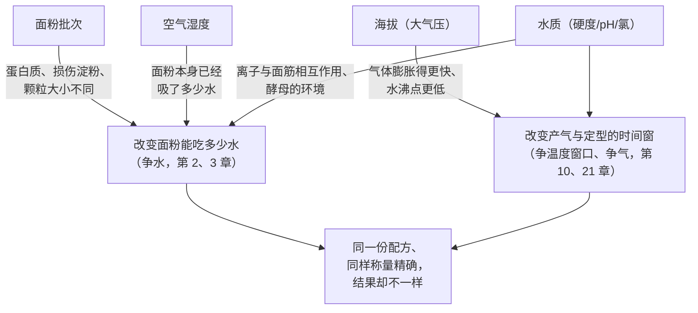
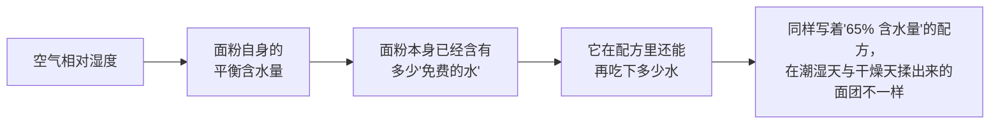
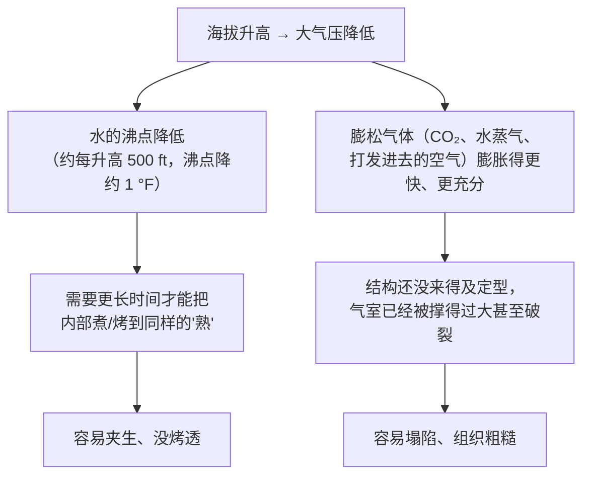

# 第 27 章 配方以外的变量：面粉批次、湿度、海拔、水质

> **本章目标**：回答第 26 章留下的最后一个问题——
> **"就算我称得分毫不差，为什么同一份配方在别人家，甚至在我家的下一个季节，还是不成立？"**
>
> 答案是：**配方只写了"放多少"，没有写"你用的面粉、你家的空气、你所在的海拔、
> 你接的那管水"分别是什么样子**——而这四样东西**都在悄悄改变配方的实际配平**，
> 并且**你几乎从不测量它们**。
>
> > ## **一份配方能成立，靠的不只是你照抄它的数字，还靠一整套它没写出来的前提条件——
> > ## 这些前提条件变了，数字再精确也没用。**

这是第四部分的最后一章，也是整个"操作即控制变量"框架收尾的地方：
前五章讲的是**你主动动的旋钮**（搅拌、温度、时间、整形、称量），
这一章讲的是**你通常不会去动、但同样在起作用的旋钮**。

## 27.1 四个"看不见的变量"在抢同一张配平表

把第 1 章的"争水、争面筋、争温度窗口、争气"框架摊开，
这四个变量**没有一个是新机制**，它们都是通过**改变已知机制的输入条件**起作用的：

> **本章的核心判断规则**：
> ## **"我哪里做错了"这个问题，经常问错了方向——
> ## 很多时候不是你做错了，是配方作者的面粉、空气、海拔、水，根本就和你的不是同一组条件。**

## 27.2 面粉批次："高筋粉"这三个字不是一个固定的东西

第 2 章已经讲过面粉里不止蛋白质一个变量（灰分、损伤淀粉、阿拉伯木聚糖……）；
这一节要补的是：**就算包装上印着同一个产品名，不同批次之间也不是同一包粉。**

### 年份与产地：蛋白质含量本身就是一个会波动的数

美国农业部农业研究局（USDA-ARS）一项研究用**49 份硬质冬小麦**测了蛋白质含量
与面包烘焙表现的关系，发现**面粉蛋白质含量与面包体积显著正相关**
（相关系数 r=0.80），但**蛋白质含量本身**——作为小麦的一个农艺性状——
**随年份、产地、同一地块内的具体位置而波动**：
美国各地小麦品质实验室的数据显示，**同一个品种在不同地点种植，
蛋白质含量可以相差约 1.5 个百分点**；美国不同小麦品类的官方典型蛋白质区间
（硬红春小麦 12.0%~15.0%、硬红冬小麦 10.0%~13.0%、软红冬小麦 8.5%~10.5%）
本身就跨度很大，**而磨成面粉后蛋白质通常还会再损失约 1.0~1.8 个百分点**。

> ⚠️ **本书不把这些百分比区间当作"某品牌面粉应该是多少"的推荐值**——
> 它们是**小麦这种农产品本身的自然波动范围**，用来说明
> **"同一个品类名字"背后，蛋白质含量从来不是一个点，而是一个每年都在变的区间**。

### 颗粒大小与损伤淀粉：蛋白质含量相同，表现也可能不同

更反直觉的一点是：**即使两包面粉蛋白质含量完全一样，它们吃水的能力也可能不同**。
第 2 章已经引用过"面粉吸水量不是蛋白质的同义词"的结论
（四变量回归模型：蛋白质 + 可溶性淀粉 + 损伤淀粉 + 阿拉伯木聚糖黏度）；
这里补一条更直接的证据：一项比较硬红冬小麦碾磨出的**不同道次面粉流**的研究发现，
**即使出自同一次碾磨、同一批小麦，不同道次（streams）之间蛋白质含量就有显著差异，
而"还原磨道"（reduction streams）的损伤淀粉含量差异更大**，
**损伤淀粉含量的提高按比例地提高了水吸收量**。

> **一句话**：你手上这袋面粉，就算和上一袋**产自同一家工厂、同一个品类**，
> 碾磨批次之间的差异也足以让"水吃得多不多"不一样——
> **这不是你操作的问题，是原料本身自带的噪声。**

### 本书给的替代做法

正因为"蛋白质区间"与"碾磨批次"都在波动，第 2 章已经定下的纪律在这里继续生效：
**不去记面粉包装上的蛋白质百分比当成唯一依据，而是记录"这批面粉实际吃了多少水"**——
用[烘焙记录与复盘表](../../forms/bake-log.md)里"面粉的牌子与批次"那一栏，
把**同一品类、不同批次**的实际吸水表现记下来，**这是本书能给出的、最诚实的应对方法**。

## 27.3 湿度：空气本身在悄悄往面粉里加水

面粉是**吸湿性**[^1]原料——它会和周围空气交换水分，达到一个随环境变化的平衡点，
这个平衡点叫**平衡含水量**（equilibrium moisture content）。

一项用静态重量法测量小麦粉、米粉、玉米粉吸湿曲线的研究，
在 30 °C、水活度 0.11~0.93 的范围内实测了小麦粉的平衡含水量：

| 水活度（约等于相对湿度） | 小麦粉平衡含水量 |
|------------------------|----------------|
| 0.52（约 52% 相对湿度） | **10.67%**（干基） |
| 0.75（约 75% 相对湿度） | **15.78%**（干基） |

**从"中等湿度"到"潮湿"，同一包面粉自己含的水能从约 10.7% 涨到约 15.8%**——
这还没算你往里面加的任何一滴配方用水。
另一项独立研究比较了硬质与软质小麦粉在 25 °C、相对湿度 10%~95% 范围内的吸附等温线，
发现**这类"S 形"吸湿曲线是小麦粉的共性**：
低湿度时吸水增加得慢，中高湿度区间吸水**急剧上升**，接近饱和时趋缓——
**两项独立研究在"随湿度非线性上升、中高湿度区间涨得最快"这个形状上彼此吻合**，
为本章的方向性结论提供了交叉验证。

> ## **第二条可迁移判断规则**：
> ## **配方里写的"加多少水"，前提是"面粉本身没有额外带水"——
> ## 而这个前提只有在你记录过、或者现查过当天湿度时才成立。
> ## 潮湿天的面团会显得"更湿"，不是配方错了，是面粉自己已经先喝了一部分水。**

⚠️ **本书不给"湿度每升高 10%，加水量该减多少"这类换算公式**——
已核到的研究测的是**面粉静置平衡后**的吸湿曲线，**不是和面时实时发生的补偿关系**，
也没有核到直接把"环境湿度"与"配方应该减多少水"连起来的对照实验，这是已知缺口。
**本书能给的是方向与自测方法**：面团明显比平时黏、比平时软的时候，
先怀疑当天的湿度，而不是先怀疑自己揉错了。

## 27.4 海拔：气压同时改变"膨胀"和"沸点"

海拔对烘焙的影响机制很直接：**大气压力随海拔升高而降低**。
两份独立的美国大学农业推广服务出版物（科罗拉多州立大学与新墨西哥州立大学）
给出了基本一致的数字：

| 海拔 | 大气压 | 水的沸点 |
|------|-------|---------|
| 海平面 | 14.7 psi | 212 °F（100 °C） |
| 约 1,500 m（5,000 ft） | 约 12.3 psi | 约 202~203 °F（约 94~95 °C） |
| 约 3,000 m（10,000 ft） | 约 10.2 psi | 约 193 °F（约 89 °C） |

**两件事同时发生，而且是同一个原因造成的**：

**这正是第 10 章"产气 × 保气"模型的又一次应用**：
海拔没有改变产气的化学反应本身，但它改变了**气体膨胀的物理环境**——
同样多的 CO₂，在低气压下占据的体积更大，**更早撑过"定型时刻"（第 21 章）**。

两份推广出版物给出的分级调整建议（以每茶匙/每杯原配方量为单位）高度一致：

| 调整项 | 约 1,000 m（3,000~3,500 ft） | 约 1,500~2,000 m（5,000~6,500 ft） | 约 2,100~2,600 m（7,000~8,500 ft） |
|--------|---------------------------|-----------------------------------|-----------------------------------|
| 化学膨松剂（每茶匙）减量 | 约 1/8 茶匙 | 约 1/8~1/4 茶匙 | 约 1/4 茶匙 |
| 糖（每杯）减量 | 0~1 大勺 | 0~2 大勺 | 1~3 大勺 |
| 液体（每杯）加量 | 1~2 大勺 | 2~4 大勺 | 3~4 大勺 |
| 烤箱温度 | 提高约 15~25 °F（约 8~14 °C） | 同左 | 同左 |

⚠️ **这两份推广资料本身互为独立来源，给出的数字高度一致**，
但它们都是**面向家庭读者的经验分级表**，不是同行评议的对照实验，
**本书把它们当作"惯例"而不是"事实"层级处理**——方向可信，
**具体该减多少，仍然需要你自己在自家海拔上试、并记录结果**。
酵母面团另需要**减少酵母用量或缩短发酵时间**——
这是第 11、24 章"温度越高失气时刻越早"规律的海拔版本：
**低气压让气泡更容易长大、更容易过早达到峰值**，等效于把发酵的"窗口"调窄了。

> ## **第三条可迁移判断规则**：
> ## **海拔没有发明新机制，它只是同时调快了"膨胀"的表、调慢了"烧熟"的表——
> ## 所以高海拔的配方调整总是在做同一件事：少一点气、多一点时间、高一点炉温。**

## 27.5 水质：硬度、pH 与氯

### 硬度：水里的矿物质，既是酵母的食物，也是面筋的配平变量

水的硬度指水中钙、镁离子的浓度，通常以 ppm（碳酸钙当量）表示。
面粉行业的参考资料给出的典型分级是**软水低于 50 ppm、硬水高于 200 ppm**，
**中等硬度（约 100~150 ppm）被认为最适合面包烘焙**——
矿物质能**喂给酵母营养**，并**适度加固面筋网络**；
水太软则矿物质不足，面团容易**发黏、松垮**；水太硬则**抑制蛋白质吸水**，
造成面筋过度收紧、发酵变慢。

这条经验在同行评议文献里有机制层面的支持：一项研究系统地在小麦粉中加入
硫酸钙（0~1.30 g/100 g）与硫酸镁（0~0.34 g/100 g）离子，用粉质仪与拉伸仪测量：
**钙离子提高了面团的吸水量、但降低了搅拌稳定性，并延迟了面团的可拉伸性**；
**镁离子的作用方向更像氧化剂**——提高了面团稳定性与抗拉伸阻力、降低了延展性；
**钙镁同时存在时，对面团形成时间有交互作用**。

> ⚠️ **诚实说明**：这项研究测的是**在面粉里直接加盐**（硫酸钙、硫酸镁），
> 浓度范围也远高于日常自来水的矿物质含量，**不能直接当成"你家自来水硬度多少 ppm
> 对应多大效果"的定量依据**。本书引用它只是为了说明：
> **"钙镁离子会改变面筋的粉质仪表现"这件事本身是有实验支撑的**，
> 行业里"中等硬度最适合"的经验**在机制方向上说得通**，但家用自来水硬度范围内的
> 定量效果，本书**未核到**专门的对照实验（已登记为缺口）。

### pH 与氯：对发酵的两种间接影响

同一份行业参考资料还指出：**硬水偏碱性，碱性会降低酵母活性**；
**微酸性的水（pH 略低于 7）更受偏好**。
自来水里常用于消毒的**氯**，对一般酵母面团的影响不是本书的查证重点，
但对**天然酵种**（第 12 章）而言，行业建议是**提前把水晾一晚**，
让其中的氯挥发掉，以免影响酵种里的微生物群落——
这与第 12 章"酵种买的是酸与风味，对环境敏感"的结论方向一致。

> ⚠️ **本书未核到**比较"直接用自来水"与"晾置后的水"对酵种发酵效果影响的对照实验，
> 上述做法目前只能按**行业惯例**处理，已登记为缺口。

### 本书给的替代做法

水质这一节的证据链条明显比面粉批次、湿度、海拔更薄——
**机制层面有支撑，但家用自来水范围内的定量效果普遍缺乏一手实验**。
本书的处理方式与前面各章一致：**不给"你家的水需要加多少矿物质"这类建议**，
只给方向——

> **如果你的自来水明显偏硬（常年有水垢）或经过软水机处理，
> 面团出现"发黏""发脆"这类极端表现时，可以把水质列为嫌疑之一，
> 但不要在没有对照的情况下把它当成唯一原因。**

## 27.6 这四个变量会叠加，而且方向可能互相抵消

本章最后要强调一点：**这四个变量很少单独出现**。
潮湿的夏天常常也是你用着同一批面粉的时候；搬到高海拔地区，水质往往也变了。
**它们对配方的影响方向有时一致（都让面团偏湿），有时相反（高海拔要减水的矛盾在哪里？
实际上海拔调整的"加液体"主要是为了补偿更快的蒸发，而不是让面团本身更湿）**——
**这正是为什么"调一次就期待一劳永逸"是不现实的**。

> ## **第四条、也是本章收束的判断规则**：
> ## **"同一份配方，换个地方就不灵"从来不是一句抱怨，而是一个可以拆解的诊断问题——
> ## 先问面粉批次变了没有、湿度变了没有、海拔变了没有、水变了没有，
> ## 再决定改哪一个变量。一次只改一个，和前面每一章的纪律完全一样。**

这也是第四部分从第 22 章走到这里，始终没有改变的一条主线：
**不是你学错了原理，是原理背后的输入条件一直在变——
而"把输入条件记下来"，正是这四章一直在教你做的事。**

## 27.7 常见说法辨析

按本书约定标注**证据强度**：✅ 有共识 / ⚠️ 有争议 / ❌ 明确错误 / 缺乏证据。

| 说法 | 判定 | 说明 |
|------|------|------|
| "**同一个牌子、同一个品类的面粉，每次买都是一样的**" | ❌ **明确错误** | USDA-ARS 的研究显示蛋白质含量随产地、年份、同一地块的位置波动（约 1.5 个百分点）；碾磨道次之间的损伤淀粉含量也有显著差异，**即使蛋白质相同，吸水表现也可能不同** |
| "**面粉应该密封好，放着不会变**" | ⚠️ **密封延缓但不能完全阻止** | 面粉是吸湿性原料，会与环境交换水分直到平衡；实测显示**环境相对湿度从约 52% 升到约 75% 时，面粉自身含水量可从约 10.7% 升到约 15.8%**。密封能延缓这个过程，但**无法让面粉完全隔绝环境** |
| "**高海拔做蛋糕，只要把烤箱温度调高就行**" | ⚠️ **只做对了一半** | 两份美国大学农业推广出版物都建议**同时**调整烤箱温度、膨松剂、糖、液体四项，**只调温度而不减膨松剂**，气泡仍会过早撑破结构 |
| "**水越软越好，烘焙应该用纯净水/蒸馏水**" | ❌ **方向搞反了** | 行业参考资料与实验室研究都显示：**水完全没有矿物质（过软）会让面团发黏、发酵不稳**；中等硬度（约 100~150 ppm）被认为更适合面包烘焙 |
| "**自来水的氯会杀死所有酵母，烘焙必须用矿泉水**" | ⚠️ **机制方向存在，但被夸大** | 氯确实可能影响**天然酵种**里敏感的微生物群落（行业建议提前晾置自来水），但**本书未核到**它会"杀死商业酵母"的对照实验；对普通酵母面团的影响远没有流传的那么绝对 |
| "**只要配方写得够精确，换个季节、换个地方做出来也应该一样**" | ❌ **明确错误** | 本章 27.6：面粉批次、湿度、海拔、水质四个变量都在配方数字之外起作用，**"精确"解决的是称量误差（第 26 章），解决不了这四个变量** |
| "**海拔不到 1,000 米，不用管这些调整**" | ⚠️ **方向大致成立，但不是硬边界** | 本章引用的两份推广表格都从约 1,000 m（3,000 ft）开始分级；**低海拔地区的效应确实较弱**，但"要不要调整"最终取决于你实际烤出来的结果，而不是一个固定的海拔门槛 |

## 27.8 思考题

1. 为什么说"同一个品类名字的面粉"不能保证"同一包面粉"？请分别用"蛋白质含量波动"
   与"碾磨批次差异"两条证据说明。
2. 面粉的"平衡含水量"是什么意思？它如何解释"潮湿天面团比平时黏"这个现象？
3. 为什么海拔升高会**同时**让气体更容易膨胀、又让食物更难被"烤熟/煮熟"？
   请用大气压这一个原因解释这两个看似无关的现象。
4. 为什么"水越软越好"这个说法方向是错的？请说明硬度过高与过低分别会造成什么问题。
5. **【案例】** 某人按一份在海平面城市写成的戚风蛋糕配方，搬到海拔约 2,000 m 的城市后，
   完全照搬原配方与烤箱温度，成品**膨胀很猛但出炉后迅速塌陷、组织粗糙有大孔**。
   （a）写出完整推理链，指出可能是哪条机制在起作用；
   （b）给出两个改动方向，分别对应本章的哪条规则；
   （c）说明他应该怎么验证自己的改动是否生效。
6. **【案例】** 某人连续三周用"同一个牌子"的高筋粉做吐司，前两周面团状态、成品都很稳定，
   第三周面团明显偏湿、不好整形，但配方、称量、季节、操作手法都没变。
   （a）列出两个最可能的嫌疑（结合本章与第 26 章的内容）；
   （b）分别给出一个能把两个嫌疑区分开的记录方法。
7. **【辨析】** "自来水的氯会杀死所有酵母，烘焙必须用矿泉水"——
   判断证据强度，说明这个说法在哪一类配方上更有依据、在哪一类配方上被夸大了。

> 📖 **参考答案**（想清楚再看）：[Q1](../../qa/27-variables-beyond-the-recipe-qa.md#q1) ·
> [Q2](../../qa/27-variables-beyond-the-recipe-qa.md#q2) · [Q3](../../qa/27-variables-beyond-the-recipe-qa.md#q3) ·
> [Q4](../../qa/27-variables-beyond-the-recipe-qa.md#q4) · [Q5](../../qa/27-variables-beyond-the-recipe-qa.md#q5) ·
> [Q6](../../qa/27-variables-beyond-the-recipe-qa.md#q6) · [Q7](../../qa/27-variables-beyond-the-recipe-qa.md#q7)

## 27.9 🔎 下次烤之前的用处

1. **成品不对时，先问四个问题而不是怀疑自己手笨**：
   面粉是不是换了新袋子/新批次？今天的空气是不是明显潮湿或干燥？
   有没有换过居住地的海拔？水是不是换了水源（搬家、用了净水器/软水机）？
2. **把"今天是否明显潮湿/干燥"写进记录表**——这是最容易被忽略、
   却最容易用"面团手感比平时黏/比平时干"来验证的一条线索。
3. **搬到新海拔或新水源地之后，第一炉就当成一次标定**，
   而不是照搬旧配方后再来诊断问题。
4. **换面粉牌子或新到一批面粉时，先用同一份简单配方（如白吐司）试一次**，
   记录这批面粉的实际吸水表现，再用于你真正想做的配方。

## 27.10 本章实操

### 🅐 零成本版 · 任务一：给自己的"隐藏变量"建一张档案

不需要开火，先把你自己厨房的"隐藏变量"摸清楚：

| 变量 | 你的情况 | 怎么查到的 |
|------|---------|-----------|
| 你所在地的大致海拔 | | 地图 App / 搜索你所在城市海拔 |
| 你家自来水的硬度（大致） | 软 / 中等 / 硬 / 不确定 | 水务公司公开数据，或家用硬度试纸 |
| 你惯用的面粉品牌与品类 | | 包装标注的蛋白质含量（仅供参考，见本章 27.2） |
| 本周的大致相对湿度 | | 天气 App |

完成后对照本章的分级表（27.4、27.5），判断**你所在地是否接近需要特别调整的区间**。

### 🅐 零成本版 · 任务二：读两包同品类面粉的标签

找两包**同品类但不同品牌**（或同品牌不同批次）的面粉，对比包装标注信息：

| 项 | 面粉 A | 面粉 B |
|----|-------|-------|
| 品类（高筋/中筋/低筋） | | |
| 标注的蛋白质含量（如有） | | |
| 生产日期/保质期 | | |
| 产地/小麦来源（如有标注） | | |

> 如果两包标注的蛋白质含量相同，**提醒自己**：这不代表它们吸水表现一定相同
> （27.2 的碾磨批次差异）。

### 🅑 开火版 · 任务三：面粉批次对照（有烤箱时做）

**唯一变量**：面粉的品牌/批次。用同一份简单配方（如基础面包或饼干）做两份，
**只换面粉**，其余步骤与称量完全相同：

| 组 | 面粉（品牌/批次） | 面团手感（是否需要调整水量） | 成品状态 | 组织 |
|----|------------------|---------------------------|---------|------|
| ① | | | | |
| ② | | | | |

> **怎么读结果**：如果你发现②组需要明显更多或更少的水才能达到和①组一样的面团状态，
> 你就验证了"同品类不同批次吃水能力不同"（27.2）。
> ⚠️ **局限**：这是一次单变量对照，**具体差多少取决于你拿到的两包面粉**，不要当成通用结论。

### 🅑 开火版 · 任务四（加分）：记录一次湿度明显不同的两炉

**唯一受控变量**：尽量保持配方、称量、操作手法完全一致，
在**湿度明显不同的两天**（比如梅雨季与干燥的秋冬）各做一次同一份配方：

| 组 | 当天大致相对湿度 | 面团手感 | 是否临时调整了水量 | 成品状态 |
|----|----------------|---------|------------------|---------|
| ① 潮湿天 | | | | |
| ② 干燥天 | | | | |

请把结果记进[烘焙记录与复盘表](../../forms/bake-log.md)。

## 27.11 本章依据

本章引用的来源与核对状态详见[参考书目与出处登记](../../standards.md)，具体对应如下：

| 本章用到的内容 | 依据 |
|--------------|------|
| **49 份硬质冬小麦**的蛋白质含量与面包烘焙表现关系：蛋白质含量与面包体积显著正相关（r=0.80） | 美国农业部农业研究局（USDA-ARS）一项关于硬质冬小麦蛋白质含量与烘焙关系的研究（*Cereal Chemistry* 2006），✅ 摘要层面。**本章 27.2 的核心依据之一** |
| 美国小麦品类典型蛋白质区间（硬红春 12.0%~15.0%、硬红冬 10.0%~13.0%、软红冬 8.5%~10.5% 等）；磨粉后蛋白质通常再损失约 1.0~1.8 个百分点；同一品种不同产地蛋白质可差约 1.5 个百分点 | 美国大学农业推广服务与 USDA 相关小麦品质检测资料，✅ 已核到官方/推广页面汇总信息。⚠️ **这些区间是小麦农艺性状的自然波动范围，不作为具体品牌面粉的推荐值** |
| **同一次碾磨不同道次面粉流**的蛋白质含量与损伤淀粉含量有显著差异，**损伤淀粉按比例提高水吸收量** | 一项关于辊式碾磨硬红小麦混合面粉流的面团流变学贡献研究，✅ 摘要层量（PMC 开放获取记录）。**本章 27.2 的核心依据之一** |
| 小麦粉在 30 °C 下的吸湿等温线：水活度 0.52 时平衡含水量 **10.67%**（干基），水活度 0.75 时 **15.78%**（干基） | *American Journal of Food Science and Technology* 2018 一项关于孟加拉国市售小麦/米/玉米粉吸湿特性的研究（doi:10.12691/ajfst-6-6-7），✅ 已核到全文。**本章 27.3 的核心依据** |
| 硬质与软质小麦粉在 25 °C、相对湿度 10%~95% 范围内的吸附等温线均呈 S 形（Type II） | 一项比较硬质与软质小麦粉吸附等温线的研究（Roman-Gutierrez 等），✅ 摘要层面。**与上一条构成两个独立来源，交叉验证"S 形曲线"这一形状特征** |
| 海拔与大气压、水沸点的对应关系（海平面 14.7 psi/212 °F；约 5,000 ft 时约 12.3 psi/约 202~203 °F；约 10,000 ft 时约 10.2 psi/约 193 °F） | 科罗拉多州立大学推广服务《High Elevation Food Preparation Guide》与新墨西哥州立大学推广服务 Guide E-215《High-Altitude Cooking》，✅ 均已核到官方页面全文。**两份独立的大学推广出版物互相印证，本章 27.4 的核心依据** |
| 海拔分级调整建议（膨松剂、糖、液体、烤箱温度） | 同上两份推广出版物，✅ 已核到官方页面全文。⚠️ **按本书框架归为"行业惯例"层级，不是同行评议对照实验**，具体数值需自行验证 |
| 水硬度分级（软水<50 ppm、硬水>200 ppm、中等硬度 100~150 ppm 最适合面包）；硬水偏碱性降低酵母活性；pH 略低于 7 更受偏好；自来水的氯可能影响酵种 | King Arthur Baking 专业参考页面「Water」，✅ 已核到官方页面。⚠️ **厂商/行业参考内容，按查证纪律视为"惯例"而非"事实"** |
| 在小麦粉中添加硫酸钙（0~1.30 g/100 g）与硫酸镁（0~0.34 g/100 g）：**钙提高吸水量、降低搅拌稳定性、延迟可拉伸性；镁的作用方向类似氧化剂（提高稳定性与抗拉伸阻力、降低延展性）；钙镁对面团形成时间有交互作用** | *Cereal Chemistry* 2015 一项关于钙镁离子强化对小麦面团经验流变性质影响的研究（doi:10.1094/CCHEM-01-15-0002-R），✅ 摘要层面。**本章 27.5 的机制依据**；⚠️ 浓度范围远高于日常自来水硬度，不能直接换算 |
| **环境湿度与和面时应调整的加水量之间的定量换算公式** | ⚠️ **未核到**：吸湿等温线测的是静置平衡状态，不是和面时的实时补偿关系，已登记为缺口 |
| **家用自来水硬度范围内（而非实验室加盐浓度）对面团与发酵的定量影响** | ⚠️ **未核到**专门的对照实验，已登记为缺口 |
| **提前晾置自来水以去除氯对天然酵种发酵效果的对照实验** | ⚠️ **未核到**，按行业惯例处理，已登记为缺口 |

[^1]: 本章新出现的术语：[平衡含水量](../../glossary.md#equilibrium-moisture-content)（equilibrium moisture content）、
[水硬度](../../glossary.md#water-hardness)（water hardness）。
第 3 章的[水分活度](../../glossary.md#water-activity)、
第 4 章的[吸湿性](../../glossary.md#hygroscopicity)、
第 2 章的[损伤淀粉](../../glossary.md#damaged-starch)、
[粉质仪吸水量](../../glossary.md#farinograph-water-absorption)在本章继续使用。

---

**第四部分到此完成。** 从第 22 章到第 27 章，你手上多了六个旋钮：
**给多少功、在什么温度、给多少时间、气怎么分布、称得准不准、以及配方之外那些你通常不量的变量。**

**下一站**：第五部分 · 烤箱与热——第 28 章 炉内传热：辐射、对流、导热与蓄热。
前六章处理的都是"进炉之前"；第五部分要正面回答一个本书反复预告的问题：
**家用烤箱几乎一定不准，那它到底在用什么方式加热你的食物？**
