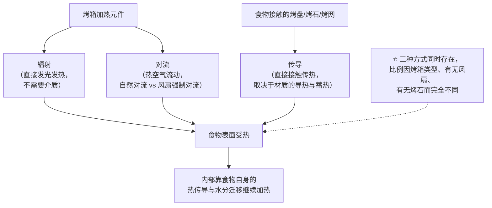
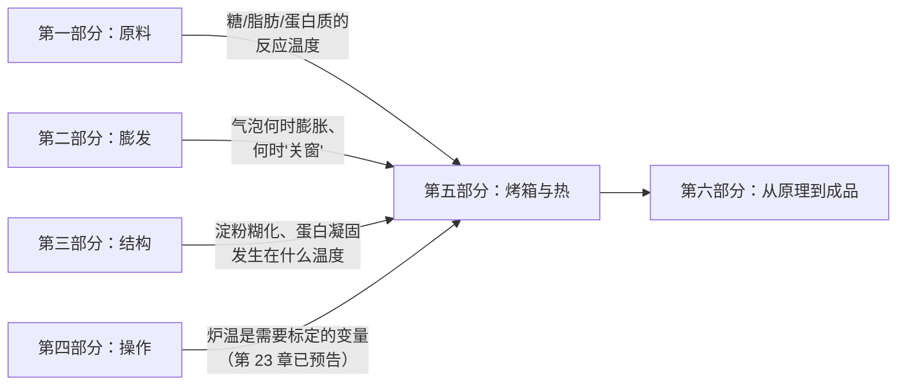

# 第五部分 · 烤箱与热 ★

> **这一部分只回答一个问题**：**烤箱到底是怎么把热量送进你的面团里的？**
>
> 前四部分讲的是**配方与操作**——原料在做什么、怎么发起来、怎么定住、
> 手法改变了什么、称量准不准、配方之外还有哪些变量。
> 但所有这些讨论都有一个共同的隐含前提：**烤箱会把你设定的温度，忠实地给到食物上**。
>
> > ## **这个前提几乎总是错的——家用烤箱几乎一定不准，而且它从来不是只靠一种方式在加热。**

## 为什么"烤箱"值得单独学一遍

前四部分把"进炉之前"的每一个变量都拆开讲了：配方配平、膨发、结构、操作、称量。
但读者迟早会撞上这个现象：

> **同一份配方，同一个烤箱设定温度，烤出来的东西还是不对——
> 不是因为配方错了，也不是因为操作错了，而是因为"180 °C"这四个字，
> 从来就不是故事的全部。**

这一部分要把"进炉之后到底发生了什么"从**热力学**的角度重新讲一遍：
烤箱**同时**用三种方式把热量送进食物——**辐射、对流、传导**——
它们各自的占比、速度、对颜色与结构的影响完全不同；
**烤箱显示的温度和食物实际感受到的温度之间，隔着一整套不受你控制的物理过程**。

## 这一部分的框架：三种传热方式 + 两个"你能控制的变量"

**五个具体问题**，对应这一部分的五章：

| 章 | 问题 | 一句话预告 |
|----|------|-----------|
| 28 | 烤箱同时用哪几种方式加热，各自占多少？ | 不是非此即彼，是三种方式叠加、比例因炉型而变 |
| 29 | 你设定的温度和炉内实际温度，差多少？ | 把炉温当成**需要自己标定**的变量，而不是一个可信的数字 |
| 30 | 为什么欧包要喷水？蒸汽到底在干什么？ | 表皮晚一点定住，面包才能涨得更大 |
| 31 | 换一个烤盘/烤石，为什么出来的东西不一样？ | 材质决定的不是"好不好"，是"热怎么被送进去的" |
| 32 | 到底怎么判断"烤好了"？ | 时间不可移植，**温度与现象可移植** |
| 33 | 出炉之后发生了什么？ | 出炉不是结束，很多结构是在冷却时才定住的 |

> **学完这一部分能**：把别人配方里的"180 °C / 25 分钟"
> 翻译成**你家这台烤箱**的真实参数——知道它主要靠什么方式加热、
> 实际温度和设定差多少、用什么烤盘/烤石会改变什么、
> 用什么判据（而不是计时器）决定什么时候出炉。

## 这一部分如何呼应前面四部分

第 21 章（烤箱里的时间轴）已经把"进炉后发生了什么"按**时间**讲过一次；
这一部分换一个坐标系——按**传热方式与设备**，回答同一个问题的另一半：
**这些事件为什么发生在这个时刻，而不是另一个时刻**。

## 实战项目预告

这一部分末尾会有全书第三个实战项目 **P3：给你的烤箱做一次标定**——
输出"你这台烤箱的温度偏差 + 热点分布地图"，作为第 29 章的延伸。
两档都会给：**🅐 零成本版**（不开火也能先做的准备工作）与**🅑 开火版**（实际标定测试）。
