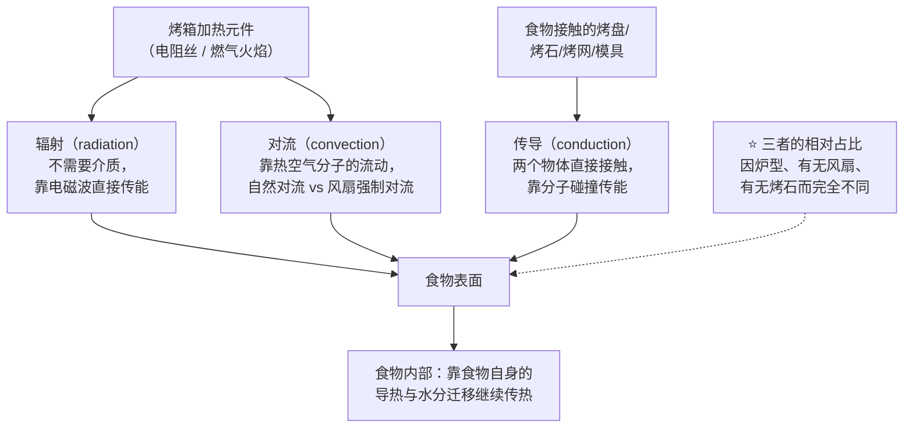
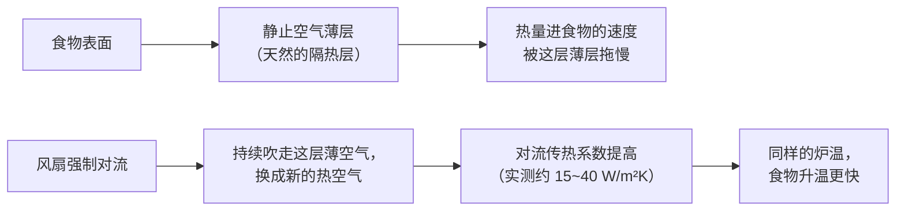

# 第 28 章 炉内传热：辐射、对流、导热与蓄热 ★

> **本章目标**：拆穿一个被忽略的前提——
> **"180 °C"从来不是一种加热方式，它是三种加热方式叠加之后的一个读数**。
>
> 三个具体问题：
>
> 1. 烤箱里**同时**在发生哪几种传热，各自占多少；
> 2. 为什么**同一个设定温度**，有风扇和没风扇烤出来的东西不一样；
> 3. 为什么换一个烤盘/烤石，明明烤箱设定没变，底部表现却完全不同。

## 28.1 三种传热方式，没有一个是"主角"，它们一直叠在一起

物理学把热量传递分成三种机制[^1]，**烤箱里这三种从来不是单独出现的**：

**辐射**：热源直接发出电磁波（红外线为主），**不需要任何介质**，
隔着空气也能把能量直接送到食物表面——这正是你能感觉到烤箱门缝漏出的"烤箱味儿"热浪的机制。
**对流**：靠空气分子的运动把能量从热源带到食物表面，**自然对流**（热空气自己上升）
与**强制对流**（风扇把空气吹动）效率完全不同。
**传导**：两个物体直接接触，靠分子碰撞把能量从高温一侧传到低温一侧——
**烤盘底部、烤石、模具壁**都是通过这条路径加热食物的。

> ## **第一条可迁移判断规则**：
> ## **烤箱从来不是"用一种方式"加热，它永远是三种方式的叠加——
> ## 你要问的不是"它是哪种烤箱"，而是"这台烤箱、这个设置下，三种方式各占多少"。**

## 28.2 实测：三种方式的占比因炉型而剧烈不同

这不是一句空话——已有研究**实测**过不同炉型里三种传热方式各自的占比，
而且**数字差异巨大**：

| 炉型/场景 | 辐射 | 传导 | 对流 | 冷凝 | 来源 |
|----------|------|------|------|------|------|
| 一款商用多层电烤炉（参考设备） | **30%** | **40%** | **15%** | **15%**（水汽冷凝） | 一项用多孔陶瓷燃烧器模型烤炉研究引用的商用电烤炉参考数据 |
| 多孔陶瓷燃烧器模型烤炉（不加水） | **约 45%** | 约 27.5% | 约 27.5% | — | 同一项研究的实测 |
| 面包表面（专门针对"顶部表面"的研究） | **超过 90%** | — | **低于 10%** | — | 一项关于烘烤中热质传递过程辨识的研究 |

⚠️ **这三行数字来自三个不同的实验设置，不能直接横向比较成一张"标准配比表"**——
但它们共同证明了一件事：**辐射在多数家用/商用烤箱里都占相当大的比重**，
**而"顶部表面"这个具体位置，辐射的占比往往比整体平均值更高**
（因为顶部直接"看得见"加热元件与炙热的炉壁，而对流气流经过表面时
已经被食物本身的边界层部分阻隔）。

> **这解释了一个常见现象**：**开风扇对流烤**的成品，**顶部褐变往往比不开风扇时更慢、更浅**——
> 不是风扇"烤得不够热"，而是风扇主要提升的是**对流**这一项，
> 而顶部褐变**原本主要靠辐射**在做，风扇对这一项的贡献有限。

## 28.3 对流：风扇到底在帮什么忙

风扇对流烤箱（convection oven）比自然对流烤箱多做的事，核心是**把食物表面那层"不流动的空气"吹走**。

**机制**：任何静止的热食物表面附近，都会形成一层**几乎不流动的空气薄层**——
这层空气本身导热很差，相当于给食物盖了一层"隐形棉被"，**拖慢了热量传进食物的速度**。
风扇强制对流的作用，就是**持续把这层薄空气吹走、换成新的热空气**，
从而**提高对流传热系数**（单位面积、单位温差下，单位时间能传递多少热量）。

一项直接测量家用与商用烤箱内对流传热系数的研究，用四种独立方法
（瞬态温度反推法、热流传感器法、失重速率法、湿度平衡法）交叉测量：
**多数测得的数值落在 15~40 W/(m²·K) 之间**，**比按层流平板经验公式预测的数值高出约一倍**，
研究者认为**这部分额外的传热来自辐射的贡献被一并计入**；
其中用**失重速率法**（更适合有水分蒸发的食物）在家用烤箱里测得
**22~28 W/(m²·K)**，具体数值**随炉温升高而上升**。

**这就是为什么开风扇对流烤，同样的设定温度会烤得更快、更均匀**——
风扇减少了"薄层隔热"这个损耗项，**让炉内空气更均匀地把热量送到各处**，
而不是只靠离加热元件近的那部分食物优先受热。

> ⚠️ **诚实说明**：这些传热系数的具体数值**随炉型、炉温、风扇转速、
> 食物形状与摆放位置剧烈变化**，**不要把某一个数字当成你家烤箱的真实值**——
> 本章给的是**量级与机制**，不是你能直接套用的参数。

## 28.4 为什么烘焙圈流传"开风扇要把温度调低"

厂商与行业资料给出的经验法则相当一致：
**如果想保持原来的烘烤时间，开风扇对流烤要把设定温度调低约 14~28 °C（25~50 °F）；
如果不调温度，烘烤时间大约可以缩短 20% 左右**。

**这条经验法则在方向上和 28.3 的机制完全吻合**：
风扇让对流传热系数变大，**同样的设定温度，食物实际吸热的速度更快**——
如果不做任何调整，结果就是**提前烤过头、表面提前褐变、内部却可能还没熟透**。

> ⚠️ **本书把这条经验法则归入"行业惯例"而不是"事实"层级**：
> 它在多个独立的厂商与科普来源里高度一致，但**本书未核到专门测量
> "降温多少度 / 缩时多少，成品等效"的同行评议对照实验**——
> 已登记为缺口。**具体该调多少，仍然建议你用自己的烤箱做一次对照来确认**
> （见本章 28.9 的实操任务）。

## 28.5 传导：为什么换一个烤盘/烤石，底部完全不一样

**底部的加热方式和顶部、四周不一样**：顶部与四周主要靠辐射与对流，
**底部几乎完全靠传导**——食物直接接触的那块材料，决定了热量怎么、
以及多快地被送进食物底部。

这里要分清两个经常被混为一谈的材料属性[^1]：

| 属性 | 回答的问题 |
|------|-----------|
| **蓄热能力**（热容，与质量和比热容有关） | 这块材料**能存多少热量**、温度掉下来要多久才能回升 |
| **导热能力**（热导率） | 这块材料**把热量传给食物的速度有多快** |

**一块材料完全可以"蓄热多但导得慢"，也可以"蓄热少但导得快"**——
这正是烤石（陶瓷/石材）与烤钢/铸铁之间的核心区别：

| 材料类型 | 导热能力（量级） | 特点 |
|---------|----------------|------|
| 陶瓷/石材（如 Cordierite 堇青石烤石） | 约 1~3 W/(m·K) | 导热慢，**热量释放得更"柔和"**，不容易烤焦底部，但需要**更高的预热温度**才能补偿导热慢 |
| 铸铁 | 约 50 W/(m·K) 量级 | 比陶瓷导热快一个数量级以上 |
| 普通碳钢/不锈钢 | 约 15~55 W/(m·K)（随钢种差异很大） | 比陶瓷导热明显更快 |
| 纯铝 | 约 200 W/(m·K) 以上 | 导热能力在常见烘焙器具材质里最强 |

> ⚠️ 以上数值引自材料工程参考数据的汇编，**具体合金/配方不同，数字会有明显差异**，
> 本章只用它们说明**量级差异可以有一到两个数量级**，不作为你手上那块具体器具的精确参数。

**后果是**：同样预热到位，**铸铁/钢制烤盘会比陶瓷烤石更快地把热量灌进面团底部**——
这既能带来更强的"初始冲击"（第 21 章的炉内膨胀会更早、更猛），
**也更容易在长时间烘烤（如高含水量欧包、含糖面团）时把底部烤过头**。
行业实践（厂商说明与专业烘焙资料）给出的经验是：**陶瓷烤石通常建议预热 30~60 分钟以上
才能把"蓄的热"charge 到位**；换成导热更快的钢/铸铁材质，**在较低的炉温下也能达到
接近陶瓷烤石在更高炉温下的效果**。

> ⚠️ **本书未核到**直接比较"同一配方、同一炉温，换烤盘材质"对成品底部的对照实验数据
> （已核到的是材料本身的物性数据与行业经验描述），**本书把这一节的因果链条
> 标注为"机制推理 + 行业惯例"**，不作为"事实"层级的定量结论。

## 28.6 辐射还决定着：烤箱"看不看得见"你的食物

辐射有一个传导、对流都不具备的特点：**它不需要空气作为介质，而且方向性很强**。
这正是**明火炙烤（broiler）**的工作原理——炙烤**几乎全靠辐射**，
热源直接"照"在食物表面，**食物朝向热源的一面升温最快、褐变最快**，
背面几乎不受影响——这也是为什么**炙烤的食物经常需要中途翻面**，
而普通烘烤（主要靠对流 + 辐射叠加）很少需要。

> **一句话**：炙烤不是"更猛的烘烤"，它是**把对流那一部分基本拿掉，只剩定向辐射**——
> 这正是为什么它升温快、但**褐变不均匀、而且很容易在还没熟透时就把表面烤焦**。

## 28.7 常见说法辨析

按本书约定标注**证据强度**：✅ 有共识 / ⚠️ 有争议 / ❌ 明确错误 / 缺乏证据。

| 说法 | 判定 | 说明 |
|------|------|------|
| "**烤箱就是靠热空气把食物烤熟的**" | ❌ **明确错误** | 已核到的研究显示：**面包顶部表面受热超过 90% 来自辐射，低于 10% 来自对流**；一项实测商用电烤炉的参考数据中传导占比高达 40%。对流只是三种方式之一，很多情况下还不是占比最大的那个 |
| "**开风扇对流烤，温度不用调，只是更快而已**" | ⚠️ **方向对了一半** | 开风扇确实让对流传热系数显著提高（实测约 15~40 W/m²K），但**不只是"更快"**——它同时改变了表面与内部升温的相对速度；行业经验普遍建议**降温或缩时**，否则容易外熟内生或表面提前褐变 |
| "**烤石/烤钢越厚越好，蓄的热越多越好**" | ⚠️ **蓄热不等于导热，两者要分开看** | 更厚确实蓄热更多，但**决定热量传进面团有多快的是导热能力，不是蓄热量**；陶瓷烤石导热慢，即使很厚，把热"灌"进面团底部的速度依然远不如一块较薄的钢板 |
| "**用了烤石/烤钢，温度和时间可以完全照搬普通烤盘的配方**" | ❌ **明确错误** | 传导速度的量级差异（陶瓷约 1~3 W/m·K，钢/铸铁约 15~55 W/m·K 量级）意味着**底部受热速度完全不同**，照搬参数容易导致底部过早焦化或预热不足而偏白 |
| "**炙烤就是'更高温度的烘烤'**" | ❌ **明确错误** | 炙烤的机制是**定向辐射为主、基本没有对流参与**，不是温度数字上的"更高"，而是**传热方式本身换了一种**，所以炙烤食物升温快但容易**受热不均、需要翻面** |
| "**家用烤箱不管什么型号，传热方式的占比都差不多**" | ❌ **明确错误** | 本章 28.2 引用的三组实测数据彼此差异巨大（辐射占比从约 27.5% 到超过 90% 不等），**炉型、设计、位置都会显著改变占比** |

## 28.8 思考题

1. 为什么说"烤箱就是靠热空气加热"这句话是错的？请用"辐射"与"对流"两个概念说明，
   并引用本章提到的一项具体研究数据。
2. 风扇对流烤箱提高传热速度的机制是什么？请用"边界层/静止空气薄层"这个概念解释。
3. "蓄热能力"和"导热能力"有什么区别？为什么一块材料可以"蓄热多但导得慢"？
4. 为什么炙烤（broiler）经常需要中途翻面，而普通烘烤很少需要？
5. **【案例】** 某人用风扇对流模式，完全照搬一份"不开风扇"配方写的温度与时间，
   做出来的饼干**表面明显更深、边缘发焦，但中心偏生**。
   （a）写出完整推理链，说明问题出在哪条机制上；
   （b）给出两个改动方向，分别对应本章的哪条规则；
   （c）说明他该怎么验证自己的改动是否奏效。
6. **【案例】** 某人把原本用普通烤盘烤面包的配方，改用预热好的铸铁烤盘，
   其余参数完全不变，结果**底部明显比以前焦、但顶部状态和以前差不多**。
   （a）用本章的传导/辐射框架解释这个现象；
   （b）给出一个改动方向（不换回普通烤盘的前提下）。
7. **【辨析】** "烤石/烤钢越厚越好"——判断证据强度，
   说明"蓄热"与"导热"分别在这个说法里扮演了什么角色，容易被混淆在哪里。

> 📖 **参考答案**（想清楚再看）：[Q1](../../qa/28-oven-heat-transfer-qa.md#q1) ·
> [Q2](../../qa/28-oven-heat-transfer-qa.md#q2) · [Q3](../../qa/28-oven-heat-transfer-qa.md#q3) ·
> [Q4](../../qa/28-oven-heat-transfer-qa.md#q4) · [Q5](../../qa/28-oven-heat-transfer-qa.md#q5) ·
> [Q6](../../qa/28-oven-heat-transfer-qa.md#q6) · [Q7](../../qa/28-oven-heat-transfer-qa.md#q7)

## 28.9 🔎 下次烤之前的用处

1. **先搞清楚你的烤箱有没有风扇、风扇什么时候介入**——
   这决定了对流在你这台烤箱里占多大比重。
2. **开风扇对流烤时，第一次先降温 15~25 °C 左右试一炉**，
   而不是直接照搬不开风扇的配方参数（本章 28.4）。
3. **换烤盘/烤石材质时，把它当成一次新的标定**，
   而不是"反正都是烤箱，参数照搬就行"。
4. **顶部颜色不够深时，先怀疑辐射够不够（离加热元件的距离、有没有开顶火），
   而不是一味加时间**——加时间加的是对流/传导的累积量，不一定补得上辐射不足。

## 28.10 本章实操

### 🅐 零成本版 · 任务一：给你的烤箱画一张"传热方式地图"

不需要开火，先把你家烤箱的基本配置摸清楚：

| 问题 | 你的答案 |
|------|---------|
| 有没有风扇（对流功能）？ | |
| 加热元件在哪（上/下/四周）？能不能分别控制上下火？ | |
| 有没有专门的炙烤（broil）功能？ | |
| 你平时用的烤盘/烤石/烤网是什么材质？ | |

对照 28.1~28.6，判断：**你这台烤箱的"默认配置"（不开风扇、用普通烤盘）大致偏向
哪种传热组合**，并和开风扇、换烤石的情况做对比预测。

### 🅐 零成本版 · 任务二：读两份配方，找出传热方式的线索

找两份写法不同的配方（一份写"普通烤箱""不开风扇"，一份写"对流烤箱""fan oven"
或建议"用烤石/烤钢"），对比它们在温度、时间上的差异：

| 配方 | 建议炉型/配置 | 温度 | 时间 | 你认为差异来自本章哪条机制 |
|------|--------------|------|------|------------------------|
| A | | | | |
| B | | | | |

### 🅑 开火版 · 任务三：风扇对流对照实验（有烤箱时做）

**唯一变量**：是否开启风扇对流。用同一份面糊/面团分两份，
**只改开不开风扇**，其余（温度设定、时间、摆放位置）完全相同：

| 组 | 风扇 | 表面颜色（深浅） | 中心是否熟透 | 整体均匀度 |
|----|------|----------------|-------------|-----------|
| ① 不开风扇 | 关 | | | |
| ② 开风扇 | 开 | | | |

> **怎么读结果**：如果②组表面明显更深、而中心状态和①组差不多甚至偏生，
> 说明在**不调整温度/时间**的情况下，风扇确实改变了表/内受热的相对速度（28.3、28.4）。
> ⚠️ **局限**：具体差多少取决于你这台烤箱的设计，不要把这一次的结果当成所有烤箱的通用值。

### 🅑 开火版 · 任务四（加分）：烤盘材质对照

**唯一变量**：烤盘/烤石材质（如普通烤盘 vs 预热好的铸铁/烤钢，或烤盘 vs 烤石）。
用同一份配方（如披萨饼底或饼干）做两次，其余完全相同：

| 组 | 材质 | 预热时长 | 底部颜色/脆度 | 顶部状态 |
|----|------|---------|-------------|---------|
| ① | | | | |
| ② | | | | |

请把结果记进[烘焙记录与复盘表](../../forms/bake-log.md)。

## 28.11 本章依据

本章引用的来源与核对状态详见[参考书目与出处登记](../../standards.md)，具体对应如下：

| 本章用到的内容 | 依据 |
|--------------|------|
| 面包**顶部表面**受热：**辐射占比超过 90%，对流低于 10%** | 一项关于面包烘烤中热质传递过程辨识的研究（*Thermal Science* 2005），✅ 摘要/转引层面（经多篇后续文献引用确认其结论表述一致）。**本章 28.2 的核心依据之一**；⚠️ **单一研究、特定炉型，不作为"所有烤箱顶部占比"的通用值** |
| 一款商用多层电烤炉参考数据：**辐射 30%、传导 40%、对流 15%、冷凝 15%**；多孔陶瓷燃烧器模型烤炉（不加水）实测：**辐射约 45%、传导与对流各约 27.5%** | *Frontiers in Chemistry* 2020 一项关于多孔陶瓷燃烧器模型烤炉中各传热机制作用的研究（doi:10.3389/fchem.2020.511012），✅ 已核到开放获取全文。**本章 28.2 的核心依据，用以说明"占比因炉型剧烈不同"** |
| 家用与商用对流烤箱内表面传热系数：四种方法交叉测量，**多数落在 15~40 W/(m²·K)**，比层流平板经验公式预测值高约一倍（部分归因于辐射）；**失重速率法在家用烤箱测得 22~28 W/(m²·K)**，随炉温上升 | *Journal of Food Engineering* 2006，72(3):293-301（doi:10.1016/j.jfoodeng.2004.12.010），✅ 摘要层面。**本章 28.3 的核心依据** |
| 开风扇对流烤的经验调整：**保持时间不变时降温约 14~28 °C（25~50 °F）；不调温度时缩短烘烤时间约 20%** | 多个独立的烘焙行业与厂商资料（综合整理），⚠️ **按"行业惯例"层级处理**：多个独立来源方向一致，但未核到专门测量"降温/缩时后成品等效"的同行评议对照实验，已登记为缺口 |
| 常见烘焙器具材质导热能力量级：**堇青石类陶瓷/石材约 1~3 W/(m·K)，铸铁约 50 W/(m·K) 量级，碳钢/不锈钢约 15~55 W/(m·K)（随钢种差异大），纯铝约 200 W/(m·K) 以上** | 材料工程参考数据汇编（EngineeringToolbox、EngineersEdge 等工程数据库），✅ 已核到多份工程参考页面；⚠️ **具体合金/配方会有明显差异，仅用于说明数量级差异** |
| 陶瓷烤石与钢制烤盘的蓄热/导热差异、预热时长的行业实践（陶瓷烤石通常建议预热更久） | King Arthur Baking 等厂商/行业说明页面，✅ 已核到页面。⚠️ **厂商内容，按查证纪律视为"惯例"，不单独作数字依据**；**具体对照实验数据本书未核到，已登记为缺口** |
| 炙烤（broiler）的机制：**辐射为主、基本不含对流**，方向性强、容易受热不均 | 烘焙与烹饪科学综合资料对炙烤与烘烤机制差异的描述，✅ 方向性结论与辐射传热的基本物理原理一致；本书**不引用**任何未经核实的具体波长效率百分比数字 |

[^1]: 本章新出现的术语：[辐射传热](../../glossary.md#radiative-heat-transfer)（radiative heat transfer）、
[对流传热系数](../../glossary.md#convective-heat-transfer-coefficient)（convective heat transfer coefficient）、
[蓄热能力与导热能力](../../glossary.md#thermal-mass-vs-conductivity)（thermal mass vs. thermal conductivity）。
