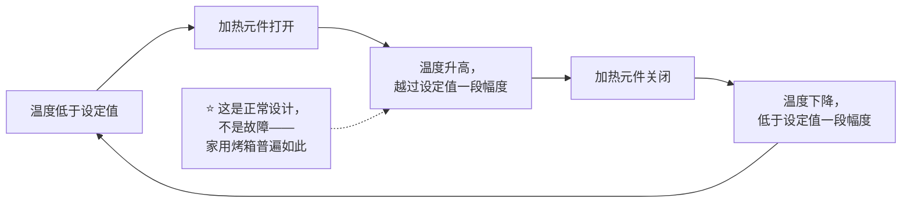
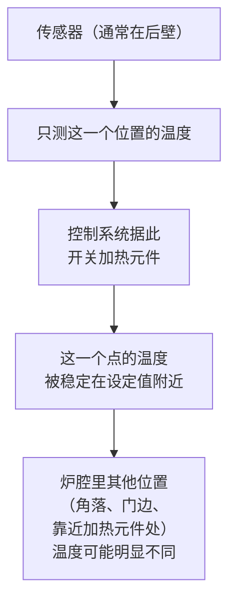

# 第 29 章 预热、炉温与实际温度：你的烤箱几乎一定不准 ★

> **本章目标**：把"180 °C"这四个字彻底拆开，回答三个问题：
>
> 1. 你设定的温度，和炉子里真正的温度，**差多少**；
> 2. 面板上那声"预热完成"的提示音，**到底代表了什么**；
> 3. **怎么用最低成本的工具**，把"我的烤箱大概是什么脾气"这件事测出来。
>
> > ## **炉温不是配方里一个可以照抄的数字，它是你家这台烤箱的一个需要自己标定的变量——
> > ## 这正是第 23 章就已经预告过的那条结论。**

## 29.1 "180 °C"从来不是一个点，它是一条上下摆动的曲线

家用烤箱的温控方式，绝大多数是**开关式控温**：温度低于设定值时加热元件打开，
高于设定值时关闭，**本身就会在设定值上下来回摆动**，而不是稳稳停在一个数字上[^1]。

America's Test Kitchen 对家用烤箱温度计的测评明确写道：
**"一台校准良好的烤箱，炉内温度可以在设定值上下摆动多达约 25 °F（约 14 °C）"**，
而这**仍然被该机构认为是正常、可接受的范围**——这与另一独立来源的说法方向一致：
NSF International（美国一家独立的食品设备认证机构）的标准同样认可
**炉温在目标值约 ±25 °F（约 ±14 °C）范围内波动仍属正常**。

> ## **第一条可迁移判断规则**：
> ## **"炉温不稳定"这件事本身不是你的烤箱坏了，而是绝大多数家用烤箱的正常工作方式——
> ## 你要问的不是"它准不准"，而是"它在我的设定值附近，摆动的中心点和幅度各是多少"。**

## 29.2 设定值与真实均值：两件不同的事

29.1 讲的是**同一台烤箱内部的正常波动**；但还有一件更根本的事——
**这台烤箱长期摆动的那个"中心点"，本身可能就和你设定的数字不一致**。

America's Test Kitchen 对多款家用数字厨房秤与烤箱配件的测评中提到，
**不少消费者测评与维修资料反复确认同一个现象**：实际测得的平均炉温
**可能比设定值高出或低出 25~50 °F（约 14~28 °C）**，具体方向和幅度
**因品牌、型号、新旧程度而不同**，没有一个"所有烤箱都偏低"或"都偏高"的通用规律。

> ⚠️ **诚实说明**：这个"25~50 °F"的区间在多篇独立的消费类测评与家电维修资料里
> 反复出现、方向一致，但**本书未能核到一项公开、可查方法与样本量的同行评议或
> 权威测评报告，专门报告"多少台烤箱、各偏差多少"的完整原始数据**——
> 已登记为缺口。**本书按"存在这个量级的普遍偏差"这一方向性结论处理**，
> **不把具体的某个百分比或某一项"偏差统计"当作精确数字来引用**。

**这条规则的实际意义是**：你没法靠"换一个更贵的烤箱""看品牌口碑"
来确定自己这台烤箱准不准——**唯一可靠的办法是自己测**（见 29.5）。

## 29.3 传感器只测一个点，不代表整个炉腔

家用烤箱的温控传感器几乎都**只装在一个固定位置**（常见于炉腔后壁靠上方），
它是一种随温度改变电阻的热敏元件，**控制系统只根据这一个点的读数决定开关加热元件**。

**这解释了一个很常见的现象**：同一炉东西，**靠后的比靠前的先上色，
靠边的和中间的不一样**——不是你的操作有问题，是**传感器只对它自己所在的那个点"负责"**，
炉腔里其他位置的温度本来就可能和它不一致。第 21 章已经讲过
"表皮形成会反过来改变内部组织"，这一章要补的是：**表皮形成的时机，
在炉腔的不同位置本来就不一样**。

> ⚠️ **本书未核到**一项标准化测量"家用烤箱内部各位置温差"的同行评议研究，
> 这一节的描述基于传感器工作原理与多篇独立维修/测评资料对"单点传感"的一致描述，
> **按"机制推理 + 行业共识描述"处理**，不作为可引用的定量结论。

## 29.4 预热提示音：它测的不是你以为的那件事

很多烤箱的"预热完成"提示（无论是指示灯还是提示音）**不一定等于炉内已经
全面达到设定温度**。厂商自己的技术支持资料明确区分了两种情形：

| 提示类型 | 大致所需时间 | 它代表什么 |
|---------|------------|-----------|
| **达到设定温度后提示**（部分型号的指示灯/提示音） | 约 10~20 分钟（视型号而定） | 传感器所在位置的**空气**温度已达到设定值 |
| **"热到可以放食物"提示**（部分型号的更早提示） | 约 7~12 分钟 | 厂商自己明确说明："**此时尚未达到设定温度**，但已经热到可以放入大多数需要预热的食物" |

> **一句话**：**不是所有的"叮"都代表同一件事**——有的型号提示的是"到温度了"，
> 有的提示的是"差不多能用了"，**两者是完全不同的判据，而包装/说明书上未必写清楚**。

更深一层的问题是：**就算提示的确实是"空气已到设定温度"，
炉壁、烤网、烤石/烤盘这些"热质量"（第 28 章讲过的蓄热能力）
还需要更长时间才能吸够热量、达到稳定状态**——
**空气升温快，固体材料升温慢**，这正是第 28 章"蓄热能力"这个概念在这里的直接应用。

America's Test Kitchen 用一次直接的对照实验验证了这件事的后果：
他们分别在**完全预热好**的烤箱与**只预热到目标温度一半**的烤箱里烤蛋糕层与巧克力曲奇。
结果因烤箱的预热方式（只用下火元件预热，还是上下火元件同时参与预热）而不同：
**只用下火元件预热的烤箱**，成品"勉强可以接受"——
曲奇**因为面团该定型的时候炉温还不够而摊得过大**；
**上下火元件同时参与预热的烤箱**，问题更明显——
**直接暴露在上方加热元件下的曲奇与蛋糕，还没等中心烤熟表面就已经烤焦**。

> ⚠️ **诚实说明**：这项对照实验**没有公开具体的烤箱数量、设定温度与计时数据**，
> 本书只引用其**方向性结论**（半预热会导致可预测的失败模式，且失败的具体样子
> 取决于预热时上下火元件的参与方式），**不把它当作带精确数字的定量研究**。

> ## **第二条可迁移判断规则**：
> ## **提示音/指示灯只能帮你判断"大概到了"，真正决定能不能进炉的，
> ## 是你自己用独立温度计确认过的读数——而且确认之后，
> ## 最好再多等几分钟，让炉壁和烤盘把热"吃"进去。**

## 29.5 怎么用最低成本的方式标定你的烤箱

**第一步：先确认温度计本身准不准。**
最经典、不需要额外工具的方法是**水的相变点**——
这正好和第 27 章讲过的"大气压决定水的沸点"接上：
**在海平面，沸水应该读数约 100 °C（212 °F）；冰水混合物应该读数约 0 °C（32 °F）**。
⚠️ 如果你所在地**海拔明显不是海平面**，沸点会按第 27 章给出的
"每升高约 500 ft、沸点降约 1 °F"的方向往下走，测试时要把这一点考虑进去，
不要直接套用海平面的 100 °C 作为唯一基准。

**第二步：把温度计放进炉腔里实测，而不是只看面板显示。**
综合多份独立的消费者测评与维修资料给出的流程，大致是：

1. 把一支**独立的炉用温度计**（不是贴在烤箱外面的，而是能放进炉腔内部的那种）
   放在**中层/中间位置**；
2. 设定到你常用的一个温度（比如 175 °C/350 °F），**启动预热**；
3. **不要信任提示音**——预热完成提示响起后，**再多等 10~15 分钟**，
   让炉壁与烤盘（蓄热体）跟上空气的温度；
4. 之后**每隔一段时间（如 5~10 分钟）记一次读数，连续记 4~5 次**，
   取这些读数的**平均值**，而不是只看某一瞬间的数字——
   因为 29.1 已经讲过，炉温本身就在设定值附近摆动，**单次读数只是摆动曲线上的一个点**。

**第三步：测几个不同位置，找出"热点"与"冷点"。**
把温度计换到**不同位置**（前/后、左/右、靠近加热元件/远离），
重复同样的预热与等待流程，**对比不同位置读数之间的差异**——
这正是第 29.3 节"传感器只测一个点"这件事的实测版本。

> **这件事和第 27 章讲的海拔换算是一回事的两个方向**：
> 27 章告诉你"大气压改变了水的沸点"，这一章告诉你
> "正是因为这个关系足够稳定，你才能反过来**用水的相变点校准你的温度计**"。

## 29.6 把"标定结果"用起来：从数字到操作

标定出来的结果，最终要变成两件可操作的事：

1. **偏移量**：如果你的烤箱实测均值和设定值差了一个相对稳定的量
   （比如长期偏低 10~15 °C），**以后设定时主动加上这个偏移量**，
   而不是每次都去猜。
2. **位置图**：如果某个位置明显偏热或偏冷，**该区域优先放不怕过火/不怕偏生的东西**，
   或者**在烘烤中途按需要转动烤盘**（这正是第 21、25 章反复出现的
   "表皮定型时机决定最终形态"在操作上的落地）。

> ⚠️ **本书不给"所有烤箱大概偏差多少度"这类通用数字**——
> 29.2 已经说明这个偏差**方向和幅度因烤箱而异**，**标定结果只对你这台烤箱有效**，
> 换一台烤箱（甚至同一台烤箱用了几年之后）都需要重新测。

## 29.7 常见说法辨析

按本书约定标注**证据强度**：✅ 有共识 / ⚠️ 有争议 / ❌ 明确错误 / 缺乏证据。

| 说法 | 判定 | 说明 |
|------|------|------|
| "**烤箱面板显示多少度，炉子里就是多少度**" | ❌ **明确错误** | 开关式温控本身就会让炉温在设定值附近**正常波动约 ±25 °F（约 14 °C）**（ATK、NSF 两个独立来源方向一致）；而且炉子长期的"中心点"也可能系统性偏离设定值 |
| "**预热提示音响了，就可以放进去烤了**" | ⚠️ **取决于提示音代表什么** | 厂商资料明确区分"真正到温度"与"热到可以放食物"两种提示，**后者本身就没有达到设定温度**；即使到了设定温度，炉壁与烤盘这类蓄热体往往还需要更久才能跟上（29.4） |
| "**我的烤箱是名牌，肯定比便宜烤箱准**" | ⚠️ **缺乏证据支持这种推断** | 多项消费者测评与维修资料描述的偏差**因品牌、型号、使用年限而异**，没有发现"贵的/名牌的就一定更准"的一致规律；**本书不给品牌层面的建议** |
| "**只要烤箱不报错，它的温控就是准的**" | ❌ **明确错误** | "正常工作"（不报故障）和"温度准确"是两回事：开关式温控本身的摆动、传感器单点测量的局限，都不会触发任何故障提示 |
| "**用烤箱温度计测一次就能知道这台烤箱准不准**" | ⚠️ **单次读数信息量有限** | 因为炉温本身在摆动（29.1），**单次读数只是摆动曲线上随机的一个点**；需要连续多次读数取平均，才能大致判断这台烤箱的"摆动中心" |
| "**烤箱内部各个位置温度都差不多，所以转不转盘子无所谓**" | ❌ **明确错误** | 温控传感器只测一个固定点，**炉腔内其他位置（角落、门边、靠近加热元件处）温度可能明显不同**（29.3），这正是"烤到一半要转一下烤盘"这类做法背后的机制 |

## 29.8 思考题

1. 为什么说"炉温不稳定"本身不代表烤箱坏了？请用"开关式温控"这个机制解释。
2. 请区分"单台烤箱内部正常摆动"与"这台烤箱长期的中心点偏离设定值"这两件事，
   并说明为什么标定时要分别考虑它们。
3. 预热提示音为什么不能直接当作"可以进炉"的唯一依据？请结合"传感器只测空气"
   与"蓄热体升温慢"两个机制说明。
4. 为什么同一个烤箱，炉腔不同位置的温度可能不一样？这和传感器的工作方式有什么关系？
5. **【案例】** 某人新买了一台烤箱，完全照搬以前那台烤箱用惯的配方温度与时间，
   做出来的戚风蛋糕**表面颜色正常，但中心明显偏生、回缩严重**。
   （a）写出可能的推理链，列出至少两个嫌疑（提示：新烤箱的"中心点"可能和旧烤箱不同，
   预热习惯也可能没跟上）；
   （b）给出一个标定步骤，帮他判断到底是哪个嫌疑在起作用；
   （c）标定后，他应该怎么调整配方里的"180 °C"这个数字？
6. **【案例】** 某人做饼干时发现，同一盘饼干，**靠后排的比靠前排的颜色深很多**，
   其余操作完全一样。（a）用本章的哪个机制解释这个现象；
   （b）给出一个不改配方、只改操作的解决方法；（c）说明怎么验证这个方法有效。
7. **【辨析】** "我的烤箱是名牌，肯定比便宜烤箱准"——判断证据强度，
   并说明本书为什么不在品牌层面给出任何推荐或排名。

> 📖 **参考答案**（想清楚再看）：[Q1](../../qa/29-preheat-and-real-temperature-qa.md#q1) ·
> [Q2](../../qa/29-preheat-and-real-temperature-qa.md#q2) · [Q3](../../qa/29-preheat-and-real-temperature-qa.md#q3) ·
> [Q4](../../qa/29-preheat-and-real-temperature-qa.md#q4) · [Q5](../../qa/29-preheat-and-real-temperature-qa.md#q5) ·
> [Q6](../../qa/29-preheat-and-real-temperature-qa.md#q6) · [Q7](../../qa/29-preheat-and-real-temperature-qa.md#q7)

## 29.9 🔎 下次烤之前的用处

1. **买一支能放进炉腔内部的独立温度计**（几十元的入门款就够用）——
   这是本书在这一章能给出的最具体的一条建议，比任何"调炉温多少度"的经验数字都可靠。
2. **预热提示响起后，习惯性地再等 10~15 分钟**，而不是立刻开门放东西进去。
3. **把你这台烤箱的标定结果写进记录表**：均值偏差多少、哪个位置偏热、哪个位置偏冷，
   下次直接按这张"地图"决定放哪一层、要不要中途转盘。
4. **换了新烤箱，第一件事是重新标定**，不要直接照搬旧烤箱用惯的参数。

## 29.10 本章实操

### 🅐 零成本版 · 任务一：校准你的温度计

不开火也能先做这一步：用**沸水**与**冰水混合物**测试你那支（打算买的）温度计：

| 测试 | 理论读数（海平面） | 你所在地的理论读数（如非海平面，按第 27 章的沸点—海拔关系调整） | 实测读数 | 偏差 |
|------|-------------------|------------------------------------------------------|---------|------|
| 沸水 | 约 100 °C / 212 °F | | | |
| 冰水混合物 | 约 0 °C / 32 °F | | | |

> 如果偏差明显（超过几度），**记下这个偏差值**，以后读数时心里有数，或考虑换一支。

### 🅐 零成本版 · 任务二：画出你家烤箱的"已知信息地图"

在正式标定之前，先把能观察到的信息记下来：

| 问题 | 你的答案 |
|------|---------|
| 有没有预热提示（灯/声音）？是哪一种（到温度/热到能用）？ | |
| 说明书有没有写预热大致要多久？ | |
| 平时烤东西，有没有观察到某个位置总是更快上色？ | |

### 🅑 开火版 · 任务三：给你的烤箱做一次标定（有烤箱时做）

**用独立温度计，设定到一个常用温度（如 175 °C/350 °F）**：

| 轮次 | 时间点（预热提示后第几分钟） | 中层中间读数 °C | 备注 |
|------|--------------------------|----------------|------|
| ① | 提示响起时 | | |
| ② | +5 分钟 | | |
| ③ | +10 分钟 | | |
| ④ | +15 分钟 | | |
| ⑤ | +20 分钟 | | |

计算④⑤两轮（或你认为已经稳定的几轮）的**平均值**，与设定值对比：

| 设定温度 | 实测平均值 | 偏差（实测 − 设定） |
|---------|-----------|------------------|
| °C | °C | °C |

### 🅑 开火版 · 任务四（加分）：找热点与冷点

**唯一变量**：温度计摆放位置。在同一次预热稳定后，依次把温度计移到
**前/中/后、左/中/右**几个位置，分别记录读数（或用多支温度计同时测）：

| 位置 | 读数 °C | 与中层中间的差 |
|------|--------|-------------|
| 后左 | | |
| 后中 | | |
| 后右 | | |
| 前左 | | |
| 前中 | | |
| 前右 | | |

> **怎么用这张地图**：偏热的位置适合放不怕上色过深的东西，
> 偏冷的位置适合放需要更长时间定型的东西；如果差异很大，
> **烘烤中途转动烤盘**是一个直接的应对方法。

请把标定结果记进[烘焙记录与复盘表](../../forms/bake-log.md)，
作为你之后每一次"炉温设定"的参考基准——**这张表比任何书上的温度数字都更值钱**。

## 29.11 本章依据

本章引用的来源与核对状态详见[参考书目与出处登记](../../standards.md)，具体对应如下：

| 本章用到的内容 | 依据 |
|--------------|------|
| "校准良好的烤箱，炉内温度可以在设定值上下摆动多达约 25 °F（约 14 °C）"；家用电子厨房秤与烤箱温度计测评方法学（标定砝码/独立温度计对照） | America's Test Kitchen 关于家用烤箱温度计的测评页面，✅ 已核到官方页面全文。**本章 29.1 的核心依据** |
| NSF International 标准认可**炉温在目标值约 ±25 °F（约 ±14 °C）范围内波动属于正常** | 综合多篇引用 NSF 标准方向的消费类测评资料（如 America's Test Kitchen 对该机构标准的转述），✅ 与上一条构成两个独立来源，方向一致。⚠️ 本书未直接核到 NSF 标准原文的具体条款编号 |
| 家用烤箱实测均值可能比设定值**高出或低出约 25~50 °F（约 14~28 °C）**，方向与幅度因品牌/型号/新旧程度而异 | 多篇独立的消费者测评与家电维修资料方向一致的综合描述，⚠️ **按"方向性结论"处理**：未核到一项公开、可查方法学与样本量的权威测评完整数据，已登记为缺口 |
| 家用烤箱温控传感器通常为单点热敏电阻、多装在炉腔后壁；单点传感不能代表整个炉腔的温度分布 | 多篇独立的家电维修与零部件供应资料对传感器工作原理的一致描述，✅ 机制层面有广泛的行业资料支持。⚠️ **未核到**专门测量"炉腔内部温差"的同行评议研究，按"机制推理 + 行业共识描述"处理，已登记为缺口 |
| 预热提示音的两种类型：**"到设定温度"提示（约 10~20 分钟）与"热到可以放食物"提示（约 7~12 分钟，明确不等于已到设定温度）** | 某主流厨电品牌官方技术支持页面对预热提示机制的说明，✅ 已核到官方页面 |
| 半预热烤箱做蛋糕层与巧克力曲奇的对照实验：**只用下火预热的烤箱成品勉强可接受（曲奇摊得过大）；上下火同时预热的烤箱问题更明显（直接暴露在上方元件下的食物表面烤焦而中心未熟）** | America's Test Kitchen 关于"为什么要完全预热"的测评文章，✅ 已核到官方页面。⚠️ **未公开具体烤箱数量与计时数据，本书只引用方向性结论** |
| 水的相变点随大气压（海拔）变化，可用于校准温度计 | 复用第 27 章已登记的两份美国大学农业推广服务出版物（海拔—大气压—沸点对应表），✅ 已核到官方页面全文 |
| **公开、可查方法与样本量的权威机构关于"多少台家用烤箱、各偏差多少度"的完整原始测评数据** | ⚠️ **未核到**：已核到的是方向一致的多篇消费类测评与维修资料，缺少统一、可复核的原始数据集，已登记为缺口 |
| **标准化测量家用烤箱炉腔内部温度分布（热点/冷点）的同行评议研究** | ⚠️ **未核到**：本章对"传感器只测一个点"的描述基于工作原理与行业共识，不是直接测量多台烤箱温度场的实验，已登记为缺口 |

[^1]: 本章新出现的术语：[开关式温控](../../glossary.md#on-off-thermostat-control)（on-off thermostat control）、
[预热稳定时间](../../glossary.md#preheat-stabilization-time)（preheat stabilization time）。
第 21 章的[表皮形成](../../glossary.md#crust-formation)、
第 27 章讲过的海拔与水沸点的关系、
第 28 章的[蓄热能力与导热能力](../../glossary.md#thermal-mass-vs-conductivity)在本章继续使用。
