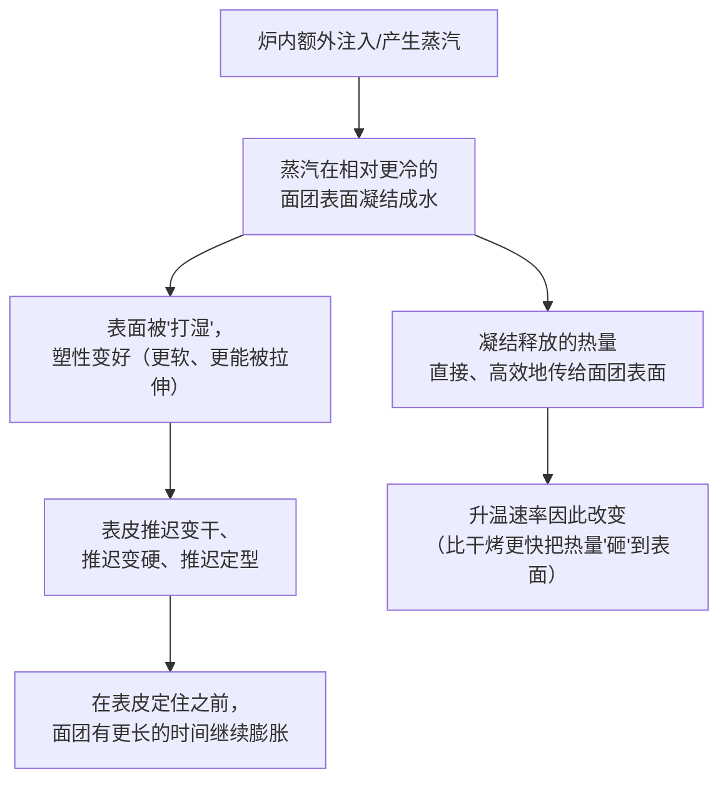

# 第 30 章 蒸汽的作用：为什么欧包要喷水

> **本章目标**：把"烤欧包要喷水/加蒸汽"这件事从一句口诀，
> 还原成一条**可以量化的因果链**——蒸汽量从少到多，
> 面包的表皮、体积、组织分别会怎么变，哪一段是"越多越好"，哪一段不是。
>
> 三个具体问题：
>
> 1. 蒸汽到底**推迟**了什么、**没有推迟**什么；
> 2. 家用烤箱常见的几种"土法加蒸汽"，效果差在哪；
> 3. 为什么蒸汽**不是加得越多越好**——这一章会给出一条反直觉的曲线。

## 30.1 先回到第 15 章：蒸汽是"热的搬运工"，也是"时间的买家"

第 15 章已经讲过蒸汽膨发的物理基础[^1]：水变成蒸汽时体积会放大一千多倍，
但这个过程**要花掉汽化焓这笔巨大的能量**（按 NIST 的水饱和性质数据，
接近 100 °C 时约 2250~2280 kJ/kg，是把同样的水从 20 °C 烧开所需能量的六七倍）。
这一章要在这个基础上回答一个更具体的问题：**炉子里额外加的那一份蒸汽，
到底在帮面团做什么？**

机制可以拆成两步：

> ## **第一条可迁移判断规则**：
> ## **蒸汽买的不是"更多的气"，而是"更长的膨胀窗口"——
> ## 它让表皮晚一点定型，给内部争取到更多时间把体积撑起来。**

## 30.2 实测：蒸汽量从少到多，面包发生了什么

两项关联的同行评议研究（同一研究团队）用一台**内表面积约 1 m² 的层式烤炉**，
在 **200 °C、烘烤 20 分钟**的条件下，把注入蒸汽量设为 **100 / 200 / 300 / 400 / 500 mL**
五档，系统测量了面包的多项指标。

**先看体积与"皮肉比"（crust/crumb ratio）**：

| 蒸汽量 | 面包体积 | 皮肉比 | 表皮状态 |
|--------|---------|-------|---------|
| **低（100、200 mL）** | **较大** | **较高** | **开裂、不美观**（表皮撕裂） |
| 中等 | 相对较小 | 相对较低 | 正常 |
| **高（400、500 mL）** | **较大** | 较高 | **光泽度很高**，但光泽本身不代表更好 |

> **这是一条 U 形曲线，不是一条单调曲线**：
> **体积在"蒸汽很少"和"蒸汽很多"这两端都偏大，中间反而偏小**；
> **但低蒸汽那一端的"大"是以表皮撕裂为代价换来的，研究者判定这种外观不可接受**。

**机制解释**（研究者给出的方向）：

- **蒸汽太少**：表面水分蒸发太快，**过早形成一层又干又脆的壳**——
  这层壳本身没有弹性，撑不住内部继续膨胀的压力，于是**在最薄弱的地方裂开**，
  体积数字看起来不小，但代价是外观开裂；
- **蒸汽适中到偏多**：表面保持湿润、有塑性的时间更长，
  **升温速率本身也因为蒸汽凝结释放的热量而改变**——
  研究发现**蒸汽越多，内部压力越大、升温反而越慢**（热量被更多地用来"喂"表面凝结与后续的持续蒸发），
  这是一组互相牵制的变量，不是"蒸汽越多、烤得越快"那么简单。

再看**表皮的具体性质**（另一项配套研究，专门测蒸汽量对表皮特征与水分扩散的影响，
同样用 100 / 200 / 400 mL 三档）：

| 蒸汽量增加 → | 效果方向 |
|-------------|---------|
| 表皮**颜色** | **变浅**（颜色读数下降） |
| 表皮**光泽度** | **升高** |
| 表皮**破坏力/硬脆度**（failure force / firmness） | **下降**（更不脆、更"软"） |
| 表皮**水蒸气透过率与渗透性** | **显著下降**（表皮变得更不透水汽） |

> ⚠️ **这组数据来自特定的实验室烤炉与特定的面团配方，不是家用烤箱的直接对照**，
> 但它清楚地证明了一件事：**"蒸汽多少"是一个连续的量，而不是"有/没有"的开关**，
> 它在体积、皮肉比、颜色、脆度、透水性五个维度上**同时**起作用，
> 而且这五个维度**不会都在同一个蒸汽量上达到"最优"**——
> 这正是为什么"到底要不要加蒸汽"这个问题，正确答案从来不是"是"或"否"，
> 而是"加多少、加多久"。

## 30.3 蒸汽改的主要不是颜色，是别的

第 21 章已经引用过一项关键研究，这里要把它放回蒸汽这一章里重新强调：
一项直接法面团的对照实验，在 **185 / 195 / 205 °C** 下烤 **25 / 30 / 35 分钟**，
比较有无加湿烘烤：

> **加湿对表皮颜色没有显著影响（P > 0.05）**，
> 但**显著减小表皮厚度（P < 0.001）**、**提高面包芯的初始含水量**；
> 更高的初始含水量带来更高的最终含水量，从而**减慢 96 小时储存中的变硬**，
> 在较低烘烤温度与较短时间下尤其明显。

**把 30.2 和这一条放在一起看，会得到一个比"蒸汽让面包更好看"更准确的结论**：

> ## **第二条可迁移判断规则**：
> ## **蒸汽真正改变的核心是"表皮多厚、多脆、多透水"，以及"面包心留住了多少水"——
> ## 颜色与光泽是这些变化的副产品，不是蒸汽起作用的主战场。**

这也呼应了第 25 章讲过的内容：**割口是"指定破口的位置"，不是"让面包涨得更大"**；
这一章可以补一句：**蒸汽是"给破口的位置多争取一点时间"**——
表皮越晚变脆变硬，割口处的面团就有越多的时间被顶开，
而不是整张表皮一起过早定型、哪儿薄就从哪儿裂（这正是 30.2 里"低蒸汽→开裂"的机制）。

## 30.4 家用烤箱的土法加蒸汽：差别有多大

家用烤箱**绝大多数没有专业烤炉那种精确计量的蒸汽注入系统**，
常见的替代做法包括：喷水壶直接喷洒面团、往预热好的金属盘里倒开水、
把石块（如熔岩石）预热后浇水、用加盖容器（如荷兰锅/铸铁锅）整个扣住面团。

**这几种做法之间的效果差异，厂商（King Arthur）自己做过一次直接的side-by-side比较测试**：

| 做法 | 厂商测试中的表现 |
|------|----------------|
| **喷水壶喷洒** | 测试中发现**对最终面包影响很小**——喷水提供的水汽量有限，效果接近"聊胜于无" |
| **预热金属盘倒开水** | 能较快产生一批蒸汽，但**水汽持续时间有限**，面团很快就暴露在偏干的炉内环境里 |
| **加盖容器（荷兰锅/铸铁锅）** | 测试中被认为**效果最明显**：面团自身释放的水分被就近困在锅内的小空间里，**表皮保持湿润、有塑性的时间最长**，上色与开裂（"笑口"）的效果也最理想 |

> ⚠️ **诚实说明**：这是**厂商自己做的产品测试内容**，按本书 1.1 节的查证纪律，
> **一律不作为唯一依据，只作为"存在这种做法与比较"的佐证**。
> 它和 30.1~30.2 已核到的同行评议机制（蒸汽凝结 → 表面塑性 → 推迟定型）
> **方向完全一致**——加盖容器之所以效果最明显，正是因为它最大程度地
> 把"面团自身蒸发出的水"重新留在了面团周围，等效于**长时间维持了一个高蒸汽环境**，
> 而喷水壶的水量相对整个炉腔体积而言**非常有限，很快就会被炉内气流带走或凝结在别处**。

**一个容易被忽略的细节**：加盖容器类做法（荷兰锅）通常建议**烘烤到一定阶段后揭盖**。
这和 30.1 的逻辑完全对应：**蒸汽的作用窗口只在"表皮还没定型"的那一段**；
一旦酵母失活、面筋与淀粉已经完成主要的定型（第 21 章的"定型接力"），
**继续维持潮湿环境不再带来好处，反而会让表皮变厚变韧**（呼应第 21 章"加湿减小表皮厚度"
这条结论的反面——该研究测的是**适度加湿**，不是"从头到尾都泡在水汽里"）。

> ⚠️ 本书**未核到**专门比较"揭盖时机"对成品影响的同行评议对照实验，
> 这一段按"机制推理"处理，已登记为缺口。

## 30.5 常见说法辨析

按本书约定标注**证据强度**：✅ 有共识 / ⚠️ 有争议 / ❌ 明确错误 / 缺乏证据。

| 说法 | 判定 | 说明 |
|------|------|------|
| "**蒸汽越多，面包越好**" | ❌ **明确错误** | 实测是一条 **U 形曲线**：低蒸汽与高蒸汽两端体积都偏大，**但低蒸汽端是以表皮开裂为代价**；高蒸汽端升温反而变慢。"越多越好"忽略了这条曲线的形状 |
| "**蒸汽的作用主要是让面包颜色更漂亮**" | ⚠️ **颜色是副产品，不是主战场** | 一项对照实验显示**加湿对表皮颜色没有显著影响**，但显著减小表皮厚度、提高面包芯初始含水量；另一项研究里颜色确实随蒸汽量变浅，**但这与皮的厚度、脆度、透水性变化同时发生，不能单独挑出"颜色"当作蒸汽的核心作用** |
| "**喷水壶喷一喷效果和用荷兰锅差不多**" | ⚠️ **效果量级不同** | 厂商自己的比较测试中，喷水壶被认为对最终成品**影响很小**，而加盖容器类做法**效果最明显**——这与"蒸汽要维持足够时间、覆盖足够面积"的机制相容，但**具体数字本书未核到同行评议数据**，按行业测试内容处理 |
| "**蒸汽只是让表皮软一点，没别的用**" | ❌ **明确错误** | 已核到的机制是**表皮推迟定型 → 给内部争取更多膨胀时间**，并且**显著影响皮肉比、脆度、透水性、面包芯初始含水量，进而影响储存中的变硬速度**，远不止"软一点"这么简单 |
| "**整个烘烤过程都要保持高湿度才好**" | ⚠️ **只在前段成立** | 蒸汽的作用窗口在表皮定型之前；一旦结构已经定住，继续维持潮湿**不再带来好处**（机制推理，与加盖类做法建议中途揭盖的惯例相容）。**本书未核到具体揭盖时机的对照实验**，这一条按机制推理处理 |
| "**没有专业蒸汽烤箱，在家就做不出欧包的开花效果**" | ⚠️ **难度更大，不是不可能** | 家用土法加蒸汽的效果明显弱于专业设备（第 21、30 章的综合结论），但**加盖容器类做法在厂商测试中被认为效果最接近**专业效果；"做不出"过于绝对 |

## 30.6 思考题

1. 为什么说蒸汽买的是"更长的膨胀窗口"而不是"更多的气"？请结合蒸汽凝结的机制解释。
2. 本章引用的研究显示，蒸汽量和面包体积、皮肉比之间是一条 U 形曲线。
   请解释低蒸汽端"体积大但开裂"的机制，并说明这和高蒸汽端的"体积大"是不是同一个原因。
3. 为什么说"蒸汽让面包颜色更好看"这句话，把因果关系的主次搞反了？
   请引用本章提到的一项对照实验的具体结论。
4. 为什么荷兰锅/铸铁锅类的加蒸汽方法，在厂商测试中效果明显好于喷水壶？
   请用"水汽的量"和"水汽维持的时间"两个角度解释。
5. **【案例】** 某人在家用烤箱里烤欧包，只用喷水壶在入炉前喷了几下，
   成品**表皮颜色浅、组织偏紧实、割口处几乎没有张开**。
   （a）写出完整推理链，说明可能出在哪一步；
   （b）给出两个改动方向，分别对应本章哪条机制；
   （c）说明他该怎么设计一次对照来验证。
6. **【案例】** 某人用荷兰锅烤面包，全程都盖着盖子直到出炉，
   成品**表皮比平时厚、偏韧，割口张开得也不如上次只盖一半时间好看**。
   （a）结合 30.4 的内容，解释这个现象的可能机制；
   （b）给出一个改动方向。
7. **【辨析】** "没有专业蒸汽烤箱，在家就做不出欧包的开花效果"——
   判断证据强度，并说明本书为什么认为这个说法过于绝对。

> 📖 **参考答案**（想清楚再看）：[Q1](../../qa/30-steam-in-the-oven-qa.md#q1) ·
> [Q2](../../qa/30-steam-in-the-oven-qa.md#q2) · [Q3](../../qa/30-steam-in-the-oven-qa.md#q3) ·
> [Q4](../../qa/30-steam-in-the-oven-qa.md#q4) · [Q5](../../qa/30-steam-in-the-oven-qa.md#q5) ·
> [Q6](../../qa/30-steam-in-the-oven-qa.md#q6) · [Q7](../../qa/30-steam-in-the-oven-qa.md#q7)

## 30.7 🔎 下次烤之前的用处

1. **想要开花效果明显的欧包，优先选"能维持蒸汽更久"的方法**（加盖容器）
   而不是"操作更简单"的方法（喷水壶）——本章已经说明两者效果量级不同。
2. **别迷信"从头到尾都要潮湿"**——加盖容器类做法记得按惯例在烘烤中段揭盖，
   给表皮留出完成褐变与定型的时间。
3. **颜色浅不一定是蒸汽不够，也可能是别的原因**（炉温、糖量、烘烤时长）——
   蒸汽对颜色的影响本身就没有一致的证据，不要把它当成唯一嫌疑。
4. **做一次只改"加蒸汽方法"的对照**（见下方实操），比直接相信某条经验口诀更可靠。

## 30.8 本章实操

### 🅐 零成本版 · 任务一：从成品反推蒸汽环境

不用烤箱，找两款**同类但明显不同风格**的商品面包（比如法棍与吐司，或两款不同烘焙坊的欧包），
观察并填表：

| 观察 | 面包 A | 面包 B | 可能反映的蒸汽环境 |
|------|-------|-------|-------------------|
| 表皮脆硬还是偏韧 | | | |
| 表皮光泽度 | | | |
| 割口/裂纹是否张开、边缘是否光滑 | | | |
| 表皮是否偏厚 | | | |

### 🅐 零成本版 · 任务二：把一份配方的"加蒸汽"句翻译成变量

找一份写了"入炉前喷水""烤箱里放一盘热水""用荷兰锅烤"这类操作的配方，逐句翻译：

| 配方原句 | 对应本章哪种加蒸汽方式 | 你预测它的蒸汽"量"与"维持时间"大致处于什么水平 | 如果换成另一种方式，你预测会怎样 |
|---------|---------------------|------------------------------------------|------------------------------|
| | | | |

### 🅑 开火版 · 任务三：两种加蒸汽方式对照（有烤箱时做）

**唯一变量**：加蒸汽的方式。同一份面团分两份，其余（配方、整形、醒发、炉温、时间）完全相同：

| 组 | 加蒸汽方式 | 表皮颜色/光泽 | 表皮脆度（手感） | 割口是否张开、边缘是否光滑 | 炉内涨幅 |
|----|-----------|-------------|---------------|----------------------|---------|
| ① | 喷水壶 | | | | mm |
| ② | 加盖容器（荷兰锅等） | | | | mm |

> **怎么读结果**：如果②组表皮更薄脆、割口张开更明显、炉内涨幅更大，
> 你就重现了本章"维持蒸汽时间更长效果更好"的核心结论。
> ⚠️ **局限**：具体差距取决于你的烤箱密封性与炉腔大小，不要把这一次的结果当通用值。

### 🅑 开火版 · 任务四（加分）：揭盖时机对照

**唯一变量**：荷兰锅/加盖容器的揭盖时间点。用同一份面团分两份：

| 组 | 揭盖时间 | 表皮厚度（手感/目测） | 表皮脆度 | 割口效果 |
|----|---------|---------------------|---------|---------|
| ① | 全程不揭盖 | | | |
| ② | 烘烤过半时揭盖 | | | |

请把结果记进[烘焙记录与复盘表](../../forms/bake-log.md)。

## 30.9 本章依据

本章引用的来源与核对状态详见[参考书目与出处登记](../../standards.md)，具体对应如下：

| 本章用到的内容 | 依据 |
|--------------|------|
| 体积放大一千多倍；汽化焓约 2250~2280 kJ/kg | 美国 NIST *Chemistry WebBook* 水的热物性数据，✅ 已核到官方数据库输出（第 15 章已登记） |
| 蒸汽量 100/200/300/400/500 mL 对面包体积、皮肉比、升温速率的影响：**低蒸汽与高蒸汽两端体积均较大；低蒸汽端表皮开裂、皮肉比偏高；蒸汽越多内部压力越大、升温越慢** | *Journal of Food Engineering* 2011，105(2):379-385（doi:10.1016/j.jfoodeng.2011.03.001），一项关于蒸汽量对面包烘烤升温动力学与品质属性影响的研究，✅ 题录与多篇引用文献交叉确认核心结论（U 形曲线、低蒸汽端撕裂）；⚠️ **特定实验室烤炉（内表面积约 1 m²）与特定配方，不直接等同于家用烤箱**。**本章 30.2 的核心依据之一** |
| 蒸汽量 100/200/400 mL 对表皮颜色、光泽度、破坏力/硬脆度、水蒸气透过率与渗透性的影响：**蒸汽越多，颜色变浅、光泽升高、硬脆度下降、透水性显著下降** | *Journal of Food Engineering* 2012，108(1):128-134（doi:10.1016/j.jfoodeng.2011.07.015），一项关于蒸汽量对面包表皮特征与水分扩散影响的研究，✅ 摘要已核到（经检索确认摘要文本）。**本章 30.2 的核心依据之一** |
| 加湿烘烤**对表皮颜色无显著影响（P>0.05）**，但**显著减小表皮厚度（P<0.001）**、提高面包芯初始含水量，从而减慢 96 小时储存中的变硬 | *Food Science and Technology Research* 2013，关于加湿烘烤对面包表皮与面包心性质影响的研究（doi:10.3136/fstr.19.29），✅ 摘要层面（第 21 章已登记）。**本章 30.3 的核心依据** |
| 家用土法加蒸汽的做法比较（喷水壶 / 预热金属盘倒水 / 加盖容器）：厂商测试中**喷水壶效果很小，加盖容器效果最明显** | King Arthur Baking 官方博客关于家用烤箱蒸汽方法的测试与说明页面，✅ 已核到官方页面。⚠️ **厂商测试内容，按查证纪律仅作"存在该做法与比较"的佐证，不单独作为数字或定量依据** |
| 一篇关于多层面团—油脂体系（起酥类）的综述：**蒸汽被困住并把层顶起来的确切机制、以及油脂相在烘烤时释放出的水贡献多少，目前仍不清楚** | *Critical Reviews in Food Science and Nutrition* 2016（doi:10.1080/10408398.2014.928259），✅ 摘要层面（第 15 章已登记）。本章仅用于提醒"蒸汽膨发的机制细节仍有不确定性"，不额外展开 |
| **荷兰锅/加盖容器的具体揭盖时机对成品影响的对照实验** | ⚠️ **未核到**：按机制推理处理（表皮定型后继续潮湿环境不再带来好处），已登记为缺口 |
| **家用土法加蒸汽各方式（喷水、水盘、熔岩石、荷兰锅）的同行评议定量对照数据** | ⚠️ **未核到**（第 3、30 章已登记的既有缺口）：已核到的是厂商测试与爱好者社区经验描述，缺少可引用的同行评议实验 |

[^1]: 本章复用第 15 章的[蒸汽膨发](../../glossary.md#steam-leavening)（steam leavening）与
[汽化焓](../../glossary.md#latent-heat)（enthalpy of vaporization），
第 21 章的[表皮形成](../../glossary.md#crust-formation)，
第 25 章的[割口](../../glossary.md#scoring)。
本章未新增术语表词条。
