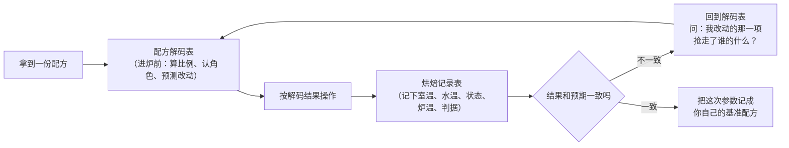

# 记录表

> 这些表是**可复用**的：各章实操与实战项目都链到这里，不在章节里复制粘贴。
> 直接抄到笔记软件、手机备忘录或纸上都行——它们是**普通 Markdown 表格**，没有专有语法。

## 为什么烘焙特别需要填表

炒菜可以边尝边改，所以记录只是锦上添花。**烘焙不行**：

> **你唯一能改的时机，是在进炉之前；
> 而你唯一能据以改的依据，是上一炉留下的记录。**

没有记录，同一份配方做第六次仍然是从零开始猜；
有记录的话，你会发现失败往往重复在同一个点上（通常是**水的分配**或**定型时间**）。

> **一句话**：填表的目的不是留档，是**让下一炉比这一炉多知道一件事**。

## 有哪些表

| 表 | 什么时候用 | 它逼你想清楚的事 |
|----|-----------|----------------|
| [配方解码表](recipe-decode.md) | **看到一份配方时**（这是全书的核心工具） | 每样原料占多少？它扮演什么角色？动它会连带影响谁？ |
| [烘焙记录与复盘表](bake-log.md) | **做的那一次，从准备到出炉** | 这次到底改了哪一个变量？结果差在哪？下次改哪一个？ |

> 两张表都用**烘焙百分比**记比例。本书统一约定：**以配方中面粉总量为 100%**，
> 其余原料按占面粉重量的百分比记；用别的基准时会在当页写明。

两张表的分工很简单：

## 怎么用（四条建议）

1. **第一次用先只填三列**：原料、烘焙百分比、它是什么角色。
   一上来填满整张表会让人放弃。
2. **一次只改一个变量**。一次改三样，你永远不知道是哪一样起了作用——
   这也是本书所有 🅑 开火版实操的设计原则。
3. **记"现象判据"而不只是时间**：你家的烤箱、模具、份量都和配方作者不同，
   **时间不可移植，现象与温度可移植**。
4. **复盘那一栏最值钱**：哪怕只写一句"下次糖减到 40%，预计会更不摊、更硬一点"，
   也比整张表填得漂亮有用。

> ⚠️ **安全提醒**：这些表里出现的任何温度、时间都是**你自己记录的观察**，
> 不能替代食品安全的官方指引。涉及**生面粉、生面糊、生蛋、天然酵种与保存期限**时，
> 请以自己所在地现行官方发布为准（本书用到的来源见[出处登记](../standards.md)）。
> 特别提醒一条：美国 FDA 明确表示**生面粉不是即食食品**，
> "把生谷物加工成面粉并不会杀死有害细菌"——**别尝生面团、生面糊**。
