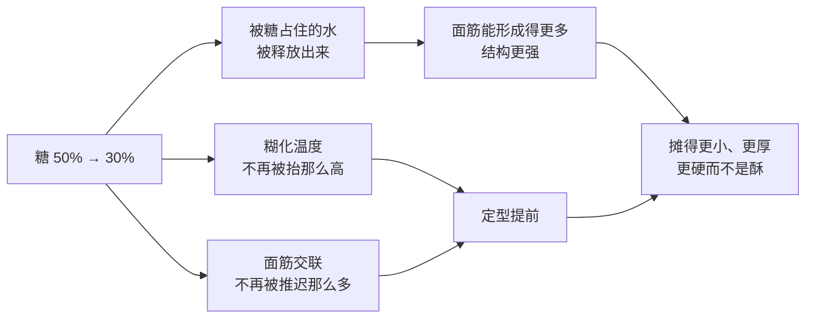
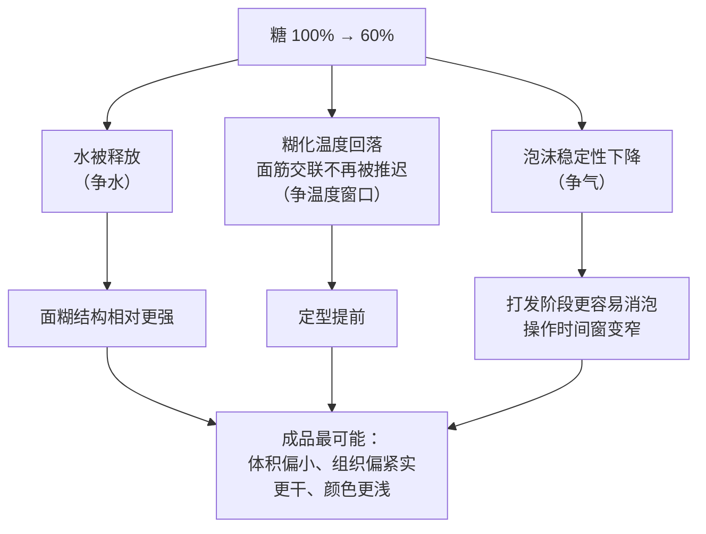
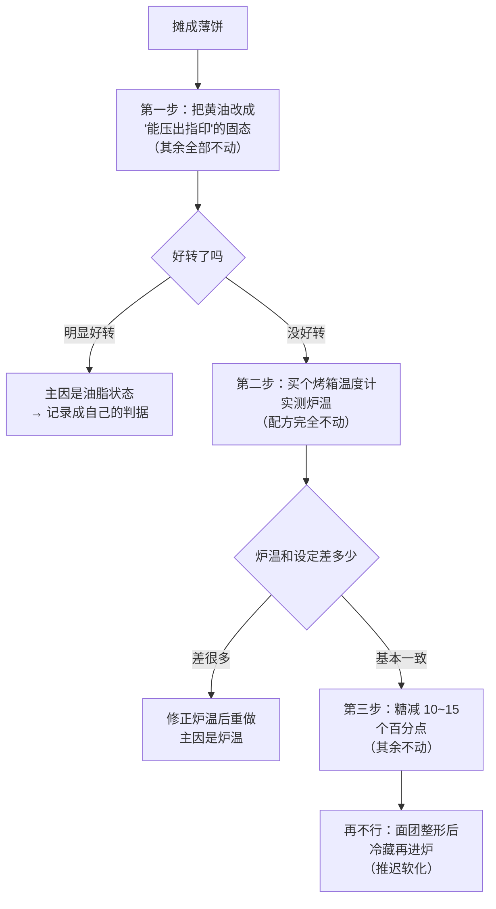

# 第 1 章 思考题参考答案

> 只记「问题 + 正确答案」。案例题给**完整推理链**——重点不是结论，
> 而是"它扮演什么角色 → 它在跟谁争 → 定型会提前还是推迟 → 成品怎么变 → 怎么验证"这条链子。
>
> 涉及数字的地方，来源见[参考书目与出处登记](../standards.md)。

## Q1

**问**：为什么烘焙必须"事先把账算清楚"，而炒菜不必？这个差别对"怎么学"提出了什么要求？

**答**：

**根本差别在于有没有在线反馈回路**：

- **炒菜**有。你随时可以尝一口、看一眼、闻一下，然后立刻调整（加盐、加水、关小火、离火）。
  所以炒菜的技能大量集中在**临场判断**上。
- **烘焙**没有。面团一进炉，你尝不到、改不了、连看到的信息都是滞后的
  （等你从颜色上发现问题，事情早就发生了）。所有决定——水多少、糖多少、油多少、
  揉到什么程度、发到什么程度、什么温度烤多久——**必须在进炉前全部做完**。

**对"怎么学"的三条要求**：

| 要求 | 为什么 |
|------|--------|
| **必须懂原理，不能只靠多做** | 反馈周期是"一炉一次"，而且一炉失败往往只给你一个混杂的数据点——你不知道是哪一项导致的。懂原理才能让每一炉都产出可用的信息 |
| **必须一次只改一个变量** | 同上：反馈太贵，一次改三样等于浪费了这一炉 |
| **必须记录** | 你的下一炉唯一能依据的东西，就是上一炉留下的记录（[烘焙记录表](../forms/bake-log.md)） |

> **要带走的判断**：烘焙的技能主体不是手艺，是**事先算账的能力**。
> 这也是为什么本书把"看懂配方"排在"会做成品"前面。

## Q2

**问**：把"面粉 300 g、水 210 g、盐 6 g、酵母 3 g"换算成烘焙百分比（写明基准）。
如果只有 180 g 面粉，其余各是多少克？

**答**：

**基准：面粉总量 300 g ＝ 100%**（本书默认基准）。

| 原料 | 克数 | 计算 | 烘焙百分比 |
|------|------|------|-----------|
| 面粉 | 300 g | — | **100%** |
| 水 | 210 g | 210 ÷ 300 | **70%** |
| 盐 | 6 g | 6 ÷ 300 | **2%** |
| 酵母 | 3 g | 3 ÷ 300 | **1%** |

**按 180 g 面粉缩放**（把 180 g 当作新的 100%，其余各乘对应百分比）：

| 原料 | 计算 | 克数 |
|------|------|------|
| 面粉 | — | 180 g |
| 水 | 180 × 70% | **126 g** |
| 盐 | 180 × 2% | **3.6 g** |
| 酵母 | 180 × 1% | **1.8 g** |

**三个要点**：

1. **百分比加起来是 173%**，远大于 100%——正常，因为分母是面粉不是总量；
2. 这份配方是 **70% 含水量**的面团，属于偏软的那一类（第 3 章会展开"含水量意味着什么"）；
3. **缩放时不要"凭感觉减"**。很多人会把盐和酵母按"大概一半"估，
   结果盐从 2% 变成了 1.7% 或 2.4%——而盐正是[控速](../glossary.md#rate-control)的旋钮，
   动它就是在动整个发酵节奏。

## Q3

**问**：糖做的四件与甜无关的事是什么？为什么糖从 50% 降到 30% 会让饼干摊得更小？

**答**：

**四件（本书正文实际列了五条，第 ⑤ 条是"喂酵母 / 压制酵母"，在无酵母的饼干里不适用）**：

| 糖在做什么 | 机制 |
|-----------|------|
| ① **吸湿保湿** | 糖把水"占住"（多项研究把糖抬高糊化温度的原因之一解释为"糖对水的固定"） |
| ② **抬高淀粉糊化温度** | 四项独立研究在甘薯、西米、**小麦**、木薯淀粉上都测到同一方向，效应顺序大致是蔗糖 > 葡萄糖 > 果糖/甘油 |
| ③ **推迟面筋受热交联** | 蔗糖越多，面筋交联被推迟或抑制得越厉害 |
| ④ **上色** | 还原糖参与[美拉德反应](../glossary.md#maillard)，糖本身也能[焦糖化](../glossary.md#caramelization) |

**减糖为什么摊得更小——完整推理链**：

关键的一步是**"定型提前"**：饼干的最终直径 ≈ **摊开速率 × 定型时间**。
糖少了，定型提前 → 可以摊开的时间变短 → 直径变小。

有一项专门研究把这条链子讲得很清楚：在饼干这种低水分体系里，
**蔗糖把淀粉糊化温度抬得太高，以至于烘烤中几乎没有淀粉糊化**，
同时推迟面筋交联，于是蔗糖越多、饼干**定型越晚、直径越大**。

**连带后果（也要答出来）**：减糖同时让成品**更干、更容易放硬**（失去保湿）、
**颜色更浅**（可参与褐变的糖变少）。

## Q4

**问**：油脂在饼干里的两个不同工作是什么？为什么"黄油换成等量色拉油"会丢掉其中一个？

**答**：

**两个工作**：

| 工作 | 它在做什么 | 证据 |
|------|----------|------|
| **① 阻断面筋（[短化](../glossary.md#shortening-effect)）** | 油脂裹在面粉颗粒与蛋白质表面，妨碍它们连成连续的面筋网络 → 口感从"韧"变"酥" | 机理层面。⚠️ 一篇脂质综述明确指出：关于脂质功能，被广泛接受的观点**常常互相对立**——所以本书只写方向 |
| **② 带入空气** | 固态脂肪被搅打时把空气带进面团 | 一项 X 射线显微 CT 研究发现：油脂用量增加时孔隙率与气孔尺寸增大，但**气孔壁厚度不受影响** → 据此判断油脂主要在带入空气 |

**为什么换成色拉油会丢掉第 ②（以及"隔层"能力）**：

因为这两个功能依赖的不是"油"，而是"**固态**"：

| | 固态脂肪 | 液态油 |
|---|---------|-------|
| 打发带入空气 | 能 | 基本不能——液体留不住气泡 |
| 隔出层（起酥、千层） | 能，前提正是面团与油脂**交替成层** | 不能，会被面团直接吸收 |
| 阻断面筋 | 能 | 能，而且往往更彻底 |

**所以"等量替换"这个说法本身就有问题**：你保留了第 ①，
丢掉了第 ② 和"隔层"。成品会更扁、更瓷实、内部气孔更少。

> **要带走的判断**：换原料之前，先列出它**承担几个功能**。
> 只补上其中一个，就是换了个成品。

## Q5

**问**：戚风配方（面粉 100%、糖 100%、蛋 200%、油 60%、牛奶 60%），
糖减到 60%，其余不动。（a）糖扮演哪些角色？（b）在跟谁争？
（c）定型提前还是推迟？成品最可能怎么变？蛋白打发会不会受影响？

**答**：

**（a）糖在这份配方里的角色**（注意：**不止饼干里的那几个**）：

| 角色 | 说明 |
|------|------|
| 占住水 | 这份配方的液体是牛奶 60% + 蛋里的水，糖 100% 占住其中相当一部分 |
| 抬高糊化温度、推迟定型 | 同饼干 |
| 上色 | 戚风表面的颜色 |
| **稳定蛋白泡沫** | ⭐ 这是戚风特有的：研究显示**蔗糖让蛋清更难打起泡，但打起来之后更稳定** |
| 增甜 | 它的第五重要的功能 |

**（b）它在跟谁争**：

- **争水**：糖减少 → 释放出一部分水 → 面粉与淀粉能分到更多水；
- **争温度窗口**：糖减少 → 糊化温度回落、面筋交联不再被推迟 → 定型窗口整体前移；
- **争气**（间接）：糖减少 → 泡沫的稳定性下降（见下）。

**（c）定型会提前**。推理链：

**成品最可能的变化**（按"形状 / 质地 / 颜色"三方面答）：

| 方面 | 预测 | 依据 |
|------|------|------|
| 形状 | 涨得**没那么高**、体积偏小 | 定型提前 + 泡沫更容易塌 |
| 质地 | 更**干**、组织更紧实、放一天更硬 | 失去糖的保湿 |
| 颜色 | 更**浅** | 可参与褐变的糖变少 |

**蛋白打发会受影响，而且是双向的**：

- **好的一面**：糖少了，蛋清**更容易打发起来**（研究显示蔗糖会延缓泡沫形成）；
- **坏的一面**：打起来之后**更不稳定、更容易消泡**——
  而戚风的整个操作（拌面糊、入模、进炉）都发生在泡沫的"寿命"之内。

> **所以正确的做法不是"糖直接减 40 个百分点"，而是**：
> ① 小步减（例如一次减 10~15 个百分点），每次只改这一项；
> ② 减糖后**缩短从打发到进炉的时间**，因为泡沫的可用窗口变短了；
> ③ 用[配方解码表](../forms/recipe-decode.md)先写预测，做完回填对照。

## Q6

**问**：饼干"摊成了一大片薄饼"。已知：用了融化的黄油、糖没减、低筋粉、烤箱温度没测过。
列出至少三条可能原因（属于哪一组竞争），并给出一次只改一个变量的排查顺序。

**答**：

**可能原因（四条，按嫌疑从大到小）**：

| # | 可能原因 | 属于哪一组竞争 | 机制 |
|---|---------|--------------|------|
| 1 | **黄油是融化的** | 争气 + 争面筋 | 液态油既打不进空气，也让面团在入炉前就很软；面团一软就先摊开，还没等定型就铺开了 |
| 2 | **糖比例本来就高** | 争水 + 争温度窗口 | 糖抬高糊化温度、推迟面筋交联 → **定型晚** → 有更多时间摊开 |
| 3 | **炉温实际偏低** | 争温度窗口 | 升温慢 → 面团在"还能流动"的状态里待得更久 → 摊得更开。⚠️ 他从没测过炉温，这一条**完全没有被排除** |
| 4 | 低筋粉 + 可能偏多的液体 | 争水 + 争面筋 | 结构本来就弱；如果面团偏软，摊开会更严重 |

**排查顺序（一次只改一个变量）**：

**为什么是这个顺序**（这一点比答案本身重要）：

1. **先改嫌疑最大、成本最低、最可逆的那一项**——黄油状态不改配方比例，不影响味道；
2. **再排除测量问题**。炉温没测过 = 存在一个**你完全不知道大小的误差源**，
   在它被量化之前，改配方是在猜。注意专业研究也是这么做的：
   研究者把烤箱设在某个温度，但**另行实测成品内部温度**；
3. **最后才动配方比例**，因为改糖会同时改掉甜度、颜色、保湿——代价最大。

> **要带走的判断**：先动**操作变量**，再动**测量**，最后才动**配方**。
> 代价从小到大排。

## Q7

**问**：判断"面团必须揉出手套膜"的证据强度，说明它为什么流传这么广，
并指出至少两类不应该这么做的成品。

**答**：

**判定：❌ 作为通用标准明确错误；作为某类面包的经验判据，缺乏一手出处。**

**两个层面的问题**：

1. **"必须"是错的**。面筋的量应该**按成品需要调**，不是越多越好。
   模型实验显示：面筋加得越多、饼干摊开越小、开始摊开的时间越晚；
   而完全不加面筋时摊得最大，但**结构不可接受**。
   这正说明面筋是一条有最优点的曲线，不是单调向好。
2. **"手套膜"这个判据本身缺乏一手出处**。本书检索时**没有找到**
   对应的学术表述或实验依据，它是一条流传于烘焙圈的**工艺口语**
   （已登记在[出处登记](../standards.md)的「已知缺口」里）。

**它为什么流传这么广**（这一问是本书反复要练的）：

- 它在**一类成品上确实成立**：追求细腻均匀组织、需要强气室支撑的软质面包
  （吐司一类），面筋确实要发展得比较充分；
- 它是**少数可以用眼睛判断的判据**。烘焙里大部分变量看不见摸不着，
  而"能不能撑出膜"是可视化的——**人总是会过度依赖那个唯一能看见的指标**；
- 它**容易传播**（一个动作 + 一个画面），而"按成品需要把面筋调到合适程度"
  既不好演示、也不好拍视频。

**至少两类不应该这么做的成品**：

| 成品 | 为什么不能 |
|------|-----------|
| **饼干 / 曲奇** | 目标是"酥"，靠的正是油脂**阻断**面筋（短化）。把面筋揉出来只会得到硬而韧的饼干 |
| **酥皮 / 派皮 / 塔皮** | 靠的是面团与固态脂肪**交替成层**，靠蒸汽把层顶开。揉出面筋会让层黏成一片，而且成品会回缩 |
| **司康 / 马芬一类快速面包** | 化学膨发 + 最少搅拌；搅过头面筋发展起来，成品会变韧、出现"隧道"状孔洞 |

> **要带走的判断**：听到"必须"两个字，先问"对哪一类成品必须"。
> 烘焙里几乎所有的绝对化说法，都是**把某一类成品的经验推广到了全部**。

## Q8

**问**："泡打粉用完了，用等量小苏打代替"——会改变什么（至少两项）？
怎么设计一个在家能做的对照实验？

**答**：

**判定：❌ 明确错误。**

**它们不是同一类东西**：

| | 小苏打（碳酸氢钠） | 泡打粉 |
|---|------------------|--------|
| 成分 | **只有碱** | **碱 + 酸**的预混物（常还含淀粉做隔离剂） |
| 产气条件 | 需要**配方里本来就有酸**（酸奶、酪乳、红糖、可可、柠檬汁、蜂蜜…） | 自带酸，加水/加热即可反应 |
| 用等量替换的后果 | 如果配方里没有足够的酸，碱会**剩下来** | — |

**至少会改变的三项**：

1. **产气量与产气时机**。一项研究比较了四种不同的**膨松酸**
   （磷酸铝钠、硫酸铝钠、磷酸二氢钙、酸式焦磷酸钠），发现它们的离子与 pH 相互作用
   会影响面团性质与静置时间——**说明"什么酸、反应多快"是被专门设计的**，不是随便替的；
2. **成品的 pH**。同一项研究里，配方被专门调整以把成品 pH 控制在 5.9~6.1 这个区间，
   **pH 本身就是一个被刻意控制的变量**。多出来的碱会把它推高；
3. **颜色与风味**。另一项研究显示，换用碳酸氢铵还是碳酸氢钠会改变饼干的褐变程度与
   HMF 生成。剩余的碱通常会带来偏深的颜色和一种发涩的碱味。

**在家能做的对照实验设计**：

| 要素 | 怎么做 |
|------|--------|
| 基础配方 | 一份**不含明显酸性成分**的简单饼干或松饼配方（这样差别最明显） |
| 唯一变量 | 膨松剂：① 泡打粉（原量）② 等量小苏打 ③ 等量小苏打 + 一点酸（如少量柠檬汁或酸奶） |
| 必须固定的 | 每份面团重量、厚度、烤盘位置、炉温、时间；三组**同时进炉** |
| 观察指标 | 厚度（尺子量）、颜色（拍照对比，注意用同一光线）、气孔（切开看）、**味道（尤其有没有涩味或碱味）** |
| 记录 | 用[烘焙记录表](../forms/bake-log.md)，三组各填一行 |

**预期与解释**：第 ② 组最可能出现**颜色偏深 + 涩味/碱味**，
且膨发效果不一定比第 ① 组好；第 ③ 组应更接近第 ① 组——
如果确实如此，就验证了"**小苏打需要酸**"这条机制。

> ⚠️ **实验的局限也要写下来**：样本量小、没有重复、颜色靠肉眼判断、
> 没有测 pH。它能让你"体会到"这个现象，但**不能用来证明或推翻任何定量结论**。

## Q9

**问**：挑出本章两处"学界无共识 / 没有核到一手出处"的地方，
说明如果本书硬写一个数字，读者会付出什么代价。

**答**：

**可选的几处**（答出任意两处即可）：

| 处 | 本书怎么写的 | 如果硬写数字，读者付出什么代价 |
|----|------------|----------------------------|
| **面粉蛋白质在饼干品质中的作用** | 明说"学界没有共识"，只用方向（高蛋白 → 摊得更小） | 读者会拿一个假的精确规律去调配方，失败时**归因到自己手法**，而不是归因到"这条规律本来就不成立"——这会让他学到**错误的经验** |
| **家用烤箱的温度偏差** | 不给"通常偏低多少"的数字，要求读者**自己测** | 如果本书写"家用烤箱一般偏低 10~20 °C"，读者会照着往上加，而他家的烤箱可能恰好偏**高**——直接烤糊一炉，而且他会以为是配方的问题 |
| **油脂在面团里的机理** | 明说"被广泛接受的观点常常互相对立"，只写现象 | 读者会把一个未定论的机理当成推理前提，一路推出更多错误结论（错误会**沿着推理链放大**） |
| **"手套膜"** | 按工艺口语处理，说明未找到学术对应 | 读者会把它当成硬标准，在**根本不该发展面筋**的成品上照做，做出一堆又硬又韧的饼干和回缩的派皮 |
| **蒸汽把起酥层顶开的确切机制** | 明说综述指出"机制仍不清楚" | 读者会以为自己"应该懂"，失败时无法定位；而真实情况是**连研究者都还没搞清楚** |
| **糖酥饼干研究里百分比的基准** | 只用方向与相对关系，不引绝对数字 | 基准不明的百分比**会被误算**：把"以总面团重为基准的 30%"当成"以面粉为基准的 30%"，配方直接走样 |

**统一的道理**：

> **假数字比"没有数字"更贵。**
>
> - "没有数字"的代价是：读者得自己测一次；
> - "假数字"的代价是：读者**不会再去测**，而且失败时**归因错方向**——
>   他会怀疑自己的手法、怀疑面粉、怀疑天气，唯独不会怀疑那个数字。
>
> 更糟的是，错误的前提会**沿着推理链放大**：本书教的是"改配方"，
> 而改配方是一条推理链——第一步错了，后面每一步都跟着错。

**读者应该带走的查证习惯**：

1. 看到一个**很精确的数字**（"面团必须打到某个温度""美拉德从某个温度开始"），
   先问"**谁测的、怎么测的**"；
2. 区分"**机理共识**"（如淀粉有水受热会糊化）和"**定量结论**"（具体多少度糊化）——
   前者稳定，后者随体系漂移；
3. 一份资料**敢于说"这里没查到"**，通常比一份处处给出精确数字的资料更可信。
