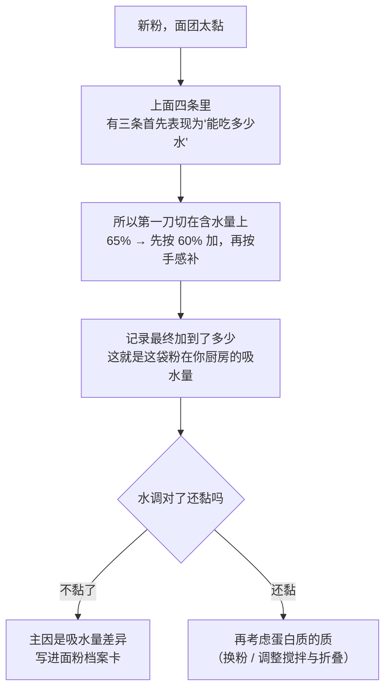

# 第 2 章 思考题参考答案

> 只记「问题 + 正确答案」。案例题给**完整推理链**——
> "它扮演什么角色 → 它在跟谁争 → 定型会提前还是推迟 → 成品怎么变 → 怎么验证"。
>
> 涉及数字的地方，来源见[参考书目与出处登记](../standards.md)。

## Q1

**问**：为什么"面粉里没有面筋"这句话是对的？形成面筋需要哪三样东西？

**答**：

面粉里有的是**蛋白质**，主要是两类：**麦谷蛋白**与**麦醇溶蛋白**。
[面筋](../glossary.md#gluten)是这些蛋白**吸水之后、在机械作用下连成的黏弹性网络**——
它是一个**被做出来的结构**，不是一种现成的原料。

**三样东西**：

| 要素 | 为什么必须 |
|------|-----------|
| **水** | 蛋白质必须先[水合](../glossary.md#hydration)（吸水舒展）才谈得上互相连接 |
| **机械作用** | 揉、搅、折叠，把分散的蛋白质推到一起并让它们对齐、交联 |
| **时间** | 水渗进去需要时间；网络也会在静置中继续变化（松弛、继续水合） |

**这句话为什么重要**：因为它解释了两个常见现象。

1. **"我用了高筋粉，怎么还是散的"**——你只是买到了原料，还没把结构做出来；
2. **"我一直揉，怎么还是不成膜"**——可能是水不够（蛋白质没水合），
   也可能配方里有大量**油脂或糖在阻断**（第 1 章的"争面筋"，第 4、5 章展开）。

## Q2

**问**：麦谷蛋白和麦醇溶蛋白各自更负责什么？把它们分别加回基础粉里分别观察到了什么？
这对"我的面团老是缩回去"有什么启发？

**答**：

**分工（用实验说话，不用比喻）**：

一项研究把硬粒小麦的面筋拆开，在**蛋白质总量固定**的前提下分别加回基础粗粒粉：

| 加进去的 | 观察到的 | 指向什么性质 |
|---------|---------|------------|
| **麦醇溶蛋白** | 搅拌曲线**变弱**；**无法单独形成网络**；对蠕变柔量几乎无影响；**tan δ 升高** | 它贡献的是**黏性 / 能流动 / 延展** |
| **麦谷蛋白** | 面团整体强度**上升**；不同来源效果有差别 | 它贡献的是**弹性 / 强度 / 骨架** |
| 高分子量与低分子量麦谷蛋白亚基 | 都提高面团强度 | 同上 |

另一项研究提供了互相印证的角度：面筋凝胶与麦谷蛋白凝胶的网络强度之比，
在一个特强品种是 5.6，在一个软质小麦是 51.1——
**越弱的品种，麦醇溶蛋白对麦谷蛋白网络的"稀释"越严重**。
同一研究里往面筋凝胶加半胱氨酸会让网络直接消失，说明**这个网络是可逆的**。

**对"面团老是缩回去"的启发**：

> **"缩回去"不是"筋不够"，恰恰是弹性占了上风。**

所以正确的应对**不是继续揉**（那只会让它更弹），而是三类做法：

| 做法 | 为什么有用 |
|------|-----------|
| **让它松弛**（盖好静置十几分钟再整形） | 给可逆交联时间重排，弹性回落 |
| **分两次整形**（先粗整形 → 松弛 → 再整形到位） | 每一次只要求它变形一点点 |
| **检查是不是搅过头 / 粉太强** | 如果每次都这样，问题在配方或搅拌，不在手法 |

> **要带走的判断**：面团有两种相反的毛病——**缩回去**（弹性过头）和
> **摊成一滩**（延展过头）。它们**不能用同一招处理**。
> 先判断是哪一种，再决定动哪个旋钮。

## Q3

**问**：法规规定"灰分（干基）≤ 蛋白质（干基）÷ 20 + 0.35"。
（a）干基蛋白质 12% 时灰分上限是多少？（b）为什么不直接规定一个固定上限？

**答**：

**（a）计算**：

> 12 ÷ 20 + 0.35 = 0.6 + 0.35 = **0.95%**（干基）

顺手多算两个，能看出这条式子的性格：

| 干基蛋白质 | 允许的灰分上限（干基） |
|-----------|---------------------|
| 8% | 0.75% |
| 10% | 0.85% |
| **12%** | **0.95%** |
| 14% | 1.05% |

**（b）为什么是一条比例式而不是固定值**：

因为**灰分在这里不是"质量指标"，而是"去麸程度的代理指标"**。
[灰分](../glossary.md#ash)高说明带进了更多麸皮与胚芽的矿物质，
也就是**磨得离整粒更近**（[出粉率](../glossary.md#extraction-rate)更高）。

但**蛋白质高的小麦本身矿物质也偏高**。如果法规定一个死的灰分上限，
那些高蛋白小麦磨出来的、去麸其实很干净的粉，会被误判成"磨得不够"。
用一条随蛋白质浮动的线，才能公平地衡量"去麸到什么程度"。

> **要带走的判断**：**灰分单独没有意义**。
> 它必须和蛋白质（或者说和这袋粉是什么小麦磨的）一起读——
> 这也是本书一直在说的"一个数字离开基准就不成立"的又一个例子。

## Q4

**问**：吐司配方（面粉 100%、水 65%、盐 2%、糖 6%、黄油 5%、酵母 1%，
**以面粉总量为 100%**）。换了新牌子高筋粉，标称蛋白质更高，却明显太黏。
（a）"蛋白质更高却更黏"可能是什么原因？（b）下一次先改哪一项？

**答**：

**（a）"蛋白质更高却更黏"的可能原因**

这题的陷阱在于："黏"和"蛋白质"根本不是同一条因果链上的东西。
按本章的四个变量逐条排查：

| # | 可能原因 | 属于哪个变量 | 机制 |
|---|---------|------------|------|
| 1 | **这袋粉能吃的水更少**（损伤淀粉少、磨得粗、非淀粉多糖少） | **损伤淀粉 / 非淀粉多糖** | 吸水量由四项共同决定（蛋白质、可溶性淀粉、损伤淀粉、水溶性阿拉伯木聚糖比浓黏度），蛋白质只是其中一项。65% 的水对上一袋粉刚好，对这袋就是**多了** |
| 2 | **蛋白质的"质"不一样** | **蛋白质的质** | 蛋白质总量高不等于麦谷蛋白占比高。麦醇溶蛋白偏多时，面团更能流动、tan δ 更高——表现就是"黏、软、站不住" |
| 3 | **水合还没完成** | 时间 | 粗一点的粉吃水慢。刚和好时的"黏"未必是终态 |
| 4 | **酶活不同** | **酶活** | α-淀粉酶活性偏高会让面团发黏（小麦发芽是典型原因）。这条在家用粉里少见，但不能先排除 |

**（b）下一次先改哪一项——先改水，不改别的**

**推理链**：

**为什么不先改盐或酵母**：

| 你想改的 | 它其实在管什么 | 改了会发生什么 |
|---------|--------------|--------------|
| **盐** | [控速](../glossary.md#rate-control)：拖慢酵母、改变面筋形成的节奏与形态 | 你会同时改掉发酵速度和风味积累，而**"黏"这个症状根本不是盐引起的** |
| **酵母** | 产气速度 | 同上，改的是"多久发好"，不是"面团稠不稀" |
| **水** | 直接决定面团稠度 | **这才是症状对应的那个旋钮** |

> **要带走的判断**：**先动症状所在的那个旋钮**。
> 面团太黏 = 稠度问题 = 水的问题。**不要因为"盐和酵母好改"就先改它们**——
> 好改不等于该改。

## Q5

**问**：把饼干配方里的低筋粉换成"高筋粉 + 玉米淀粉"（调到同样蛋白质百分比），
结果还是更硬、颜色更浅。给出至少两条解释，并设计对照。

**答**：

**关键认识：这个替换只补齐了"蛋白质的量"，没补齐另外三件事。**

| # | 解释 | 属于哪个变量 | 为什么导致"更硬" / "更浅" |
|---|------|------------|------------------------|
| 1 | **蛋白质的"质"不同** | 蛋白质的质 | 高筋粉的麦谷蛋白占比通常更高。稀释之后总量一样，但**能形成的网络更强**——饼干于是更硬、更韧、摊得更小（第 1 章：面筋越多，饼干摊开越小、开始摊开的时间越晚） |
| 2 | **损伤淀粉更少 → 还原糖更少 → 上色更浅** | 损伤淀粉 | 损伤淀粉是酶可以下手的底物，也直接影响还原糖水平（石磨研究里，损伤淀粉 25.97% 的细粉还原糖 8.91 g/100 g，损伤淀粉 11.15% 的粗粉只有 3.12 g/100 g）。**玉米淀粉是完好的淀粉，补不回这一项** |
| 3 | **可能少了化学改性** | 加工 | 一部分商品低筋粉（尤其"蛋糕专用粉"）经过氯化处理——一篇 2024 年论文明确写道，氯化是软麦粉制作高比例蛋糕的常规做法。**这一项无论怎么配比都补不回来** |
| 4 | **颗粒度与吸水不同** | 颗粒度 | 吸水量变了 → 面团稠度变了 → 摊开与定型时间跟着变 |

**怎么设计对照来区分它们**

一次只放一个变量进去：

| 组 | 配方 | 它在检验什么 |
|----|------|------------|
| ① 原配方（真低筋粉） | 基准 | 参照系 |
| ② 高筋粉 + 玉米淀粉（等蛋白质） | 换了"质 + 损伤淀粉 + 加工" | 这就是出问题的那组 |
| ③ **中筋粉 + 玉米淀粉**（等蛋白质） | 只把"质"往回调一点 | 如果 ③ 明显接近 ①，说明**蛋白质的质**是主因 |
| ④ 组 ② 的配方，但**糖加 3~5 个百分点** | 只补"能上色的糖" | 如果 ④ 的颜色补回来了、硬度没变，说明**颜色问题主要是还原糖少**，与结构问题是两回事 |

**必须固定的**：每块面团重量、厚度、烤盘位置、炉温、时间；各组**同时进炉**。
记录进[烘焙记录表](../forms/bake-log.md)。

> ⚠️ **局限也要写下来**：家里做不到测损伤淀粉、测蛋白质组成、测 pH。
> 这组实验只能告诉你"哪个方向能改善"，**不能证明机制**。
> 分清"这招管用"和"我知道为什么"，是两件不同的事。

## Q6

**问**：判断"面粉越白越不好"的证据强度，拆出它混淆了哪几件事，
并说明每件对烘焙性能的影响方向。

**答**：

**判定：⚠️ 把至少三件互相独立的事混在了一起。**

| 被混淆的事 | 它是什么 | 对**烘焙性能**的影响方向 |
|-----------|---------|----------------------|
| ① **碾磨程度**（出粉率 / [灰分](../glossary.md#ash)） | 磨得离整粒越近，麸皮带进来越多，灰分越高、颜色越深 | 麸皮多 → **吸水更多**、**面筋网络被物理妨碍**、**体积通常更小**、风味更足。一项碾磨对照显示：硬式碾磨的出粉率、灰分、损伤淀粉都更高，而面筋指数更低 |
| ② **漂白 / 熟成处理** | 用法规允许的漂白剂让色素褪色（并可能带人工熟成作用） | 改变的是**色素与蛋白质的氧化状态**，因而改变面团性质。美国法规明确要求用了就标"Bleached" |
| ③ **品种与年份** | 小麦本身的颜色与成分差异 | 影响蛋白质、灰分、酶活等一整套指标 |

**为什么这句话流传得广**：因为 ① 确实成立——
**全麦 / 高出粉率的粉颜色深、风味重、营养组成不同**，
于是"深 = 更接近整粒 = 更天然"的联想很自然地延伸成了"白 = 差"。
但它把 ② 和 ③ 一起打包进去了，而这两件和"加工得多不多"并不是同一回事。

> **本书的态度**：漂白是**法定允许且必须标注**的工艺，
> 本书**不做健康判断**（那超出本书范围）。
> 本书只负责告诉你：**"白不白"不是一个可用的烘焙判据**——
> 你需要的信息是蛋白质、吸水量和它在你手上的实际表现。

## Q7

**问**："面粉必须过筛，不然做不蓬松"——判断证据强度，
说明过筛确实解决了什么问题，以及那个问题更好的解法是什么。

**答**：

**判定：⚠️ 作用被夸大了。本书没有核到"过筛让成品更蓬松"的一手实验。**

**过筛确实解决的两个真问题**：

| 真问题 | 过筛怎么帮上忙 |
|--------|--------------|
| **结块** | 受潮的面粉、可可粉、糖粉会结小疙瘩，搅进面糊里就是一个个白点 / 硬粒 |
| **干料混不匀** | 化学膨松的配方里，**泡打粉 / 小苏打分布不均会让成品局部鼓、局部不鼓**——这是真实的失败模式（第 13 章） |

**它被误以为解决、但其实没解决的问题**：

| 流传的说法 | 实际情况 |
|-----------|---------|
| "过筛充了空气，所以更蓬松" | 拌进面糊、再进烤箱之后，这点空气与酵母 / 化学膨松剂 / 打发带进去的气相比微不足道。本书**没有核到**支持这条的一手实验 |
| "过筛让面粉更轻，所以量更准" | **方向正好相反**：过筛确实让同体积的面粉更轻，也就是说——**它改变了"一杯面粉"到底是多少克** |

**那个问题更好的解法**：

> **用秤。**
>
> "一杯面粉"的重量取决于你怎么舀、舀之前有没有过筛、粉有没有压实。
> 这是一个**测量方法问题**，不是一个**过筛问题**（第 26 章专讲）。
> 换句话说：**过筛是在给一把不准的尺子做微调，而正解是换一把准的尺子。**

> **要带走的判断**：一个流传很广的动作，通常**确实在解决某个问题**——
> 但不一定是它被宣称解决的那个。养成习惯问一句：
> **"这个动作到底改变了哪个物理量？"**

## Q8

**问**：如果本书直接给出"高筋粉吸水率 65%、低筋粉 55%"这样的数字，读者会付出什么代价？

**答**：

**第一层代价：这两个数字在很多情况下是错的。**

因为吸水量至少由四项共同决定——一项用 150 份小麦、28 项指标做回归的研究，
最优模型是**蛋白质含量 + 可溶性淀粉 + 损伤淀粉 + 水溶性阿拉伯木聚糖的比浓黏度**。
其中三项**不印在包装上**。同一个"高筋粉"标签下，这三项可以差很多：
例如一份蜡质小麦粉的粉质仪吸水量高达 79.5%，损伤淀粉 10.4%，
而两份对照粉的损伤淀粉只有 7.0% 与 6.6%。

**第二层代价（更贵）：读者不会再去测了。**

| 本书的写法 | 读者会做什么 | 结果 |
|-----------|------------|------|
| "**这个数字取决于你手上那袋粉，请自己测并记录**" | 他会做一次留水后加、记一次数 | 他**永远拥有**这袋粉的真实数据 |
| "高筋粉吸水率 65%" | 他会直接照着加水 | 不对的时候，他会怀疑自己的手法、怀疑天气、怀疑烤箱——**唯独不会怀疑那个数字** |

**第三层代价：错误会沿着推理链放大。**

本书教的是"改配方"，而改配方是一条推理链：
含水量错了 → 面团稠度错了 → 揉出来的结构错了 → 定型时刻错了 →
成品形状与质地全错。**第一步错了，后面每一步都跟着错，
而且他会在最后一步才发现问题。**

> **统一的道理（和第 1 章 Q9 是同一条）**：
> **假数字比"没有数字"更贵。**
> "没有数字"的代价是读者要自己测一次；
> "假数字"的代价是**他不再测，而且归因错方向**。
>
> 本章的正确写法因此是：给**规律**（吸水由四项决定）、给**方法**
> （留水后加 + 记录）、给**已知缺口**（各国面粉分类的蛋白质区间本书未核到），
> **就是不给那个看起来最方便的数字**。
