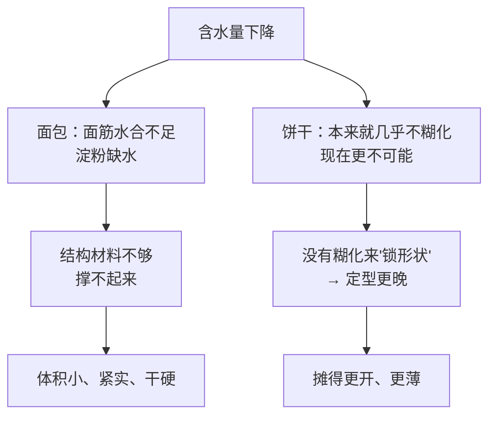
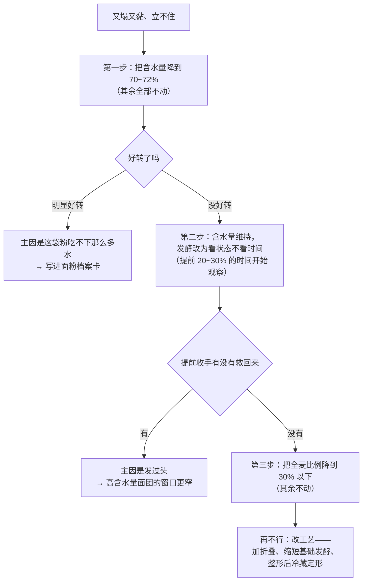

# 第 3 章 思考题参考答案

> 只记「问题 + 正确答案」。案例题给**完整推理链**——
> "它扮演什么角色 → 它在跟谁争 → 定型会提前还是推迟 → 成品怎么变 → 怎么验证"。
>
> 涉及数字的地方，来源见[参考书目与出处登记](../standards.md)。

## Q1

**问**：水在一份配方里的五个去处是什么？哪一个最容易被忽略、为什么？

**答**：

| # | 去处 | 它在做什么 |
|---|------|----------|
| ① | **让蛋白质水合** | 蛋白质吸水舒展之后，才谈得上在机械作用下连成[面筋](../glossary.md#gluten)网络 |
| ② | **让淀粉[糊化](../glossary.md#gelatinization)** | 淀粉要"有水且受热"才会吸水膨胀、崩解成凝胶 |
| ③ | **当溶剂** | 糖和盐要溶解才起作用；**化学膨松剂的酸碱反应必须在水里发生** |
| ④ | **变成蒸汽** | 炉内膨胀的重要推力（一项中试烤炉研究观察到蒸汽有利于膨胀，最大约 1.7 倍，出现在面包芯温度接近 90 °C 时） |
| ⑤ | **留在成品里** | 决定口感是湿润还是干硬，以及能放多久 |

**最容易被忽略的是第 ③ 条。**

原因有两个：

1. **它是"隐形"的**——溶解和反应看不见，不像面筋能摸、蒸汽能看到膨胀；
2. **它带着一个时间性的后果**：水一碰到化学膨松剂，反应就开始计时了。
   这直接解释了为什么很多快速面包、马芬、司康配方要求
   "**液体倒进去之后就要快，搅到看不见干粉就停**"——
   拖太久，一部分气在进炉前就跑掉了（第 13、34 章展开）。

> **要带走的判断**：水不只是"湿度"，它还是**反应发生的场所**。
> 问"水够不够"的时候，别忘了问"**该发生的反应有没有地方发生**"。

## Q2

**问**：配方"面粉 500 g、水 325 g"。（a）含水量多少？（b）提到 72% 要多少克水？
（c）"从 65% 提到 72%"是多了 7 个百分点还是水多了 7%？

**答**：

**（a）基准：面粉总量 500 g ＝ 100%**（本书默认基准）。

> 325 ÷ 500 = **65%**

**（b）提高到 72%**：

> 500 × 72% = **360 g**，也就是在原来 325 g 的基础上**再加 35 g**。

**（c）两种说法算出来完全不同**——这正是本题的重点：

| 说法 | 怎么算 | 结果 |
|------|--------|------|
| **"多了 7 个百分点"**（含水量 65% → 72%） | 500 × (72% − 65%) | **多加 35 g 水**，总水 360 g |
| **"水多了 7%"**（水量相对增加 7%） | 325 × 7% | 多加 **22.75 g**，总水约 347.75 g，含水量约 **69.6%** |

两者差了 **12 g 水**，在这份 500 g 面粉的配方里相当于约 **2.5 个百分点的含水量**——
足够让面团手感明显不同。

> **要带走的判断**：**"百分点"和"百分比"不是一回事。**
> 烘焙圈经常把两者混着说。看到"加了 10% 的水"这种话，
> 先问清楚是哪一种——**问清楚比算得快重要。**

## Q3

**问**：为什么"含水量低"在面包里和在饼干里导致相反的结果？分别说到"定型"。

**答**：

**因为两种配方的结构靠的根本不是同一套机制。**

| | 面包（高水分） | 饼干（低水分 + 高糖） |
|---|--------------|---------------------|
| 结构主要靠 | 面筋网络 + **糊化的淀粉凝胶** | **不是糊化**（具体靠什么本书未核到定论，第 35 章再谈） |
| **水少了会怎样** | 蛋白质水合不足 → **面筋做不起来**；淀粉也缺水 | 淀粉本来就快糊化不了，水再少 → **更彻底地不糊化** |
| **对"定型"的影响** | 结构材料不足，**撑不起来**；而且面团硬、发酵受限 | **定型更晚**（没有糊化这一步来"锁住"形状） |
| **成品表现** | 体积小、组织紧实、干硬 | **摊得更开、更薄** |

**关键的一环是"定型"**：

> 一项专门研究指出：在饼干体系里，**蔗糖加上低水分把淀粉糊化温度抬得太高，
> 以至于烘烤过程中几乎没有淀粉糊化**；同时蔗糖推迟面筋交联，
> 于是饼干**定型更晚、直径更大**。

> **要带走的判断**：**同一个改动，在不同配方里可以走向相反的结果。**
> 所以"少放点水会更酥"这种经验**不能跨品类搬运**。
> 判断的方法是先问：**这份配方的结构到底靠什么立住？**

## Q4

**问**：78% 含水量欧包，用了更粗的全麦混合粉，发酵后期"又塌又黏、立不住"。
（a）三条可能原因分别属于哪一组竞争？（b）一次只改一个变量的排查顺序。

**答**：

**（a）可能原因**

| # | 可能原因 | 属于哪一组竞争 | 机制 |
|---|---------|--------------|------|
| 1 | **这袋粉吃不下 78% 的水** | **争水** | 吸水量由蛋白质、可溶性淀粉、损伤淀粉、水溶性阿拉伯木聚糖共同决定。**磨得更粗 → 损伤淀粉更少 → 吸水更少**。配方作者的粉能吃 78%，不代表这袋能 |
| 2 | **发过头了** | **争气 + 争面筋** | 一项三档加水量研究显示，加水到 55%（该研究的体系）时**发酵中面筋纤维会断裂**。含水量越高，网络越脆弱，"发好了"和"发过了"之间的窗口越窄。**照抄发酵时间是最危险的一步** |
| 3 | **麸皮颗粒在物理上妨碍网络** | **争面筋** | 全麦粉法定只要求 ≥90% 过 2.36 mm 筛、≥50% 过 850 µm 筛，比白粉（≥98% 过 212 µm）粗得多。粗颗粒像刀片一样打断连续的面筋片 |
| 4 | **水合没走完就开始计时** | 争水 | 粗粉、麸皮吃水慢。刚搅好时看起来"水正好"，半小时后麸皮把水吃进去，可能反而变干——但如果整形前判断错，也可能一直是黏的 |

**（b）排查顺序**

**为什么是这个顺序**（这一点比答案本身重要）：

1. **先改症状所在的那个旋钮**。"塌、黏、立不住"是**稠度与结构强度**问题，
   而含水量是直接决定它的那一项，改起来也最可逆；
2. **再排除"时间照抄"这个误差源**。他的发酵时间来自配方作者的厨房温度、
   酵母量和那袋粉——**这是一个他完全不知道大小的误差源**；
3. **最后才动配方结构**（全麦比例）——那等于换了一个成品；
4. **工艺手段放最后**，因为它引入的新变量最多（折叠次数、冷藏时间、整形手法）。

> **要带走的判断**（和第 1 章 Q6 是同一条）：
> **先动操作变量，再动测量与判据，最后才动配方。** 代价从小到大排。

## Q5

**问**：为什么马芬配方要求"倒在一起后搅到看不见干粉就停"？
如果先把泡打粉和牛奶混十分钟再拌面粉会怎样？

**答**：

**这一步要快，有两个原因，本章负责其中一个。**

**原因一（本章的）：反应从水碰到膨松剂那一刻就开始了。**

化学膨松剂产气靠的是**酸碱反应**，而这个反应**必须在水里发生**——
干粉状态下它基本不动。所以：

> **"倒在一起"的那一刻 = 产气计时开始。**
> 从那时起，产生的 CO₂ 有两个去处：**留在面糊里**，或者**跑掉**。
> 面糊还没进炉、结构还没定住，跑掉的那部分就是白白损失的膨发力。

**原因二（第 16、34 章的）：搅拌会发展面筋。**
马芬要的是柔软、短的口感，面筋一多就变韧、还会出现"隧道"状孔洞。

**如果先把泡打粉和牛奶混十分钟再拌面粉，会发生什么**：

| 后果 | 机制 |
|------|------|
| **一部分气在进炉前就跑光了** | 反应在稀薄的牛奶里进行，没有黏稠的面糊来关住气泡——气一冒出来就直接跑了 |
| **成品更矮、组织更实** | 可用的气变少 |
| **可能还会有味道问题** | 如果配方用的是小苏打（碱）而酸性成分不足，或者酸碱配平被打乱，剩余的碱会留下涩味、颜色偏深（第 13 章） |

> ⚠️ **诚实说明**：不同膨松剂的"反应快慢"是被专门设计的。
> 一项研究比较了四种**膨松酸**（磷酸铝钠、硫酸铝钠、磷酸二氢钙、酸式焦磷酸钠），
> 发现它们的离子与 pH 相互作用会影响面团性质与**静置时间**，
> 配方需要专门调整才能把成品 pH 控制在目标区间（该研究里是 5.9~6.1）。
> 所以"能放多久再进炉"**取决于你用的是哪种膨松剂**——
> 这也是为什么本书不给一个通用的"必须在几分钟内进炉"的数字。

> **要带走的判断**：**水是反应发生的场所，也是计时器的开关。**
> 凡是配方里写着"快"的步骤，先问一句：**什么东西开始计时了？**

## Q6

**问**："面团太黏就加面粉"——判断证据强度，说明它改变了什么，给两个更好的做法。

**答**：

**判定：⚠️ 能救急，但它改掉的东西比大多数人以为的多。**

**它到底改了什么：分母。**

[烘焙百分比](../glossary.md#bakers-percentage)是**以面粉总量为 100%**算的。
你往面团里加面粉，等于**把分母变大了**——于是配方里**所有其他原料的百分比同时下降**：

| 一份 500 g 面粉的面团，撒进 40 g 面粉之后 | 原来 | 变成 |
|---|------|------|
| 面粉（分母） | 500 g ＝ 100% | 540 g ＝ 100% |
| 水 325 g | 65% | 约 **60.2%** |
| 盐 10 g | 2% | 约 **1.85%** |
| 糖 30 g | 6% | 约 **5.6%** |
| 酵母 5 g | 1% | 约 **0.93%** |

也就是说，你以为你只是"让它不黏手"，
实际上你**同时稀释了盐（[控速](../glossary.md#rate-control)）、糖、酵母和油**，
还让新加进去的那部分面粉**完全没有水合**——它是干的，会留下粉粒和不均匀的地方。

**两个更好的替代做法**：

| 做法 | 为什么更好 |
|------|-----------|
| **① 先等一等，让水合走完** | 粗粉、全麦、高纤维的粉吃水慢。很多"太黏"在静置十几分钟后自己就好了一半。**这一招零成本、零代价** |
| **② 用折叠 / 拍打代替加粉** | 建立结构靠的是"机械作用 + 时间"，不是靠减水。折叠几次之后面团往往就能立住了。手上和台面上抹一点**油或水**（而不是面粉）也能解决粘手，且不改配方 |

**如果最后还是加了粉呢？**

> **那就把它记进配方**：写下加了多少克，重新算一遍含水量，
> 下一次直接按新的含水量做。**别假装没加过**——
> 假装没加过的后果是你的记录和你的成品对不上，下一次还是要重新试。

## Q7

**问**："烤箱里放一碗水就等于蒸汽烤箱"——判断证据强度，
说蒸汽确实能做什么，以及本书为什么不给具体建议。

**答**：

**判定：⚠️ 方向对，但程度差很远；家用替代方案的效果本书没有核到定量数据。**

**蒸汽确实能做的事（有依据）**：

| 作用 | 依据 |
|------|------|
| **有利于膨胀** | 一项用带仪表中试烤炉研究法棍烘烤的工作观察到：**水蒸气有利于膨胀，膨胀最大可达 1.7 倍，出现在面包芯温度接近 90 °C 时** |
| **机制：让表面晚一点干、晚一点定住** | 同一炉里表皮与内部是两个温度世界：面包芯不会越过水的沸点（一项模拟显示约 98 °C 稳定），而表皮可以达到 128.5~190.2 °C（一项吐司研究）。**表面只有先失水，温度才能爬过沸点、才会结硬壳**。蒸汽推迟了这一刻，于是炉内膨胀有更长的时间 |
| **旁证：先干才谈得上褐变加速** | 一项研究观察到**水分活度降到 0.4 以下是一个临界点**，越过之后 HMF 生成速率急剧上升 |

**为什么"放一碗水"不等于蒸汽烤箱**：

1. **家用烤箱不密封**，蒸汽留不住；
2. **产汽速度差太多**：专业蒸汽炉是瞬间注入大量蒸汽，一碗水靠自然蒸发慢慢来，
   而**炉内膨胀只发生在进炉后的头几分钟**——晚到的蒸汽赶不上；
3. **开门放水这个动作本身会掉温**，可能把你想要的那点好处抵消掉。

**本书为什么不给"放多少水、放在哪层、喷几次"这类具体建议**：

> 因为本书**没有核到**关于家用蒸汽替代方案的定量比较实验。
> 按本书的纪律（[出处登记](../standards.md)的「已知缺口」一节），
> **查不到就不写死数字，也不用听起来合理的措辞填补空白**。
>
> 本书能负责任地给你的，是**方向和判据**：
> **凡是能让表面晚一点干的手段，都在往同一个方向使劲**——
> 你可以自己试，并用"炉内膨胀有没有变大、表皮有没有变薄"来判断有没有效果。
> 具体做法与取舍在第 30 章展开。

## Q8

**问**：本章两处写了"没有核到可靠数据"（水质、家用蒸汽替代方案）。
如果各编一句听起来合理的建议，读者会付出什么代价？

**答**：

| 缺口 | 如果本书硬写 | 读者付出的代价 |
|------|------------|--------------|
| **水质（软水 / 硬水 / 矿泉水）** | 例如"用中等硬度的水面筋更强" | **① 花钱买没必要的东西**（买水、买滤芯）；**② 更糟的是归因错方向**——下次失败时他会怀疑水，而真正的原因（面粉批次、发酵时间、炉温）**反而被这个假解释挡住了**。一个假的答案会**终止提问**，这比没有答案更贵 |
| **家用蒸汽替代方案** | 例如"进炉时往烤盘里倒 100 mL 热水，喷三次" | **① 安全风险**——往高温烤箱里加水、开门喷水，涉及烫伤与玻璃门温差；一个没有依据的具体操作被写成书上的步骤，读者会**照做而不怀疑**；**② 无效时他会归因到自己**（"我喷得不对"），而不是归因到"这个方法本来就没被验证过" |

**统一的道理（与第 1 章 Q9、第 2 章 Q8 是同一条）**：

> **假数字与假步骤比"没有数字"更贵。**
>
> - "没有数字"的代价是：读者得自己试一次，并且**知道自己在试**；
> - "假数字"的代价是：读者**不再试**，而且**归因错方向**——
>   他会怀疑自己的手法、面粉、天气，唯独不会怀疑那条写在书上的建议。

**本章的处理方式因此是三段式**，你可以把它当成一个模板：

1. **明说缺口**："本书没有核到可靠公开实验"；
2. **给能给的**：方向性机制（蒸汽 → 表面晚一点干 → 膨胀窗口更长）与判据
   （炉内膨胀有没有变大、表皮有没有变薄）；
3. **把它登记进[已知缺口](../standards.md)**，这样将来补上了可以回来改。

> **读者应该带走的习惯**：一本书**敢于说"这里没查到"**，
> 通常比一本处处给出精确建议的书更值得信任。
