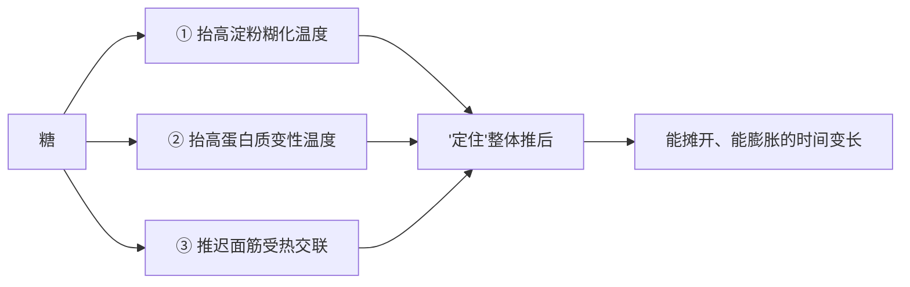
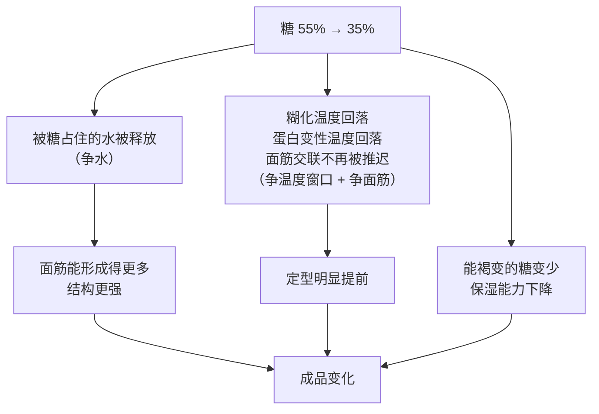

# 第 4 章 思考题参考答案

> 只记「问题 + 正确答案」。案例题给**完整推理链**——
> "它扮演什么角色 → 它在跟谁争 → 定型会提前还是推迟 → 成品怎么变 → 怎么验证"。
>
> 涉及数字的地方，来源见[参考书目与出处登记](../standards.md)。

## Q1

**问**：糖挂在哪四组竞争上？各举一个机制。为什么说"甜"是它最不重要的功能？

**答**：

| 竞争 | 糖在这一组里做什么 | 机制 |
|------|------------------|------|
| **争水** | 把水占住 | [吸湿](../glossary.md#hygroscopicity)；同时降低[水分活度](../glossary.md#water-activity)，于是分给面筋和淀粉的水变少 |
| **争面筋** | 推迟面筋的受热交联 | 一项研究显示蔗糖越多，面筋交联被推迟或抑制得越厉害（以 SDS 可提取蛋白的减少判断） |
| **争温度窗口** | 抬高淀粉糊化温度**与**蛋白质变性温度 | 五项独立研究（含小麦淀粉）测到"糖越多糊化温度越高"；另有 DSC 研究显示蔗糖提高蛋白质变性温度，**低水分下尤其明显** |
| **争气** | 既是酵母的食物，高浓度时又压制酵母；并**稳定打发的泡沫** | 一项全基因组筛选显示高糖对酵母主要是**渗透胁迫**；一项蛋清研究显示蔗糖**让泡沫更难打起来但打起来后更稳定** |

**为什么"甜"最不重要**：

不是说甜不重要——而是说，**甜是唯一一项"改了之后只影响味道"的功能**。
其余四项一旦改动，**成品的形状、质地、颜色、保质期全都跟着变**：

> 减糖之后成品变小、变硬、变干、颜色变浅、发得更快、更不耐放——
> **这些没有一条是"变淡"能概括的。**

而且别的原料最多挂两组竞争，**糖挂四组**。
所以动糖是一份配方里**连锁反应最广**的改动之一。

## Q2

**问**：被糖推迟的三条定型路径是什么？各自的证据？

**答**：

| 路径 | 证据 |
|------|------|
| **① 淀粉糊化温度被抬高** | **五项独立研究**方向一致：甘薯淀粉、西米淀粉、**小麦淀粉**与马铃薯淀粉、木薯淀粉，以及一项用 DSC 测 14 种低聚糖 + 阿洛酮糖 + 蔗糖（0~60% w/w）对**小麦淀粉**糊化温度的研究。效应顺序大致是蔗糖 > 葡萄糖 > 果糖 / 甘油 |
| **② 蛋白质变性温度被抬高** | 两条独立证据：一项 DSC 研究比较蔗糖与海藻糖，发现**含蔗糖的样品变性温度更高，且低水分条件下尤其明显**（溶菌酶、肌红蛋白）；一项液态蛋黄研究发现加 4% 复合糖可把**变性温度提高到 77 °C 以上** |
| **③ 面筋受热交联被推迟** | 一项专门研究蔗糖对饼干中面筋功能的工作：蔗糖越多，交联被推迟或抑制得越厉害，于是**饼干定型更晚、直径更大** |

> **要带走的判断**：**糖是"定型时刻"的总开关。**
> 第 1 章说"什么时候定住决定了成品长什么样"，
> 而糖是**同时**推迟三条定型路径的那一个原料。
> 所以改糖改的从来不只是甜度，**是整个成品的形状**。

## Q3

**问**：为什么蔗糖不能直接参与美拉德反应？这对"换糖就换颜色"意味着什么？

**答**：

**因为[美拉德反应](../glossary.md#maillard)需要的是"氨基酸 + 还原糖"，而蔗糖不是还原糖。**

蔗糖要先分解成葡萄糖和果糖（也就是[转化糖](../glossary.md#invert-sugar)）之后，
其中的葡萄糖、果糖才能参与。

**两条褐变路径要分开记**：

| | 美拉德反应 | [焦糖化](../glossary.md#caramelization) |
|---|----------|---------------------------------|
| 需要 | 氨基酸 **+ 还原糖** | **只要糖** |
| 蔗糖能否直接参与 | ❌ | ✅ |
| 在烘焙里的表现 | 面包皮、饼干边、蛋糕表面的香气与颜色主力 | 高糖、高温处的焦糖风味 |

**对"换糖就换颜色"的意义**：

> **换糖 = 换掉"现成可用的还原糖有多少"，所以上色速度直接变。**

有实验直接测到了这件事：一项在饼干配方里比较**蔗糖、转化糖与三种高果糖浆**的研究发现：

- **亮度 L\* 最高（颜色最浅）**的是蔗糖对照与转化糖样品；
- **高果糖浆用量增加，L\* 显著下降**（颜色更深）；
- 各组的水分、脂肪、蛋白质、灰分**没有显著差异**——
  说明差别确实来自糖的种类，不是来自成分含量。

**实用推论**：

| 你的问题 | 该怎么办 |
|---------|---------|
| 上色太浅 | 用一小部分**还原糖**（葡萄糖、转化糖、蜂蜜）替代蔗糖 |
| 上色太快、外面深了里面还没熟 | 反过来——**减少还原糖**，或降低炉温延长时间 |

> ⚠️ 广为流传的"美拉德反应从 140~165 °C 开始"这个数字**缺乏可靠一手出处**，
> 本书不写它。能负责任地说的是方向：**温度越高越快，而且表面必须先失水**。

## Q4

**问**：曲奇配方（面粉 100%、黄油 60%、细砂糖 55%、蛋 20%、盐 1%、小苏打 0.5%，
**以面粉总量为 100%**），糖减到 35%。（a）预测四方面变化；
（b）小苏打会不会受影响？（c）只想保住颜色，最省事的一刀切在哪？

**答**：

**（a）四方面预测**

**推理链先走一遍**：

| 方面 | 预测 | 依据 |
|------|------|------|
| **形状** | **摊得明显更小、更厚** | 定型提前 → 可摊开的时间变短。一项饼干研究直接观察到蔗糖越多、定型越晚、直径越大 |
| **质地** | 更硬、更有韧劲，不再"一咬就断" | 释放出来的水给了面筋；同时糖本身对结构的削弱作用变小 |
| **湿润度** | **更干，而且第二天明显更硬** | 失去糖的吸湿保湿 |
| **颜色** | **更浅** | 能参与褐变的糖变少 |

> 注意这份配方的黄油是 60%、糖原本 55%——**这是一份"高糖高油、以酥为目标"的配方**。
> 减糖 20 个百分点等于把它往"硬饼干"的方向推了一大步。

**（b）小苏打会受影响吗——会，但要说清是哪一条**

| 会 / 不会 | 说明 |
|----------|------|
| **产气量本身**：基本不受糖量影响 | 小苏打（碱）产气取决于**配方里有没有足够的酸**，以及温度。糖不是它的反应物 |
| **产气的"留得住留不住"**：会受影响 | 定型提前意味着结构更早固定——气有可能**还没膨胀完就被关住**（这一次是"定得早 → 高而不摊"） |
| **颜色**：会受影响，而且是**叠加**的 | 这份配方里的碱如果没有被酸完全中和，本来就会让颜色偏深；现在糖少了、褐变减弱，两个方向相反的效应叠在一起，**颜色变化可能比你预期的小或大**，不好预测 |
| **风味**：可能暴露问题 | 糖多的时候，一点点碱味会被甜掩盖；糖一减，如果碱有剩余，**涩味 / 碱味会更容易被尝到** |

> **所以（b）的正确答案不是"会"或"不会"，而是**：
> 小苏打的**产气**不受糖量直接影响，但**保气、颜色与风味**都会被连带影响。
> 如果减糖后吃出涩味，**先怀疑酸碱配平**，而不是怀疑小苏打坏了（第 13 章）。

**（c）只想保住颜色，最省事的一刀**

> **把减掉的糖里拿出一小部分，换成还原糖**（葡萄糖粉最干净；转化糖、蜂蜜也行）。

| 做法 | 为什么 | 代价 |
|------|--------|------|
| 例如糖 35% 中留 5 个百分点给葡萄糖 | 还原糖**直接参与**美拉德反应，一点点就能把颜色拉回来 | 甜度会略升；葡萄糖抬高糊化温度的能力**弱于蔗糖**，所以对形状的补偿有限 |
| 备选：提高炉温或延长最后的上色段 | 让表面更快失水、越过沸点 | ⚠️ **风险大**：容易外深里生，而且会增加失重、让成品更干（第 3 章） |
| ❌ 不推荐：靠"多烤一会儿" | 同上，且它同时改了两个变量 | |

> ⚠️ **如果用蜂蜜或糖浆，必须把它带进来的水从配方里扣掉**（第 3 章），
> 否则你就同时改了糖和水两个变量。

## Q5

**问**：甜面包糖从 25% 加到 35%，结果**发得更慢**、颜色深得发黑、里面没熟透。
解释三个现象，给出两条改法。

**答**：

**三个现象，三条不同的机制**：

| 现象 | 机制 | 属于哪一组竞争 |
|------|------|--------------|
| **发得更慢** | 高浓度糖对酵母是**渗透胁迫**——把水从细胞里拉出去。一项全基因组筛选显示，对高蔗糖敏感的酵母突变体**绝大多数同时对高浓度氯化钠或山梨醇敏感**，说明这主要是渗透问题而不是"糖有毒"。**"加糖喂酵母"在这个浓度区间正好是反方向** | **争气 + 争水** |
| **颜色深得发黑** | 糖多 → 可参与褐变的原料多 → 表面褐变更快。同时糖抬高糊化温度、推迟定型，表皮形成的节奏也变了 | **争温度窗口** |
| **里面没熟透** | 这是前两条的**合并后果**：①发得不够（组织紧实、导热慢、体积小但密度高）；②表面提早深色，让人以为烤好了就提前出炉。⚠️ 另外，面包芯**不会越过水的沸点**——表面颜色和内部熟没熟本来就是两条线 | 综合 |

> **注意这三个现象是一条链，不是三个独立故障。**
> 加糖 10 个百分点 → 发酵变慢 → 同样时间下发得不足 →
> 同时表面更容易深 → 按颜色判断出炉 → 里面没熟。

**两条改法**

**改配方的一条**：

> **把糖退回去，或者换用适合高糖环境的酵母。**
>
> 行业旁证：商品酵母是**按用途分型出售**的——一项研究测试了四株商品压榨酵母，
> 分别被推荐用于可颂类、面包、冷冻面团、意式节庆蛋糕，
> 结果证实它们在不同的复杂面团配方里**技术表现确实不同**。
> ⚠️ 本书**没有核到**"糖到多少百分比就必须换酵母"的阈值，**所以不给阈值数字**——
> 但"高糖配方要用对酵母"这件事本身是有依据的。

**改操作的一条**：

> **别按颜色决定出炉，改按内部状态 / 温度判断；并且给发酵更多时间。**
>
> 具体两步：
> ① **发酵看状态不看时间**——加了糖的面团需要更久，照抄原来的时间必然不足；
> ② **上色段做遮盖**——表面颜色到位后盖锡纸 / 降温继续烤，
> 让内部有时间熟透。判据见第 32 章（本书主张**用内部温度与状态判据，不是只看时间**）。

## Q6

**问**："代糖可以按甜度 1:1 换算顶替砂糖"——判断证据强度，
列出至少四项它补不上的功能，说明"补甜度"这个思路为什么本身就错。

**答**：

**判定：❌ 从工艺角度明确错误。**（本书**不评价营养与健康**，只讲工艺与代价。）

**它补不上的功能（至少四项，实际是五项）**：

| # | 补不上的功能 | 后果 |
|---|------------|------|
| 1 | **体积 / 质量** | 高强度甜味剂用量以毫克到克计。原来那 50 g 糖占的**位置和重量没了**，面糊的稠度、烘焙百分比的分母关系全变 |
| 2 | **吸湿保湿** | 成品更干、放一天就硬 |
| 3 | **抬高糊化温度（也就是推迟定型）** | 成品摊不开、更小更厚、质地更硬 |
| 4 | **上色** | 颜色明显更浅（没有可参与美拉德或焦糖化的糖） |
| 5 | **喂酵母 / 稳定泡沫** | 酵母配方发酵行为变；打发类泡沫更不稳 |

第 3 项有一条直接证据：一项用 DSC 测 14 种低聚糖、阿洛酮糖与蔗糖
（0~60% w/w）对**小麦淀粉**糊化温度影响的研究，开篇就写道：
**蔗糖抬高糊化温度的能力强于许多甜味剂，而"减糖的同时维持较高的糊化温度"一直是个难题。**
该研究的发现是**某些低聚糖抬得比蔗糖还高**——
这恰恰说明：**替代品能不能顶上，取决于它有没有这项功能，而不是取决于它多甜。**

**为什么"补甜度"这个思路本身就错**：

> 因为**甜是糖在配方里最不重要的那一项功能**（§4.1、Q1）。
> 按甜度换算，等于**只补了你最不需要补的那一项**，
> 而把另外四项全丢了。
>
> **正确的思路是"按功能补"**：
>
> 1. 先问这份配方**依赖糖的哪几项**（饼干靠推迟定型；戚风靠稳定泡沫；
>    甜面包靠保湿 + 喂酵母）；
> 2. **只补那几项**——例如用某些低聚糖补糊化温度、用一点还原糖补颜色、
>    用油脂补保湿与口感；
> 3. 其余的**接受它变**，并把变化记录下来。

> **要带走的判断**：任何"等量替换"之前，先列出被替换物**承担几个功能**。
> 这是第 1 章 Q4（黄油换油）的同一条原则，在糖上的又一次应用。

## Q7

**问**："上色不够就是糖放少了"——判断证据强度，说出另一个常见原因，设计对照。

**答**：

**判定：⚠️ 只说中了两个原因中的一个。**

**两个原因**：

| 原因 | 机制 | 典型场景 |
|------|------|---------|
| **① 能参与褐变的糖不够** | 美拉德反应需要**还原糖**，而蔗糖不是还原糖 | 减糖配方、只用蔗糖的配方 |
| **② 表面没有干下来** | 褐变只在表面发生，因为**只有表面能越过水的沸点**（面包芯不会越过沸点；一项吐司研究里表皮达 128.5~190.2 °C）。一项研究观察到**水分活度降到 0.4 以下是临界点**，越过后 HMF 生成速率急剧上升 | 炉温偏低、炉内太湿、模具太深挡热、面糊含水量太高、烤盘塞太满 |

**在家能做的对照实验设计**

目标：**区分"缺还原糖"和"表面太湿"**。

| 组 | 怎么做 | 它在检验什么 |
|----|--------|------------|
| ① 原配方 | 基准 | 参照系 |
| ② 原配方，**把一小部分蔗糖换成等重的葡萄糖**（或刷一层稀薄的蜂蜜水） | 只动"还原糖" | 如果 ② 明显变深 → **原因是缺还原糖** |
| ③ 原配方，**炉温提高一档 / 挪到更靠近上火的位置 / 最后几分钟开一下门放湿气** | 只动"表面能不能干" | 如果 ③ 明显变深 → **原因是表面太湿** |
| ④（可选）原配方，但**烤盘里少放一半的量** | 只动"炉内湿度与热流" | 同 ③ 的方向，且更安全 |

**必须固定的**：面团 / 面糊配方与重量、厚度、烤盘、位置、时间；
颜色判断要在**同一光线**下拍照对比（肉眼对颜色的记忆非常不可靠）。
记录进[烘焙记录表](../forms/bake-log.md)。

> ⚠️ **局限**：颜色靠肉眼 / 手机拍照判断，没有色差仪；样本量小；
> 第 ③ 组改炉温其实同时改了内部熟度。所以它只能**给你方向**，
> **不能**证明定量关系。
>
> ⚠️ **安全**：不要为了看颜色频繁开炉门——掉温会让结果更乱，也有烫伤风险。

## Q8

**问**：挑两处"本书未核到"的地方，说明硬写一个专业数字的代价。

**答**：

**可选的三处**（答出任意两处即可）：

| 处 | 本书怎么写的 | 硬写数字的代价 |
|----|------------|--------------|
| **蜂蜜的含水量与酸度** | 只说"它带水、含还原糖、带酸度"，要求读者**看手上那瓶的标签** | 蜂蜜的含水量随品种、产地、年份、有没有加工差别很大。本书若写"蜂蜜含水 17%，按此扣减配方用水"，读者会照着扣——**而扣错水是第 3 章讲过的、连锁反应最广的一种错**：面团稠度错 → 结构错 → 定型时刻错 → 成品全错，而且他**到最后一步才发现** |
| **红糖的吸湿性与酸度数值** | 只说"通常更吸湿、颜色更深、风味更重"，不写数字 | "红糖带酸，所以可以配小苏打"这类说法如果被写成一个具体的换算（例如"每 10 g 红糖可中和多少小苏打"），读者会据此调整膨松剂用量。**酸碱配平错了的后果是留下涩味和偏深的颜色**，而且他会归因到"小苏打不好"，不会怀疑那条换算 |
| **糖的颗粒大小对打发充气的影响** | 不给"必须用哪种糖打发"的结论 | 如果本书写"打发必须用细砂糖，糖粉打不发"，读者会**放弃本来可行的做法**，或者在失败时归因到糖的种类——而真正的原因可能是盆里有油、蛋温不对、转速不对。**一个假的因果会挡住真的排查方向** |

**统一的道理（和第 1 章 Q9、第 2 章 Q8、第 3 章 Q8 是同一条）**：

> **假数字比"没有数字"更贵。**
>
> - "没有数字"的代价：读者得自己查一次标签、自己试一次；
> - "假数字"的代价：读者**不再查、不再试**，而且失败时**归因错方向**。

**本章特别要强调的一点**：

> 糖这一章的数字诱惑特别大——因为烘焙圈流传着大量"黄金比例"
> （糖油比多少、糖粉比多少）。这些比例在**某一类成品上**确实成立，
> 然后被推广到了全部。
>
> 本书的处理方式是：**给机制（糖挂在四组竞争上）、给方向（定型会提前）、
> 给方法（小步 + 单变量 + 记录）**，
> 而把"具体多少"留给你自己的厨房——因为那个答案本来就因粉、因炉、因口味而异。
