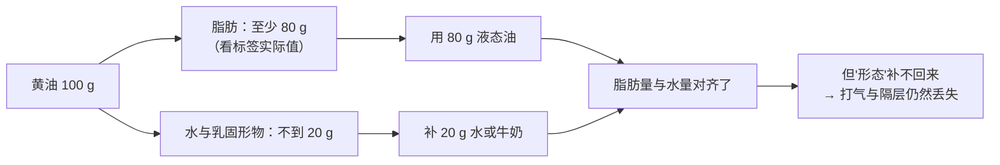
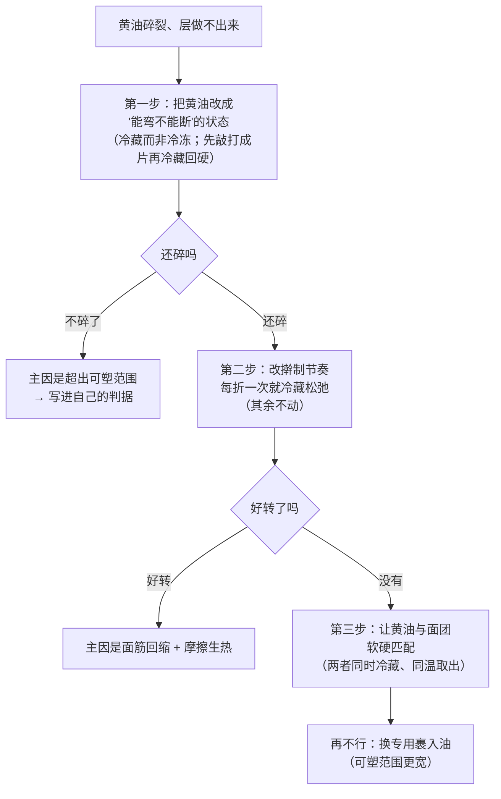

# 第 5 章 思考题参考答案

> 只记「问题 + 正确答案」。案例题给**完整推理链**——
> "它扮演什么角色 → 它在跟谁争 → 定型会提前还是推迟 → 成品怎么变 → 怎么验证"。
>
> 涉及数字的地方，来源见[参考书目与出处登记](../standards.md)。

## Q1

**问**：为什么说油脂是"反结构"的角色？它阻断的是什么？
为什么英文用 shortening 同时指作用和产品？

**答**：

**它阻断的是面筋网络的"连续性"。**

机制很朴素：油脂裹在面粉颗粒与蛋白质表面，
**妨碍它们互相连接成连续的[面筋](../glossary.md#gluten)网络**，
于是口感从"韧、有嚼劲"变成"酥、一咬就断"。

把它放进本书的角色表里看得最清楚：

| 角色 | 对结构做什么 |
|------|------------|
| 面粉 | **提供**结构材料 |
| 水 | 让结构材料**能用** |
| 蛋 | **补充**结构 |
| 糖 | **推迟**结构定住的时刻 |
| **油脂** | **阻断**结构的形成 |

**为什么同一个词既指作用又指产品**：

英文 **shortening** 这个词本身就是"使变短"的意思——
指的是让面筋的连续长度变"短"。
因为这个功能实在太核心，行业干脆把专门干这件事的产品也叫 shortening（起酥油）。
**一个功能重要到被拿来当产品名，本身就是一条信息。**

> ⚠️ **必须带上的保留**：脂质在面团里的**机理**学界尚无定论——
> 一篇面包脂质综述明确写道，关于脂质功能，**被广泛接受的观点常常互相对立**。
> 所以上面这段讲的是**方向与现象**，不是定论。

## Q2

**问**：固态脂肪能做而液态油做不到的三件事是什么？哪一件是起酥（千层）的前提？

**答**：

| # | 只有固态脂肪能做 | 依据 / 说明 |
|---|----------------|-----------|
| **①** | **被打进空气**（打发法、乳化法） | 一项 X 射线显微 CT 研究发现：油脂用量增加时**孔隙率与气孔尺寸增大，但气孔壁厚度不受影响**，研究者据此判断油脂主要是在**把空气带进去** |
| **②** | **隔出层** | ⭐ **这就是起酥 / 千层的前提**——必须建立面团与油脂交替的多层结构。液态油会被面团**直接吸收**，层就不存在了 |
| **③** | **熔化有一个温度区间，因而在炉子里"慢慢让位"** | 它决定了面团在**哪一刻**失去固体支撑。一项用 36 种蜡—油油凝胶替代饼干起酥油的研究发现：熔点最高的**巴西棕榈蜡**油凝胶让饼干**质地更强**，**蜂蜡**油凝胶让饼干**摊得更开、硬度更低** |

**第 ② 件是起酥的前提。**

一篇多层面团—油脂体系的综述指出：关键是建立面团与油脂交替的多层结构，
并在加工中**维持它**，以便烘烤时靠蒸汽把层撑开。
一篇可颂研究里给出了一个**写明基准**的参考值：
**裹入油可达面团重量的 35%**（基准：以面团重量计），
并直接写道：**不饱和油在室温下是液态的，无法提供固态脂肪的工艺功能。**

> **分清两个词**：
> **"起酥"（有层）** 必须靠固态脂肪隔开；
> **"酥松"（口感短）** 只需要阻断面筋，液态油也能做到一部分。
> 看到配方写"黄油冷藏、动作要快"，它要的是前者。

## Q3

**问**：100 g 黄油换成 100 g 色拉油，至少改了哪三件事？

**答**：

| # | 改了什么 | 算给你看 / 后果 |
|---|---------|---------------|
| **① 脂肪量变多了** | 按美国法律定义，黄油的**乳脂不低于 80%**。所以 100 g 黄油里**至多**只有 100 g、**至少**有 80 g 是脂肪；而 100 g 色拉油基本是 100 g 脂肪 | 脂肪多出约两成 → **面筋被阻断得更彻底 → 结构更弱、摊得更开** |
| **② 水少了**（⭐ 这一条对应第 3 章） | 黄油里不到 20% 的部分是**水与乳固形物**。换成油，这部分水**凭空消失** | 配方整体含水量下降 → 面团更干、更硬；面筋和淀粉分到的水更少 |
| **③ 形态变了**（固态 → 液态） | 液态油**打不进空气、隔不出层** | 成品更扁、更瓷实、内部气孔更少；如果原配方是起酥类，**层直接没了** |

**还有一件常被忘的第四件**：

| ④ 风味与褐变 | 黄油的乳固形物带来奶香，并参与褐变 | 成品香气与颜色都会变 |

**正确的做法（如果一定要换）**：

> **要带走的判断**：**"等量替换"这个说法本身就有问题。**
> 先把它拆成"脂肪量 / 水量 / 形态 / 风味"四项，
> 再看哪几项你能补、哪几项补不了。

## Q4

**问**：曲奇配方（面粉 100%、黄油 55%、糖 45%、蛋 15%、泡打粉 1%，
**以面粉总量为 100%**）。甲用冷硬黄油切块，乙用完全融化的，丙用能压出指印的打发。
（a）预测三者的直径、厚度、气孔差别；（b）丙气孔最多与哪项研究一致？
（c）甲的做法有没有可能是对的？

**答**：

**（a）三组预测**

先建立机制：黄油的状态决定了**两件事**——
**能不能带进空气**，以及**面团在入炉时有多软**。

| 组 | 黄油状态 | 直径 | 厚度 | 内部气孔 | 机制 |
|----|---------|------|------|---------|------|
| **甲** | 冷硬切块搓入 | **最小** | **最厚** | 少，但可能有**不规则的空隙** | 黄油以颗粒形式存在，入炉时面团最硬、最晚开始摊开；黄油熔化后在原地留下空隙 |
| **乙** | 完全融化 | **最大** | **最薄** | **最少** | 晶体网络已不存在——打不进空气，且面团在入炉前就很软，**很早就开始摊开**，定型之前已经铺开了 |
| **丙** | 指印状固态 + 打发 | 中等 | 中等 | **最多、最均匀** | 打发把空气打进了固态脂肪的晶体网络里 |

> 这份配方黄油 55%、糖 45%，是一份**以"酥"为目标**的高油高糖配方。
> 糖 45% 本来就会推迟定型（第 4 章），所以乙那组的"摊"会被进一步放大——
> **两个变量同向叠加**。

**（b）与哪项研究一致**

与那项**X 射线显微 CT** 研究一致：
它发现油脂用量增加时**孔隙率与气孔尺寸增大，但气孔壁厚度不受影响**，
研究者据此判断**油脂主要是在把空气带进去**，而不是改变面团本身的性质。
丙组把这件事做到了最充分（固态 + 打发），所以气孔最多。

> ⚠️ 注意这项研究改的是**油脂用量**，本题改的是**油脂状态**。
> 两者指向同一个机制（油脂带气），但**不是同一个实验**——
> 本书在这里用的是机制上的一致性，不是直接的实验复现。

**（c）甲的做法有没有可能是对的**

**有——而且在某类成品上它才是唯一正确的做法。**

| 目标 | 甲的做法为什么对 |
|------|---------------|
| **要"酥松成片"的口感**（司康、酥饼、派皮一类） | 冷硬黄油以**颗粒**形式存在，烤时熔化在原地留下空隙，形成片状、粗糙的酥松口感——这和打发得到的"细密均匀气孔"是**两种不同的酥** |
| **不想让饼干摊开** | 面团最硬、最晚软化，直径最小、厚度最大 |
| **手上没时间等黄油回温** | 搓酥法本来就要求黄油是冷的 |

> **要带走的判断**：**没有"正确的黄油状态"，只有"对应目标的黄油状态"。**
> 问题永远是那一句：**这份配方要黄油干什么？**

## Q5

**问**：做可颂时黄油裂成块、层看不出来、成品像面包。
已知：黄油刚从冷冻室拿出、厨房很凉、一次擀到位没中途冷藏。
（a）三条可能原因属于哪一组竞争；（b）排查顺序，以及为什么"再冷一点"不是正解。

**答**：

**（a）可能原因**

| # | 可能原因 | 属于哪一组竞争 | 机制 |
|---|---------|--------------|------|
| **1** | **黄油太硬，超出了可塑范围** | **争面筋 / 争气**（层是关气的结构） | 起酥要的是"保持成层"。太软会被面团吸收，**太硬则会碎裂成块**——层一断，蒸汽就没有连续的层可顶（第 15 章）。⭐ 这是嫌疑最大的一条 |
| **2** | **黄油与面团的软硬不匹配** | 同上 | 裹入的关键是两者**在同一个温度下软硬相近**。厨房很凉时黄油更硬、面团相对更软，一擀就"面团跑了、黄油碎了" |
| **3** | **一次擀到位，没有中途冷藏松弛** | **争面筋** | 连续擀压会让面筋被拉紧并回缩，同时摩擦生热让黄油局部变软——**两头不讨好**。层数越多越需要中途休息 |
| **4** | **裹入油本身的性质** | 争温度窗口 | 一项研究指出 **β′ 晶型是烘焙应用中受偏好的晶型**；另一项提醒**机械塑化会对裹入油的质地产生不利影响**。普通家用黄油不是为裹入设计的，可塑范围更窄 |

**（b）排查顺序**

**为什么"再冷一点"不是正解**

> 因为**"碎裂"是"太硬"的症状，不是"太软"的症状**。

很多人看到层做不出来，第一反应是"一定是黄油化了"，于是往更冷的方向走——
**这会让问题更严重**。正确的判据不是温度计，是**手感**：

| 状态 | 判据 | 能不能用 |
|------|------|---------|
| 太硬 | 弯一下就**断**、敲上去**脆响** | ❌ 会碎成块 |
| **刚好** | **能弯不能断**；用力按能变形但不出油 | ✅ |
| 太软 | 一按就出油、发黏、贴手 | ❌ 会被面团吸收 |

> ⚠️ 本书**没有核到**家用黄油的固体脂肪含量—温度曲线，
> 因此**不给任何温度数字**。给的是判据，而判据在你自己的厨房里永远比数字准确。

> **要带走的判断**：**症状要先分诊，再归因。**
> "太硬"和"太软"会导致同一个结果（层做不出来），
> 但要用**相反**的办法解决——这和第 2 章"缩回去 vs 摊成一滩"是同一种陷阱。

## Q6

**问**："只要脂肪含量一样，用什么脂肪都一样"——判断证据强度，
用一项研究反驳，并说明它指向哪一组竞争。

**答**：

**判定：❌ 明确错误。**

**反驳它的研究**：

> 一项用 **36 种**不同蜡与植物油做成的油凝胶替代饼干中起酥油的工作发现：
>
> - **巴西棕榈蜡油凝胶**（熔点最高）→ 饼干**质地更强**；
> - **蜂蜡油凝胶** → 饼干**摊得更开、硬度更低**。

在这些样品里，脂肪的**含量**是对齐的（都是替代起酥油），
**变的是它什么时候熔化**。结果成品的摊开与硬度就不同。

**它指向第 1 章的哪一组竞争**：

> **争温度窗口。**

推理链：

这和第 4 章的糖是**同一条链子上的两只手**：
糖推迟"定住"的温度，脂肪决定"什么时候不再撑着"。

**还有一条更基础的旁证**：一篇综述指出，脂质会
**改变烘烤时面筋变性与淀粉糊化的温度**——
也就是说，脂肪不仅自己有熔程，还会**移动别人的定型温度**。

> **要带走的判断**：营养标签上的"脂肪 X 克"**不是一个工艺参数**。
> 工艺上要问的是：**它在什么温度下是固体？什么时候化掉？它是什么晶型？**

## Q7

**问**："油放得越多越酥"——判断证据强度，说明成立范围与越界后的问题，设计对照。

**答**：

**判定：⚠️ 在一定范围内成立，但它同时改了别的事。**

**成立的部分（有依据）**：

- 一项研究在特定范围内观察到：**糖或油脂越多，饼干直径越大、厚度越小**；
- 同一研究用 X 射线显微 CT 显示，**油脂主要影响孔隙率与气孔大小**
  （气孔壁厚度不受影响）。

⚠️ 该研究摘要**未写明百分比的基准**（面粉还是总面团），
所以本书**只用方向，不引用绝对数字**。

**越过范围之后会出什么问题**：

| 问题 | 机制 |
|------|------|
| **面团太软，无法成型** | 固态脂肪多了，室温下就塌；整形变得几乎不可能 |
| **摊得太开、变成一片薄饼** | 结构被阻断得太彻底，撑不住 |
| **出油 / 分层** | 油脂超过面团能"容纳"的量，烘烤时渗出 |
| **"酥"变成"散"** | 完全没有结构，一碰就碎、拿不起来 |

> **关键在于"酥"和"没有结构"是一条连续曲线上的两段**。
> 你要的是曲线上的一个点，不是它的极值。

**在家能做的对照实验**

| 组 | 油脂百分比（**以面粉总量为 100%**） | 目的 |
|----|--------------------------------|------|
| ① | 原配方（例如 50%） | 基准 |
| ② | +10 个百分点（60%） | 看"更酥"到哪 |
| ③ | +20 个百分点（70%） | 看什么时候开始"散"、开始出油 |
| ④（可选） | −10 个百分点（40%） | 看另一个方向 |

**必须固定的**：面粉、糖、蛋、盐、膨松剂的克数；黄油的**状态**（统一用指印状固态）；
每块面团重量、厚度、烤盘位置、炉温、时间；各组**同时进炉**并做好标记。

| 记录项 | ① | ② | ③ | ④ |
|--------|---|---|---|---|
| 面团能不能成型（易 / 难 / 不能） | | | | |
| 出炉直径（mm） | | | | |
| 出炉厚度（mm） | | | | |
| 烤盘上有没有渗出的油 | | | | |
| 口感（酥 / 散 / 硬） | | | | |
| **能不能完整拿起来** | | | | |

> 最后一行是本实验的**真正判据**——"散"和"酥"的分界就在那里。
>
> ⚠️ **局限**：样本量小、没有重复、口感靠主观判断、
> 改油脂百分比同时改变了面团的总重与厚度控制难度。
> 它给你的是**你这份配方的上限在哪**，**不是**一条通用规律。

## Q8

**问**：本章用"手指判据"代替黄油温度数字，读者**多了**什么、**少了**什么？

**答**：

**先说清本章有三处保留**：

| 处 | 本书怎么写的 |
|----|------------|
| 脂质在面团里的机理 | 明说"被广泛接受的观点**常常互相对立**"（引自一篇面包脂质综述） |
| 蒸汽把起酥层顶开的机制 | 明说综述指出"**确切机制目前仍不清楚**" |
| **家用黄油的固体脂肪含量—温度曲线** | ⚠️ **未核到**可引用数据，因此**不给温度数字**，改用手指判据 |

**用判据代替数字，读者多了什么**：

| 多了 | 为什么 |
|------|--------|
| **一个在自己厨房里永远成立的标准** | 判据测的是**你手上这块黄油此时此刻的状态**，而温度数字测的是"温度"——温度只是状态的一个**代理变量**，而且是个不完整的代理（同样的温度下，不同品牌、不同处理方式的黄油软硬可以差很多） |
| **不需要任何设备** | 手指是免费的、随身的、不会不准 |
| **一个可以传递的动作** | "能留下清晰指印、不粘手、不出油"是可复现的描述；"多少 °C"在没有温度计的厨房里是无法执行的 |
| **一个不会被季节骗到的方法** | 夏天和冬天的"室温"完全不是一回事。判据自动适应，数字不会 |

**少了什么（必须诚实说）**：

| 少了 | 代价 |
|------|------|
| **可比较性** | 你没法把"我的黄油状态"告诉另一个人并让他精确复现；两个人的"指印"感受不完全一样 |
| **可记录性** | 温度是一个数，能写进[烘焙记录表](../forms/bake-log.md)、能画曲线；"能压出指印"不好量化，回看记录时信息更少 |
| **可自动化** | 没法交给定时器或温控设备 |

**本书为什么仍然选判据**：

> 因为**一个不准的数字比一个模糊的判据更危险**。
>
> - 模糊判据的代价是：读者要多练两次手感，**而且他知道自己在练**；
> - 假数字的代价是：读者**照着做、失败、然后怀疑自己**——
>   他不会怀疑那个写在书上的温度。
>
> 这和第 1 章 Q9、第 2 章 Q8、第 3 章 Q8、第 4 章 Q8 是**同一条纪律**。

**能不能两者都要？能——靠你自己。**

> 本章的 🅐 任务三（指印测试）就是干这个的：
> 你按判据判断状态，同时**顺手记下时间和当天气温**。
> 做几次之后，你就有了**一张属于你家厨房的对照表**——
> 它比任何书上的通用数字都准确，因为它是在你的条件下测出来的。
