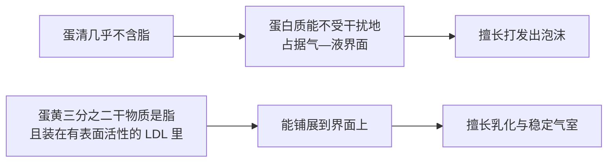
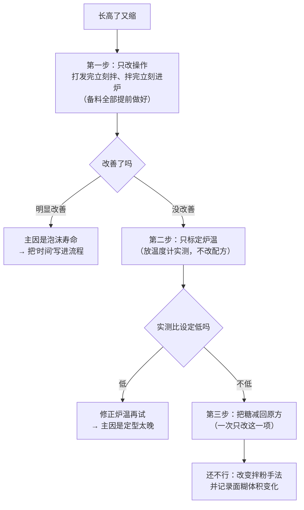

# 第 6 章 思考题参考答案

> 只记「问题 + 正确答案」。案例题给**完整推理链**——
> "它扮演什么角色 → 它在跟谁争 → 定型会提前还是推迟 → 成品怎么变 → 怎么验证"。
>
> 涉及数字的地方，来源见[参考书目与出处登记](../standards.md)。

## Q1

**问**：为什么说蛋是七个角色里最难替换的一个？
用"功能"而不是"营养"回答，并举出至少两项研究作为依据。

**答**：

**因为它一个人干四件事，而替换品通常只能顶其中一两件。**

| 蛋提供的功能 | 谁在提供 |
|------------|---------|
| **水** | 蛋整体（主要是水） |
| **气**（起泡） | 蛋清蛋白 |
| **乳化 / 界面稳定** | 蛋黄，尤其是其中的低密度脂蛋白 |
| **结构**（受热成胶） | 蛋清与蛋黄的蛋白质 |

**两项（这里给三项）依据**：

| 研究 | 它证明了什么 |
|------|------------|
| 一项 2024 年的研究统计到全球约 **102 种**蛋替代产品（约 20 种宣称可用于烘焙），挑出 10 种在磅蛋糕里做对照 | **全部与全蛋对照有显著差异**——"能用"不等于"一样" |
| 一项 2026 年的研究系统比较 **14 种**植物蛋白原料在磅蛋糕中的表现 | **没有一种能完整匹配蛋的多功能性** |
| 一篇 2026 年的综述 | 蛋提供**起泡、乳化、凝胶**三类功能并由此形成结构；替换之所以难，正是因为这几项功能与它和其他原料的相互作用**尚未被完整拆解**，而多数研究是在简化模型体系里做的 |

> **要带走的判断**：**替换的难度 = 它同时承担的功能数。**
> 这也解释了为什么油脂（1~3 件事）比蛋好换，而水（1 件事，但影响所有人）最难算。

## Q2

**问**：蛋清与蛋黄在成分上的最大差别是什么？由此能推出它们各自擅长什么？

**答**：

**最大的差别是脂。**

| | 蛋清 | 蛋黄 |
|---|------|------|
| 脂质 | 一项海绵蛋糕研究写明：**可以忽略** | 同一研究：**干物质约三分之二是脂质** |
| 脂质的形态 | — | 多数装在**低密度脂蛋白（LDL）**里，**有表面活性** |
| 由此擅长 | **起泡**（蛋白质能在气—液界面展开成膜）、受热**成胶**（卵白蛋白提供巯基，形成牢固凝胶） | **稳定界面**（乳化、保住气室）、带来颜色与风味 |

**推理链**：

> **所以分蛋配方不是仪式感**：写"蛋黄 2 个 + 蛋清 3 个"的配方，
> 是在**分别点名**要这两种能力，而且要的比例不同。

## Q3

**问**：拆散蛋黄 LDL 后，受影响的是充气与气室稳定性而不是定型时刻。
这条结论为什么重要？它推翻了哪一条常见说法？

**答**：

**它推翻的是"蛋黄只是为了颜色和风味"。**

**这项研究的设计为什么干净**：研究者用乙醇处理**定向拆散**蛋黄里的低密度脂蛋白，
再拿去做海绵蛋糕，然后分阶段看**哪一步被影响**：

| 观察的环节 | 拆散 LDL 之后 |
|-----------|-------------|
| 搅拌时能打进多少空气 | **受影响** |
| 搅拌后气室稳不稳 | **受影响** |
| 烘烤时**什么时候定型、定到什么程度** | **基本不受影响** |

**为什么这条结论重要**——它把蛋黄放进了本书的角色表里：

| 角色 | 它在管什么 |
|------|-----------|
| 面粉 | 结构材料 |
| 水 | 让材料能用 |
| 糖 | 推迟定型 |
| 油脂 | 阻断结构 + 带入空气 |
| **蛋黄的脂** | **管"气"，而不是管"定型"** |

> **要带走的判断**：**"它在配方里管什么"这个问题，
> 只能靠"把它拿掉 / 改掉，看哪一步变了"来回答，不能靠成分表推。**
> 这项研究就是这么做的，这也是本书 🅑 实操一直在教的思路。

## Q4

**问**：磅蛋糕配方（面粉 100%、糖 100%、黄油 100%、全蛋 100%、泡打粉 1%，
**以面粉总量为 100%**）。把全蛋从 100% 减到 50%，其余不动。
（a）搅拌时与出炉后分别会怎样？（b）要连带改哪两项？（c）这里的蛋在扮演哪几个角色？

**答**：

**先认清这份配方**：面粉、糖、黄油、蛋各 100%，这是一份**四样等量**的经典结构。
它的特点是：**糖和油都极多**（各 100%），所以面筋被压制得很厉害，
**结构主要不是靠面筋，而是靠蛋和淀粉**。

**（a）预测**

| 阶段 | 会发生什么 | 机制 |
|------|-----------|------|
| **搅拌时** | 面糊明显**变稠、变干**，黄油与糖打发后"吃"不进液体，更容易看到**油水分离**或结块 | 蛋主要是水（一项研究所用全蛋液规格为含水 77.5%），减一半蛋就是**减了一半的主要液体**；同时蛋黄的乳化能力也减半，油水更难维持在一起 |
| **进炉后** | 膨胀更少、**组织更紧实**、可能开裂更明显 | 打进去的气少了（蛋清的贡献减半），能稳住气室的界面活性物质也少了 |
| **出炉后** | **更干、更硬、更容易散**；放一天后变硬更明显 | 少了水，也少了受热成胶的结构蛋白；含水量低的成品老化表现更明显（第 45 章） |

**（b）至少要连带改的两项**

| 要改什么 | 改多少 | 为什么 |
|---------|--------|--------|
| **补液体** | 按减掉的蛋重的**七成多**补水或牛奶（用你自己称出来的蛋重算） | 把"蛋当水"的那部分功能补回来——这是**代价最小**的一项 |
| **补乳化 / 接受组织变化** | 要么接受组织变粗，要么改变搅拌方式（例如把糖油打发得更充分、液体分次加入） | 蛋黄的界面活性**没法用水补**；这一项是"补不回来"的那一部分 |

> **还可以考虑的第三项**：既然结构变弱、膨胀变少，
> 可以**略调膨松剂**——但要注意这会改变 pH 与风味（第 8 章），
> **而且它补的是"气"，补不了"结构"**。

**（c）这里的蛋在扮演哪几个角色**

**四个角色它至少占了三个**，从配方本身就能看出来：

| 线索 | 说明它在当什么 |
|------|-------------|
| 配方里**没有水、没有牛奶**，蛋是唯一的液体来源 | **水** |
| 糖 100%、油 100%，面筋几乎被压制 | 结构只能靠蛋与淀粉 → **结构** |
| 油与蛋都很多、传统做法要求"蛋液分次加入避免分离" | **乳化** |
| 有泡打粉，但传统磅蛋糕同时靠糖油打发 | **气**（部分，和油脂共担） |

> **要带走的判断**：**"四样等量"的配方，蛋是受力最重的那一个。**
> 越是高糖高油的配方，蛋被抽掉的后果越严重——因为**没有别人接得住结构**。

## Q5

**问**：戚风"打发成功、入炉长高、出炉缩一半"。记录：打发后隔十几分钟才拌；
糖比原方多三成；炉温没测过。
（a）按"产气—保气—定型"三段列可能原因；（b）排查顺序，以及为什么"多打发一会儿"不一定是正解。

**答**：

**先分诊**：题目里"入炉时明显长高"这句话，已经排除了**产气不足**。
**长高了又缩回去 = 气是有的，问题出在保气或定型。**

**（a）三段排查**

| 段 | 可能原因 | 依据 / 机制 |
|----|---------|-----------|
| **产气** | 基本可以排除（入炉明显长高） | — |
| **保气** | ① **打发后等了十几分钟**——泡沫在倒计时：排液、气室合并、气泡上浮一直在发生 | 一项海绵蛋糕研究指出：面糊黏度越高，排液、气室合并与气泡上浮越少；反过来，**时间越长这些过程走得越远** |
| **保气** | ② 拌入面粉时**消泡**（手法、次数、面糊温度） | 同上 |
| **定型** | ③ **糖多了三成** → 糖抬高淀粉糊化温度、也抬高蛋白质变性温度 → **定型被推迟**，气还在但结构还没立住 | 第 4 章：糖是定型时刻的总开关；本章：糖把蛋黄变性温度推到 77 °C 以上（一项研究） |
| **定型** | ④ **炉温可能偏低**（从没标定过） | 第 29 章：你的烤箱几乎一定不准；温度低 = 定型更晚 |
| **定型** | ⑤ 出炉后**结构还没稳**就受到震动 / 没有及时处理 | 冷却期仍在定型（第 33 章） |

> ⚠️ 注意 ③ 和 ④ **同向叠加**：两者都把"定住"往后推，
> 而泡沫的寿命并没有变长。**这是本题最可能的主因组合。**

**（b）排查顺序**

**为什么"多打发一会儿"不一定是正解**

> 因为**打过头本身也会塌**。

| 打发程度 | 会发生什么 |
|---------|-----------|
| 打不足 | 气少、体积小——但**通常不会"先长高再缩一半"** |
| **合适** | 气足、泡沫有一定寿命 |
| **打过头** | 蛋白质在界面上过度聚集、泡沫**变脆**，拌粉时更容易破、烘烤中更容易崩 |

而且本题的现象（**入炉明显长高**）说明气是够的。
**在气够的情况下加大打发，等于在解决一个不存在的问题，却引入了一个新问题。**

> **要带走的判断**：**先分诊"产气 / 保气 / 定型"，再动手。**
> 这三段是第二、三部分的主线，本题是它的第一次预演。

## Q6

**问**："一滴蛋黄掉进蛋清就打不发了"——判断证据强度，
说明本书为什么既不肯定也不否定，并设计一个在家能做的验证。

**答**：

**判定：⚠️ 缺乏可引用的一手实验（本书未核到）。**

**为什么不否定它**：机制方向是**相容的**。本章引过的研究显示，
蛋黄里大部分脂质装在**有表面活性的低密度脂蛋白**里——
**有表面活性就意味着它会去界面**，而蛋清起泡恰恰依赖蛋白质占据气—液界面。
所以"脂类与蛋白质争界面"这个推理是讲得通的。

**为什么也不肯定它**：本书**没有核到**任何实验告诉我们

- 到底要多少蛋黄才会出问题（"一滴"这个量从哪来的？）；
- 是完全打不发，还是打得慢一点、体积小一点；
- 在加糖、加酸（塔塔粉、柠檬汁）的实际配方里，这个效应还剩多少。

> **本书的处理方式**：把它当成**低成本的谨慎**。
> 分蛋时小心一点几乎不花时间，所以照做无妨；
> 但**真的打不发时不要只盯着这一条**——糖的加入时机、容器是否有油、
> 搅打方式与时间，都在同一张嫌疑名单上。

**在家能做的验证**

| 组 | 处理（其余完全相同） | 目的 |
|----|--------------------|------|
| ① | 干净蛋清 | 基准 |
| ② | 蛋清 + 一小滴蛋黄（用牙签尖蘸，**称重记录**） | 看"一滴"是否真的致命 |
| ③ | 蛋清 + 明显一块蛋黄（例如 1 g，称重） | 看剂量效应 |
| ④ | 蛋清 + 一滴食用油（同样称重） | 区分"是脂的问题"还是"是蛋黄的问题" |

**固定**：蛋清克数、容器（都彻底洗净擦干）、搅打器具与档位、
糖量与加糖时机、环境温度；**同一批蛋**。

| 记录项 | ① | ② | ③ | ④ |
|--------|---|---|---|---|
| 打到"能拉出弯钩"用了多久（秒） | | | | |
| 打到"能立住"用了多久（秒） | | | | |
| 打好后的体积（倒进量杯读） | | | | |
| 静置 10 分钟后底部析出的液体（mL） | | | | |
| **结论：是"打不发"还是"更慢、更少"？** | | | | |

> ⚠️ **局限**：样本量小、没有重复、"一滴"的重量难以精确控制。
> 它能回答的是 **"在我家这套条件下，这条说法有多严重"**，
> 而不是"这条说法对不对"。**但这已经比照搬一句口号有用得多。**

## Q7

**问**："蛋液在 x °C 凝固"——为什么这个问法不成立？
列出至少三个推动凝固温度的因素，读者该用什么判断熟没熟？

**答**：

**因为凝固温度不是蛋的属性，是"蛋 + 这份配方"的属性。**

**至少四个会推动它的因素（前三个有实验依据）**：

| 因素 | 方向 | 依据 |
|------|------|------|
| **pH（加酸）** | 凝得**更快** | 一项研究在 58~72 °C 区间观测蛋黄热凝胶，发现酸化加速凝胶，且**不改变反应的能垒**，而是提高了有效碰撞的频率 |
| **盐** | 凝得**更晚** | 另一项同类研究（66~90 °C 区间）观测到 NaCl 让蛋黄凝胶被推迟 |
| **糖** | 变性温度**更高** | 一项研究给液态蛋黄加 4% 复合糖后把变性温度提到 **77 °C 以上**；另一项 DSC 研究显示蔗糖提高蛋白质变性温度，**低水分下尤其明显** |
| **稀释度**（牛奶、水、其他液体的比例） | 影响方向取决于体系 | 机制推理：蛋白质浓度越低，形成连续网络需要的条件越苛刻。⚠️ 本书**未核到**可引用的定量实验 |

**这和第 4 章是同一个结构**：

> 糖能把**淀粉的糊化温度**推高（第 4 章，五项独立研究），
> 也能把**蛋白质的变性温度**推高（本章，两项独立研究）。
> **"温度阈值会被配方推着走"是本书反复出现的同一条规律。**

**那用什么判断熟没熟**

| 用什么 | 说明 |
|--------|------|
| **官方安全温度**（安全问题） | 美国 FDA：含蛋的菜品应做到 **160 °F**（约 71 °C）并**用温度计确认**；已做熟的蛋类菜品再加热到 **165 °F**（约 74 °C）。⚠️ 各国口径不同，以当地现行发布为准 |
| **状态判据**（品质问题） | 第 32 章的主题：看状态而不是看时间——例如卡仕达"划过勺背留下清晰痕迹"、蛋糕"中心不再晃动、回弹" |
| **你自己的记录** | 把每次的炉温、时间、成品状态记进[烘焙记录与复盘表](../forms/bake-log.md)，几次之后你就有了**你这份配方**的判据 |

> **要带走的判断**：**问"几度"之前，先问"哪个体系"。**
> 一个没有体系的温度数字，在烘焙里几乎总是错的。

## Q8

**问**：本章在安全问题上引官方指引，在"蛋温""一滴蛋黄"上说"没有核到一手实验"。
这两种处理背后是同一条纪律吗？是什么纪律？

**答**：

**是同一条纪律，而且是本书最核心的那一条**：

> ## **数字与结论的强度，必须和证据的强度匹配。**

**把本章的内容按证据强度排一次队，这条纪律就很清楚了**：

| 内容 | 证据类型 | 本书写成什么样 |
|------|---------|--------------|
| 含蛋菜品 160 °F、冷藏 40 °F 以下、生食配方用巴氏杀菌蛋 | **官方指引**（可核到页面） | **照写数字**，并注明是哪一国、各国口径不同 |
| 蛋黄干物质约三分之二是脂、LDL 有表面活性、拆散 LDL 影响充气而非定型 | **同行评议实验** | **写结论**，注明是哪一类研究 |
| 加酸更快凝、加盐更晚凝、加糖抬高变性温度 | **同行评议实验**（多项独立） | **只写方向**，不写单点温度 |
| "蛋要回到室温" | **未核到一手** | 写进辨析栏，标"缺乏证据"，并指出**官方安全指引的方向恰好相反** |
| "一滴蛋黄就打不发" | **未核到一手**，但机制相容 | 写进辨析栏，说明"为什么不否定"和"为什么也不肯定"，并给自测方法 |

**为什么安全这一档要特别严**：

> 因为**代价不对称**。
>
> - 品质问题猜错了：损失一炉，而且你会**立刻看到**结果、可以下次改；
> - 安全问题猜错了：可能伤到人，而且**你不一定看得见**。
>
> 所以本书对安全数字只接受**官方来源**，并且永远写明"各国口径不同、以当地现行发布为准"。

**为什么"没查到"也要写出来**：

> 因为**沉默会被读成肯定**。
>
> 如果本书只字不提"蛋要回到室温"，读者会以为这条没问题；
> 明确写上"本书没有核到一手实验"，读者才知道**这里是空的，需要自己试**。
> [出处登记](../standards.md)的「已知缺口」一节就是专门干这件事的。

> **要带走的判断**：这和第 2 章 Q8、第 3 章 Q8、第 4 章 Q8、第 5 章 Q8 是**同一条纪律**的第五次出现——
> **宁可写"这里只有方向、没有可靠数字"，也不写一个听起来很专业的假数字。**
