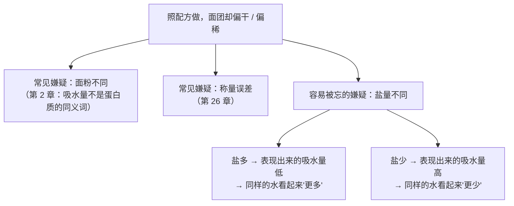
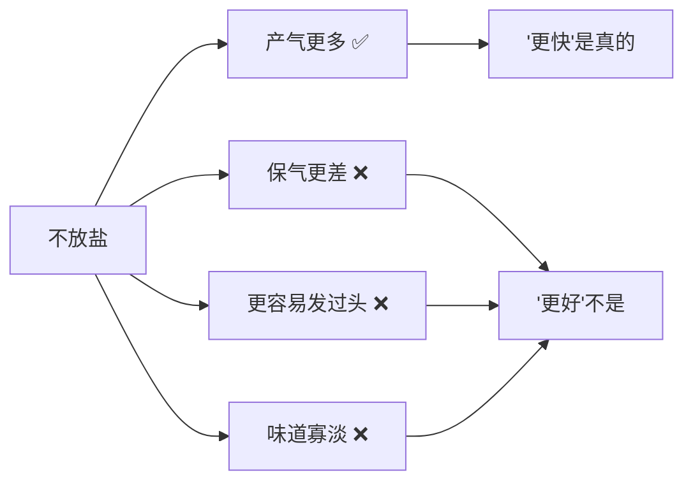

# 第 7 章 思考题参考答案

> 只记「问题 + 正确答案」。案例题给**完整推理链**——
> "它扮演什么角色 → 它在跟谁争 → 产气与保气各怎么变 → 成品怎么变 → 怎么验证"。
>
> 涉及数字的地方，来源见[参考书目与出处登记](../standards.md)。

## Q1

**问**：为什么说盐是"唯一一个只拿不给的角色"？它拿走了什么、又改变了什么？

**答**：

**因为除了咸味，它不提供配方需要的任何一样东西**：
不提供结构材料（面粉、蛋提供）、不提供水（水、蛋、奶提供）、
不提供气（酵母、膨松剂、打发提供）、不提供脂（油脂提供）。

**但它改变了几乎所有人的速度**：

| 它拿走 / 改变了什么 | 表现 | 依据 |
|-------------------|------|------|
| **拿走水的可用性** | 粉质仪吸水量下降几个百分点 | 176 份样本里 **95%** 的样本如此 |
| **改变面筋怎么形成** | 形成被推迟、成品更韧，但弹性不一定更好，且加过头会"绷太紧" | 共聚焦显微镜研究 + 流变研究 + GlutoPeak 研究 |
| **改变酵母的速度** | 产气变少 | 3.0% 盐时总产气量从 1518 掉到 1272 mL（弱筋品种） |
| **改变气的去留** | 保气系数上升 | 同一实验：81.9% → 89.8% |

> **要带走的判断**：**用量最小的原料，不等于影响最小的原料。**
> 盐的正确定位是**调速器**，不是调味料——
> 它调的是"每件事发生得多快"，而烘焙里"快慢"就是一切（因为进炉之后你改不了）。

## Q2

**问**："加盐会让面粉吸水量下降"有哪两组独立数据支持？
对"照配方做但面团偏干"有什么提示？

**答**：

**两组独立数据**：

| 研究 | 设计 | 结果 |
|------|------|------|
| 一项 2020 年的研究 | 41 个软质小麦品种、**176 份面粉样本**，比较不加盐与加 1.5% 盐（该文以面团含盐量表述）下的粉质仪指标 | **95% 的样本**吸水量下降**几个百分点**；78% 的样本形成时间变长 |
| 一项 2026 年的研究 | 三种粉 × 四个盐水平（0 / 0.3 / 0.6 / 1.2%），每组都用粉质仪调到同一稠度（500 FU） | **所有粉类**里，盐加得越多吸水量越低、形成时间越长 |

**机制（该 2020 年研究引述的解释）**：钠与氯离子占据蛋白质表面
原本被结合水占着的位置，蛋白质的水合能力下降。
⚠️ 这是文献引述的解释，相关机制（离子键、疏水作用、氢键）**仍在讨论中**。

**对"面团偏干"的提示**：

> **要带走的判断**：**水量的问题不一定出在水上。**
> 第 3 章说过"水被谁拿走了"，本章补上了一个新的抢水者——**离子**。

## Q3

**问**："盐让面筋更强"只对一半。列出支持与反对的证据，并给出更准确的表述。

**答**：

**支持的证据（很强）**：

| 指标 | 加盐后 | 比例 |
|------|--------|------|
| 吹泡示功仪 **W**（面团力度） | 上升 | **171/176 = 97%** |
| 吹泡示功仪 **P**（韧性） | 上升 | **165/176 = 94%** |
| 粉质仪稳定度 | 上升 | 70% 的样本 |

**反对 / 限定的证据**：

| 证据 | 它说明什么 |
|------|-----------|
| 同一批数据里，**L（延展性）方向不统一**（约三分之二上升、三分之一下降），**P/L 没有确定方向**（47% 升、51% 降） | "更强"不是一个整体性质，而是**两个方向不同的分量** |
| 一项 2014 年的研究：加 2%（面粉基准）NaCl 后，面筋 **tan δ 更高，即网络弹性更低** | "更韧"与"更弹"不是一回事 |
| 一项 2026 年的研究：白粉在 0.3~0.6% 时聚集更快、扭矩更高，**但到 1.2% 时形成时间反而变长、扭矩下降**（"绷得过紧"）；高纤配方里 1.2% 组显著低于 0.3% 与 0.6% 组 | **有上限**，超过就掉头 |
| 一项 2013 年的研究：共聚焦显微镜显示**加盐推迟面筋网络的形成** | 强弱之外还有"多快" |

**更准确的表述**：

> ## **盐让面筋形成得更慢、更韧，而且有一个上限——过了上限，它反而变差。**

**这个表述能解释两件配方上的事**：

| 现象 | 解释 |
|------|------|
| 减盐的面团**揉起来更快到位**，也更容易揉过头 | 网络形成不再被推迟 |
| 加盐过量的面团**发僵、擀不动、回缩** | 韧性上升但延展性没跟上，加上"绷太紧" |

## Q4

**问**：吐司配方（面粉 100%、水 65%、盐 2%、干酵母 1%、糖 6%、油 5%，
**以面粉总量为 100%**）。乙忘了放盐。
（a）四个阶段的差别；（b）体积并不更小说明什么；（c）补盐后要连带改什么？

**答**：

**（a）四个阶段的预测**

| 阶段 | 乙（无盐）会怎样 | 机制与依据 |
|------|----------------|-----------|
| **揉面** | **更快到位**，面团可能偏软偏黏；也更容易一不小心揉过头 | 加盐会推迟面筋网络形成；不加盐就不推迟。另外无盐时吸水量表现更高，65% 的水在无盐面团里会显得"更少"还是"更多"取决于粉，但手感一定不同 |
| **发酵** | **明显更快**；弱一点的粉在发酵后期可能**回落（塌）** | 实测：不加盐时总产气量最高（一个品种 1518 mL，加到 3.0% 降到 1272 mL）；同一研究里弱筋粉不加盐的面团高度曲线**先冲高后明显回落** |
| **烘烤** | 炉内膨胀可能不差，但更容易"散"；表皮上色可能略有不同 | 产气足但网络保气差 |
| **成品** | 组织偏粗、不均匀；**味道寡淡、发"空"** | 盐是唯一直接提供咸味的原料；一项感官研究提示盐带来的最确定的东西就是咸味本身 |

**（b）体积不更小，说明了什么**

**说明"产气"和"保气"是两件事，而这份配方里产气并不是瓶颈。**

| 指标 | 不加盐 | 加到 3.0% |
|------|--------|----------|
| 总产气量 | **最高**（1518 / 1584 mL） | 最低（1272 / 1242 mL） |
| 跑掉的 CO₂ | **最多**（275 / 306 mL） | 最少（130 / 144 mL） |
| **保气系数** | **最低**（81.9% / 80.7%） | **最高**（89.8% / 88.5%） |

> 所以无盐面团完全可能"体积不小"——**它产的气多，虽然漏得也多**。
> 但它的**组织、稳定性与味道**都会不同，
> 而且在**发酵时间稍长**的情况下更容易塌（那条回落的曲线）。

**（c）补上盐之后要连带改什么**

| 要改什么 | 往哪个方向 |
|---------|-----------|
| **揉面时间** | **延长**（面筋形成被推迟了） |
| **发酵时间** | **延长**（产气变慢），并且要**改用状态判据**而不是照抄时间 |
| **水量** | 可能要**略增**（加盐后表现出来的吸水量下降，面团会显得更硬） |

> **要带走的判断**：**改一个 2% 的原料，要连带改三件事。**
> 这正是第 1 章那句"它会抢走谁的什么"的标准用法。

## Q5

**问**：把法棍配方的盐从 2% 提到 3%（**以面粉总量为 100%**）想要"更有嚼劲"，
结果擀不开、回缩、体积变小、组织紧实。
（a）解释三个现象；（b）为什么用很强的高筋粉让问题更严重；（c）还能动哪些变量？

**答**：

**（a）三个现象的解释**

| 现象 | 机制 | 依据 |
|------|------|------|
| **擀不开、回缩** | 盐让面筋更"韧"（P 上升），但延展性（L）没有同步上升，**P/L 的方向本来就不统一**；加多了还会出现"绷得过紧" | 176 份样本：P 在 94% 的样本上升，L 方向不统一；另一项研究在 1.2% 一档观察到扭矩**下降** |
| **体积变小** | **产气被压得更狠**：3.0% 盐时总产气量从 1518 掉到 1272 mL（弱筋品种）、1584 掉到 1242 mL（强筋品种） | 发酵流变仪实测 |
| **组织紧实** | 保气系数虽然上升（气漏得少），但**总的气本来就少了**，而且网络更紧 | 同上 |

**（b）为什么"很强的粉"让问题更严重**

> 因为**盐的作用是在原有基础上"再加一层"，不是替代它**。

那项研究里最有说服力的一组对照是：

| 组合 | 结果 |
|------|------|
| **弱筋品种 + 3.0% 盐** | 曲线变成了"强筋品种不加盐"的样子——**持续上升、不回落**（变好了） |
| **强筋品种 + 3.0% 盐** | **太紧了，反而涨得比不加盐和 1.5% 时更少**（变差了） |

**同一个盐量，加在弱粉上是救命，加在强粉上是绷死。**
本题的人恰好用的是强粉，所以踩的是第二种情况。

**（c）想要"更有嚼劲"，还能动哪些变量**

| 变量 | 方向 | 本书在哪讲 |
|------|------|-----------|
| **粉本身** | 换蛋白质质量不同的粉（注意：吸水量不是蛋白质的同义词） | 第 2 章 |
| **含水量** | 降低含水量通常让组织更紧、嚼劲更足；提高则更开放 | 第 3 章 |
| **搅拌方式与程度** | 面筋发展程度是一个独立旋钮 | 第 22 章 |
| **发酵时间与温度** | 长时间低温发酵会改变风味与组织 | 第 24 章 |
| **整形与醒发** | 决定气往哪跑 | 第 25 章 |

> **要带走的判断**：**"我想要 X"和"我该改哪个变量"之间，永远隔着一次归因。**
> 本题的人把"嚼劲"归因到盐上，但盐并不是嚼劲的主要旋钮——
> 它只是**调速器**，而且**有上限**。

## Q6

**问**："海盐比精盐做出来的面包更好"——判断证据强度，
说明为什么连"它没用"都不下结论，并设计能把"盐种"和"用量"分开的实验。

**答**：

**判定：缺乏证据。**

**本书**没有核到**任何比较不同盐种对烘焙成品影响的可靠实验。

**为什么连"它没用"也不下结论**：

> 因为**"查不到证据"不等于"证明了没有效应"。**

这是本书反复出现的一条纪律：

| 常见的错误处理 | 本书的处理 |
|--------------|-----------|
| "没查到 → 所以它是假的" | ❌ 这是把举证责任用反了 |
| "大家都这么说 → 所以它是真的" | ❌ 这是把流传当证据 |
| **"查了但没查到 → 明说没查到，并说明已知机制指向哪里"** | ✅ 并登记进[出处登记](../standards.md)的「已知缺口」 |

**已知机制指向哪里**：已有研究关心的是**钠与氯离子的量**
（渗透胁迫、离子对蛋白质表面的屏蔽）。
从这个角度看，不同盐种的差别应该主要来自**含量与溶解速度**，而不是"矿物质风味"。
**但这是机制推理，不是实验结论**，所以本书只说到这里。

**还有一个更大的混淆因素**：

> **不同盐种的颗粒大小与密度差别很大，所以"一小勺"的实际克数可能差出几成。**
> 很多"海盐更好吃"的体验，可能只是**实际放的盐更多或更少**。

**能把"盐种"和"用量"分开的实验设计**

| 组 | 处理 | 目的 |
|----|------|------|
| ① | 精盐 **X 克**（称重） | 基准 |
| ② | 海盐 **X 克**（**同样称重**） | 只改盐种 |
| ③ | 海盐"**一小勺**"（按你平时的手势，事后称重记录） | 看"按勺量"引入了多大误差 |

**关键设计点**：

1. **① 和 ② 必须用秤对齐克数**——这是整个实验的意义所在；
2. ③ 事后一定要**称重并记下来**，你会得到一个很有说服力的数字；
3. 其余全部固定：同一批粉、同一天、同样的水温与揉面时间、同时进炉；
4. 评价最好请别人做**三角测试**（三份样品其中两份相同，让他挑出不同的那份）。

| 记录项 | ① | ② | ③ |
|--------|---|---|---|
| 实际盐重（g） | | | |
| 折算成烘焙百分比（%） | | | |
| 揉到位用时 | | | |
| 一发用时 | | | |
| 成品体积 | | | |
| 三角测试：能不能区分 ① 与 ②？ | | | |

> ⚠️ **局限**：家庭条件下几乎不可能排除批次与环境差异，样本量也太小。
> 它能回答的是**"在我这儿，盐种的差别有没有大到我能尝出来"**——
> 对读者来说，这个问题比"科学上有没有差别"更有用。

## Q7

**问**："不放盐面包发得更快，所以赶时间可以不放盐"——对在哪、错在哪？

**答**：

**对在**："发得更快"是有实测支持的。

| 盐水平 | 总产气量（弱筋 / 强筋，mL） |
|--------|--------------------------|
| 0% | **1518 / 1584** |
| 1.5% | 1487 / 1519 |
| 3.0% | 1272 / 1242 |

**错在**：它把"产气"当成了全部，而**发酵的结果是"产气 × 保气"**。

| 盐水平 | 跑掉的 CO₂（mL） | **保气系数** |
|--------|----------------|------------|
| 0% | **275 / 306**（最多） | **81.9% / 80.7%**（最低） |
| 1.5% | 218 / 270 | 85.4% / 82.2% |
| 3.0% | **130 / 144**（最少） | **89.8% / 88.5%**（最高） |

**还错在第二处**：无盐面团的发酵曲线**形状**也不一样。
同一研究记录到：**弱筋品种不加盐时，面团先冲到最高点然后明显回落**；
加 1.5% 盐之后就不再明显回落了。

> **也就是说，无盐面团不只是"快"，还"更容易过头"。**
> 赶时间的人恰恰是最容易一转身就发过的人——
> **这条建议把风险最高的两件事叠在了一起。**

**还有第三处**：味道。盐是配方里唯一直接提供咸味的原料，
一项感官研究提示，盐带来的最确定的东西就是咸味本身。**无盐面包尝起来会"空"。**

> **要带走的判断**：**任何"加快"的建议，都要问它牺牲了什么。**
> 烘焙里几乎没有免费的加速——这一条在第 24 章（发酵与冷藏）还会再遇到一次。

## Q8

**问**："仪器测得出的差别 ≠ 人尝得出的差别"——举出本章的例子，
并说明这对你设计自家对照实验有什么要求。

**答**：

**本章的例子**：

> 一项关于 NaCl 对酵母面包香气影响的研究发现：
> 不同盐浓度下，面团中 **2-苯乙醇等香气物质有显著变化**（仪器测得出）；
> 但在**感官三角测试**里，**能被人区分出来的是酵母用量不同的样品，
> 而不是含盐量不同的样品**。

**这件事为什么重要**：

| 如果只看仪器 | 会得出什么结论 |
|------------|--------------|
| "盐显著改变了香气成分" | → "盐让面包更香" |
| **但感官测试说** | **人区分不出来** |

> **两句话都是真的，但只有第二句对做饭的人有用。**

**对自家对照实验的三条要求**：

| 要求 | 为什么 | 怎么做 |
|------|--------|--------|
| **① 用"人能不能分辨"当终点，而不是"数字有没有变"** | 你的目标是好吃，不是显著性 | 测体积、测硬度之外，一定要**尝** |
| **② 尽量盲测，最好用三角测试** | 你**知道**哪份是改过的，这会直接污染判断 | 请别人端上三份（两份相同），你挑出不一样的那份；挑不出来 = 这个改动对你没意义 |
| **③ 差别太小就当它不存在** | 家庭条件下的批次波动本来就不小 | 如果三角测试挑不出来，**就别为这个改动付出额外的操作成本** |

**这条纪律还有一个反方向的用处**：

> 当你在网上看到"某某做法让成品明显更好"时，可以直接问一句：
> **"这是仪器说的，还是人蒙着眼尝出来的？"**
> 本书引用的实验里，凡是做了感官测试的，本书都会写明——
> 因为这一句常常就是"有用"和"听起来有用"的分界线。
