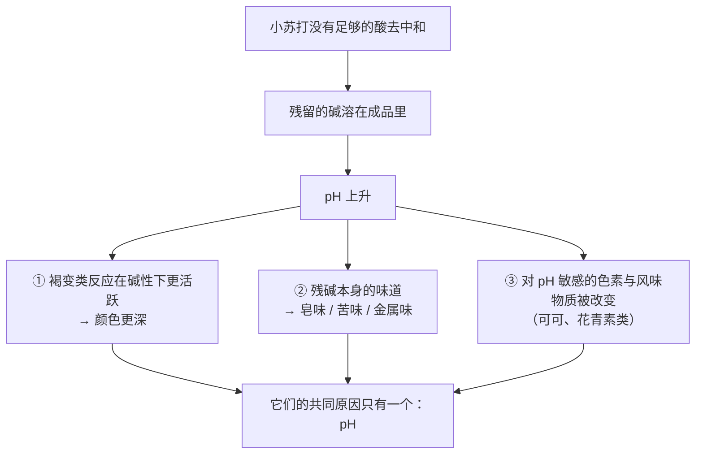
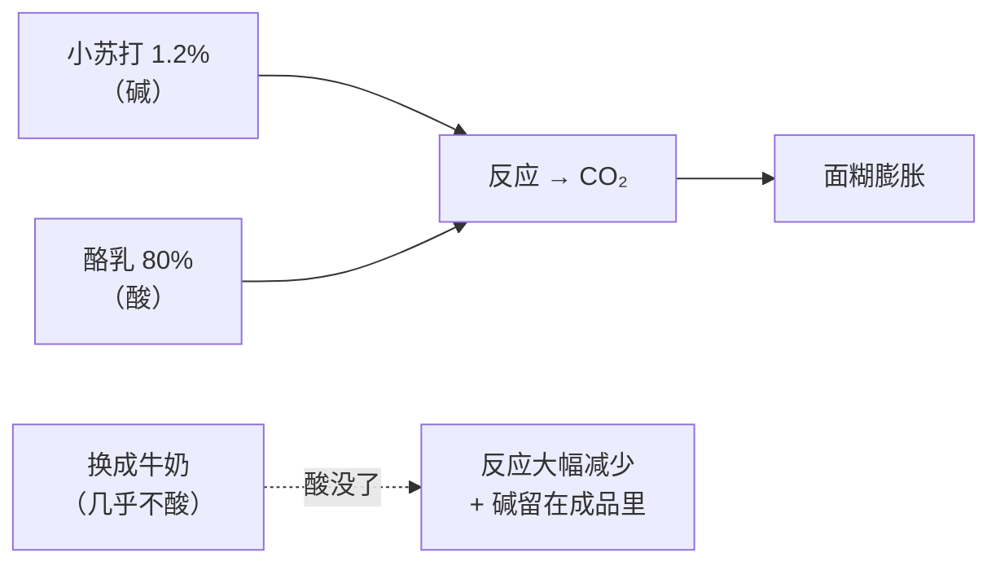
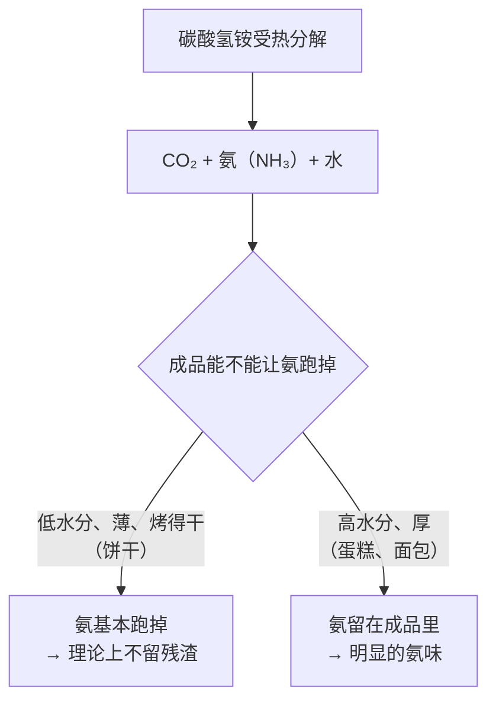
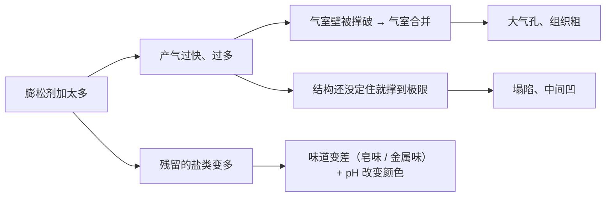
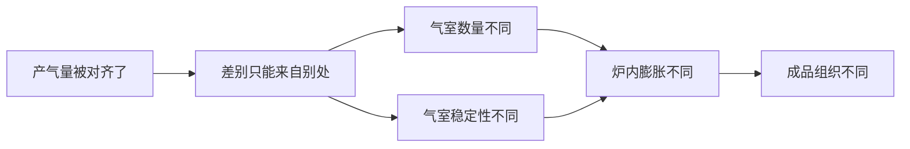

# 第 8 章 思考题参考答案

> 只记「问题 + 正确答案」。案例题给**完整推理链**——
> "气从哪来 → 什么时候来 → 它还顺手改了什么 → 成品怎么变 → 怎么验证"。
>
> 涉及数字的地方，来源见[参考书目与出处登记](../standards.md)。

## Q1

**问**：烘焙里的气有哪**四个**来源？为什么"这份配方靠什么发"的答案几乎总是"不止一个"？

**答**：

| 气源 | 机制 | 什么时候产气 |
|------|------|------------|
| **① 生物** | 酵母 / 酵种代谢糖类，放出 CO₂ 与风味物质 | 进炉**前**（进炉后还有短暂冲刺） |
| **② 化学** | 碳酸氢盐分解或与酸反应放 CO₂（碳酸氢铵还放氨） | **遇水时 + 受热时** |
| **③ 物理** | 搅拌 / 打发**把空气机械地打进去** | 搅拌时（进炉前就完成了） |
| **④ 蒸汽** | 配方里的水受热变成蒸汽 | 进炉**后** |

**为什么答案总是"不止一个"**：

> 因为**第 ④ 条对所有含水的成品都成立**。
> 一项关于饼干化学膨松的热力学建模研究在描述机制时明确写道：
> 膨松剂产生的气体**与水分蒸发一起**在面团里形成气泡。

**举几个例子**：

| 成品 | 主气源 | 同时还有 |
|------|--------|---------|
| 吐司 | 酵母 | 搅拌带入的空气 + **蒸汽** |
| 戚风 | 打发的空气 | 少量膨松剂 + **蒸汽** |
| 泡芙 | **蒸汽** | 搅拌带入的少量空气 |
| 曲奇 | 化学膨松 | 黄油打发带入的空气 + **蒸汽** |

> **要带走的判断**：**别问"它靠什么发"，问"它的气分别在哪几个时刻产生"。**
> 因为决定成败的不是总气量，而是**产气的时刻和定型的时刻能不能对上**（第 10 章）。

## Q2

**问**：单用小苏打会出什么问题？给出两项独立研究的数据，
并说明"颜色更深"与"可能有皂味"为什么是一件事的两面。

**答**：

**问题是：CO₂ 放不完 + 碱性残留。**

一项关于泡打粉与膨松酸的研究把它写得很完整：
**单用碳酸氢钠会导致 CO₂ 释放不充分，并且随着它在成品中溶解，碱性上升**；
这可能损害产品，**通常表现为皂味和发黄的颜色**。

**两项独立的实测数据**：

| 研究 | 数据 |
|------|------|
| 一项 2019 年关于饼干面团的研究 | 存放 24 天后，**小苏打对照面团 pH 9.18**；**泡打粉对照面团 pH 7.14** |
| 一项 2009 年关于可可制品的研究 | **用小苏打的蛋糕 pH 上升、颜色变深**；改用泡打粉后可提取 pH 约 **6.2**、**颜色更浅，但蛋糕高度也更低**；市售巧克力蛋糕预拌粉成品 pH 在 **8.3 以上** |

**为什么"颜色更深"和"皂味"是同一件事的两面**：

> **要带走的判断**：**小苏打不是"产气的"，它是"产气 + 推高 pH 的"。**
> 所以看到"颜色异常深 + 味道怪"，要一起怀疑同一个原因，
> 而不是分别去找"烤过头"和"原料不新鲜"。
>
> 注意那项可可研究里还有一句重要的话：改用泡打粉后**蛋糕高度也更低**——
> **说明这个"碱"不是白加的，它确实在贡献体积。所以这是取舍，不是纠错。**

## Q3

**问**："双效"准确地说是什么意思？SAPP 10 与 SAPP 40 差在哪？
对"拌好要不要马上进炉"有什么影响？

**答**：

**准确的意思是：有多大比例的可用 CO₂ 被留到进炉之后才放出来。**

膨松酸按溶解与反应的快慢分类：

| 类型 | 什么时候反应 | 例子（该研究提到的） |
|------|------------|-------------------|
| **快作用** | 溶得快，**主要在搅拌时**就反应掉 | 磷酸二氢钠一类 |
| **慢作用** | 溶得慢，**主要在烘烤温度下**才放气 | 酸式焦磷酸钠（SAPP）一类 |

而 SAPP 后面的数字直接标出了这个比例：

| 牌号 | 搅拌阶段放出（冷作用） | 烘烤阶段放出（热作用） |
|------|--------------------|--------------------|
| **SAPP 10** | 约 **10%** | 约 90% |
| SAPP 28 | 约 28% | 约 72% |
| **SAPP 40** | 约 **40%** | 约 60% |

**对"要不要马上进炉"的影响**：

| 用的是 | 静置的代价 | 配方通常怎么写 |
|--------|-----------|--------------|
| 偏**快**的酸（冷作用比例高） | **大**：放在台面上的每一分钟都在漏气 | "拌匀立刻入炉" |
| 偏**慢**的酸（冷作用比例低） | 小：大部分气还留在里面 | 允许静置、甚至可冷藏 |

> ⚠️ **但你通常不知道自己手上那罐是哪一档**——家用包装很少写。
> **所以"拌好马上进炉"是一条稳妥的默认做法**：
> 它在"快酸"的情况下能救你，在"慢酸"的情况下也没有损失。
>
> 想知道你那罐偏快还是偏慢？**本章 🅑 任务五（放气时机实验）就是干这个的。**

## Q4

**问**：马芬配方（面粉 100%、糖 40%、油 30%、全蛋 40%、**酪乳 80%**、
**小苏打 1.2%**，**以面粉总量为 100%**）。用等量牛奶换掉酪乳。
（a）膨胀、颜色、味道会怎样？（b）"说不上来的怪味"最可能是什么？（c）两种改法与代价？

**答**：

**先读懂这份配方**：它写着**小苏打**而不是泡打粉，同时配方里有 **80% 的酪乳**——
**这两件事是配对出现的**。酪乳是酸性的，它正是这份配方里给小苏打配的那个酸。

**（a）三方面预测**

| 方面 | 预测 | 机制 |
|------|------|------|
| **膨胀** | **明显变差**：涨得少、组织更瓷实 | 没有酸，碳酸氢钠的 CO₂ **释放不充分**（这正是那项研究说的"单用碳酸氢钠"的情形） |
| **颜色** | **更深、偏黄褐** | 残碱让 pH 上升；两项独立研究都观察到小苏打组 pH 更高、颜色更深 |
| **味道** | **发苦 / 皂味 / 金属味**，甜味也会显得"钝" | 残碱本身的味道 |

**（b）"说不上来的怪味"最可能是什么**

> **就是残碱的皂味 / 苦味。**

那项研究直接写了：碱性上升"通常表现为**皂味**和发黄的颜色"。
这个味道之所以"说不上来"，是因为它不是酸甜苦咸里任何一个的典型形态，
而且**和颜色变化同时出现**，容易被误判成"烤过头了"。

> **鉴别方法**：如果颜色偏深**且**味道发皂，同时成品**没有**涨起来——
> 三个症状一起出现，几乎可以锁定**碱多了酸少了**。

**（c）至少两种改法与各自的代价**

| 改法 | 怎么做 | 代价 |
|------|--------|------|
| **① 把酸补回去** | 在牛奶里加酸（柠檬汁、醋）做成"酸化牛奶"，或用酸奶稀释 | 风味与酪乳不完全相同；**加多少酸没有可靠的通用配比**，本书不给数字，要自己试并记录；酸量不足时问题依旧 |
| **② 把碱换成泡打粉** | 改用自带酸的泡打粉 | ⚠️ **不是等量换算**——换算比例取决于那罐泡打粉用的酸与中和值，本书**不给比例**。而且成品会**颜色更浅、可能更矮**（那项可可研究里改用泡打粉后蛋糕高度就更低），风味也会变 |
| （③ 最省事的一种） | **换配方**：找一份本来就用牛奶 + 泡打粉的马芬配方 | 放弃这份配方的风味特征，但**最不容易出错** |

> **要带走的判断**：**配方里的"小苏打"三个字，是在告诉你"这份配方里有酸"。**
> 所以**看到小苏打就去找酸**——找到了，你才知道换掉哪一样会连带砸掉什么。

## Q5

**问**：饼干配方要求碳酸氢铵，某人换成等量泡打粉，结果**摊得更少、更硬、更厚**，
但"没有那股味道了"。
（a）解释三个变化；（b）"没有那股味道"说明什么？为什么碳酸氢铵只用于低水分产品？
（c）他该"换回臭粉"还是"改配方"？

**答**：

**（a）三个变化**

有一项做法非常干净的对照研究：**同一份配方，只换膨松剂**
（碳酸氢铵 / 塔塔粉类泡打粉 / 葡萄基膨松剂 / 普通泡打粉），结果：

| 用哪种 | 成品特征 |
|--------|---------|
| **碳酸氢铵** | 表面最均匀、**结构最不硬**、**脆裂性最高**、**摊得最开**，泡牛奶时吸得最多 |
| 塔塔粉类泡打粉 | **更脆**，但整体感官接受度较低 |
| 普通（二磷酸盐）泡打粉 | 居中 |

**这和本题的三个现象完全对得上**：换掉碳酸氢铵之后，
**摊得更少（碳酸氢铵组摊得最开）、更硬（碳酸氢铵组最不硬）、更厚（摊得少自然更厚）**。

机制上还有一条：碳酸氢铵**受热直接分解**，
一项建模研究提到它的**最大产气被认为在 59 °C 附近**——
也就是说，它的气**集中在烘烤早期、饼干还软的时候**放出来，
这段时间正是饼干**能摊开**的窗口（第 2、4 章：最终直径 ≈ 摊开速率 × 定型时间）。

**（b）"没有那股味道"说明什么**

> 说明**那股味道本来就是配方特征的一部分**——或者说，
> 是**碳酸氢铵留下的那一点点没跑干净的氨**。

那项建模研究把使用限制写得很明确：
**碳酸氢铵的使用被限制在饼干这类低水分产品上，
因为那里可以期待它最大程度地分解——残留物会在烘烤后留下异味。**

> **所以"只能用于低水分产品"不是习惯，是它的分解产物决定的。**

**（c）该"换回臭粉"还是"改配方"**

**取决于他要的是什么**，而判断依据来自上面的对照研究：

| 如果他想要 | 该怎么办 |
|-----------|---------|
| **原来那种"薄、脆、摊得开"的饼干** | **换回碳酸氢铵**——那个质地是它给的，泡打粉给不了 |
| **不要那股味道，可以接受不同的饼干** | **改配方**：接受更厚更硬的结果，或者调整糖 / 油 / 面团厚度去补摊开（第 4、5 章） |
| 两个都要 | **没有免费的答案**——这是一次取舍，不是一次替换 |

> **要带走的判断**：**"换了之后不一样"不等于"换错了"。**
> 先确认你想要的是哪一个结果，再决定动哪个变量。
> 这也是为什么本书的实操表格里，总有一行是**"你想要的是哪一种"**。

## Q6

**问**："膨松剂放多一点发得更大"——判断证据强度、成立范围、越界后果，并设计对照。

**答**：

**判定：⚠️ 在一定范围内成立，但有峰值。**

**证据**：一项用响应面法系统改变泡打粉用量与膨松酸配比的研究发现：

| 用量 | 结果 |
|------|------|
| 偏低 | 成品出现**大而不均匀的气孔**，组织不匀 |
| 提高 | 面糊**比容与孔隙率显著提高** |
| **接近该研究中的最高用量** | **反而下降** |

⚠️ 该研究的百分比基准本书**未核到明确写法**，所以**只引用方向，不把数字当推荐值**。

**越过范围之后会发生什么（机制）**：

**在家能做的对照实验**

| 组 | 膨松剂用量（**以面粉总量为 100%**） | 目的 |
|----|--------------------------------|------|
| ① | 原配方（例如 1%） | 基准 |
| ② | **减半** | 看"太少"长什么样（大而不均的气孔） |
| ③ | **加倍** | 看"更大"到哪 |
| ④ | **三倍** | 看什么时候开始塌、开始有味道 |

**必须固定**：所有其他原料的克数、搅拌方式与时间、每份面糊的重量、
模具、炉温与时间；各组**同时进炉**并做好标记。

| 记录项 | ① | ② | ③ | ④ |
|--------|---|---|---|---|
| 出炉最高高度（mm） | | | | |
| **冷却后**高度（mm） | | | | |
| 中间有没有塌陷 | | | | |
| 气孔大小（细密 / 中 / 大而不匀） | | | | |
| 颜色（浅 / 中 / 深） | | | | |
| **味道有没有异味** | | | | |

> **注意第二行**：一定要测**冷却后**的高度。
> "出炉时最高"和"冷却后最高"常常不是同一组——**塌陷发生在冷却期**。
>
> ⚠️ **局限**：样本量小、没有重复、家用烤箱温度不准（第 29 章）。
> 它给你的是**你这份配方的上限在哪**，不是通用规律。

## Q7

**问**："酵母产气量一样，做出来的面包就一样"——
用一项把产气量对齐的研究反驳它，并说明它指向第 1 章的哪一组竞争。

**答**：

**判定：❌ 明确错误。**

**反驳它的研究设计得非常巧**：

> 研究者取五株 *Saccharomyces cerevisiae*，
> **把发酵终点统一到产气 400 mL**——也就是**先把"产气量"这个变量消掉**，
> 再去看烘烤时的表现。
>
> 结果：**炉内膨胀仍然因菌株而异**；图像分析显示，
> **炉内膨胀更大的那些，成品的气室数量更多**。
> 研究者的结论是：菌株选择通过影响**气室稳定与面筋网络**，
> **在产气量之外**继续影响成品。

**它指向第 1 章的哪一组竞争**：

> **争气**——而且精确地说，是争气的**后半段：保气**。

**这条结论和第 7 章的盐是同一个结构**：

| 章 | 现象 | 共同的教训 |
|----|------|-----------|
| 第 7 章 | 不加盐产气最多，但**保气系数最低** | **产气 ≠ 结果** |
| 第 8 章 | 产气被强行对齐后，**成品仍然不同** | **产气 ≠ 结果** |

> **要带走的判断**：**"发得起来"是两件事的乘积：产多少气 × 留住多少。**
> 这就是第 10 章要建立的膨发通用模型，
> 而本章与第 7 章已经各给了它一个实验证据。

## Q8

**问**：本章在"自制泡打粉的配比""膨松剂的保质期""小苏打换泡打粉的比例"三处拒绝给数字。
分别说明理由，并指出共同的判断标准。

**答**：

**三处拒绝的具体理由**：

| 拒绝给的数字 | 理由 | 本书改成给什么 |
|------------|------|--------------|
| **自制泡打粉的配比** | 比例取决于所用酸的**中和值**（100 份酸能中和多少份碳酸氢钠），以及那种酸的**快 / 慢作用比例**。**同样叫"泡打粉"，用不同的酸配比完全不同** | 给**结构**（碱 + 酸 + 填料）和**中和值的定义**，让你知道要问什么问题 |
| **膨松剂的保质期** | 本书**没有核到**家庭储存条件下的失效速率数据。已知机制是**吸潮导致碱与酸提前反应**（这也是配方里要加中性填料与抗结剂的原因） | 给**机制**（为什么会失效）与**一个粗糙判据**（放进温水看是否明显起泡）——并说明这个判据只能看"有没有反应"，看不到留给烘烤阶段的那部分 |
| **小苏打 ↔ 泡打粉的换算比例** | 需要知道你那罐泡打粉的酸是什么、中和值多少、快慢比例多少——**家用包装通常不写**，所以这个换算**缺少输入条件** | 给**决策树**：先看配方里有没有酸，再判断换过去会砸掉什么 |

**共同的判断标准**：

> ## **一个数字只有在它的前提条件可获得时才有用。**

三处拒绝其实是同一句话的三种表现：

| 情形 | 判断 |
|------|------|
| 数字取决于一个**你手上没有**的参数（中和值、快慢比例） | **不给**——给了也没法用，还会造成"我照着做了却失败"的困惑 |
| 数字取决于一个**本书没查到**的量（家庭失效速率） | **不给**——写进[出处登记](../standards.md)的「已知缺口」 |
| 数字的**基准没写明**（那项泡打粉用量研究的百分比） | **只引用方向，不引用数值** |

**为什么这条标准比"多给点数字更贴心"更重要**：

> 因为**在烘焙里，一个不能用的数字比没有数字更糟**。
>
> - 没有数字：读者知道自己得试一次，**会做记录**；
> - 有一个用不了的数字：读者以为自己有答案，**照做、失败、然后怀疑自己**——
>   而他不会去怀疑那个写在书上的比例。
>
> 这和第 2 章 Q8（面粉分类的蛋白质区间）、第 4 章 Q8（高糖换酵母的阈值）、
> 第 5 章 Q8（黄油的操作温度）、第 6 章 Q8（蛋的凝固温度）是**同一条纪律的第六次出现**。

**那读者该怎么办**：

> **把这三个空格变成你自己的记录**：
> 你那罐泡打粉在你家能放多久、静置 20 分钟掉多少高度（🅑 任务五）、
> 你那份配方换膨松剂之后变成什么样（🅑 任务四）——
> **这些数字本书给不了你，但你自己一次就能测出来，而且它们比任何通用值都准。**
