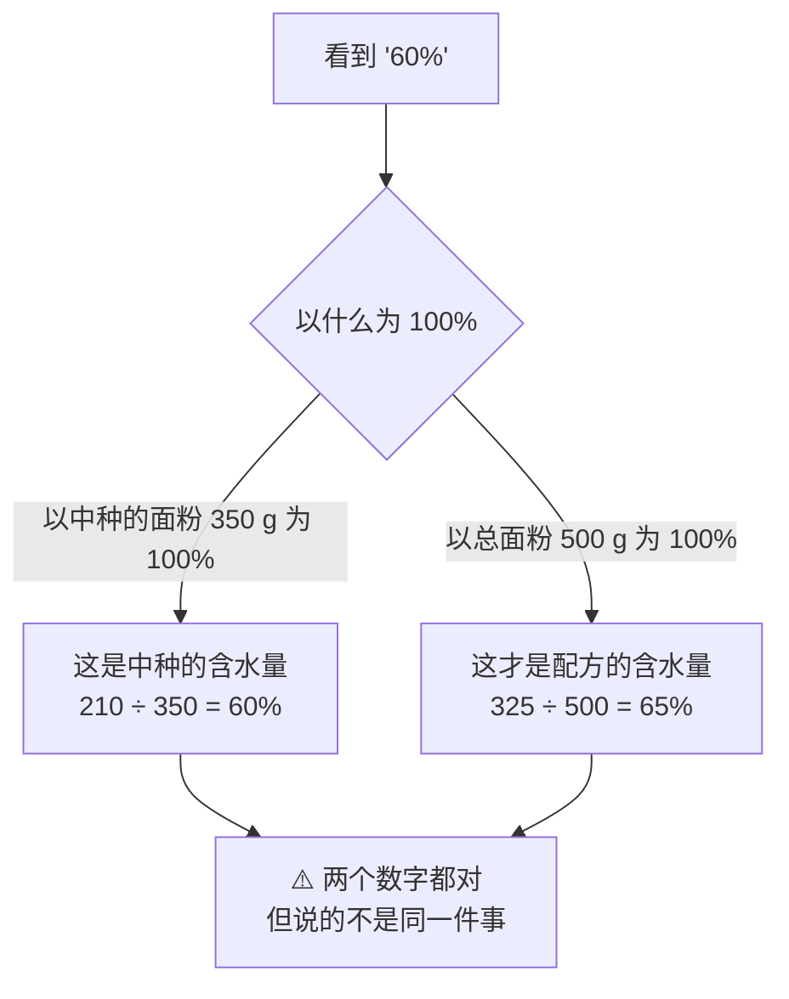

# 第 9 章 思考题参考答案

> 只记「问题 + 正确答案」。案例题给**完整推理链**与**完整算式**。
>
> 本章的所有百分比，**除非另有说明，一律以配方中面粉总量为 100%**。
> 涉及数字的地方，来源见[参考书目与出处登记](../standards.md)。

## Q1

**问**：为什么烘焙百分比必须写明"以什么为 100%"？
用"裹入油可达面团重量的 35%"这个例子说明基准混淆会造成多大偏差。

**答**：

**因为同一样东西，换个基准，数字可以差出将近一倍。**

用本书第 5 章那份配方举例（面粉 500 g、总面团 890 g）：

| 同一块 100 g 黄油 | 计算 | 记成 |
|-----------------|------|------|
| **以面粉为 100%** | 100 ÷ 500 | **20%** |
| **以面团重量为 100%** | 100 ÷ 890 | **约 11%** |

**反过来更危险**：如果你看到"裹入油 35%"就按**面粉**为基准去配，

| 你以为 | 实际是 |
|--------|--------|
| 面粉 500 g × 35% = **175 g 黄油** | 面团 890 g × 35% = **约 312 g 黄油** |

> **差了将近一倍。** 而这两个数字**写出来一模一样，都是"35%"**。

**所以本书的做法是**：

1. 全书统一约定**以面粉总量为 100%**；
2. 凡是用别的基准的地方（例如那条裹入油），**在同一页写明**；
3. 遇到**没写基准**的来源，**只引用方向，不引用数字**（§9.7 列了三条这样的例子）。

> **要带走的判断**：**百分比是一个"两部分"的数字**——数值 + 基准。
> **只拿到一半，等于什么都没拿到。**

## Q2

**问**：一份配方的百分比合计是 178%，算不算错？

**答**：

**不算错，而且必然如此。**

因为**面粉自己就是 100%**，其余原料都是**加在它上面**的：

| 原料 | 百分比 |
|------|--------|
| 面粉 | 100% |
| 水 | 65% |
| 盐 | 2% |
| 干酵母 | 1% |
| 糖 | 5% |
| 黄油 | 5% |
| **合计** | **178%** |

**这个合计数不是废数字，它有一个非常实用的用途**：

> **面粉克数 = 你想要的面团总重 ÷（总百分比 ÷ 100）**
>
> 例如要 600 g 面团：600 ÷ 1.78 ≈ **337 g 面粉**。

**顺带提醒一句**：另有一套"**真实百分比**"的记法，是**以配方总重为 100%**，
那一套的合计才是 100%。**两套不能混用。**
⚠️ 这一条属于行业惯例，本书**未核到纸本教材原文**，
只作为"存在两种记法"的提示——**看到百分比先确认是哪一套**。

## Q3

**问**：配方（高筋粉 400 g、全麦粉 100 g、水 340 g、牛奶 60 g、盐 10 g、
糖 30 g、黄油 40 g、干酵母 6 g）。
（a）换算成烘焙百分比；（b）倒推 750 g 面团；（c）含水量怎么报？

**答**：

**（a）换算（基准：以面粉总量为 100%）**

⭐ **第一步永远是：把所有的粉加起来。** 400 + 100 = **500 g = 100%**。

| 原料 | 克数 | 计算 | 百分比 |
|------|------|------|--------|
| 高筋粉 | 400 g | 400 ÷ 500 | **80%** |
| 全麦粉 | 100 g | 100 ÷ 500 | **20%** |
| （面粉总量） | 500 g | — | **100%** |
| 水 | 340 g | 340 ÷ 500 | **68%** |
| 牛奶 | 60 g | 60 ÷ 500 | **12%** |
| 盐 | 10 g | 10 ÷ 500 | **2%** |
| 糖 | 30 g | 30 ÷ 500 | **6%** |
| 黄油 | 40 g | 40 ÷ 500 | **8%** |
| 干酵母 | 6 g | 6 ÷ 500 | **1.2%** |
| **合计** | **986 g** | | **197.2%** |

**（b）倒推 750 g 面团**

> 面粉 = 750 ÷ 1.972 ≈ **380 g**

| 原料 | 计算 | 克数 |
|------|------|------|
| 高筋粉 | 380 × 0.80 | **304 g** |
| 全麦粉 | 380 × 0.20 | **76 g** |
| 水 | 380 × 0.68 | **258 g** |
| 牛奶 | 380 × 0.12 | **46 g** |
| 盐 | 380 × 0.02 | **7.6 g** |
| 糖 | 380 × 0.06 | **23 g** |
| 黄油 | 380 × 0.08 | **30 g** |
| 干酵母 | 380 × 0.012 | **4.6 g** |
| **验算合计** | | **约 749 g** ✅ |

> 验算差的那 1 g 来自四舍五入，可以忽略；
> **但如果验算差出几十克，一定是漏了某一项**——最常见的是漏了**第二种粉**。

**（c）含水量怎么报**

**这是一个诚实性问题，不是计算问题。**

| 做法 | 报出来是 | 问题 |
|------|---------|------|
| 只算"水" | **68%** | 低估了：牛奶里也有水 |
| 把牛奶全当水 | 68 + 12 = **80%** | 高估了：牛奶里还有脂、蛋白质、乳糖 |
| **本书的做法** | **分开报：水 68% + 牛奶 12%**，并注明"牛奶带来的水未计入" | 最诚实，也最有可比性 |

> ⚠️ **为什么不直接换算**：本书**没有核到**可直接引用的牛奶含水量官方数值
> （这一条登记在[出处登记](../standards.md)的「已知缺口」里）。
> **给你的替代做法**：看你手上那盒牛奶的标签，或者**自己称一次**——
> 这和第 6 章处理鸡蛋含水量是同一个办法。

**局限**：这样报出来的配方，**和"只写水"的配方比较时仍然不公平**。
所以比较时要**把这一栏一起看**，而不是只看"含水量"一个数。

## Q4

**问**：中种吐司——中种（高筋粉 350 g、水 210 g、干酵母 2 g），
主面团（高筋粉 150 g、水 115 g、盐 9 g、糖 40 g、黄油 40 g、干酵母 3 g）。
（a）总配方百分比；（b）中种用粉比例与中种含水量；（c）"含水量 60%"错在哪？

**答**：

**（a）总配方百分比（基准：以面粉总量为 100%）**

⭐ **先合并，再算百分比**：

| 原料 | 中种 | 主面团 | 合计 | 计算 | **百分比** |
|------|------|--------|------|------|----------|
| 高筋粉 | 350 g | 150 g | **500 g** | — | **100%** |
| 水 | 210 g | 115 g | **325 g** | 325 ÷ 500 | **65%** |
| 盐 | — | 9 g | 9 g | 9 ÷ 500 | **1.8%** |
| 糖 | — | 40 g | 40 g | 40 ÷ 500 | **8%** |
| 黄油 | — | 40 g | 40 g | 40 ÷ 500 | **8%** |
| 干酵母 | 2 g | 3 g | 5 g | 5 ÷ 500 | **1%** |
| **合计** | | | **919 g** | | **183.8%** |

**（b）两个"局部"数字**

| 指标 | 计算 | 结果 | 它在说什么 |
|------|------|------|-----------|
| **中种用了总面粉的多少** | 350 ÷ 500 | **70%** | **工艺选择**：七成的粉走了中种这条路 |
| **中种自己的含水量** | 210 ÷ 350 | **60%** | **以中种自己的面粉为 100%** 时的含水量 |

**（c）"含水量 60%"错在哪**

> **他看的是"中种自己的含水量"，把它当成了整份配方的含水量。**

**这个错误的后果有多大**：他会以为自己在做一份 60% 含水的吐司，
于是按 60% 的经验去判断面团手感、判断要不要加水——
**而实际是 65%，差了 5 个百分点**（在他那份 500 g 粉的配方里，**差 25 g 水**）。

> **汤种更容易踩**：汤种是"少量粉 + 大量水"（例如粉 25 g + 水 125 g）。
> **那 25 g 粉必须计入面粉总量，那 125 g 水必须计入总水量**——
> 忘了它，你算出来的含水量会**明显偏低**，而且偏得没有规律。

## Q5

**问**：把 500 g 粉的饼干配方缩到 100 g 粉，结果"更咸、发得少、还有点苦"。
（a）列出至少三条原因，区分**换算问题**与**缩放的物理问题**；（b）下次怎么做？

**答**：

**（a）原因清单**

| # | 可能原因 | 属于哪一类 | 说明 |
|---|---------|-----------|------|
| **1** | **小量原料称不准**：盐从 5 g 变成 1 g、膨松剂从 5 g 变成 1 g，而家用秤在 1 g 附近的误差可能就有 0.5 g | **缩放的现实问题**（称量精度） | 这一条同时解释了"**更咸**"（盐多称了）和"**发得少**"（膨松剂少称了）——⭐ **最可能的主因** |
| **2** | **膨松剂多称了 / 用了小苏打**，残碱导致**苦味与皂味** | 缩放的现实问题 + 化学 | 第 8 章：单用碳酸氢钠会让 pH 上升，**通常表现为皂味和发黄的颜色**；两项独立研究实测到小苏打组 pH 明显更高 |
| **3** | **换算时漏项或算错**（例如某一项忘了按比例缩，直接照抄原量） | **换算问题** | 验算总重就能查出来：缩到五分之一，总重也应该是五分之一 |
| **4** | **烘烤时间没跟着改** | **缩放的物理问题** | 份量小、受热快，照旧的时间容易过头 → 更干、更苦（过度褐变） |
| **5** | **搅拌不到位**：小份量在大碗 / 大机器里打不匀 | 缩放的物理问题 | 混合不均会让某一口特别咸、特别苦 |
| **6** | 每块面团的**重量与厚度**没有和上次对齐 | 操作问题 | 厚度直接改变烘烤结果（第 4、5 章：最终直径 ≈ 摊开速率 × 定型时间） |

> **一句话归因**：**"更咸 + 发得少 + 有点苦"这三个症状同时出现，
> 最经济的解释是同一个原因——小量原料称不准。**

**（b）下次怎么做**

| 建议 | 理由 |
|------|------|
| **① 不要缩到你的秤读不准的量以下** | 如果缩放后盐只有 1 g 而你的秤最小分度是 1 g，这份配方**就不该缩这么小** |
| **② 用精度更高的秤**（能读 0.1 g） | 这是家庭烘焙里性价比最高的一次升级 |
| **③ 或者反过来：称大份，再按比例分** | 例如按 500 g 粉配好**干料预混**，称出五分之一来用——**把"称 1 g"变成"称 100 g"** |
| **④ 缩放后重新规划时间** | 用状态判据（颜色、边缘、中心）而不是照抄计时器（第 32 章） |
| **⑤ 每次都验算总重** | 缩到五分之一，总重就该是五分之一；对不上就是漏项 |
| **⑥ 把这次的实际时间记下来** | 记进[烘焙记录与复盘表](../forms/bake-log.md)，下次直接用 |

> **要带走的判断**：**缩放不是等比例那么简单。**
> 百分比可以线性缩放，**但称量精度、传热与搅拌都不能**。
> 这三样正是"照着配方做却做不出来"的高发区。

## Q6

**问**："含水量 65% 就是面团里有 65% 是水"——判断对错，算出真实比例，
说明这类错误为什么危险。

**答**：

**判定：❌ 明确错误。**

**65% 的正确含义**：

> **水的重量是面粉重量的 65%**，而不是"水占面团的 65%"。

**用本章的配方 A 算一次**（面粉 500 g、水 325 g、盐 10 g、酵母 5 g、糖 25 g、黄油 25 g，
总重 890 g）：

| 问法 | 计算 | 结果 |
|------|------|------|
| 水是面粉的百分之几（**烘焙百分比**） | 325 ÷ 500 | **65%** |
| 水占面团总重的百分之几（**真实百分比**） | 325 ÷ 890 | **约 37%** |

> **同一份面团，两个数字：65% 和 37%。**

**为什么这类错误危险**：

| 危险 | 说明 |
|------|------|
| **① 它会让人以为"高含水面团"没那么湿** | "65% 也才三分之二嘛"——**但那是相对面粉说的**，不是相对面团 |
| **② 它让两套记法混在一起，从此无法比较** | 一个人用烘焙百分比，另一个人用真实百分比，两人说"65%"却在说完全不同的面团 |
| **③ 它会传染给别的原料** | 同一个误解用在糖、油上，会得出"这份饼干糖占一半"这种吓人的结论 |

**怎么避免**：

> **把"百分比"读成一句完整的话**：
> **"水的重量，是面粉重量的 65%"**——
> 每次都在心里补上"……的重量，是面粉重量的"这几个字，就不会错。

## Q7

**问**："专业配方有黄金比例"——判断证据强度，说明本书为什么不给典型区间，
读者该用什么代替它。

**答**：

**判定：缺乏证据（本书未核到一手出处）。**

**本书为什么不给**：

> 各类成品的烘焙百分比典型区间（面包含水量、饼干糖油比、蛋糕平衡规则）
> 在职业教材里确实存在，但**本书写作时没有纸本在手，
> 不能凭二手转述把数字写死**。这一缺口登记在[出处登记](../standards.md)的「已知缺口」里。

**更深一层的理由**：**就算查到了区间，它也不是"黄金"的。**

| 为什么区间不等于答案 | 前面哪一章讲过 |
|-------------------|--------------|
| 同样 65% 含水，用吸水量不同的面粉做出来完全不同 | 第 2 章：吸水量不是蛋白质的同义词；一项研究的最优预测模型要用**四个变量** |
| 同样 50% 油脂，固态与液态是两个成品 | 第 5 章 |
| 同样 1.5% 盐，加在弱粉上是救命、加在强粉上是绷死 | 第 7 章那组发酵曲线 |

> **所以"黄金比例"这个说法的问题不只是没出处，
> 而是它假设了一个"与原料、设备、目标无关的最优解"——而本书全书都在说这不存在。**

**读者该用什么代替它**：

| 代替品 | 怎么做 |
|--------|--------|
| **① 写明基准的真实数字**（当量级参考） | 本章 §9.7 列了三条：裹入油可达面团重量的 35%；自发粉的酸碱合计每 100 份面粉不超过 4.5 份；一项低脂饼干研究**以 100 g 面粉为基准**报告的优化配方 |
| **② 你自己的记录表** | 把做过的配方（成功的和失败的）全部换算成百分比记下来，几次之后你就有了**你自己的上下界** |
| **③ 比较法** | 把新配方和你表里最接近的一份并排放，**只看差别最大的那两三项** |

> **要带走的判断**：**别人的区间是别人的条件下的结论；
> 你需要的是一张在你家成立的表。**
> 这正是[项目 P1](../chapters/01-ingredients/project-P1-decode-a-recipe.md) 要产出的东西。

## Q8

**问**：本章列了三条"可引用"与三条"不可引用"的百分比。
区分标准是什么？为什么这个标准比"来源权威不权威"更重要？

**答**：

**唯一的标准是**：

> ## **它有没有写明"以什么为 100%"。**

| 可引用的三条 | 基准 |
|------------|------|
| 裹入油可达 **35%** | **以面团重量**为 100%（该研究写明了） |
| 酸与碳酸氢钠合计不超过 **4.5 份** | **每 100 份面粉**（法规原文写明了） |
| 低脂饼干研究的优化配方（糖 24 g、脂 10.5 g…） | **以 100 g 面粉为基准**（该文写明了） |

| 不可引用的三条 | 问题 |
|--------------|------|
| 糖酥饼干研究的"糖 17.6~31.2%、油脂 8.7~15.8%" | 摘要**未写明**是面粉还是总面团 |
| 减盐面包研究的"1.2% / 0.6% / 0.3%（w/w）" | 写作 w/w，**本书未核到**它明确的基准写法 |
| 泡打粉研究的用量上限"4.52%" | 同上 |

**注意一件事**：**这六条的来源权威性其实差不多**——
它们全都是同行评议文献或法规原文。
**决定能不能用的不是来源，而是这个数字自身是否完整。**

**为什么这个标准比"权威性"更重要**：

| 如果只看权威性 | 会发生什么 |
|--------------|-----------|
| "这是发表在某某期刊上的，肯定没问题" | → 抄下 17.6~31.2% → 按面粉基准去配 → **可能差出一倍** |
| **看基准是否写明** | → 发现没写 → **只引用方向**（"糖或油脂越多，饼干直径越大、厚度越小"）→ 不会出错 |

> **一个来自权威来源、但缺少基准的数字，比一个没有来源的数字更危险**——
> 因为它**看起来可以直接用**。

**这条标准怎么推广到别的地方**：

> 把"基准"换成"前提条件"，这条纪律在全书通用：
>
> | 数字 | 缺了什么前提就不能用 |
> |------|-------------------|
> | 百分比 | **以什么为 100%** |
> | 温度 | **测的是哪里**（炉温？表面？中心？） |
> | 时间 | **什么设备、多大份量** |
> | "多少度凝固" | **哪个体系**（第 6 章：pH、盐、糖都会推动它） |
>
> ## **一个数字只有连同它的前提一起，才是一条信息。**

这也是第 2 章 Q8、第 4 章 Q8、第 5 章 Q8、第 6 章 Q8、第 8 章 Q8
一路讲下来的同一件事——**第一部分到这里，这条纪律讲完了**。
