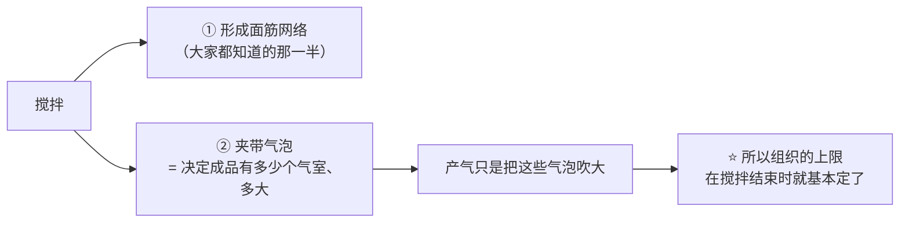
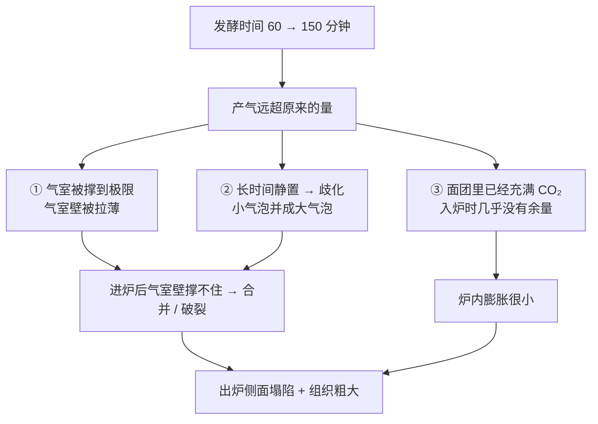
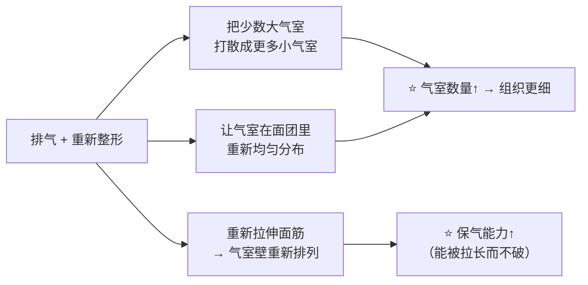

# 第 10 章 思考题参考答案

> 只记「问题 + 正确答案」。案例题给**完整推理链**——
> "气从哪来 → 什么时候来 → 被谁关住 → 什么时候定住 → 怎么验证"。
>
> 涉及数字的地方，来源见[参考书目与出处登记](../standards.md)。

## Q1

**问**：用自己的话写出本章的模型（三个环节），并说明为什么"定型"要算作模型的一部分。

**答**：

> **膨发 = 产气 × 保气，而定型时刻决定这场比赛什么时候结束。**

| 环节 | 它回答什么 | 主要变量 |
|------|----------|---------|
| **① 产气** | 气从哪来、什么时候来 | 气源种类（生物 / 化学 / 打发 / 蒸汽）、温度、时间、抑制因素 |
| **② 保气** | 气泡壁撑不撑得住、气会不会并起来或跑掉 | 面筋网络、液膜、面糊黏度、整形、醒发程度 |
| **③ 定型** | 什么时候不能再变形了 | 淀粉糊化温度、蛋白质交联、配方（糖、油、水）、炉温 |

**为什么定型必须算进模型**：

因为**前两环节只在定型之前有效**。结构一旦定住：

- 再多的气也**顶不大**，只能把已经定住的表面**顶裂**；
- 还没来得及涨的部分**永远不会再涨**。

反过来，定型**太晚**同样是问题：气撑到极限还没定住，气室壁破裂，成品塌。
所以"定型时刻"不是烘烤的副产品，而是**你可以通过配方提前调的一个旋钮**——
第 4 章讲过糖会**抬高糊化温度、推迟定型**，第 5 章讲过油脂改变结构形成。

> **要带走的判断**：**膨发问题永远是"三件事的相对时间"问题，不是"量"的问题。**

## Q2

**问**：为什么"膨松剂产生气泡"不准确？给出两项不同类型的证据，并说明它如何改变你对搅拌的看法。

**答**：

准确的说法是：**膨松剂产生气体；气体主要进入搅拌时已经被夹带进去的气泡。**

**两项不同类型的证据**：

| 证据 | 类型 | 内容 |
|------|------|------|
| 一篇 2023 年关于面团气泡的综述 | **文献综述** | 把气泡的行为拆成**夹带、脱离、破碎、歧化、长大、合并**——整套词汇里**没有"凭空产生"**；并指出面粉、水、盐与**搅拌条件**决定气泡的卷入与稳定 |
| 一项用低强度超声研究面团的工作 | **实验** | 面团分别在常压与**真空**下搅拌，真空的目的正是"**尽量减少气泡成核**"；常压搅拌时间越长卷进的气泡越多，超声速度从 165 m/s 降到 105 m/s |

**它怎么改变你对搅拌的看法**：

> **要带走的判断**：**换搅拌方式 = 换成品组织**，哪怕配方一个字没改。
> 这也是第 22 章要讲六种搅拌法的原因。

## Q3

**问**：气室数量在面包心形成结束时比初始减少 55%~67%，为什么说明"组织粗大"通常不是"气太多"？

**答**：

因为这个数字说明：**成品的气室数量是一路"减少"出来的，而不是"增加"出来的。**

一项同时测量体积、压力与黏度的研究观察到：

- 膨胀最剧烈的时候，气室数量**每秒减少 2%~3%**；
- 到面包心形成结束，气室数量比初始**减少了 55%~67%**。

气并没有消失，**它们并到一起了**。于是同样多的气装在**更少的气室**里 → 每个气室更大 → 组织更粗。

**推论（很实用）**：

| 你想要 | 该动的旋钮 |
|--------|----------|
| 组织更细 | 减少**合并**：整形时排气并重新排布、别静置过久（歧化）、让气室壁更能被拉长而不破 |
| 组织更粗（欧包的大孔） | 允许更多合并：高含水量、少排气、长时间发酵 |

> **要带走的判断**：**孔洞大小是"气室数量"的问题，不是"气体总量"的问题。**
> 想要细组织时**加膨松剂是南辕北辙**——气更多只会让合并更快。

## Q4

**问（案例）**：吐司配方（**以面粉总量为 100%**）面粉 100%、水 65%、糖 8%、盐 1.8%、
速发干酵母 1%、黄油 6%。发酵从 60 分钟延长到 150 分钟，面团长到三倍多，
结果进炉几乎不涨、出炉侧面塌陷、组织粗大、有酒味。

**答**：

**（a）问题在"保气"，而且是**过度产气**把保气拖垮的。**

推理链：

判断依据（对应正文 10.6 的表）：**发酵阶段长得很好、一进炉就不涨甚至塌** → 保气 / 定型那一行。

**（b）可以直接解释"进炉后几乎没再涨"的研究**：

那项用化学膨松系统（碳酸氢钠 + 葡萄糖酸-δ-内酯）替代酵母的研究发现：
**面团膨胀既不受 CO₂ 的量限制，也不受释放动力学限制**；受限的是**烘烤阶段能否继续充气**，
而且**初始 CO₂ 体积过高会损害炉内膨胀**。

另一项醒发程度研究给的是同一个方向：比容在中间某点最大，**越过之后急剧下降**，
并伴随质地变硬与**皮芯分离**。

"有酒味"是另一条线索：**乙醇是酵母代谢的另一个产物**，
积累到能闻出来，说明发酵走得比他以为的远得多。

**（c）该改哪一个变量，以及两种改法的差别**：

| 改法 | 它改的是什么 | 代价 / 适用 |
|------|------------|-----------|
| **缩短发酵时间**（回到峰值附近） | 只改**终点**，产气速率不变 | 最直接；但如果他当初嫌"太慢"，问题没解决 |
| **减少酵母用量 + 保持长时间** | 改的是**速率**，让同样的时间里产气更慢 | 时间变长，**风味会不一样**（第 11 章：同样发到等高，温度与酵母量不同，香气谱不同）；对安排时间反而有利 |

> **关键在于**：他原本抱怨的是"发得慢"，而**延长时间并没有让产气更快，只是让它走得更远**。
> **"慢"要靠温度和酵母量解决，不能靠时间解决**——时间只会把你推过峰值。
>
> **怎么验证**：下一次做三份，分别发 60 / 90 / 120 分钟，
> 记录**入炉前高度**与**炉内涨幅**两列（见正文 🅑 任务三）。
> 炉内涨幅最大的那一组，就是他的峰值附近。

## Q5

**问（案例）**：A 整形时"尽量不排气"，结果孔洞大而不均、底部有空腔；B 正常排气，组织细密。
为什么？"排气"在模型里改了什么？

**答**：

**A 的错误在于把"气的总量"当成了目标，而组织由"气室的数量与分布"决定。**

不排气的后果：

| 后果 | 机制 |
|------|------|
| 大气室被**原样保留**到成品里 | 发酵阶段已经通过歧化与合并形成了若干很大的气室，不排气 = 直接把它们带进烤箱 |
| 气室分布**不均匀** | 面团里有的地方气多、有的地方气少，没有被重新排布过 |
| 底部空腔 | 大气室上浮 / 整形时被包进去的空腔没有被压掉，烘烤时继续膨胀 |

**排气在模型里改了什么**：

注意：**排掉的气会被重新产出来**（酵母还在工作），
但**被打散的大气室不会自己重新聚回去**——这就是排气"划算"的原因。

> **要带走的判断**：**整形不是"造型"，它是你对气室分布的最后一次干预。**
> 想要大孔洞（欧包）就少排、轻拿；想要细密均匀（吐司）就认真排气、认真整形。
> **两者都对，取决于你要哪一种成品。**

## Q6

**问（辨析）**："面团越强越能保气"——判断证据强度，说明"强"掩盖了哪两个性质。

**答**：**⚠️ 有争议 / 不完整。**

一项研究给出了两条方向不同的对应：

| 指标 | 与成品的关系 | 它描述的是 |
|------|------------|-----------|
| **双轴拉伸黏度** | 与**比容呈反向关系**（越黏稠，成品越小） | "硬"、"稠"、难被吹大 |
| **应变硬化指数** | 与**面包心细腻度**相关 | 被拉长时**自己变硬**，于是不容易在某一点被拉穿 |

所以"强"至少混了两件事：

1. **硬 / 稠**——抵抗变形。太硬 → 气吹不动它 → 成品小；
2. **能被拉长而不破 + 拉长时会自己变硬**——这才是保气真正需要的性质。

**可观察的判据（不用仪器）**：

| 性质 | 在厨房里怎么看 |
|------|--------------|
| 硬 / 稠 | 手指按下去回弹很快、面团很难摊开、擀的时候明显回缩 |
| 能拉长而不破 | 慢慢拉开一小块，能拉成薄片而**不是突然断裂**；边缘破口是"撕开"还是"脆断" |

> **怎么验证**：同一份配方，把水量改一档（例如从 60% 改到 65%，**以面粉总量为 100%**），
> 其余不变，比较两组的"能拉多长才破"和成品孔洞。
> **加水会同时改变这两个性质，所以要记录的是两者的变化方向，而不是哪个更好。**

## Q7

**问（辨析）**："气泡全部来自搅拌"——本章既用它解释现象，又说它"过头了"。两者如何并存？

**答**：

**这是一个关于"主要机制"和"绝对断言"之间距离的问题。**

| 层面 | 本书的写法 | 依据 |
|------|----------|------|
| **主要机制**（可以用来做判断） | 面团里的气泡**绝大多数来自搅拌时的夹带**；产气主要是把它们吹大 | 2023 年综述的词汇表里没有"凭空产生"；超声研究用真空搅拌来"尽量减少气泡成核" |
| **绝对断言**（不能写） | "烘烤中不会有新气泡" | 一项研究在烘烤膨胀初期算出**负的合并速率**，即**有新气室成核**，气室数量增加多达 8% |

**为什么本书坚持这样写**：

> 因为这本书的读者会**照着书里的判断去改配方**。
> 一条"主要机制"能帮你找对方向（改搅拌）；
> 一条**绝对断言**会让你在遇到反例时**怀疑自己而不是怀疑那句话**。
>
> 这也是全书「常见说法辨析」栏目存在的理由：
> **烘焙圈流传的很多说法，错不在方向，而在于被说死了。**

> **要带走的判断**：看到"一定 / 全部 / 只要…就…"这种措辞时，
> 先问一句"**它在什么范围里成立**"。本书自己也接受这条检查。

## Q8

**问**：盐的那张表里产气量与保气系数反向。请说明"发得快"与"发得好"为什么不是一回事。

**答**：

那项 176 份样本的研究用发酵流变仪同时测了两个量（该研究的三档盐为实验设计，不是推荐值）：

| 盐 | 总产气量 | 跑掉的 CO₂ | 保气系数 |
|----|---------|-----------|---------|
| 0 | 1518 mL | 275 mL | 81.9% |
| 1.5% | 1487 mL | 218 mL | 85.4% |
| 3.0% | 1272 mL | 130 mL | 89.8% |

**两个指标朝相反方向走**：盐越多，**产的气越少**，但**留住的比例越高**。

所以：

- 只看"面团涨得快不快" → 结论是"少放盐甚至不放盐"；
- 看"留住了多少" → 结论相反。

而**成品体积取决于"留在面团里的气"**，也就是两者的**乘积**——
这正是本章模型写成 **产气 × 保气** 的原因。

同一项研究还观察到一个很生动的现象：**弱筋品种不加盐时，发酵曲线先冲高然后明显回落**
（撑不住了），加到 1.5% 后不再回落；而**强筋品种加到 3.0% 反而涨得更少**。
**同一个变量在不同体系里方向不同——这是全书反复出现的模式。**

**另一个"两个指标反向"的例子**（答案不唯一，以下供对照）：

| 例子 | 指标 A | 指标 B |
|------|-------|-------|
| 糖（第 4 章） | 加糖让饼干**摊得更大**（定型被推迟） | 同时**抬高糊化温度**，让结构更难立住 |
| 高含水量（第 3 章） | 面筋分布更均匀、比容更高 | 一项研究里含水最高的一档**发酵中面筋纤维断裂**，咀嚼性下降 |
| 醒发时间（本章） | 入炉前高度更高 | 炉内涨幅更小，越过峰值后成品更矮 |

> **要带走的判断**：**任何一个"越多越好"的说法，都要先问"用哪个指标衡量"。**
