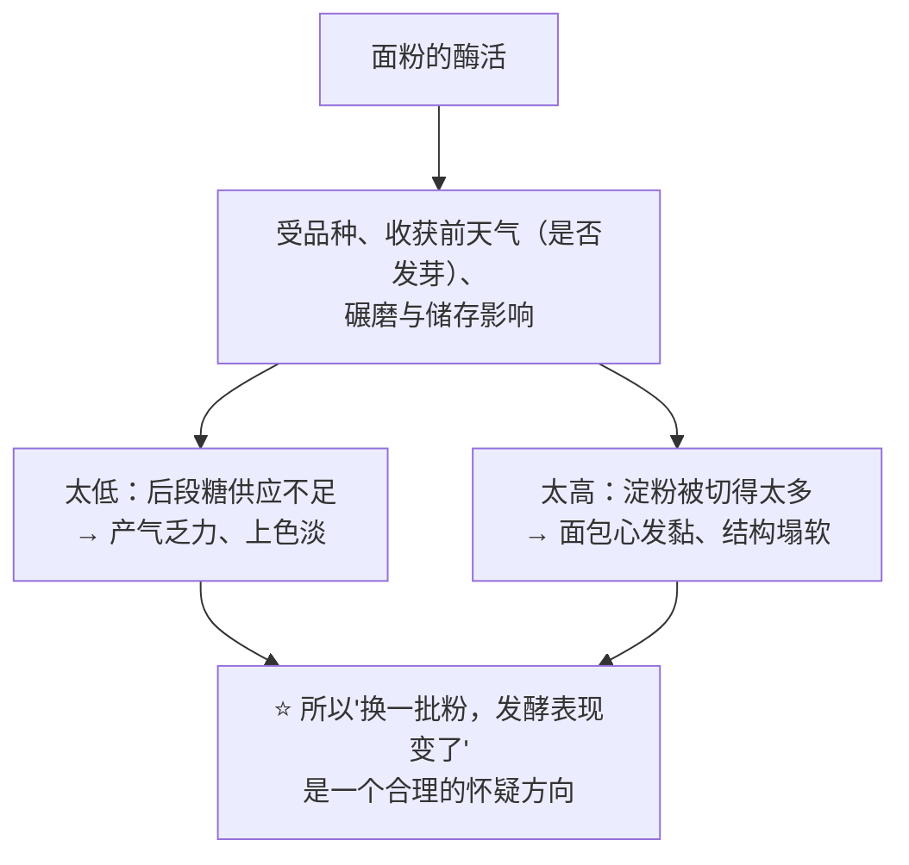
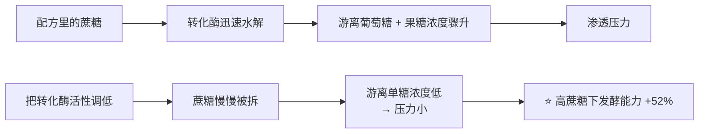
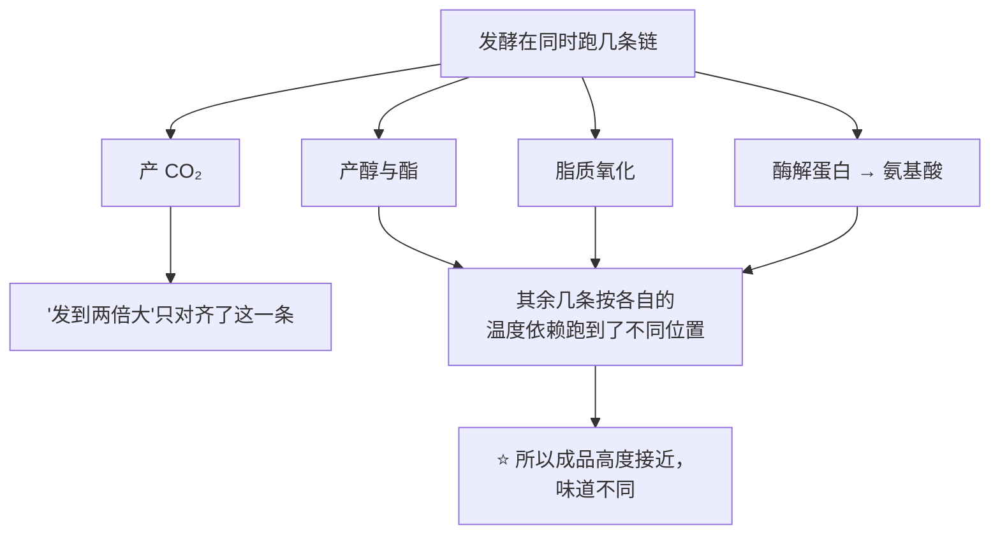

# 第 11 章 思考题参考答案

> 只记「问题 + 正确答案」。案例题给**完整推理链**——
> "它的食物是什么 → 谁在抑制它 → 时间与温度给够了吗 → 改哪一项 → 怎么验证"。
>
> 涉及数字的地方，来源见[参考书目与出处登记](../standards.md)。

## Q1

**问**：酵母在面团里同时做了哪几件事？为什么"发酵时间不是一段中性的等待"？

**答**：至少四件：

| 它做的事 | 后果 |
|---------|------|
| ① 产 **CO₂** | 进入搅拌时夹带的气泡里，把它们吹大（第 10 章） |
| ② 产**乙醇** | 大部分在烘烤中挥发；闻到明显酒味 = 发酵走得很远的信号 |
| ③ 产**风味物质与前体**，并消耗氨基酸 | 面包心里已鉴定出超过 150 种挥发物，约 45 种是有意义的香气化合物，主要来自酵母代谢与面粉脂质氧化 |
| ④ **改变面团本身** | 一项研究实测到：酵母代谢物**削弱了面筋网络**，面团强度与延展性下降 |

**为什么不是中性的等待**：

因为①和④**同时在走**。等得越久：

- 产气越多（可能已经越过峰值，第 10 章）；
- 面团被代谢物改得越多（保气能力变化）；
- 风味谱一路在变（不是"更多同样的味道"，而是**不同的味道**）。

> **要带走的判断**：**"再等一会儿"这个决定，改的从来不止是体积。**

## Q2

**问**：无糖法棍里酵母吃什么？给两条独立线索，并说明面粉酶活为什么是变量。

**答**：吃的是**面粉自带的酶把淀粉切出来的糖**。

**两条独立线索**：

| 线索 | 内容 |
|------|------|
| **法规**（官方来源） | 美国 21 CFR 137.105 允许在面粉中添加麦芽小麦粉、麦芽大麦粉（不超过 0.75%）或真菌 α-淀粉酶，理由原文是"**为补偿酶的天然不足**"。**法规愿意为它开一条口子，说明它会不足** |
| **检测方法的存在**（第 2 章） | 行业用**落降数值**常规衡量 α-淀粉酶活性（数值越低酶活越高）；一项关于软麦控制发芽的研究观察到**随发芽时间延长落降数值显著下降** |

**为什么是变量而不是常数**：

⚠️ 本书**未核到**"落降数值低于多少就不能做面包"的一手阈值，因此不写阈值。

## Q3

**问**：为什么糖既是食物又是压力？那项"降低转化酶活性反而提高发酵能力 52%"的研究说明压力来自什么？

**答**：

**食物那一面**：一项起酥点心研究实测到，配方里的蔗糖**在搅拌之后几乎已被转化酶全部水解**，
释放出的葡萄糖**至少有 23.6 ± 2.6% 在发酵期间被消耗**。

**压力那一面**：一项酵母全基因组筛选发现，对高浓度蔗糖敏感的缺失突变体
**绝大多数同时对高浓度氯化钠或山梨醇敏感**——说明高糖对酵母主要是**渗透胁迫**，
和盐是同一类问题。

**那项 52% 的研究说明了压力的来源是"浓度"，而且是"游离单糖的浓度"**：

> **要带走的判断**：**"糖多"伤害酵母的是浓度，不是糖这种物质。**
> 这解释了为什么"耐高糖酵母"是一类真实存在的产品，
> 也解释了为什么甜面团常常要用**更长的时间**而不是更多的糖来解决问题。
>
> ⚠️ 本书不给"糖到多少百分比必须换酵母"的阈值——**没有核到**。

## Q4

**问（案例）**：甜面包配方（**以面粉总量为 100%**）：面粉 100%、糖 25%、蛋 15%、
牛奶 55%、黄油 12%、盐 1%、普通速发干酵母 1%。发 60 分钟几乎没动。

**答**：

**（a）这是"产气"那一半的问题。**

依据（第 10 章 10.6 的表）：**发酵阶段体积几乎没长** → 产气那一行。
如果是保气问题，面团会先长起来、然后在进炉时出问题。

**（b）至少三条机制 + 家庭验证方法**：

| 机制 | 为什么 | 在家怎么查 |
|------|--------|----------|
| ① **渗透胁迫**：糖 25% 对普通酵母是很强的压力 | 高糖对酵母主要是渗透胁迫（全基因组筛选）；而配方里的蔗糖**在搅拌后就被转化酶拆成游离单糖**，压力立刻拉满 | 取同样的酵母做两杯：一杯清水 + 少量糖，一杯清水 + 大量糖，比较起泡速度（正文 🅐 任务二） |
| ② **时间不够**：甜面团本来就慢 | 慢是设计的必然结果，不是故障 | 继续发，每 30 分钟记一次高度，看它是"不动"还是"慢" |
| ③ **温度偏低** | 温度同时决定产气速度 | 量一下面团温度与室温；换一个更暖的地方做对照组 |
| ④ 酵母本身失活 | 干酵母保存不当 | 冒泡测试（只能看"有没有活性"，看不出"在面团里有多快"） |
| ⑤ 用错了酵母类型 | 甜面团需要耐高糖酵母 | 看包装是否标注适用于高糖面团 |

**（c）加倍酵母到 2% 的代价，以及别的改法**：

| 改法 | 效果 | 代价 |
|------|------|------|
| **酵母加倍到 2%** | 产气快了 | 一项交叉实验显示：**酵母用量提高，与酵母代谢直接相关的香气化合物普遍增加**——味道会变；同时代谢物更多，**面筋网络被削弱得更多** |
| **换耐高糖酵母** | 针对病因 | 需要买到对的产品；⚠️ 本书不给阈值，只能按包装标注选 |
| **给更多时间（并保持温暖）** | 最省钱 | 占时间；要注意别越过峰值（第 10 章） |
| **降低糖量** | 直接减压力 | **换成品了**——糖在这份配方里还管保湿、上色、口感（第 4 章） |
| **改用中种 / 预发酵**（第 22 章） | 让一部分酵母先在**低糖环境**里繁殖 | 多一步工序、多一段时间 |

> **要带走的判断**：这份配方里 **糖 25% + 普通酵母 1% + 60 分钟**是一组**不配套**的参数。
> 配套的意思是：**食物、抑制物、温度、时间这四项要互相认账。**

## Q5

**问（案例）**：A 室温 1 小时、B 冷藏过夜，都"发到两倍大"，成品高度接近但香气明显不同。

**答**：

**（a）那项交叉实验正好覆盖这个情形。**

研究把**酵母用量（2% / 4% / 6%，面粉基准）× 发酵温度（5 / 15 / 35 °C）**交叉，
关键设计是**所有面团都发酵到同样的高度**才烘烤：

| 条件 | 香气走向 |
|------|---------|
| 温度较高（15 与 35 °C） | 促进**脂质氧化**类化合物（己醛、庚醛的气味活性值最高） |
| 低温（5 °C） | 促进三种**酯类**：乙酸乙酯、己酸乙酯、辛酸乙酯 |
| 酵母用量提高 | 与酵母代谢直接相关的化合物普遍增加（2,3-丁二酮、苯乙醛气味活性最高） |

一篇面包香气综述也确认：**酵母用量与菌株、发酵温度与时间都显著影响面包心香气**。

**（b）为什么"都发到两倍大"不能让两个成品相同**：

因为"两倍大"只对齐了**一个指标：CO₂ 累积到了同样的程度**。
而发酵同时在跑**好几条化学反应链**，它们的**相对速度对温度的依赖不一样**：

**（c）B 想要 A 的香气，该改哪个变量**：改**温度**，不是改时间。

- 把发酵放回室温（提高温度）→ 走向脂质氧化类化合物那一侧；
- 如果他是为了时间安排才冷藏，可以**冷藏 + 最后一段回温发酵**——
  ⚠️ 但"回温多久"本书**没有核到**参数，得靠他自己记录（第 24 章会再谈）。

> **要带走的判断**：**冷藏发酵是一个风味决定，不只是日程决定。**

## Q6

**问（辨析）**："盐绝对不能直接接触酵母"——判断证据强度并设计对照。

**答**：**⚠️ 有争议 / 关键部分缺乏定量依据。**

**有依据的部分**：

| 结论 | 依据 |
|------|------|
| 盐会**拖慢**酵母产气 | 一项 176 份样本的研究实测：盐从 0 到 3.0%，**总产气量从 1518 mL 降到 1272 mL** |
| 机制是渗透胁迫 | 全基因组筛选显示酵母对高盐与高糖敏感的基因**大量重叠** |
| 独立旁证 | 一项丙烯酰胺研究把"盐加多了反而升高"归因于**酵母生长被抑制** |

**没有依据的部分**：

> "**直接接触会杀死酵母**"以及"**所以盐必须最后加**"——
> 本书**没有核到任何定量实验**。机制方向（局部高渗透压）与已知研究相容，
> 但"局部接触几秒钟"与"整个面团里 2% 的盐"是完全不同的两件事。
> 按**惯例 / 工艺口语**处理。

**在家能做的对照（附局限）**：

| 组 | 处理 | 记录 |
|----|------|------|
| ① | 盐与酵母**分别**加入面粉的两侧 | 发到指定高度用时、成品高度 |
| ② | 盐与酵母**先混在一起**再加水 | 同上 |
| ③ | 对照：不加盐 | 同上 |

**局限（必须写下来）**：

1. 家庭条件下**没法测产气量**，只能测"发到某个高度用了多久"，
   而这已经是**产气 × 保气**的混合结果（第 10 章）；
2. 单次实验的差异可能小于操作误差——**要重复**，且每次面团温度要记；
3. 即使 ② 比 ① 慢，也只能说明"**这个操作让它变慢了**"，**不能证明"酵母被杀死了"**。

> **要带走的判断**：**"它变慢了"和"它死了"是两个结论，需要不同的证据。**

## Q7

**问（辨析）**："干酵母和鲜酵母只是含水量不同"——判断证据强度，"对不上性能"指哪些性能？

**答**：**⚠️ 不完整。**

一项代谢组学研究比较了六个商品菌株：

| 发现 | 含义 |
|------|------|
| 鲜酵母积累**保护性氨基酸**（γ-氨基丁酸、半胱氨酸、苏氨酸），活性干酵母明显更低 | 干燥胁迫留下了**生理状态**的差别，不只是水分差别 |
| ITS 测序确认：**即使同一厂商的不同产品也是遗传上不同的菌株** | 你换的可能是**另一种酵母**，不是"同一种酵母的干燥版" |
| 某个产品特有的 **α-葡萄糖苷酶活性**对应**更强的麦芽糖利用能力** | **后段产气能力**可能不同（尤其无糖面团） |

**"对不上"的性能至少包括**：

1. **麦芽糖利用能力**——决定无糖面团后段还有没有劲；
2. **耐渗透（耐高糖）能力**——决定甜面团能不能发起来；
3. **耐热性**——一项研究显示菌株之间差别很大，且**与炉内膨胀强正相关**；
4. **香气谱**——酵母菌株显著影响面包心香气（综述结论）；
5. **复水需求**——一篇梳理 280 件专利的综述指出，**复水是干酵母存活最关键的环节**。

> **要带走的判断**：**换算表能让你算出克数，算不出表现。**
> 换酵母时按"换了一个变量"处理：用一次、记一次、比一次。

## Q8

**问**：本章在"复水温度""最佳发酵温度""高糖换酵母阈值"三处拒绝给数字。理由分别是什么？共同标准是什么？

**答**：

| 拒绝的数字 | 理由 |
|-----------|------|
| **干酵母复水温度（与是否加糖）** | 本书**未核到**家用条件下的一手实验数据。已核到的只有方向："**复水是干酵母存活最关键的环节**"（280 件专利 + 212 篇论文的综述）。方向能写，数字不能编——正确做法是**按你那包产品的说明，并把它记下来** |
| **"最佳发酵温度"** | 文献里出现的温度（例如某项研究的 30~50 °C、另一项的 5 / 15 / 35 °C）都是**实验设计**，不是推荐值；而且这两项研究关心的根本不是同一件事（一个测失气时刻，一个测香气）。**把实验设计当成推荐值，是本书最想避免的错误之一** |
| **"糖超过多少百分比必须换耐高糖酵母"** | 未核到阈值。而且从机制上看，这个阈值**不可能是一个数**——它取决于糖的种类（被拆成游离单糖的速度）、酵母菌株的耐受性、温度与时间。**给一个数字等于假装这些变量不存在** |

**共同的判断标准**（本书的第一原则之一）：

> ## 一个数字能不能写，取决于**它离开上下文之后还成不成立**。
>
> - 如果它是**某项实验的设计参数**（"我们测了 30、35、40 °C"）→ **不能**当推荐值；
> - 如果它需要**读者手上没有的输入**（那罐酵母的菌株特性、那罐泡打粉的中和值）→ **不能**给；
> - 如果它**依赖多个互相作用的变量**→ 只能写方向 + 自建记录的方法。

**并且本书给替代品**：每一处拒绝数字的地方，都配一条**可执行的判据或记录方法**——
这才是这本书希望你带走的东西：**不是别人的数字，是你自己的那一套。**
