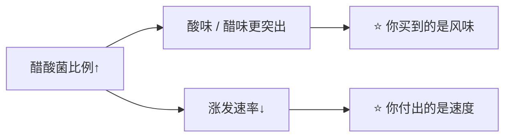

# 第 12 章 思考题参考答案

> 只记「问题 + 正确答案」。案例题给**完整推理链**——
> "气那条线走到哪了 → 酸那条线走到哪了 → 谁被改了 → 改哪一项 → 怎么验证"。
>
> 涉及数字的地方，来源见[参考书目与出处登记](../standards.md)。

## Q1

**问**：酵种里的三类微生物分别产什么、买给你什么？为什么说"产气那一半和第 11 章是同一套机制"？

**答**：

| 角色 | 产物 | 买给你什么 |
|------|------|-----------|
| **酵母**（多为野生种） | CO₂、乙醇、风味物质 | **产气**（膨发） |
| **乳酸菌（LAB）** | 乳酸、乙酸、胞外多糖、肽与氨基酸 | **酸**、风味、保存期、面团性质改变 |
| **醋酸菌（AAB）** | 乙酸等 | 醋味、更强的酸化；一项 500 份研究显示它还与**涨发速率负相关** |

**为什么产气那一半是同一套机制**：

因为**产气的仍然是酵母**——只是换成了野生的、你没挑过的菌株。
一项追踪一个月的研究显示：某一类野生酵母（*Kazachstania* 属）
**迅速上升为优势酵母，而且与面粉类型和喂养频率都无关**。

所以第 11 章讲的那些旋钮（温度、食物、渗透压力、时间）**在酵种里同样成立**，
只是你**对菌株没有选择权**——这正是酵种的"不可控"来源。

> **要带走的判断**：酵种 = **第 11 章的酵母 + 一群产酸的邻居**。
> 多出来的那部分，全在"酸"这条线上。

## Q2

**问**：共同园实验里醋酸菌比例与涨发速率是什么关系？为什么支持"买的是酸与时间"？

**答**：

研究者从 500 份酵种里挑出 40 份，用**同一批灭菌面粉和水**接种，视频追踪 36 小时：

| 结果 | 数据 |
|------|------|
| 涨发速率范围 | **0.1~1.5 mm/hr**（相差十几倍） |
| 接种源解释的变异 | 涨发速率 **42%**、最大高度 **22%** |
| 醋酸菌比例与平均涨发速率 | **负相关**，ρ = **−0.51**（p<0.001） |
| 醋酸菌比例与挥发物组成 | 强相关，Mantel ρ = **0.73**（p<0.001），最突出的是"**醋**"这个气味描述 |

**为什么这支持本章的结论**：

也就是说，在这批样本里，**"更酸"和"更能发"是朝相反方向走的**。
所以"换成酵种是为了发得更好"这个动机**站不住**；
成立的动机是**风味、酸度、保存期**，代价是**时间**。

⚠️ **别外推**：该实验测的是**标准化基质中的涨发速率**，
不是"酵种面包的最终体积"。成品体积还取决于保气与工艺（第 10、40 章）。

## Q3

**问**：那项 500 份研究如何反驳"酵种有地域性"？作者承认了哪两条局限？本书为什么要写局限？

**答**：

**反驳的方式**：

| 做法 | 结果 |
|------|------|
| 向四大洲的社区科学家征集 **500 份**酵种并测序 | 研究者明确写道：**综合采样表明地理位置不决定酵种的微生物组成** |
| 用"距离—衰减"框架分析地理因素 | 地理、工艺参数与非生物因素**都是很差的预测变量** |
| 用体外**合成群落**重现共存关系 | 8 例显著共存关系中**重现了 7 例** → 塑造群落的是**菌与菌的相互作用** |
| 对"旧金山酵种"这一著名说法 | 作者推测原因是**酵种与面粉都在大范围流动**，造成地理上的同质化 |

**作者自陈的两条局限**：

1. **分辨率**：他们用扩增子测序做**物种层面**的分析，
   而**菌株层面的多样性**在很多发酵食品里很重要，这种方法**分辨不出来**；
2. **空间尺度**：**更精细的空间尺度**上可能仍然存在地理结构，该研究没有覆盖。

**本书为什么把局限一起写出来**：

> 因为这本书要读者带走的不是"结论"，而是"**结论成立的范围**"。
> 只写"地理不影响酵种"，读者下次遇到一篇讲某地特有菌株的研究就会无所适从；
> 写上局限，读者就知道这两者**并不矛盾**——一个讲物种层面的大尺度，一个可能讲菌株层面。
>
> 这也是全书辨析栏的统一做法：**错的往往不是方向，是"被说死了"。**

## Q4

**问（案例）**：酵种欧包（**以面粉总量为 100%**）：面粉 100%、水 75%、盐 2%、成熟酵种 20%。
一发从 4 小时延长到 9 小时，结果面团摊开、黏手、整形不成形，成品扁、孔洞乱、酸得发苦。

**答**：

**（a）两条时间线的分析**：

| 线 | 走到哪了 | 证据 |
|----|---------|------|
| **气** | 很可能**越过了峰值** | 成品扁、孔洞乱：气室被撑到极限后**合并 / 破裂**（第 10 章：气室数量在成品形成中减少 55%~67%；初始 CO₂ 过高**损害炉内膨胀**） |
| **酸** | **明显走过头** | 酸得发苦、面团黏手摊开——酸同时在改变面团 |

**（b）"黏手、摊开"的机制（至少两条）**：

1. **蛋白水解**：酵种发酵中的蛋白水解会**修饰面筋**（综述结论）；
   而小麦粉自身的蛋白酶**在酸化与还原条件下活性最高**（另一项研究），
   所以**酸越久 → 面筋被切得越多 → 网络撑不住 → 摊开**；
2. **过度发酵导致的结构损伤**：气室壁被长时间撑着，网络被拉过头，
   第 10 章那条"越过峰值是断崖"在这里表现为**面团失去弹性**；
3. （补充）**含水量本来就高**（75%），面筋一旦被削弱，**摊开会更明显**——
   高含水量放大了前两条的后果（第 3 章）。

**（c）想更酸，代价更小的两种改法**：

| 改法 | 为什么代价更小 | 取舍 |
|------|-------------|------|
| **降低温度 + 保持时长**（或冷藏延长） | 低温下**产气与产酸的相对速度改变**，可以在不把面筋泡坏的前提下积累风味 | ⚠️ 具体参数本书没有核到，需要**自己记录**；冷藏也会改变香气构成（第 11 章） |
| **提高酵种用量、缩短时长** | 酸的"起点"更高，但面团**暴露在酸里的总时间更短** | 酵种带进来的粉水要重新折算（第 9 章）；风味走向会变 |
| **调整酵种本身**（喂养节奏 / 面粉 / 温度，改变乳酸与乙酸的比例） | 从源头改 FQ | 见效慢，要按天计；⚠️ 本书不给"怎么调能得到多少 FQ"的参数 |

> **不推荐的那条**：继续延长一发。
> **他这次的失败正是"用时间换酸"的账单**——酸确实来了，面筋也一起没了。

## Q5

**问（案例）**：A 把酵种分给 B，三周后 B 说"到我这儿就不一样了"。两种情形各是什么？怎么检查？

**答**：

**情形一：菌群真的变了。**

依据：那项 500 份研究发现**地理位置不决定组成**，但**菌与菌的相互作用**、
以及**工艺参数**（喂养节奏、面粉、温度）会塑造群落；
另一项一个月的研究发现**面粉类型影响细菌那一侧**（酵母那一侧则相对稳定）。
如果 B 换了面粉、换了喂养频率、家里温度不同，**细菌那一侧完全可能走向另一个状态**。

**情形二：菌群没怎么变，是"环境 + 操作"不同。**

同一罐酵种在 18 °C 和 28 °C 的厨房里，**峰值时间可以差出好几倍**；
B 的用量、水温、面粉吸水性、发酵终点判断都可能不同——
**成品不同，未必是菌不同。**

**两个家庭检查**：

| 想区分 | 怎么做 |
|--------|-------|
| 是不是**环境与操作**造成的 | **把变量对齐**：两人用**同一袋面粉**、同样的喂养比例、把酵种放在**同样温度**的地方（比如都放在同一台设定温度的发酵环境里），各自记录"喂完到峰值的时间"与峰值时的气味。若差异消失 → 是环境与操作 |
| 是不是**群落**变了 | 对齐之后**差异仍然存在**，尤其是**气味走向**（醋味 vs 乳酸味）持续不同 → 更可能是群落层面的差异。⚠️ 家庭条件下**无法直接验证菌群**，只能作为倾向性判断，不能下定论 |

> **要带走的判断**：**"酵种变了"是一个需要先排除环境与操作的结论。**
> 而即使真的变了，也不代表"变坏了"——那项研究显示年轻与年老酵种的**优势菌种本来就不同**。

## Q6

**问（辨析）**："酵种面包更健康"——本书为什么不评价？能说的事实是什么？

**答**：**⚠️ 本书按纪律不评价。**

**为什么不评价**：

> 本书的第四条纪律是**不做医疗 / 营养治疗建议**。
> "更健康"是一个涉及人体结局的主张，它需要的是**人体研究层面的证据**，
> 而且结论往往取决于人群、摄入量与对照——
> 这既超出这本书的范围，也超出**成分测定类研究**本身的结论范围。

**本书能说的那部分（成分与工艺层面的事实）**：

| 事实 | 出处 |
|------|------|
| 用特定乳酸菌做的酵种面包，**植酸降低 83.3%~90.7%**，对照为 **71.4%** | 一项 2022 年的酵种面包研究 |
| 酵种发酵会改变**面粉自身蛋白酶释放的氨基酸种类**（由 pH 决定） | 一项 2002 年的研究 |
| 酵种发酵会通过**蛋白水解修饰面筋** | 一篇 2008 年的综述 |
| 酵种面包在一项货架试验中**完全抑制霉菌生长**，对照 **4.4~9.2 天**发霉 | 一项 2020 年的研究 |

把这些合起来，本书能说的是一句**工艺判断**：

> ## **酵种确实改变了面粉里的东西，所以"它只是酸一点的面包"是不成立的。**
>
> 至于这些改变对人意味着什么——**请去看营养学和医学的资料，不要在这本书里找答案。**

## Q7

**问（辨析）**："酵种浮起来就能用"——判断证据强度，它测的是什么？更好的自测方法？

**答**：**缺乏证据。**

**它实际测的是什么**：

> **此刻酵种里的含气量够不够让这一小勺浮起来。** 仅此而已。

它**漏掉的**至少有三样：

1. **酸度状态**——酸走到哪儿了，浮力完全不反映；
2. **它是在上升还是已经在回落**——峰值前后含气量可能一样，状态完全不同；
3. **容器与操作的影响**——搅拌方式、取样位置、水温都会改变结果。

**更好的自测方法（本书推荐）**：

| 做法 | 为什么更好 |
|------|----------|
| **画一条"喂养后的高度曲线"**：喂完立刻在容器外贴胶带做标记，之后每小时记一次高度 | 你得到的是**峰值时间**与**峰值高度**，而不是一个是非判断 |
| 记录**峰值时的气味**与**峰值后 4 小时的气味** | 把"气"那条线和"酸"那条线分开看 |
| 每次换面粉、换季节都重测一次 | 共同园实验显示酵种之间涨发速率差十几倍；**你的那罐只能自己测** |

> **要带走的判断**：**一个是非判据（浮 / 不浮）换不来一条曲线。**
> 而你要的恰恰是曲线——因为你要决定的是"**现在用，还是再等两小时**"。

## Q8

**问**：本章在"乳酸菌与酵母的数量比""家庭酵种保存期""水质影响"三处拒绝给数字，理由是什么？和第 11 章是同一标准吗？

**答**：

| 拒绝的数字 | 理由 |
|-----------|------|
| **乳酸菌 : 酵母的通用比值**（例如流传的"100 : 1"） | 本书**没有核到**可引用的一手通用值。已核到的是**一项研究、一种谷物、一套续种流程**的计数（乳酸菌在第 5 天达 8.0 log CFU/g，酵母到第 10 天才到 5.0 log CFU/g）。**一项研究的计数不是"酵种的比例"**——只能写方向：在那项研究里乳酸菌数量远高于酵母 |
| **家庭酵种面包的保存期** | 已核到的抑霉数据来自**工业条件下的特定配方**（酵种占面团 30 g/100 g，测得未解离乳酸 36 mmol/L、乙酸 220 mmol/L）。家庭的酸浓度、水分活度、包装与卫生都不同，**外推就是编数字** |
| **水质的影响** | 本书**没有核到任何**关于水质对家庭酵种影响的可靠公开实验。注意本书的措辞：**既不推荐也不否定**——"查不到证据"不等于"证明它没用" |

**和第 11 章是不是同一个标准**：**是同一个。**

> ## 一个数字能不能写，取决于**它离开上下文之后还成不成立**。

三种典型的"不能写"：

1. **实验设计被当成推荐值**（第 11 章的"发酵温度"、本章的"续种曲线"）；
2. **需要读者手上没有的输入**（第 11 章的菌株特性、第 8 章的中和值）；
3. **从特殊条件外推到一般条件**（本章的工业货架试验 → 家庭保存期）。

而三章的做法也一致：**拒绝数字的地方，都补一条可执行的判据或记录方法**——
第 11 章是"记面团终温与峰值"，本章是"给你的酵种建一张身份卡、画一条高度曲线"。
