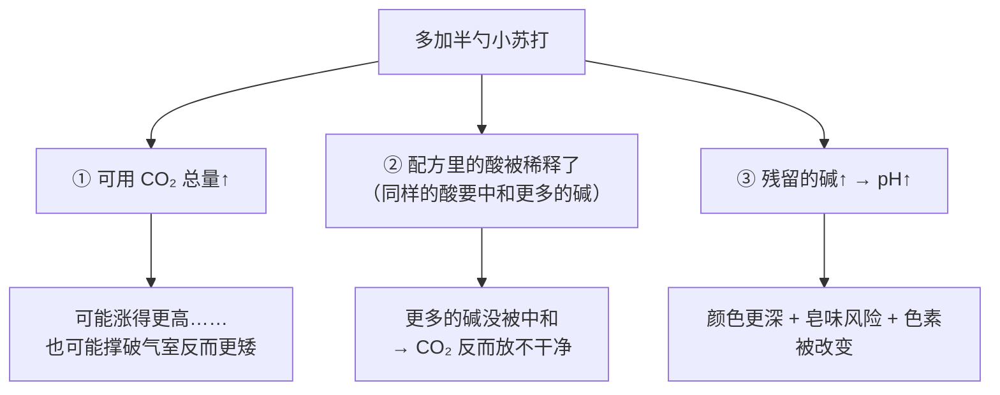
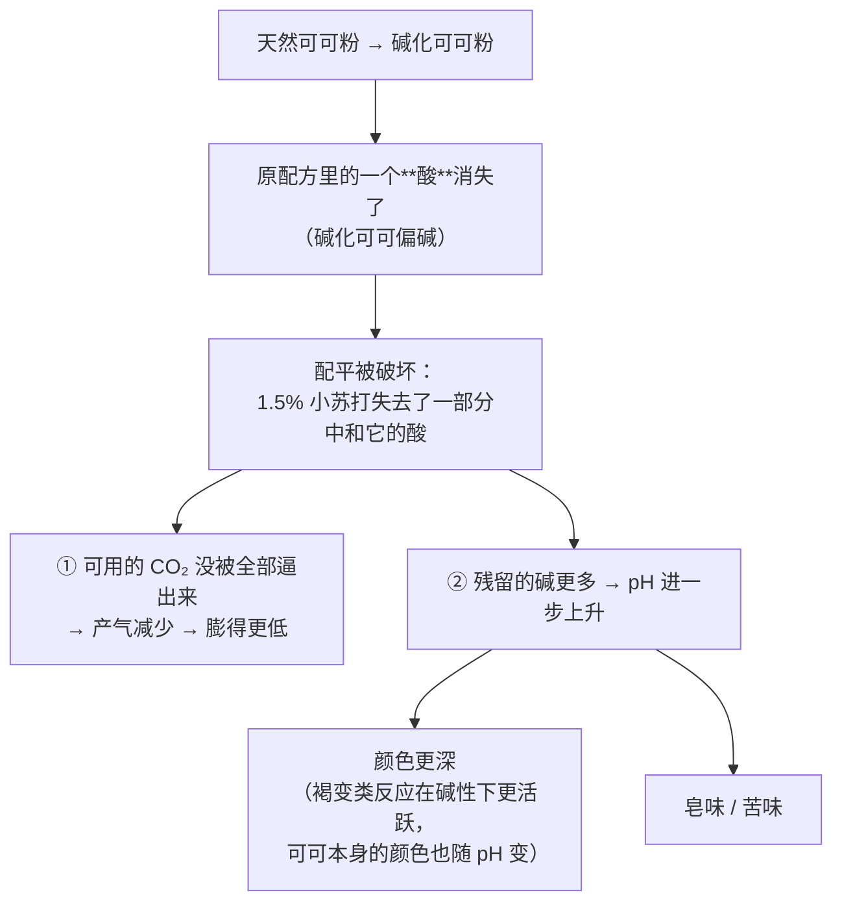

# 第 13 章 思考题参考答案

> 只记「问题 + 正确答案」。案例题给**完整推理链**——
> "碱有没有酸配 → 气留给烤箱多少 → 剩下什么 → 改哪一项 → 怎么验证"。
>
> 涉及数字的地方，来源见[参考书目与出处登记](../standards.md)。

## Q1

**问**：化学膨松的"三个问题"是什么？为什么"多放半勺小苏打"不可能只改其中一个？

**答**：

| 问题 | 由谁决定 | 表现在成品上 |
|------|---------|------------|
| **① 放多少气** | 碱的量 × 酸够不够把它逼出来 | 体积、气孔 |
| **② 什么时候放** | 用的是快作用酸还是慢作用酸（留给烤箱多少） | "要不要马上入炉"、能不能冷藏 |
| **③ 剩下什么** | 反应后的残留盐与 pH | 颜色、皂味 / 苦味 / 咸味、对 pH 敏感的色素与风味 |

**为什么不能只改一个**：

因为这三件事**由同一组配比决定**。多加半勺碳酸氢钠：

> **要带走的判断**：**化学膨松剂不是"体积调节旋钮"，它是一组配平。**
> 想单独调体积，通常要**同时**调酸——或者干脆去调保气那一半（第 10 章）。

## Q2

**问**：那项"等中和量配四种酸"的研究得到"比容与实际产气量基本呈线性"，斜率代表什么？

**答**：

**斜率代表这份面团的"抓气能力"，也就是保气那一半。**

研究设计：碳酸氢钠 1.4~4.2 g / 100 g 面粉（写明以面粉为基准），
分别配**等中和量**的葡萄糖酸-δ-内酯、酒石酸氢钾、己二酸、酸式焦磷酸钠，
用数字图像分析测面团的动态比容，同时**独立测量实际放出的气量**。
结果：面团空隙率跨越 **5%~67%**，而**末期比容与实际产气量基本呈线性**。

把这条线性关系写成本书的模型：

| 图上的量 | 模型里的角色 |
|---------|------------|
| 横轴：实际放出的气量 | **产气**（由碱 × 酸的配平决定） |
| 斜率 | **保气**（由面团本身决定） |
| 纵轴：面团比容 | 你看到的"发起来了" |

> ## **产气 × 保气 = 体积**，在这项研究里被画成了一条直线。

**它为什么重要**：因为它说明了**调膨松剂只能动横轴**。
两份面团哪怕放出同样多的气，**斜率不同，结果就不同**——
而斜率取决于面糊稠度、面筋、油脂、蛋白质这些**配方与操作**的事（第三、四部分）。

## Q3

**问**：为什么"太少"和"太多"都会给出大而不均匀的气孔？

**答**：

关键是第 10 章那句话：**气孔大小取决于"气室数量"，不取决于"气体总量"。**

| 情形 | 发生了什么 | 结果 |
|------|----------|------|
| **用量太少** | 产气不足以把搅拌时夹带进来的**大量小气室**都吹起来；只有少数几个长大 | **几个大孔 + 一片密实**，组织不均匀 |
| **用量合适** | 大部分气室都被均匀地充起来 | 细密均匀 |
| **用量太多** | 气室被撑破、**合并**加速（成品形成过程中气室数量本来就会减少 55%~67%） | 又是大孔，而且**比容反而下降**、可能塌 |

一项磅蛋糕研究的实测正好覆盖两端：**用量偏低时出现大而不均匀的气孔**；
提高用量确实提高面糊比容与孔隙率，但**接近该研究最高档（4.52%）时反而下降**。
⚠️ 该研究百分比基准本书未核到明确写法，**只引用方向**。

> **要带走的判断**：**看到大气孔，先做"上下各一档"的对照，不要默认是放少了。**

## Q4

**问（案例）**：巧克力马芬（**以面粉总量为 100%**）：面粉 100%、天然可可粉 20%、糖 60%、
油 40%、全蛋 40%、酪乳 90%、小苏打 1.5%、泡打粉 1%。
把**天然可可粉换成碱化可可粉**，结果膨得更低、颜色更深、有苦味。

**答**：

**（a）完整推理链**：

关键依据：

| 结论 | 出处 |
|------|------|
| **碱化处理极大地改变可可粉的 pH 与颜色**，与产地、制法无关 | 一项分析 59 份欧洲市场可可粉的研究 |
| 单用（未被中和的）碳酸氢钠会导致 **CO₂ 释放不充分并使碱性上升**，表现为**皂味与发黄** | 一项关于泡打粉与膨松酸的研究 |
| 高 pH 会让成品**颜色变深**，改用泡打粉后颜色更浅、**但高度也更低** | 一项关于可可制品的研究 |

⚠️ 注意配方里还有 **酪乳 90%**，它仍然是一个酸。所以这不是"酸全没了"，
而是"**酸变少了，配平偏向碱那一侧**"——症状因此是"偏"，不是"废"。

**（b）苦味最可能来自什么**：**未被中和的碱残留**（以及它带来的风味变化）。
本章引的研究把"皂味与发黄"直接写成单用碳酸氢钠的典型表现；
另一项研究还观察到碱性面团会**变绿**——都指向同一个原因：**pH**。

**（c）至少两种改法与代价**：

| 改法 | 原理 | 代价 |
|------|------|------|
| **减少小苏打**（例如把一部分换成泡打粉） | 让碱的量回到"现有的酸能中和"的水平 | 总产气会变；需要试两三次；⚠️ 本书**不给换算比例**（要中和值） |
| **换回天然可可粉** | 把那个酸还回来 | 颜色会变浅、可可风味走向不同——**这本来就是两种原料** |
| **补一个酸**（例如增加酪乳比例，或加一点塔塔粉 / 柠檬汁） | 直接补上被拿走的那一半配平 | 加酪乳同时改了**含水量与脂肪**（第 3、9 章）；加柠檬汁会带来可察觉的风味；⚠️ 用量本书不给 |

> **要带走的判断**：**"换一种可可粉"是一次配平改动，不是一次风味改动。**
> 同理的还有：换红糖、换蜂蜜、换酸奶——**凡是酸性或碱性原料，换它就是在改配平。**

## Q5

**问（案例）**：司康要求"拌好立刻入炉"，某人放了 40 分钟，结果矮、底部密实、表面有大洞。

**答**：

**（a）这是"② 什么时候放"那一问。**

他那罐泡打粉的**面团反应速率（DRR）偏快**：相当一部分可用 CO₂ 在**台面上**就放掉了。

| 症状 | 机制 |
|------|------|
| 明显矮 | 进炉时剩下的可用气少了，炉内没有余量 |
| 底部密实 | 台面上产生的气**从上表面跑掉**，底部的气室没被充起来 |
| 表面有几个大洞 | 少数气室拿到了大部分气（气室数量少 → 孔大），第 10 章那条"太少也给大孔" |

顺带：静置期间面糊本身也在变（面粉继续吸水、面筋松弛），
所以严格说这 40 分钟改了**不止一个变量**。

**（b）如果用的是慢作用酸**：

留给烘烤阶段的比例更高（行业里用牌号标出来：SAPP 10 / 28 / 40 分别约
10% / 28% / 40% 的可用 CO₂ 在搅拌阶段放出），
所以**损失会小得多**——这正是"能不能冷藏面团"取决于用了哪种酸的原因。

⚠️ 但也不会毫无变化：静置期间的水合与松弛照样发生。

**（c）不看包装估快慢的实验**：

同一份面糊分三份，**只改静置时间**：

| 组 | 处理 | 记录 |
|----|------|------|
| ① | 拌好立刻入炉 | 成品高度（mm）、组织 |
| ② | 静置 20 分钟 | 同上 |
| ③ | 静置 60 分钟 | 同上 |

**怎么读**：

- ③ 与 ① **差距小** → 偏慢作用，留给烤箱的气多；
- ③ 与 ① **差距大** → 偏快作用，尽快入炉是硬要求。

**局限（一定要写下来）**：静置期间面糊还在发生别的变化，
**差异不能全部归因于膨松剂**；它给方向，不给定量。

> **要带走的判断**：包装上没写的信息，**可以用一次对照实验逼近**——
> 这比在网上找"某某牌是快是慢"靠谱得多。

## Q6

**问（辨析）**："加了醋马上冒泡，说明这罐泡打粉是好的"——判断证据强度。

**答**：**⚠️ 只测到一半。**

| 它测到了 | 它漏掉了 |
|---------|---------|
| 罐子里**还有能反应的碱** | **留给烘烤阶段的那部分**还在不在——而这恰恰是双效泡打粉的主要价值 |
| 反应能进行（没有完全受潮失效） | 快 / 慢作用的**比例**有没有被改变 |

**为什么会漏掉**：化学膨松剂失效的主要机制是**吸潮导致碱与酸在罐子里提前反应**
（这也是要加中性填料与抗结剂的原因，见一篇梳理约 160 件专利的综述）。
提前反应掉的那部分气**在罐子里就跑了**；剩下的是一个**比例被改变**的体系——
它仍然会冒泡，**但留给烤箱的那份可能已经少了**。

**更好的判据**：做 Q5 那个**静置对照**，并且**用成品高度**（而不是杯子里的泡沫）来判断。
也就是说：

> ## 判断膨松剂，要看它在**烤箱里**还剩多少，而不是在**杯子里**能冒多少。

⚠️ 本书**不给**膨松剂的保质期数字——家庭储存条件下的失效速率**未核到**。

## Q7

**问（辨析）**："换一种酸只是换个酸味"——判断证据强度，列出连带改变的三件事。

**答**：**❌ 明确错误。** 换酸至少连带改变三件事：

| 改变 | 依据 |
|------|------|
| **① 能不能把碱中和干净**（中和值不同） | 中和值的定义就是"100 份酸能中和多少份碳酸氢钠"；一项磅蛋糕研究还发现**两种 SAPP 在中和是否充分上表现不同**，并**影响面糊 pH** |
| **② 什么时候放气**（快 / 慢作用） | 行业用牌号标出留给烘烤的比例（SAPP 10 / 28 / 40）；工业上专门测**面团反应速率（DRR）** |
| **③ 成品的表现** | 一项用**等中和量**配四种不同酸（葡萄糖酸-δ-内酯、塔塔粉、己二酸、SAPP）的研究显示，面团**空隙率从 5% 跨到 67%**；另一项只换膨松剂的饼干研究显示**质地、脆裂性、摊开程度与挥发性风味都不同**（第 8 章） |

**第四件（家庭尤其容易忽略）**：很多"酸"同时还是别的东西——
酪乳是**液体 + 乳制品**，天然可可是**干性原料**，红糖是**糖**。
换掉它，你同时改了含水量、脂肪、结构原料的量（第 3、9 章）。

> **要带走的判断**：**在化学膨松的配方里，"酸"是一个功能位，不是一个味道。**

## Q8

**问**：本章引用 1.4%~4.2%（碳酸氢钠，面粉基准）与 4.52%（泡打粉）两个数字却都不作推荐用量。理由相同吗？判断标准是什么？

**答**：**理由不完全相同——这正是值得分辨的地方。**

| 数字 | 它是什么 | 为什么不能当推荐用量 |
|------|---------|-------------------|
| **1.4~4.2 g / 100 g 面粉**（碳酸氢钠） | 一项研究的**实验设计范围**，**基准写明了**（以面粉计） | 它是为了"让空隙率覆盖 5%~67% 这一大段"而设计的扫描范围，**目的是拉开差距**，不是找最优。基准清楚，所以**可以引用它的写法**，但不能引用它的"值" |
| **4.52%**（泡打粉） | 一项响应面研究里的**最高档** | 两个问题叠加：① 它同样是实验设计的**边界值**；② 该研究的**百分比基准本书未核到明确写法**——**基准不明的百分比不能引用为数值** |

**本书的判断标准（与第 9 章的读数纪律一致）**：

> ## 一个百分比能不能引用，先问两句：
> ## **① 以什么为 100%？② 它是实验设计，还是结论？**

| 情况 | 本书怎么处理 |
|------|------------|
| 基准写明 + 是结论 | 可以引用数值（并注明出处与条件） |
| 基准写明 + 是实验设计 | 只引用**写法与方向**，明确标注"不是推荐值"（本章的 1.4%~4.2%） |
| **基准不明** | **不引用数值**，只引用方向（本章的 4.52%、第 1 章那项糖酥饼干研究的 17.6%~31.2%） |

> **要带走的判断**：**"文献里有这个数字"不等于"这个数字可以用"。**
> 这本书宁可少给一个数字，也不给一个**离开上下文就不成立**的数字。
